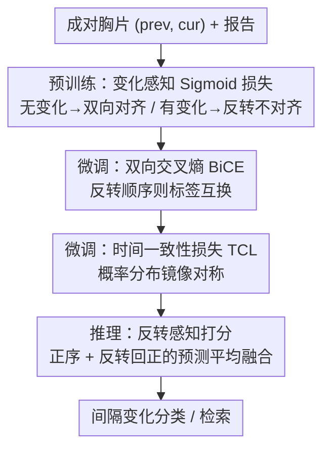

# Temporal Inversion for Learning Interval Change in Chest X-Rays

**会议**: CVPR 2026  
**论文**: [CVF Open Access](https://openaccess.thecvf.com/content/CVPR2026/html/Ko_Temporal_Inversion_for_Learning_Interval_Change_in_Chest_X-Rays_CVPR_2026_paper.html)  
**代码**: 待确认  
**领域**: 医学图像  
**关键词**: 胸片, 时序变化, 视觉语言预训练, 时间反转, 方向一致性

## 一句话总结
TILA 用"把成对胸片前后调换顺序（时间反转）"作为监督信号，在预训练/微调/推理三个阶段都加上反转感知目标，让现有时序视觉语言模型真正学会判断病灶是"变好还是变坏"，而不是只识别有没有病灶。

## 研究背景与动机
**领域现状**：CLIP/SigLIP 这类视觉语言预训练（VLP）在检索和零样本分类上很强，医学 VLP 也开始把视觉-文本对齐迁到临床域做疾病分类和定位。针对成对胸片，已有 BioViL-T、ALTA、TempA-VLP 等多图编码器试图建模时序上下文。

**现有痛点**：放射科医生读片的核心任务是把当前片子和最近的既往片子对比、判断**间隔变化**（improving / stable / worsening / resolving / new），但大多数医学 VLP 仍把单张胸片孤立分析，忽略了"对比"这一临床本质。即使有时序编码器，评估也很弱——多数研究只用一个 progression 标签，根本看不出模型是否真的抓到了"变化的方向"。

**核心矛盾**：progression 标签本身是带噪声的（"stable"和临界 case 标注极不一致），导致中等的分类分数不能说明模型真懂时序——它很可能只是靠"识别病灶是否存在"或者瞎蒙对的。模型可能根本没学会方向性推理。

**本文目标**：(1) 给模型注入对时间顺序敏感的方向性表示；(2) 设计一套能真正度量"顺序敏感性 / 反转一致性"的评估协议，而不是只看一个 progression 准确率。

**切入角度**：把成对图像的顺序反转、并交换对应标签，去测模型预测是否在两个时间方向上保持逻辑一致。虽然临床上反转不总是严格对称（康复未必精确镜像恶化），但很多影像表现（积液量、气胸大小、实变范围）在大小/密度/范围上近似可逆——所以时间反转是一个很好的"压力测试"，能给出超越标签先验的时序推理证据。

**核心 idea**：用"时间反转"贯穿训练和推理当监督信号，让模型对方向变化更敏感；TILA 不改网络结构，只加轻量损失 + 反转感知推理，可插进任意成对图像 VLP 骨干。

## 方法详解

### 整体框架
TILA（Temporal Inversion-aware Learning and Alignment）不动网络结构，给一个成对图像编码器 $f_\theta$ 和文本编码器 $g_\phi$ 在三个阶段各加一种反转感知目标：**预训练**用 Change-aware Sigmoid Loss（基于 SigLIP）区分"报告描述了变化 vs 没变化"，对没变化的 case 让原序和反转序都对齐报告、对有变化的 case 让反转序**不**对齐；**微调**用 Bidirectional Cross-Entropy（BiCE）强制标签随顺序反转而互换（improved↔worsened，stable 不变）、再用 Temporal Consistency Loss（TCL）让概率分布也镜像对称；**推理**用 inversion-aware scoring 把正序预测和"反转后再换回标签"的预测做平均融合，降低顺序偏置和方差。作者在 BioViL-T 和 ALTA 两个骨干上验证，同一套原则都能提升方向推理。

### 关键设计

**1. 变化感知 Sigmoid 损失（预训练）：用"反转该不该对齐"教会模型方向性**

普通 SigLIP 只管"匹配的图文对齐、不匹配的排斥"，不区分时间方向。本文的关键观察是：图文对齐应当依赖底层的时序关系——当报告说"无变化"时，原序和反转序都该和报告对齐（描述不随顺序改变而失效）；当报告说"有变化"时，反转序就**不该**对齐，因为方向反了、描述的进展不再成立。形式化为：给反转图像对 $(x^{cur}, x^{prev})$ 算 $L_{change} = -\frac{1}{|B|}\sum_i\sum_j \log\sigma(z^{swap}_{ij}(\tau^{swap} v^{swap\top}_i t_j - b^{swap}))$，其中 $z^{swap}_{ij}=+1$ 仅当 $i{=}j$ 且 $c_i{=}0$（自配且无变化），其余一切对（包括描述变化的匹配对）都当负样本。总预训练目标 $L_{total} = L_{siglip} + W L_{change}$（$W{=}1$）。二值变化标签 $c_i$ 由 LLM（Gemini 2.0 Flash）对比当前/既往报告自动生成，识别"improved/worsened"这类进展短语和"new opacity / no longer seen"这类出现/消退描述。这样稳定 case 在两个方向都对齐、变化 case 被劝阻在反转下对齐，表示自然带上方向敏感性。

**2. 双向交叉熵 BiCE（微调）：把"反转就该换标签"做成硬约束**

微调阶段每个成对胸片标成 improved / stable / worsened 三类。核心约束是顺序反转时标签应当相应翻转：定义反转映射 $I(\text{improved}){=}\text{worsened}$，$I(\text{stable}){=}\text{stable}$，$I(\text{worsened}){=}\text{improved}$。BiCE 把正序和反序的分类损失平均：$L_{BiCE} = \frac{1}{2}[\mathrm{CE}(f_\theta(x^{prev},x^{cur}),y) + \mathrm{CE}(f_\theta(x^{cur},x^{prev}),I(y))]$。它把"进展"当成一个有方向的连续谱、而不是三个互不相干的独立类，强制模型在标签层面满足反转一致性。

**3. 时间一致性损失 TCL（微调）：让概率分布也镜像，而不只是标签**

BiCE 只约束了标签层面的对称，TCL 进一步要求**概率分布**在反转下也一致变换。定义变换 $S$ 把 improved 和 worsened 两类概率互换、stable 保持不变（$S(p)[:,0]{=}p[:,2],\ S(p)[:,1]{=}p[:,1],\ S(p)[:,2]{=}p[:,0]$），目标为 $L_{TCL} = \frac{1}{|B|}\sum_i \|p^{(i)}_{fwd} - S(p^{(i)}_{bwd})\|^2$。直觉是：一个 case 若正序被判为"高度 improved"，反序就该对称地给出"高度 worsened"的概率。微调总损失 $L_{total} = L_{BiCE} + \lambda L_{TCL}$（$\lambda{=}50$ 用来平衡两项尺度）。它从概率层面强化了正反预测的对称，比 BiCE 更细。

**4. 反转感知打分（推理）：双向融合降偏置降方差**

推理时 TILA 不只用正序预测，而是把正序和"反转后再用 $S$ 换回正向"的预测平均：$\text{score} = \frac{1}{2}[p(f_\theta(x^{prev},x^{cur})) + S(p(f_\theta(x^{cur},x^{prev})))]$。这种双向融合抵消了模型对某个固定顺序的偏置、降低预测方差，得到更一致、对时间方向更鲁棒的间隔变化判断。注意训练需要 warm-up：一开始就加反转目标会让模型坍缩到"全判 stable"（因为 stable 在反转下平凡一致），所以预训练先跑 10 epoch 纯 SigLIP 再加 20 epoch Change-aware loss，微调先 20 epoch BiCE 再 30 epoch 加 TCL。

### 损失函数 / 训练策略
- 预训练：$L_{total}=L_{siglip}+W L_{change}$，$W{=}1$，lr $1\times10^{-4}$，batch 144，AdamW；10 epoch 纯 SigLIP + 20 epoch 加 Change-aware（共 30）。
- 微调：$L_{total}=L_{BiCE}+\lambda L_{TCL}$，$\lambda{=}50$；20 epoch BiCE + 30 epoch 加 TCL（共 50），全参微调。
- 文本编码器用预训练 CXR-BERT 初始化；为公平对比，把 BioViL-T / ALTA 都用 SigLIP loss 重训当 baseline（记作 SigLIP），TILA 在其上只加反转感知目标、不改结构。

## 实验关键数据

### 主实验
间隔变化 3 类分类（MS-CXR-T，macro-accuracy %），重点看四种评估协议下的平均：

| 模型 | Standard | Reversed | Combined | Consistency |
|------|----------|----------|----------|-------------|
| BioViL-T$_\text{SigLIP}$（baseline） | 61.1 | 53.3 | 59.7 | 39.5 |
| **BioViL-T$_\text{TILA}$** | **64.1** | **63.7** | **63.6** | **57.4** |
| ALTA$_\text{SigLIP}$（baseline） | 61.7 | 53.0 | 61.2 | 42.9 |
| **ALTA$_\text{TILA}$** | **63.6** | **58.8** | **62.6** | **54.6** |

（监督设定 MS-CXR-T；Standard 为临床主指标，Reversed/Combined/Consistency 用来量化顺序敏感性和稳定性。）TILA 在 Standard 上有提升，但**真正拉开差距的是 Reversed 和 Consistency**：BioViL-T 的 Consistency 从 39.5 跳到 57.4，说明模型从"只在一个方向蒙对"变成"两个方向都对"，方向推理能力质变。

### 检索实验
MS-CXR-Tretrieval（本文新构建的方向感知检索集，I2T@1 / Consistency-style 指标）上，TILA 把方向一致性相关的指标大幅抬升——例如 BioViL-T$_\text{TILA}$ 的 Consistency-Avg 达 37.9 vs SigLIP 的 32.7、原始 BioViL-T 的 21.3。

### 关键发现
- **Standard 提升小、Consistency 提升大**：这恰好印证动机——单一 progression 准确率（Standard）会被"识别病灶存在"等捷径虚高，而 Consistency（两个方向都对才算对）才暴露真实时序理解；TILA 主攻并显著改善了后者。
- **跨骨干通用**：同一套反转感知目标在 BioViL-T 和 ALTA 上都涨，说明这是损失/范式级而非结构级的改进，可插拔。
- **warm-up 不可省**：一上来就加反转目标会让模型坍缩成全判 stable（该类反转平凡一致），必须先用常规对比/分类损失暖身。
- **可迁移到二分类筛查**：TILA 的时序表示还能迁到"有没有发生变化"的二值间隔变化筛查这一临床分诊任务。

## 亮点与洞察
- **"时间反转"既是监督信号又是评估探针**：同一个反转操作，训练时当数据/目标增广、评估时当压力测试去查模型是否真懂方向，一举两得，思路非常干净。
- **诚实地拆穿"虚高准确率"**：作者明确指出 Standard 准确率会被实体存在和瞎蒙拉高，于是设计 Reversed/Combined/Consistency 四协议把"真时序理解"分离出来——这种"先质疑指标再设计指标"的做法值得借鉴。
- **结构无关、可插拔**：只加损失和推理融合就能给任意成对图像 VLP 注入方向敏感性，迁移成本极低，可推广到任何需要"前后对比"的时序医学任务（如随访 CT/MRI）。

## 局限与展望
- **反转对称假设并非总成立**：康复未必精确镜像恶化，术后/纤维化等不可逆表现下反转不对齐只是"近似可逆"的工程化处理，对这类 case 的监督信号可能有偏（作者也承认）。
- **依赖 LLM 自动标二值变化标签**：预训练的 change/no-change 标签由 Gemini 2.0 Flash 从报告抽取，质量受 LLM 和报告书写规范影响。
- **TCL 权重 $\lambda{=}50$ 偏大且需暖身**，反转目标对训练稳定性敏感，跨数据集是否需重调未充分展开。

## 相关工作与启发
- **vs BioViL-T / ALTA**：它们用多图编码器或掩码视觉建模来表示时序上下文，但仍主要建模"外观"、对方向不敏感；TILA 不改它们的结构，只加反转感知目标，就把 Consistency 大幅抬升，是对这两类骨干的正交增强。
- **vs 基于历史报告做时序推理的方法**：那些方法依赖既往文本可得，属于和图像建模互补的路线；TILA 纯靠图像侧的反转监督，不依赖既往报告文本。
- **vs 普通 SigLIP/CLIP 对比预训练**：标准对比损失不区分时间方向，TILA 的 Change-aware Sigmoid 把"反转该不该对齐"显式编码进对比目标，是把时序先验注入 VLP 的一个轻量做法。

## 评分
- 新颖性: ⭐⭐⭐⭐ "时间反转当监督信号 + 反转感知评估协议"在时序胸片 VLP 里是一个清新且自洽的视角，虽然底层用的是 SigLIP/交叉熵等已有损失。
- 实验充分度: ⭐⭐⭐⭐⭐ 两个骨干、检索/零样本/监督/二值筛查多任务、MS-CXR-T + CheXpert + RexGradient + 私有医院队列多数据集、四种评估协议，还自建了 MS-CXR-Tretrieval。
- 写作质量: ⭐⭐⭐⭐⭐ 动机层层递进（标签噪声→Standard 虚高→需要方向探针），公式清晰，warm-up 坍缩等细节也交代到位。
- 价值: ⭐⭐⭐⭐ 直击放射科"对比读片判方向"的临床本质，结构无关可插拔，对时序医学影像理解有实际推动。

<!-- RELATED:START -->

## 相关论文

- [\[CVPR 2026\] Instruction-Guided Lesion Segmentation for Chest X-rays with Automatically Generated Large-Scale Dataset](instruction-guided_lesion_segmentation_for_chest_x-rays_with_automatically_gener.md)
- [\[CVPR 2026\] TIM: Temporal Decoupling with Iterative Mutual-Refinement Model for Longitudinal Radiology Report Generation](tim_temporal_decoupling_with_iterative_mutual-refinement_model_for_longitudinal_.md)
- [\[CVPR 2026\] InvCoSS: Inversion-driven Continual Self-supervised Learning in Medical Multi-modal Image Pre-training](invcoss_inversion-driven_continual_self-supervised_learning_in_medical_multi-mod.md)
- [\[ECCV 2024\] CheX: Interactive Localization and Region Description in Chest X-rays](../../ECCV2024/medical_imaging/chex_interactive_localization_and_region_description_in_chest_x-rays.md)
- [\[NeurIPS 2025\] CXReasonBench: A Benchmark for Evaluating Structured Diagnostic Reasoning in Chest X-rays](../../NeurIPS2025/medical_imaging/cxreasonbench_a_benchmark_for_evaluating_structured_diagnostic_reasoning_in_ches.md)

<!-- RELATED:END -->
