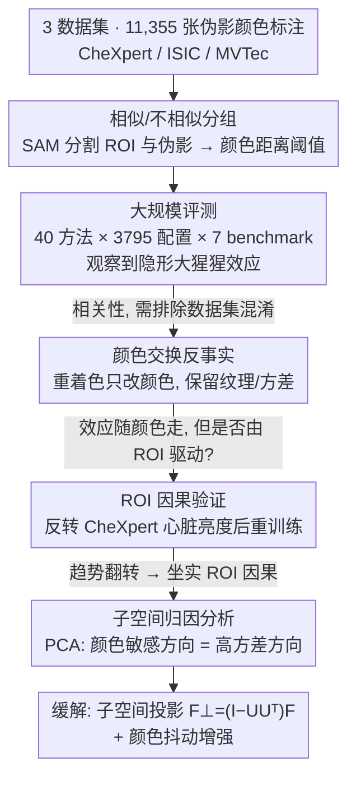

# The Invisible Gorilla Effect in Out-of-distribution Detection

**会议**: CVPR 2026  
**arXiv**: [2602.20068](https://arxiv.org/abs/2602.20068)  
**代码**: [有](https://github.com/HarryAnthony/Invisible_Gorilla_Effect)  
**领域**: 医学图像  
**关键词**: OOD检测, 分布外检测偏差, 视觉相似性, 医学影像安全, 特征空间分析

## 一句话总结

揭示了OOD检测中一个此前未被报告的偏差——"隐形大猩猩效应"：当OOD伪影与模型关注区域（ROI）视觉外观相似时检测性能显著更好，不相似时则大幅下降，尤其影响基于特征的OOD方法。

## 研究背景与动机

### 1. 领域现状

DNN在医学影像、自动驾驶等高风险场景中达到了专家级精度，但在遇到分布外（OOD）数据时性能严重退化。OOD检测方法旨在识别和拒绝不可靠的预测，已成为AI医疗监管的刚需（美国FDA和欧盟AI法规均要求ML系统处理OOD输入）。

### 2. 痛点

现有研究已经观察到OOD检测性能在不同伪影类型之间差异很大，但**为什么**会出现这种差异，其根本原因一直未被深入探索。在真实部署中，模型可能遇到的OOD类型无法事先预知，因此需要能泛化到多种分布偏移的检测方法。

### 3. 核心矛盾

传统假设认为OOD检测难度与样本和训练分布的相似度单调相关——越相似越难检测（near-OOD难，far-OOD易）。但本文发现这一假设并不总是成立：存在一种反直觉的情况，即与ROI视觉上更相似的OOD样本反而**更容易**被检测到。

### 4. 要解决什么

系统性地识别、量化和解释这种视觉相似性影响OOD检测的偏差现象，并评估可能的缓解策略。

### 5. 切入角度

以颜色相似性为控制变量（颜色伪影常见且可独立于形状/纹理变化），在医学影像（皮肤病变分类、胸片）和工业检测（MVTec）场景下进行大规模实验。作者从认知心理学中"看不见的大猩猩实验"获得灵感——被试在关注白衣球员传球时会忽视穿黑色大猩猩服走过的人，而如果大猩猩穿白色更容易被注意到。

### 6. 核心 idea

**Invisible Gorilla Effect**：OOD检测方法倾向于检出与模型ROI视觉特征相似的伪影，而"忽视"与ROI不相似的伪影。这是因为基于特征的方法中，颜色变异主要沿着潜在空间的高方差方向分布，而这些方向恰恰被Mahalanobis等方法降权处理。

## 方法详解

### 整体框架

本文是一项系统性的实证研究，而非提出新的 OOD 检测方法，它的方法部分是一条**层层递进的论证链**——先建立现象、再排除混淆、继而坐实因果、最后解释机理并据此缓解：

1. **分组与观察**：把"颜色"剥离成唯一可控变量，用 SAM 分割出 ROI 与伪影、按颜色距离把伪影分成"与 ROI 相似 / 不相似"两组（设计 1）；在 40 种 OOD 方法 × 3795 个超参配置 × 7 个 benchmark × 3 种架构（ResNet18 / VGG16 / ViT-B/32）× 25 个随机种子的大规模评测中，观察到"隐形大猩猩效应"
2. **排除数据集混淆**：用颜色交换反事实重着色，只改颜色、保留纹理与像素方差，验证效应跟着颜色走而非原始样本（设计 2）
3. **坐实 ROI 因果**：反转 CheXpert 心脏区域亮度后重训练，看检测趋势是否随之翻转，把相关性升级为因果（设计 3）
4. **机理归因与缓解**：用 PCA 子空间分析解释"为什么特征方法受影响最大"——颜色敏感方向恰是高方差方向、被 Mahalanobis 等方法降权；据此把 nuisance 高方差方向投影掉、并配合颜色抖动增强作为缓解（设计 4）

### 关键设计

**1. 相似/不相似分组：把"颜色"剥离成唯一的可控变量**

要验证"伪影越像 ROI 越好检测"这个反直觉猜想，第一步得有一个干净的对照轴。论文之所以选颜色，是因为颜色能独立于形状和纹理被控制，而颜色伪影（墨水标记、色卡贴片）在医学影像里又极其常见。具体做法是用 SAM 分别分割出模型关注区（ROI）和伪影区域，算出各自的平均 RGB，再按线性欧氏距离设阈值划成"相似"和"不相似"两组——例如 ISIC 皮肤病变的 ROI 平均 RGB 为 $(176,116,77)$，于是红色墨水落入"相似"组，黑/绿/紫墨水落入"不相似"组。有了这条颜色相似度轴，后面所有 OOD 方法的检测性能差距就能归因到这一个变量上。

**2. 颜色交换反事实：排除数据集本身的混淆**

光按颜色分组还不够——万一"红墨水好检测"只是因为带红墨水的样本恰好落在分布的某个易检测位置呢？为了堵住这个数据集偏差，作者在 ISIC 色卡数据上做反事实改写：把原本"相似"的红/橙/黄色卡重新着色成黑色，把原本"不相似"的绿/蓝/黑/灰色卡重新着色成皮肤病变的平均颜色。重着色靠分割掩码做逐通道均值偏移，只平移颜色均值而保留像素级方差和纹理，因此除了颜色之外一切不变。如果检测性能跟着颜色而不是跟着原始样本走，就说明效应确实来自"和 ROI 的颜色相似度"，而非别的混淆因素。

**3. ROI 因果验证：改 ROI 外观，看趋势会不会翻转**

前两步证明了相关性，但还没证明是"模型对 ROI 的学习"在驱动这个效应。作者在 CheXpert 胸片上做了一个因果干预：把训练图里心脏区域从高亮度改成低亮度后重新训练模型，再用一批不同亮度的合成 OOD 方块去测它。逻辑很直接——如果效应真由 ROI 外观决定，那么把 ROI 从"亮"翻成"暗"，检测性能随亮度变化的趋势就应该跟着翻转。实验里趋势确实反转了，这就把"伪影 vs ROI 视觉相似度"从一个观察到的关联，坐实成了由 ROI 学习驱动的因果机制。

**4. 子空间归因分析：用 PCA 几何解释"为什么特征方法最受伤"**

最后要回答的是机理：为什么基于特征的方法（Mahalanobis、KNN 等）受这个偏差影响远大于置信类方法？作者对模型隐藏层特征做 PCA，对每个主成分 $k$ 算两个量——它区分"相似/不相似伪影"的能力 $I_k$，以及它本身的方差 $\lambda_k$，再对二者做 Spearman 相关。结果是显著正相关，意味着对颜色最敏感的方向恰恰是潜在空间里方差最高的方向。而 Mahalanobis 这类方法天生会用协方差给高方差方向降权，于是它们正好把携带"不相似伪影"信号的方向压没了——这就从特征空间几何上解释了"看不见大猩猩"的来源。这一归因也直接催生了后面的子空间投影缓解策略：把这些 nuisance 高方差方向投影掉即可。

### 损失函数 / 训练策略

本文核心是分析性工作，不提出新的训练方法。主要训练细节：

- 主任务模型使用标准交叉熵训练，25个随机种子 × 5折交叉验证
- 缓解策略之一为颜色抖动增强（轻度: brightness/contrast/saturation=0.2；重度=0.8）
- 子空间投影缓解策略：$F_\perp = (I - UU^\top)F$，其中 $U$ 为前 $k=5$ 个颜色敏感度最高的主成分张成的子空间

## 实验关键数据

### 主实验

**表1：ISIC Benchmark 关键结果（ResNet18，40种方法，AUROC %）**

| 方法类别 | 代表方法 | 墨水-相似 | 墨水-不相似 | 色卡-相似 | 色卡-不相似 | 平均Δ(pp) |
|---------|---------|----------|-----------|----------|-----------|----------|
| 特征方法 | Mahalanobis | 77.0 | 63.6 | 96.7 | 95.4 | 7.3 |
| 特征方法 | KNN | 85.7 | 70.1 | 91.3 | 90.6 | 8.2 |
| 特征方法 | FeatureNorm | 75.1 | 52.9 | 62.4 | 58.1 | 13.2 |
| 置信方法 | MCP | 69.8 | 68.7 | 57.5 | 55.4 | 1.6 |
| 置信方法 | ODIN | 72.8 | 72.4 | 59.7 | 57.0 | 1.6 |
| 外部方法 | RealNVP | 84.0 | 65.6 | 96.1 | 94.2 | 10.1 |

**关键数字**：Mahalanobis在ISIC上检测红色墨水（与ROI相似）的AUROC比检测黑色墨水（不相似）高31.5%。

**表2：MVTec Benchmark 关键结果（ResNet18，AUROC %）**

| 方法 | 药丸-相似 | 药丸-不相似 | 金属螺母-相似 | 金属螺母-不相似 | 平均Δ(pp) |
|-----|---------|-----------|------------|-------------|----------|
| KNN | 93.3 | 86.2 | 71.0 | 36.9 | 20.6 |
| Mahalanobis | 71.9 | 68.7 | 69.8 | 58.3 | 7.3 |
| MCP | 78.5 | 78.3 | 58.8 | 45.3 | 6.8 |
| GradNorm | 80.1 | 79.1 | 60.3 | 59.8 | 0.8 |

### 消融实验

**缓解策略对比（ISIC墨水benchmark，ResNet18）**：

| 策略 | 方法 | 相似AUROC | 不相似AUROC | Gap变化 |
|------|------|----------|-----------|--------|
| 无增强 | Mahalanobis | 77.0 | 63.6 | 13.4pp |
| 子空间投影 | Mahalanobis+Proj | 77.5 | 75.8 | 1.7pp ↓↓ |
| 无增强 | FeatureNorm | 75.1 | 52.9 | 22.2pp |
| 子空间投影 | FeatureNorm+Proj | 75.3 | 74.5 | 0.8pp ↓↓ |
| 无增强 | NAN | 75.6 | 48.5 | 27.1pp |
| 子空间投影 | NAN+Proj | 75.3 | 76.8 | -1.5pp ↓↓ |
| 轻度颜色抖动 | KNN | 90.1 | 77.3 | 12.8pp |
| 重度颜色抖动 | KNN | 87.9 | 77.6 | 10.3pp |

### 关键发现

1. **特征方法受影响最大**：平均AUROC下降 $7.1 \pm 1.8$ pp，远高于置信方法的 $1.5 \pm 1.1$ pp
2. **CheXpert因果实验**：反转ROI外观后检测趋势随之反转，确认效应由ROI驱动
3. **PCA分析**：颜色敏感方向与高方差主成分显著正相关（Spearman $\rho=0.47$, $p<1.5\times10^{-4}$）
4. **子空间投影有效**：几乎消除了三种特征方法的性能差距，且不损害相似伪影检测性能
5. **颜色抖动效果不一致**：对部分方法有效（KNN），对另一些方法反而有害（DICE），且重度抖动降低ID精度5.5pp
6. **DDPM-MSE是唯一例外**：在所有ISIC benchmark上均未表现出该效应

## 亮点与洞察

1. **命名精妙**：借"看不见的大猩猩"认知心理学实验类比DNN的"注意力盲区"，概念直观易传播
2. **实验规模空前**：40种方法 × 3795配置 × 7 benchmark × 3架构 × 25种子，每个结论都有统计显著性支撑（Wilcoxon signed-rank, $p<10^{-5}$）
3. **因果验证闭环**：不仅观察到效应，还通过CheXpert心脏亮度反转实验因果地证明了ROI驱动机制
4. **机制解释清晰**：PCA子空间分析揭示特征方法受影响最大的根因——颜色变异沿高方差方向分布被降权
5. **缓解方案可迁移**：在ISIC色卡benchmark上学到的nuisance子空间可直接应用到墨水benchmark，说明子空间具有泛化性
6. **实际临床意义**：揭示了OOD检测器在真实部署中可能静默失效的场景——那些与ROI颜色不同的伪影恰恰是最容易漏检的

## 局限与展望

1. **仅关注颜色维度**：虽然颜色是受控变量，但形状、纹理、空间位置等因素也可能产生类似效应，未来可扩展
2. **数据集范围有限**：3个数据集（2个医学+1个工业），未涉及自动驾驶、遥感等其他高风险场景
3. **子空间投影的局限**：需要预先知道哪些主成分是"nuisance"的，在实际部署中可能不可行（需要少量OOD标注）
4. **排除了基础模型**：CLIP等大规模预训练模型被排除以避免数据泄露，但基础模型是当前趋势，它们是否也有此效应值得研究
5. **缓解策略仍初步**：颜色抖动效果不一致，子空间投影仅在特征方法上验证——缺少通用的缓解方案
6. **可进一步做迁移**：是否可以在一个数据集上学习nuisance subspace然后零样本应用到完全不同域的OOD检测

## 相关工作与启发

- **Anthony & Kamnitsas (2023, 2025)**：发现Mahalanobis Score在不同特征层上的最优选择随伪影类型变化，本文揭示了更深层原因
- **Averly & Chao (2023)**：counterfactual分析显示OOD伪影可产生高置信预测，本文进一步从颜色维度系统化这一发现
- **Ren et al.**：near-OOD vs far-OOD框架，本文挑战了"越相似越难检测"的单调假设
- **对OOD检测方法设计的启发**：未来特征方法不应盲目降权高方差方向，需要区分"有用"和"nuisance"方差；或可考虑学习ROI-aware的特征空间

## 评分

⭐⭐⭐⭐ 极为扎实的实证分析工作，以空前规模揭示了OOD检测中一个重要且此前被忽视的系统性偏差，因果验证和机制解释令人信服，对OOD检测方法的实际部署具有重要警示意义。

<!-- RELATED:START -->

## 相关论文

- [\[NeurIPS 2025\] DIsoN: Decentralized Isolation Networks for Out-of-Distribution Detection in Medical Imaging](../../NeurIPS2025/medical_imaging/dison_decentralized_isolation_networks_for_out-of-distribution_detection_in_medi.md)
- [\[CVPR 2025\] OpenMIBOOD: Open Medical Imaging Benchmarks for Out-Of-Distribution Detection](../../CVPR2025/medical_imaging/openmibood_open_medical_imaging_benchmarks_for_out-of-distribution_detection.md)
- [\[CVPR 2026\] KLIP: localized distribution shift detection via KL-divergence with diffusion priors in Inverse Problems](klip_localized_distribution_shift_detection_via_kl-divergence_with_diffusion_pri.md)
- [\[CVPR 2026\] Breaking the Continuum: Discrete Distribution Learning for Structural MRI Reconstruction](breaking_the_continuum_discrete_distribution_learning_for_structural_mri_reconst.md)
- [\[CVPR 2026\] Event-Level Detection of Surgical Instrument Handovers in Videos](event_level_detection_of_surgical_instrument_handovers_in_videos.md)

<!-- RELATED:END -->
