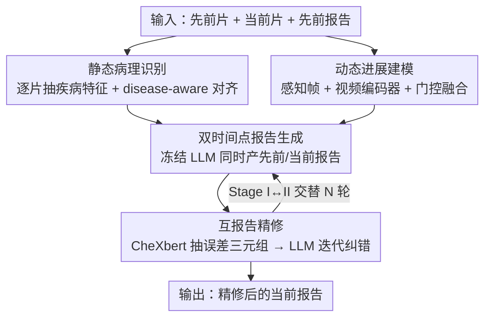

# TIM: Temporal Decoupling with Iterative Mutual-Refinement Model for Longitudinal Radiology Report Generation

**会议**: CVPR 2026  
**论文**: [CVF Open Access](https://openaccess.thecvf.com/content/CVPR2026/html/Dong_TIM_Temporal_Decoupling_with_Iterative_Mutual-Refinement_Model_for_Longitudinal_Radiology_CVPR_2026_paper.html)  
**代码**: https://github.com/yihengd/TIM  
**领域**: 医学图像 / 放射报告生成  
**关键词**: 纵向报告生成、时序解耦、动态进展建模、互校正精修、胸片

## 一句话总结
TIM 把纵向放射报告生成拆成「静态病理识别」和「动态进展建模」两条解耦分支，再用一个让先前报告与当前报告互相纠错的迭代精修阶段反复打磨，在 Longitudinal-MIMIC 上把语言与临床指标都刷到了新 SOTA。

## 研究背景与动机
**领域现状**：放射报告生成（RRG）要把医学影像翻译成诊断文字，帮放射科医生减负、统一术语。近年视觉-语言模型让单张胸片的报告生成做得相当不错。

**现有痛点**：真实临床里医生看片几乎总要和病人的既往片子对比，判断病灶是变大、改善还是出现新异常。但多数 RRG 只盯单一时间点，生成的报告在时间维度上要么自相矛盾、要么和病人真实病程对不上。后来出现的纵向 RRG（LRRG）方法虽然引入了历史影像和报告，却普遍把不同时间点的影像塞进同一个表征空间。

**核心矛盾**：LRRG 任务里有两件本质不同的事被强行混在一起——**病理识别**关心的是单张片子里疾病的空间定位（如某处肺部阴影），**进展建模**关心的是跨片子的时间变化（如间隔期变重还是好转）。把两者揉进一个表征网络，静态病灶线索和时间演化特征互相干扰，语义被搅浑，时序推理能力受限。此外，现有方法把报告生成当成一次性前向过程，忽略了先前报告和当前报告之间的相互依赖：先前报告里的错误本可为当前报告提供纠偏线索，而精修当前报告也能反过来暴露先前报告的遗漏——结果模型常常在多次就诊间重复同样的错误。

**本文目标**：(1) 把空间病理与时间进展显式解耦，各自学干净的表征；(2) 让先后两个时间点的报告互相参照、迭代纠错。

**切入角度**：作者观察到约 70% 的先前报告错误会因「时间一致性」原样复现在当前报告里——也就是说，先纠正先前报告的错误，就能预先堵住当前报告的同类错误。

**核心 idea**：用「分而治之」拆开静态/动态表征，再用「先前↔当前」报告的双向互校正闭环抑制时序误差传播。

## 方法详解

### 整体框架
TIM 是一个两阶段框架。输入是同一病人两个时间点的胸片对 $\{I_p, I_c\}$ 以及先前报告 $R_p$，目标是生成准确的当前报告 $\hat{R}_c$。**Stage I（时序解耦表征学习）**把视觉表征拆成静态病理识别分支和动态进展建模分支，前者从单张片子抽疾病相关特征、后者从片子对里抽进展特征，然后让一个冻结的 LLM 同时生成先前和当前两份报告。**Stage II（互报告精修）**先用 CheXbert 把生成的先前报告和它的真值对比，把诊断错误抽成误差三元组喂回 LLM，迭代地修当前报告；推理时 Stage I 与 Stage II 交替进行，形成闭环。

### 关键设计

**1. 静态病理识别分支：把视觉特征和疾病语义对齐**

针对「静态病灶线索被时间特征污染」这一痛点，这条分支只管单张片子的疾病相关表征。给定影像 $I^*$，图像编码器抽 patch 嵌入再经线性投影得到病理特征 $f^*_i = W_{img}E_{img}(I^*)$。为了让这个特征真带临床语义，作者先用 CheXbert 在 14 类疾病上给报告打 {未提及/阳性/阴性/不确定} 四种标签，再借 UMLS、PubMed 等外部医学知识把每个被提到的疾病扩成简短临床描述，拼成疾病文本序列 $T^*_{dis}$ 经文本编码器得 $f^*_{t,dis}$。然后用对比学习把图像特征拉向对应的疾病文本特征：

$$L^*_{spr} = -\log \frac{\exp(\mathrm{sim}(f^*_i, f^*_{t,dis})/\tau)}{\sum_j \exp(\mathrm{sim}(f^*_i, f^{*,j}_{t,dis})/\tau)}$$

其中 $\mathrm{sim}$ 是余弦相似度、$\tau$ 是温度。这样病理特征被锚定在「疾病-语言」空间里，比单纯抽视觉特征更贴临床。

**2. 动态进展建模分支：用感知帧 + 视频编码器抓时间演化**

这条分支专门抓两次检查之间的演化，借的是视频编码器天生的时空建模能力。作者引入一组**可学习的、随机初始化的感知帧** $\{Q_1, Q_2\}$（数量经实验定为 2），它们和胸片同分辨率、各自独立参数化，被插在先前片和当前片之间组成一段短视频序列 $[I_p; Q_1; Q_2; I_c]$ 喂进视频编码器 $E_{vid}$，输出中间帧特征 $\{H_1, H_2\}$。再用门控模块自适应融合：

$$H_g = \alpha \odot H_1 + (1-\alpha) \odot H_2, \quad \alpha = \sigma(W_g[H_1; H_2])$$

融合后投影成进展特征 $f_{pro}$，并和从「进展相关报告句子」抽出的文本嵌入 $f_{t,pro}$ 做对比对齐（$L_{dpm}$）。这一对齐逼模型聚焦真正的病理演化，而不是体位变化之类无关的成像差异。

**3. 双时间点报告生成：用双向重建逼出更准的进展表征**

针对「单向生成不利于学进展」的问题，Stage I 不只预测当前报告，而是用冻结 LLM 同时生成先前和当前两份报告：$\hat{R}^* = \mathrm{LLM}(f^*_i, f_{pro}, R_{ref}, P^*)$，其中 $R_{ref}$ 是对侧时间点的参考报告（生成当前用 $R_p$、生成先前用 $R_c$），$P^*$ 是指示时间点的文本提示。这种双向推理——既能据进展推当前、又能用进展重建先前——逼着进展表征把疾病演化编码得更准、跨时间更一致。Stage I 总目标为 $L_{stage1} = L^c_{gen} + L^p_{gen} + \lambda_1(L^c_{spr} + L^p_{spr}) + \lambda_2 L_{dpm}$。

**4. 互报告精修：让先前报告的错误成为当前报告的纠偏信号**

利用「约 70% 先前报告错误会复现到当前报告」这一观察，Stage II 把生成的先前报告 $\hat{R}^{p,(0)}$ 和真值用 CheXbert 比对，得到误差三元组 $D^{(0)}=\{(d_k, z^p_k, \hat{z}^{p,(0)}_k)\}$（疾病、真值标签、预测标签），经三元组编码器 $E_{tri}$ 变成向量 $u^{(0)}$；同时用语义聚合器 $\Gamma$ 把首轮当前报告压成紧凑描述子 $s^{(0)}$。二者连同当前病理特征 $f^c_i$ 和提示 $P_{rf}$ 一起送进 LLM 做第二轮生成 $\hat{R}^{c,(1)}$。为保证精修真带来改善，引入相似度精修损失：

$$L_\Delta = -\log \sigma\!\big(\beta[s(\hat{R}^{c,(1)}, R_c) - s(\hat{R}^{c,(0)}, R_c)]\big)$$

它逼第二轮报告比第一轮更贴近真值。Stage II 只训语义聚合器和三元组编码器，Stage I 全部冻结。推理时 Stage I（生成）↔ Stage II（纠错）交替 $N=3$ 轮，先前与当前报告互为参照逐轮收敛。

### 损失函数 / 训练策略
Stage I 训 3 个 epoch、batch size 4、Adam、学习率 $1\times10^{-4}$；系数 $\lambda_1=0.5, \lambda_2=0.1$。Stage II 冻结 Stage I、只训语义聚合器和三元组编码器 1 个 epoch、学习率 $5\times10^{-5}$，$\lambda_\Delta=0.1$、$\beta=5$。图像编码器用 Swin Transformer，视频编码器用 X-CLIP 视觉分支，文本编码器用 CLIP 文本分支，LLM 用冻结的 LLaMA2-7B；进展描述用 Qwen3-plus 从报告里抽取。

## 实验关键数据

### 主实验
数据集为 Longitudinal-MIMIC（源自 MIMIC-CXR，26,156 病人 / 92,374 训练样本、2,058 测试样本，每样本是 {先前片, 先前报告, 当前片, 当前报告} 四元组）。NLG 指标用 BLEU-n / METEOR / ROUGE-L，临床效力（CE）指标用 CheXbert 映射到 14 类疾病后的精度/召回/F1。

| 输入 | 方法 | B-1 | B-4 | MTR | R-L | F1 |
|------|------|-----|-----|-----|-----|-----|
| 单图 | RADAR (ACL'25) | 0.412 | 0.114 | 0.155 | 0.257 | 0.417 |
| 单图 | GMoD (MICCAI'24) | 0.378 | 0.107 | 0.162 | 0.276 | 0.460 |
| 纵向 | MLRG (CVPR'25) | 0.416 | 0.114 | 0.158 | 0.264 | 0.418 |
| 纵向 | Diff-RRG (MICCAI'25) | 0.405 | 0.120 | 0.164 | 0.276 | 0.474 |
| 纵向 | **TIM-Stage I** | 0.421 | 0.118 | 0.172 | 0.275 | 0.483 |
| 纵向 | **TIM-Stage II** | **0.430** | **0.124** | **0.185** | **0.287** | **0.511** |

TIM 在全部指标上刷新 SOTA：相对最强纵向基线 Diff-RRG，B-1 +0.025、R-L +0.011、F1 +0.037；相对单图基线在 F1 上也有明显领先。（原文另称相对 RADAR 在 BLEU-4 上提升 0.018，与表中差值略有出入，⚠️ 以原文为准。）

### 消融实验
Stage I 各组件逐步叠加（F1 视角）：

| 配置 | B-4 | F1 | 说明 |
|------|-----|-----|------|
| Base | 0.108 | 0.404 | 只用当前图、只生成当前报告 |
| + DPM | 0.110 | 0.427 | 加动态进展建模分支 |
| + DRG | 0.114 | 0.446 | 加双时间点报告生成 |
| + $L_{spr}$ | 0.117 | 0.460 | 加静态病理语义对齐 |
| Full (e) | 0.118 | 0.483 | 再加 $L_{dpm}$，全模块 |

### 关键发现
- **解耦分支是大头**：从 Base 到加 DPM 分支，F1 直接 +2.3 个点（0.404→0.427），证明把时间演化单独建模对理解病程很关键。
- **双时间点生成显著提温**：DRG 让 B-4/F1 升到 0.114/0.446，双向重建确实逼出了更一致的时序语义。
- **Stage II 锦上添花**：从 Stage I 到 Stage II，F1 再 +2.8 个点（0.483→0.511），说明互校正闭环把残留的诊断错误进一步压了下去。
- **超参**：感知帧数量经实验取 2、精修迭代轮数取 3。

## 亮点与洞察
- **「分而治之」用得很自然**：把 LRRG 的两个本质子任务（空间病理 vs 时间进展）显式拆成两条分支，是个直觉上就对、实验也兑现的设计——解耦后两类语义不再互相污染。
- **感知帧 + 视频编码器抓进展**：把两张静态片子之间插入可学习帧凑成「短视频」、借视频编码器的时空建模能力抓演化，是个挺巧的迁移，比单纯做特征差值更能容忍体位/成像噪声。
- **「先纠先前、再修当前」闭环**：抓住「70% 先前错误会复现」这一统计事实，把先前报告的错误当成当前报告的预防性纠偏信号，思路可迁移到任何「历史输出能预示当前输出错误」的序列生成任务。

## 局限与展望
- 只在 Longitudinal-MIMIC（胸片）上验证，跨模态/跨部位（CT、MRI）的泛化未知。
- 推理时 Stage I↔II 要交替 3 轮、每轮都调 7B LLM，开销不小，临床实时性存疑。
- 精修依赖 CheXbert 抽 14 类疾病标签，标签体系之外的细粒度异常无法被纠偏；进展描述还要靠 Qwen3-plus 离线抽取，引入了额外的标注链路。
- 「双时间点」只建模相邻两次就诊，更长的就诊序列如何扩展未讨论。

## 相关工作与启发
- **vs HC-LLM / Diff-RRG（纵向 RRG）**：它们引入历史影像/报告但把静态与时间表征混在同一空间，TIM 显式解耦双分支，避免特征互扰，F1 领先 0.037。
- **vs 传统自精修报告生成**：以往自精修缺乏明确、临床可解释的反馈，增益有限；TIM 用 CheXbert 误差三元组给出「哪个疾病标错了」的显式信号做定向纠正，临床准确度提升更实在。
- **vs HERGen / MLRG（纵向输入）**：同样吃多次就诊，但 TIM 额外加了双向报告生成与互校正闭环，把时序误差传播单独拎出来治理。

## 评分
- 新颖性: ⭐⭐⭐⭐ 解耦双分支 + 互校正闭环组合新颖，但单个组件（对比对齐、视频编码、自精修）都有渊源
- 实验充分度: ⭐⭐⭐⭐ 主实验对比充分、两阶段消融清晰，但只在单一数据集单一模态上验证
- 写作质量: ⭐⭐⭐⭐ 动机层层递进、方法与算法表述清楚
- 价值: ⭐⭐⭐⭐ 纵向报告生成是真实临床刚需，刷新 SOTA 且思路可迁移

<!-- RELATED:START -->

## 相关论文

- [\[CVPR 2026\] Personalized Longitudinal Medical Report Generation via Temporally-Aware Federated Adaptation](personalized_longitudinal_medical_report_generation_via_temporally-aware_federat.md)
- [\[CVPR 2026\] BiOTPrompt: Bidirectional Optimal Transport Guided Prompting for Disease Evolution-aware Radiology Report Generation](biotprompt_bidirectional_optimal_transport_guided_prompting_for_disease_evolutio.md)
- [\[CVPR 2026\] SAT-RRG: LLM-Guided Self-Adaptive Training for Radiology Report Generation with Token-Level Push–Pull Optimization](sat-rrg_llm-guided_self-adaptive_training_for_radiology_report_generation_with_t.md)
- [\[CVPR 2026\] OraPO: Oracle-educated Reinforcement Learning for Data-efficient and Factual Radiology Report Generation](orapo_oracle-educated_reinforcement_learning_for_data-efficient_and_factual_radi.md)
- [\[CVPR 2026\] Temporal Inversion for Learning Interval Change in Chest X-Rays](temporal_inversion_for_learning_interval_change_in_chest_x-rays.md)

<!-- RELATED:END -->
