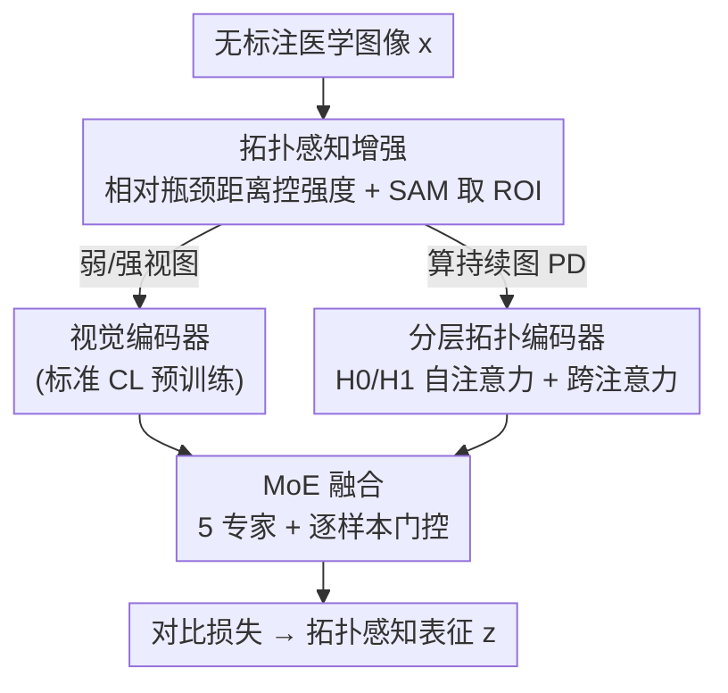

# TopoCL: Topological Contrastive Learning for Medical Imaging

**会议**: CVPR 2026  
**论文**: [CVF Open Access](https://openaccess.thecvf.com/content/CVPR2026/html/Meng_TopoCL_Topological_Contrastive_Learning_for_Medical_Imaging_CVPR_2026_paper.html)  
**代码**: https://github.com/gm3g11/TopoCL  
**领域**: 医学图像 / 自监督表示学习  
**关键词**: 对比学习、持续同调、拓扑感知增强、混合专家融合、医学图像分类

## 一句话总结
TopoCL 给标准对比学习补上「拓扑」这一课——用相对瓶颈距离设计可控的拓扑感知增强、用分层拓扑编码器把持续同调图编码成特征、再用混合专家模块自适应融合视觉与拓扑表征，能即插即用地挂到 SimCLR/MoCo-v3/BYOL/DINO/Barlow Twins 上，在五个医学数据集上平均线性探测准确率涨 3.26%。

## 研究背景与动机
**领域现状**：医学图像标注又贵又费专家，所以对比学习（CL）这类自监督方法很受欢迎——先在大量无标注图上学表征，再用少量标签微调下游任务。SimCLR、MoCo-v3、BYOL、DINO、Barlow Twins 等代表方法靠对比损失、动量编码器、自蒸馏等目标，把纹理、强度、颜色这些局部外观特征学得很好。

**现有痛点**：这些方法本质上都在像素级语义上操作，**不显式编码拓扑结构**——连通性、孔洞、边界形态。而这些恰恰是医学诊断的关键线索。论文图 1 给了个直观例子：两例皮肤纤维瘤（DF）被 MoCo-v3 基线分别误判成光化性角化病和黑素细胞痣，因为它们「外观相似」；但它们的边界形态、内部连通结构（拓扑差异）明显不同，TopoCL 抓住这些拓扑特征就分对了。

**核心矛盾**：标准 CL 的数据增强（随机裁剪、色彩抖动、高斯模糊）是为「保外观」设计的，对拓扑结构的影响完全失控——可能在不经意间破坏掉诊断相关的边界/连通结构；而即便想用拓扑，持续同调产出的持续图（PD）是无序的生死点集，怎么编码、怎么和视觉特征融合都是开放问题。

**本文目标**：(1) 设计能**量化且可控**拓扑扰动的增强；(2) 把 PD 编码成对比学习能用的表征；(3) 自适应融合视觉与拓扑特征。

**切入角度**：持续同调（PH）能用稳定性定理保证「有界强度的增强→PD 有界变化」，于是可以用 PD 之间的瓶颈距离来度量并控制增强的拓扑强度。

**核心 idea**：用拓扑显式增广对比学习——拓扑感知增强保结构、分层拓扑编码器读 PD、MoE 按样本自适应融合视觉与拓扑。

## 方法详解

### 整体框架
TopoCL 采用「先分别预训练、再联合微调」的策略，可挂到任意基 CL 方法 $M$ 上。给定一张无标注医学图像 $x$，先用拓扑感知增强生成弱/强两个视图 $x^w_{topo}, x^s_{topo}$ 并算各自的持续图 $\mathrm{topo}^w, \mathrm{topo}^s$；视觉编码器处理增强图、拓扑编码器（分层拓扑编码器 H-Topo. Encoder）处理 PD，各经投影头得到视觉特征 $f^{w/s}$ 和拓扑特征 $t^{w/s}$；二者送进 TopoCL MoE 模块经五个专家 + 门控融合成 $h^{w/s}$，再经投影头映到最终表征 $z^{w/s}$，用基 CL 的对比损失 $L_M$ 优化。视觉与拓扑编码器先各自独立用对比目标预训练（避免互相干扰），再联合微调对齐两个特征空间以便融合。

### 关键设计

**1. 拓扑感知增强：用相对瓶颈距离把增强的「拓扑强度」量化成可调旋钮**

标准 CL 增强对拓扑的影响不可控，可能误删诊断相关结构。作者先定义**相对瓶颈距离**来量化增强前后的拓扑变化：

$$d_B^{\text{rel}}(\mathcal{A}, x) = \frac{d_B(\mathrm{PD}(x), \mathrm{PD}(\mathcal{A}(x)))}{\mathrm{span}(\mathrm{PD}(x))}$$

其中 $d_B$ 是两张持续图之间的瓶颈距离，分母 $\mathrm{span}(\mathrm{PD}(x))=\max |d-b|$ 做归一化以便跨图比较（$b,d$ 是拓扑特征的生死时刻）。该度量根植于稳定性定理——有界强度的增强必然产生有界的 PD 变化。三个工程细节让它真正可用：(1) **PD 只在 ROI 上算**而非全图，用 SAM 自动抠前景，过滤背景噪声/伪影；(2) 把增强操作按机制分成五类（同胚类的翻转旋转保拓扑、边界扰动的高斯噪声、平滑类的高斯模糊、强度变换、形态学的膨胀腐蚀），系统性扫描各操作强度确认其与 $d_B^{\text{rel}}$ 正相关；(3) 经下游线性探测扫出最优区间——**拓扑弱增强取 $d_B^{\text{rel}}\in[5\%,15\%]$、拓扑强增强取 $[15\%,25\%]$**。训练时按目标类型从已验证区间里采样操作强度，无需在线再算 $d_B^{\text{rel}}$。

**2. 分层拓扑编码器：尊重 H0/H1 语义差异地把无序持续图编码成特征**

PD 是无序的生死点集，且 PH 产出两类几何语义不同的特征——$H_0$ 是连通分量、$H_1$ 是孔洞，二者还有几何依赖（孔洞总被连通分量包围）。作者用类 PointNet 的 PH Encoder 解决排列不变性：选 top-$k$ 最持续特征（$k_{H_0}=48, k_{H_1}=96$），每个生死对 $(b_i,d_i)$ 拼上 one-hot 维度标识 $\tilde{p}_i=[p_i; en_i]\in\mathbb{R}^4$，经四层全连接编码后分成 $h_0\in\mathbb{R}^{48\times384}$、$h_1\in\mathbb{R}^{96\times384}$。接着用**分层注意力**：先在每个同调维度内做自注意力（带残差，$h'_0 = h_0 + \lambda_0\cdot\mathrm{SelfAttn}(h_0)$，$\lambda=0.5$）区分特征重要性（如肿瘤区 vs 背景），再用**双向跨注意力**建模维度间几何关系（$h^\leftrightarrow_0 = \mathrm{CrossAttn}(h'_0, h'_1)$，$H_0$ 作 query、$H_1$ 作 key/value，反之亦然），捕捉「孔洞被分量包含」这类依赖。最后对自注意力与跨注意力输出做 max + mean 池化得 $h_{pool}\in\mathbb{R}^{6\times384}$，投影成 $t\in\mathbb{R}^{256}$。

**3. 混合专家融合：按样本自适应地权衡视觉与拓扑信号**

固定融合策略（拼接/门控/跨注意力）都假设「一种策略对所有样本最优」，但医学图异质性大——纹理主导的样本（皮肤镜的色素模式）更吃视觉特征，结构主导的样本（组织病理的腺体连通）更吃拓扑信号。作者据此设计**五个互补专家**：$e_1$ 仅视觉 $\mathrm{MLP}(f)$、$e_2$ 仅拓扑 $\mathrm{MLP}(t)$、$e_3$ 拼接 $\mathrm{MLP}([f;t])$、$e_4$ 门控混合 $\mathrm{MLP}(g\odot f + (1-g)\odot t)$、$e_5$ 双向跨注意力。一个多门控网络（3 层 MLP）吃 $[f;t]$ 产出归一化权重 $\mathrm{gate}=\mathrm{softmax}(\cdot)\in\mathbb{R}^5$，融合表征为加权和 $h=\sum_{i=1}^5 \mathrm{gate}_i\cdot e_i$，再投影成 $z$。这是首个用于「视觉-拓扑」特征融合的 MoE 架构。推理时给单图抠 ROI、不增强算 PD，过两编码器后经同一门控+专家融合即得下游表征。

### 损失函数 / 训练策略
视觉与拓扑编码器**各自独立**用基 CL 的对比目标 $L_M$ 预训练（视觉用标准增强、拓扑用拓扑感知增强），避免互相干扰；之后挂上 MoE 联合微调全部参数、同样用 $L_M$ 对齐特征空间。ROI 抽取用 SAM-ViT-H，PD 用 GUDHI 算（保留 top-48 $H_0$、top-96 $H_1$）；分层拓扑编码器 4 头注意力、维度 384；H100 上 batch 256、AdamW（学习率 $3\times10^{-4}$）、cosine annealing，骨干统一 ResNet-50、训 150 epoch。

## 实验关键数据

### 主实验
在五个覆盖不同模态/部位的医学分类数据集（PathMNIST 结肠病理、OCTMNIST 视网膜 OCT、OrganSMNIST 腹部 CT、ISIC2019 皮肤镜、Kvasir 消化道内镜）上，把 TopoCL 挂到五个 CL 方法上，用线性探测（冻结编码器 + 线性分类器）评 ACC / 宏平均 AUC，五次跑取均值并做配对 t 检验。

| 基方法 | 平均 ACC | +TopoCL ACC | ACC 增益 |
|--------|---------|-------------|---------|
| SimCLR | 75.89 | 79.03 | +3.14 |
| MoCo-v3 | 82.91 | 85.37 | +2.46 |
| BYOL | 81.07 | 83.91 | +2.84 |
| DINO | 71.78 | 76.38 | **+4.60** |
| Barlow Twins | 76.81 | 80.08 | +3.27 |

五个基方法**全部**正向提升，平均 +3.26% ACC、+0.90% AUC；统计显著性强（50 个数据集-指标对比中 86% 达 $p<0.05$，平均指标 80% 达 $p<0.001$）。DINO 增益最大（+4.60% ACC），OCT 和 Kvasir 整体提升最显著。唯一例外是 MoCo-v3 在 OrganSMNIST 上 AUC 从 99.57 微降到 98.75（$p=0.023$），但 ACC 仍 +2.56，作者解释为在近饱和场景下拓扑特征以排序置信度换分类性能。

### 消融实验
增强配置消融（MoCo-v3+TopoCL，ACC%）：

| 配置 | OrganS | ISIC | Kvasir |
|------|--------|------|--------|
| weak+strong（标准视觉增强） | 75.51 | 72.92 | 84.63 |
| full image（PD 算全图非 ROI） | 76.34 | 74.35 | 87.41 |
| topo-weak+topo-weak | 78.98 | 76.39 | 90.01 |
| topo-strong+topo-strong | 78.02 | 75.99 | 89.64 |
| **topo-weak+topo-strong** | **80.58** | **78.44** | **91.17** |

组件消融（SimCLR+TopoCL，ACC%，节选）：

| 配置 | Path | OrganS | OCT |
|------|------|--------|-----|
| w/o pretraining | 68.98 | 50.61 | 48.72 |
| w/o topo. pretrain | 87.64 | 72.56 | 69.37 |
| w/o hier. attn | 86.51 | 72.85 | 67.62 |
| w/o cross-attn | 87.59 | 74.66 | 69.38 |
| w/o topo-only expert | 93.01 | 78.15 | 72.53 |

### 关键发现
- **ROI + 弱强混搭最关键**：PD 在 SAM 抠的 ROI 上算、且用「弱+强」拓扑增强对，比全图算 PD 或对称增强对都明显更好（OrganS 80.58 vs full-image 76.34），印证了背景伪影会污染拓扑度量。
- **独立预训练是地基**：去掉预训练 ACC 直接崩（OrganS 78→50.61），证明视觉/拓扑分别预训练再融合的策略不可省。
- **分层注意力有用**：去掉分层注意力（hier. attn）或跨注意力都掉点，说明 $H_0/H_1$ 维度内重要性区分 + 维度间几何依赖建模都有贡献。
- **即插即用**：对五个机理迥异的 CL 方法（对比损失/动量/自蒸馏/冗余消减）全部生效，泛用性强。

## 亮点与洞察
- **把「增强强度」变成可量化旋钮**：用稳定性定理 + 相对瓶颈距离，把「这个增强动了多少拓扑」从玄学变成一个 0-25% 的可控数字，再扫出弱/强的最优区间——这套「先度量再控制」的思路可迁移到任何想精细控制增强强度的自监督任务。
- **首个视觉-拓扑 MoE 融合**：用五个互补专家 + 逐样本门控，让模型自己决定「这张图该信视觉还是信拓扑」，比固定融合策略更贴医学图的异质性。
- **尊重拓扑语义的编码器**：不是把 PD 当普通点集硬塞，而是显式区分 $H_0$（连通分量）/$H_1$（孔洞）并用跨注意力建模「孔洞被分量包含」的几何依赖，把领域先验织进了网络结构。

## 局限与展望
- 依赖 SAM 抠 ROI 和 GUDHI 算 PD，引入了额外的离线预处理链路，PD 计算对大图/3D 体数据可能昂贵。
- 只在 2D 医学分类（且统一 ResNet-50 + 224×224）上验证，3D 体数据、分割/检测等密集预测任务的迁移性未知。
- 近饱和场景下出现 ACC↑ 但 AUC↓ 的权衡（MoCo-v3 on OrganS），说明拓扑特征并非无脑增益。
- 弱/强增强的最优区间（5-15% / 15-25%）是经下游性能扫出来的，换数据集是否需重扫、是否数据集相关，论文未充分讨论。

## 相关工作与启发
- **vs 标准 CL（SimCLR/MoCo-v3/...）**：它们只学局部外观特征、增强为保外观设计；TopoCL 显式补拓扑，且作为通用增强方案能挂到任意 CL 上，平均 +3.26% ACC。
- **vs 传统拓扑数据分析（PersLay / PHG-Net）**：以往多把拓扑当辅助损失或用在有监督设定；TopoCL 首次把 PH 织进自监督对比学习，并设计跨注意力建模 $H_0$-$H_1$ 关系。
- **vs 固定特征融合（拼接/双线性/跨注意力/门控）**：它们假设单一策略对所有样本最优；TopoCL 用 MoE 按样本自适应，是首个用于视觉-拓扑融合的 MoE。

## 评分
- 新颖性: ⭐⭐⭐⭐⭐ 把持续同调系统性织入对比学习、相对瓶颈距离可控增强 + 视觉-拓扑 MoE 都是首创
- 实验充分度: ⭐⭐⭐⭐ 5 方法×5 数据集 + 配对 t 检验很扎实，但局限于 2D 分类
- 写作质量: ⭐⭐⭐⭐ 三大挑战拆解清晰、方法与公式表述到位
- 价值: ⭐⭐⭐⭐ 即插即用、对多种 CL 普遍有效，医学自监督场景实用性高

<!-- RELATED:START -->

## 相关论文

- [\[CVPR 2026\] Contrastive Cross-Bag Augmentation for Multiple Instance Learning-based Whole Slide Image Classification](contrastive_cross-bag_augmentation_for_multiple_instance_learning-based_whole_sl.md)
- [\[CVPR 2026\] OmniFM: Toward Modality-Robust and Task-Agnostic Federated Learning for Heterogeneous Medical Imaging](omnifm_toward_modality-robust_and_task-agnostic_federated_learning_for_heterogen.md)
- [\[CVPR 2026\] DK-DDIL: Adaptive Knowledge Retention for Dynamic Domain-Incremental Learning in Medical Imaging](dk-ddil_adaptive_knowledge_retention_for_dynamic_domain-incremental_learning_in_.md)
- [\[ECCV 2024\] Improving Medical Multi-modal Contrastive Learning with Expert Annotations](../../ECCV2024/medical_imaging/improving_medical_multi-modal_contrastive_learning_with_expert_annotations.md)
- [\[ICCV 2025\] Vector Contrastive Learning for Pixel-wise Pretraining in Medical Vision](../../ICCV2025/medical_imaging/vector_contrastive_learning_for_pixel-wise_pretraining_in_medical_vision.md)

<!-- RELATED:END -->
