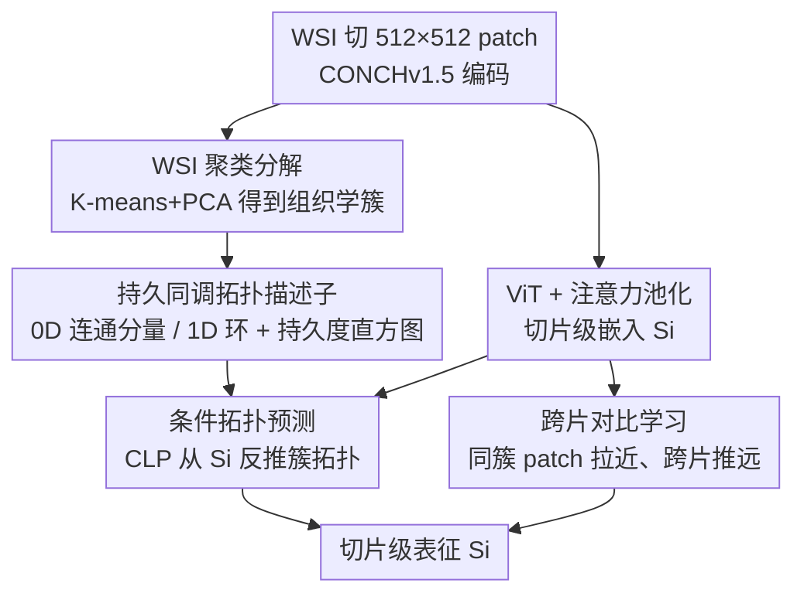

# TopoSlide: Topologically-Informed Histopathology Whole Slide Image Representation Learning

**会议**: CVPR 2026  
**论文**: [CVF Open Access](https://openaccess.thecvf.com/content/CVPR2026/html/Abousamra_TopoSlide_Topologically-Informed_Histopathology_Whole_Slide_Image_Representation_Learning_CVPR_2026_paper.html)  
**代码**: https://github.com/plevritis-lab/TopoSlide  
**领域**: 医学图像 / 自监督表示学习  
**关键词**: 全切片图像, 持久同调, 拓扑数据分析, 自监督, 病理基础模型

## 一句话总结
TopoSlide 把病理学家"先看局部组织、再看整体空间排布"的诊断逻辑写进自监督目标：先把千万级 patch 聚类成组织学簇，再用持久同调把每个簇的空间排布编码成拓扑描述子，最后让 ViT 在条件多任务目标下从切片级表征反推这些拓扑——仅用几百张切片训练，组织学模式检索的 Macro F1 比用十万级切片训练的基础模型最高高出约 15%。

## 研究背景与动机
**领域现状**：病理全切片图像（WSI）是 20× 下可达 10 万×10 万像素的"千兆像素"图像，没法整图喂进网络，主流做法是切成成千上万个 patch、用 patch 编码器（CONCH / Virchow / CTransPath / GigaPath-Tile）提特征，再聚合成切片级表征。近年的病理基础模型（GigaPath、CHIEF、PRISM、TITAN）在数万到数十万张切片上做掩码重建、视觉-语言对齐或蒸馏，把聚合做得更好。

**现有痛点**：这些模型几乎都只在刻画**局部** patch 特征，聚合阶段用 mean/max pooling 或长序列注意力，**丢掉了全局空间结构**。而病理学家诊断时恰恰高度依赖"不同组织区域怎么在空间上排布"——肿瘤富集区、免疫浸润区、间质区的空间关系直接关系到疾病进展和预后。

**核心矛盾**：病理学家解读组织结构的方式（先识别组织学模式，再分析它们的空间组织）与现有计算方法的处理方式（只看局部、忽略全局拓扑）之间存在根本鸿沟。普通聚合算子无法把"区域是聚成一团还是多灶散布""免疫细胞是浸润进肿瘤还是被排斥在边界"这种高阶组织结构编码进表征。

**本文目标**：在自监督表征学习中显式注入**全局拓扑理解**，让切片级表征同时编码局部组织学特征和全局空间组织，并且不依赖海量切片。

**切入角度**：作者借用拓扑数据分析里的**持久同调（persistent homology）**——它能用"连通分量（0D）"和"环/洞（1D）"及其持久度，定量刻画点集的空间组织。把每类组织簇的 patch 空间分布看成点云，正好对应病理上"肿瘤是单灶大块还是多灶散布""中央坏死/免疫屏障形成的大环""腺管结构形成的小环"。

**核心 idea**：把 WSI 拆成组织学簇 → 用持久同调把每个簇的空间排布编码成拓扑描述子 → 训练 ViT 在"给定簇内采样 patch、从切片表征预测该簇拓扑"的条件多任务目标下学习，用拓扑作为强归纳偏置，把全局空间结构压进切片表征。

## 方法详解

### 整体框架
TopoSlide 是一个三阶段的自监督框架：输入是一张 WSI 的全部 patch 嵌入 $P_i=\{p_{ij}\}$，输出是一个 768 维切片级表征 $S_i=F(P_i)$，要求这个表征既保留局部组织学特征、又编码全局拓扑结构。整体流程是：先把所有切片的 patch 嵌入一起聚类，得到"组织学簇"；再对每个簇的空间点图算持久同调，得到拓扑描述子作为自监督标签；最后训练一个 ViT，让它从切片级嵌入出发、在采样 patch 的条件下反推这些拓扑，并辅以跨片对比学习。三类损失联合优化同一个 ViT。

### 关键设计

**1. WSI 聚类分解为组织学簇：把千万级 patch 收成可解释的区域**

直接对几万个 patch 做持久同调既无意义也算不动，必须先把 WSI 分解成"同质区域"。作者用 K-means（PCA 初始化）对 patch 嵌入聚类，关键是**在整个训练集上一起聚类**，而不是单片各聚各的——这样能避免出现只在某一张片子里成立、或彼此过于相似的"片内专属簇"。聚出的簇被一位执业病理学家在 TCGA-LUAD 上对约 450 个随机 patch 做了验证，确认每个簇对应明确的组织学模式（实体瘤、腺样结构、免疫富集区、间质等），生物学一致性高。实验里固定用 7 个簇。这一步把"对像素做拓扑"变成了"对组织学语义区域做拓扑"，是后续所有自监督信号的基础。

**2. 持久同调拓扑描述子：把空间排布翻译成可学习的标签**

这是方法的灵魂。对每个簇，把属于它的 patch 在切片上的位置画成二值点图，然后做持久同调：通过不断增大以每个点为圆心的圆半径（滤过过程），记录拓扑特征出现（birth）和消失（death）的时刻。**持久度**定义为 birth 与 death 坐标的欧氏距离，越大说明该结构越显著、尺度越大。0D 拓扑（连通分量）刻画肿瘤负荷与分布——单个大分量提示局灶生长，多个小分量提示多灶/转移；1D 拓扑（环/洞）刻画组织组织方式——大持久环常对应中央坏死或免疫排斥边界，小环对应腺管/腺体结构。滤过函数用 **distance-to-measure（DTM）**：$\mathrm{DTM}_k(x)=\frac{1}{k}\sum_{y\in N_x}\mathrm{dist}(x,y)$，$N_x$ 是 $x$ 的 $k$ 近邻，相比传统距离变换对噪声更鲁棒；0D 拓扑对反图做同样处理。最后把持久图向量化成归一化的**持久度直方图**（每个 bin 是一段持久度区间），作为深度学习能用的多尺度拓扑标签。

**3. 条件拓扑预测框架（CLP + LEA）：在无显式簇标签下学会"按簇预测拓扑"**

核心难点是：要让模型在**没有显式簇标签**的情况下学到"某类组织的空间组织"。作者的做法是条件预测——给定从某个簇采样的 patch，让模型从切片级嵌入 $S_i$ 预测该簇的拓扑。这迫使模型既要根据 patch 特征**判断在问哪个簇**，又要从切片嵌入**预测这个簇的空间组织**，从而把局部模式和全局结构都压进切片表征。实现上用专门的 **CLP（Conditional Linear Prediction）模块**，内含线性逐元素注意力 LEA：$\mathrm{LEA}(S_i,p_{ij})=\mathrm{MHLP}(W_sS_i\,|\,W_pp_{ij})\odot\mathrm{MHLP}(W_sS_i)$，其中 $|$ 是拼接、$\odot$ 是 Hadamard 积，让注意力随条件 patch 动态变化。训练目标有两支：条件拓扑损失 $L_{\text{global-cond}}=\lambda_1 H(\hat v-v)+\lambda_2 H(\mathrm{Cumsum}(\hat v)-\mathrm{Cumsum}(v))$，用 Huber 损失 $H$ 稳定训练、累积和项相当于在持久度直方图上做"推土机距离"（邻近 bin 的误差罚得轻、远 bin 罚得重），用三个 CLP（连通分量 $\mathrm{CLP}_{cc}$、洞 $\mathrm{CLP}_h$、簇占比 $\mathrm{CLP}_p$）；局部拓扑损失 $L_{\text{local-topo}}=\lambda_3\sum \mathrm{BCE}(\hat y_{p_{ij}},y_{p_{ij}})+\lambda_4 H(\mathrm{pers}_{p_{ij}},\hat{\mathrm{pers}}_{p_{ij}})$，让模型识别哪些 patch 是拓扑分量中心（death 临界点）并回归其持久度，把全局拓扑和局部 patch 对应起来。

**4. 跨片对比学习：用同簇 patch 的同质性补强局部表征**

作者观察到，同一张切片内同一簇的 patch 比跨片同簇 patch 更同质。为利用这一点，用 SimCLR 式对比损失配合难负样本挖掘：$L_{\text{contrast}}(i,k)=-\lambda_5\frac{n}{C}\sum_c\sum_j\log\frac{\sum_m\exp(\hat p_{ij}\cdot\hat p_{im}/\tau)}{\sum_m\exp(\hat p_{ij}\cdot\hat p_{km}/\tau)}$，把同片同簇的 patch 拉近、把负片 $k$ 同簇的 patch 推远。它和前两支拓扑损失一起，构成总目标 $L_{\text{TopoSlide}}=L_{\text{global-cond}}+L_{\text{local-topo}}+L_{\text{contrast}}$，既保证全局拓扑可预测、又保证局部 patch 表征判别性强。

### 损失函数 / 训练策略
所有切片在 20× 下切成 512×512 patch，用预训练 CONCHv1.5 提 768 维嵌入；切片表征与 patch 同维（768）。聚类取 7 簇（K-means + PCA 初始化）。ViT 为 8 层、12 头注意力，AdamW + 余弦退火训练。分别在 TCGA-LUAD / CPTAC-LUAD / TCGA-BRCA / CPTAC-BRCA 上各自自监督训练，支持片内与跨队列评测（如 TCGA-LUAD 训、CPTAC-LUAD 测）。超参 $\lambda_{1..5}$ 等以原文为准。

## 实验关键数据

### 主实验
在肺腺癌（LUAD，TCGA/CPTAC/DHMC）与乳腺癌（BRCA，TCGA/CPTAC）队列上，评测组织学模式检索、生存预测、驱动基因突变分类三类临床任务。下表为 DHMC-LUAD 上组织学模式检索（C=5，多数投票 MV，Macro F1）的代表结果，TopoSlide 仅在单一 LUAD 队列上自监督，却超过在 17–31 个器官、数万到数十万切片上训练的基础模型：

| 切片编码器 | 训练数据规模 | MV Bal.Acc (K=1) | MV Macro F1 (K=1) | MV Macro F1 (K=5) |
|--------|------|------|------|------|
| TITAN (VLM) | 340K 切片, 20 器官 | 45.60 | 44.74 | 42.91 |
| CHIEF (VLM) | 60K 切片, 19 器官 | 31.51 | 31.61 | 42.57 |
| PRISM (VLM) | ~90K 切片, 17 器官 | 38.00 | 38.37 | 37.49 |
| GigaPath (Vision) | Providence, 31 器官 | 25.40 | 25.59 | 21.64 |
| **TopoSlide** (TCGA-LUAD) | 数百切片, 仅 LUAD | **52.49** | **51.39** | **49.62** |

> MV Macro F1 指 K 近邻多数投票后的宏平均 F1；TopoSlide 在 K=1 上比次优 TITAN 高约 6.6 个百分点（Macro F1 44.74→51.39），论文称组织学模式检索最高提升约 15%。

第二张表是 DHMC-LUAD 上"簇组成成分比例"的还原误差（RMSE/MAE↓），衡量表征是否保留了 WSI 的组成信息——TopoSlide 在仅用单队列训练下达到最低误差，印证拓扑感知训练让表征更完整地编码了切片组成：

| 切片编码器 | 训练范围 | RMSE↓ (K=1) | MAE↓ (K=1) | RMSE↓ (K=5) |
|--------|------|------|------|------|
| CONCH (Mean Pool) | N/A | 7.13 | 4.58 | 8.82 |
| TITAN (VLM) | 20 器官 | 8.88 | 5.39 | 10.26 |
| TITAN-V (Vision) | C-LUAD | 7.49 | 4.80 | 8.75 |
| **TopoSlide** | T-LUAD | **6.96** | **4.31** | **7.91** |

### 消融实验
论文未在正文给出逐损失项的剥离数值表（更多分析在补充材料，⚠️ 以原文为准），但通过设计动机给出了组件作用的定性结论：

| 配置 | 作用 | 说明 |
|------|---------|------|
| 全模型（三损失） | 完整 | 拓扑 + 对比联合，检索/还原均最优 |
| 仅条件拓扑损失 | 编码全局结构 | 提供"从切片表征反推簇拓扑"的自监督信号 |
| 仅局部拓扑损失 | 连接全局↔局部 | 识别拓扑分量中心 patch 并回归持久度 |
| 仅对比损失 | 强化局部判别 | 利用同片同簇 patch 同质性，难负样本挖掘 |

### 关键发现
- **拓扑归纳偏置极其数据高效**：TopoSlide 仅用数百张切片训练，就在检索任务上超过用十万级切片的基础模型，说明持久同调提供的全局空间约束是强而省数据的归纳偏置。
- **跨癌种泛化**：从 LUAD 扩展到 BRCA 后拓扑约束依然有效，在生物标志物预测与生存分析上表现尤强，表明"组织空间排布"是跨癌种通用的诊断信号。
- **表征更完整**：组成成分还原误差最低，说明拓扑感知训练不仅提升下游指标，还让切片表征本身保留了更多 WSI 组成信息，并解锁了基于拓扑的条件检索这一新能力。
- 生存与突变预测上 TopoSlide 为"有竞争力"而非全面碾压（如 CPTAC-LUAD PFI 上 TITAN 的 C-index 更高），说明拓扑信号对形态学相关任务增益更大。

## 亮点与洞察
- **把诊断认知流程直接翻译成自监督目标**：不是又一个 pretext task，而是"先识别组织学模式、再分析空间组织"这一病理学家工作流的算法化，动机扎实、可解释性强。
- **持久同调当自监督标签是巧妙的"免费监督"**：拓扑描述子完全由 patch 空间分布算出、无需人工标注，却编码了 mean pooling 永远丢掉的高阶空间结构——这是把无标签全切片变成结构监督信号的可复用范式。
- **条件预测绕过了缺簇标签的难题**：用"采样 patch 作为条件、反推该簇拓扑"的设计，在没有显式簇 ID 监督下让模型学会按簇组织表征，CLP/LEA 的线性注意力也保持了可扩展性。
- 这套"聚类 → 拓扑描述子 → 条件多任务预测"的思路可迁移到其他需要全局空间结构的领域（如空间组学、遥感、组织/细胞图谱），凡是"局部单元 + 全局排布很重要"的任务都可借鉴。

## 局限与展望
- 聚类簇数（7）与 PCA 初始化是固定超参，不同癌种/染色协议下最优簇数可能不同，自适应簇数是自然的改进方向。
- 持久同调与 DTM 滤过计算开销不小，正文未量化每片预处理时间（⚠️ 以原文为准），大队列上的可扩展性需关注。
- 评测以检索与少量临床任务为主，生存/突变预测仅"有竞争力"，拓扑信号对非形态学相关分子任务的增益有限。
- 拓扑标签由 patch 空间位置决定，对 patch 编码器（CONCH）的聚类质量较敏感，编码器换代后簇与拓扑是否仍生物学一致需重新验证。

## 相关工作与启发
- **vs 病理基础模型（GigaPath / CHIEF / PRISM / TITAN）**: 它们靠海量切片 + 掩码重建/视觉-语言对齐/蒸馏做聚合，但都聚焦局部特征；TopoSlide 显式引入全局拓扑约束，用数百张切片就匹配或超过它们，优势是数据高效与空间结构可解释，劣势是依赖聚类质量、对分子任务增益有限。
- **vs 拓扑约束深度学习（图像分割/医学诊断中的持久同调损失）**: 既往拓扑损失只在 **patch 级**建模与优化；本文首次把拓扑损失抬到 **WSI 全局尺度**，刻画簇间空间排布而非单 patch 内部结构。
- **vs mean/max pooling 聚合**: 传统聚合丢空间信息，TopoSlide 用注意力池化 + 拓扑监督，把"区域怎么排布"编码进切片表征。

## 评分
- 新颖性: ⭐⭐⭐⭐⭐ 首次把全局拓扑约束引入 WSI 表征学习，把病理诊断认知流程算法化
- 实验充分度: ⭐⭐⭐⭐ 多队列多癌种多任务，但正文缺逐损失消融数值、生存任务仅竞争力
- 写作质量: ⭐⭐⭐⭐ 动机与方法叙述清晰，持久同调的生物学解读到位
- 价值: ⭐⭐⭐⭐⭐ 数据高效 + 可解释 + 解锁拓扑条件检索，对计算病理有直接临床价值

<!-- RELATED:START -->

## 相关论文

- [\[CVPR 2026\] Turning Pre-Trained Vision Transformers into End-to-End Histopathology Whole Slide Image Models for Survival Prediction](turning_pre-trained_vision_transformers_into_end-to-end_histopathology_whole_sli.md)
- [\[CVPR 2026\] MLLM-HWSI: A Multimodal Large Language Model for Hierarchical Whole Slide Image Understanding](mllm-hwsi_a_multimodal_large_language_model_for_hierarchical_whole_slide_image_u.md)
- [\[CVPR 2026\] Contrastive Cross-Bag Augmentation for Multiple Instance Learning-based Whole Slide Image Classification](contrastive_cross-bag_augmentation_for_multiple_instance_learning-based_whole_sl.md)
- [\[AAAI 2026\] Towards Effective and Efficient Context-aware Nucleus Detection in Histopathology Whole Slide Images](../../AAAI2026/medical_imaging/towards_effective_and_efficient_context-aware_nucleus_detection_in_histopatholog.md)
- [\[CVPR 2026\] Act Like a Pathologist: Tissue-Aware Whole Slide Image Reasoning](act_like_a_pathologist_tissue-aware_whole_slide_image_reasoning.md)

<!-- RELATED:END -->
