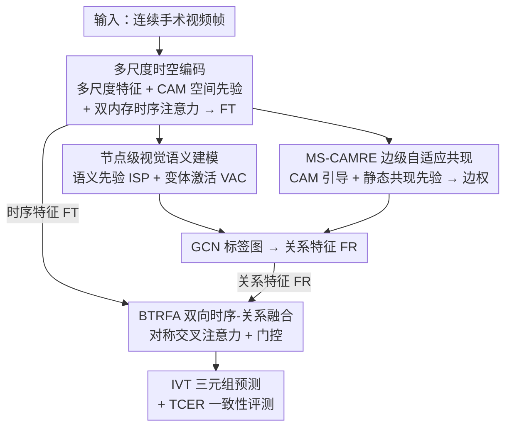

# TRCoRSurg: Temporal-Relational Co-Reasoning for Surgical Video Triplet Recognition

**会议**: CVPR 2026  
**论文**: [CVF Open Access](https://openaccess.thecvf.com/content/CVPR2026/html/Li_TRCoRSurg_Temporal-Relational_Co-Reasoning_for_Surgical_Video_Triplet_Recognition_CVPR_2026_paper.html)  
**代码**: https://github.com/Neesky/TRCoRSurg  
**领域**: 医学图像 / 手术视频理解  
**关键词**: 手术三元组识别, 标签相关性, 时序-关系协同推理, 共现先验, 一致性评测

## 一句话总结
TRCoRSurg 把手术视频里 `<器械, 动作, 目标>` 三元组识别拆成"帧内标签依赖 + 帧间时序语义"两条线，用 GCN 建标签图（节点融合语义先验与 CAM 视觉证据、边由 MS-CAMRE 自适应学共现）再用双向门控注意力 BTRFA 让时序与关系两路互相校正，在 CholecT45 / ProstaTD 上 APIVT 分别提升 5.1% / 7.8%，并提出 TCER 指标专门衡量三元组组合一致性。

## 研究背景与动机

**领域现状**：手术视频细粒度动作识别要从画面里读出"用什么器械、做什么动作、作用在哪个组织"。把每个手术活动表示成 `<instrument, verb, target>`（IVT）三元组，是目前粒度最细的理解范式，能支撑术中安全提示、术后分析、手术教学等下游应用。主流做法分两类：一类是基于注意力/CAM 的模型（如 RDV、Rendezvous），从视觉特征里学器械-动作-目标的关联线索并给出粗粒度空间先验；另一类是基于图（GCN）的模型，用静态词嵌入当节点、共现矩阵当边来建标签依赖。

**现有痛点**：作者指出两个一直没解决的硬伤。其一是**帧内标签依赖建模不足**——IVT 标签受解剖结构和手术流程强约束（某些器械和动作几乎必然一起出现，图 1 的共现矩阵极不均匀就是证据），但基于图的方法用的是静态共现，无法随单帧内的语义变化调整；CAM 方法虽然给了空间线索，却缺乏显式的关系推理。其二是**时序与关系推理彼此割裂**——大多数工作把帧间时序建模和帧内标签依赖学习当成两个独立模块，简单 add/concat 融合会忽略两者的互补信息，抓不住细粒度的时空依赖。

**核心矛盾**：手术场景里"实体被正确识别"和"实体组合被正确配对"是两回事。一个模型可能认出 grasper、grasp、gallbladder 三个元素，却把它们错配成临床上不合理的组合；而时序信息（动作沿手术时间线连贯演进）和关系信息（同帧内标签相互约束）必须同时利用、相互校正，单独任何一路在遮挡或快速运动时都会崩。

**本文目标**：用一个统一框架同时建模帧内标签依赖与帧间时序关系，并且让两者真正"协同推理"而非各算各的；同时补上一个能衡量组合一致性的评测指标。

**切入角度**：作者把标签相关性拆成**节点**和**边**两个层面——节点层把稳定的文本语义先验和随帧变化的 CAM 视觉证据拼起来，边层用 CAM 引导地自适应学习共现强度（而非死板套静态矩阵），再用一个双向交叉注意力门控模块把时序流和关系流耦合起来互相调制。

**核心 idea**：用"双向门控融合的时序-关系协同推理"代替"时序、关系两路独立 + 简单融合"，并配一套节点（语义+视觉）/ 边（自适应共现）双视角的标签图建模来解决帧内依赖。

## 方法详解

### 整体框架
框架输入是连续手术视频帧，输出是每帧的 IVT 三元组预测。整条管线由四块组成，并串成"先编码时空特征 → 再建标签关系图 → 最后把时序与关系融合"的流程：(a) **多尺度编码器**抽多层级视觉特征，全局平均池化成空间描述子，同时为每个三元组实体算 CAM 当空间先验；(b) **双内存时序注意力**用两个循环缓冲区（语义内存存最近 N 个空间描述子、决策内存存最近 N 个输出 logits）跨帧融合，产出时序特征 $F^T$；(c) **标签相关性建模**用 GCN 建图，节点融合内在语义先验（ISP）与变体激活线索（VAC），边由 MS-CAMRE 模块自适应学共现，产出关系特征 $F^R$；(d) **BTRFA 时序-关系融合**用两条对称交叉注意力分支让 $F^T$ 与 $F^R$ 互换上下文，再门控加权融合得到最终预测。此外作者还提出 TCER 指标专门衡量预测三元组的组合一致性。

### 关键设计

**1. 多尺度时空编码 + 双内存时序注意力：给关系推理打好空间先验、给序列稳住时间连贯**

针对"低帧率手术视频时序易抖、关系推理缺空间锚点"的问题，这一块同时干两件事。空间侧：编码器从骨干网的连续阶段取多尺度特征图 $\{F_k\}$（$k\in\{1,2,3\}$，低层抓纹理、高层抓语义），最高层 $F\triangleq F_3$ 经 GAP 得到紧凑空间描述子 $d=\mathrm{GAP}(F)\in\mathbb{R}^D$ 用于多标签预测；同时为每个实体标签 $c$ 算类激活图 $\mathrm{CAM}_c=\sum_{i=1}^{D} w_{c,i}\,F_i$，其中 $w_{c,i}$ 是该类在第 $i$ 个特征通道上的分类器权重，CAM 高亮出解剖学相关区域，为后续节点/边建模提供可解释的空间证据。

时序侧借鉴 SAM2，引入一个轻量双内存注意力：一个**语义内存**存最近 $N$ 个空间描述子，一个**决策内存**存最近 $N$ 个输出 logits；当前描述子通过交叉注意力与这两份内存融合，产出时序特征 $F^T$。相比直接堆 3D 卷积或单纯 Transformer，显式维护"语义历史 + 决策历史"两份内存能在低帧率、视觉证据稀疏时保持 IVT 预测的连贯，$N$ 实验中设为 8。

**2. 节点级视觉语义建模：让标签节点既有稳定语义、又随帧动态变化**

针对图模型用静态 GloVe 词嵌入当节点、抓不到"同一实体在不同上下文里关系会变"的问题，作者把每个标签节点拆成两半拼起来。一半是**内在语义先验** ISP $e_c$：把类别提示词 $\mathrm{Prompt}(c)$ 喂进预训练 SigLIP 文本编码器，再线性投影归一化，$e_c=\mathrm{Norm}(\mathrm{Proj}_e(\mathrm{SigLIP}_{\text{text}}(\mathrm{Prompt}(c))))$，提供稳定不变的语义含义。另一半是**变体激活线索** VAC $v_{c,t}$：把第 $t$ 帧该类的 $\mathrm{CAM}_{c,t}$ 投影归一化，$v_{c,t}=\mathrm{Norm}(\mathrm{Proj}_v(\mathrm{CAM}_{c,t}))$，捕捉随帧变化的视觉证据。最终节点 $F^{\text{label}}_{c,t}=[e_c, v_{c,t}]$ 把"标签级语义"和"帧级视觉证据"同时编码进去。消融里 VAC 单独加进来就让 APIVT 从 38.4 升到 39.2、TCERm 从 6.42 降到 5.70，说明把动态视觉证据注进节点确实让标签特征更可判别。

**3. MS-CAMRE 边级自适应共现建模：用 CAM 引导地学边、再叠静态共现先验**

针对"静态共现矩阵不能随实时视觉上下文调整"的问题，MS-CAMRE 把边权做成可自适应学习的。给定多尺度特征图 $F^k$ 和类别 CAM，先用 1×1 卷积对齐各尺度通道，再以 CAM 当 query 在多尺度特征上做交叉注意力抽多层级关系信息 $z_c^k=\mathrm{Attn}(Q=\mathrm{CAM}_c,\,K=F^k,\,V=F^k)$；用轻量 SE 融合跨尺度聚合（全局描述子生成通道权重，强化有信息的关系、抑制冗余），并接一个**零初始化卷积** $z_c=\mathrm{Conv}_{\text{zero}}(\mathrm{SE\text{-}Fuse}(\{z_c^k\}))$ 让动态边权在训练中渐进、稳定地注入。最后把数据集级静态共现矩阵 $M$（用标签出现的 Jaccard 相似度构建）当先验叠上去，自适应边权 $w_{ij}=\sigma(z_{c_i}^\top z_{c_j}+M_{c_i c_j})$，其中 $z_{c_i}^\top z_{c_j}$ 是自适应相关强度、$\sigma$ 是 sigmoid。过一层 GCN 得关系特征 $F^R=\mathrm{GCN}(F^{\text{label}}, w)$。图 7 的可视化很说明问题：纯静态先验的 LCM baseline 会让真实共现类别间的强度比根本没出现的类别还低，而 MS-CAMRE 能把真正共现的类别强度顶上去、压掉虚假高概率连接。

**4. BTRFA 双向时序-关系融合：让时序流和关系流协同演化而非顺序串接**

针对"时序与关系简单 add/concat 会丢互补信息"的问题，BTRFA 用两条**对称交叉注意力**分支让两路互查：$\hat{F}^T=\mathrm{Attn}(Q=F^T,K=F^R,V=F^R)$、$\hat{F}^R=\mathrm{Attn}(Q=F^R,K=F^T,V=F^T)$。再用可学习门控自适应平衡两者贡献：拼接特征过线性层加 sigmoid 得门图 $g=\sigma(\mathrm{FC}([\hat{F}^T,\hat{F}^R]))$，融合为 $\hat{F}=g\odot\hat{F}^T+(1-g)\odot\hat{F}^R$。这样两条流是"协同演化"而非顺序处理：时序分支沿手术时间线维持语义一致，关系分支对相关标签施加上下文正则。消融显示 BTRFA（40.9 / TCERm 4.16）明显优于 Add（39.5 / 5.32）、Concat（39.7 / 5.37）和单向交叉注意力（40.2 / 5.08），证明双向 + 门控的耦合方式确实比简单融合更能消解帧级歧义。

**5. TCER 一致性评测指标：专门暴露"实体对了但组合错了"的失败**

针对传统指标只看实体级或三元组级准确率、漏掉"组合不一致"的问题，作者提出 Triplet Consistency Error Rate。它只在所有分量预测都正确的帧（计 $N_{\text{marginal}}$）上度量两类组合错误：$\mathrm{TCER}_m=N_{\text{mis-match}}/N_{\text{marginal}}$ 统计实体都对但跨三元组错配（如把 $(I_1,V_2,T_1)$ 配错），$\mathrm{TCER}_c=N_{\text{mis-class}}/N_{\text{marginal}}$ 统计预测三元组里至少有一个元素不属于真值实体集合。这把关系不一致拆成"错配"和"错类"两类细粒度诊断，在医学多标签场景尤其有用——把正确器械配上不合适动作可能导致临床上不合理甚至不安全的解读。

### 损失函数 / 训练策略
两阶段训练。第一阶段只训空间编码器，$\mathcal{L}_1=\mathcal{L}_S$（空间描述子 $F$ 过 FC 分类器）。第二阶段联合训剩余三个模块，$\mathcal{L}_2=\mathcal{L}_T+\mathcal{L}_R+\mathcal{L}_{\text{BTRFA}}$，每个模块的特征输出（$F^T$ / $F^R$ / $\hat{F}$）各过一个 FC 分类器算损失。每个 $\mathcal{L}$ 都由两部分组成：直接分类损失 $\mathcal{L}_{\text{entity}}=\sum_{c\in\mathcal{C}}\mathrm{BCE}(\hat{y}_c,y_c)$（对所有三元组候选做 BCE），和耦合损失 $\mathcal{L}_{\text{couple}}$——后者用三元组级预测监督原子分量（I/V/T）：原子标签 $a$ 的预测概率取所有含它的三元组里的最大值 $\hat{P}_a^k=\max_{c\in\mathcal{C},\,c\ni(k,a)}\hat{y}_c$，再对所有原子标签求 BCE 之和 $\mathcal{L}_{\text{couple}}=\sum_{k\in\{I,V,T\}}\sum_{a\in\mathcal{A}^k}\mathrm{BCE}(\hat{P}_a^k,y_a^k)$。实现上用 4 张 H100、Adam，两阶段各 10 epoch、batch 32，第一阶段学习率 $3\times10^{-4}$、第二阶段降到 $2\times10^{-5}$，时序深度 $N=8$。

## 实验关键数据

### 主实验
在 CholecT45（45 段腹腔镜胆囊切除视频、1 fps、约 100.9K 帧、6 器械/10 动作/15 目标）和 ProstaTD（21 段机器人辅助前列腺切除视频、60,529 帧、多中心、7 器械/10 动作/10 目标）上对比。主指标是三元组级 APIVT，越高越好；TCER 越低越好。

| 数据集 | 方法 | APIVT↑ | API↑ | APV↑ | APT↑ | TCERm↓ | TCERc↓ |
|--------|------|--------|------|------|------|--------|--------|
| CholecT45 | RDV [15] | 29.9 | 92.0 | 60.7 | 38.3 | 7.20 | 3.10 |
| CholecT45 | RIT [19] | 33.8 | 91.2 | 65.3 | 43.7 | 8.71 | 2.80 |
| CholecT45 | MT4MTLKD [6] | 37.1 | 93.1 | 71.8 | 48.8 | 6.50 | 2.46 |
| CholecT45 | TERL [5] | 38.9 | 93.5 | 72.8 | 51.3 | – | – |
| CholecT45 | **Ours** | **40.9** | **95.7** | **73.6** | 51.1 | **4.16** | **2.09** |
| ProstaTD | RDV [15] | 26.1 | 74.2 | 55.1 | 49.8 | 20.80 | 5.60 |
| ProstaTD | MT4MTLKD [6] | 35.2 | 84.1 | 65.3 | 60.2 | 17.70 | 4.90 |
| ProstaTD | **Ours** | **37.5** | **88.0** | **65.9** | **61.7** | **13.20** | **4.70** |

CholecT45 上 APIVT 从最优 baseline 的 38.9 升到 40.9（相对 +5.1%），TCERm 从 6.50 降到 4.16（相对约 -36%）；ProstaTD 上 APIVT 35.2→37.5（相对 +7.8%）、TCERm 17.70→13.20（相对约 -25%）。Top-k 检索上模型整体有竞争力，仅在 CholecT45 的 Top-20 上略逊于最佳 baseline。

### 消融实验

| 配置 | APIVT↑ | TCERm↓ | TCERc↓ | 说明 |
|------|--------|--------|--------|------|
| W/o LCM | 37.9 | 6.65 | 2.67 | 无标签相关性建模 |
| LCM Baseline | 38.4 | 6.42 | 2.68 | 仅静态共现先验 |
| + VAC | 39.2 | 5.70 | 2.25 | 加节点变体激活线索 |
| + MS-CAMRE | 38.7 | 6.24 | 2.33 | 加边级自适应共现 |
| **Full (VAC+MS-CAMRE)** | **40.9** | **4.16** | **2.09** | 二者协同 |
| Add 融合 | 39.5 | 5.32 | 2.44 | 直接相加 |
| Concat 融合 | 39.7 | 5.37 | 2.32 | 拼接后投影 |
| Single CA | 40.2 | 5.08 | 2.25 | 单向交叉注意力 |
| **BTRFA** | **40.9** | **4.16** | **2.09** | 双向门控融合 |

### 关键发现
- **VAC 和 MS-CAMRE 互补、合体才发力**：单独加 VAC（39.2）或 MS-CAMRE（38.7）相对 LCM Baseline（38.4）增益有限，二者协同到 Full 才跳到 40.9——VAC 强化节点语义判别、MS-CAMRE 强化边的关系结构，缺一不可。
- **静态共现先验天花板很低**：从 W/o LCM（37.9）到 LCM Baseline（38.4）只涨 0.5，印证静态矩阵无法随手术上下文动态调整，必须靠自适应边建模。
- **融合方式上双向门控明显胜出**：Add/Concat 提升有限、单向交叉注意力（40.2）再进一步、双向 BTRFA（40.9 / TCERm 4.16）最佳，且 TCER 的改善幅度远大于 AP，说明 BTRFA 主要受益于"组合一致性"而非单纯涨实体精度。
- **遮挡/快速运动场景受益最大**：定性分析显示器械被部分遮挡或新旧器械交替时，纯时序方法预测剧烈抖动，而本文靠标签依赖能在视觉证据不全时推出合理三元组、保持稳定。

## 亮点与洞察
- **把"实体对、组合错"显式量化**：TCER 把传统 AP 看不见的失败（mis-match / mis-class）单独拎出来度量，这个诊断角度对临床安全很有价值——正确器械配错动作可能直接导致不安全解读，这种"为任务量身定做评测"的思路可迁移到任何结构化多标签预测。
- **节点 = 静态语义 + 动态视觉的拼接**：用 SigLIP 文本编码器提供稳定语义先验、用 CAM 提供随帧变化的视觉证据，两者拼成节点，比纯 GloVe 静态嵌入更贴合"同一实体在不同上下文关系会变"的现实，这个"稳定先验 + 变体证据"组合很有复用价值。
- **零卷积稳训练**：MS-CAMRE 用零初始化卷积渐进注入动态边权，借鉴了 ControlNet 式的稳态注入思想，避免训练早期不靠谱的边权扰乱 GCN。
- **双向门控让两路协同而非串接**：BTRFA 的对称交叉注意力 + 学习门控让时序流和关系流互为 query/key/value 地交换上下文，远比 add/concat 更能利用互补信息，消融数字（尤其 TCER）很有说服力。

## 局限与展望
- **作者承认结构过于复杂、训练困难**：四个模块 + 两阶段训练 + GCN + 双内存 + 双向注意力，组件多、调优成本高，难直接落地实时手术应用；作者计划探索自适应内存更新和轻量架构。
- **只在两个数据集验证**：CholecT45 和 ProstaTD 虽各自有代表性，但都偏特定术式（胆囊切除 / 前列腺切除），跨术式、跨机构的泛化性还需更多验证。
- **依赖预训练文本编码器**：ISP 来自 SigLIP，对手术专业术语 prompt 的语义覆盖质量会直接影响节点先验，论文未深入分析 prompt 设计或换用医学专用语言模型的影响。
- **TCER 只在"分量全对"的帧上统计**：$N_{\text{marginal}}$ 是分母约束，意味着分量预测本身就很差的模型反而可能 TCER 偏低（marginal 帧少），跨方法横向比 TCER 时需结合 AP 一起看，不能单独拿 TCER 比大小。

## 相关工作与启发
- **vs Rendezvous/RDV [15]**：RDV 用注意力从 ResNet 视觉特征学器械中心的关联线索、用 CAM 条件化动作和目标预测，但缺显式关系推理且时序建模弱；本文把关系做成可自适应学习的标签图、并显式耦合时序，CholecT45 上 APIVT 29.9→40.9。
- **vs GCN 类（CoLSurgical [26] 等）**：它们用 GCN + 生物医学语言模型增强语义一致，但节点多为静态嵌入、边多为静态共现；本文节点加了 CAM 变体证据、边用 MS-CAMRE 自适应学习，解决了静态图不能随帧调整的问题。
- **vs 时序扩展类（RIT [19]、MT4MTLKD [6]）**：RIT 用帧间依赖改进动作识别、MT4MTLKD 用知识蒸馏做层次特征，但都把时序与关系当独立组件；本文用 BTRFA 让两路双向协同，TCER 大幅下降说明组合一致性才是它们的主要短板。
- **vs 扩散类（Liu et al. [12]）**：扩散框架追求三元组预测连贯性，本文则从"标签图 + 时序-关系融合"的判别式路线达成一致性，且额外给出可量化的 TCER 诊断。

## 评分
- 新颖性: ⭐⭐⭐⭐ 节点/边双视角标签图 + 双向门控时序-关系融合 + 自定义 TCER 指标，组合上有清晰新意，但各组件多为已有技术（CAM、GCN、SAM2 式内存、交叉注意力）的巧妙拼装。
- 实验充分度: ⭐⭐⭐⭐ 两个数据集 SOTA、消融拆到 VAC/MS-CAMRE/融合策略逐项、配定性可视化，较完整；但仅两数据集、缺跨术式泛化与效率/参数量分析。
- 写作质量: ⭐⭐⭐⭐ 动机-痛点-方法链条清晰，图 1/2/3/7 配合到位；公式排版在缓存里偶有错位但原文应规范。
- 价值: ⭐⭐⭐⭐ 手术视频三元组识别落地价值高，TCER 这类"组合一致性"评测对临床安全很有意义，但作者自承结构复杂、实时性待解。

<!-- RELATED:START -->

## 相关论文

- [\[CVPR 2026\] Clinically-Grounded Counterfactual Reasoning for Medical Video Diagnosis](clinically-grounded_counterfactual_reasoning_for_medical_video_diagnosis.md)
- [\[CVPR 2026\] SurgCoT: Advancing Spatiotemporal Reasoning in Surgical Videos through a Chain-of-Thought Benchmark](surgcot_advancing_spatiotemporal_reasoning_in_surgical_videos_through_a_chain-of.md)
- [\[CVPR 2026\] Hyperbolic Relational Prompts for Intersectional Fairness in Medical VLMs](hyperbolic_relational_prompts_for_intersectional_fairness_in_medical_vlms.md)
- [\[CVPR 2026\] Temporal Inversion for Learning Interval Change in Chest X-Rays](temporal_inversion_for_learning_interval_change_in_chest_x-rays.md)
- [\[AAAI 2026\] Rethinking Surgical Smoke: A Smoke-Type-Aware Laparoscopic Video Desmoking Method and Dataset](../../AAAI2026/medical_imaging/rethinking_surgical_smoke_a_smoke-type-aware_laparoscopic_video_desmoking_method.md)

<!-- RELATED:END -->
