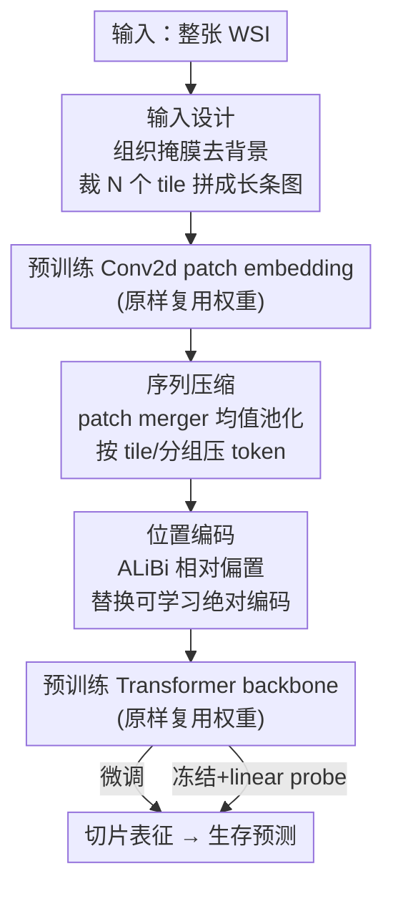

# Turning Pre-Trained Vision Transformers into End-to-End Histopathology Whole Slide Image Models for Survival Prediction

**会议**: CVPR 2026  
**论文**: [CVF Open Access](https://openaccess.thecvf.com/content/CVPR2026/html/Li_Turning_Pre-Trained_Vision_Transformers_into_End-to-End_Histopathology_Whole_Slide_Image_CVPR_2026_paper.html)  
**代码**: https://github.com/WonderLandxD/E2E-ViT  
**领域**: 医学图像 / 计算病理  
**关键词**: 全切片图像、生存预测、ViT、端到端、序列外推

## 一句话总结
作者发现预训练 ViT 在病理图像上学到的跨 patch 交互先验可以外推到更长的 token 序列，于是提出 E2E-ViT：只改输入排布、加一个无参 patch 合并、把绝对位置编码换成 ALiBi，**不增加任何可学习参数**就把一个 tile 级 ViT 直接变成端到端的 WSI 模型，在五个生存预测任务上同时超过两阶段 MIL 和切片基础模型（SFM）。

## 研究背景与动机

**领域现状**：全切片图像（WSI）动辄上十亿像素，主流分析是「两阶段」管线——先用预训练的 tile 编码器（多为 ViT，如 UNI、CONCH、Virchow）对从 WSI 裁出来的成千上万个 tile 做离线特征提取，再用多示例学习（MIL，如 ABMIL、TransMIL）把这些 tile 特征按 slide 级标签聚合成切片表征。近期的切片基础模型（SFM，如 CHIEF、GigaPath、TITAN）则在 tile 特征之上再预训练一个切片编码器，想得到任务无关的通用切片表征。

**现有痛点**：两阶段范式有三个绕不开的毛病。其一，**强依赖冻结的 tile 编码器权重**——它在下游任务里不更新，与切片级语境脱钩；其二，**离线分批编码丢掉了原图的感受野**：每个 tile 被单独喂进编码器，模型从此「看不到」tile 之间的空间连续性和区域交互，而这恰恰是刻画组织学结构的关键；其三，**生成的切片表征往往是任务相关的**，换个任务就要从头训。SFM 虽然能产出任务无关表征，但它训练时同样从未「见过」原始切片图像，依旧建立在表现良好的 tile 编码器之上。

**核心矛盾**：理想方案当然是一个**端到端的 WSI 模型**，直接吞下整张切片在统一框架里优化全局表征。但从零训练这种模型面临两座大山：一是计算成本——在 WSI 原生分辨率上做反向传播远超常规硬件；二是数据规模——公开 WSI 数据集通常只有数万张切片，而视觉社区的大规模预训练动辄上百万图像，差了几个数量级。已有的端到端尝试要么把原图下采样（损失有效感受野），要么走「一任务一权重」（只能产任务相关特征）。

**切入角度**：作者的关键观察是——**纯从零训练并非唯一出路**。一个 ViT 本质上只要求图像高宽是 kernel size $P$ 的整数倍，就能 token 化成 $(HW/P^2)$ 个 patch token 并无缝前向/反向。他们把同一张病理区域以 448、672、896、1120 四种分辨率喂进同一个预训练 ViT，可视化 CLS token 最后一层的注意力热图，发现重叠区域的注意力跨分辨率几乎一致、并平滑地扩展到新露出的外围区域。这说明**预训练 ViT 学到的跨 patch 交互先验是可外推的**，在更长 token 序列上依然有效。

**核心 idea**：既然先验能外推，那就不必从零训，而是把现成的 tile 级 ViT「改造」成能吃整张 WSI 的高分辨率模型——只动输入、序列长度和位置编码这三处，且不引入任何新参数。

## 方法详解

### 整体框架
E2E-ViT 不是新网络，而是一套作用在**任意预训练 ViT** 上的转换策略。输入是一整张 WSI，输出是切片级表征（可直接用于生存预测，或冻结后做 linear probe）。整个流程相比 vanilla ViT 只改三处：**输入设计**把整张切片的组织区域排成一条长条图喂进去；**序列压缩**用无参的 patch merger 把爆炸的 token 序列压回可计算的长度，同时保持与原 patch token 特征空间一致；**位置编码**把会限制外推的可学习绝对位置编码换成参数无关的 ALiBi 相对位置偏置。三步都不加可学习参数，所以预训练权重可以原样复用——既能端到端微调，也能冻结当离线编码器。

### 关键设计

**1. 输入设计：把整张切片的组织区域排成一条长条图，既去背景又保感受野**

直接把固定放大倍率的整张 WSI 喂进 ViT 行不通——大量活检切片含有与任务无关的大片背景，既浪费算力又稀释信号。作者先做预处理：在选定放大倍率下用 OTSU 或 GrandQC 得到组织掩膜去掉背景，再用滑动窗口裁出 $N$ 个互不重叠、大小为 $H_{px}\times H_{px}$ 的 tile（$H$ 取 ViT kernel size $P$ 的整数倍），最后把这 $N$ 个 tile 拼接成一张形状为 $3\times H\times (HN)$ 的**长条图**。这个排布的妙处在于：它既排除了任务无关的背景，又让全部组织内容**作为一个整体**暴露给模型——不像两阶段那样把 tile 切开单独编码，长条图经过同一个 backbone 时 self-attention 能在 tile 之间传递信息，原图的区域交互和空间连续性因此被保留下来。

**2. 序列压缩：无参 patch merger 把爆炸的 token 序列压回可算，且不破坏预训练特征空间**

ViT 的 kernel size 通常很小（8、14、16），把长条图丢进 patch-embedding 层会得到长度高达 $N\cdot(H/P)^2$ 的超长 token 序列，推理和微调都不现实。作者借鉴 token merging 的思路引入一个 **patch merger**：对每个 tile 的 patch token 集合 $T_i=[t_{i,1},\dots,t_{i,(H/P)^2}]\in\mathbb{R}^{(H/P)^2\times C}$ 做均值池化，压成单个 token

$$I_i = \frac{1}{(H/P)^2}\sum_{k=1}^{(H/P)^2} t_{i,k}.$$

它也支持把整条 token 序列切成 $G$ 个组 $\{\hat{T}_i\}_{i=1}^{G}$、在每组内合并 $\hat{I}_i = \frac{1}{|\hat{T}_i|}\sum_{k} \hat{t}_{i,k}$，从而灵活控制序列长度去适配不同下游配置或硬件预算。这个机制简单却关键：它**无参数**，且均值池化保持了 tile token 与原始 patch token 特征空间的一致性——这正是预训练权重能被直接复用、并给下游提供「即插即用」微调接口的前提。消融也显示均值池化稳定优于 max 池化，而 attention 池化虽相当但需额外训练、破坏了即插即用性。

**3. 位置编码：用参数无关的 ALiBi 相对位置编码替换可学习绝对编码，专治长序列外推**

位置编码让 token 具备位置感知、打破排列不变性。但多数 ViT 用**可学习的绝对位置编码**，做序列外推时只能对多出来的 token 位置做插值，这恰恰会削弱外推能力——而 E2E-ViT 的输入序列远长于预训练时的长度，正撞在这个痛点上。作者改用 **ALiBi**：一种参数无关的相对位置编码，按 token 间距离施加注意力偏置，不依赖插值，因此能更好地外推到更长序列。表 4 的消融印证了这点：在 CONCH、H0-mini 上 ALiBi 明显优于 None 和可学习绝对编码（如 HNSC 上 CONCH 从 0.69 提到 0.74），与「换 PE 是为了保住外推」的动机一致。

### 损失函数 / 训练策略
任务为生存预测，用 C-index 衡量风险排序质量。优化器 Adam，学习率 $10^{-4}$，batch size 1，30 epoch，patience 5 的早停，单张 A100 80GB。与两阶段 MIL 比时，因 MIL 无初始化权重需训练，转换后的 ViT 在**全参数微调**下评测；与 SFM 比时，因 SFM 已预训练，双方都在**linear probing**（冻结 backbone 只训分类头）下评测。

## 实验关键数据

数据集为 CPTAC 与 MBC 的五个公开癌种生存预测任务：CCRCC（n=218）、HNSC（n=243）、LUAD（n=313）、PDAC（n=227）、MBC（n=96），五折交叉验证，报告 C-index 的均值±标准差。三种 backbone 覆盖三类预训练范式：ViT-Small（ImageNet）、CONCH（病理图文对比）、H0-mini（病理图像 SSL）。

### 主实验：vs 两阶段 MIL（全参数微调，Overall 为五任务平均）

| Backbone | 最优两阶段 MIL | E2E-ViT（本文） | 提升 |
|----------|---------------|----------------|------|
| ViT-Small | 0.6386（TransMIL） | **0.6667** | +0.0281 |
| CONCH | 0.6902（2DMamba） | **0.6978** | +0.0076 |
| H0-mini | 0.6810（2DMamba） | **0.7158** | +0.0348 |

三种 backbone 经 E2E-ViT 转换后均稳定超过 7 个 MIL 方法（ABMIL/CLAM/DSMIL/TransMIL/WiKG/RRTMIL/2DMamba）的最优值。尤其在 MBC 上 E2E H0-mini 拿到 0.8176，远高于同 backbone 的 MIL 方法。值得注意的是，ImageNet 预训练的 ViT-Small 经端到端微调后大幅缩小了与病理预训练 backbone 的差距，说明「直接看原图」本身带来的增益可观。

### 对比 SFM（linear probing，Overall 为五任务平均）

| 方法 | Overall C-index | 类型 |
|------|----------------|------|
| GigaPath | 0.6229 | vision-only SFM |
| CHIEF | 0.6386 | vision-only SFM |
| MADELEINE | 0.6378 | vision-only SFM |
| FEATHER | 0.6152 | vision-only SFM |
| PRISM | 0.6458 | vision-language SFM |
| TITAN | 0.6582 | vision-language SFM |
| **E2E H0-mini（本文）** | **0.6685** | 转换 ViT |
| **E2E CONCH（本文）** | **0.6534** | 转换 ViT |

冻结状态下，转换得到的 H0-mini 总体最佳，超过了两个图文 SFM；CONCH 稳超所有纯视觉 SFM。连 ImageNet 预训练的 E2E ViT-Small（0.5959）都在多个数据集上反超部分 SFM，凸显端到端切片表征的优势。

### 消融实验

| 维度 | 配置 | 关键发现 |
|------|------|---------|
| Patch 合并（表3） | Max / Attention / **Mean** | 均值池化稳定优于 max；attention 相当但需额外训练、破坏即插即用 |
| 位置编码（表4） | None / Learnable / **ALiBi** | ALiBi 相对编码在病理 backbone 上明显领先，提升外推适配性 |
| 序列长度（图5） | 长度/tile 数 比例 0.5–4.0 | 整体相对稳定，证明 backbone 外推能力强；不同癌种最优感受野不同 |
| 推理效率（图4） | 10,000 tile | E2E H0-mini 一秒内出特征，比 CHIEF 快 2.64×、比 FEATHER 快 7.49× |
| 大模型（图6/7） | UNI / Prov-GigaPath / Virchow / PathOrchestra / UNI-2 | 五个大 ViT 均可转换，LUAD 上一致超 ABMIL（最高 +3.87%），Virchow/PathOrchestra/UNI-2 在 MBC 超 TITAN |

### 关键发现
- **「看原图」是涨点主因**：E2E-ViT 相对两阶段最大的不同就是 backbone 在原始 WSI 视野下端到端工作，可视化（图8）显示其 CLS 注意力能聚焦癌变区域且分布更细腻、边界更多，而 SFM 倾向于在局部产生高度饱和的热点——这种更均匀的全局注意力对依赖全局空间语境的生存分析特别有利。
- **位置编码外推是隐形瓶颈**：换成 ALiBi 的增益在病理预训练 backbone 上尤为显著，印证了「绝对编码插值削弱外推」的诊断。
- **大模型要权衡**：转换大 ViT 可行且仍有优势，但计算成本高、参数耦合紧、对扰动敏感，可能损失预训练先验，需在效率与性能间谨慎取舍。

## 亮点与洞察
- **零新增参数的「改造」哲学**：不发明新结构、不从零预训练，仅靠重排输入 + 无参合并 + 换 PE 就把 tile ViT 升级成 WSI 模型，让 UNI/CONCH/Virchow 等现成强 backbone 全部「免费」获得端到端能力——可复用性极强。
- **「先验可外推」这一观察是全文支点**：四分辨率注意力热图的实验把一个直觉（ViT 跨 patch 交互先验在更长序列上仍有效）变成了可验证的依据，方法的每一步都顺着它推导，逻辑闭环漂亮。
- **长条图 + patch merger 的组合**很巧：长条图保住了 tile 间交互，merger 又用无参均值池化把序列压回可算且不破坏特征空间——这套「即插即用」思路可迁移到其他需要把短上下文模型扩到长上下文、又想复用预训练权重的场景。

## 局限性 / 可改进方向
- **作者承认的局限**：转换大 ViT 计算成本高、参数耦合紧、对扰动敏感，可能丢失预训练先验；patch merger 目前是固定均值池化，可学习合并策略留待未来。
- **任务/规模偏窄**：只验证了生存预测一类任务，数据集规模偏小（MBC 仅 96 例），五折 CV 下方差不小（部分单数据集标准差超 0.1），需在更多临床病理任务上验证泛化性。
- **缺乏长序列后训练**：当前依赖现成 backbone 的外推能力，作者计划在高分辨率图像上做后训练来强化长序列外推，并引入多尺度机制、开发图文多模态变体。
- **未充分对比从零端到端方法**：与 ABMILX、Pixel-Mamba 等端到端架构的直接定量对比偏少，「复用先验 vs 从零训」的优势量级还可更系统地刻画。

## 相关工作与启发
- **vs 两阶段 MIL（TransMIL/2DMamba 等）**：它们把冻结 tile 特征当示例做聚合，backbone 不更新、看不到 tile 间交互；E2E-ViT 让 backbone 端到端看原图，因此能捕捉更丰富的组织形态信息，五任务一致占优。
- **vs SFM（CHIEF/GigaPath/TITAN 等）**：SFM 在 tile 特征之上再预训练切片编码器，训练时仍未「见过」原图、丢弃了感受野信息；E2E-ViT 直接吞原图，linear probe 下即超过纯视觉 SFM、逼近图文 SFM，且推理更快。
- **vs 从零端到端（StreamingCNN/LongViT/Pixel-Mamba）**：它们或下采样原图损失感受野、或一任务一权重、或缺病理域预训练权重；E2E-ViT 复用病理预训练 ViT 的先验，既保感受野又得可迁移表征。
- **vs token merging（ToMe 类）**：本文把序列压缩从「图像分类提速」迁移到「让超长 WSI 序列可算同时保特征空间一致」，是一次有针对性的领域改造。

## 评分
- 新颖性: ⭐⭐⭐⭐ 不靠新结构而靠「先验可外推」的洞察把 tile ViT 零参数改造成 WSI 模型，视角新颖、落点清晰
- 实验充分度: ⭐⭐⭐⭐ 三类 backbone × 五任务，对比 MIL/SFM、效率与多种消融齐全；但任务局限于生存预测、数据集偏小
- 写作质量: ⭐⭐⭐⭐ 动机层层递进、三处改动与三张消融一一对应，图文逻辑清晰
- 价值: ⭐⭐⭐⭐ 提供让现成病理 ViT「免费」端到端化的实用范式，即插即用、推理快，对计算病理社区落地友好

<!-- RELATED:START -->

## 相关论文

- [\[CVPR 2026\] TopoSlide: Topologically-Informed Histopathology Whole Slide Image Representation Learning](toposlide_topologically-informed_histopathology_whole_slide_image_representation.md)
- [\[CVPR 2026\] FBTA: Enabling Single-GPU End-to-End Gigapixel WSI Classification with Feature Bridging and Translation Alignment](fbta_enabling_single-gpu_end-to-end_gigapixel_wsi_classification_with_feature_br.md)
- [\[CVPR 2026\] MDCS-MoAME: Multi-directional Composite Scanning with Mixture of Attention and Mamba Experts for Cancer Survival Prediction](mdcs-moame_multi-directional_composite_scanning_with_mixture_of_attention_and_ma.md)
- [\[CVPR 2026\] MLLM-HWSI: A Multimodal Large Language Model for Hierarchical Whole Slide Image Understanding](mllm-hwsi_a_multimodal_large_language_model_for_hierarchical_whole_slide_image_u.md)
- [\[CVPR 2026\] H2-Surv: Hierarchical Hyperbolic Multimodal Representation Learning for Survival Prediction](h2-surv_hierarchical_hyperbolic_multimodal_representation_learning_for_survival_.md)

<!-- RELATED:END -->
