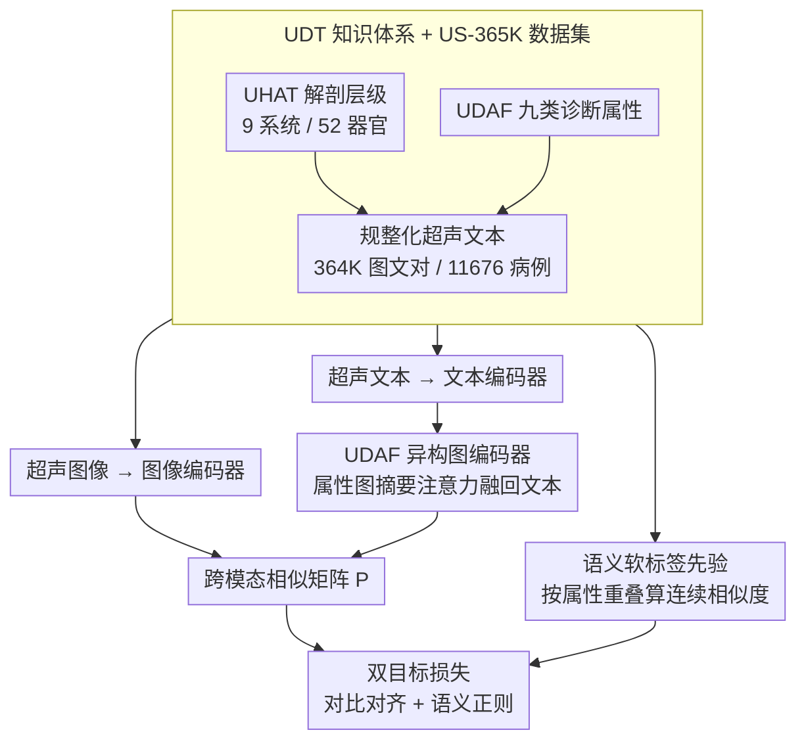

# Ultrasound-CLIP: Semantic-Aware Contrastive Pre-training for Ultrasound Image-Text Understanding

**会议**: CVPR 2026  
**arXiv**: [2604.01749](https://arxiv.org/abs/2604.01749)  
**代码**: [https://github.com/ZJUDataIntelligence/Ultrasound-CLIP](https://github.com/ZJUDataIntelligence/Ultrasound-CLIP)  
**领域**: 医学图像 / 超声多模态理解  
**关键词**: 超声图文预训练、诊断 taxonomy、语义软标签、异构图编码、跨模态检索

## 一句话总结

这篇论文的核心贡献不是只做了一个“超声版 CLIP”，而是围绕超声特有的解剖层级和诊断属性重新定义了图文对齐目标：先构建超声知识体系 UDT 和大规模 US-365K 数据集，再用语义软标签与属性异构图把文本里的临床关系显式注入对比学习，从而得到更像“懂超声”的视觉语言表示。

## 研究背景与动机

超声是临床使用极广的影像模态，但它在现有医疗视觉语言预训练体系里处于明显被低估的位置。论文统计显示，主流医学图文数据集里超声占比通常低于 5%，甚至很多大规模数据集里几乎可以忽略不计。结果就是，现有 Medical CLIP 模型大多是被 CT、MRI、病理图像的语言分布主导的。

这会带来两个直接问题。第一，超声图像高度依赖组织的声学特性，同一种病灶在不同器官、不同探查平面上会呈现完全不同的纹理和回声模式，标准 CLIP 那套“自然图像描述词 + 二元正负样本”难以覆盖这种复杂语义。第二，超声报告里有大量极具模态特性的诊断描述，例如回声强弱、边缘、后方回声、血流情况等，这些属性之间又存在结构化关系，普通文本编码器很难自动学到。

因此本文把问题指向两层根因：

- **语义歧义**：同一病灶可被不同描述方式表达，二元对比学习把“相近但不完全相同”的样本全当负样本会引入噪声。
- **结构先验缺失**：超声诊断不是简单 caption matching，而是多维属性联合判断，属性之间的依赖关系应该被编码。

作者的出发点很务实。既然现有模型缺数据、缺 taxonomy、缺结构，那就先补齐这三件事：构建超声专属大规模数据集 US-365K，定义超声诊断知识体系 UDT，再在训练目标里显式利用这些知识，而不是指望模型自己从弱文本里摸索出来。

## 方法详解

### 整体框架

Ultrasound-CLIP 想解决的，是通用 CLIP 在超声上"既缺数据、又缺结构"的双重短板。它保留 CLIP 式双编码器骨架——图像编码器 $f_\theta$ 吃超声图像、文本编码器 $g_\phi$ 吃超声描述文本——但不再让两者只靠 one-hot 正负配对来对齐，而是在文本这一侧插进两条与超声领域强相关的增强路径。

第一条把每个病例文本里的诊断属性关系编码成一张异构图，再融合回文本向量，让文本表示带上"病灶类型—回声—边缘—血流"之间的配套结构；第二条不再把同 batch 里非配对的样本一律当负样本，而是按超声属性的重叠程度给出一个连续值的语义相似度先验。最终训练目标是标准对比损失加一项语义对齐损失，$L = L_{\text{CLIP}} + \lambda L_{\text{semantic}}$，让模型既守住跨模态检索能力，又不会被二元标签逼着忽略临床上"相近但不相同"的病例。

### 关键设计

**1. UDT 与 US-365K：先把"预训练对象到底是什么"定义清楚**

超声在主流医疗图文数据里占比常低于 5%，现有 Medical CLIP 学到的语言分布被 CT、MRI、病理主导，对超声特有的回声、后方回声、血流这些属性几乎没有概念。作者的判断是：如果训练数据本身就不包含超声的属性空间，再怎么精调对比损失也只是头痛医头。所以第一步不是改损失，而是先建知识体系。他们提出 UDT（Ultrasonographic Diagnostic Taxonomy），分两层：`UHAT` 管解剖层级，把 9 个 body system、52 个 organ 组织成树；`UDAF` 管九类临床诊断属性——body system、organ、diagnosis、shape、margins、echogenicity、internal characteristics、posterior acoustic phenomena、vascularity。再用这套 taxonomy 把原始超声文本规整化，从五个公开来源构建出 364,365 个图文对、覆盖 11,676 个临床病例的 US-365K。这一步解决的是"预训练对象"本身的根问题，后面两个设计都建立在这套属性空间之上。

**2. UDAF 异构图编码器：把属性关系当成一份“备忘录”贴回文本向量**

有了 taxonomy 规整出的属性空间还不够——属性之间的依赖（比如某种病灶类型往往配套特定的回声和边缘特征）是结构信息，直接丢给文本编码器做词平均会被抹平。这一设计在文本编码器之后插一条增强支路：把每个病例的文本标签转成一张异构图，节点分诊断节点和属性节点两类，两类之间全连接构成二部图。轻量图网络先算出节点表示，经 attention pooling 得到图摘要向量 $g_i$；随后用多头注意力让原始文本向量 $t_i$ 去 query 这个图向量，再过一道 gated residual 得到增强后的文本表示 $\tilde{t}_i$。举个具体的例子：一个甲状腺结节病例，“diagnosis=结节、shape=不规则、echogenicity=低回声、vascularity=丰富”这四个属性节点和诊断节点全连成图，图摘要把这组配套关系压成一个向量，再通过注意力补进文本表示——模型读到的就不只是几个孤立属性词，而是一份带临床配套关系的“备忘录”。这种轻量 grafting 比从头训一个大医学语言模型现实得多，也让文本侧更像在做临床推理而非单纯 caption alignment。

**3. 语义软标签先验：让“相近但不同”的病例不再被硬拉开**

超声文本里“语义接近、表述不同”的情况远比自然图像 caption 常见——同器官、同诊断属性的两个病例，描述用词可能完全不一样。标准对比学习把对角线之外全压成 0，等于强迫模型把临床上相近的病例在表示空间里拉远，引入的是结构性噪声而非有用信号。作者的做法是把“相似有程度之分”这件事直接写进监督信号：对 UDAF 里每个属性任务 $k$ 维护一个标签相似度矩阵 $S^{(k)}$，对样本 $i$、$j$ 先在每个任务上算两者标签集合的平均相似度，再对九个任务求均值得到整体软相似度 $\tilde{s}_{ij}$。于是一个 batch 的目标矩阵不再是非 0 即 1 的对角阵，而是一张连续值的软 prior，它正是下面语义损失要逼近的监督目标——模型被允许把同属性病例放得近、把完全无关的放得远，监督粒度比硬负样本细得多。

### 损失函数 / 训练策略

训练目标由两项组成。**对比对齐损失**是标准的对称 CLIP 损失，负责拉近图像与对应文本表示，守住跨模态检索能力。**语义损失**则对预测出的跨模态相似矩阵施加约束，让它在数值上接近设计 3 给出的 UDAF 软 prior，同时用一个 KL 项在分布层面保持一致。两者用 $\lambda$ 加权联合：单用 $L_{\text{CLIP}}$ 会忽略超声语义的连续性，单用语义矩阵又会牺牲原始检索能力，合起来才能既检索得准、又懂属性细节。

## 实验关键数据

### 主实验

论文首先在 US-365K 自身的九类诊断属性分类任务上比较通用 CLIP、医学 CLIP 和若干本文变体。完整模型在平均准确率和平均召回率上都明显领先。

| 方法 | AvgAcc | AvgRecall | 备注 |
|---|---:|---:|---|
| CLIP | 13.29 | 28.75 | 通用 CLIP，几乎不懂超声语义 |
| MedCLIP | 25.37 | 31.88 | 医学预训练，但超声覆盖不足 |
| BiomedCLIP | 33.81 | 35.11 | 较强医学基线 |
| Ultrasound-CLIP-Ds+g | 50.84 | 52.87 | 语义损失与图编码的基础组合 |
| Ultrasound-CLIP-Ds | 48.62 | 53.12 | 仅强调语义先验 |
| Ultrasound-CLIP-Dg | 49.87 | 55.12 | 仅强调图结构增强 |
| **Ultrasound-CLIP** | **59.61** | **61.08** | 两个模块一起用效果最好 |

从数值看，完整模型比最强医学基线 BiomedCLIP 在 AvgAcc 上高出 25 个点以上，说明增益不是小修小补，而是“模态理解方式”发生了变化。

### 检索与组件分析

除了分类，作者也在 US-365K 测试集上考察图文检索 Recall@K。这里很能看出图结构与语义先验是如何互补的。

| 方法 | I2T R@5 | I2T R@10 | I2T R@50 | T2I R@5 | T2I R@10 | T2I R@50 |
|---|---:|---:|---:|---:|---:|---:|
| CLIP | 0.1420 | 0.2451 | 0.6306 | 0.1662 | 0.2783 | 0.6767 |
| PMC-CLIP | 0.1808 | 0.3011 | 0.7215 | 0.1814 | 0.3038 | 0.7312 |
| BiomedCLIP | 0.1788 | 0.2979 | 0.7029 | 0.1864 | 0.3089 | 0.7206 |
| Ultrasound-CLIP-Ds | 0.1568 | 0.2683 | 0.6692 | 0.1550 | 0.2659 | 0.6707 |
| Ultrasound-CLIP-Dg | 0.2147 | 0.3444 | 0.7638 | 0.2147 | 0.3520 | 0.7774 |
| **Ultrasound-CLIP** | **0.2359** | **0.3745** | **0.7909** | **0.2383** | **0.3781** | **0.8022** |

一个很有意思的现象是，单独图编码器版本 `Dg` 在检索上已经很强，说明异构图对文本表示质量的改善非常直接；但加入语义损失后的完整模型还能继续提升，说明软标签先验对检索排序仍然有效，而非只对分类有帮助。

### 关键发现

- 与通用 CLIP 和医学 CLIP 相比，本文方法的提升首先来自数据与 taxonomy，而不是单纯换了一个损失函数。
- `Dg` 和 `Ds` 各自都有效，但完整模型显著最好，说明结构先验和语义软监督解决的是不同层面的错误。
- 论文还报告了更强的下游迁移结果：在线性探测的平均成绩达到 75.40%，完整微调平均成绩达到 84.23%，并在 Breast 数据集上达到 92.13%，说明预训练得到的表示不只适合自家基准。
- 患者级数据划分很关键。超声数据里图像相似度很高，如果不严格按 patient split，很容易高估方法性能。作者在这一点上处理得比较规范。

## 亮点与洞察

- 这篇论文的最大亮点在于，它不是“把 CLIP 拿来训超声数据”，而是重新定义了超声的语义坐标系。UDT 的价值并不只服务本文方法，后续很多超声多模态工作都可以直接继承这个层级标签体系。
- 语义软标签这一设计非常适合医疗场景。医学文本中的近义、相关和部分重叠远比自然图像 caption 更常见，用 hard negative 会天然吃亏。
- 异构图编码器的作用不是替代文本编码器，而是给文本向量提供一份“属性关系备忘录”。这种轻量 grafting 的做法比从头设计一个大而复杂的医学语言模型更现实。
- 数据集构建流程也值得重视。作者并没有停留在收集图文对，而是用 UDT 驱动标签抽取和标准化，使 US-365K 同时适合作为预训练集和评测集。

## 局限与展望

- 尽管 US-365K 已经是超声领域的大规模数据集，但它主要来源于公开病例站点与教学资源，真实医院工作流中的噪声分布、设备差异和报告风格仍可能更复杂。
- UDAF 目前覆盖九类属性，已经相当实用，但仍不能穷尽所有专科超声场景。例如心超、介入超声等更动态的诊断信息尚未被纳入。
- 模型目前仍以静态图像-文本配对为核心。超声常见的视频帧、探头运动和多切面联合判断，在这套框架里还没有真正利用起来。
- 语义先验矩阵依赖人工或规则化的标签相似度设计，这保证了可控性，但也可能限制对更隐性的临床相似关系的表达。
- 一个自然的下一步是把 UDT 继续扩展成跨任务知识图谱，让检索、分类、报告生成甚至 VQA 共用一套超声语义底座。

## 相关工作与启发

- **vs 通用 CLIP**：通用 CLIP 在超声上并非只是“领域偏移”，而是连属性空间都不对；本文是从 ontology 层补齐这个差距。
- **vs 医学 CLIP**：很多医学 CLIP 方法更偏泛化的 radiology 预训练，超声占比太小，导致它们学到的是“广而浅”的医学语义；本文则做到了“窄而深”。
- **vs 专科小数据超声模型**：像 Fetal-CLIP 或乳腺特定模型在各自任务上可能很强，但覆盖面有限；本文强调的是跨解剖部位的统一预训练基座。
- 对研究上的启发是，医学多模态模型往往先需要补“知识结构”，再谈更大的模型。taxonomy、图结构和软标签这类方法，在专科医学影像里往往比盲目扩容参数更有效。

## 评分

- 新颖性: ⭐⭐⭐⭐⭐ 数据集、taxonomy、图结构和语义损失一起形成完整方案，不是单点小改。
- 实验充分度: ⭐⭐⭐⭐ 预训练任务、检索、迁移任务都覆盖到了，证据较强，但更多医院外部验证会更稳。
- 写作质量: ⭐⭐⭐⭐ 逻辑很清楚，问题定义、数据构建、方法与实验之间衔接紧密。
- 价值: ⭐⭐⭐⭐⭐ 对超声多模态方向非常关键，US-365K 与 UDT 本身就有长期复用价值。

<!-- RELATED:START -->

## 相关论文

- [\[CVPR 2026\] A Semi-Supervised Framework for Breast Ultrasound Segmentation with Training-Free Pseudo-Label Generation and Label Refinement](a_semi-supervised_framework_for_breast_ultrasound_segmentation_with_training-fre.md)
- [\[CVPR 2026\] CHIPS: Efficient CLIP Adaptation via Curvature-aware Hybrid Influence-based Data Selection](chips_efficient_clip_adaptation_via_curvature-aware_hybrid_influence-based_data_.md)
- [\[AAAI 2026\] SEMC: Structure-Enhanced Mixture-of-Experts Contrastive Learning for Ultrasound Standard Plane Recognition](../../AAAI2026/medical_imaging/semc_structure-enhanced_mixture-of-experts_contrastive_learning_for_ultrasound_s.md)
- [\[CVPR 2026\] F$^2$-Assist: Multi-Phase Fetal Growth Forecast and Report Generation from Ultrasound Examination](f2-assist_multi-phase_fetal_growth_forecast_and_report_generation_from_ultrasoun.md)
- [\[ICML 2026\] MEG-XL: Data-Efficient Brain-to-Text via Long-Context Pre-Training](../../ICML2026/medical_imaging/meg-xl_data-efficient_brain-to-text_via_long-context_pre-training.md)

<!-- RELATED:END -->
