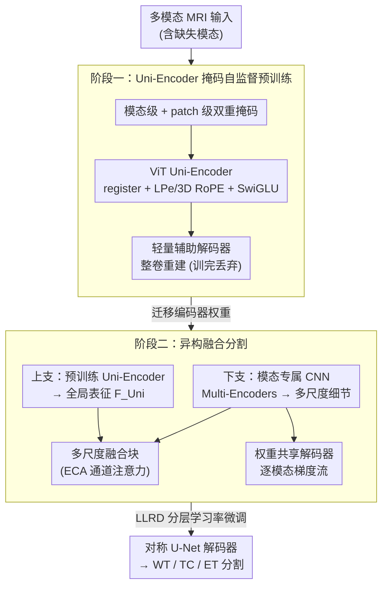

# Uni-Encoder Meets Multi-Encoders: Representation Before Fusion for Brain Tumor Segmentation with Missing Modalities

**会议**: CVPR 2026  
**arXiv**: [2604.22177](https://arxiv.org/abs/2604.22177)  
**代码**: https://github.com/Hooorace-S/UniME (有)  
**领域**: 医学图像  
**关键词**: 脑肿瘤分割、缺失模态、掩码自监督、ViT-CNN 异构、表征先于融合

## 一句话总结
UniME 用「表征先于融合」的两阶段异构设计解决缺失模态下的脑肿瘤分割：阶段一用单个 ViT Uni-Encoder 做掩码自监督预训练、学到对缺失模态鲁棒的统一表征，阶段二再并联多个模态专属 CNN Multi-Encoders 补回高分辨细节，在 BraTS 2023/2024 上对各种缺模态组合的平均 DSC 都超过此前 SOTA（ET 提升 2.4%~2.9%）。

## 研究背景与动机
**领域现状**：多模态 MRI（FLAIR / T1ce / T1 / T2）为脑肿瘤分割提供互补信息，但临床扫描经常缺一两个模态（如 T2 易受伪影干扰常不可用）。缺模态分割主流有两大流派：一是最大化跨模态互补，靠模态合成或知识蒸馏补回缺失信息；二是重新设计架构以更好利用现有模态，典型是 HeMIS 范式——四个独立 CNN 编码器并行抽特征、下游再融合。

**现有痛点**：合成法往往恢复不出细结构，蒸馏管线复杂难扩展；HeMIS 范式则受限于 CNN 编码器的局部感受野——哪怕下游用 Transformer 做全局融合，上游 CNN 早已把跨模态语义"锁死"在局部，形成跨模态融合的性能天花板。另一条路是纯 ViT 自监督，能抓全局语义、建模跨模态关系，但纯 ViT 缺乏卷积归纳偏置，在像素级精度上抓不住细解剖结构，且单一编码器也无法充分挖掘模态专属信息。

**核心矛盾**：缺模态分割的理想方法要同时做到三件事——抓细粒度结构、建模跨模态互补、充分利用现有模态，但现有方法总在这三者间 trade-off，鱼与熊掌不可兼得。根因在于大家都把"学表征"和"做分割"耦合在同一套编码器里：要细节就上 CNN（牺牲全局语义），要全局就上 ViT（牺牲像素精度）。

**本文目标**：把"表征学习"从"分割"里解耦出来，让一个全局语义模块专心建模跨模态互补、再让若干局部细节模块专心补回模态专属高分辨特征。

**核心 idea**：表征先于融合（representation before fusion）——先用 ViT Uni-Encoder 在掩码自监督下学一个对缺模态鲁棒的统一全局表征，再并联 CNN Multi-Encoders 把多尺度细节融进去，用异构两阶段设计同时拿下三个目标。

## 方法详解

### 整体框架
UniME 的输入是含缺失的多模态 MRI 体数据 $\mathbf{X}\in\mathbb{R}^{K\times D\times H\times W}$，输出是三个嵌套子区域（WT 全肿瘤 / TC 肿瘤核心 / ET 增强肿瘤）的分割。整个方法围绕一条"先学表征、再做融合分割"的主线，拆成两个阶段：

**阶段一（Uni-Encoder 预训练）**只训练一个 ViT Uni-Encoder：对输入做模态级 + patch 级双重随机掩码，让编码器在"看不全"的情况下重建整卷，逼它学会用残存模态推断缺失模态——这就把"跨模态互补建模"压进了一个统一表征里。预训练期挂一个轻量辅助解码器算重建损失，训完即丢，保证表征学习是"以编码器为中心"的。

**阶段二（网络微调）**搭一个异构分割网络，两条并行支路：上支把（同样随机掩模态后的）输入喂给阶段一预训练好的 Uni-Encoder，拿到全局语义表征 $\mathbf{F}_{\mathrm{Uni}}$；下支为每个模态配一个 U-Net 式 CNN 编码器，抽各自的高分辨多尺度细粒度特征。两支特征经多个融合块（含 ECA 通道注意力）逐级融合，最后由对称 U-Net 解码器输出分割。微调时用 LLRD 分层学习率，把预训练学到的语义知识"保鲜"住。

下图给出从输入到分割的两阶段数据流：

### 关键设计

**1. 表征先于融合的两阶段异构设计：解耦"学语义"和"做分割"**

这是 UniME 的总纲，直接针对"三目标互相打架"这一核心矛盾。以往方法把表征和分割捆在一套同构编码器里，导致只能在"全局语义"与"像素细节"间二选一。UniME 把流程切成两段、用两类异构骨干各司其职：ViT Uni-Encoder 擅长全局上下文与跨模态关系，专门负责"学一个对缺模态鲁棒的统一表征"；CNN Multi-Encoders 擅长局部高分辨结构，专门负责"补回模态专属细节"。消融证实这种解耦是必要的——单用预训练 Uni-Encoder 平均 DSC 82.45，单用 Multi-Encoders 78.90，二者结合且预训练后才达到 83.49，说明全局语义与局部细节确实互补、缺一不可。

**2. Uni-Encoder 掩码自监督预训练：用"看不全还要重建"逼出跨模态互补**

针对"如何建模跨模态互补、抗缺模态"，阶段一沿用 M3AE 的双重掩码——模态级用 $\delta_m\sim\text{Bernoulli}(1-p_m)$（$p_m=0.5$）整通道随机丢模态，patch 级用 $\eta_{m,i}\sim\text{Bernoulli}(1-q_m)$ 丢局部 patch，联合掩码 $\gamma_{m,i}=\delta_m\cdot\eta_{m,i}$，并强制 $\sum_m\delta_m\ge 1$ 保证至少留一个模态。被掩位置替换为可学习 mask token，再由 patch tokenizer（3D 卷积，核/步长均为 patch 大小 $P=8$，取小 patch 以抓医学细结构；模态沿通道而非 token 轴拼接以控序列长度）切成 token。

关键在于重建损失算的是**整卷**而非只算被掩区域：

$$\mathcal{L}_{\text{rec}}=\|\mathbf{X}-\widehat{\mathbf{X}}\|_2^2+\gamma\|\texttt{Mask}\|_2,\quad \gamma=0.005$$

因为模态级丢弃会整通道隐藏一个模态、高 patch 掩码率又常使没有任何位置拥有完整模态集合，所以对全卷计算重建才能逼模型用残存模态去补全缺失模态，从而学到更丰富的跨模态表征——这与 MAE 只对掩码区域算损失的做法不同。预训练期的辅助解码器（三个 3D 转置卷积上采样块）只为提供重建监督，训完即丢，保持"以编码器为中心"。

**3. 面向小数据医学场景的 ViT 改造：register + 双位置编码 + SwiGLU**

纯 ViT 在数据有限的 3D 医学分割里容易"水土不服"，本设计做了三处针对性改造。其一，引入 register tokens（$N_{\text{reg}}=4$）提升掩码预训练鲁棒性，跑完 $L$ 层后丢弃；消融显示 register 数从 0 增到 4 单调提升、再多则冗余降效。其二，因为空间先验对全局序列模型在小数据下尤为关键，同时用可学习位置编码 LPe（提供灵活可学偏移）与 3D RoPE（在每个多头注意力层注入相对空间关系），双管齐下编码位置。其三，FFN 用 SwiGLU、并仿 EVA-02 在 FFN 前后都加 LayerNorm 以稳收敛。编码器单层更新为 $\widehat{\mathbf{S}}^{(l)}=\mathbf{S}^{(l-1)}+\text{MHSA}_{\text{3D RoPE}}(\text{LN}(\mathbf{S}^{(l-1)}))$ 后接 SwiGLU 残差块（默认 $L=16$、$d_{\text{embed}}=864$、12 头，属"Base"规模）。

**4. 异构融合分割网络 + 权重共享解码器：把全局语义和模态细节拼成精准分割**

针对"如何充分利用现有模态、补回细粒度结构"，阶段二让上支 Uni-Encoder 出全局表征 $\mathbf{F}_{\mathrm{Uni}}$，下支为每个模态配一个四阶段 U-Net 式 CNN 编码器（各阶段三个卷积块、通道宽 16/32/64/128，阶内残差）。前三阶段中、缺失模态对应的特征在融合前先被 mask 掉，再沿通道拼接喂入融合块——每个融合块由两个 3D 卷积块加一个 ECA 高效通道注意力组成（前者投影融合通道、后者抽高层融合特征、ECA 自适应放大判别性通道），产出多尺度特征 $\mathbf{F}^{(0/1/2)}$ 作为跳连。值得注意的是，**最深一层的模态专属特征被故意排除在融合外**——因为 Uni-Encoder 已提供高质量的多模态语义表征，深层再叠 CNN 细节反而冗余。$\mathbf{F}_{\mathrm{Uni}}$ 经融合块降维成 $\mathbf{F}_{\mathrm{main}}$，由对称 U-Net 解码器配合三层跳连解出主输出 $\mathbf{O}_{\mathrm{main}}$。

此外为稳住随机掩模态下各模态编码器的梯度，额外接一个**权重共享解码器**：它在所有模态间共享权重、吃每个模态编码器的多尺度特征（含最深层）产辅助监督输出，从而为每个模态拉出独立梯度流、稳住多尺度特征学习。

### 损失函数 / 训练策略
微调总损失为三项之和：

$$\mathcal{L}_{\text{total}}=\mathcal{L}_{\text{main}}+\mathcal{L}_{\text{aux}}+\mathcal{L}_{\text{deep}}$$

每项都是 Dice 损失 + 加权交叉熵的组合以应对多类分割的类别不均衡：$\mathcal{L}_{\text{main}}$ 来自主输出 $\mathbf{O}_{\text{main}}$，$\mathcal{L}_{\text{aux}}$ 汇总各模态专属辅助输出，$\mathcal{L}_{\text{deep}}$ 汇总深监督输出。微调用 **LLRD（分层学习率衰减）**保鲜预训练语义：第 $l$ 层学习率 $\texttt{lr}_l=\texttt{lr}\cdot\omega^{L-l}$，浅层小步长保住通用特征、深层大步长适配任务。训练细节：96³ 随机裁剪 + 旋转/翻转/强度增广，AdamW（weight decay $10^{-4}$），学习率从 $10^{-5}$ 线性 warmup 到 $3\times10^{-4}$ 再 cosine 衰减回 $10^{-6}$，预训练与微调各 600 epoch、每 epoch 250 iter，batch size 4，显存约 23.80 GiB。

## 实验关键数据

### 主实验
BraTS 2023（1251 例）/ BraTS 2024（1350 例）分别代表术前/术后阶段，70/10/20 划分，对全部 15 种缺模态组合取平均 DSC，与 9 个 SOTA 比较：

| 数据集 | 区域 | UniME | 次优(M3AE/M2SegMamba) | 提升 |
|--------|------|-------|------|------|
| BraTS 2023 | WT | 90.38 | 88.98 | +1.40% |
| BraTS 2023 | TC | 84.51 | 82.98 | +1.53% |
| BraTS 2023 | ET | 75.59 | 73.23 | +2.36% |
| BraTS 2024 | WT | 88.02 | 86.18 | +1.84% |
| BraTS 2024 | TC | 77.49 | 75.53 | +1.96% |
| BraTS 2024 | ET | 75.12 | 72.19 | +2.93% |

提升幅度在最难的 ET（增强肿瘤）上最大，且在可用模态越少的极端缺模态组合下相对优势越明显（如 BraTS 2023 仅 T1 时 DSC 84.52，次优仅 ~80）。

### 消融实验
两阶段异构设计拆解（BraTS 2023，Mean DSC）：

| 配置 | WT | TC | ET | Mean | 说明 |
|------|----|----|----|------|------|
| 仅 Multi-Encoders（无预训练） | 88.25 | 79.62 | 68.83 | 78.90 | 只有局部细节、无全局语义 |
| 仅 Uni-Encoder（随机初始化） | 87.86 | 77.43 | 66.46 | 77.25 | 纯 ViT 无预训练最差 |
| Uni-E(随机) + Multi-E | 88.95 | 82.09 | 72.61 | 81.22 | 异构但无预训练 |
| 仅 Uni-Encoder（预训练） | 90.29 | 83.39 | 73.67 | 82.45 | 掩码 SSL 显著提升、尤其 ET |
| **Full（预训练 Uni-E + Multi-E）** | **90.38** | **84.51** | **75.59** | **83.49** | 预训练 + 异构最优 |

关键超参（BraTS 2023）：Uni-Encoder 规模 Small/Base/Large = 80.00/83.49/83.22（中等最优，更大不再涨）；patch 掩码率 $q_m$ 在 75% 取峰（83.49），过高去信息过多反伤训练；register tokens 在 4 个取峰（0→4：82.64→83.49 单调升，再多冗余降效）。

### 关键发现
- **预训练比异构更"提分"**：单 Uni-Encoder 加预训练（82.45）就已超过"异构但不预训练"（81.22），说明掩码自监督学到的跨模态鲁棒表征是性能主要来源；异构 Multi-Encoders 再贡献约 +1.0 mean DSC 的细节增益。
- **ET 受益最大**：增强肿瘤区域最依赖跨模态互补与细结构，预训练 + 异构两者叠加把 ET 从 68.83（仅 Multi-E）一路抬到 75.59。
- **规模与掩码率都存在甜点**：编码器不是越大越好、掩码不是越高越好——中等规模、75% 掩码率、4 register 是综合最优，体现医学小数据下"适度"原则。

## 亮点与洞察
- **"表征先于融合"是个可迁移的框架观**：把"用什么骨干学语义"和"用什么骨干做密集预测"解耦，让 ViT 和 CNN 各干最擅长的活，避免单一骨干在全局语义与像素精度间妥协——这个思路可迁移到任何"需要全局上下文又要像素精度"的密集预测任务。
- **整卷重建而非掩码区域重建，是缺模态场景的关键改动**：当模态级丢弃叠加高 patch 掩码率、没有任何位置拥有完整模态时，只对掩码区算损失会失效；对全卷算重建才能逼模型跨模态补全，这是个针对缺模态特性的精准 loss 设计，而非照搬 MAE。
- **故意"不融合最深层模态特征"**：承认 Uni-Encoder 的深层语义已足够好，避免 CNN 深层细节与之冗余打架——是一处反直觉但有依据的设计取舍。
- **权重共享解码器稳梯度**：随机掩模态会让某些模态编码器梯度时有时无，共享权重的辅助解码器给每个模态拉出稳定独立的梯度流，是个可复用的多分支训练稳定化 trick。

## 局限与展望
- **两阶段训练成本不低**：预训练 + 微调各 600 epoch、约 23.80 GiB 显存，整体训练开销大于单阶段 HeMIS 类方法，论文未给端到端单阶段对比。
- **仅在 BraTS 脑肿瘤上验证**：缺模态机制是否迁移到其他多模态医学任务（如多序列腹部/心脏分割）未验证；模态集合固定为 4 个 MRI 序列，对模态数更多或异质模态（MRI+CT）的扩展性未知。
- **HD95 等边界指标只在补充材料**：正文只报 DSC 平均，对边界精度（HD95）的提升幅度正文未展开，难判断细结构边界是否同样受益。
- **改进思路**：可探索把两阶段蒸馏成单阶段以降本；或让掩码率/模态丢弃率随训练自适应而非固定 75%/0.5。

## 相关工作与启发
- **vs HeMIS 范式（RFNet / mmFormer / IM-Fuse 等）**：他们都是"多 CNN 编码器各抽特征、下游融合"，上游 CNN 局部感受野把跨模态语义锁死、形成融合天花板；UniME 用预训练 ViT Uni-Encoder 在上游就建好全局跨模态表征，CNN 只负责补细节，绕开了这个天花板，平均 DSC 全面领先。
- **vs M3AE**：M3AE 同样两阶段掩码建模，但用对称 U-Net 做预训练（全 CNN 解码器 + skip 削弱了编码器的表征学习效力）；UniME 改用以编码器为中心、训完即丢的轻量辅助解码器，并叠加异构 Multi-Encoders，比 M3AE 这个最强次优在 ET 上再涨 2.4%~2.9%。
- **vs M2SegMamba**：M2SegMamba 做语义级掩码但仍保留多 CNN 编码器 + 完整解码器，跨模态特征对齐受限；UniME 用单 ViT 统一表征 + 后接细节融合，特征对齐更干净。

## 评分
- 新颖性: ⭐⭐⭐⭐ 「表征先于融合」的两阶段异构设计 + 整卷重建 loss 针对缺模态特性，是清晰且有依据的新框架，但组件多为已有技术的精致组合。
- 实验充分度: ⭐⭐⭐⭐⭐ 两数据集 × 15 种缺模态组合 × 9 个 SOTA 全面对比，消融覆盖结构/规模/掩码率/register 四个维度，扎实。
- 写作质量: ⭐⭐⭐⭐ 动机三目标 trade-off 讲得清楚，方法分阶段叙述到位；部分超参与公式细节挤在补充材料。
- 价值: ⭐⭐⭐⭐ 缺模态脑肿瘤分割是真实临床痛点，方法刷新 SOTA 且开源，框架观对密集预测任务有借鉴意义。

<!-- RELATED:START -->

## 相关论文

- [\[CVPR 2026\] Virtual Nodes Guided Dynamic Graph Neural Network for Brain Tumor Segmentation with Missing Modalities](virtual_nodes_guided_dynamic_graph_neural_network_for_brain_tumor_segmentation_w.md)
- [\[CVPR 2026\] CLoE: Expert Consistency Learning for Missing Modality Segmentation](cloe_expert_consistency_learning_for_missing_modality_segmentation.md)
- [\[CVPR 2026\] PGR-Net: Prior-Guided ROI Reasoning Network for Brain Tumor MRI Segmentation](pgr-net_prior-guided_roi_reasoning_network_for_brain_tumor_mri_segmentation.md)
- [\[CVPR 2026\] MUST: Modality-Specific Representation-Aware Transformer for Diffusion-Enhanced Survival Prediction with Missing Modality](must_modality-specific_representation-aware_transformer_for_diffusion-enhanced_s.md)
- [\[CVPR 2025\] Federated Modality-specific Encoders and Partially Personalized Fusion Decoder for Multimodal Brain Tumor Segmentation](../../CVPR2025/medical_imaging/federated_modality-specific_encoders_and_partially_personalized_fusion_decoder_f.md)

<!-- RELATED:END -->
