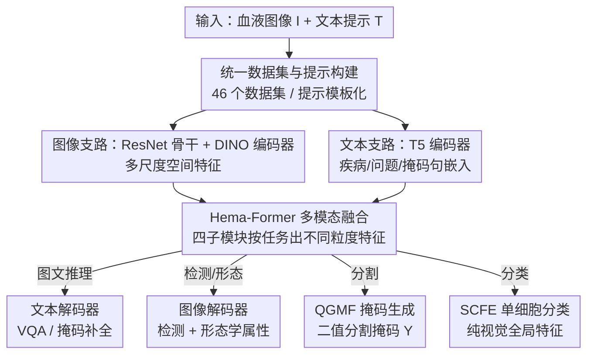

# Uni-Hema: Unified Model for Digital Hematopathology

**会议**: CVPR 2026  
**论文**: [CVF Open Access](https://openaccess.thecvf.com/content/CVPR2026/html/Rehman_Uni-Hema_Unified_Model_for_Digital_Hematopathology_CVPR_2026_paper.html)  
**代码**: https://github.com/intelligentMachines-ITU/UniHema  
**领域**: 医学图像  
**关键词**: 数字血液病理、统一多任务模型、视觉语言、单细胞分析、Hema-Former

## 一句话总结
Uni-Hema 用一个统一架构（CNN+Transformer 视觉支路 + T5 文本支路 + 名为 Hema-Former 的多模态融合模块）一次性训练，就能在血液病理上同时做检测、分类、分割、形态学预测、视觉问答和掩码语言建模六类任务，跨白血病/疟疾/贫血/镰刀型细胞病等六种疾病，效果与逐任务逐数据集训练的单任务 SOTA 相当甚至更好。

## 研究背景与动机
**领域现状**：数字血液病理（digital hematopathology，DHP）靠外周血涂片（PBF）做细胞级诊断，覆盖白血病、疟疾、贫血、镰刀型细胞病、地中海贫血等。现有方法可分四类：单任务/单病模型、视觉语言模型（VLM）、为整张切片（WSI）优化的病理基础模型、单细胞血液学基础模型。

**现有痛点**：这四类各有死角。单任务/单病模型每个诊断目的都要单独建数据集、单独训练，无法规模化；病理基础模型几乎都是为低倍率（5×、40×）实体组织 WSI 设计的，而血液诊断需要 40×、100× 的细粒度细胞级信息；单细胞血液学基础模型（如 DinoBloom、RedDino）只会做单细胞任务，处理不了视野（FoV）图像里重叠/粘连的多细胞场景，也被绑死在固定细胞类型和任务上；通用医学 VLM 擅长图文但搞不定检测、分割这类视觉中心任务。

**核心矛盾**：临床真实需求是「一个模型把检测+分类+分割+形态推理+图文问答都做了、且跨多种疾病」，但没人能做到——根本障碍是缺少覆盖所有目标任务的统一基准。公开血液病理数据集大多按单病、单任务切割（只标疟原虫检测、或只标白细胞分类），缺乏跨病泛化所需的多样性；而图文对齐又需要精确到细胞级的临床描述，这种配对数据在血液学里极难构建。

**本文目标**：造一个真正的多任务、多模态（图+文）、多疾病统一模型，用现有数据集拼出来，能跨白血病、疟疾、贫血等做细胞级的综合解读。

**切入角度**：作者的观察是——不同任务其实需要的是不同「层级/粒度」的特征（分类要全局特征、检测/分割要局部 objectness、图文推理要对齐后的多模态特征），所以与其堆多个专用模型，不如设计一个能在多个层级上提取并按任务条件化特征的融合模块，让视觉与文本两条看似平行的网络在中间交换信息。

**核心 idea**：用一个 Hema-Former「信息混合」模块，把图像编码器和文本编码器在不同层级的特征做注意力融合，生成不同粒度的特征喂给不同任务头，从而一次联合训练覆盖六类任务、六种疾病。

## 方法详解

### 整体框架
Uni-Hema（记为 $\mathcal{U}$）是一个图文一体框架，输入一张血液图像 $I$ 和一段文本提示 $T$，输出依任务而定（检测框、分类标签、分割掩码、形态学属性、问答句子或补全句子）。它由六大模块构成：图像骨干 $B$（ResNet-50 抽多尺度空间特征）、图像编码器 $E^I$（六层 DINO 风格自注意力，细化为上下文化视觉嵌入 $\mathcal{E}^I_E$）、文本编码器 $E^T$（T5 base，把疾病类型/形态问题/掩码句编码为 $\mathcal{E}^T_E$）、图像解码器 $D^I$（扩展自 DINO-DETR，产出疾病感知的目标嵌入 $\mathcal{E}^I_D$）、文本解码器 $D^T$（自回归生成答案/句子）、以及核心的 Hema-Former 融合模块 $\mathcal{H}$。

视觉支路与文本支路看似平行，真正让信息在两者间流动的是 Hema-Former：它从图文编码器拿不同层级特征，按任务生成对应粒度的融合嵌入——图文问答/掩码建模时做图文对齐，检测/分割时聚焦 token 级 objectness 注意力，像素级分割时把文本嵌入与细粒度骨干特征+图像嵌入结合。融合后的特征再分发到各任务头。

### 关键设计

**1. 统一数据集与文本提示构建：把 46 个碎片数据集拼成一个多任务语料**

统一模型最大的拦路虎不是网络结构，而是「没有一个覆盖所有任务的基准」。作者把 46 个公开血液学数据集（11 个分割≈222K、17/18 个检测≈84K、16/17 个分类≈380K，共约 70 万图）保留原标注拼到一起，并为检测/分割任务统一生成文本提示模板，形如 `"This image is for the detection of <疾病类型> of cells."`；问答任务提示以 `Q:` 开头，掩码语言建模以 `mask:` 开头，单细胞分类则只用视觉特征、不依赖文本。更关键的是图文数据：他们用 BioMistral-7B 在 WBCAtt 数据集上半合成出单细胞问答对（WBCAtt-VQA，约 22K QA），用 Gemini 1.5 在 LeukemiaAttri 的 FoV 图上结合形态学标注生成掩码句和完整描述句（LeukemiaAttri-MLM，约 7K 掩码样本），并做上下文一致性校验。这样既绕过了「细胞级图文配对极难标注」的瓶颈，又把检测/分割/分类/形态/问答/掩码六类监督信号统一进同一训练语料——之所以有效，是因为统一表征恰恰需要任务多样性来学到可迁移的细胞级特征（论文也注明该图文数据仅供实验、不建议医疗使用）。

**2. Hema-Former 四子模块：按任务在不同层级生成不同粒度的融合特征**

这是全文核心，针对「不同任务需要不同粒度特征」这一矛盾，用四个可学习子模块把图文编码器的多层级特征按需融合，而不是一刀切地只做一种对齐。

- **(a) 跨模态融合 CMF**：为图文推理（VQA/MLM）服务。先用可学习查询 $Q_1$ 对投影后的文本嵌入做交叉注意力，再与投影后的视觉特征 $P(\mathcal{E}^I_B)$ 融合并归一化，产出语义对齐的多模态嵌入 $\mathcal{E}^T_W$ 喂给文本解码器：

$$\mathcal{E}^T_W = \mathrm{Norm}\big(J + \mathrm{CrossAttn}(J,\,P(\mathcal{E}^I_B),\,P(\mathcal{E}^I_B))\big)$$

其中 $J$ 是前一步文本侧交叉注意力的中间结果。⚠️ 缓存中公式 1/2 的查询符号在 $Q_1$/$Q_2$ 间略有混排，以原文为准。

- **(b) 文本引导的视觉细化 TGVR**：为检测/分割服务。先按 objectness 从 $\mathcal{E}^I_E$ 里分离出 Top-K 查询 $k$，再用投影后的文本嵌入 $\mathcal{E}^T_E{}'$ 作 key/value、$k$ 作 query 做交叉注意力，把结果与 $k$ 拼接再投影，得到疾病引导的解码器查询：

$$\mathcal{E}^I_X = P\big([\,k \,\|\, \mathrm{CrossAttn}(k, \mathcal{E}^T_E{}', \mathcal{E}^T_E{}')\,]\big)$$

这让 Top-K 目标查询带上「这张图是哪种疾病」的语义，从而区分不同血液病图像、提升定位。

- **(c) 单细胞特征提取 SCFE**：为分类服务，且刻意独立于文本输入。把一个可学习查询与图像嵌入的均值拼接后过投影层，得到图像级全局特征 $\mathcal{E}_Z \in \mathbb{R}^{1\times M}$，专供单细胞分类这种「只看一个细胞、不需要文字」的场景。

- **(d) 查询引导掩码生成器 QGMF**：为像素级分割服务，沿用 Mask DINO 思路。把骨干特征 $F_1$ 与图像嵌入 $\mathcal{E}^I_E$ 求和融合再投影得 $G_{\text{proj}}$，把图像解码器的疾病感知目标嵌入 $\mathcal{E}^I_D$ 过 MLP+转置+投影，二者用爱因斯坦求和 $\mathcal{S}$ 交互得到分割 logits：

$$Y = \mathcal{S}(\mathcal{E}^I_D{}',\, G_{\text{proj}})$$

二值分割取第一个嵌入对应的掩码作为最终预测。四个子模块共享同一套编解码器特征、但各自取不同层级/粒度，这正是「一个模型多任务」能成立的关键。

**3. 六阶段渐进式训练：先各支路预训练，再逐任务解冻微调**

统一模型如果一上来六任务一起端到端训，不同任务梯度会互相打架。作者改用六步串行、冻结-解冻交替的课程式策略：Step 1 在单细胞分类数据上预训练图像骨干+编码器（24 epoch）；Step 2 在半合成 MLM/QA 上预训练文本编解码器学医学语境；Step 3 联合训练视觉模块（含 TGVR、SCFE、QGMF）做分类+分割+检测，每任务每 batch 取两图、冻结文本侧与 CMF；Step 4 微调图像解码器做检测+FoV 形态学；Step 5 在完整分割集上微调 QGMF；Step 6 在 VQA+V-MLM 上训练 CMF 与文本解码器、其余冻结。整套约 8 天单卡 RTX 4090。这种「分支先各自学好、再逐头解冻」的安排，让每个子模块在其最相关的数据上收敛，避免多任务早期互相干扰，也是资源受限（单卡）下能训出统一模型的务实选择。

### 损失函数 / 训练策略
检测/形态沿用 DINO-DETR 体系的检测损失，分割用二值掩码监督，分类用单细胞标签监督，文本侧 VQA/MLM 用自回归生成目标；整体不做端到端联合，而是按上述六阶段分头优化。分割上因资源受限没用 SOTA 上采样解码器，Step 3 用简单掩码放大、Step 5 用一个小型可学习上采样器，作者承认这会略损边缘锐度。

## 实验关键数据

### 主实验（Table 1，单一统一模型 vs 各自单独训练的 SOTA）
每个 baseline 都在对应数据集上单独训练，Uni-Hema 只训练一次、不重训不微调即测各任务。

| 任务 | 指标 | 代表数据集 | 最佳 baseline | Uni-Hema |
|------|------|-----------|--------------|----------|
| 检测 | mAP50 | L 100x C2(白血病) | 38.2(DINO)/36.2(AttriDet) | **45.6** |
| 检测 | mAP50 | H 1000x(疟疾) | 79.8(DINO) | **83.1** |
| 检测 | mAP50 均值 | 12 检测集 | 60.4(DINO)/59.4(YOLO) | 61.1 |
| 单细胞分类 | F1 | BMC(21类淋巴瘤) | 85.0(DinoBloom-S) | **86.2** |
| 单细胞分类 | F1 均值 | Raabin+BMC | 91.5(DinoBloom-S) | **92.5** |
| 分割 | Dice | Elsafty(贫血) | 99.5(TransNetR) | **99.9** |
| 分割 | Dice 均值 | 6 分割集 | 93.7(TransNetR) | 91.7 |
| 形态学(FoV) | F1 均值 | LeukemiaAttri 4 集 | 62.6(AttriDet) | **77.2** |
| 单细胞 VQA | BLEU-4 | WBCAtt-VQA | — | 56.4 |
| 掩码语言建模 | BLEU-4 | LeukemiaAttri-MLM | — | 79.8 |

关键观感：在检测/分类/形态学上几乎全面追平或反超逐数据集训练的专用模型，形态学 FoV 提升尤其大（均值 62.6→77.2）；分割 Dice 均值略低于 TransNetR（93.7→91.7），作者归因于用了简化上采样而非 SOTA 解码器。

### 跨域泛化（Table 2，未见数据集）
| 任务 | 指标 | 数据集 | 最佳 baseline | Uni-Hema |
|------|------|--------|--------------|----------|
| 分类 | F1 均值 | 4 个未见集 | 89.9(DinoBloom-S) | **90.8** |
| 分类 | F1 | C-NMC(白血病) | 71.0(Dinov2-S) | **72.8** |
| 检测 | mAP50 | Malaria | — | 78.5 |
| 分割 | Dice | BBBC041Seg | — | 86.2 |
| 单细胞形态 | F1-Macro | WBCAtt | 91.4(Dinov3-S) | **91.6** |

即使在训练时没见过的数据集上，统一模型仍保持优势，说明多任务联合学到的表征有跨域可迁移性。

### 消融实验
| 配置 | 数据集 | 关键指标 | 说明 |
|------|--------|---------|------|
| 仅 SCFE 特征 | Acevedo | 97.9% | 单细胞特征 |
| + 骨干特征融合 | Acevedo | 98.1% | 骨干+SCFE 联合 |
| 仅 SCFE 特征 | C-NMC | 68.8% | 单细胞特征 |
| + 骨干特征融合 | C-NMC | 72.8% | 难数据集上提升明显 |
| 简单插值上采样 | AneRBC-Anemic | 91.8% | 分割基线 |
| + 小型可学习上采样器 | AneRBC-Anemic | 93.4% | Dice 提升 |
| 简单插值上采样 | AneRBC-Healthy | 92.8% | 分割基线 |
| + 小型可学习上采样器 | AneRBC-Healthy | 94.1% | Dice 提升 |

### 关键发现
- **多任务联合训练在多数任务上是净增益**：检测、分类、形态学一次训练即超单任务 SOTA，验证「不同任务的表征互相受益」的核心假设；形态学 FoV 提升最大（+14.6 F1）。
- **样本极少的数据集是反例**：镰刀型细胞、疟原虫检测样本太少，混进大语料后反而学不到数据集特有模式（如 Sickle Cell 67.0 < DINO 73.6），说明统一训练对极小样本任务有稀释效应。
- **分割是短板**：受限于简化上采样，Dice 均值略逊 TransNetR；消融证明换上小型可学习上采样器能稳定回血（+1.3~1.6 Dice）。
- **骨干+SCFE 特征融合在难分类集上增益更大**：易集（Acevedo）仅 +0.2%，难集（C-NMC）+4.0%，说明全局+单细胞特征互补在困难样本上更有价值。

## 亮点与洞察
- **「不同任务需要不同粒度特征」落到具体子模块**：Hema-Former 的四个子模块（CMF/TGVR/SCFE/QGMF）分别对应图文推理、检测、分类、分割四种粒度，比单一融合策略更贴合多任务，是可复用的设计范式——做任何多任务统一模型都能借鉴「按任务出不同粒度特征」这一点。
- **半合成图文数据绕过标注瓶颈**：用 BioMistral/Gemini 把已有形态学标注「翻译」成 QA 和掩码句，低成本造出 22K QA + 7K MLM 的图文语料，是数据稀缺领域很实用的 trick。
- **资源受限下的务实工程**：单卡 RTX 4090 训 8 天、用六阶段冻结-解冻而非端到端，证明统一多任务模型不一定要大算力，课程式分头训练是穷人版替代方案。
- **最「啊哈」处**：一个模型一次训练，在 12 个检测集、多个分类/分割/形态/图文任务上全面对标逐数据集专用 SOTA，且在未见数据集上仍领先——把「血液病理碎片化数据」真正拼成了统一基准。

## 局限与展望
- **分割精度受简化上采样拖累**：作者承认用简单掩码放大牺牲了边缘锐度，Dice 均值低于 TransNetR；换 SOTA 上采样解码器有望补齐。
- **极小样本任务被稀释**：镰刀型细胞、疟原虫等少样本检测在统一训练下反而掉点，缺一个针对长尾任务的重加权或采样策略。
- **图文数据是半合成的**：QA/MLM 由 LLM 从形态标注生成、仅供实验、明确不建议医疗使用，临床可用性存疑；真实临床图文标注仍是缺口。
- **六阶段训练较繁琐**：冻结-解冻顺序、各阶段 epoch 都是手工编排，迁移到新任务需重新设计课程，自动化程度低。
- **未与端到端联合训练对比**：没给出「六阶段 vs 一次性联合训练」的消融，渐进式策略的必要性缺直接证据。

## 相关工作与启发
- **vs 单任务/单病模型（AttriDet、LeukemiaAttri、CelloType）**：它们做双任务或单病多任务但仍绑死单数据集；Uni-Hema 跨 46 数据集、六任务、六疾病统一训练，形态学上直接超 AttriDet（62.6→77.2 F1）。
- **vs 病理基础模型（UNI、PFM、CONCH、TransPath）**：它们为低倍率实体组织 WSI 的图文检索优化，缺细粒度细胞理解、也搞不定检测/分割；Uni-Hema 面向 40×/100× 细胞级、且原生支持视觉中心任务。
- **vs 单细胞血液学基础模型（DinoBloom、RedDino、MedSAM）**：它们只会单细胞、缺多模态推理；Uni-Hema 用 SCFE 单细胞分类追平/超过 DinoBloom（均值 91.5→92.5 F1），同时还能做 FoV 多细胞检测与图文推理。
- **vs 通用统一模型（Uni-Perceiver v2、DINO-X、Uni-3DL）**：它们在通用域做模态无关统一，但医学域统一架构仍稀缺；本文把统一范式真正落到血液病理这一细分医学场景。

## 评分
- 新颖性: ⭐⭐⭐⭐ 首个血液病理统一视觉语言模型，Hema-Former 四子模块按粒度融合是有价值的新设计，但单元件多沿用 DINO/Mask DINO/T5。
- 实验充分度: ⭐⭐⭐⭐ 46 数据集、六任务、含未见集泛化与消融，覆盖面广；但消融偏少、缺端到端对比、分割短板未深究。
- 写作质量: ⭐⭐⭐ 动机与架构讲得清楚，但公式排版（缓存中 LaTeX 有损）、子模块命名缩写（TGVR/TGR）前后不一，略增阅读成本。
- 价值: ⭐⭐⭐⭐ 把碎片化血液病理数据拼成统一基准、单卡可训、代码开源，对资源受限的医学 AI 落地很实用。

<!-- RELATED:START -->

## 相关论文

- [\[CVPR 2026\] Tell2Adapt: A Unified Framework for Source Free Unsupervised Domain Adaptation via Vision Foundation Model](tell2adapt_a_unified_framework_for_source_free_unsupervised_domain_adaptation_vi.md)
- [\[ICML 2026\] Marrying Generative Model of Healthcare Events with Digital Twin of Social Determinants of Health for Disease Reasoning](../../ICML2026/medical_imaging/marrying_generative_model_of_healthcare_events_with_digital_twin_of_social_deter.md)
- [\[CVPR 2026\] Uni-Encoder Meets Multi-Encoders: Representation Before Fusion for Brain Tumor Segmentation with Missing Modalities](uni-encoder_meets_multi-encoders_representation_before_fusion_for_brain_tumor_se.md)
- [\[CVPR 2026\] NeuroFlow: Toward Unified Visual Encoding and Decoding from Neural Activity](neuroflow_toward_unified_visual_encoding_and_decoding_from_neural_activity.md)
- [\[CVPR 2025\] VISTA3D: A Unified Segmentation Foundation Model For 3D Medical Imaging](../../CVPR2025/medical_imaging/vista3d_a_unified_segmentation_foundation_model_for_3d_medical_imaging.md)

<!-- RELATED:END -->
