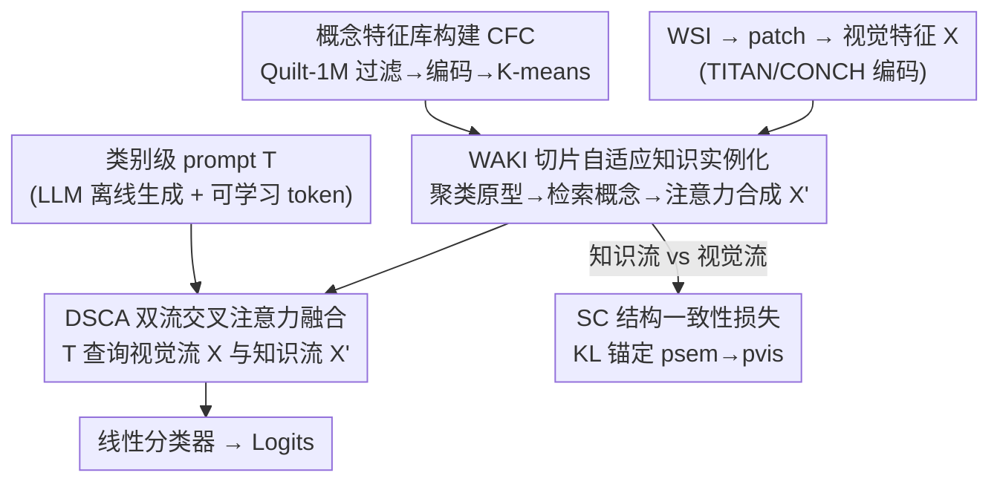

# Universal-to-Specific: Dynamic Knowledge-Guided Multiple Instance Learning for Few-Shot Whole Slide Image Classification

**会议**: CVPR 2026  
**论文**: [CVF Open Access](https://openaccess.thecvf.com/content/CVPR2026/html/Li_Universal-to-Specific_Dynamic_Knowledge-Guided_Multiple_Instance_Learning_for_Few-Shot_Whole_Slide_CVPR_2026_paper.html)  
**代码**: https://github.com/junjianli106/DyKo  
**领域**: 医学图像  
**关键词**: 全切片图像分类, 多示例学习, 少样本学习, 病理视觉-语言模型, 动态知识注入

## 一句话总结
DyKo 把病理 VLM 的"静态通用文本描述"换成"针对每张切片动态实例化的知识"——先聚类出切片专属的视觉原型、再用原型去概念库检索并合成每个 patch 的知识特征，并用结构一致性损失把合成知识锚定回视觉证据，在四个真实癌症数据集的 4/8/16-shot 设置下全面超越现有 MIL 与 prompt 方法。

## 研究背景与动机
**领域现状**：全切片图像（WSI）是吉像素级巨图、只有切片级标签，因此多示例学习（MIL）成为主流——把一张切片当成上千个 patch 组成的"包"，仅用包级标签训练。近两年的趋势是引入病理视觉-语言模型（VLM，如 CONCH、TITAN、QuiltNet）：用类别级文本描述或预定义概念池来给视觉特征注入语义先验，代表方法有 TOP、ViLa-MIL、ConcepPath、FOCUS。

**现有痛点**：这些 prompt/知识池方法提供的语言知识是**静态且全局通用**的——无论粗粒度类别描述还是精挑的细粒度概念，对某个诊断任务而言都是固定的一套，然后**一视同仁地套用到所有 WSI 上**。

**核心矛盾**：WSI 之间存在巨大的形态异质性，同一类癌的两张切片在组织学表现上可能差异很大。"一刀切"的通用描述无法贴合单张切片的具体视觉证据，给 VLM 的引导缺乏对每张切片独特模式的动态适配，这正是限制精准病理诊断的关键瓶颈。

**本文目标**：让语义引导从"静态 prompt"转向"切片自适应的知识实例化"——为每张 WSI、甚至每个 patch 量身定制概念知识。但动态合成语义有个新风险：合成出来的知识特征可能逐渐脱离其视觉来源，产生组织学上站不住脚的"伪概念"（语义漂移，semantic drift）。

**核心 idea**：用"视觉原型驱动的概念检索 + 注意力合成"把通用知识实例化到 patch 级（universal-to-specific），同时用一个结构一致性损失把合成知识拉回视觉空间、防止语义漂移。

## 方法详解

### 整体框架
DyKo 的输入是一张 WSI（切成 N 个 patch、用病理基础模型 TITAN 的视觉编码器 CONCH v1.5 提取特征矩阵 $X \in \mathbb{R}^{N \times d}$），输出是切片级的诊断类别。中间有两条离线准备 + 三个在线模块：离线先用 Quilt-1M 语料构建一个紧凑的病理**概念知识库** $C$（CFC），并用 LLM 一次性生成各类别的文本描述当先验 prompt；在线时 WAKI 把通用知识"实例化"成每个 patch 专属的知识特征 $X'$，DSCA 用类别 prompt 同时查询视觉流 $X$ 和知识流 $X'$ 做融合，最后线性分类器出 logits，并由结构一致性损失 $L_{SC}$ 约束两个空间对齐。

### 关键设计

**1. 概念特征库构建 CFC：把原始病理词条蒸馏成紧凑、有判别力的概念集**

prompt 方法要么靠人工写好的概念池，要么词条又多又冗余、塞满与诊断无关的噪声。DyKo 改成离线自动构建：以 Quilt-1M（百万级病理图文对）为语料，先用专家校验过的领域关键词过滤出候选病理概念，用 TITAN 的文本编码器把每个概念编成 $d$ 维向量，再对这些 embedding 做 K-means 聚成 $N_C$ 簇，**只取每个簇心最近的那一个概念**作为代表，得到最终概念特征集 $C \in \mathbb{R}^{N_C \times d}$。这样既覆盖了广谱病理语义、又把冗余压成一组互不重复的代表概念，给后面的检索提供干净的知识底座。消融显示 $N_C$ 的最佳取值随监督数据量变化：4-shot 时 $N_C=1000$ 最好，而 8/16-shot 下越大越好——数据越多越能消化更多外部知识。

**2. WAKI 切片自适应知识实例化：universal-to-specific 的三段式知识落地**

这是 DyKo 的核心，直接回应"静态通用描述贴不上单张切片"的痛点，分三个阶段把通用概念实例化到 patch 级。第一阶段，对当前切片的实例特征 $X$ 做即时（on-the-fly）K-means，聚成 $M$ 个簇，每个簇心当成该切片专属的**视觉原型** $u_j$：

$$u_j = \frac{1}{|S_j|} \sum_{x_i \in S_j} x_i$$

其中 $S_j$ 是分到第 $j$ 簇的实例集合，于是每个 patch $x_i$ 都唯一绑定到它所属簇的原型 $u_j$。第二阶段，用这些**切片特有的原型当 query** 去概念库 $C$ 里按余弦相似度检索 Top-K 概念，得到原型专属概念集 $C_{u_j}^K = \{c_m \mid m \in \mathcal{I}_j\}$；正因为原型是从这张切片聚出来的，即使同类的两张切片也会检索到不同的概念集。第三阶段，对每个 patch，在它所属原型的概念集上算注意力分数：

$$\alpha_{i,c} = \frac{\exp(\text{sim}(x_i, c)/\tau)}{\sum_{c' \in C_{u_j}^K} \exp(\text{sim}(x_i, c')/\tau)}$$

再以注意力加权聚合出该 patch 的**知识实例化特征** $x'_i = \sum_{c \in C_{u_j}^K} \alpha_{i,c} \cdot c$，堆叠成 $X' \in \mathbb{R}^{N \times d}$。$\tau$ 是温度（设 0.1）。和"全数据集共享一套固定概念"的旧范式相比，WAKI 让知识"先按切片选、再按 patch 权"，真正把通用知识收敛到具体视觉证据上——这也是论文标题"universal-to-specific"的字面含义。

**3. DSCA 双流交叉注意力融合：用类别 prompt 同时拷问视觉流与知识流**

合成出 $X'$ 后还要和原始视觉 $X$ 整合并对接诊断任务。DSCA 用类别级 prompt 表示 $T$（由 LLM 离线生成的静态描述 $T_{static}$ 拼上一组可学习向量 $T_{learn}$，再过 TITAN 文本编码器，堆成 $T \in \mathbb{R}^{n_{cls} \times d}$）当 query，并行查询两条流：视觉流 $F_{vis} = \text{CrossAttn}(T, X, X)$ 让模型聚焦与高层病理描述相关的形态区域；知识流 $F_{con} = \text{CrossAttn}(T, X', X')$ 抽取与类别描述对齐的切片专属概念；两路逐元素相加得切片级表示 $F_{fused} = F_{vis} + F_{con}$，送线性分类器出预测、用交叉熵 $L_{CE}$ 端到端训练。消融里把它换成"两路独立聚合后简单平均分数"会明显掉点（4-shot AUC 0.871→0.756），说明 prompt 引导的交叉注意力融合比朴素融合更能把视觉与语义信息拧到一起。

**4. SC 结构一致性损失：把动态合成的语义锚回视觉证据，防止语义漂移**

WAKI 动态合成知识有两个隐患：合成特征缺乏与原始视觉特征的显式约束、会逐渐漂离形态学基础长出伪概念；概念生成也未必保证任务相关。DyKo 的假设是——按病理概念聚出的 patch 分组，应当与其视觉模式分布保持拓扑一致。实现上用两个并行的聚类头（结构为"FC-ReLU-FC-Softmax"）分别从视觉特征和知识增强特征生成概率分布 $p_{vis}$ 与 $p_{sem}$，把视觉分布当目标、强制语义分布去匹配它，最小化 KL 散度：

$$L_{SC} = D_{KL}(p_{sem} \,\|\, p_{vis})$$

整体目标 $L = L_{CE} + \lambda L_{SC}$（$\lambda=1.0$）。这一项一边正则化视觉空间以保留概念相关性，一边把知识语义牢牢钉在视觉证据上。t-SNE 可视化显示：去掉 SC 时知识实例化特征（标 'x'）与对应视觉特征（标 'o'）完全分离、不可分；加上 SC 后两个空间被拉成内聚、可分、类别清晰的簇——直观印证了它对抑制漂移的作用，也是消融里掉点最狠的模块（4-shot AUC 0.871→0.750）。

### 损失函数 / 训练策略
端到端联合优化 $L = L_{CE} + \lambda L_{SC}$，$\lambda=1.0$。关键超参：每张切片 10 个视觉原型（对应聚类头 10 个输出类）、每个原型选 10 个概念做语义增强、16 个可学习 prompt token、温度 $\tau=0.1$。WSI 在 20× 倍率下切 448×448 patch，用 TITAN 提特征；K-means 用 Faiss 在 GPU 上加速。所有 prompt-based baseline 都用同一套 TITAN 文本编码器和同样的类别级描述，保证公平。

## 实验关键数据

### 主实验
四个真实癌症数据集（CAMELYON16 2 类、NSCLC 2 类、UBC-OCEAN 5 类、TCGA-RCC 3 类），4 折交叉验证，4/8/16-shot 设置，对比 9 个 SOTA（5 个经典 MIL + MiCo + 4 个 prompt 方法）。下表摘 CAMELYON16 与 UBC 上 DyKo 对最强 baseline FOCUS 的 AUC/F1（节选）：

| 数据集 / 设置 | 指标 | FOCUS (前最强) | DyKo | 提升 |
|--------------|------|------|------|------|
| CAMELYON16 / 4-shot | AUC | 0.831 | **0.871** | +4.0% |
| CAMELYON16 / 8-shot | AUC | 0.918 | **0.956** | +3.8% |
| CAMELYON16 / 16-shot | AUC | 0.934 | **0.961** | +2.7% |
| NSCLC / 4-shot | AUC | 0.908 | **0.932** | +2.4% |
| UBC (5 类) / 16-shot | F1 | 0.732 | **0.806** | +3.1%(对最强) |
| RCC (3 类) / 16-shot | AUC | 0.959 | **0.979** | +2.0% |

DyKo 在全部数据集 × 全部 shot 设置下都刷新 SOTA，且**数据越稀缺优势越明显**（4-shot CAMELYON16 领先 FOCUS 达 4.0%，到 16-shot 收窄到 2.7%），印证了切片自适应知识实例化在 data-scarce 场景的价值。

### 消融实验（CAMELYON16，4-shot AUC）
| 配置 | AUC | 相对 Full | 说明 |
|------|-----|-----------|------|
| DyKo (Full) | 0.871 | — | 完整模型 |
| w/o SC | 0.750 | −0.121 | 去结构一致性损失，掉点最多 |
| w/o DSCA | 0.756 | −0.115 | 双流注意力换成独立平均 |
| w/o WAKI | 0.773 | −0.098 | 只剩视觉流、退回静态 |

### 关键发现
- **SC 损失贡献最大**：去掉后 4-shot AUC 从 0.871 暴跌到 0.750（−12.1 个百分点）。t-SNE 显示没有它知识特征会与视觉特征彻底脱钩，说明防漂移是动态知识方案能否成立的命门。
- **WAKI 是性能主驱动**：去掉后退化成纯视觉流，4-shot AUC 跌到 0.773，验证"动态实例化切片专属知识"确实有效，而非堆参数。
- **超参 sweet spot**：原型数 $M=10$、每原型概念数 $K=10$ 普遍最优（$K$ 太大引入噪声）；概念库规模 $N_C$ 在数据多时越大越好。
- **可解释性**：注意力热图能准确定位肿瘤区域，WAKI 聚出的高注意力肿瘤簇被检索到的概念（malignant、adenocarcinoma、metastasis to the lymph node 等）经病理医生复核确认与该簇形态吻合，把内部视觉表征链接到了临床术语。
- **泛化性**：换用 Pathology Outlines 知识源仍有很强结果；编码器换 QuiltNet/CONCH 都不如 TITAN，但框架对各组件可替换。

## 亮点与洞察
- **"universal-to-specific"的落地范式很干净**：通用知识库 + 切片原型检索 + patch 注意力合成，三段式把"全局通用 prompt"逐级收敛到"patch 专属知识"，比起改 prompt 措辞或堆更大概念池，是结构层面的范式升级。
- **结构一致性损失是点睛之笔**：动态合成语义最怕"自由发挥"出伪概念，用 KL 把语义分布钉到视觉分布上，等于给生成式知识加了一道"必须有视觉证据支撑"的物理约束，这个 anchoring 思路可迁移到任何"用外部知识增强视觉特征"的任务。
- **可解释性闭环**：检索到的概念能被病理医生逐簇复核确认，把黑盒注意力变成"视觉簇 ↔ 临床术语"的可审查映射，对医疗落地很有说服力。
- **公平对比做得扎实**：所有 prompt baseline 共用 TITAN 文本编码器和同一套类别描述，把增益归因到方法而非更强的编码器。

## 局限与展望
- **在线 K-means 的开销与稳定性**：每张切片推理时都要现场聚类，patch 数巨大时即使有 Faiss 加速也带来额外计算；且聚类对原型数 $M$ 与初始化敏感，原型数固定为 10 是否适配所有癌种值得怀疑。
- **依赖强基础模型与大语料**：性能高度依赖 TITAN 编码器与 Quilt-1M 知识库，换弱编码器明显掉点；在缺乏对应病理基础模型/语料的器官或罕见病上能否复现是开放问题。
- **类别 prompt 仍是离线静态生成**：WAKI 让概念动态化了，但类别级描述还是 LLM 一次性生成的固定先验，且对 LLM 选择敏感（4-shot 下 Claude/GPT-4.1 明显更好），这条链路仍残留"静态"成分。
- **评测仅在 4 个数据集、2–5 类**：缺少更细粒度亚型分级或多中心域偏移下的验证；部分结果方差较大（如 RCC 4-shot ACC 0.858±0.17），统计稳健性可再加强。

## 相关工作与启发
- **vs ConcepPath / TQx（静态知识池）**: 它们从医学文献/语料构建数据集级固定概念池，对所有切片统一检索/聚合；DyKo 用切片自身聚出的视觉原型做条件检索，概念集随切片动态变化，直击形态异质性。
- **vs ViLa-MIL / TOP / FOCUS（prompt-based）**: 这些方法靠多尺度/类别级语言 prompt 引导，但 prompt 全局通用；DyKo 把引导粒度下沉到 patch 级并加结构约束，4-shot 下对最强的 FOCUS 领先 4.0% AUC。
- **vs CoD-MIL（Chain-of-Diagnosis）**: 后者用类 CoT 把诊断按倍率分解成渐进子过程，仍是预设流程的静态文本；DyKo 不预设诊断链，而是数据驱动地实例化知识。
- **vs 经典 MIL（ABMIL/TransMIL/MiCo/WiKG）**: 纯视觉聚合缺语义理解；DyKo 在 MIL 框架内注入并锚定病理语义，在少样本下优势尤为显著。

## 评分
- 新颖性: ⭐⭐⭐⭐ "universal-to-specific 的动态知识实例化 + 结构一致性锚定"是对静态 prompt 范式的实质性升级，思路清晰且针对真问题。
- 实验充分度: ⭐⭐⭐⭐ 四数据集 × 三 shot × 九 baseline，外加原型数/概念数/知识源/编码器/LLM 等多维消融与可解释性分析，较全面；个别结果方差偏大。
- 写作质量: ⭐⭐⭐⭐ 动机与方法递进清楚，公式与图示完整；离线/在线模块切分明确，少量表述略冗。
- 价值: ⭐⭐⭐⭐ 少样本病理诊断是高临床价值的 data-scarce 场景，方法可解释、组件可替换、代码开源，落地与迁移潜力较大。

<!-- RELATED:START -->

## 相关论文

- [\[CVPR 2026\] Contrastive Cross-Bag Augmentation for Multiple Instance Learning-based Whole Slide Image Classification](contrastive_cross-bag_augmentation_for_multiple_instance_learning-based_whole_sl.md)
- [\[CVPR 2026\] MUSE: Harnessing Precise and Diverse Semantics for Few-Shot Whole Slide Image Classification](muse_harnessing_precise_and_diverse_semantics_for_few-shot_whole_slide_image_cla.md)
- [\[ECCV 2024\] Pathology-knowledge Enhanced Multi-instance Prompt Learning for Few-shot Whole Slide Image Classification](../../ECCV2024/medical_imaging/pathology-knowledge_enhanced_multi-instance_prompt_learning_for_few-shot_whole_s.md)
- [\[CVPR 2026\] Dual-Level Hypergraph Generation for Addressing Feature Scarcity in Whole-Slide Image Classification](dual-level_hypergraph_generation_for_addressing_feature_scarcity_in_whole-slide_.md)
- [\[CVPR 2026\] TopoSlide: Topologically-Informed Histopathology Whole Slide Image Representation Learning](toposlide_topologically-informed_histopathology_whole_slide_image_representation.md)

<!-- RELATED:END -->
