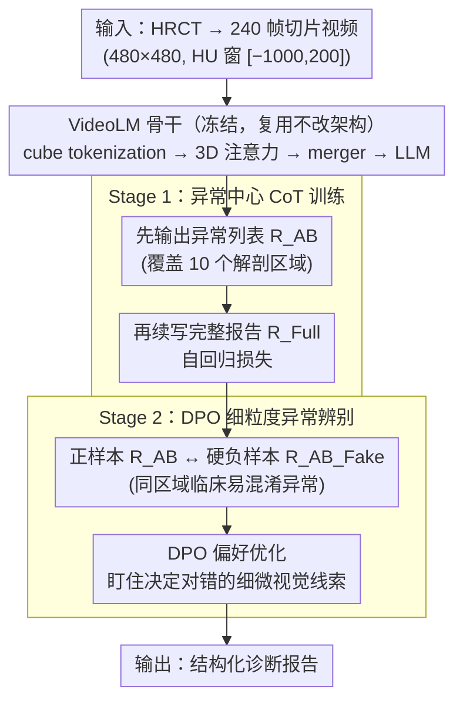

# Unleashing Video Language Models for Fine-grained HRCT Report Generation

**会议**: CVPR 2026  
**arXiv**: [2603.12469](https://arxiv.org/abs/2603.12469)  
**代码**: [GitHub](https://anonymous.4open.science/r/hrct-report-generation-video-vlm-728C/)  
**领域**: 医学图像  
**关键词**: CT报告生成, 视频语言模型, Chain-of-Thought, DPO, 异常检测

## 一句话总结

提出 AbSteering 两阶段框架，利用异常中心的 CoT 推理和 DPO 硬负样本对比学习，将通用 VideoLM 高效适配到 HRCT 报告生成，在临床效能指标上大幅超越专用 CT 基础模型。

## 研究背景与动机

**临床需求**：高分辨率计算机断层扫描（HRCT）是胸部和心肺疾病诊断与纵向监测的关键模态，AI 驱动的报告生成能够减轻临床工作量、标准化诊断叙述并缓解观察者间差异。然而相比 2D 胸片，3D HRCT 报告生成面临更大挑战：每个研究包含数百层切片，计算和内存开销巨大；同时临床关键异常通常细微、空间局部化且多样，稀疏分布在体积中，常被占主导的正常解剖结构所掩盖。

**现有方法的不足**：早期方法将 CT 体积压缩为低维表示后复用 X-ray 报告生成器，信息损失严重。后续工作如 Dia-LLaMA 设计了 CT 专用视觉编码器并接入 LLM 解码器。近期的模态特定基础模型（RadFM、CT-CHAT、M3D）虽然进一步提升了性能，但仍依赖从头训练或大量微调模态特定编码器，数据和计算成本高昂，且在长尾异常的细粒度识别上仍有瓶颈。

**核心洞察**：HRCT 体积可以自然视为"视频式切片序列"，而 VideoLM 的架构（时空 tokenization + 3D 注意力 + token 合并 + LLM 解码）与 CT 基础模型本质相似，二者的差异不在于架构本身而在于训练域和监督信号。这引出三个关键问题：(1) VideoLM 的编码器能否捕获临床相关的 3D 特征？(2) 如何高效地将通用 VideoLM 适配到领域特定的医学报告生成？(3) 这种迁移与模态特定 CT 基础模型相比表现如何？

## 方法详解

### 整体框架

AbSteering 的出发点很反直觉：不再为 CT 从头训一个模态专用基础模型，而是把一个**通用视频语言模型直接拿来当骨干**——因为 HRCT 本质就是一叠按层排列的切片序列，和视频的"时空 token + 3D 注意力 + token 合并 + LLM 解码"几乎同构，差的只是训练域和监督信号。于是整个方法把功夫全花在语言侧的"引导"上：**视觉编码器原封不动冻住**，只用两个训练阶段把通用模型"扳"到 HRCT 报告这个域里。Stage 1 用异常中心的 Chain-of-Thought 训练，逼模型先把异常找全再写报告；Stage 2 用 DPO 拿临床易混淆的硬负样本做对比，逼模型把细微的异常分清楚。一个补 recall，一个补 precision，输入是 240 帧的 CT 切片视频，输出是结构化的诊断报告。

### 关键设计

**1. VideoLM 骨干：直接复用视频预训练的时空推理能力，不改架构**

这是整套方法成立的前提。输入视频 $X \in \mathbb{R}^{T \times H \times W \times C}$ 先经时空 cube tokenization 切成视觉 token，过一层带分解式 3D 位置嵌入的 Transformer，再由 merger 把 token 压缩成与语言对齐的表示送进 LLM 解码。之所以敢直接拿通用 VideoLM 来用，是因为它和 CT 基础模型的架构几乎一一对应，差异只在训练域；既然时空推理能力已经在大规模视频上预训练好了，就没必要为 CT 重新训一遍编码器。本文在 Qwen2.5-VL-7B 和 InternVL3-8B 两个骨干上验证了这一点。

**2. 异常中心的 Chain-of-Thought 训练（Stage 1）：把"看图写报告"拆成"先找异常、再写报告"**

HRCT 最难的地方在于关键异常往往细小、局部、稀疏地散在体积里，很容易被占主导的正常解剖结构淹没——直接做端到端的 vision-to-text，模型会顺着"大多数都正常"的先验写出一堆正常描述甚至幻觉。CoT 的做法是先把这条推理链显式拆出来：先把原始 CT-RATE 报告标准化成统一的 `(region: abnormality)` 模板，覆盖 10 个解剖区域（Lung、Trachea and Bronchi、Mediastinum、Heart、Esophagus、Pleura、Bone、Thyroid、Breast、Abdomen），用 GPT-4o 把报告句子归到对应区域、再人工校验，得到 CT-RATE-AB 数据集。训练时目标序列拼成 $Y = [R_{AB}; R_{Full}]$——先吐出异常检测列表 $R_{AB}$，再续写完整报告 $R_{Full}$，用标准自回归损失优化：

$$\mathcal{L}_{gen} = -\sum_{t=1}^{T} \log P(y_t \mid x, y_{<t})$$

之所以有效，是因为"先列异常"这一步把诊断推理摆到了生成报告之前：模型被强制先穷举各解剖区域的疾病类别，再在叙述里展开，自然就抑制了被正常组织主导的废话和幻觉；而且从离散发现过渡到连贯叙述时，模型还能顺带学到解剖约束和病理间的依赖（哪些疾病常共现、哪些发现互斥）。

**3. 基于 DPO 的细粒度异常辨别（Stage 2）：用"临床上最像的错答案"逼模型抠细节**

CoT 把异常找全了，但找全不等于分对——CT 异常常常在视觉上彼此非常接近，区分它们高度依赖领域特定的临床知识，普通的监督训练给不了这种"差之毫厘"的信号。Stage 2 用 DPO 来补这一刀：拿真实异常报告 $R_{AB}$ 作正样本，再用 GPT-4o 自动构造硬负样本 $R_{AB\_Fake}$——把目标异常替换成**同一解剖区域内临床易混淆**的另一种异常，区域标签、句子模板、位置信息全部保持不变，只动那个最关键的诊断词。然后以 Stage 1 的模型为参考模型 $\pi_{ref}$、固定不动，优化目标模型 $\pi_\theta$：

$$\mathcal{L}_{DPO} = \log \sigma\!\left(\beta \log \frac{\pi_\theta(y_w \mid x,v)}{\pi_{ref}(y_w \mid x,v)} - \beta \log \frac{\pi_\theta(y_l \mid x,v)}{\pi_{ref}(y_l \mid x,v)}\right)$$

其中 $y_w = R_{AB}$ 是正确报告，$y_l = R_{AB\_Fake}$ 是篡改报告，$\beta$ 控制偏离参考模型的幅度。关键在硬负样本的"硬"：因为正负样本只差一个临床上极易混淆的诊断词，模型要把它们区分开就不得不去盯住那个决定对错的细微视觉线索，而不是靠语言先验蒙混过关——这正是细粒度异常辨别最缺的监督信号。

### 损失函数 / 训练策略

- **Stage 1**：标准自回归交叉熵损失，目标序列为异常列表与完整报告的级联 $[R_{AB}; R_{Full}]$
- **Stage 2**：DPO 损失，超参数 $\beta$ 控制偏离参考模型的幅度
- **数据预处理**：每个 HRCT 转换为 240 帧 480×480 像素切片，HU 窗口 [-1000, 200]，保存为 MP4 格式，帧率 18fps
- **训练设置**：2 块 80GB A100 GPU，总 batch size 4；视觉编码器冻结，不做 LoRA 微调
- **数据集**：CT-RATE 训练集 46,717 个 CT 扫描（20,000 患者），验证集 3,039 个扫描（1,314 患者）

## 实验关键数据

### 主实验

CT-RATE 基准上的全面对比，评估自然语言生成（NLG）和临床效能（CE）指标：

| 方法 | BL-1 | BL-4 | RG-L | BERT | CE Micro P | CE Micro R | CE Micro F1 | CE Macro F1 | CE Wtd F1 | CE Samp F1 |
|------|------|------|------|------|-----------|-----------|------------|------------|----------|----------|
| CT2Rep | 47.91 | 28.04 | 45.43 | 88.10 | 26.39 | 10.50 | 14.10 | 10.65 | 11.35 | 10.86 |
| RadFM | 50.20 | 17.02 | 30.46 | 86.17 | 36.10 | 13.48 | 19.63 | 13.05 | 17.74 | 12.14 |
| Reg2RG | 44.89 | 21.08 | 24.41 | 86.18 | 28.47 | 11.06 | 15.93 | 10.48 | 14.51 | 12.19 |
| CT-CHAT | 42.81 | 17.63 | 32.50 | 86.35 | 25.13 | 37.48 | 30.08 | 21.66 | 28.35 | 25.31 |
| M3D-8B | 44.95 | 22.98 | 37.76 | 87.52 | 47.60 | 28.54 | 35.69 | 26.74 | 33.13 | 25.21 |
| Qwen2.5-VL-7B | 43.67 | 21.25 | 36.71 | 87.30 | 48.06 | 25.88 | 33.64 | 25.57 | 32.19 | 24.95 |
| InternVL3-8B | 45.57 | 22.05 | 38.49 | 87.40 | 53.57 | 37.99 | 44.45 | 38.91 | 43.28 | 32.14 |
| M3D-AbSteer | 45.22 | 23.09 | 38.58 | 87.83 | 44.95 | 41.66 | 43.24 | 36.18 | 41.89 | 36.54 |
| Qwen2.5-VL-AbSteer | 45.64 | 21.40 | 37.99 | 87.13 | 49.15 | 43.22 | 45.99 | 37.90 | 44.05 | 37.39 |
| **InternVL3-AbSteer** | **48.32** | **23.58** | **40.49** | 87.59 | **57.88** | **51.58** | **54.55** | **47.66** | **52.80** | **44.80** |

### 消融实验

**AbSteering 策略消融**（基于 InternVL3-8B）：

| 配置 | CE Micro P | CE Micro R | CE Micro F1 |
|------|-----------|-----------|------------|
| Baseline（无 steering） | 53.57 | 37.99 | 44.45 |
| + CoT（Stage 1） | — | ↑↑ | ↑ |
| + CoT + DPO（完整 AbSteering） | 57.88 | 51.58 | 54.55 |

CoT 显著提升 recall，DPO 进一步提升 precision 并抑制幻觉，二者协同实现 F1 从 44.45 → 54.55（+22.7%）。

**视觉编码器消融**（基于 Qwen2.5-VL + Stage 1 CoT）：

| 编码器策略 | 效果 |
|-----------|------|
| 从头训练（无预训练） | 性能急剧下降 |
| 冻结预训练编码器 | 最优 |
| LoRA 微调（rank=8） | 无额外增益 |

**LLM 规模消融**：

| LLM 规模 | 趋势 |
|----------|------|
| 3B | 基线 |
| 7B | 性能提升 |
| 32B | 性能反而下降 |

### 关键发现

- **通用 VideoLM 具备强迁移性**：未经 steering 的 InternVL3-8B 在 CE Micro F1 上达到 44.45，已超越最强专用基础模型 M3D-8B 的 35.69
- **AbSteering 大幅提升**：InternVL3 经 AbSteering 后 CE Micro F1 从 44.45 → 54.55（+22.7%），CE Macro F1 从 38.91 → 47.66（+22.5%）
- **跨模型通用性**：AbSteering 对 M3D（专用模型）和两种 VideoLM 均有效，但 VideoLM 的增益幅度更大
- **视频预训练至关重要**：从头训练导致性能急剧下降，冻结编码器即已足够，LoRA 微调无额外增益——说明通用视频预训练的时空特征已足够鲁棒
- **LLM 并非越大越好**：7B → 32B 性能反降，当前瓶颈在视觉-文本对齐而非 LLM 容量
- **VideoLM 在不增加幻觉的前提下实现了最高召回率**

## 亮点与洞察

1. **跨模态迁移范式的成功验证**：系统证明了通用视频预训练的时空推理能力可高效迁移到 3D 医学影像，为 CT 报告生成提供了一条数据高效、计算友好的新路径，避免了从头训练模态特定基础模型的高昂成本
2. **两阶段设计精准对症**：CoT 解决的是"找不全异常"的 recall 问题（通过强制先推理再生成），DPO 解决的是"分不清异常"的 precision 问题（通过临床混淆硬负样本对比），二者协同效应显著
3. **冻结编码器的启示**：LoRA 微调不带来额外增益这一发现令人惊讶，暗示 VideoLM 的视觉特征已具备足够的泛化性，域适配的关键在语言引导层面而非视觉表示层面
4. **结构化 CoT 数据集贡献**：CT-RATE-AB 将原始报告重组为 region-abnormality 格式并经人工校验，有助于社区后续研究

## 局限与展望

- **单一数据集验证**：仅在 CT-RATE（胸部 CT）上评估，未验证对腹部、头颅等其他部位 CT 的泛化能力
- **依赖 GPT-4o**：报告结构化和硬负样本构造均依赖 GPT-4o，引入额外成本和潜在偏差，且可能限制方法的可复现性
- **CT 转 MP4 的信息损失**：将 HU 值映射到视频格式不可避免地损失了 CT 特有的密度信息精度
- **大规模 LLM 的瓶颈**：32B 模型性能下降暗示当前视觉-文本对齐策略在更大规模上可能需要额外设计
- **临床部署距离**：评估仍基于自动指标（RadBERT 分类器），缺乏放射科医师的人工评估

## 相关工作与启发

- **CT 报告生成**：CT2Rep 首先提出从 3D CT 直接生成报告的基准；M3D 和 CT-CHAT 分别探索了专用 3D 医学基础模型路线；Reg2RG 引入区域引导的 referring and grounding 机制。本文的贡献在于证明通用 VideoLM 经适当引导即可超越这些专用模型
- **VideoLM 的医学应用**：本文是首批系统研究 VideoLM 向 3D 医学影像迁移的工作之一，启发了将视频理解领域的大量预训练知识复用于医学的新思路
- **DPO 在医学中的应用**：将 DPO 的硬负样本构造策略引入医学报告生成是新颖的尝试，临床混淆异常作为负样本比随机负样本更有效

## 评分

| 维度 | 评分 |
|------|------|
| 新颖性 | ⭐⭐⭐⭐ |
| 实验 | ⭐⭐⭐⭐ |
| 写作 | ⭐⭐⭐⭐ |
| 价值 | ⭐⭐⭐⭐ |

<!-- RELATED:START -->

## 相关论文

- [\[CVPR 2026\] Prototype-Based Knowledge Guidance for Fine-Grained Structured Radiology Reporting](prototypebased_knowledge_guidance_for_finegrained.md)
- [\[CVPR 2026\] CURE: Curriculum-guided Multi-task Training for Reliable Anatomy Grounded Report Generation](cure_curriculum-guided_multi-task_training_for_reliable_anatomy_grounded_report_.md)
- [\[CVPR 2026\] OraPO: Oracle-educated Reinforcement Learning for Data-efficient and Factual Radiology Report Generation](orapo_oracle-educated_reinforcement_learning_for_data-efficient_and_factual_radi.md)
- [\[CVPR 2026\] Accelerating Stroke MRI with Diffusion Probabilistic Models through Large-Scale Pre-training and Target-Specific Fine-Tuning](accelerating_stroke_mri_with_diffusion_probabilist.md)
- [\[CVPR 2026\] MedGRPO: Multi-Task Reinforcement Learning for Heterogeneous Medical Video Understanding](medgrpo_multi-task_reinforcement_learning_for_heterogeneous_medical_video_unders.md)

<!-- RELATED:END -->
