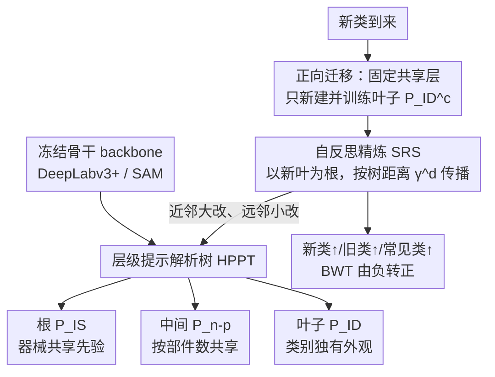

# Unlocking Positive Transfer in Incrementally Learning Surgical Instruments: A Self-reflection Hierarchical Prompt Framework

**会议**: CVPR 2026  
**arXiv**: [2604.02877](https://arxiv.org/abs/2604.02877)  
**代码**: 未见公开代码  
**领域**: 医学图像 / 手术视频解析  
**关键词**: 类增量分割、手术器械、层级提示、正向迁移、反向迁移

## 一句话总结

这篇论文把每个器械类的提示参数从“彼此隔离的独立 prompt”改造成“共享知识逐层拆解的树结构”，让新器械可以继承旧知识快速学会，同时让新知识反过来温和修正旧知识，从而在手术器械类增量分割中同时提升新类、常见类和旧类表现。

## 研究背景与动机

手术视频分割和通用语义分割场景不一样，器械类别是持续扩张的，而且数据到达方式通常也是分批的。很多手术器械只在少数手术中出现，另一些器械则几乎每个手术都会出现，因此真实系统更像“持续收集新器械数据，不断给模型补能力”，而不是一次性把所有类别数据收齐再静态训练。

现有类增量分割方法的主线目标基本都在“防遗忘”。这当然重要，但它们隐含了一个过于保守的假设：旧类知识只需要被保存，不应该再被触碰。问题在于，器械是强结构化对象，不同器械之间往往共享杆身形态、夹持端部件数、外观轮廓等中间语义。如果每个类的 prompt 都独立训练、独立冻结，那么模型就无法显式复用“器械共有知识”和“同部件数器械的共享知识”。

作者把问题拆成两个方向。第一，**正向知识迁移**：旧器械的知识能否帮助新器械更快收敛。第二，**反向知识迁移**：新器械学到的特征能否反过来整理旧知识表示，而不是只把旧知识原封不动地封存。很多 continual learning 工作只控制遗忘，却没有系统利用这两种正迁移。

本文的观察很直接也很有说服力。对新器械来说，真正需要从零学习的通常只是“区分该器械的那一点特异性”，而不是整套从边缘到部件再到轮廓的视觉知识。对旧器械来说，新器械的引入会改变“什么才算特异性”的定义，例如原来某个手柄形状很独特，后来发现多个器械都有同类手柄，那么旧知识就应被重新归类到共享层，而不是继续保留为过度专属的记忆。

因此这篇论文的核心目标不是单纯减小 forgetting，而是把类增量分割做成一个“随着类别扩展持续重组知识结构”的过程。作者据此提出层级提示解析树和自反思更新策略，让知识既能继承，也能回流。

## 方法详解

### 整体框架

整体框架建立在冻结的大模型骨干上，论文重点展示了两种后端：一种是传统的 DeepLabv3+，另一种是更强的 SAM。作者并不重训整套骨干（backbone），而是在预训练模型顶部逐步追加器械感知提示（instrument-aware prompt）和按类分配的分割头（segmentation head）。

在每个增量 episode 中，当前数据会包含三类器械：

- **regular classes**：历史和当前 episode 都出现的常见器械。
- **old classes**：历史里学过、当前 episode 不再出现的旧器械。
- **new classes**：本轮首次出现、此前完全未知的器械。

作者的整体策略可以用一句话概括：增量学习不再是“给新类加一个独立参数块”，而是“往一棵知识树上挂新叶子，并允许整棵树局部重排”。具体来说，骨干编码器主体始终冻结，只在初始阶段训练适配器（adapter）与解码器；每个器械类对应的不是一个扁平提示，而是一组分层提示；当新类到来时，模型不重学完整提示，只补上该新类最特异的那一层；等新类学完，再触发一轮“自反思”去修整已有节点。下面三个关键设计，正是这棵树的“结构定义—生长规则—回流规则”。

### 关键设计

**1. 层级提示解析树 HPPT：把“一类一个独立 prompt”改成共享知识逐层拆解的树**

器械之间天然共享杆身形态、部件数、外观轮廓这些中间语义，但扁平 prompt 把它们各自封死，模型没法复用。HPPT 的做法是把每个类的 prompt 拆成三层：根节点是器械共享分区 $P_{IS}$，承载“它是一个手术器械”这种所有器械共通的视觉先验；中间节点 $P_{n\text{-}p}$ 按部件数组织，让同样由 $n$ 个部件构成的器械共享一组中层语义；叶子节点 $P_{ID}^c$ 才刻画该类独有的外观。这样一棵树长好之后，一个由 $k$ 个部件组成的新类不必从根重学，只需把自己的叶子挂到对应 $k$ 部件的中间节点下，root 与中间节点直接继承。它的价值在于把“可复用知识”和“必须重学知识”在参数结构上显式切开——相比每个 prompt 独立训练，既降低了学习难度，也把细粒度器械之间的层级相似性当成归纳偏置用了起来。

**2. 正向迁移驱动的新类学习：让新类只学差异，不重复学共性**

有了这棵树，新类的学习负担就能压到最小。在初始阶段 $t=1$，模型为所有初始类共同学好 $P_{IS}$、按部件数学好各组 $P_{n\text{-}p}$、按类别学好各自的 $P_{ID}$；当 $t\ge 2$ 出现新类 $c$ 时，作者固定住已训练好的共享部分，只新建并优化它的叶子 $P_{ID}^c$ 和对应分割头。三层 prompt 在交叉注意力里分别插入不同深度的 decoder，使语义从浅到深逐级细化：浅层对齐“是器械”，中层对齐“几段结构”，深层才落到这一类的独特细节。既然共享层已经把前两件事说清楚了，新类要补的只剩末端部位、边缘形态、手柄细节这类差异信息，正向迁移因此能显著降低学新类所需的样本量。

**3. 自反思精炼 SRS：让新知识反哺旧节点，而不是只把旧知识封存**

新类的引入会改变“什么才算特异性”——原本某个手柄形状很独特，等多个器械都带同类手柄时，这份旧知识就该被归并到共享层。SRS 负责这步反向迁移：每加入一个新类，它就把当前树转成一个以新叶子为根的有向加权图，边从新节点向外扩散，边权随树距离指数衰减 $\gamma^d$，意味着离新知识越近的节点越该被更新、越远的旧知识越该保持稳定；随后用 directed graph network 做传播，并加一个 teleport 项保证转移矩阵可解。这一步是全文反向迁移的关键来源：作者没有粗暴微调所有历史 prompt，而是让更新幅度严格依赖树距离，近邻大改、远邻小改，于是既能把“已不再独特的旧特征归并、需纠偏的共享表示纠偏”，又能把 forgetting 压住。

### 一个完整示例：一把新器械如何挂上树、又如何反哺旧树

假设初始 episode 已经学好一棵树：root $P_{IS}$ 之下挂着“2 部件”中间节点 $P_{2\text{-}p}$ 和“3 部件”中间节点 $P_{3\text{-}p}$，各自又挂着若干旧器械叶子（比如双极钳挂在 $P_{2\text{-}p}$ 下）。现在新 episode 来了一把由 3 个部件组成的新器械 $c$。

第一步走正向迁移：模型不动 root 和 $P_{3\text{-}p}$，直接让它们告诉新叶子“你是器械、你由 3 段结构组成”，于是只需新建并训练叶子 $P_{ID}^c$ 和它的分割头，去学这把器械区别于其它 3 部件器械的那点末端形态——学习量被压缩到“一层叶子”。

第二步触发 SRS 反向迁移：以新叶子 $c$ 为根建有向图，与 $c$ 同挂在 $P_{3\text{-}p}$ 下的旧叶子距离最近（$d$ 小，$\gamma^d$ 大），更新最多；隔了一个中间节点的 2 部件器械距离较远，$\gamma^d$ 衰减后只被轻微触碰；root 距离最远，几乎不动。传播跑完后，如果发现某个旧叶子的“特异性”其实和新器械重合，这份知识就被上移、归并到共享层。最终的效果就是表格里看到的那种趋势——新类学会了，旧类和常见类的 IoU 反而一起涨，BWT 从负翻正。

### 损失函数 / 训练策略

训练目标本质上仍是按类的分割交叉熵，但参数开放范围会随阶段变化。

- 初始 episode：训练 adapter、decoder、各类分割头，以及三层 prompt 分区。
- 后续 episode：对 old class 的 segmentation head 保持冻结；对新类只训练其 `P_ID^c` 和对应 head。
- 自反思阶段：固定主体网络，通过有向图传播模块更新树节点表示。

作者同时在 DeepLabv3+ 和 SAM 两种 backbone 上验证，说明方法不是只对 foundation model 生效，而是一种更一般的 prompt 组织与更新策略。

## 实验关键数据

### 主实验

作者在两个连续数据流上做实验。第一组是 EndoVis 2017→2018 的肾切除手术器械分割；第二组是 CholecSeg8k→M2CAI-Seg 的胆囊切除手术器械分割。论文同时报告最终 episode 的 IoU，以及跨 episode 的 BWT/FWT。

| 数据流 / 方法 | Old/历史类表现 | Regular/常见类表现 | New/新类表现 | All | BWT | FWT |
|---|---:|---:|---:|---:|---:|---:|
| 肾切除 Seq-F | 43.95 | 64.50 | 35.09 | 35.09 | -0.88 | 5.62 |
| 肾切除 Ours (DeepLabv3+) | 54.81 | 63.98 | 40.92 | 40.92 | 6.22 | 6.96 |
| 肾切除 Ours (SAM) | 73.48 | 65.67 | 59.44 | 59.44 | 1.55 | 1.22 |
| 肾切除 Joint-T 上界 | 79.79 | 71.45 | 63.16 | 63.16 | - | - |

| 数据流 / 方法 | Old/历史类表现 | Regular/常见类表现 | New/新类表现 | All | BWT | FWT |
|---|---:|---:|---:|---:|---:|---:|
| 胆囊切除 Seq-F | 39.07 | 53.67 | 46.82 | 46.82 | -12.52 | -1.00 |
| 胆囊切除 CAT-SD | 55.14 | 62.39 | 51.74 | 51.74 | -0.13 | 0.92 |
| 胆囊切除 Ours (DeepLabv3+) | 58.08 | 66.18 | 56.12 | 56.12 | 3.24 | 5.70 |
| 胆囊切除 Ours (SAM) | 74.90 | 80.85 | 62.58 | 62.58 | 2.80 | 0.69 |

这两张表最值得注意的不是单一数值，而是趋势：作者的方法不仅新类更高，而且 old/regular class 也一起变好，说明提升不只是“偏袒新类”，而是正向迁移和反向迁移同时生效。

### 消融实验

作者把方法拆成两个关键部件：`HPPT`（层级提示树）和 `SRS`（自反思策略）。消融结果显示，这两个模块都不是可有可无的装饰。

| Backbone / 配置 | Old Classes | Regular Classes | New Classes | All |
|---|---:|---:|---:|---:|
| SAM baseline | 21.42 | 69.11 | 22.24 | 48.15 |
| SAM + HPPT | 65.29 | 69.23 | 22.16 | 57.89 |
| SAM + HPPT + SRS | 68.52 | 70.67 | 22.30 | 59.44 |
| DeepLabv3+ baseline | 3.93 | 45.99 | 5.37 | 27.62 |
| DeepLabv3+ + HPPT + SRS | 22.46 | 59.79 | 12.19 | 40.92 |

### 关键发现

- 仅加入 HPPT 就会带来大幅提升，尤其 old/regular classes 改善明显，说明“层级继承”本身就已经能把知识复用结构化起来。
- 在 HPPT 基础上再加 SRS，还会继续提升，说明反向迁移不是噱头，新类学完之后重新整理旧树确实有价值。
- SAM 版本始终显著高于 DeepLabv3+，但两者都受益于同一套框架，说明方法与 backbone 解耦程度较高。
- 对比 Seq-F 和各类 continual baselines 时，本文方法的 BWT 经常从负值翻到正值，说明它不只是“少忘一点”，而是出现了真实的 backward improvement。

## 亮点与洞察

- 这篇论文最大的亮点是把 prompt 从“类专属参数槽”变成“可解析的知识结构”。一旦结构被显式建模，forward transfer 与 backward transfer 都有了具体落点，而不是停留在抽象口号。
- 通过“器械共享 → 部件共享 → 类特异”三层拆分，作者把医疗场景里强结构化对象的归纳偏置用进了 continual segmentation。这个设计比通用 continual learning 里常见的 memory replay 更贴近问题本质。
- SRS 的有向加权传播很聪明。很多方法一提 backward transfer 就容易走向对历史参数的大范围微调，但本文通过树距离衰减把更新限定在相关局部，因此在“能更新”与“别乱动”之间拿到了合理平衡。
- 论文同时在 CNN 方案和 foundation model 方案上验证，使这个方法更像一种“知识组织层”的贡献，而不是依赖某个单一架构的技巧。

## 局限与展望

- 当前树结构依赖“部件数”这种人工定义的中层语义。对器械有效，不代表对更复杂、更连续的视觉概念也同样合适，未来可以考虑让中层节点自动发现。
- SRS 使用固定衰减的图传播，更新强度仍由手工设计的距离函数主导。若类别之间的真实关系与树距离不一致，可能会带来次优更新。
- 实验只覆盖两个手术数据流，且 episode 数量不算多。若把类别数量扩展到十几个甚至几十个，层级树是否会变得过深或过稀，需要进一步验证。
- 该方法本质上仍需要知道“新类属于几部件器械”这类先验。更实际的系统也许需要同时预测这类结构属性，才能真正自动化。
- 未来一个值得跟进的方向，是把这套层级 prompt 思想扩展到视觉语言手术助手，让检测、分割、问答共享一棵跨任务知识树，而不只是单任务分割。

## 相关工作与启发

- **vs 独立 prompt bank 方法**：以往做法把每个类别 prompt 独立存起来，最稳妥但复用性弱；本文把 prompt 组织成层次结构，复用性明显更强。
- **vs 典型 continual segmentation 方法**：SI、LwF、MiB、PLOP 主要围绕蒸馏、正则和旧知识保护展开；本文额外回答了“旧知识怎样帮助新类”和“新类怎样反哺旧知识”两个问题。
- **vs Foundation model 适配方法**：很多工作只把 SAM 当成强 backbone 来 freeze-tune，本文真正探索了如何在 SAM 之上做可持续的类扩展，这对医疗场景尤其有意义。
- 对我自己的启发是，增量学习不一定非得围绕 replay buffer 设计。对于结构很明确的类别体系，先把知识拆层，再定义可迁移路径，可能比单纯做记忆回放更有效。

## 评分

- 新颖性: ⭐⭐⭐⭐⭐ 把正向迁移与反向迁移同时纳入类增量手术分割，并用层级 prompt 树落地，构思很完整。
- 实验充分度: ⭐⭐⭐⭐ 双数据流、双 backbone、带上界与多种基线，证据较扎实，但更长序列 episode 仍可补强。
- 写作质量: ⭐⭐⭐⭐ 动机明确，方法图和训练流程都比较清晰，公式与结构对应关系也容易追踪。
- 价值: ⭐⭐⭐⭐⭐ 对真实临床持续增量更新很有参考价值，尤其适合作为医疗 foundation model 持续适配的基础方案。

<!-- RELATED:START -->

## 相关论文

- [\[CVPR 2026\] Focus-to-Perceive Representation Learning: A Cognition-Inspired Hierarchical Framework for Endoscopic Video Analysis](focus-to-perceive_representation_learning_a_cognition-inspired_hierarchical_fram.md)
- [\[CVPR 2026\] Bridging Brain and Semantics: A Hierarchical Framework for Semantically Enhanced fMRI-to-Video Reconstruction](bridging_brain_and_semantics_a_hierarchical_framework_for_semantically_enhanced_.md)
- [\[CVPR 2026\] H2-Surv: Hierarchical Hyperbolic Multimodal Representation Learning for Survival Prediction](h2-surv_hierarchical_hyperbolic_multimodal_representation_learning_for_survival_.md)
- [\[CVPR 2026\] Learning Generalizable 3D Medical Image Representations from Mask-Guided Self-Supervision](learning_generalizable_3d_medical_image_representations_from_mask-guided_self-su.md)
- [\[CVPR 2026\] Benchmarking Endoscopic Surgical Image Restoration and Beyond](benchmarking_endoscopic_surgical_image_restoration_and_beyond.md)

<!-- RELATED:END -->
