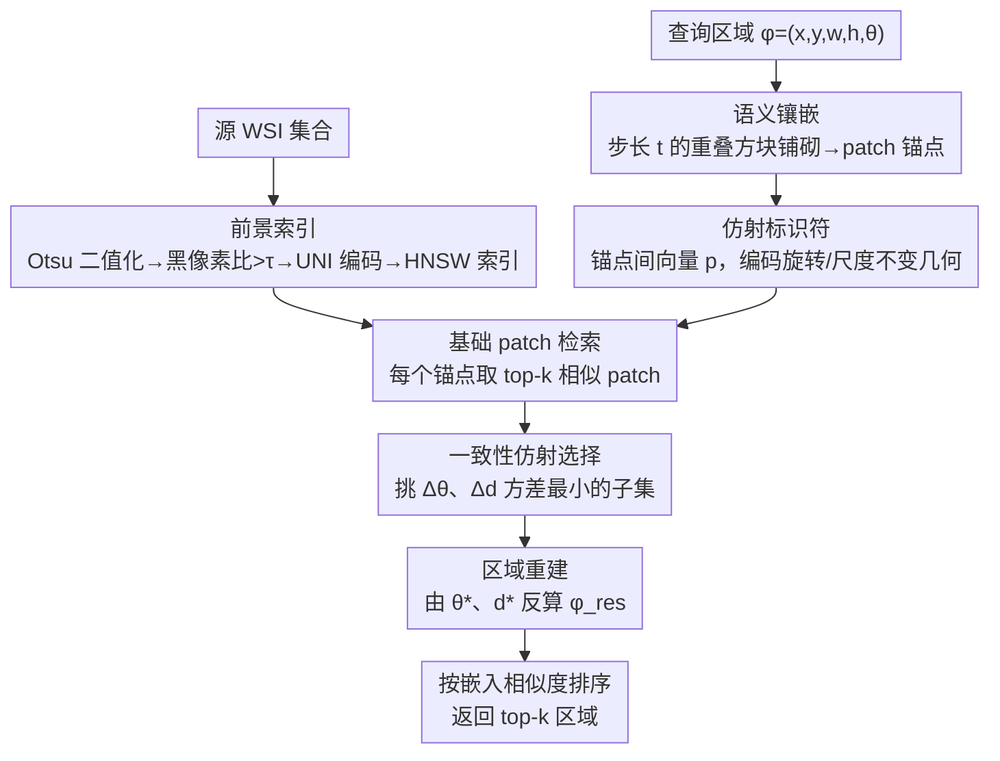

# URICA: A Uniformity Region Affine Identifier Capture Algorithm for Arbitrary Region Retrieval in Pathology Images

**会议**: CVPR 2026  
**论文**: [CVF Open Access](https://openaccess.thecvf.com/content/CVPR2026/html/Su_URICA_A_Uniformity_Region_Affine_Identifier_Capture_Algorithm_for_Arbitrary_CVPR_2026_paper.html)  
**代码**: https://github.com/HKUSTMDI/URICA-CVPR26  
**领域**: 医学图像  
**关键词**: 全切片图像检索, 病理图像, 任意区域检索, 仿射不变, 镶嵌表示

## 一句话总结
URICA 把全切片病理图像（WSI）的区域检索重新定义成「任意空间变换下的语义最优匹配问题」，用语义镶嵌（semantic tessellation）把基础模型的 patch 特征组织成几何感知的区域描述子，再用对旋转/缩放不变的「仿射标识符」做一致性匹配，在 24,811 张 TCGA WSI 上把切片级检索准确率做到 98.38%，并首次支持任意朝向、任意大小区域的检索。

## 研究背景与动机
**领域现状**：全切片图像（WSI）是吉像素级的组织扫描，是数字病理的基础。WSI 检索（给一块组织找最像的）目前主流是两条路：基于固定大小 patch 的方法（Yottixel、DRA-Net），以及基于整张切片全局表示的方法（SISH、RetCCL、HSHR）。

**现有痛点**：这两条路都和真实临床工作流脱节。病理医生看的是任意朝向、任意大小的区域（比如正常组织和肿瘤交界的一块斜着的区域），而不是预先切好的方形 patch、也不是整张切片。Patch 方法只看孤立小块、丢掉了重建完整区域所需的空间上下文；切片级方法把细粒度形态学压成一个全局向量、检索不出区域特异的模式（如黏液癌、导管原位癌这类有临床意义的局部结构）。

**核心矛盾**：WSI 里根本没有「预定义的物体」——区域边界、朝向、尺度都是自由变化的，所以很难构造一种在各种变换下都保持区域级语义的表示。具体拆成两个子难题：(1) 怎么表示任意区域？像素级语义掩膜（segmentation mask）理论上最理想，但要枚举并存储所有尺度、所有旋转下的区域表示根本不可行；自监督基础模型（UNI、PathDino）给的是 patch 级语义，却没有显式机制把这些 patch 组合成任意区域的一致表示。(2) 检索时怎么保持空间与语义一致？现有系统在区域发生旋转、缩放时就匹配不上了；面向离散物体的旋转感知检测方法（ReDet、AO2-DETR）在病理上又失效，因为组织区域是连续致密的、没有清晰物体边界。

**本文目标**：把 WSI 区域检索形式化为「任意空间变换（旋转 + 缩放）下的语义最优匹配问题」，并造出一种能表达任意区域、且在变换下稳定的区域级表示。

**核心 idea**：用「镶嵌 + 仿射标识符」代替「像素掩膜 / 全局向量」——先把基础模型的 patch 特征按规则镶嵌成几何一致的区域描述子，再在描述子之间构造一个对旋转/缩放不变的几何签名（仿射标识符），让区域匹配退化成「找一组角度差、尺度差都一致（uniform）的标识符」，并从理论上证明这种稀疏镶嵌能逼近理想的像素级掩膜相似度。

## 方法详解

### 整体框架
URICA 的输入是一个查询区域（带朝向、大小的矩形 $\phi=(x,y,w,h,\theta)$），输出是数据库里最相似的若干候选区域（带各自的位置、尺寸、旋转角）。整条管线分三段：(a) **离线建库**——把所有源 WSI 切成统一大小的前景 patch，用基础模型编码后建向量索引；(b) **查询区域处理**——把查询区域镶嵌成一组带空间位置的 patch 锚点，并在锚点之间构造仿射标识符；(c) **在线检索**——对每个查询锚点取 top-k 相似 patch，估计每对锚点的旋转差 $\Delta\theta$ 和尺度差 $\Delta d$，挑出一致性最高（方差最小）的子集来定位并重建目标区域，最后按嵌入相似度排序返回 top-k。

整个方法的精髓是「把『区域怎么变换过去』这件事，转成『一堆几何标识符的角度差和尺度差是否一致』」——只要存在一个子集让所有标识符的 $\Delta\theta$、$\Delta d$ 都收敛到同一个值，就说明找到了一个真正对应的区域，而非语义碰巧相似但结构错位的假阳性。

### 关键设计

**1. 语义镶嵌（semantic tessellation）：把 patch 特征拼成能表达任意区域的几何描述子**

痛点是基础模型只在「最小语义粒度 $s^*$」上给得出可靠的 patch 语义（论文里用 UNI 编码 $224\times224$、$5\times$ 倍率的 patch），当你想表示一个比单 patch 大、或者斜着放的区域时，编码器就力不从心。URICA 的做法是：给定区域 $r_\phi$，按固定步长 $t$ 在区域内做**重叠的方块铺砌**，每个铺砌单元是一个语义锚点 $m_{\phi_g}$，锚点中心按区域朝向 $\theta$ 旋转采样——$(x_g,y_g)=(x+x'\cos\theta-y'\sin\theta,\,x+x'\sin\theta+y'\cos\theta)$，并用相邻关系 $\mathrm{Adj}(m_{\phi_u},m_{\phi_v})=\{|x_u-x_v|=t\}\oplus\{|y_u-y_v|=t\}$ 记录锚点之间的邻接结构。于是一个区域就变成 $T^t_\phi=\{V_\phi,R_\phi\}$（锚点集合 + 邻接关系）。

这样做的好处是：镶嵌天然保留了锚点之间的**相对空间关系**，而相对关系正是后面做旋转/尺度不变匹配的基础；同时它是稀疏采样（步长 $t$ 可调），不像像素掩膜那样需要存储所有尺度、所有旋转的稠密表示，可行性大大提高。

**2. 仿射标识符（affine identifier）：让旋转、缩放变成可直接读出的几何量**

痛点是区域检索时旋转、缩放一变，普通特征就对不上。URICA 在镶嵌内部定义一个**仿射标识符** $p(\cdot)=(x-x_0,\,y-y_0)$，即从某个起点锚点指向另一锚点的向量。论文的核心性质（Property 1）证明：对两个具有相同镶嵌、仅差一个仿射变换的区域 $r_\phi$ 与 $r_{\phi'}$（$\phi'=(x',y',w\cdot\Delta d,h\cdot\Delta d,\theta+\Delta\theta)$），任意一对对应标识符都满足

$$\frac{\sqrt{x_{e'}^2+y_{e'}^2}}{\sqrt{x_e^2+y_e^2}}=\Delta d,\qquad \arccos\!\frac{x_{e'}}{\sqrt{x_{e'}^2+y_{e'}^2}}-\arccos\!\frac{x_e}{\sqrt{x_e^2+y_e^2}}=\Delta\theta.$$

也就是说，**区域整体的旋转角和缩放比，等于任意一个仿射标识符的角度差和长度比**。检索时，对查询锚点 $v_{\phi_q}$ 取 top-k 相似 patch 得到对应标识符 $p_{\mathrm{res}}$，就能用 Eq.(1) 直接算出这一对锚点给出的 $\Delta\theta=\arccos\frac{p\cdot p_{\mathrm{res}}}{\|p\|\|p_{\mathrm{res}}\|}$ 和 $\Delta d=\frac{\|p_{\mathrm{res}}\|}{\|p\|}$。这把「估计区域的仿射变换」从一个优化问题变成了**一堆几何量的直接读数**，且对旋转、缩放天然不变——这正是病理区域检索最需要、而旋转感知检测方法（针对离散物体）给不出的能力。

**3. 一致性仿射选择 + 区域重建：用方差最小的子集过滤假阳性、反算目标区域**

单看一对锚点算出来的 $\Delta\theta$、$\Delta d$ 可能因为 patch 检索噪声而不准。URICA 的关键判据是：**真正对应的区域，会让一大批仿射标识符给出一致（uniform）的 $\Delta\theta$、$\Delta d$；语义碰巧相似但结构错位的假阳性则不会**。于是它在所有锚点对算出的角度集合 $\{\theta\}$、尺度集合 $\{d\}$ 里，挑出方差最小、大小 $\ge 2$ 的一致子集（Eq.(2)(3)），再对子集取平均得到稳健估计 $\theta^*$、$d^*$（Eq.(4)）。有了共享起点锚点 $(x^*,y^*)$ 和校验过的 $\theta^*$、$d^*$，就能用 Eq.(5)(6) 反算出目标区域描述子：$w_{\mathrm{res}}=w\cdot d^*$、$h_{\mathrm{res}}=h\cdot d^*$、$\theta_{\mathrm{res}}=\theta^*$，中心位置由旋转矩阵 $\begin{bmatrix}\cos\theta^*&-\sin\theta^*\\\sin\theta^*&\cos\theta^*\end{bmatrix}$ 作用在 $(x^*-x_c,\,y^*-y_c)$ 上再加回检索到的 patch 位置。$n$ 个锚点、队列长 $k$ 一共生成 $n\times k$ 个候选区域，按与查询嵌入的相似度排序返回 top-k。

**4. 镶嵌逼近理论 + 效率优化：证明稀疏镶嵌能逼近理想掩膜，并把复杂度压一个量级**

这一块是 URICA 区别于纯工程方法的「有理论保证」之处，也包含让算法能跑在大规模 WSI 上的工程手段。理论侧（第 5 节）引入「重合度」假设 Hyp.1：两个 patch 的语义重合度 $\delta=\big(\frac{2^s-|x-x^*|}{2^s}\big)^\alpha\big(\frac{2^s-|y-y^*|}{2^s}\big)^\alpha$，$\alpha$ 是相关度参数。基于此可对未观测像素的相似度给出上下界，并用积分 $\iint_S L(\mathrm{sim}(x,y))\,ds$ 量化镶嵌任务对理想掩膜任务的逼近程度；当保证该积分 $<1+\xi$ 时得到 Eq.(7)，它把编码器最小粒度 $s^*$、镶嵌步长 $t$、容许误差 $\xi$ 和 $\alpha$ 联系起来——意味着可以从已有 WSI 估出 $\alpha$，再据此选一个既准又省的镶嵌步长 $t$（⚠️ 完整证明在附录，公式以原文为准）。

效率侧（第 6 节），原始复杂度有两块瓶颈：检索是 $O(n^*k\log(cn))$，仿射识别若穷举子集是指数级 $O(2^{k^2 n^*})$。URICA 用两招压下来：(i) **锚点选择**——在镶嵌图上用 K-Means 或谱聚类挑 $k_a$ 个代表性锚点，把检索降到 $O(k_a\cdot k\log(cn))$；(ii) **Bag of Shifting（BoS）**——把角度 $[-\pi,\pi]$ 和尺度 $[0.5,2]$ 分桶，每个 $(\Delta\theta,\Delta d)$ 落到区间里、再用偏移半格的「孪生桶」减少边界误差，用每桶平均方差估计 $(\theta^*,d^*)$，把识别降到 $O(k_a\cdot k^2)$。当 $k_a\ll n^*$ 时整体提速一个量级，URICA 才得以在 13.481 TB 的库上跑起来。

### 损失函数 / 训练策略
URICA 是一个**检索算法**而非端到端训练的网络：它复用预训练的 UNI 编码器（不微调），核心是镶嵌、仿射标识符、一致性选择这套几何 + 检索流程，没有自定义训练损失。唯一的「学习」发生在数据驱动地从已有 WSI 估计相关度参数 $\alpha$（用于定镶嵌步长 $t$）。

## 实验关键数据

### 主实验
评测在 24,811 张 TCGA WSI（13.481 TB）上进行，覆盖 10 个解剖部位的 29 种癌症亚型。WSI 在 $5\times$ 倍率下切成 $224\times224$ patch，用 UNI 编码、Milvus + HNSW 建索引。切片级用 mMV@k（多数投票），区域级用 mSim@k（特征相似度）和 mIoU@k（空间重叠）。

切片级检索（mMV@5，节选部位 + 总体）：

| 部位 | 切片数 | Yottixel | SISH | RetCCL | HSHR | URICA |
|------|-------|----------|------|--------|------|-------|
| 肺部 Pul. | 3395 | 70.73 | 68.36 | 84.27 | 78.45 | **99.26** |
| 神经胶质 Gl. | 3565 | 66.97 | 57.04 | 54.57 | 69.22 | **97.90** |
| 脑部 Bra. | 3625 | 93.38 | 91.60 | 85.98 | 93.74 | **99.81** |
| **总体** | 24811 | 87.73±9.6 | 84.96±12.0 | 87.00±13.0 | 90.87±10.3 | **98.38±1.2** |

区域级检索（top-5，mSim/mIoU，三个直接 baseline + URICA，节选部位）：

| 部位 | Slide 法 | Sample 法 | Adjacent 法 | URICA |
|------|----------|-----------|-------------|-------|
| 肺部 Pul. | 0.681/0.166 | 0.858/0.316 | 0.167/0.026 | **0.940/0.642** |
| 泌尿 Uri. | 0.693/0.168 | 0.860/0.307 | 0.156/0.024 | **0.931/0.649** |
| 脑部 Bra. | 0.692/0.156 | 0.873/0.288 | 0.155/0.022 | **0.922/0.643** |

URICA 在所有部位的 mIoU@5 都最优，mSim@5 在绝大多数情况下最优（只有 Sample 法在个别亚型上略高）。注意 mIoU 的差距最悬殊：URICA 普遍 0.6+，而表达力最强的 Sample 法只有 0.3 左右——说明 URICA 真正赢在**空间重叠/区域结构**的保持上，而不仅是语义相似。Adjacent 法（靠局部邻接 patch 重建）几乎全线崩盘（mIoU 仅 0.02 量级），印证了刚性邻接无法应对旋转/缩放。

### 消融实验
表 3 对比锚点选择策略与 BoS（mTPQ = 每次查询平均耗时，越小越快）：

| 锚点选择 | BoS | mSim/mIoU@5（肺部） | mTPQ |
|----------|-----|-------------------|------|
| Fixed Position | ✗ | 0.937/0.645 | 24.29 |
| Fixed Position | ✓ | 0.911/0.643 | 29.60 |
| **K-Means** | ✗ | **0.951/0.657** | **21.50** |
| K-Means | ✓ | 0.940/0.641 | 21.41 |
| Spectral | ✗ | 0.916/0.587 | 43.15 |
| Spectral | ✓ | 0.830/0.529 | 22.99 |

### 关键发现
- **K-Means 锚点选择给出最佳精度–效率折中**：它在肺部既拿到最高精度（0.951/0.657）又最省时（21.50），优于 Fixed Position 和谱聚类；BoS 主要帮谱聚类大幅降时延（43.15 → 22.99）但有可观精度代价（mSim 0.916 → 0.830）。
- **锚点比例 0.6 是甜点**：比例 < 0.5（0.2–0.4）精度明显掉，比例 1.0 精度最高但开销大；0.6 维持接近峰值精度（损失约 4.2%）却大幅降运行时间。
- **镶嵌步长 $t=60$ 最优**（由 $\alpha=3$、采样率 $\eta=0.7$ 推出）：步长太大（$t=224$）覆盖稀疏、精度低，太小（$t=50$）精度高但时延和存储涨；$t=60$ 达到 Sim@5 0.7850、IoU@5 0.5956，比小步长基线快 31.6%、省 30% 存储——验证了 $\alpha$ 是可靠的粒度控制旋钮，也在实践中印证了 Hyp.1。

## 亮点与洞察
- **把检索问题几何化**：URICA 最「啊哈」的地方是用 Property 1 把「估计区域仿射变换」化简成「读出一组标识符的角度差和长度比」，再用「方差最小的一致子集」当鲁棒判据过滤假阳性。这套「几何一致性投票」思想可迁移到任何需要在变换下做区域/点集匹配的任务（如遥感、显微图像配准）。
- **稀疏镶嵌 + 理论界**：用步长可调的稀疏锚点近似稠密像素掩膜，并给出逼近界（Eq.7）来指导步长选择，让「省多少 / 准多少」有据可循，而不是拍脑袋调参——这是把工程旋钮和理论保证挂钩的好范例。
- **复用基础模型而非重训**：直接拿冻结的 UNI patch 特征做积木，靠几何组织而非端到端训练拿到 SOTA，说明「基础模型特征 + 巧妙的几何/检索结构」在病理这种标注稀缺场景里非常划算。
- **BoS 把指数级搜索分桶降到平方级**：把仿射子集选择从 $O(2^{k^2 n^*})$ 降到 $O(k_a k^2)$ 的分桶 + 孪生桶技巧，是个可复用的「用直方图近似最优子集」工程手段。

## 局限与展望
- **作者承认的三点局限**：(1) 对极小或不规则区域不灵——镶嵌和仿射匹配在锚点太少时变得不可靠；(2) 性能依赖编码器质量，在染色差异、扫描伪影、罕见病变下可能掉点；(3) 需要大规模已建索引的数据，在小目标库上优势缩小。
- **自己发现的局限**：(a) 整套方法假设区域近似刚性仿射变换（旋转 + 各向同性缩放），对组织的非刚性形变、各向异性拉伸没有显式建模；(b) 评测全部在 TCGA 单一来源、UNI 单一编码器上完成，跨机构/跨染色协议的泛化性未验证；(c) 区域被限定为矩形描述子 $(x,y,w,h,\theta)$，真实病灶的任意曲线边界只能用外接矩形近似；(d) mSim 指标本身基于 UNI 嵌入，存在「自己评自己」的循环依赖——编码器偏好的相似度未必等于病理学意义上的相似。
- **改进思路**：把仿射标识符推广到含非刚性形变的薄板样条/局部仿射场；引入掩膜/轮廓级描述子支持非矩形区域；在多编码器、多中心数据上验证鲁棒性。

## 相关工作与启发
- **vs Patch 级方法（Yottixel、DRA-Net）**：它们从孤立 patch 估相似度、缺少重建连贯区域的空间上下文；URICA 用镶嵌显式保留锚点间相对空间关系，能在变换下重建完整区域，故区域级 mIoU 远超。
- **vs 切片级 / 全局表示（SISH、RetCCL、HSHR）**：它们把细粒度形态压成全局向量、检不出区域特异模式；URICA 工作在区域级、保留局部结构，切片级也顺带把准确率从 90.87% 提到 98.38%。
- **vs 旋转感知检测（ReDet、AO2-DETR、Steerers）**：这类方法为离散、边界清晰的物体设计旋转等变性；病理组织是连续致密、无明确物体的，URICA 用仿射标识符的几何不变性绕开了「物体检测」范式，更契合 WSI。
- **vs 基于分割掩膜的区域表示（SAM-based、弱监督分割）**：像素掩膜理想但无法枚举/存储所有尺度旋转下的区域表示；URICA 用稀疏镶嵌近似掩膜，并给出逼近误差界，把「理想但不可行」变成「可行且有保证」。

## 评分
- 新颖性: ⭐⭐⭐⭐⭐ 把 WSI 区域检索重定义为变换下的语义最优匹配，用仿射标识符 + 一致性投票 + 镶嵌逼近界，首次支持任意朝向/大小区域检索，思路新颖且自洽。
- 实验充分度: ⭐⭐⭐⭐ 24,811 张 TCGA、29 亚型、多 baseline、双任务（切片/区域）+ 锚点/BoS/步长三组消融，规模够大；但只用单一数据源和单一编码器，跨中心泛化未测。
- 写作质量: ⭐⭐⭐⭐ 定义严谨、理论与工程都交代清楚，公式较密但 Property 1 把核心直觉讲得很准；图表信息量大但区域级大表略显拥挤。
- 价值: ⭐⭐⭐⭐⭐ 直击病理医生「看任意区域」的真实工作流，复用基础模型即可落地，对计算病理的检索/相似病例查找有实际意义且开源。

<!-- RELATED:START -->

## 相关论文

- [\[CVPR 2026\] Synergistic Bleeding Region and Point Detection in Laparoscopic Surgical Videos](synergistic_bleeding_region_and_point_detection_in_laparoscopic_surgical_videos.md)
- [\[ECCV 2024\] CheX: Interactive Localization and Region Description in Chest X-rays](../../ECCV2024/medical_imaging/chex_interactive_localization_and_region_description_in_chest_x-rays.md)
- [\[CVPR 2026\] EchoVDiff: Cardiac-Cycle Echocardiography Video Generation from Arbitrary Single Frame](echovdiff_cardiac-cycle_echocardiography_video_generation_from_arbitrary_single_.md)
- [\[ICCV 2025\] AcZeroTS: Active Learning for Zero-shot Tissue Segmentation in Pathology Images](../../ICCV2025/medical_imaging/aczerots_active_learning_for_zeroshot_tissue_segmentation_in.md)
- [\[AAAI 2026\] Sim4Seg: Boosting Multimodal Multi-disease Medical Diagnosis Segmentation with Region-Aware Vision-Language Similarity Masks](../../AAAI2026/medical_imaging/sim4seg_boosting_multimodal_multi-disease_medical_diagnosis_segmentation_with_re.md)

<!-- RELATED:END -->
