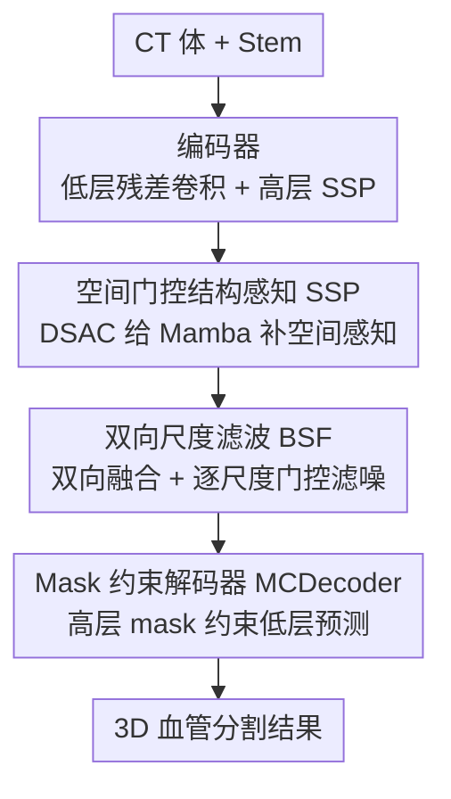

# VesMamba: 3D Pulmonary Vessel Segmentation from CT images via Mamba with Structural Perception and Scale-aware Filtering

**会议**: CVPR 2026  
**论文**: [CVF Open Access](https://openaccess.thecvf.com/content/CVPR2026/html/Liu_VesMamba_3D_Pulmonary_Vessel_Segmentation_from_CT_images_via_Mamba_CVPR_2026_paper.html)  
**代码**: https://github.com/Lzpbright/VesMamba  
**领域**: 医学图像  
**关键词**: 3D肺血管分割, Mamba, 状态空间模型, 多尺度滤波, 深监督

## 一句话总结
VesMamba 把 Mamba 改造成能感知 3D 血管空间各向异性的分割骨干——用动态方向卷积给 Mamba 补上空间感知、用双向尺度滤波在编码器各层抑噪、再用高层 mask 约束低层解码器，在 Parse22 和自建 Lung79 上以约 1/4 的计算量超过一众 CNN / Transformer / Mamba SOTA。

## 研究背景与动机

**领域现状**：肺血管疾病是重要的健康威胁，CT 是主要影像手段，但人工勾画血管耗时、依赖经验。自动 3D 肺血管分割从早期灰度/阈值/形态学方法，演进到 CNN、CNN-Transformer 混合模型，近来又有把状态空间模型（SSM）代表 Mamba 引入 3D 医学分割的尝试（UMamba、SegMamba 等）。

**现有痛点**：肺血管是复杂的树状结构、尺度跨度极大（主干粗、末梢细），小血管对比度低、还叠加运动伪影；动脉与静脉高度相似、相互重叠。CNN 难捕获长程结构依赖；Transformer 类显存开销大、在临床有限算力下吃力；标准 Mamba 把 3D 体数据拉成序列后会破坏空间局部性，缺乏空间感知，难以追踪血管的各向异性拓扑。已有的多方向扫描（如 SegMamba 的三向扫描）虽想补空间感知，却显著抬高计算量、且对小血管仍提取不足。

**核心矛盾**：血管分割同时要「长程拓扑建模」和「细粒度空间各向异性感知」，而把 3D 拍成 1D 序列的 Mamba 天然丢掉后者；硬堆多向扫描去补，又会牺牲 Mamba 线性复杂度带来的效率优势——精度和算力之间的 trade-off 没被打破。

**本文目标**：在保持 Mamba 高效长程建模的前提下，(1) 给它补上对 3D 血管各向异性结构的空间感知；(2) 在多尺度、强噪声背景下稳健地凸显不同粗细的血管；(3) 提升相邻尺度预测的一致性。

**切入角度**：作者观察到 3D 血管在平行方向呈长条状、垂直方向呈椭圆状的「空间各向异性」，而传统卷积对各方向一视同仁。于是与其堆扫描，不如用一个能按方向动态加权的卷积，把方向先验直接喂给 Mamba 当「空间门控」。

**核心 idea**：用动态空间注意力卷积（DSAC）给 Mamba 做空间门控、用双向尺度滤波净化编码器特征、用高层 mask 约束低层解码——三件组合成 VesMamba。

## 方法详解

### 整体框架

VesMamba 是一个 5 层编解码 U 形网络。输入 CT 体 $I\in\mathbb{R}^{1\times H\times W\times D}$ 先经 stem 提取初步特征 $F_0\in\mathbb{R}^{32\times H\times W\times D}$，编码器逐层下采样得到多尺度特征 $F_i\in\mathbb{R}^{(32\cdot 2^i)\times \frac{H}{2^i}\times \frac{W}{2^i}\times \frac{D}{2^i}}$。前三层用残差卷积提取低层细节，后两层用 SSP 模块提取高层结构特征；网络瓶颈处也是一个 SSP（其中自注意力被换成多尺度空间注意力门 MSAG）。编码器各层特征送进 BSF 模块做双向融合 + 逐尺度滤噪，得到增强特征 $F'_i$。最后 $F'_i$ 与瓶颈高层特征进入 MCDecoder，由高层 mask 携带的轮廓/位置信息直接约束相邻低层预测，输出最终分割。

### 关键设计

**1. 空间门控结构感知 SSP：给序列化的 Mamba 补回 3D 空间感知**

痛点直说：把 3D 体拉成序列喂 Mamba，空间局部性被打散，模型「看不出」血管在不同方向上的各向异性形态。SSP 由一个空间门控 Mamba（SGM）和一个自注意力块组成。SGM 是上中下三层结构：上层用双向扫描 SSM 建长程依赖（正反两路对齐相加），中层用卷积抽局部特征与上层相加聚合局部+全局，输出记为 $s_1=\text{Concat}(\text{Flip}(\text{SSM}_b(x'_{1b}))+\text{SSM}(x'_1),\,x'_2)$。

关键在底层的 DSAC（动态空间注意力卷积）：它先用三组方向分离卷积（核 $1\times1\times3$、$1\times3\times1$、$3\times1\times1$）抽出三个方向的各向异性特征 $x,y,z$，再经平均池化压成 $3C\times1\times1\times1$、卷积降到 3 通道、Softmax 生成方向权重 $w_x,w_y,w_z$，最后按权重融合：

$$w_x, w_y, w_z = \sigma(\text{Conv}_4(\text{Pool}(\text{Concat}(x,y,z)))),\quad s_2 = w_x\cdot x + w_y\cdot y + w_z\cdot z$$

DSAC 的输出经 Sigmoid 当门控乘回 $s_1$：$s_3 = s_1\odot\varepsilon(s_2)$，从而把「血管沿哪个方向延伸」这一空间先验动态注入 Mamba。最后再叠一个自注意力 $s_4=\text{Attn}(s_3)$ 强化长程依赖。为什么有效：DSAC 不是固定卷积，而是按内容动态决定三个方向的权重，正好对上血管「平行长条、垂直椭圆」的各向异性，让 Mamba 既保留线性复杂度的长程建模，又获得空间感知——比堆多向扫描更省算力（消融里 SSP 是单模块涨点最多的）。

**2. 双向尺度滤波 BSF：在编码器各层把不同尺度的噪声滤掉，而不是只做特征金字塔融合**

痛点直说：FPN/PAN 这类金字塔融合若把低层和高层特征直接相加，分布差异会相互干扰，PAN 的大量卷积还很费算力；而血管尺度跨度大，融合后的局部信息可能干扰高层解码、全局信息又可能扰乱低层。BSF 的巧思是——把双向融合的结果**不当输出，而当滤波器**。

它先做高层到低层（$\mathcal{F}^{HL}$）、再做低层到高层（$\mathcal{F}^{LH}$）的双向逐层传递，融合时用拼接而非逐元素相加以减少互扰，并用深度位移卷积 ShiftConv（仅靠数据在深度方向移动来交互）以 2D 卷积的开销提取 3D 特征。得到最终融合特征 $M'_i$ 后，用它当门控去净化原始编码器特征：

$$F'_i = \varepsilon(M'_i)\odot F_i$$

为什么有效：$\varepsilon(M'_i)$ 是融合了局部细节+全局轮廓的 Sigmoid 掩码，逐尺度地抑制 $F_i$ 中的背景噪声、凸显血管，得到更鲁棒的 $F'_i$ 再去解码——既避免了「直接拿融合特征解码」造成的尺度互扰，又用 ShiftConv 控住了算力。消融显示去掉门控（w/o gate）掉点明显。

**3. Mask 约束解码器 MCDecoder：用高层 mask 直接约束相邻低层预测，提升一致性**

痛点直说：普通深监督各层独立出 mask，相邻尺度预测可能不一致，血管连续性容易断。MCDecoder 利用「相邻层 mask 差异本就很小」这一点：高层 mask 含血管轮廓+位置信息，低层 mask 富含局部细节，于是把高层 mask 作为相邻低层解码器的输入，给低层提供轮廓/位置约束：

$$T_i=\text{ResConv}(\text{Concat}(F'_i,\text{Up}(T'_{i+1}))),\quad Mask_i=\text{Conv}(\text{Concat}(Mask_{i+1},T_i)),\quad T'_i=T_i\odot Mask_i$$

最终 $Mask_1=\text{Conv}(\text{Concat}(F'_1,\text{Up}(T'_2),Mask_2))$ 即输出。为什么有效：高层 mask 把位置/轮廓先验逐级「传染」给低层，直接约束低层预测，让相邻尺度结果对齐，从而提升小分支的连续性与整体一致性（消融中 constraint1/constraint2 各去其一都掉点）。

### 损失函数 / 训练策略
深监督下，对 4 个阶段分别用 BCE + Dice 计算 stage loss，再按权重加权汇总：

$$\mathcal{L}=\sum_{i=1}^{4} k_i\cdot(\mathcal{L}_{BCE}+\mathcal{L}_{Dice})$$

其中 $k_i$ 由各阶段 mask 尺寸与输入尺寸之比归一化得到。基于 UMamba 框架实现，单卡 A100 40GB，SGD（初始 lr 1e-2）+ PolyLR，训练 200 epoch，batch size 2。

## 实验关键数据

### 主实验
两个数据集：公开 Parse22（肺动脉，100 例）与自建 Lung79（动脉/静脉/气道三类，79 例）。指标用 Dice、clDice（中心线 Dice，衡量连续性）、HD95、NSD。对比 9 个 SOTA（CNN：3D-UNet/nnUNet/DSCNet；Transformer：SegFormer3D/UNETR++/Swin-UNETR；Mamba：UMamba/SegMamba/LKM-UNet）。

Parse22 主结果：

| 方法 | Dice↑ | clDice↑ | HD95↓ | NSD↑ |
|------|-------|---------|-------|------|
| nnUNet | 84.20 | 80.85 | 6.21 | 89.11 |
| UNETR++ | 85.27 | 84.02 | 4.61 | 91.36 |
| UMamba（baseline） | 85.94 | 86.64 | 3.69 | 92.74 |
| LKM-UNet | 86.21 | 87.14 | 3.31 | 92.95 |
| **VesMamba（本文）** | **86.65** | **87.46** | **2.98** | **93.21** |

相比 baseline UMamba，Dice/clDice 各 +0.71/+0.82，HD95 与 NSD 也全面更优，说明既学到更好的血管整体分布、又保住了血管连续性。Lung79（更难，三类相似结构）上 VesMamba 在 airway/artery/vein 三个目标的全部指标也均居首（如 vein 的 HD95 从次优 6.01 降到 5.71）。

### 消融实验
模块级消融（Dice，baseline=UMamba）：

| SSP | BSF | MCDecoder | Parse22 | Lung79 |
|-----|-----|-----------|---------|--------|
| | | | 85.94 | 84.49 |
| ✓ | | | 86.42 | 84.95 |
| | ✓ | | 86.35 | 84.87 |
| ✓ | ✓ | | 86.55 | 85.06 |
| ✓ | ✓ | ✓ | **86.65** | **85.19** |

模块内部设计消融（节选，Parse22 Dice/clDice）：

| 模块 | 配置 | Dice↑ | clDice↑ |
|------|------|-------|---------|
| SSP | Conv1+Atten（去 DSAC+去 MSAG） | 86.25 | 86.89 |
| SSP | 完整 SSP | 86.42 | 87.38 |
| BSF | Add+Conv2（相加+普通卷积） | 84.32 | 84.66 |
| BSF | w/o gate（不做门控滤波） | 85.84 | 86.48 |
| BSF | 完整 BSF | 86.35 | 87.26 |
| MCDecoder | w/o constraint1 | 86.24 | 87.11 |
| MCDecoder | 完整 MCDecoder | 86.29 | 87.18 |

### 关键发现
- **SSP 是单模块涨点最多的**：在两个数据集上加 SSP 都带来最大提升，可视化显示模型更聚焦大尺度血管、抑制非血管区干扰——印证 DSAC 给 Mamba 补的空间感知是核心增益。
- **BSF 内部门控不可省**：去掉门控（w/o gate）从 86.35 掉到 85.84，用相加+普通卷积替代（Add+Conv2）更跌到 84.32，说明「把融合特征当滤波器」这一思路比「当输出直接用」关键得多。
- **效率优势明显**：性能-效率对比中，LKM-UNet 与本文性能相近，但 VesMamba 只需约 1/4 计算量，体现 Mamba+轻量设计在临床有限算力下的价值。
- **失败场景**：血管分叉过度、形状异常不均的目标会限制本文表现。

## 亮点与洞察
- **「把方向先验做成动态门控喂给 Mamba」很巧**：DSAC 用三组方向分离卷积 + Softmax 方向权重，正好对上 3D 血管的各向异性，比堆多向扫描省算力，是给 SSM 补空间感知的一个可复用范式。
- **「融合特征当滤波器而非输出」是 BSF 的点睛**：多数金字塔方法把融合结果直接拿去解码，本文反其道用它做逐尺度门控去净化原始编码器特征，规避了尺度互扰——这个「融合→门控」的转念可迁移到其他多尺度分割任务。
- **ShiftConv 以 2D 开销拿 3D 特征**：深度位移卷积只靠数据移动做深度向交互，是 3D 医学分割里省显存的实用 trick。
- **高层 mask 约束低层解码**利用了相邻尺度 mask 差异小的先验，用极轻的方式提升预测一致性，对追求血管连续性的任务尤其对症。

## 局限与展望
- 作者承认：血管分叉过度、形状异常不均的极端目标仍会限制效果（失败案例）。
- Lung79 是自建数据集（79 例），规模较小且未公开，artery/vein 高相似场景的泛化性需更多外部验证。
- 整体涨幅偏小（Parse22 Dice +0.44 over LKM-UNet），主要卖点之一在「同等精度下算力约 1/4」，但论文未给出 FLOPs/参数量的具体数值表（只有图示），可复现的效率对比略欠。
- DSAC 的三方向核是固定的轴向卷积，对斜向走行血管是否最优、能否进一步自适应方向，值得探索。

## 相关工作与启发
- **vs DSCNet**：DSCNet 用自适应卷积核 + 拓扑连续性损失模拟血管形态，但易受背景干扰、对非管状目标吃力；VesMamba 不靠特殊卷积核硬拟合形态，而是 DSAC 动态方向门控 + Mamba 长程建模，鲁棒性更好（DSCNet 在两数据集上反而明显落后）。
- **vs SegMamba**：SegMamba 用三正交方向扫描（ToM）补空间感知，但三向扫描显著抬高算力、且小血管局部特征提取不足；VesMamba 用单个 DSAC 门控替代多向扫描，更省算力且小分支连续性更好。
- **vs UMamba（baseline）**：UMamba 用 CNN-SSM 混合块建长程依赖，但递归状态更新难直接感知相邻局部；本文在其框架上加 SSP/BSF/MCDecoder，Parse22 Dice/clDice 各 +0.71/+0.82。
- **vs FPN/PAN 类融合**：传统金字塔直接相加易互扰、PAN 卷积太重；BSF 用拼接+ShiftConv 双向融合并把结果当门控滤波，兼顾鲁棒与效率。

## 评分
- 新颖性: ⭐⭐⭐⭐ DSAC 给 Mamba 补空间感知、BSF「融合特征当滤波器」两点都较新颖，但属于在 Mamba 分割框架上的模块级组合创新。
- 实验充分度: ⭐⭐⭐⭐ 两数据集、9 个 SOTA、模块级+模块内双层消融较扎实；但 Lung79 未公开、效率对比缺具体数值表。
- 写作质量: ⭐⭐⭐⭐ 动机-方法-实验逻辑清晰，公式与图配套；个别符号（如 $M_1,M_5$ 的拼装式）表述偏密。
- 价值: ⭐⭐⭐⭐ 在临床有限算力下以约 1/4 计算量达到/超越 SOTA，对 3D 肺血管分割实用，代码开源。

<!-- RELATED:START -->

## 相关论文

- [\[NeurIPS 2025\] Mamba Goes HoME: Hierarchical Soft Mixture-of-Experts for 3D Medical Image Segmentation](../../NeurIPS2025/medical_imaging/mamba_goes_home_hierarchical_soft_mixture-of-experts_for_3d_medical_image_segmen.md)
- [\[CVPR 2026\] SPECTRE：面向体积 CT Transformer 的自监督与跨模态预训练](scaling_self-supervised_and_cross-modal_pretraining_for_volumetric_ct_transforme.md)
- [\[CVPR 2025\] vesselFM: A Foundation Model for Universal 3D Blood Vessel Segmentation](../../CVPR2025/medical_imaging/vesselfm_a_foundation_model_for_universal_3d_blood_vessel_segmentation.md)
- [\[CVPR 2026\] Sketch2CT: Multimodal Diffusion for Structure-Aware 3D Medical Volume Generation](sketch2ct_multimodal_diffusion_for_structure-aware_3d_medical_volume_generation.md)
- [\[CVPR 2026\] GeoSemba: Reconstructing State Space Model for Cross Paradigm Representation in Medical Image Segmentation](geosemba_reconstructing_state_space_model_for_cross_paradigm_representation_in_m.md)

<!-- RELATED:END -->
