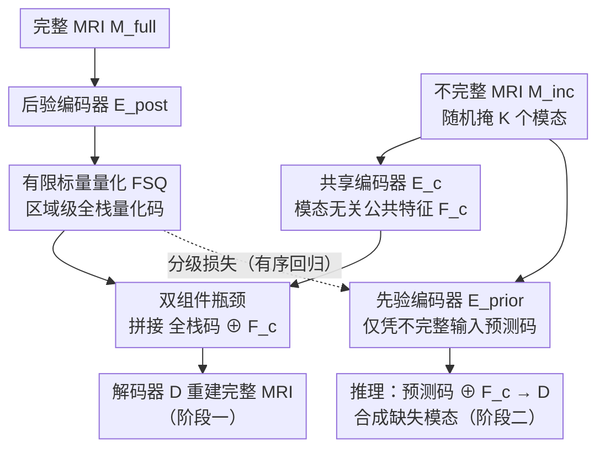

# Virtual Full-stack Scanning of Brain MRI via Imputing Any Quantised Code

**会议**: CVPR 2026  
**arXiv**: [2501.18328](https://arxiv.org/abs/2501.18328)  
**代码**: [有](https://github.com/ycwu1997/CodeBrain)  
**领域**: 医学图像  
**关键词**: MRI模态补全, 有限标量量化, 脑MRI, 跨模态合成, 任意到任意

## 一句话总结

提出 CodeBrain，将脑 MRI 任意到任意模态补全问题重新表述为区域级全栈量化码预测任务，通过两阶段流程（标量量化重建 + 分级损失码预测）实现统一的缺失模态合成，超越五种 SOTA 方法。

## 研究背景与动机

### 1. 临床需求
脑 MRI 检查涉及多种采集协议（T1、T2、PD、FLAIR、T1Gd等），不同模态强调不同的解剖/病理特征。但临床中因扫描时间、成本、造影剂风险等限制，很难采集完整模态集。虚拟全栈扫描（virtual full-stack scanning）旨在从不完整采集中补全缺失模态，提升数据完整性和临床可用性。

### 2. 现有方法的局限
现有统一补全方法依赖两类全局条件来指定可用/缺失模态：
- **全局二值向量**：如 M2DN 用 [1,1,0] 指示模态可用性，但无法捕获区域级和跨模态变异
- **可学习模态查询**：如 MMT 用模态特定解码器，参数量随模态数增长，泛化性差

两类方法本质上做的是像素级模态翻译，缺乏对跨模态空间关系的紧凑建模。

### 3. 核心洞察
理论上，同一受试者不同 MRI 模态在像素级共享底层自旋特性（transferable）；实践上，SynthSeg 证明不同模态共享结构先验（shared）。因此可以将复杂的 any-to-any 补全问题转化为更简单的**区域级码预测**问题——预测一个紧凑的全栈表示，而非逐模态合成。

## 方法详解

### 整体框架

CodeBrain 想解决的是「任意到任意」的 MRI 模态补全：手里有哪几个模态、缺哪几个都不固定，要从已有模态合成出缺失的那些。它没有走逐模态翻译的老路，而是把整张完整 MRI 压成一个紧凑的「全栈表示」，再让模型去预测这个表示。

整个流程拆成两阶段。第一阶段先在完整模态集上学这个紧凑表示：把全模态编码成区域级的标量量化码，再配上一份模态无关的公共特征，两者拼起来就能解码回完整 MRI。第二阶段则训练一个先验编码器，让它仅凭手头的不完整模态去预测出那份全栈量化码。推理时，不完整输入先经先验编码器得到预测码，与从同一输入提取的公共特征拼接后送进解码器，缺失模态就被合成出来。

### 关键设计

**1. 有限标量量化（FSQ）：扔掉可学习码本，避开码本坍塌**

传统 VQ 要维护一个显式的可学习码本，训练时容易出现码本坍塌，还得靠辅助正则化损失硬撑，既不稳又繁琐。CodeBrain 改用有限标量量化绕开这一切。后验编码器 $E_{\text{posterior}}$ 把完整 MRI $M_{\text{full}}$ 编码成特征图 $F_{\text{full}}$，然后逐元素量化：先经 $Z_{\text{full},i} = \lfloor L_i/2 \rfloor \times \tanh(F_{\text{full},i})$ 把每个通道压到固定值域，再 $\hat{Z}_{\text{full}} = \text{round}(Z_{\text{full}})$ 取整。

每个通道 $i$ 有 $L_i$ 个整数级别，值域落在 $[-\lfloor L_i/2\rfloor, \lfloor L_i/2\rfloor]$；取整不可导，靠 straight-through estimator 让梯度照常回传。实验里取 $L=[8,8,8,5,5,5]$、$d=6$ 个通道，等价码本大小是 $\prod L_i = 64000$。因为级别由通道结构直接定义、不需要学，码本坍塌和那一串正则项就都不存在了，训练既快又稳。

**2. 双组件瓶颈表示：把模态特异性和模态无关信息拆开**

光有量化码还不够——补全的难点在于既要还原模态各自的细节，又要保住所有模态共享的那套解剖结构。第一阶段的巧思是把完整 MRI 显式分解成两份互补的东西：一份是全栈量化码 $\hat{Z}_{\text{full}}$，由 $E_{\text{posterior}}$ 从完整输入 $M_{\text{full}}$ 提取，专门承载模态特异性的区域级特征；另一份是公共特征 $F_c$，由共享编码器 $E_c$ 从任意不完整输入 $M_{\text{inc}}$ 提取，承载模态无关的解剖信息。重建就是把两者拼起来解码：$\tilde{M}_{\text{full}} = D(\text{Concat}[\hat{Z}_{\text{full}}, F_c])$。

关键在于 $F_c$ 是从「残缺」输入里抽的。训练时对 $M_{\text{inc}}$ 随机掩掉 $K$ 个模态再置零，逼着 $F_c$ 不能依赖任何特定模态、只能学到大家共有的结构。这样第二阶段只需预测量化码这一份，公共特征始终能从手头模态现取，补全任务因此被收窄成「只预测模态特异性的那部分」。

**3. 分级损失（Grading Loss）：把码预测当有序回归，而非独立分类**

第二阶段让先验编码器 $E_{\text{prior}}$ 从 $M_{\text{inc}}$ 预测全栈码 $\tilde{Z}_{\text{full}}$，最直接的做法是当成分类用交叉熵。但交叉熵默认所有量化码彼此独立、两两等距，这恰恰抹掉了量化空间里相邻码对应语义相似 patch 的聚类结构——预测错一个相邻码和错一个远处码被惩罚得一样重，模型学不到「码之间有序」这件事。

CodeBrain 把它改成有序回归。对第 $i$ 通道的 ground-truth 标签 $y_i$，先展开成一个有序分级数组：

$$o^i_j = \begin{cases} 1 & \text{if } j < y_i \\ 0 & \text{else} \end{cases}$$

这样 $y_i$ 就是 $o^i$ 各位之和，预测目标变成「在每个阈值上判断有没有超过」。再用二元交叉熵监督预测的分级数组：

$$\mathcal{L}_{\text{grad}} = \mathcal{L}_{\text{bce}}(\tilde{O}_{\text{full}}, \hat{O}_{\text{full}})$$

因为相邻级别只差一位、远处级别差很多位，损失天然把量化空间的聚类结构编码了进去，码与码之间的过渡更平滑，预测也更准。

**4. 条件设计的对比：量化码是表达力与可处理性的甜点**

为什么偏偏选区域级量化码作为补全条件？论文把四种条件沿一条复杂度轴排开做了系统比较：固定二值条件 → 可学习全局条件 → 区域级量化码（CodeBrain）→ 无限连续变量。前两者是全局的，捕捉不到区域级和跨模态的变异；最后那个连续变量表达力最强，却复杂到模型预测不动、反而让补全退化。区域级量化码正好卡在中间——既保留了区域级的表达力，又因为离散有限而可处理，成为这条轴上的最佳平衡点。

### 损失函数 / 训练策略

**Stage I 损失**：
$$\mathcal{L}_{\text{rec}} = \sum_{i=0}^{N-1} \lambda_{[m,a]} \times \mathcal{L}_{\text{psnr}}(\tilde{M}_i, M_i) + \mathcal{L}_{\text{gan}}(\tilde{M}, M)$$

- $\mathcal{L}_{\text{psnr}}$：可微 PSNR 近似损失
- $\mathcal{L}_{\text{gan}}$：LSGAN $\ell_2$ 对抗损失
- $\lambda_m=20$（缺失模态权重），$\lambda_a=5$（可用模态权重）

**Stage II 损失**：$\mathcal{L}_{\text{grad}}$（分级二元交叉熵）

**训练配置**：
- 骨干：NAFNet
- 优化器：AdamW，lr=1e-4
- Batch size：48
- 每阶段 300 epochs，8×4090，总训练 2.38 天

## 实验关键数据

### 主实验

**表1：IXI 数据集不同场景补全结果（PSNR dB）**

| 场景 | T1 缺失 | T2 缺失 | PD 缺失 |
|------|---------|---------|---------|
| 单模态→单模态 范围 | 23.61-28.51 | 28.08-30.08 | 27.10-33.42 |
| 双模态→单模态 | 28.95 | 31.08 | 34.65 |
| 平均补全 | 28.51 | 28.26 | 31.72 |

PD 最易从其他模态合成，T2 从 T1 最难（反映临床差异）。多对一设定优于一对一。

**表2：跨方法比较（IXI + BraTS 2023）**

| 方法 | IXI PSNR | IXI SSIM(%) | BraTS PSNR | BraTS SSIM(%) |
|------|----------|-------------|------------|---------------|
| MMGAN | 27.64 | 90.84 | 24.28 | 89.11 |
| MMT | 28.06 | 91.42 | 24.58 | 89.47 |
| M2DN | 28.14 | 91.80 | 24.34 | 89.65 |
| Zhang et al. | 29.00 | 92.63 | 25.01 | 89.98 |
| MMHVAE | 28.11 | 91.20 | 24.29 | 88.83 |
| **CodeBrain** | **29.50** | **93.05** | **25.31** | **90.49** |

CodeBrain 在两个数据集上全面领先，IXI 上 PSNR +0.50 dB，SSIM +0.42%（无结构损失监督）。

### 消融实验

**表3：消融研究（IXI 均值）**

| 配置 | 重建 PSNR | 补全 PSNR |
|------|-----------|-----------|
| 无公共特征 $F_c$ | 30.15 | — |
| 有 $F_c$ | **34.32** (+4.17) | — |
| 分类损失预测 | — | 基准 |
| 分级损失预测 | — | **更优** |

公共特征贡献 +4.17 dB PSNR，分级损失优于分类损失。

**下游任务验证（BraTS 脑肿瘤分割，3D Dice）**：
- 缺失模态填零：性能严重下降（缺 FLAIR 直接失败）
- CodeBrain 补全 > 其他方法补全
- CodeBrain 补全 ≈ 全真实模态上界（第5行 vs 第6行）

### 关键发现

1. **量化码分布自发聚类**：无任何正则化，码分布呈现聚类特征，粗略反映脑部解剖结构
2. **区域级条件优于全局条件**：量化码在表达力和可处理性之间取得最佳平衡
3. **$\lambda_m/\lambda_a$ 比值敏感**：20/5 最优，过大或过小均降低性能
4. **Stage II 能准确预测大部分码**：视觉化证实预测码与 GT 码高度一致

## 亮点与洞察

1. **范式创新**：将 any-to-any 模态翻译转化为区域级码预测，回避了模态特异性设计，框架优雅统一
2. **FSQ 在医学影像中的成功应用**：证明了无码本标量量化在 MRI 跨模态建模中的有效性，降低了 VQ 训练复杂度
3. **分级损失的巧妙引入**：有序回归天然适配量化空间的连续语义结构，优于独立分类
4. **补全质量可直接提升下游任务**：不仅是视觉质量好，BraTS 分割性能接近全真实模态，具有实际临床价值

## 局限与展望

1. **2D 切片处理**：当前在 2D 层面操作，未利用 3D 体积信息，可能丢失切片间连续性
2. **幻觉问题**：尽管优于竞品，合成图像仍可能出现伪影（特别是 T1Gd 增强区域）
3. **仅验证脑 MRI**：未在心脏、腹部等其他部位验证泛化性
4. **量化级别固定**：$L=[8,8,8,5,5,5]$ 为手动设定，自适应选择可能进一步提升性能
5. **未结合 MRI 物理理论**：如 T1Gd 的对比增强机制，融入物理先验可能改善特定模态合成

## 相关工作与启发

- **FSQ → 医学影像**：Google 的 FSQ 原本用于图像生成，CodeBrain 证明其在跨模态医学影像建模中同样有效
- **VQGAN 范式的延伸**：Stage I 类似 VQGAN 的编码-量化-解码，但 Stage II 的码预测替代了自回归生成
- **对 SynthSeg 的互补**：SynthSeg 利用跨模态共享结构实现鲁棒分割；CodeBrain 利用相同先验实现模态合成

## 评分

- 新颖性: ⭐⭐⭐⭐ 将 any-to-any 补全重构为码预测问题的范式创新，分级损失设计巧妙
- 实验充分度: ⭐⭐⭐⭐ 两个数据集、九种场景、五种对比、消融+下游验证完整
- 写作质量: ⭐⭐⭐⭐ 图示清晰，动机到方法到实验逻辑连贯
- 价值: ⭐⭐⭐⭐ 为统一 MRI 模态补全提供实用框架，可直接提升下游临床任务性能

<!-- RELATED:START -->

## 相关论文

- [\[CVPR 2026\] Virtual Nodes Guided Dynamic Graph Neural Network for Brain Tumor Segmentation with Missing Modalities](virtual_nodes_guided_dynamic_graph_neural_network_for_brain_tumor_segmentation_w.md)
- [\[CVPR 2026\] PGR-Net: Prior-Guided ROI Reasoning Network for Brain Tumor MRI Segmentation](pgr-net_prior-guided_roi_reasoning_network_for_brain_tumor_mri_segmentation.md)
- [\[CVPR 2026\] Depth Any Endoscopy: Towards Self-Supervised Generalizable Depth Estimation in Monocular Endoscopy](depth_any_endoscopy_towards_self-supervised_generalizable_depth_estimation_in_mo.md)
- [\[CVPR 2026\] Virtual Immunohistochemistry Staining with Dual-Aligned Multi-Task Feature Guidance](virtual_immunohistochemistry_staining_with_dual-aligned_multi-task_feature_guida.md)
- [\[CVPR 2026\] MDCS-MoAME: Multi-directional Composite Scanning with Mixture of Attention and Mamba Experts for Cancer Survival Prediction](mdcs-moame_multi-directional_composite_scanning_with_mixture_of_attention_and_ma.md)

<!-- RELATED:END -->
