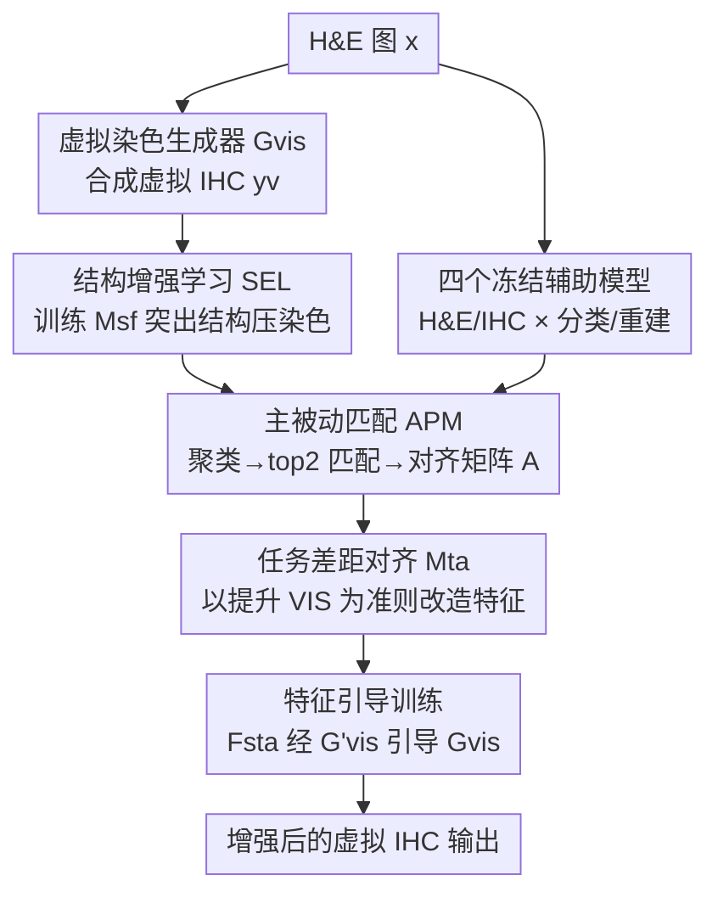

# Virtual Immunohistochemistry Staining with Dual-Aligned Multi-Task Feature Guidance

**会议**: CVPR 2026  
**论文**: [CVF Open Access](https://openaccess.thecvf.com/content/CVPR2026/html/Xie_Virtual_Immunohistochemistry_Staining_with_Dual-Aligned_Multi-Task_Feature_Guidance_CVPR_2026_paper.html)  
**代码**: https://github.com/U-RBook/VSMT  

**领域**: 医学图像 / 虚拟染色 / 图像生成  
**关键词**: 虚拟免疫组化染色, 多任务特征引导, 空间对齐, 任务差距对齐, 对比学习

## 一句话总结
把 H&E 病理图翻译成虚拟免疫组化（IHC）图时，配对图像之间天然存在空间错位、单一辅助任务监督又太弱；本文用一组辅助任务模型抽取多任务特征，先做空间对齐再做任务差距对齐（双对齐），把这些语义特征喂给虚拟染色生成器做特征级引导，在 BCI / MIST 两个公开数据集的 FID/KID/LPIPS 上稳定超过 7 个 SOTA。

## 研究背景与动机
**领域现状**：免疫组化（IHC）染色能特异性地标出 HER2、ER、PR、Ki67 等生物标志物，对癌症诊断很关键，但做一次 IHC 既贵又慢。于是出现了「虚拟 IHC 染色（Virtual IHC Staining, VIS）」——拿便宜的 H&E 染色图当输入，用生成模型合成出 IHC 风格的图。训练 VIS 一般要 H&E–IHC 配对图。

**现有痛点**：配对图不是同一张切片重复染（重染不现实），而是取相邻深度的两张相邻切片分别染色，于是切片形变 + 层间形态差异导致 H&E 和 IHC 在像素上**对不齐**。这种空间错位削弱了像素级监督，让模型很难同时保住组织形态、又准确还原染色分布。近期方法（TDKStain、PSPStain 等）的应对是：在虚拟 IHC 结果上挂一个**辅助任务**（如细胞密度估计、Pos/Neg 分类），逼真实图和虚拟图在该任务上保持一致。

**核心矛盾**：单一辅助任务监督太窄——比如细胞密度只约束了组织结构，对染色分布几乎没指导；而且这些方法只把辅助任务**接在生成结果之后**，完全没用上辅助任务模型内部学到的丰富病理语义特征。要想把多个辅助任务的**特征**直接拿来引导生成器，又卡在两道坎上：(1) H&E 与 IHC 配对特征之间的**空间错位**；(2) 辅助任务特征与虚拟染色特征之间的**任务差距**（训练目标不同，特征语义对不上）。

**本文目标 / 切入角度**：与其在结果层做一致性约束，不如在**特征层**做引导——引入一组辅助任务模型（H&E/IHC 各做分类 + 重建），把它们的多层语义特征对齐后直接注入生成器。为此设计「两阶段对齐」：先纠正空间错位，再桥接任务差距。

**核心 idea**：用「双对齐的多任务特征」做特征级引导——空间对齐用结构增强学习 + 主被动匹配生成对齐矩阵把真实 IHC 特征搬到虚拟 IHC 对应位置；任务对齐用一个以「能不能提升 VIS 性能」为训练准则的对齐模型，把多任务特征改造成生成器能直接用的引导信号。

## 方法详解

### 整体框架
框架用四个**冻结**的辅助任务模型抽特征：H&E 分类 $M_{hc}$、H&E 重建 $M_{hr}$、IHC 分类 $M_{ic}$、IHC 重建 $M_{ir}$（分类抓全局语义、重建抓细粒度结构纹理，互补）。整个流程分三段：

1. **空间对齐**：先用结构增强学习（SEL）训练一个结构-染色特征调制器 $M_{sf}$，压制染色噪声、突出结构；再对真实/虚拟 IHC 的增强特征各自聚类，用主被动匹配（APM）建立类别间的双射，最后在同语义类内算区域相似度，得到空间对齐矩阵 $A$，把真实 IHC 的多任务特征「重排」到虚拟 IHC 对应坐标。
2. **任务差距对齐**：把空间对齐后的 IHC 多任务特征和 H&E 多任务特征拼接，送进任务差距对齐模型 $M_{ta}$，用「加进生成器后能否降低虚拟染色损失」作为间接代理来训练它。
3. **双对齐特征引导训练**：把 $M_{ta}$ 产出的双对齐特征 $F_{sta}$ 加到生成器副本 $G'_{vis}$ 上，再用它作为稳定的引导信号去优化真正的生成器 $G_{vis}$。推理阶段只跑 $G_{vis}$，**零额外开销**。

第一、二步交替更新：先训练对齐模块拿到 $F_{sta}$，再用 $F_{sta}$ 引导 $G_{vis}$。

### 关键设计

**1. 结构增强学习（SEL）：用对比学习把「结构」从「染色」里拎出来**

直接拿真实/虚拟 IHC 特征去聚类匹配会被染色噪声带偏，因为训练初期虚拟图的染色还很不准。作者的观察是：虚拟 IHC 里**结构信息比染色更可靠**——组织形态在 H&E 里本就存在、又有 PatchNCE 这类损失约束，而染色得从零合成、变数大。于是设计结构-染色特征调制器 $M_{sf}$，用对比学习强化结构、抑制染色。具体对虚拟 IHC $y_v=G_{vis}(x)$ 构造两类样本：**结构保留变换** $T_{str}(\cdot)$（抖动 HED/RGB 通道均值方差、通道交换、轻微弹性形变、patch 旋转、随机擦除——扰染色保结构）得到正样本 $p_v$；**染色保留变换** $T_{stn}(\cdot)$（patch 内像素打乱、低通滤波、强弹性形变——毁结构保染色）得到负样本 $n_v$。三元组特征经 $M_{ir}$、$M_{sf}$ 提取并降分辨率后，用带 margin 的 InfoNCE 损失训练：

$$L_{mcl}(F_{yv},F_{pv},F_{nv}) = \frac{-1}{N}\sum_{j=1}^{N}\log\frac{e^{h(F_{yv}^j,F_{pv}^j)/\tau}}{e^{h(F_{yv}^j,F_{pv}^j)/\tau}+\sum_{k=1}^{N}e^{(h(F_{yv}^j,F_{nv}^k)-m)/\tau}}$$

其中 $h(\cdot)$ 是 MLP 映射后算余弦相似度，$\tau$ 是温度，$m$ 是 margin。margin 很关键：它防止 $M_{sf}$ 把染色信息**彻底丢掉**——因为随训练推进染色会越来越准，后期对匹配反而有用。这样得到的区域级表示更稳，为后续匹配打底。

**2. 主被动匹配（APM）：只在「可信类别」里建立区域对应，避开正区域的不确定性**

把结构增强特征 $F_{yr}=M_{sf}(M_{ir}(y_r))$、$F_{yv}=M_{sf}(M_{ir}(y_v))$ 各自做 K-means 聚成 $K=3$ 类（背景 / 阴性 / 阳性，源于组织学先验；真实与虚拟**独立聚类**以照顾域差异）。难点在于：阳性区域因生物标志物表达会发生剧烈外观变化，最难建模，VIS 在阳性区往往最不准，直接全局匹配会被这些不可靠相似度带偏。APM 的做法是**只信最稳的匹配**：固定虚拟类别顺序 $O_v=(c_v^1,c_v^2,c_v^3)$，遍历真实类别的所有排列，**主动**选 top-2 最相似的类对、剩下一对**被动**靠排除法配上：

$$O_r=\arg\max_{O_r\in \mathrm{Perm}(\{c_r^1,c_r^2,c_r^3\})}\sum \mathrm{top2}(s_1,s_2,s_3),\quad s_i=\mathrm{mean}(\{\mathrm{sim}(F_{yv}^j,F_{yr}^k)\})$$

拿到最优顺序后建立双射 $f:O_v\to O_r$。再在每个匹配类内算余弦相似度得到稀疏对齐矩阵 $A$，对 IHC 多任务特征 $F_{ym}=M_{ic}(y)\oplus M_{ir}(y)$ 做**块级加权求和** $F_{ya}=A\,\mathring{*}\,F_{ym}$（每行用 SparseMax 稀疏化并归一），把真实 IHC 区域按语义重排到虚拟 IHC 位置。这和全局最优传输（OT）的区别在于：OT 假设 L2 代价能跨区域刻画语义相似度，但在阳性区会失效；APM 只在语义一致的类内匹配，回避了这个不可靠假设。配套的重排一致性损失 $L_{rc}=\lVert\phi(A\,\mathring{*}\,F_{yr})-\phi(F_{yv})\rVert_2^2$ 进一步逼 $M_{sf}$ 产出结构稳健的特征。

**3. 任务差距对齐（$M_{ta}$）：用「能不能提升 VIS」当代理监督，间接桥接任务差距**

辅助任务特征和虚拟染色特征训练目标不同、存在任务差距，但这个差距**无法显式建模**。作者的巧思是用虚拟染色性能当间接代理：令 $F_{sta}=M_{ta}(F_{ya}\oplus F_{xm})$（$F_{xm}=M_{hc}(x)\oplus M_{hr}(x)$ 是 H&E 多任务特征），把 $F_{sta}$ 加到生成器副本 $G'_{vis}$ 上，**只有当任务差距被真正桥接时，$F_{sta}$ 才会降低虚拟染色损失**。于是直接拿这个性能反馈训练 $M_{ta}$：

$$\theta_{M_{ta}}=\theta_{M_{ta}}-\alpha\nabla L_{tvis}(x,y,y_v;\theta_{G'_{vis}})$$

训练时**冻结**原生成器 $G_{vis}$ 的参数，保证性能提升只来自 $F_{sta}$ 的注入。$L_{tvis}$ 含 LSGAN 对抗损失、CUT 的 PatchNCE、高斯金字塔损失，以及作者设计的语义保留损失 $L_{sp}$——后者用重建真实 IHC 的对齐特征 $A\,\mathring{*}\,F_{yr}$（而非 $M_{ta}$ 的输入）当监督，防止 $M_{ta}$ 退化成平凡重建。最终引导训练里，$G'_{vis}$ 因与 $G_{vis}$ 同架构同参数、又编码了对齐多任务信息，能当一个**稳定**的引导源（这在 GAN 框架里尤其值钱），引导损失 $L_g$（L2）拉近 $G_{vis}$ 的源特征与 $G'_{vis}$ 的目标特征，再加 $L_{std}$ 对齐 $y_v$ 与 $y$ 的标准差以提升对比真实感。

### 损失函数 / 训练策略
两步交替：第一步用 $L_{sf}=L_{rc}+\lambda_{se}L_{mcl}$ 训 $M_{sf}$，再用 $L_{tvis}$ 训 $M_{ta}$；第二步用 $L_{vis}=L_{adv}+L_{patchNCE}+\lambda_{gp}L_{gp}+\lambda_g\sum L_g(F_s^i,F_t^i)+\lambda_{std}L_{std}$ 引导 $G_{vis}$。推理阶段所有对齐模块都不参与，无额外计算开销。

## 实验关键数据

### 主实验
在 BCI（HER2）和 MIST（HER2/ER/PR/Ki67）两个公开 H&E–IHC 数据集上，用 FID/KID/LPIPS（分布与感知差异，越低越好）+ SSIM 评估，对比 7 个 SOTA。

| 数据集 | 指标 | 本文 | 之前最好 | 说明 |
|--------|------|------|----------|------|
| MIST-HER2 | FID↓ | **40.34** | 44.83 (SIM-GAN) | 分布更贴近真实 IHC |
| MIST-PR | FID↓ | **35.40** | 38.72 (PSPStain) | 同上 |
| MIST-Ki67 | FID↓ / KID↓ | **28.51 / 4.03** | 31.03 / 4.09 (SIM-GAN) | 双指标最优 |
| BCI-HER2 | FID↓ / KID↓ | **45.57 / 12.57** | 47.86 / 13.46 (PSPStain) | 跨数据集仍领先 |

四个标志物里三个在 FID/KID/LPIPS 全面领先，MIST-ER 上 FID 最优、KID/LPIPS 次优。SSIM 上部分方法更高，但作者指出 SSIM 对像素级对齐敏感，而配对 H&E–IHC 本就对不齐，因此 SSIM 不是 VIS 的可靠指标。

### 消融实验
| 配置 (MIST-HER2) | FID↓ | KID↓ | 说明 |
|------|------|------|------|
| baseline（无特征引导 FG） | 46.23 | 10.67 | 仅靠粗配对监督 |
| FG，无对齐 | 74.50 | 41.91 | 未对齐特征引入大量噪声，比 baseline 还差 |
| FG + 仅空间对齐 SA | 50.99 | 14.25 | 任务偏置特征把模型带偏 |
| FG + 仅任务对齐 TA | 44.60 | 7.59 | $M_{ta}$ 训练目标隐式压制了空间不一致特征 |
| 完整（FG+SA+TA） | **40.34** | **6.56** | 双对齐缺一不可 |
| w/o SEL | 44.59 | 8.01 | 聚类匹配变模糊 |
| w/o APM（换全局匹配） | 44.97 | 9.71 | 跨语义无关区域算相似度 |
| w/o SA + 用 OT | 43.72 | 8.88 | 全局 OT 受语义模糊区干扰 |

### 关键发现
- **直接用多任务特征会帮倒忙**：不做对齐的 FG（FID 74.50）反而远差于不用特征引导的 baseline（46.23），说明「对齐」才是特征引导能用的前提。
- **只做空间对齐还不够**：仅 SA（50.99）也劣于 baseline，因为任务偏置特征会把生成器拉向别的任务表示；而只做 TA 反而涨点，作者归因于 $M_{ta}$ 的训练目标会**顺带**抑制空间不一致特征。
- **APM 优于 OT**：在语义一致类内匹配比全局最优传输更稳（FID 40.34 vs 43.72），印证了「OT 的 L2 代价在阳性区不可靠」的动机。
- **辅助任务数量与类型**：去掉 H&E 语义引导、或只留分类任务（丢掉重建的细粒度结构线索）都会掉点，多任务互补确有必要。

## 亮点与洞察
- **把「不可建模的任务差距」转成「可优化的性能代理」**：任务差距没法显式度量，作者用「加进生成器后能否降损失」当间接信号，冻结原生成器保证增益只来自对齐特征——这套「用下游性能反推中间模块好坏」的思路可迁移到很多「特征/适配器对齐」场景。
- **结构 vs 染色的可靠性差异被显式利用**：先验认定虚拟图里结构比染色稳，用结构/染色双向数据增强造对比正负样本，把结构从染色里「蒸」出来再做匹配，针对病理图特性，很有画面感。
- **margin 的双刃作用讲清楚了**：margin 既推开染色信息、又不让它被彻底丢掉（后期染色变准对匹配有用），这种「留一手」的设计细节比一刀切更聪明。
- **推理零开销**：所有对齐模块只在训练用，部署只跑生成器，落地友好。

## 局限与展望
- **依赖 K=3 的组织学先验**：背景/阴性/阳性三类聚类是写死的，对某些标志物或更复杂组织结构可能不够，类别数自适应是自然的改进点。
- **训练 pipeline 偏重**：四个冻结辅助模型 + SEL + APM + $M_{ta}$ + 生成器副本，分阶段交替优化，训练复杂度和调参成本都不低，文中未给训练耗时。
- **SSIM 偏弱**：虽有「SSIM 对 VIS 不可靠」的解释，但结构保真度的客观证据仍偏定性，临床可用性还需病理医生评估或下游诊断任务验证。
- **代理监督的稳定性**：用虚拟染色性能间接训 $M_{ta}$，理论上可能受 GAN 训练波动影响，对超参 $\lambda$ 的敏感性未充分展开。

## 相关工作与启发
- **vs TDKStain / PSPStain（单辅助任务）**: 它们把单个辅助任务（细胞密度、分类）接在**生成结果之后**做一致性约束；本文用多个辅助任务、在**特征级**引导生成器，并显式解决空间+任务两种错位，监督信号更全也更深。
- **vs OT-based 方法（SIM-GAN 等）**: OT 做全局最优匹配，但假设 L2 代价能跨区域刻画语义相似度，这在染色剧变的阳性区失效；本文 APM 只在语义一致类内局部匹配，回避了不可靠假设，消融里 FID 40.34 优于 OT 的 43.72。
- **vs CUT / PatchNCE**: 本文复用 PatchNCE/CUT 的对比损失保结构，但额外引入双对齐多任务特征做语义引导，是对结构保真之上的语义增强。

## 评分
- 新颖性: ⭐⭐⭐⭐ 「双对齐多任务特征 + 用性能代理训练任务对齐模型」组合新颖，针对病理配对错位的痛点切得准。
- 实验充分度: ⭐⭐⭐⭐ 两数据集四标志物 + 7 个 SOTA + 多组消融（FG/SA/TA、SEL/APM、辅助任务数量、OT 对比）覆盖到位，缺训练成本与临床下游验证。
- 写作质量: ⭐⭐⭐⭐ 动机层层递进、两难点定义清晰，公式与模块对应明确；符号略密集。
- 价值: ⭐⭐⭐⭐ 推理零开销 + 跨数据集稳定领先，对降低 IHC 成本有实际意义，特征级引导思路可外推。

<!-- RELATED:START -->

## 相关论文

- [\[CVPR 2026\] Dual-Level Hypergraph Generation for Addressing Feature Scarcity in Whole-Slide Image Classification](dual-level_hypergraph_generation_for_addressing_feature_scarcity_in_whole-slide_.md)
- [\[CVPR 2026\] Cross-domain Dual-stream Feature Disentanglement for Brain Disorder Prediction with Sparsely Labeled PET](cross-domain_dual-stream_feature_disentanglement_for_brain_disorder_prediction_w.md)
- [\[CVPR 2025\] UNIStainNet: Foundation-Model-Guided Virtual Staining of H&E to IHC](../../CVPR2025/medical_imaging/unistainnet_foundation-model-guided_virtual_staining_of_he_to_ihc.md)
- [\[CVPR 2026\] MedGRPO: Multi-Task Reinforcement Learning for Heterogeneous Medical Video Understanding](medgrpo_multi-task_reinforcement_learning_for_heterogeneous_medical_video_unders.md)
- [\[CVPR 2026\] CURE: Curriculum-guided Multi-task Training for Reliable Anatomy Grounded Report Generation](cure_curriculum-guided_multi-task_training_for_reliable_anatomy_grounded_report_.md)

<!-- RELATED:END -->
