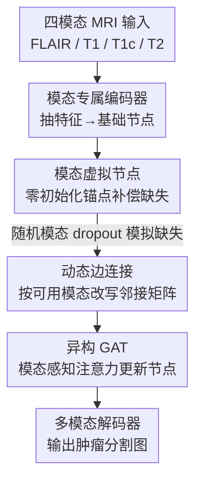

# Virtual Nodes Guided Dynamic Graph Neural Network for Brain Tumor Segmentation with Missing Modalities

**会议**: CVPR 2026  
**论文**: [CVF Open Access](https://openaccess.thecvf.com/content/CVPR2026/html/Tao_Virtual_Nodes_Guided_Dynamic_Graph_Neural_Network_for_Brain_Tumor_CVPR_2026_paper.html)  
**领域**: 医学图像  
**关键词**: 脑肿瘤分割, 缺失模态, 图神经网络, 虚拟节点, 动态图

## 一句话总结
把每个 MRI 模态当作图节点、给每个模态配一组零初始化的可学习"虚拟节点"，再用一套随可用模态动态改写邻接矩阵的图注意力网络做融合，从而用**单阶段训练**就能鲁棒地处理任意模态缺失下的脑肿瘤分割，在 BraTS-2018/2020 上几乎所有缺失子集都超过 SOTA。

## 研究背景与动机

**领域现状**：脑肿瘤分割临床上依赖四种 MRI 模态——FLAIR、T1、对比增强 T1（T1c）、T2，它们各自刻画不同的肿瘤子区域，互补使用才能精确分出增强肿瘤（ET）、肿瘤核心（TC）、整体肿瘤（WT）。主流分割网络（CNN / Transformer）都是在"四模态齐全"的假设下设计并训练的。

**现有痛点**：现实里经常采不全四个模态（成像损坏、采集协议、患者状态等），甚至训练阶段某些模态就不可用。一旦缺模态，这些为全模态优化的模型性能会断崖式下降。为应对缺失，已有方案要么给每种模态子集单独训一个定制模型（部署成本随模态数指数膨胀），要么训一个统一模型——但后者大多还得走**两阶段**：用知识蒸馏让全模态教师指导缺模态学生，或先训生成模型把缺的模态补出来。

**核心矛盾**：两阶段方案的根子在于 CNN/Transformer 这类**结构化架构的连接是预定义死的**——计算路径是为固定模态集写好的，强依赖完整的跨模态对应关系。一旦某个模态缺席，本该发生的特征交互就变得"病态"（ill-defined），于是只能靠额外阶段去补救。

**切入角度**：作者观察到，图结构天生就在"实际观测到的模态集合"上运算——每个模态是一个节点，缺模态就是缺节点/缺边，消息传递只在可用模态间发生。这种自适应连通性正好对得上缺失模态的本质。

**核心 idea**：把分割融合环节换成图：用**虚拟节点**补偿缺失模态的信息、用**动态边连接**让邻接矩阵随可用模态实时改写，再用**异构权重矩阵**让图注意力区分不同模态，从而在单阶段、即插即用的框架里隐式编码 $N$ 种模态组合配置。

## 方法详解

### 整体框架
输入是四模态 MRI 体数据，输出是肿瘤分割图。中间不再用 Transformer/CNN 做固定的跨模态融合，而是：先用各模态专属编码器抽特征并映射成"基础节点"，再为每个模态挂上一组零初始化的"虚拟节点"，把这些节点组成一张图；训练时用随机模态 dropout 模拟缺失，并据此动态改写邻接矩阵，让带异构权重的图注意力网络（GAT）只在合理的节点间传消息；最后把更新后的节点送进解码器输出分割。整套流程只训练一次（one-stage），推理时按缺失情况跳过对应编码器与图连接即可覆盖全部 $2^N-1$ 种组合。

### 关键设计

**1. 模态虚拟节点：给缺席的模态留一个"代理席位"**

缺模态最直接的麻烦是：那个模态对应的特征干脆没有了，结构化网络只能补零或靠生成模型硬造，前者丢信息、后者引入重建噪声还得多训一个网络。作者的做法是给每个模态 $m$ 配一组**可学习、零初始化**的虚拟节点 $p^m \in \mathbb{R}^{C_p \times F}$，把它和该模态由编码器得到的基础节点 $v^m$ 沿长度维拼接成扩展节点：

$$v^m_p = [v^m; p^m], \quad v^m_p \in \mathbb{R}^{P \times F}, \quad P = C + C_p$$

四个模态一共 $4 \times P$ 个节点。虚拟节点扮演**与模态无关的锚点**：它在图里和可用模态节点做消息传递，于是即便某个模态完全缺席，模型也能借助其他模态以及该模态自身的不变特征，给出一份稳定连贯的表征。零初始化 + 自学习（见损失部分）让这些锚点从"空白"逐步学到模态不变信息，而不是被人为约束成各模态的共享特征——后者会牺牲表征的丰富度。消融显示虚拟节点是贡献最大的组件，去掉后 ET 掉得最狠（66.0→62.3）。

**2. 动态边连接：邻接矩阵随可用模态实时改写，且信息单向流向缺失节点**

固定连通性在缺模态时会产生大量无效/噪声边。作者用 0/1 边 $e_{ij}$（表示从 $v_j$ 到 $v_i$ 的边）描述图拓扑，并定义全模态下的基线规则：同模态节点双向连、跨模态的对应节点也双向连；虚拟节点**只被本模态节点更新，但参与更新所有其他节点**。训练时随机 dropout 掉 0 到 $N-1$ 个模态。关键在于丢掉模态 $m$ 时的改写方式——对 $m$ 内的任一基础节点 $i$，切断它流向所有其他节点 $j$ 的边（$e_{ji}=0$），但保留流入它的边（$e_{ij}$ 不变）。这样信息就**单向地从存在的节点流向代表缺失模态的节点**：既能用其他模态特征加上该模态自身的不变特征去重建缺失表征，又避免重建噪声反过来污染现存模态。

为了让缺边（$e_{ij}=0$）不破坏梯度传播，作者没有把它们从计算图里直接删掉，而是给对应注意力权重赋一个极小值——软性屏蔽，既压制缺失模态的干扰又保持可微。本质上，这等价于在**一张统一图里隐式编码了 $N$ 种定制模型配置**：和"为每种组合单独训一个模型"目标一致，但只靠图的结构灵活性就在单阶段内做到了，推理时对任意组合都能泛化。

**3. 异构图注意力：让 GAT 区分"这是哪个模态"**

原始 GAT 为单模态设计，权重矩阵 $W$ 在所有节点间共享，无法刻画模态间差异。作者把 $W$ **异构化**——每个模态用自己的 $W_m$，注意力打分变为：

$$\beta_{ij} = a(W_m v^m_i, W_n v^n_j)$$

其中 $m, n \in \{\text{FLAIR, T1c, T1, T2}\}$。连注意力机制里的权重向量 $a$ 也按模态异构成 $a_m$，最终系数为

$$\alpha_{ij} = \frac{\exp\!\big(\text{LeakyReLU}(a_m[W_m v^m_i \,\|\, W_n v^n_j])\big)}{\sum_{k \in \mathcal{N}_i} \exp\!\big(\text{LeakyReLU}(a_m[W_m v^m_i \,\|\, W_{m_k} v^{m_k}_k])\big)}$$

只对 $e_{ij}=1$ 的邻居 $j$ 计算 $\beta_{ij}$，再 softmax 得权重，最后用多头注意力更新节点 $v'_i = \sigma\big(\frac{1}{K}\sum_{k=1}^{K}\sum_{j\in\mathcal{N}_i}\alpha^k_{ij} W^k_m v^m_j\big)$。这样注意力既感知节点内容、又感知模态身份，融合更贴合多模态场景。消融中去掉异构矩阵 ET 从 66.0 掉到 62.9，验证了模态感知的必要性。

### 损失函数 / 训练策略
骨干是 3D U-Net，其编码器复用为各模态特征提取器，解码器复用为单模态/多模态解码器（区别只在输出通道数：specific 解码器 1 通道、多模态解码器 4 通道）。训练时除了多模态解码器输出的分割图 $y^m$，还为每个模态特征接一个 specific 解码器输出 $y^s$ 做额外约束（缓解编码器与后续模型感知到的分布不一致、保障生成特征质量）。总损失对真值 $y$ 同时监督两类输出：

$$L_{total} = \sum_{i \in M} L(y^s_i, y) + L(y^m, y)$$

其中 $L$ 是 Dice 损失，$M=\{\text{FLAIR, T1c, T1, T2}\}$。虚拟节点采用自学习、不加显式跨模态对齐约束。specific 编码器只在训练用，推理时只靠多模态解码器出结果。训练用 Adam（初始 lr 0.0002 + 余弦衰减），batch size 1，1000 epochs，4×4090，输入随机裁剪到 $128^3$。

## 实验关键数据

### 主实验
在 BraTS-2018 / 2020 上评测，指标为 Dice 系数（DSC），分 ET / TC / WT 三个子区域，对所有 15 种缺失组合取均值。下表为各方法在全部模态组合上的平均 DSC（%）：

| 数据集 | 子区域 | U-HVED | mmFormer | M3AE | 最强 baseline | 本文 |
|--------|--------|--------|----------|------|---------------|------|
| BraTS-2018 | ET | 46.8 | 59.9 | 59.9 | 64.7 (MMCFormer) | **66.0** |
| BraTS-2018 | TC | 64.8 | 73.0 | 77.4 | 79.3 (MMCFormer) | **81.4** |
| BraTS-2018 | WT | 79.2 | 82.9 | 85.8 | 85.8 (MMCFormer) | **86.7** |
| BraTS-2020 | ET | 30.6 | 58.0 | 61.3 | 63.6 (LS3M) | **65.8** |
| BraTS-2020 | TC | 43.5 | 74.9 | 77.6 | 79.8 (LS3M) | **80.8** |
| BraTS-2020 | WT | 62.8 | 82.9 | 86.3 | 88.2 (LS3M) | **88.4** |

相比 2018 上最强的定制方法 MMCFormer，本文 ET/TC/WT 分别 +1.3 / +2.1 / +0.9，并在 15 种组合里 12 种拿到最佳。最亮眼的是**最关键模态 T1c 缺席时**（表中 5/7/9/12 行），ET 平均 +3.65、TC 平均 +4.3，说明模型对缺失关键信息有很强的补偿能力。此外其参数量显著小于现有 SOTA，且单个统一模型支持任意组合，而 MMCFormer 虽单模型轻量却要为每种缺失设置各训一个、参数随模态数指数膨胀。

### 消融实验（BraTS-2018，全组合平均 DSC %）
| 配置 | ET | TC | WT | 说明 |
|------|----|----|----|------|
| 完整模型 | 66.0 | 81.4 | 86.7 | — |
| w/o 虚拟节点 | 62.3 | 79.4 | 86.2 | 掉点最多，尤以 ET 显著 |
| w/o 动态连接 | 64.6 | 80.5 | 86.3 | 换成全连接静态图 |
| w/o 异构矩阵 | 62.9 | 80.9 | 86.3 | 退化为标准 GAT |

虚拟节点长度的敏感性（BraTS-2018，全组合平均）：

| 虚拟节点长度 | ET | TC | WT | Avg |
|--------------|----|----|----|-----|
| 0 | 62.3 | 79.4 | 86.2 | 75.9 |
| 16 | 65.4 | 80.9 | 86.6 | 77.6 |
| **32** | **66.0** | **81.4** | **86.7** | **78.0** |
| 64 | 63.3 | 79.6 | 86.6 | 76.5 |
| 128 | 63.1 | 78.4 | 86.5 | 76.0 |

### 关键发现
- **虚拟节点贡献最大**：去掉后掉点最猛，且集中在 ET——因为 ET 高度依赖 T1c，虚拟节点在补偿缺失关键模态上起核心作用。
- **虚拟节点不是越长越好**：长度 32 最优，再长反而显著下降。作者解释这反映了"从缺失输入能推断出的模态不变信息存在内在上限"——长度过大只会引入冗余/噪声、损害泛化，还增加显存和推理开销。
- **图建模 vs Transformer**：与 mmFormer 的唯一核心差别就是把 U-Net 编解码间的 Transformer 换成 GNN，性能提升直接归功于图对模态关系的建模优势；定性结果也显示仅有 T2 时本文比 mmFormer/M3AE 的红黄区域错位明显更少。

## 亮点与洞察
- **"缺模态 = 缺节点/缺边"的视角很干净**：把缺失从"需要补救的异常"重述为"图天然支持的运算状态"，从根上绕开了结构化网络两阶段补救的必要性，这是全文最 aha 的转译。
- **单向边设计很巧**：丢模态时只切"流出"、保留"流入"，让信息单向从现存节点灌进缺失节点的代理席位，既重建又不反向污染——一个 0/1 邻接矩阵的小改动就同时实现了补偿与隔离。
- **软屏蔽缺边保可微**：不删边而是给极小注意力权重，是个可直接复用到任意带 dropout 图结构的小 trick。
- **即插即用**：图接口套在编码器/解码器之间，理论上可嫁接到现有分割系统，作者也把"医学之外的缺模态任务"列为推广方向。

## 局限与展望
- **只在 BraTS 两个数据集、四模态脑肿瘤上验证**：模态数 $N=4$ 时图规模可控，模态数更多时 $2^N-1$ 组合与全连接图的开销如何随之增长，文中未给分析。
- **虚拟节点的"模态不变信息"偏黑箱**：自学习不加约束虽避免了僵硬对齐，但学到的锚点到底编码了什么、为何长度上限恰好在 32，缺乏可解释性探究。
- **部分组合仍非最优**：2018 上 3/15、2020 上更多组合未夺冠，作者称差距"临床可忽略（<1.5%）"，但缺统计显著性检验。
- **依赖随机 dropout 模拟缺失**：训练时所有模态其实都在，缺失靠置零模拟；与"训练阶段就真缺某模态"的更难设定是否一致仍待验证。

## 相关工作与启发
- **vs 定制方法（如 MMCFormer）**：定制法为每种模态组合训一个模型，部署成本指数膨胀；本文用动态连接在单一图里隐式编码 $N$ 种配置，目标相同但单阶段、参数远少。
- **vs 统一结构化方法（mmFormer 一阶段 / M3AE 两阶段）**：它们靠 CNN/Transformer + 随机 dropout 或知识蒸馏/生成补全，连接固定、对缺失模式敏感；本文换成在观测模态集上运算的图，连通性随可用模态自适应。
- **vs 重建式（GAN 合成 / 特征对齐）**：显式重建缺失模态难且常引噪声、要额外生成网络；本文用零初始化虚拟节点做隐式补偿，省掉生成分支。
- **vs 已有图启发方法（Yan 等超体素 GNN、Yang/Zhao 的图注意力融合）**：前者依赖超像素表征、损失模态特异性；后者只是把图算子塞进结构化架构，未显式定义缺失模态如何表示、信息如何在不同缺失模式下传播。本文把缺失模态交互直接做成即插即用的图接口，是建模形式和缺失建模方式上的双重区别。

## 评分
- 新颖性: ⭐⭐⭐⭐ "缺模态=缺节点"的图视角 + 虚拟节点 + 单向动态边组合得自然，虽各组件均有渊源但拼法新颖。
- 实验充分度: ⭐⭐⭐⭐ 两数据集全 15 组合 + 三种消融 + 长度扫描 + 效率/定性分析较完整，但只限 BraTS 四模态、缺显著性检验。
- 写作质量: ⭐⭐⭐⭐ 动机推导清晰、图示（Fig.1/2/3 + Algorithm 1）到位，公式略密但可读。
- 价值: ⭐⭐⭐⭐ 单阶段 + 即插即用 + 参数更省，对临床缺模态场景实用，且范式可推广到其他缺模态任务。

<!-- RELATED:START -->

## 相关论文

- [\[CVPR 2026\] Uni-Encoder Meets Multi-Encoders: Representation Before Fusion for Brain Tumor Segmentation with Missing Modalities](uni-encoder_meets_multi-encoders_representation_before_fusion_for_brain_tumor_se.md)
- [\[CVPR 2026\] PGR-Net: Prior-Guided ROI Reasoning Network for Brain Tumor MRI Segmentation](pgr-net_prior-guided_roi_reasoning_network_for_brain_tumor_mri_segmentation.md)
- [\[CVPR 2026\] CLoE: Expert Consistency Learning for Missing Modality Segmentation](cloe_expert_consistency_learning_for_missing_modality_segmentation.md)
- [\[CVPR 2026\] Virtual Full-stack Scanning of Brain MRI via Imputing Any Quantised Code](virtual_full-stack_scanning_of_brain_mri_via_imputing_any_quantised_code.md)
- [\[CVPR 2026\] Dynamic Stream Network for Combinatorial Explosion Problem in Deformable Medical Image Registration](dynamic_stream_network_for_combinatorial_explosion_problem_in_deformable_medical.md)

<!-- RELATED:END -->
