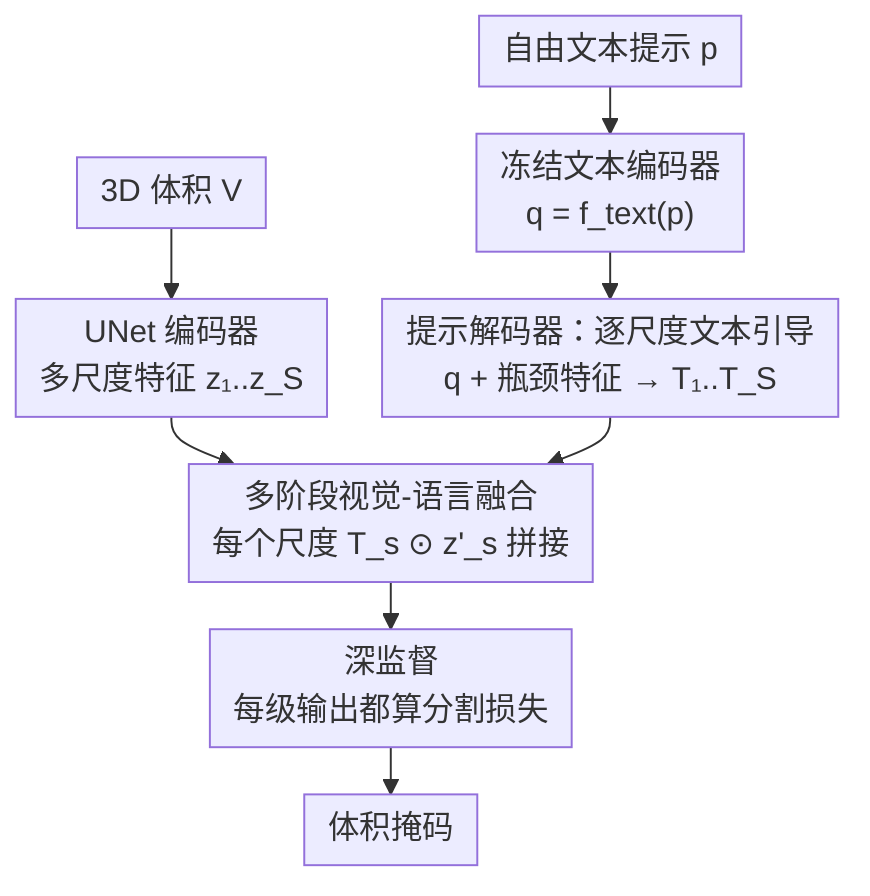

# VoxTell: Free-Text Promptable Universal 3D Medical Image Segmentation

**会议**: CVPR 2026  
**论文**: [CVF Open Access](https://openaccess.thecvf.com/content/CVPR2026/html/Rokuss_VoxTell_Free-Text_Promptable_Universal_3D_Medical_Image_Segmentation_CVPR_2026_paper.html)  
**代码**: https://github.com/MIC-DKFZ/VoxTell  
**领域**: 医学图像  
**关键词**: 3D医学分割, 文本提示分割, 视觉-语言融合, 开放集泛化, UNet

## 一句话总结
VoxTell 是一个 3D 视觉-语言分割模型，用一句话（单词到整段临床报告）作为提示就能直接生成体积掩码，靠在 UNet 解码器每一层反复注入文本引导（多阶段融合）+ 深监督，在 11 个未见数据集上零样本平均 Dice 70.85，远超此前最强文本可提示方法 SAT（51.23）。

## 研究背景与动机

**领域现状**：3D 医学图像分割长期被"专科模型"主导——一个模型只分一类器官或一种模态。SAM 范式带火了"通用分割"，MedSAM、SegVol 等把它搬到医学领域，但它们依赖点、框、涂鸦这类**手工空间提示**来指定目标。文本提示则是更自然的临床接口：医生可以直接用语言描述结构，甚至复用现成的放射报告，还能借助现代语言模型里编码的解剖学语义知识。

**现有痛点**：已有的文本引导医学分割模型（SAT、BioMedParse、SegVol 等）虽有进展，但本质上更像"用文本去选预定义掩码"的闭集多任务网络。它们①绑定固定标签集；②对措辞、同义词、拼写微小变化非常敏感；③几乎不在未见概念或未见模态上评测。结果是：从简单单词标签（"liver"）切换到临床描述性长句（"右肺实质内的钙化结节"）时性能急剧下滑——而这恰恰是语言理解最该发挥价值的场景。

**核心矛盾**：MaskFormer 系方法（SAT、Mask2Former 等）只在解码器**最后一层**做一次文本-图像融合（晚期融合）。这逼着图像主干学一套"与提示无关"的通用表征，直到最后一步才见到查询。一个共享的分割头滑过整个体积，根本无法适配"右肺里的病灶"这种**带空间定位**的查询。

**本文目标**：让模型真正解析任意自由文本，而不只是检索一个预定义掩码；并迈向开放集——能把结构化语言知识外推到相关但未见过的结构与模态。

**切入角度**：作者主张鲁棒的 3D 自由文本分割**需要在整个解码层级里反复进行跨模态交互**，而不是一锤子晚期融合。把文本嵌入在多个解码深度注入多尺度特征，语言与空间信息就能在解码全程持续对齐。

**核心 idea**：把 MaskFormer 的"单次晚期融合"扩展成贯穿解码器所有尺度的**多阶段视觉-语言融合 + 深监督**，并配一个超大规模、词表充分扩展的 3D 多模态训练集。

## 方法详解

### 整体框架

输入是一个 3D 体积 $V \in \mathbb{R}^{H \times W \times D}$ 和一段自由文本提示 $p$（单词、短语或整句临床描述），输出是该提示对应的体积分割掩码。整条管线分三步：①一个 UNet 式编码器把体积压成多尺度图像特征 $\mathcal{Z}=\{z_1,\dots,z_S\}$；②冻结的预训练文本编码器把提示编成向量 $q$，再经一个 transformer 提示解码器把 $q$ 翻译成**逐尺度**的文本引导张量 $\mathcal{T}=\{T_1,\dots,T_S\}$；③UNet 解码器从粗到细重建，在**每一个分辨率**都让对应的 $T_s$ 调制图像特征，并对每一级输出都加分割头做深监督。和 SAT/Mask2Former 只在末端做一次点积不同，VoxTell 把这种"文本调制图像"的操作复制到了解码器的每一层。

值得注意的是，作者刻意保留 UNet 式卷积主干而非全 transformer——因为在 3D 医学影像的大规模 benchmark 上 UNet 仍是 SOTA，把文本条件直接灌进它的多尺度特征图，能让提示影响中间表征而不只是输出层。

### 关键设计

**1. 多阶段跨尺度融合：把"晚期一次融合"摊到解码器每一层**

针对前面"晚期融合让主干学不到提示相关表征、共享分割头无法适配空间定位查询"的痛点，VoxTell 把 MaskFormer 的图文点积原理推广到**所有尺度**。提示解码器 $f_\text{prompt}$ 以文本向量 $q$ 为 query、瓶颈特征 $z_S$ 为 key-value，输出多尺度引导张量 $\mathcal{T}=f_\text{prompt}(q,z_S)=\{T_1,\dots,T_S\}$，每个 $T_s \in \mathbb{R}^{G \times C_s}$ 与对应解码尺度的通道维对齐，引导嵌入维度 $G=32$。在解码器第 $s$ 级，先把上一级上采样输出 $y_{s-1}^\uparrow$ 与编码器跳连 $z_s$ 拼接过卷积块：

$$z'_s = \text{ConvBlock}(\text{concat}(y_{s-1}^\uparrow, z_s))$$

然后沿通道维做 $z'_s$ 与 $T_s$ 的逐通道点积，把得到的 $G$ 个新通道拼回原特征：

$$y_s = \text{concat}\big(z'_s,\; T_s \odot z'_s\big), \quad y_s \in \mathbb{R}^{(C_s+G) \times H_s \times W_s \times D_s}$$

这样文本在每个分辨率都"摸"了一次图像特征，跨模态交互连续、多尺度。消融显示这一步是涨点主力：从单次晚期融合的 ~55 Dice 直接拉到 3 尺度 60.2、5 尺度 61.5。

**2. 深监督：逼解码器早期就吃进文本提示**

只在末端融合还有个隐患——文本引导可能"来得太晚"，前几级解码学到的还是无条件表征。VoxTell 给**每一级**中间解码输出 $y_s$ 都接一个分割头产生预测 $\hat{Y}_s$，对所有尺度求加权损失：

$$\mathcal{L} = \sum_{s=1}^{S} \lambda_s \, \mathcal{L}_\text{seg}(\hat{Y}_s, Y_s)$$

其中 $Y_s$ 是降采样到第 $s$ 尺度的真值，$\mathcal{L}_\text{seg}$ 是 Dice + 交叉熵组合，$\lambda_s$ 是尺度权重。这个约束强制初期解码阶段就把文本查询整合进去，生成的掩码更贴合输入提示。实验上深监督把 5 尺度的 61.5 进一步推到 62.6。

**3. 词表谐化与扩展：让模型抗同义词、拼写错误和长句**

文本可提示模型对措辞敏感，根因之一是训练标签太死板。VoxTell 在 158 个公开数据集、62K+ 体积、1087 个解剖/病理概念上训练，并专门做词表工程：先谐化标签语义、统一同义词、消解跨数据集歧义（比如"liver"是否含病灶）；再用大语言模型把标签空间扩展出解剖学上精确的变体（"right kidney"→"dexter kidney"）和层级聚合（把各根肋骨合成"rib cage"）。最终词表含 1087 个统一概念 + 9682 条改写标签，训练时按"以主术语为主"的策略采样。这套谐化+扩展，加上一个强预训练文本编码器（冻结的 Qwen3-Embedding-4B），让各种自然语言表述被映射到一致嵌入——这正是 VoxTell 在同义词/错拼下 Dice 几乎不抖、而基线大幅波动的来源。训练时还同时采样正提示和"图中不存在"的负提示。

### 损失函数 / 训练策略
分割损失为各尺度 Dice + 交叉熵的深监督加权和（公式见设计 2）。主干用 ResEncL（6 级编码器），文本编码器为冻结的 Qwen3-Embedding-4B，提示解码器是 6 层 transformer、query 空间 2048 维。最终模型在 64 张 A100 上以 batch size 128 训练约 6 天，SGD + 多项式衰减，初始学习率 $1\times10^{-4}$。消融在单张 A100、batch size 2 上做。

## 实验关键数据

评测刻意采用**仅在未见数据集（OOD 图像）上零样本评测**的严苛设定，覆盖 CT/MRI/PET，既含常见结构也含罕见病理。

### 主实验：11 个未见数据集零样本 Dice（Tab. 1，节选）

| 方法 | 腹部器官(CT) | 肺&气道(CT) | 肺肿瘤(PET) | 多发性硬化(MRI) | 肝病灶(CT) | 平均 Dice |
|------|------|------|------|------|------|------|
| BioMedParse | 9.12 | 0.00 | 2.73* | 9.57 | 41.25 | 12.91 |
| SegVol | 52.50 | 88.67 | 0.00* | 0.00* | 58.35 | 30.35 |
| BioMedParseV2 | 51.78 | 62.59 | 0.47 | 2.03 | 70.37 | 30.59 |
| SAT（次优） | 68.79 | 87.98 | 77.13 | 13.68 | 62.28 | 51.23 |
| **VoxTell** | **72.94** | **89.65** | **83.24** | **72.71** | **73.24** | **70.85** |

VoxTell 在 11 类里几乎全面领先，平均 Dice 70.85 比次优 SAT 高近 20 个点；在多发性硬化（72.7 vs 13.7）、肾上腺肿瘤等罕见病理上优势尤其悬殊，很多基线在未训练过的模态/病理上直接归零。

### 消融实验（Tab. 2，验证集，训练数据与文本编码器固定）

| 配置 | 融合阶段 | 深监督 | Dice |
|------|------|------|------|
| Mask2Former（晚期单次） | 1 | ✗ | 51.68 |
| MaskFormer / SAT 范式 | 1 | ✗ | 55.11 |
| Ours（3 阶段） | 3 | ✗ | 60.16 |
| Ours（5 阶段） | 5 | ✗ | 61.54 |
| Ours（+深监督） | 5 | ✓ | 62.55 |
| Ours（+batch 放大到 128） | 5 | ✓ | 69.43 |

### 其他关键结果

| 场景 | 指标 | 之前 SOTA | VoxTell |
|------|------|------|------|
| 跨模态-乳腺癌(PET) | Dice | SAT 58.26 | 72.27 |
| 未见概念-食管肿瘤(CT) | Dice | SAT 0.00 | 69.07 |
| ReXGroundingCT 实例级 | Dice | SAT 13.1 | 28.2 |
| ReXGroundingCT 实例级 | HIT5% | SAT 49.8 | 67.8 |
| 放疗队列报告级长句(203 例) | Dice | SAT 0.0 | 50.2 |

### 关键发现
- **多阶段融合是涨点主力**：从单次晚期融合（≤55.1）到 3/5 阶段融合直接 +5~6 个点（60.2/61.5），证明"在每个解码尺度反复对齐文本"远比末端一次点积有效。
- **深监督锦上添花**：在 5 阶段基础上再 +1.0（61.5→62.6），印证逼早期解码层吃文本能改善图文对齐。批量从 2 放大到 128 又带来一大跳（→69.4），说明架构与训练规模共同作用。
- **临床长句下的代差**：在真实放射报告的句子级提示上，VoxTell 50.2 Dice，而 SAT/BioMedParseV2/SegVol 几乎全军覆没（0.0/1.2/8.1）——尽管所有模型都见过肺肿瘤。这说明问题不在"见没见过类别"，而在能否解析带空间关系的描述性语言。
- **提示鲁棒性**：面对同义词、改写、错拼，基线 Dice 大幅波动甚至失效，VoxTell 几乎稳定不抖，得益于词表谐化扩展 + 强冻结文本编码器。

## 亮点与洞察
- **"把晚期融合摊薄到每一层"是个轻巧又有效的范式升级**：不改 UNet 主干、只在每个解码尺度加一次 $T_s \odot z'_s$ 的逐通道点积（仅增 $G=32$ 通道），就把文本-图像对齐从一次性变成全程持续，单这一步就涨 5~6 个 Dice。
- **词表工程被当成一等公民**：用 LLM 把 1087 概念扩成 9682 条改写标签（含拉丁同义词、层级聚合），把"抗措辞变化"从训练 trick 提升为系统设计，这是它在临床长句上拉开代差的隐形功臣。
- **评测设定本身就是贡献**：坚持只在 OOD 未见数据集上零样本评，还自建 203 例放疗队列用真实报告句子做提示，比"同分布 train/test split 刷分"诚实得多，更能暴露文本可提示模型的真实泛化力。
- **可迁移思路**：多尺度跨模态注入 + 深监督这套，对任何"条件信号要引导密集预测"的任务（如文本引导的自然图像分割、音频/布局条件生成）都值得借鉴——核心是别让条件信号迟到。

## 局限与展望
- **完全未见概念上方差大**：食管癌 69.1 但膀胱癌仅 25.8（Tab. 3），开放集泛化只是"迈出一步"，对潜空间外推差的结构仍不可靠，临床落地需谨慎。
- **依赖超大规模算力与数据**：62K+ 体积、64×A100、6 天训练，复现门槛极高；冻结文本编码器选型（Qwen3-Embedding-4B）也明显影响性能，迁移到其它语种/编码器需重新验证。
- **实例级仍偏弱**：ReXGroundingCT 上 Dice 仅 28.2、HIT5% 67.8，"从报告精确定位单个病灶"离临床可用还有距离，且需在该数据集上额外微调才比得过。
- **改进方向**：可探索把负提示采样、词表层级结构更显式地编进损失；或引入空间 grounding 模块强化"右上叶""胸膜接触"这类定位短语的解析。

## 相关工作与启发
- **vs SAT [238]**：同属 MaskFormer 范式、同样用医学文本编码器，但 SAT 只在高分辨率特征上做一次晚期点积融合；VoxTell 把融合推广到所有解码尺度 + 深监督，平均 Dice 从 51.2 提到 70.9，且在临床长句上 SAT 直接归零而 VoxTell 仍有 50.2。
- **vs SegVol [53] / MedSAM 等交互式范式**：它们靠点/框/涂鸦等空间提示，VoxTell 用纯自由文本，能复用现成放射报告、并借语言嵌入外推到未见结构，这是空间提示做不到的。
- **vs BioMedParse / BoltzFormer（V2）[236,237]**：2D 生物医学 Mask2Former 路线，词表受限（64 类）、晚期融合；VoxTell 是原生 3D、词表 1087 概念，跨模态与未见概念上全面领先。
- **vs CLIP-driven Universal Model / CAT [126,74]**：闭集"文本选分割头"范式，绑定训练类别无法纯靠文本泛化；VoxTell 直接把任意描述映射到掩码，朝开放集前进。

## 评分
- 新颖性: ⭐⭐⭐⭐ 多阶段跨尺度融合是对 MaskFormer 晚期融合的扎实而非颠覆性的升级，但配合词表工程整体很完整。
- 实验充分度: ⭐⭐⭐⭐⭐ 11 个 OOD 数据集 + 跨模态/未见概念 + 真实报告队列 + 系统消融，评测设定严苛且诚实。
- 写作质量: ⭐⭐⭐⭐ 动机推导清晰、公式完整，图表充分；部分细节压在附录。
- 价值: ⭐⭐⭐⭐⭐ 把临床报告直接变成 3D 分割提示，开源且涨点显著，对医学影像落地价值大。

<!-- RELATED:START -->

## 相关论文

- [\[ICCV 2025\] SegAnyPET: Universal Promptable Segmentation from Positron Emission Tomography Images](../../ICCV2025/medical_imaging/seganypet_universal_promptable_segmentation_from_positron_emission_tomography_im.md)
- [\[CVPR 2026\] R2-Seg: Training-Free OOD Medical Tumor Segmentation via Anatomical Reasoning and Statistical Rejection](r2-seg_training-free_ood_medical_tumor_segmentation_via_anatomical_reasoning_and.md)
- [\[CVPR 2026\] Revisiting 2D Foundation Models for Scalable 3D Medical Image Classification](revisiting_2d_foundation_models_for_scalable_3d_medical_image_classification.md)
- [\[CVPR 2026\] CG-Reasoner: Centroid-Guided Positional Reasoning Segmentation for Medical Imaging with a Robust Visual-Text Consistency Metric](cg-reasoner_centroid-guided_positional_reasoning_segmentation_for_medical_imagin.md)
- [\[CVPR 2026\] From Infusion to Assimilation Distillation for Medical Image Segmentation](from_infusion_to_assimilation_distillation_for_medical_image_segmentation.md)

<!-- RELATED:END -->
