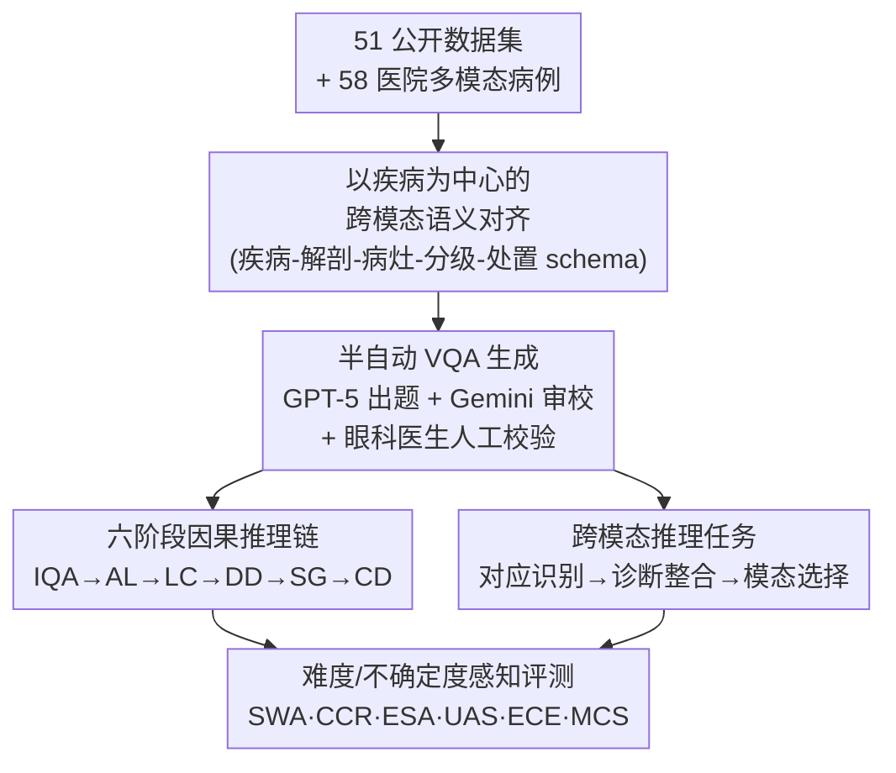

# X-PCR: A Benchmark for Cross-modality Progressive Clinical Reasoning in Ophthalmic Diagnosis

**会议**: CVPR 2026  
**论文**: [CVF Open Access](https://openaccess.thecvf.com/content/CVPR2026/html/Wang_X-PCR_A_Benchmark_for_Cross-modality_Progressive_Clinical_Reasoning_in_Ophthalmic_CVPR_2026_paper.html)  
**代码**: https://github.com/CVI-SZU/X-PCR  
**领域**: 医学图像 / 多模态VLM  
**关键词**: 眼科诊断, 渐进式临床推理, 跨模态对齐, 医学VQA, MLLM评测

## 一句话总结
X-PCR 把眼科诊断拆成"图像质量评估→解剖定位→病灶刻画→疾病诊断→严重度分级→临床决策"六个**带因果依赖**的推理阶段，并跨 6 种眼科成像模态做语义对齐，构建出含 26,415 张图、177,868 条专家校验 VQA 的 benchmark；对 21 个 MLLM 的评测显示它们在链式推理（最强 GPT-5 的全链完成率仅 24.47%）和跨模态整合上离专科医生差得很远。

## 研究背景与动机
**领域现状**：多模态大模型（MLLM）已经能读医学影像、生成诊断报告，GPT-5、Gemini-2.5-Pro 这类通用模型乃至 LLaVA-Med、MedGemma 等医学专用模型在各种医学影像任务上拿到了不错的分数。评测主流靠医学 VQA：病理（PathVQA、WSI-VQA）、内镜（EndoBench）、胸片（GEMeX）、通用域（SLAKE、PMC-VQA）等各自有 benchmark。

**现有痛点**：这些 benchmark 几乎都是**单模态、单轮**的孤立任务——给一张图问一个问题，答对就算分。即便 MedFrameQA、Rjua-Meddqa 开始引入多图聚合这种"渐进推理"，也仍然没有系统评估**多阶段临床推理**和**跨模态整合**。而真实临床恰恰两样都缺不了：诊断糖尿病黄斑水肿（DME）要把彩色眼底照（CFP）上的微动脉瘤、荧光造影（FFA）上的渗漏、OCT 上的视网膜结构改变**联起来**看。

**核心矛盾**：现有评测把"诊断能力"等同于"单点准确率"，但临床诊断的本质是一条**有逻辑顺序的推理链**——必须先定位病灶才能刻画它、先确诊才能分级——以及一种**跨模态证据综合**能力。把这两个维度拍平成准确率，就既测不出推理是否自洽，也测不出模型会不会"乱拼模态"。更糟的是，大多数 benchmark 只看准确率不看置信度，掩盖了模型"自信地答错"这种在高风险场景里致命的问题。

**本文目标**：造一个能覆盖**完整眼科诊断工作流**的评测框架，同时刻画三件事：渐进推理的逻辑依赖、跨模态临床对齐、难度分层 + 不确定度感知的可靠性评估。

**切入角度**：作者直接照搬眼科医生真实的诊断流程，把它形式化成六个阶段并**强制阶段间因果依赖**——下游阶段必须以上游验证过的输出为条件，这样就能测"误差会不会沿链传播""模型叙事是否自洽"这些以前测不了的东西。

**核心 idea**：用"六阶段因果推理链 + 六模态语义对齐 + 难度/不确定度加权评分"把眼科诊断从"孤立打分"升级为"端到端推理完整性"评测。

## 方法详解
X-PCR 是 benchmark 论文，所谓"方法"其实是**数据如何构建 + 评测协议如何设计**两件事。整体上它围绕一个"以疾病为中心"的数据底座，往上长出两条评测任务线（渐进推理链、跨模态推理），再配一套难度/不确定度感知的指标体系。

### 整体框架
底座是从 51 个公开眼科数据集 + 合作医院 58 例多模态病例汇集来的 26,415 张图、177,868 条 VQA，覆盖 52 种疾病、6 种成像模态。所有数据被组织进一个**以疾病为中心**的统一表示，再分别支撑两类评测：纵向的"六阶段渐进推理链"和横向的"跨模态临床推理"；最后用 6 个指标（SWA / CCR / ESA / UAS / ECE / MCS）从准确率和可靠性两面打分。

### 关键设计

**1. 六阶段因果推理链：把"孤立打分"变成"端到端推理完整性"**

针对"现有 benchmark 单轮孤立、测不出推理是否自洽"的痛点，X-PCR 把眼科诊断形式化为六个**严格按因果顺序**展开的阶段：① 图像质量评估（IQA），判断成像是否达到诊断标准、有没有失焦/光照/伪影，它**门控整条流水线**——不合格的图被重拍或降权，只有合格图才往下走，从源头防止误差传播；② 解剖定位（AL），先把视盘、黄斑、血管弓、周边视网膜定位出来，给后续病灶解读建立空间坐标系；③ 病灶刻画（LC），用规范临床术语（如"火焰状出血""棉绒斑"）描述病灶形态与分布，必须**锚定到 AL 给出的解剖区域**；④ 疾病诊断（DD），把前面观察综合成带证据的鉴别诊断排序；⑤ 严重度分级（SG），套用疾病专属量表（如 ICDR 糖网分级）量化进展，结论须与 DD 隐含的病理负荷一致；⑥ 临床决策（CD），把诊断转成可执行的治疗选择、转诊紧急度、随访计划。

关键在于这条链**强制逻辑依赖**：每个阶段都以上一阶段已验证的输出为条件（LC 依赖 AL、DD 依赖 LC、SG 依赖 DD、CD 由 DD+SG 推出）。这种"依赖感知"设计让评测能拆出三个以前测不了的属性——**纵向一致性**（下游结论是否顺着上游推出来）、**误差传播**（上游错多大程度拖垮下游）、**自洽性**（模型在各阶段的诊断叙事稳不稳）。对应的核心指标是阶段准确率 SWA 和**全链完成率 CCR**（六个阶段全对才算一条链完成），后者直接量化端到端推理的完整度。

**2. 跨模态语义对齐 + 三层跨模态推理任务：测模型"会不会把多模态证据拼对"**

针对"现有眼科数据各模态各看各的、缺疾病级语义对齐和同眼时间同步"的痛点，X-PCR 引入**以疾病为中心**的对齐框架，含两个设计：一是**标准化临床表示**，每种疾病用统一的"疾病–解剖–病灶–分级–处置"schema 定义，再配一张 `模态 × 证据` 矩阵明确各模态间的解剖锚点和术语映射；二是**时间对齐的多模态整合**，把同一只眼同期采集的图像在结构和语义上对齐成标准范例，并经六阶段 QA 流程校验跨模态叙事连贯、分级一致。比如 DME 病例里，对齐后的 CFP、FFA、OCT 共同支撑"病灶确认(阶段2/3)→确诊(阶段4)→分级(阶段5)→抗 VEGF 治疗(阶段6)"的链条。

在此之上把跨模态推理拆成**三层递进任务**：① 对应识别，跨配对模态连接语义等价的发现（如 CFP 黄斑隆起 ↔ OCT 浆液性视网膜脱离）；② 诊断整合，综合对齐后的多模态线索推出最可能诊断；③ 模态选择，当诊断不确定时推荐下一张最有信息量的影像（如用 ICGA 鉴别 CSC/VKH），体现临床里的"信息价值"权衡。三者形成流水线：对应识别供给对齐证据，整合做综合，残余不确定度触发模态选择。

**3. 难度与不确定度感知的评分体系：奖励校准、惩罚"自信答错"**

针对"只看准确率掩盖了模型过度自信"的痛点，X-PCR 配了两套指标。难度侧按临床训练阶梯把题目分成住院医（R）、主治（A）、专科（S）三档，对应基础识别、情境诊断、亚专科解读，每题再带一个临床重要度分（如漏诊致盲疾病的风险），由此定义阶段准确率 SWA、全链完成率 CCR、专家分层准确率 ESA。不确定度侧要求模型自报置信度（归一到 $[0,1]$），把回答分成"对且自信(CC)/对但不确定(CU)/错但不确定(IU)/错且自信(IC)"四类，每类给基础分后用难度–重要度权重聚合成 **不确定度感知分 UAS**——它奖励校准良好的置信、重罚高风险场景下的过度自信错误；再报 **期望校准误差 ECE**（10 个 bin 内置信度与实际准确率的差距）。两者合起来同时评"答得对不对"和"知不知道自己对不对"。

### 数据构建与质控
VQA 生成走半自动流水线：与眼科医生共同设计每阶段 2–10 个问题模板，干扰项从同属性名词里采样以保证语义相关。前五个阶段由 GPT-5 从数据集标签和病灶标注自动出题、Gemini-2.5-Pro 审校一致性，最后的临床决策阶段因为需要细粒度临床推理改由眼科医生**手工撰写**。随后医生给每个问题类型标难度（R/A/S）和临床重要度；20% 题目由第二位眼科医生独立复核，评分者一致性 $\kappa<0.8$ 的题进入仲裁达成共识，长期争议题直接剔除。低分辨率/重伪影的图不进 VQA 集而是留作不带质量标签的对抗样本。最终数据按真实患病率平衡常见病与罕见病，OCT(31%) 和 CFP(26%) 占多数 VQA。

## 实验关键数据

### 渐进推理链主结果（节选 Table 2，单位 %）
评测 6 商业 + 10 开源 + 5 医学专用共 21 个 MLLM，并与 23 名住院医/10 名主治/8 名专科医生对照。

| 模型 | IQA | CD | 阶段平均 | CCR | UAS | ECE↓ |
|------|-----|-----|---------|-----|-----|------|
| GPT-5（最强模型） | 98.90 | 54.71 | 76.24 | **24.47** | 74.32 | 0.062 |
| InternVL-32B（开源最强） | 94.35 | 43.22 | 70.14 | 0.92 | 64.46 | 0.086 |
| Qwen2.5-VL-72B | 93.13 | 47.06 | 69.15 | 13.77 | 66.37 | 0.075 |
| MedGemma-27B-IT（医学专用） | 90.03 | 45.32 | 65.21 | 0.06 | 61.74 | 0.087 |
| LLaVA-Med-7B | 50.94 | 27.12 | 39.60 | 0.00 | 37.05 | 0.096 |
| 主治医生 | 95.46 | 67.06 | 79.91 | 41.24 | 77.16 | 0.091 |
| 专科医生 | 97.80 | 70.97 | **82.85** | **62.48** | **90.63** | 0.063 |

### 跨模态评测（Table 3 单模态 + Table 4 多模态消融）

| 模型 | CFP | OCT | FFA | 单模态平均 | Group1(CFP/OCT) 多模态 |
|------|-----|-----|-----|-----------|----------------------|
| GPT-5 | 85.42 | 54.81 | 71.47 | 72.60 | 59.60（↓13.0） |
| Qwen3-VL-30B-A3B | 78.72 | 45.85 | 61.98 | 64.33 | 48.07（↓16.3） |
| MedGemma-27B-IT | 80.45 | 43.89 | 57.47 | 61.91 | 47.51 |

### 关键发现
- **商业模型领先，但全链完成率全线崩盘**：GPT-5 阶段平均最高（76.24%），但 CCR 仅 24.47%——意味着它在 **75% 以上**的病例里没能把六个阶段全做对；多数开源/医学模型 CCR 趋近 0。这说明模型"单步还行、整链不行"。
- **误差沿链单调放大**：所有模型阶段准确率从 IQA 一路跌到 CD，跨模型平均从 80.95% 掉到 40.37%；DD→SG 这一跳掉得最狠（–15.32%），是公认的瓶颈环节。
- **离专科医生差距巨大且体现在"整合"上**：没有任何模型超过主治（79.91%），全部低于专科（82.85%）。差距在全链完成率上最刺眼：GPT-5 的 24.47% vs 专科 62.48%，差 38.52 个点。难题（S-level）上 GPT-5 仅 62.92%，专科则 83.63%。
- **模态越多反而越差**：从单模态平均到多模态，GPT-5 掉 13 个点、Qwen3-VL-30B 掉 16 个点；从 2 模态到 4 模态准确率持续下降。OCT/FFA/ICGA 这类结构/造影模态对细粒度视觉解读要求最高，小模型在 OCT/FFA 上只有 20–40%。
- **跨模态整合是"假装在整合"**：模态消融的 MCS（去掉某模态后的准确率变化，>0 表示该模态有贡献）模式混乱——GPT-5 去掉 CFP/OCT 会掉分，但 Qwen3-VL-8B 去掉 OCT 反而**涨分**（MCS<0）。这种不一致 + 模态越多越差，证明现有 MLLM 并没真正学会综合多模态证据。

## 亮点与洞察
- **"强制因果依赖"是这篇最聪明的地方**：以往渐进推理 benchmark 各阶段独立打分，模型可以"蒙对终点却推理过程全乱"。X-PCR 让下游条件于上游验证输出，再用 CCR（全链全对率）一把抓——直接把"看似会诊断、实则不会推理"的模型现出原形（GPT-5 单步均分 76% 但全链仅 24%）。这个"链完成率"指标可迁移到任何多步推理评测。
- **把"不确定度"做进评分而非事后报告**：UAS 用四象限（CC/CU/IU/IC）+ 难度重要度加权，专门重罚"自信答错"，这对医疗等高风险落地比单纯准确率有意义得多；ECE 进一步量化校准。值得借鉴到自动驾驶、金融风控等任何"错得自信会出事"的评测。
- **模态消融 + MCS 揭穿"伪整合"**：用"去掉某模态后涨还是跌"来检验模型是否真在用这张图，比单看多模态准确率更犀利——它直接暴露了模型可能把额外模态当噪声。
- **以疾病为中心的对齐 schema 可复用**："疾病–解剖–病灶–分级–处置 + 模态×证据矩阵"这套结构化表示，是把零散公开数据缝成"同眼同期、跨模态语义对齐"病例的关键，思路能搬到其他多模态医学诊断（如肿瘤多序列 MRI）。

## 局限与展望
- **人类基线样本偏小**：住院医 23 / 主治 10 / 专科 8 人，专科组仅 8 人，作为"人类天花板"统计噪声不小；且医生 ECE 反而偏高（专科 0.063、主治 0.091），说明人类自报置信度也未必校准，UAS 的人机对比要谨慎解读。
- **前五阶段题目由 LLM（GPT-5）自动生成**：尽管有 Gemini 审校 + 20% 人工复核，用 GPT-5 出题来评 GPT-5 可能引入"出题者偏好"，对 GPT-5 系模型存在潜在有利偏差，作者未深入讨论这一循环风险。
- **多模态消融的医院病例极少**：Table 4 四组分别只有 22/18/14/4 例，Group 4 仅 4 例，MCS 上的正负号在这种样本量下波动很大，"去掉 OCT 反而涨分"等结论需更大样本确认。
- **只测"评测"不给"解法"**：论文定位是 benchmark，揭示了差距但没提供改进推理链/跨模态整合的训练方法；后续可基于这条因果链做过程监督或链式微调。
- **泛化到眼科以外未验证**：六阶段链和六模态对齐高度贴合眼科工作流，迁到病理、放射等其它科室是否成立尚待检验。

## 相关工作与启发
- **vs PathVQA / WSI-VQA / EndoBench 等单模态 VQA**：它们是单模态、单轮的孤立任务，X-PCR 第一次同时上了渐进推理链（PCR）、多模态整合诊断（MID）、不确定度感知（UA）、专家分层评测（EGE）四项（见 Table 1 全 ✓）。
- **vs MedFrameQA / Rjua-Meddqa**：这两者已引入多图聚合/多步推理，但 X-PCR 的区别在**强制阶段间逻辑依赖**——后续阶段必须用前序正确输出，从而评的是推理连贯性而非单纯多图问答。
- **vs EyePCR（同为眼科 PCR）**：EyePCR 聚焦眼科手术认知、单模态、21 万 VQA；X-PCR 覆盖完整诊断工作流、6 种成像模态、显式跨模态对应标注，定位是"诊断推理"而非"手术认知"。
- **vs RETFound / OphGLM 等眼科基础模型**：它们是单模态、孤立分类的模型本身，X-PCR 是评测框架，恰好暴露了这类单任务系统与临床所需链式跨模态推理之间的鸿沟。

## 评分
- 新颖性: ⭐⭐⭐⭐⭐ 首个把眼科诊断形式化为强因果依赖六阶段链 + 六模态语义对齐 + 不确定度加权评分的 benchmark，CCR/UAS/MCS 几个指标设计都有迁移价值。
- 实验充分度: ⭐⭐⭐⭐ 评了 21 个 MLLM + 41 名医生对照、跨模态/单模态/消融三套表很扎实，但医院多模态病例和人类基线样本偏小。
- 写作质量: ⭐⭐⭐⭐ 动机—设计—指标逻辑清晰，六阶段依赖讲得透；数据生成里的 LLM 自出题循环风险讨论不足。
- 价值: ⭐⭐⭐⭐⭐ 揭示了 MLLM 在端到端临床推理（GPT-5 全链仅 24%）和跨模态整合上的真实差距，对医疗 MLLM 研发是明确且高风险敏感的标尺。

<!-- RELATED:START -->

## 相关论文

- [\[AAAI 2026\] MedEyes: Learning Dynamic Visual Focus for Medical Progressive Diagnosis](../../AAAI2026/medical_imaging/medeyes_learning_dynamic_visual_focus_for_medical_progressive_diagnosis.md)
- [\[CVPR 2026\] Clinically-Grounded Counterfactual Reasoning for Medical Video Diagnosis](clinically-grounded_counterfactual_reasoning_for_medical_video_diagnosis.md)
- [\[CVPR 2026\] MedTVT-R1: A Multimodal LLM Empowering Medical Reasoning and Diagnosis](medtvt-r1_a_multimodal_llm_empowering_medical_reasoning_and_diagnosis.md)
- [\[CVPR 2026\] OmniBrainBench: A Comprehensive Multimodal Benchmark for Brain Imaging Analysis Across Multi-stage Clinical Tasks](omnibrainbench_a_comprehensive_multimodal_benchmark_for_brain_imaging_analysis_a.md)
- [\[CVPR 2026\] SurgCoT: Advancing Spatiotemporal Reasoning in Surgical Videos through a Chain-of-Thought Benchmark](surgcot_advancing_spatiotemporal_reasoning_in_surgical_videos_through_a_chain-of.md)

<!-- RELATED:END -->
