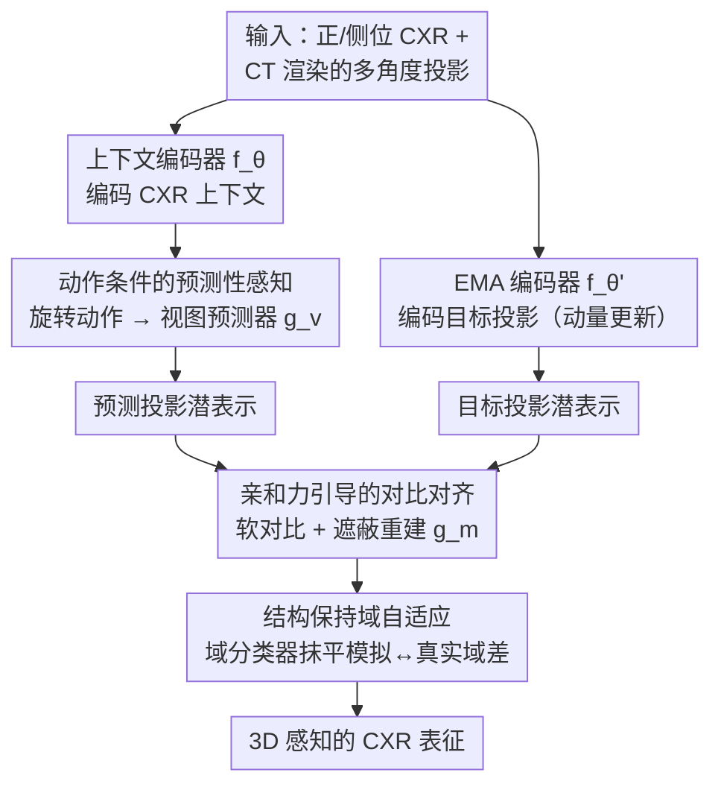

# X-WIN: Building Chest Radiograph World Model via Predictive Sensing

**会议**: CVPR 2026  
**arXiv**: [2511.14918](https://arxiv.org/abs/2511.14918)  
**代码**: 无  
**领域**: 医学图像  
**关键词**: 世界模型, 胸片表征学习, CT知识蒸馏, 对比学习, 域自适应  

## 一句话总结

提出 X-WIN 胸片世界模型，首次将 3D CT 空间知识融入 CXR 表征学习：通过学习预测 CT 在不同旋转角度下的 2D 投影来内化 3D 解剖结构，配合亲和力引导的对比对齐和结构保持域自适应，在 6 个 CXR 基准上通过线性探测取得 SOTA。

## 研究背景与动机

- **CXR 的本质局限**：2D 投影图像存在结构叠加，无法直接捕获 3D 解剖信息，限制了疾病诊断能力
- **CT vs CXR 的权衡**：CT 可获取 3D 结构但成本高、辐射大、可及性低，CXR 安全便宜但信息有限
- **放射科医生的启示**：放射科医生看到正面/侧面 CXR 时可以认知重建 3D 胸腔模型，辅助被遮挡结构的诊断
- **现有世界模型局限**：CheXWorld 仅学习 2D 局部结构和全局几何，不具备 3D 空间认知
- **核心思路**：如果模型能准确预测 CT 在任意旋转角度下的 X 射线投影，说明模型已内化了有意义的 3D 解剖结构

## 方法详解

### 整体框架

X-WIN 想让一个只看 2D 胸片的模型也具备 3D 空间认知，灵感来自放射科医生"看正侧位片就能在脑中重建三维胸腔"的能力。它是一个 JEPA 变体：上下文编码器 $f_\theta$ 吃常规正/侧位 CXR，EMA 编码器 $f_{\theta'}$ 吃多个目标投影并以指数移动平均更新，视图预测器 $g_v$ 在给定旋转动作的条件下去预测新投影的潜在表示，遮蔽预测器 $g_m$ 负责重建被遮挡的 patch token。核心假设是：如果模型能准确预测 CT 在任意旋转角下的 X 射线投影，它就已经内化了有意义的 3D 解剖结构。

### 关键设计

**1. 动作条件的预测性感知：用"预测旋转后投影"逼模型内化 3D 结构**

模型不直接回归 3D 特征，而是把"绕轴旋转 X 射线源"当作动作来预测对应投影。动作 $a_i = k \cdot \Delta\phi$ 定义射线源相对输入位置的偏航旋转角，约束在 $[-90°, 90°]$，每次随机采样 $N=8$ 个投影，最优步长 $\Delta\phi = 3°$（对应 60 个潜在投影）。预测表示由 $z_i^{\text{patch}} = g_v(\text{Linear}(a_i) \oplus (f_\theta(u_{\text{context}}) + \text{PE}))$ 给出——把动作编码与上下文特征拼起来送进预测器。要把不同角度的投影都预测对，模型就不得不在潜空间里建立起一致的三维表征。

**2. 亲和力引导的对比对齐：让同一 CT 的不同投影做软对比而非硬对齐**

标准 InfoNCE 用 one-hot 标签硬性区分正负样本，可同一 CT 的各个投影本就有丰富的解剖对应关系，硬对齐会抹掉这种结构。本文引入亲和力矩阵 $A$ 做软正则：

$$A_{ij} = \frac{\exp(\text{sim}(t_i, t_j)/\tilde{\tau})}{\sum_l \exp(\text{sim}(t_i, t_l)/\tilde{\tau})}$$

并把对齐损失写成 $\mathcal{L}_{\text{align}} = \mathcal{L}_{\text{InfoNCE}} + \lambda_{\text{affinity}} \mathcal{L}_{\text{affinity}}$，在保留对比学习区分力的同时，按投影间真实相似度温和地拉近相关表示，比纯硬对齐更贴合数据本身的几何关系。

**3. 结构保持域自适应：抹平"模拟投影 vs 真实 CXR"的域差**

从 CT 渲染出的模拟 CXR 和真实 CXR 在统计分布上有差异，直接训练会让表征偏向模拟域。本文在真实和模拟 CXR 上都做遮蔽图像建模（MIM）编码局部/上下文特征，并用域分类器 $f_c$ 学着区分真实/模拟域，再以域自适应损失

$$\mathcal{L}_{\text{domain}} = \frac{1}{N} \sum_{i=1}^{N} \|z_i^{\text{patch}} - t_i^{\text{patch}}\|_2^2 - \frac{1}{N} \sum_{i=1}^{N} \log f_c(z_i^{\text{patch}})$$

让投影预测既保持结构（前一项拉近预测与目标）又在统计上靠近真实域（后一项对抗域分类器）。消融显示它把跨域余弦相似度从 0.845 提到 0.967，是真实数据上能用的关键。

### 损失函数 / 训练策略

总损失把四项合在一起：$\mathcal{L}_{\text{overall}} = \mathcal{L}_{\text{align}} + \lambda_{\text{MIM}} \mathcal{L}_{\text{MIM}} + \lambda_{\text{domain}} \mathcal{L}_{\text{domain}} + \lambda_{\text{cls}} \mathcal{L}_{\text{cls}}$，分别对应对比对齐、遮蔽重建、域自适应与分类目标，由各自的 $\lambda$ 权衡。

## 实验关键数据

### 线性探测对比（AUROC）

| 模型 | 预训练数据 | VinDr | CheXpert | NIH-CXR | RSNA | JSRT | 平均 |
|------|-----------|-------|----------|---------|------|------|------|
| DINOv2 | LVD-142M | 0.795 | 0.776 | 0.711 | 0.798 | 0.559 | 0.728 |
| CheXFound | 987K CXR | 0.869 | 0.876 | 0.829 | 0.872 | 0.846 | 0.858 |
| Ark+ | 704K CXR | 0.906 | 0.876 | 0.831 | 0.893 | 0.807 | 0.863 |
| CheXWorld | 448K CXR | 0.903 | 0.871 | 0.833 | 0.824 | 0.791 | 0.844 |
| **X-WIN (ViT-L)** | **372K CXR+32K CT** | **0.925** | **0.908** | **0.843** | **0.929** | **0.857** | **0.892** |

平均 AUROC 0.892，超越所有 CXR 基础模型和视觉语言模型。

### Few-shot 微调（COVIDx, AUROC）

| 模型 | 4-shot | 8-shot | 16-shot | All |
|------|--------|--------|---------|-----|
| CheXFound | 0.823 | 0.883 | 0.897 | 0.977 |
| CheXWorld | 0.843 | 0.893 | 0.902 | 0.981 |
| **X-WIN** | **0.868** | **0.924** | **0.939** | **0.993** |

### 3D CT 重建能力

通过 VQ-GAN 解码器 + FDK 算法重建 3D CT 体积：
- 2D 投影 PSNR 30.23 dB, SSIM 0.888
- 3D 重建 PSNR 27.87 dB, SSIM 0.789

### 消融实验

- $\mathcal{L}_{\text{InfoNCE}}$ 单独即建立强基线
- $\mathcal{L}_{\text{MIM}}$ + $\mathcal{L}_{\text{InfoNCE}}$ 组合大幅提升
- 域自适应将余弦相似度从 0.845 提升到 0.967
- 直接旋转 > 步进式旋转；偏航旋转 > 三维欧拉角旋转

## 亮点与洞察

1. **医学影像世界模型的突破**：首次将 3D CT 空间知识融入 2D CXR 世界模型，"从 2D 到 3D 的跃迁"
2. **预测性感知设计巧妙**：通过预测旋转后的投影来内化 3D 结构，而非直接回归 3D 特征
3. **亲和力引导**：利用同一 CT 不同投影间的自然相关性做软对比，比 hard InfoNCE 更合理
4. **3D 重建能力验证**：能从 CXR 渲染投影并重建 CT 体积，证实模型确实学到了 3D 知识

## 局限性

- 依赖 DiffDRR 生成模拟投影，模拟-真实域差距仍是瓶颈
- 仅使用偏航旋转，未充分利用俯仰/翻滚维度
- 3D 重建结果仍有模糊，局部细节损失明显
- 训练需要 8×A100 40GB GPU，100 epochs，计算成本较高

## 评分

| 维度 | 评分 |
|------|------|
| 新颖性 | ⭐⭐⭐⭐⭐ |
| 实验 | ⭐⭐⭐⭐⭐ |
| 写作 | ⭐⭐⭐⭐ |
| 价值 | ⭐⭐⭐⭐⭐ |

<!-- RELATED:START -->

## 相关论文

- [\[CVPR 2026\] MRI Contrast Enhancement Kinetics World Model](mri_contrast_enhancement_kinetics_world_model.md)
- [\[CVPR 2026\] Building Robust Vision Encoders for Cross-Dataset Evaluation in Immunofluorescent Microscopy](building_robust_vision_encoders_for_cross-dataset_evaluation_in_immunofluorescen.md)
- [\[AAAI 2026\] PulseMind: A Multi-Modal Medical Model for Real-World Clinical Diagnosis](../../AAAI2026/medical_imaging/pulsemind_a_multi-modal_medical_model_for_real-world_clinical_diagnosis.md)
- [\[CVPR 2026\] Temporal Inversion for Learning Interval Change in Chest X-Rays](temporal_inversion_for_learning_interval_change_in_chest_x-rays.md)
- [\[CVPR 2026\] Beyond the Static-World: Lifelong Learning for All-in-One Medical Image Restoration](beyond_the_static-world_lifelong_learning_for_all-in-one_medical_image_restorati.md)

<!-- RELATED:END -->
