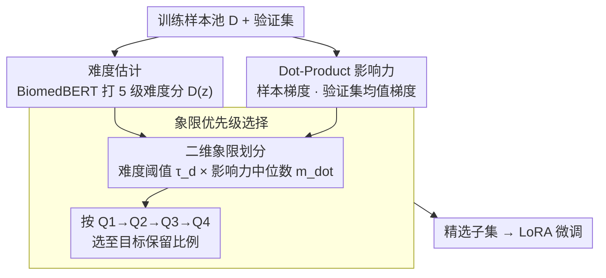

# Towards Efficient Medical Reasoning with Minimal Fine-Tuning Data

**会议**: CVPR 2026  
**arXiv**: [2508.01450](https://arxiv.org/abs/2508.01450)  
**代码**: [GitHub](https://github.com/mihara-bot/DIQ)  
**领域**: 医学NLP
**关键词**: 数据选择, 医学推理, 大语言模型, SFT, 梯度影响力

## 一句话总结

提出 Difficulty-Influence Quadrant (DIQ) 数据选择策略，联合考量样本难度和梯度影响力，使 VLM 语言骨干仅用 1% 精选数据即可匹配全量 SFT 性能，10% 数据则可超越全量训练。

## 研究背景与动机

将 LLM 适配到医学推理任务的标准做法是监督微调 (SFT)，但现有实践存在问题：

**数据冗余**：大规模数据集包含大量低质量/重复样本，计算成本高但性能提升有限

**单一维度选择的缺陷**：
   - 仅按**难度**选择 → 选到噪声过重、梯度信号弱的样本，训练不稳定
   - 仅按**梯度影响力**选择 → 偏好容易优化但推理链浅的简单样本
3. 这两个维度存在根本性张力，单独使用任何一个都不是最优

作者通过先导实验（在 FineMed 数据集上按难度-影响力分四个象限分别训练）发现：高影响力+低难度的 $\mathcal{Q}_2$ 数据比低影响力+高难度的 $\mathcal{Q}_3$ 数据训练效果更好，但推理质量更差——验证了"两全其美"需要同时高难度+高影响力的样本。

## 方法详解

### 整体框架

DIQ 将每个训练样本投射到二维空间：(1) **难度分数** — 模型无关，由 BiomedBERT 分类器在 5 级 Likert 量表上预测；(2) **影响力分数 (Dot)** — 模型相关，通过训练样本梯度与验证集均值梯度内积计算。基于这两维度划分四个象限，按优先级 $\mathcal{Q}_1 \to \mathcal{Q}_2 \to \mathcal{Q}_3 \to \mathcal{Q}_4$ 选取样本直到达到目标保留比例。最终用精选子集做 LoRA 微调。

### 关键设计

**1. 难度估计：用一个模型无关的分数把样本按推理深浅排开**

只按影响力选样本会偏向容易优化但推理链浅的简单题，所以需要一个独立的难度维度兜底。本文用在多个医学 QA 数据集上微调过的 BiomedBERT 分类器，从知识 (Knowledge)、推理 (Reasoning)、综合 (Overall) 三个角度评估难度，取其一作为标量分数 $D(z) \triangleq D_\phi(z)$，并以百分位阈值 $\tau_d$ 划分高/低难度。关键好处是这个分数与待训模型无关，算一次就能跨实验复用，不必每换一个模型就重算。

**2. Dot-Product 影响力：用梯度内积一阶近似"这条样本能让验证损失降多少"**

只按难度选又会选到噪声重、梯度信号弱的样本。影响力维度把训练样本 $z$ 的价值定义为它的梯度与验证集均值梯度的内积 $\text{Dot}(z) \triangleq g(z; \hat{\boldsymbol{\theta}})^\top \bar{g}_{\text{val}}(\hat{\boldsymbol{\theta}})$，其物理含义正是对验证集平均损失一步下降量的一阶近似 $\Delta \bar{\ell}_{\text{val}} = -\eta \cdot \text{Dot}(z) + O(\eta^2)$。实现上用 Johnson-Lindenstrauss 随机投影把梯度降到 4096 维，整体复杂度 $O(|\mathcal{D}_{\text{val}}| + |\mathcal{D}|)$，无需计算 Hessian，比 LESS 这类 TracIn 方法轻得多。

**3. 象限优先级选择：只挑"又难又有用"的那一象限打头**

先导实验发现"高影响力+低难度"的 $\mathcal{Q}_2$ 虽然 benchmark 分高，但推理质量差，单维度都不是最优。于是用难度阈值 $\tau_d$ 和影响力中位数 $m_{\text{dot}}$ 把数据切成四象限，让"高难度+高影响力"的 $\mathcal{Q}_1$ 最优先——它同时握有复杂临床推理和强梯度信号；各象限内按 Dot 降序排，Dot 相同再按难度降序打破平局。正是这种二维联合、而非任一单维度，让 1% 数据就能逼近全量 SFT。

### 损失函数 / 训练策略

- 使用 LoRA 微调（rank=8, 目标模块 QKV），学习率 $1 \times 10^{-4}$，余弦衰减，3 epochs
- 最大上下文长度 8192 tokens
- 验证集默认从每个下游任务随机抽取 20 个样本（共 180 个）
- DIQ 评分计算为一次性前期成本，可跨实验复用

## 实验关键数据

### 主实验

在 Huatuo 数据集上微调 Llama3.1-8B-Instruct，9 个 benchmark 平均：

| 数据量 | 方法 | AvgS ↑ | AvgC ↑ | AvgA ↑ |
|--------|------|--------|--------|--------|
| Full (19k) | — | 54.77 | 37.77 | 43.44 |
| 1% | Random | 51.31 | 33.47 | 39.42 |
| 1% | LESS | 54.97 | 33.32 | 40.54 |
| 1% | **DIQ** | **56.54** | **35.91** | **42.78** |
| 10% | Similarity | 54.13 | 35.53 | 41.73 |
| 10% | **DIQ** | **58.11** | **37.00** | **44.04** |

**1% DIQ 几乎匹配全量 SFT（42.78 vs 43.44），10% DIQ 超越全量 SFT（44.04 vs 43.44）。**

### 消融实验

| 选择策略 | AvgA (1%) | AvgA (10%) | 说明 |
|----------|-----------|------------|------|
| Influence only | ~41.89 | ~42.45 | 偏好简单样本 |
| Reasoning only | ~41.89 | ~43.16 | 最强单维度基线 |
| Knowledge only | ~41.05 | ~42.36 | 单维度偏差大 |
| **DIQ (完整)** | **42.78** | **44.04** | 双维度互补最优 |

### 关键发现

- **临床推理质量提升**：LLM-as-judge 评估显示 DIQ-1% 选出的数据在鉴别诊断 (DDx) 上比其余数据高 +0.80 分，安全检查 (SC) +0.35，证据引用 (EC) +0.46
- **效率分析**：DIQ 计算成本仅为 Llama3.1-8B 单次全量 SFT 的 1/1.85，且分数可复用
- 跨模型泛化：Llama 上计算的影响力分数迁移到 Qwen3 系列仍有效（6/9 场景有增益）
- 与 DPO 偏好学习兼容：1% DIQ + DPO 比全量 SFT + DPO 还高 1.00 AvgA
- 验证集 360-450 个样本即可稳定影响力排名

## 亮点与洞察

- **Less is More 的强力验证**：明确揭示数据选择中难度与影响力的张力，提供可操作的解决方案
- DIQ 框架简单高效：一次前向/后向 pass 计算梯度，无需 Hessian；随机投影降维保持排名
- 连接了数据选择与临床推理质量——DIQ 不仅提升 benchmark 分数，也提升推理对齐度
- 象限化选择策略直观且可解释

## 局限与展望

- 影响力分数在训练前一次性计算，未考虑训练过程中分数的动态变化
- 仅在 ≤32B 模型上验证，未在 70B+ 模型上测试
- 验证集的任务组成和分布可能影响 Dot 分数质量
- 难度分类器 (BiomedBERT) 本身的偏差可能传递到选择结果
- 虽标题涉及 VLM，实际实验主要是纯文本 LLM 微调

## 相关工作与启发

- 与 LESS (TracIn-based) 相比，DIQ 更简单高效（无需 Hessian），且融合了难度信息
- 「高难度+高影响力」象限优先的思想可推广到其他领域的数据选择
- 梯度内积作为样本价值度量简洁有效，已有坚实的理论支撑（一阶 Taylor 展开）

## 评分

- 新颖性: ⭐⭐⭐⭐ — 难度和影响力已有研究，但二维象限选择框架是新贡献
- 实验充分度: ⭐⭐⭐⭐⭐ — 9 个 benchmark、6 个数据集、多模型、完整消融+效率分析
- 写作质量: ⭐⭐⭐⭐ — 逻辑清晰，实验丰富，动机论证有先导实验支撑
- 价值: ⭐⭐⭐⭐ — 对医学 LLM 微调的实用性强，但标题中 VLM 部分验证不足

<!-- RELATED:START -->

## 相关论文

- [\[ACL 2026\] Eliciting Medical Reasoning with Knowledge-enhanced Data Synthesis: A Semi-Supervised Reinforcement Learning Approach](../../ACL2026/medical_nlp/eliciting_medical_reasoning_with_knowledge-enhanced_data_synthesis_a_semi-superv.md)
- [\[ACL 2026\] LinguIUTics at PsyDefDetect: Iterative Imbalance-Aware Fine-tuning of Qwen3-8B for Psychological Defense Mechanism Classification](../../ACL2026/medical_nlp/linguiutics_at_psydefdetect_iterative_imbalance-aware_fine-tuning_of_qwen3-8b_fo.md)
- [\[ACL 2025\] CheXalign: Preference Fine-tuning in Chest X-ray Interpretation Models without Human Feedback](../../ACL2025/medical_nlp/chexalign_preference_finetuning.md)
- [\[ICLR 2026\] MedAgentGym: A Scalable Agentic Training Environment for Code-Centric Reasoning in Biomedical Data Science](../../ICLR2026/medical_nlp/medagentgym_agentic_training_biomedical.md)
- [\[ACL 2026\] Dr. Assistant: Enhancing Clinical Diagnostic Inquiry via Structured Diagnostic Reasoning Data and Reinforcement Learning](../../ACL2026/medical_nlp/dr_assistant_enhancing_clinical_diagnostic_inquiry_via_structured_diagnostic_rea.md)

<!-- RELATED:END -->
