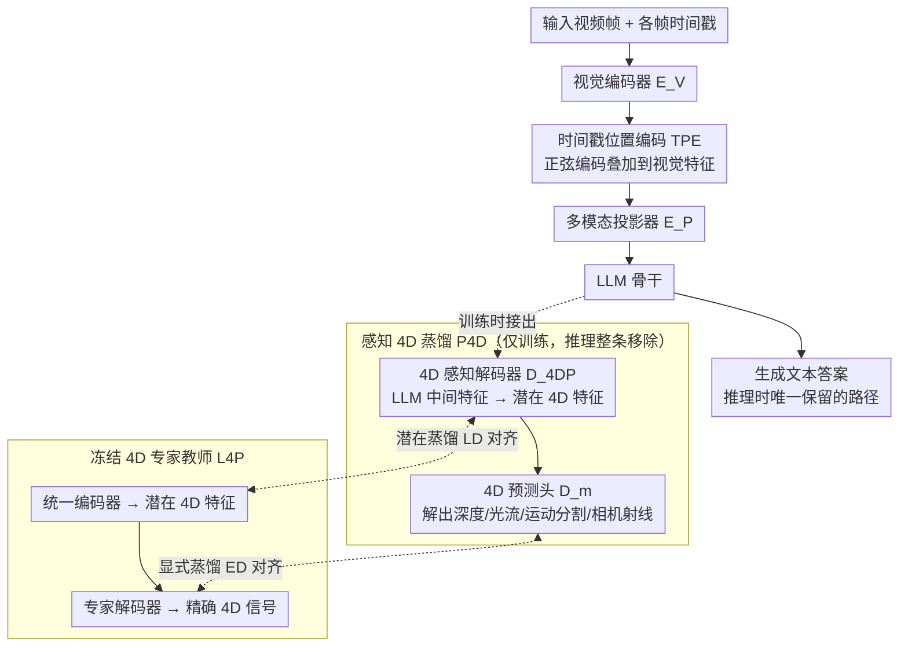

# 4D-RGPT: Toward Region-level 4D Understanding via Perceptual Distillation

**会议**: CVPR 2026  
**arXiv**: [2512.17012](https://arxiv.org/abs/2512.17012)  
**代码**: [GitHub](https://github.com/NVIDIA/4D-RGPT)  
**领域**: 模型压缩  
**关键词**: 4D理解, 区域级VQA, 感知蒸馏, 时间位置编码, 深度感知

## 一句话总结

提出4D-RGPT和感知4D蒸馏（P4D）框架，通过从冻结的4D感知专家模型中蒸馏深度和光流等知识到MLLM中增强4D感知，同时构建R4D-Bench——首个区域级4D视频问答基准。

## 研究背景与动机

尽管MLLM在视觉理解上取得了显著进展，但在需要精细3D结构和时间动态推理的任务上仍有不足。现有限制：

1. **弱4D感知**：现有SFT/RL方法仅通过文本监督优化，无法有效学习深度、光流等低级4D表示
2. **缺乏区域级提示**：现有3D/4D VQA基准要么没有区域提示，要么缺少动态场景——无法评估"特定区域在4D上下文中"的理解能力
3. **推理开销**：利用外部3D模型注入知识的方法（如VG-LLM）在推理时引入额外计算成本

核心洞察：4D感知（深度+光流+运动分割+相机射线）应作为MLLM的内在能力，通过训练时蒸馏获得，而非推理时依赖外部模块。

## 方法详解

### 整体框架

这篇论文想让 MLLM 真正"懂"4D——既能感知深度、3D 结构这些空间信息，又能感知物体随时间运动的动态信息，而且要落到具体区域上回答问题。难点在于：现有方法要么只靠文本监督，模型从没真正学过深度/光流这类低级 4D 表示；要么推理时挂一个外部 3D 模型来注入知识，又拖慢了速度。

4D-RGPT 的整体思路是把 4D 感知做成模型的**内在能力**，且只在训练时付出代价。视频帧先过 VLM 视觉编码器，编码器输出在送入 LLM 骨干前会叠上"时间戳位置编码"，让模型知道每一帧对应的真实时刻；LLM 骨干一边正常生成文本答案，一边额外接出一组训练专用模块——先用 4D 感知解码器（D_4DP）从 LLM 中间特征解出潜在 4D 特征，再用一组 4D 预测头（D_m）从中解出深度、光流、运动分割、相机射线这几种显式 4D 信号。训练时，这两层输出分别被一个冻结的 4D 专家教师 L4P 在潜在层和信号层上"对齐"，把教师的感知知识蒸进 MLLM。推理时，整条 4D 感知与蒸馏分支全部丢掉，只留标准 VLM 路径——所以增强了感知，却不增加任何推理开销。

### 关键设计

**1. 感知 4D 蒸馏（P4D）：让 MLLM 在训练时把 4D 感知学进骨干，而不是推理时外挂**

纯文本监督（SFT/RL）的问题是模型从没被直接告知"这块区域离相机多远、往哪个方向动"，它只能从答案文字里间接猜测 4D 结构。P4D 改成让一个冻结的 4D 感知专家 L4P 当老师，把它对深度、光流、运动分割、相机射线的判断蒸给 MLLM。蒸馏分两条分支互补：潜在蒸馏（ℒ_LD）对齐 MLLM 经 4D 感知解码器（D_4DP）从中间特征解出的潜在 4D 特征与教师的潜在表示，给的是抽象层面的引导；显式蒸馏（ℒ_ED）则让 MLLM 通过 4D 预测头进一步解出具体的深度图/光流图等显式信号，再去对齐教师输出的精确信号。两者缺一不可——只有潜在蒸馏，模型学到的是模糊的"感觉"；只有显式蒸馏，又缺少深层特征的统一约束（消融里 LD、ED 单独加都不如合用）。关键是，这套解码器和教师只在训练时存在，推理阶段整条分支被移除，所以 4D 感知是"白学"来的，零额外计算。

**2. 时间戳位置编码（TPE）：把帧间真实时间间隔显式告诉模型**

MLLM 默认只看到一串视觉 token，并不知道相邻两帧之间到底隔了 0.1 秒还是 1 秒。但像"这辆车的平均速度是多少"这类问题，本质上要用位移除以时间，模型不知道时间就无从算起。TPE 的做法很直接：把每帧的采样时间戳编码成正弦位置编码，加到该帧的视觉特征上，再一起送进多模态投影器。这样时间不再是隐含信息，而是和画面绑在一起进入 LLM。消融显示 TPE 在速度、加速度这类时间敏感任务上提升尤其明显，正印证了它补的就是"时间标尺"这一块。

**3. R4D-Bench：第一个把问题钉到具体区域上的 4D VQA 基准**

现有 3D/4D VQA 基准的盲区是——要么没有区域提示（只能问整张图的笼统问题），要么场景是静态的，没法考"某个特定区域在动态 4D 上下文里的行为"。R4D-Bench 不从头造题，而是从 STI-Bench 和 VLM4D 的非区域问题改造：先抽出问题里的实体关键词，用 GroundingDINO + SAM2 把对应物体分割出来，打上 SoM（Set-of-Marks）标记，再用 Qwen2.5-VL 把区域和问题匹配上，最后人工校验。最终得到 1517 个带区域提示的 VQA，分静态（维度测量/3D 定位/空间关系）和动态（计数/平移/旋转/速度/位移）两大类共 9 种任务。这条流程可复用，也是它能填补区域级 4D 评测空白的原因。

### 损失函数 / 训练策略

- 总损失 = SFT交叉熵损失 + 潜在蒸馏损失(ℒ_LD) + 显式蒸馏损失(ℒ_ED)
- 教师模型：L4P（冻结），提供depth/flow/motion/camray四种4D模态
- 训练数据：RoboFAC, SAT, VSTI-Bench训练集, Wolf
- 基线模型：NVILA-Lite-8B

## 实验关键数据

### 主实验（非区域基准）

| 基准 | NVILA基线 | 4D-RGPT | 提升 |
|------|----------|---------|------|
| STI-Bench | 33.8 | 37.6 | +3.8 |
| VLM4D | 46.5 | 52.7 | +6.2 |
| VSTI-Bench | 45.2 | 59.1 | +13.9 |
| 6基准平均 | - | - | +5.3 |

### R4D-Bench

| 方法 | 静态 | 动态 | 总平均 |
|------|------|------|--------|
| GPT-4o | 30.3 | 47.5 | 42.8 |
| NVILA-Lite-8B | 29.1 | 41.3 | 37.9 |
| 4D-RGPT-8B | 32.9 | 45.7 | 42.2(+4.3) |

### 消融实验

| 配置 | STI-Bench | R4D | 说明 |
|------|-----------|-----|------|
| 基线 | 33.8 | 37.9 | 无蒸馏 |
| + TPE | 35.5 | 39.8 | 时间感知 |
| + LD | 36.6 | 41.0 | 潜在蒸馏 |
| + ED | 36.9 | 41.5 | 显式蒸馏 |
| + LD + ED (P4D) | 37.6 | 42.2 | 完整方案 |

### 关键发现

- 潜在和显式蒸馏互补，缺一不可
- TPE在速度/加速度等时间敏感任务上贡献尤为显著
- P4D优于直接SFT 4D数据、拼接4D特征、4D位置编码等替代方案
- 蒸馏模块仅在训练时存在，推理完全无开销

## 亮点与洞察

- "训练时蒸馏，推理时免费"的设计范式优雅——增强感知但不增加推理成本
- 双分支蒸馏（潜在+显式）的设计比单一蒸馏更有效
- R4D-Bench填补了区域级4D VQA的空白，构建流程可复用
- 揭示了即使是GPT-4o在区域级4D推理上也仅42.8%，说明问题极具挑战性

## 局限与展望

- 教师模型L4P的质量直接影响蒸馏效果，教师模型的局限会传递给学生
- R4D-Bench基于现有基准转换而来，未从头设计原生4D区域问题
- 动态场景中速度/位移等数值估计仍不够准确
- 仅在8B模型上验证，更大模型可能有不同表现

## 相关工作与启发

- **vs SpaceR/ViLaSR**: RL方法通过文本奖励优化，无直接4D感知监督
- **vs VG-LLM/SD-VLM**: 推理时依赖外部3D模型；P4D训练时蒸馏，推理零开销
- **vs 3DRS**: 仅处理静态3D场景；P4D扩展到动态4D，包含光流和运动分割

## 评分

- 新颖性: ⭐⭐⭐⭐ 训练时4D蒸馏+区域级4D基准的组合创新
- 实验充分度: ⭐⭐⭐⭐⭐ 6个外部基准+自建R4D-Bench，消融完整，替代方案对比充分
- 写作质量: ⭐⭐⭐⭐ 方法图清晰，框架模块化，基准构建流程可复现
- 价值: ⭐⭐⭐⭐ 为MLLM的4D感知增强提供了高效且通用的框架

<!-- RELATED:START -->

## 相关论文

- [\[NeurIPS 2025\] 4DGCPro: Efficient Hierarchical 4D Gaussian Compression for Progressive Volumetric Video Streaming](../../NeurIPS2025/model_compression/4dgcpro_efficient_hierarchical_4d_gaussian_compression_for_p.md)
- [\[CVPR 2026\] PlanaReLoc: Camera Relocalization in 3D Planar Primitives via Region-Based Structure Matching](planareloc_camera_relocalization_in_3d_planar_primitives_via_region-based_struct.md)
- [\[CVPR 2026\] Understanding and Enforcing Weight Disentanglement in Task Arithmetic](understanding_and_enforcing_weight_disentanglement_in_task_arithmetic.md)
- [\[ICLR 2026\] Understanding Dataset Distillation via Spectral Filtering](../../ICLR2026/model_compression/understanding_dataset_distillation_via_spectral_filtering.md)
- [\[AAAI 2026\] Distillation Dynamics: Towards Understanding Feature-Based Distillation in Vision Transformers](../../AAAI2026/model_compression/distillation_dynamics_towards_understanding_feature-based_di.md)

<!-- RELATED:END -->
