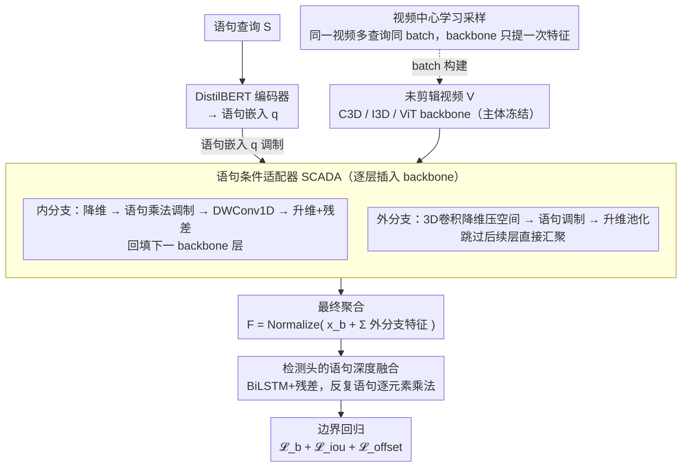

# A Paradigm Shift: Fully End-to-End Training for Temporal Sentence Grounding in Videos

**会议**: CVPR 2026  
**arXiv**: [2604.02860](https://arxiv.org/abs/2604.02860)  
**代码**: 即将开源  
**领域**: 模型压缩  
**关键词**: 时序语句定位, 端到端训练, 语句条件适配器, 视觉-语言对齐, TSGV

## 一句话总结
提出首个完全端到端的时序语句定位(TSGV)框架，通过语句条件适配器(SCADA)将语句嵌入注入视频backbone的中间层来动态调制视觉特征，配合视频中心学习策略加速训练，在Charades-STA和ActivityNet上超越SOTA。

## 研究背景与动机

**领域现状**：TSGV旨在根据自然语言查询定位未剪辑视频中的对应时间段。现有方法大多采用预训练的视频编码器（如C3D/I3D）冻结提取特征，然后仅训练定位模块。

**现有痛点**：(1) 视频backbone训练用于视觉分类，但用于TSGV——存在任务不匹配；(2) 预训练模型仅学习了短语级的物体/动作，难以理解复杂自然语言语义；(3) 部分方法在定位阶段未利用语句特征，跨模态对齐不充分。

**核心矛盾**：冻结backbone→特征无法适配TSGV任务→定位精度受限。但直接微调大backbone→内存开销大且易灾难性遗忘。

**切入角度**：设计轻量适配器，在微调极少参数的前提下实现backbone的语句条件化。

**核心idea**：SCADA通过内外双分支将语句嵌入注入backbone各层，实现语句导向的视觉特征提取；视频中心学习策略让同一视频的多个查询共享特征提取。

## 方法详解

### 整体框架
这篇论文要解决的是：以往的时序语句定位（TSGV）几乎都把视频 backbone 冻住，只训后面的定位模块，导致视觉特征跟"按语言找片段"这件事根本不匹配。本文把整条链路打通成端到端训练——语句先用 DistilBERT 编码成嵌入，视频送进 backbone（C3D / I3D 或 ViT）逐层提特征，但 backbone 不再是黑盒：每层之间插入 SCADA 适配器，让语句嵌入在特征还在 backbone 内部时就参与调制，提出语句导向的视觉表示；之后这些特征过最终聚合，再交给一个带语句调制的 BiLSTM 检测头，最终回归出时间边界。训练时用视频中心学习把同一视频的多条查询凑到一个 batch，backbone 只提一次特征。整条 pipeline 中真正被训练的只有适配器和检测头，backbone 主体冻结，所以既拿到了端到端的收益，又控住了显存和遗忘。

### 关键设计

**1. 语句条件适配器 SCADA：让语句在 backbone 内部就介入特征提取，而不是等特征出来再对齐**

痛点在于，冻结的 backbone 是为视觉分类预训练的，它提的特征里只有"这是什么物体/动作"，没有"这段画面跟当前这句话有没有关系"。直接全量微调大 backbone 又会撑爆显存、还容易灾难性遗忘。SCADA 的做法是在 backbone 各层之间插一个轻量旁路，用当前语句嵌入去调制流经的视觉特征，且只训这一小撮适配参数。它分内外两条分支：内分支（Inner）先把特征降维，做语句乘法调制，再用深度可分离 1D 卷积捕捉时间上下文，最后升维加残差，结果回填给下一 backbone 层——这样语句语义会逐层渗透到 backbone 内部；外分支（Outer）则用 3D 卷积降维并压缩空间维度，同样做语句调制后再 3D 卷积升维、空间池化，它的输出不回 backbone，而是跳过后续层直接汇聚到最终表示。两条分支聚合成

$$F = \text{Normalize}\Big(x_b + \sum_{i=1}^{n} x_{outer}^i\Big)$$

其中 $x_b$ 是 backbone 主干特征，$x_{outer}^i$ 是各层外分支提取的查询引导特征。这样既让每层 backbone 都"带着问题看视频"（内分支），又显式收集了多尺度的语句相关线索（外分支），而代价只是训练少量适配器参数。

**2. 视频中心学习策略：把"同一视频被反复喂进 backbone"的冗余消掉**

端到端训练最大的成本来自 backbone 前向，而 TSGV 数据集天然是"一个视频配多条语言查询"。标准采样按 query 随机组 batch，同一视频会在不同 iteration 里被 backbone 重复提一遍特征，纯属浪费。视频中心采样改成把同一视频的所有查询分到同一个 mini-batch，backbone 对这个视频只提一次特征，再共享给该视频的多条查询。这不只是省算力——它还逼着网络在单次迭代里，把同一段视频同时对齐到多种语言上下文，相当于免费多了一层跨语境的对齐监督。

**3. 检测头的语句深度融合：定位阶段也不让语句缺席**

部分旧方法在定位阶段已经丢掉了语句信息，跨模态对齐只发生在前端。本文的检测头用带残差连接的 BiLSTM 建模时间依赖，并在检测过程中反复用逐元素乘法把语句嵌入注入进来，让两个模态一直深度耦合到边界预测这一步，而不是早早分家。

### 损失函数 / 训练策略
总损失为 $\mathcal{L} = \mathcal{L}_b + \mathcal{L}_{iou} + \mathcal{L}_{offset}$：$\mathcal{L}_b$ 是边界概率损失（用正负平衡的 BCE 缓解前景片段稀少的不均衡），$\mathcal{L}_{iou}$ 同时含分类项与 L2 回归项来对齐预测与真值区间的重叠度，$\mathcal{L}_{offset}$ 用 Smooth L1 回归边界偏移。

## 实验关键数据

### 主实验

| Backbone | 方法 | Charades R1@0.5 | Charades R1@0.7 | ActivityNet R1@0.5 | ActivityNet mIoU |
|----------|------|-----------------|-----------------|--------------------|----|
| C3D | MS-2D-TAN | 41.10 | 23.25 | 46.16 | - |
| C3D | APGN | 48.20 | 29.37 | - | - |
| C3D | **Ours** | **50.44** | - | - | - |
| I3D | PGSR等 | ~53 | ~30 | ~48 | ~48 |
| I3D | **Ours** | **Rank1最优** | **Rank1最优** | **领先** | **领先** |

Charades-STA: R1@0.5 = **48.1%**(ViT), ActivityNet: R1@0.5 = **30.5%**。

### 消融实验

| 配置 | Charades R1@0.5 | 说明 |
|------|-----------------|------|
| 冻结backbone(基线) | 基准 | 标准冻结范式 |
| 端到端全微调 | +大幅提升 | 验证E2E的有效性 |
| + SCADA | +进一步提升 | 语句条件化的价值 |
| + 视频中心学习 | 训练加速 | 减少冗余计算 |
| 无外分支 | 有下降 | 多尺度特征重要 |
| 无内分支 | 有下降 | 逐层调制重要 |

### 关键发现
- 端到端训练相比冻结baseline带来**平均16%的提升**（跨不同backbone和数据集一致）
- SCADA在I3D backbone上将Charades R1@0.5从~38提升到~53，提升显著
- ViT作为视频编码器在TSGV中的潜力首次被充分挖掘
- 视频中心学习让训练速度提升数倍（具体取决于每视频查询数）

## 亮点与洞察
- **端到端范式的系统性验证**：首次跨C3D/I3D/ViT-S/B/g多种backbone系统验证了端到端训练对TSGV的巨大价值，推翻了"冻结backbone足够"的默认假设
- **SCADA的设计巧妙**：双分支结构让语句信息既影响backbone内部（内分支）又产生跳跃连接（外分支），在极少参数下实现深度跨模态融合
- **视频中心学习的实用性**：利用TSGV数据集"一视频多查询"的天然特性，是一个低开销高回报的工程优化

## 局限与展望
- 当前仅在Charades-STA和ActivityNet两个数据集上验证，更多数据集（如TACoS、DiDeMo）有待探索
- SCADA的插入位置和数量是手动设定的，能否自动搜索最优配置？
- 与Video LLM方法(如D2VLM R1@0.5=50.30)的对比还不够全面
- ViT backbone的训练时间和显存开销未详细报告

## 相关工作与启发
- **vs 2D-TAN/APGN等**: 它们冻结backbone仅训练定位模块，本文证明E2E训练是更优范式
- **vs Video LLMs**: LLM方法通过时间敏感的指令微调预测时间戳，本文不依赖LLM但在部分指标上可比
- **vs 其他adapter方法**: LoRA等通用适配器不考虑语句条件化，SCADA专为跨模态任务设计

## 评分
- 新颖性: ⭐⭐⭐⭐ SCADA设计有新意，E2E范式虽非首创但系统验证有价值
- 实验充分度: ⭐⭐⭐⭐ 多backbone、消融充分，但数据集覆盖可更广
- 写作质量: ⭐⭐⭐⭐ 动机清晰、方法描述完整
- 价值: ⭐⭐⭐⭐ 为TSGV领域提供了新的训练范式参考

<!-- RELATED:START -->

## 相关论文

- [\[ICML 2026\] End-to-End Compression for Tabular Foundation Models](../../ICML2026/model_compression/end-to-end_compression_for_tabular_foundation_models.md)
- [\[ICML 2026\] Towards Resource-Efficient LLMs: End-to-End Energy Accounting of Distillation Pipelines](../../ICML2026/model_compression/towards_resource-efficient_llms_end-to-end_energy_accounting_of_distillation_pip.md)
- [\[CVPR 2026\] Mitigating The Distribution Shift of Diffusion-based Dataset Distillation](mitigating_the_distribution_shift_of_diffusion-based_dataset_distillation.md)
- [\[CVPR 2026\] CORE: Compact Object-centric REpresentations as a New Paradigm for Token Merging in LVLMs](core_compact_object-centric_representations_as_a_new_paradigm_for_token_merging_.md)
- [\[CVPR 2026\] HTTM: Head-wise Temporal Token Merging for Faster VGGT](httm_head-wise_temporal_token_merging_for_faster_vggt.md)

<!-- RELATED:END -->
