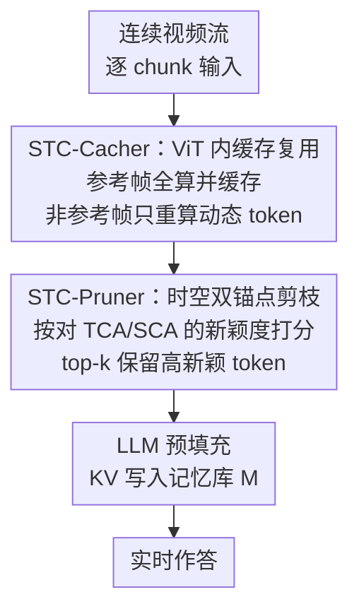

# Accelerating Streaming Video Large Language Models via Hierarchical Token Compression

**会议**: CVPR 2026  
**论文**: [CVF Open Access](https://openaccess.thecvf.com/content/CVPR2026/html/Wang_Accelerating_Streaming_Video_Large_Language_Models_via_Hierarchical_Token_Compression_CVPR_2026_paper.html)  
**代码**: https://github.com/lern-to-write/STC  
**领域**: 模型压缩 / 视频理解  
**关键词**: 流式视频理解, Token 压缩, ViT 缓存复用, KV 预填充加速, 即插即用

## 一句话总结
针对流式视频大模型（streaming VideoLLM）实时部署慢的问题，提出即插即用的两级 token 压缩框架 STC：STC-Cacher 在 ViT 编码阶段缓存并复用相邻帧的静态特征、只重算动态 token，STC-Pruner 在进 LLM 之前用「时空双锚点」剪掉冗余 token，在 ReKV 上保留约 99% 精度的同时把 ViT 编码延迟降 24.5%、LLM 预填充延迟降 45.3%。

## 研究背景与动机

**领域现状**：VideoLLM 在视频理解上表现强劲，而直播解说、AR 眼镜等场景催生了「流式视频理解」（Streaming Video Understanding, SVU）的需求——模型要持续吃进连续到达的视频帧、并以最小延迟实时作答。现有做法主要靠两条路提速：token 压缩（在进 LLM 前或 LLM 内部减少视觉 token）和 KV cache 压缩（解码时驱逐不重要的 KV 对）。

**现有痛点**：这些方法几乎都把优化重心放在 LLM 侧，却忽略了流式场景真正的瓶颈在**视觉编码器 ViT**。流式视频需要更密的采样（论文用 0.5fps），每一帧都要独立过一遍 ViT，重复的 ViT 前向直接主导了「token 还没进 LLM 之前」的延迟。论文实测：在视频理解中 ViT 编码耗时是图像理解的 2-3 倍；LLaVA-OV 处理 32 帧视频会产生 $32\times196=6272$ 个视觉 token 灌进 LLM 做预填充，而图像任务通常只有约 1900 个——三倍多的序列长度直接拖慢延迟。

**核心矛盾**：流式场景有两个特性让现有压缩策略失效。其一是**编码阶段的时间冗余**：相邻帧画面几乎相同，论文测得流式视频在 ViT 深层（如第 20 层）相邻帧特征的余弦相似度高达 0.85，而离线视频只有 0.60，可大多数压缩方法只在最终 token 表示上动手、根本不碰 ViT；少数像 ToMe 那样在 ViT 层内做 token 合并的方法又会破坏编码、掉点明显。其二是**因果约束**：流式下模型既看不到完整视频、也提前不知道用户指令，那些依赖全局视频特征选 token、或按 query 相关性剪枝的方法在这里都用不了。

**本文目标 / 核心 idea**：设计一个**因果（causal）、与 query / 未来帧无关**的压缩框架，同时砍掉 ViT 编码冗余和 LLM 上下文长度。核心 idea 就是分层（hierarchical）双管齐下——ViT 阶段「缓存复用静态、只算动态」，LLM 阶段「按时空新颖度剪冗余」，且整套不需要重训、即插即用挂到现有 VideoLLM 上。

## 方法详解

### 整体框架
STC（Streaming Token Compression）把一条连续视频流切成 chunk 逐段处理，在「ViT 编码 → 投影 → LLM 预填充（KV 写入记忆库）」这条标准流水线上插入两个互补的压缩器，分别治两个阶段的冗余：

- **STC-Cacher** 嵌在 **ViT 内部**：把时间上几乎不变的「静态 token」特征缓存下来直接复用，只对真正变化的「动态 token」重新计算，从而省掉大量重复 ViT 前向，治的是**编码阶段的时间冗余**。
- **STC-Pruner** 放在 **ViT 之后、LLM 之前**：在视觉 token 序列进 LLM 前，用「历史上下文 + 当前帧上下文」两个锚点给每个 token 打新颖度分，剪掉对历史和当前帧都冗余的 token，缩短预填充序列，治的是**LLM 预填充的长上下文冗余**（自注意力是 $O(N^2)$，序列越长越亏）。

两个模块都是 query-agnostic、future-agnostic，天然满足流式因果约束；既可单独用、也可叠加用，且不改 backbone、不重训。

### 关键设计

**1. STC-Cacher：参考帧缓存 + 非参考帧选择性重算，砍掉 ViT 时间冗余**

痛点很直接——流式相邻帧大量画面（静态背景）重复，但每帧仍被独立完整地过一遍 ViT，重复算静态内容收益极低却最耗时。STC-Cacher 的做法是引入两个超参：**缓存间隔 $N$**（每隔几帧选一个参考帧）和**缓存复用率 $R_{Cacher}$**（多大比例的 token 走复用、不重算）。对**参考帧**做完整前向，并在每一 ViT 层缓存中间表示 $C^l_{ref}=\{K^l_{ref}, V^l_{ref}, A^l_{ref}, M^l_{ref}\}$（即 Key、Value、注意力输出、MLP 输出）。对后续**非参考帧**，先比当前 Key 投影和缓存参考 Key 的余弦相似度

$$S_f=\frac{K^l_{curr,f}\cdot K^l_{ref}}{\|K^l_{curr,f}\|\,\|K^l_{ref}\|}$$

取相似度最低（即 $1-S_f$ 最大）的 top-$k$ 个 token 作为「动态集」$I_f$，其中 $k=\lfloor T\cdot r\rfloor$、$r$ 由 $R_{Cacher}$ 决定。例如 $N=4,\,R_{Cacher}=75\%$ 表示每 4 帧选一个参考帧、只重算 25% 的动态 token、其余 75% 直接复用缓存。重算时只对动态 token 算 Query/Value（$Q^l_{sel,f},V^l_{sel,f}$），用缓存参考初始化完整 Key/Value 再把新算的散射（scatter）回去，注意力只用选出的 Query 配上拼好的完整 Key 算，最后把注意力输出散射进缓存的 $A^l_{ref}$ 再送进 MLP。为什么有效：它**不像 ToMe 那样合并/丢弃 token 破坏编码结构**，而是「该算的算、能复用的复用」，既保住了时间信息完整性又省了算力——消融显示同时复用注意力和 MLP 两路特征最稳（见 Table 4），因为注意力路携带位置/上下文信息、MLP 路携带通道/语义信息，缺一不可。

**2. STC-Pruner：时空双锚点新颖度打分，砍掉 LLM 预填充长上下文冗余**

即使 ViT 加速了，长视觉序列进 LLM 预填充仍是瓶颈，而流式下既不知道 query、也看不到未来帧，传统 query-aware 剪枝法没法用。STC-Pruner 的关键问题是：在 query/未来都未知时，用什么当 token 重要性的可靠代理？答案是**对历史和当前帧的「双重新颖度」**——建两个锚点：**时间上下文锚点 TCA** $a_{temporal}=\frac{1}{|H|}\sum_{h\in H}h$ 是历史缓冲区 $H$（过去 $W$ 帧的均值 token 向量集合）的均值，代表「最近发生过什么」；**空间上下文锚点 SCA** $a_{spatial}=\frac{1}{N}\sum_{i=1}^{N}z_i$ 是当前帧所有 token 的均值，代表「这一帧的全局背景」。然后给每个 token $z_j$ 打新颖度分（$d_{cos}=1-\text{sim}$ 为余弦距离）：

$$S(z_j)=\alpha\cdot d_{cos}(z_j,a_{temporal})+(1-\alpha)\cdot d_{cos}(z_j,a_{spatial})$$

⚠️ 原文文字描述这是「到两个锚点距离的乘积（product，multiplicative）」，但公式 (8) 写的是 $\alpha$ 加权和，二者不一致，**以原文公式/代码为准**。直觉上既偏离历史又偏离当前帧背景的 token 最「新」、信息量最大。给定剪枝率 $R_{Pruner}$，保留新颖度最高的 top-$k$ 个，$k=\lfloor N\cdot(1-R_{Pruner})\rfloor$（如 $R_{Pruner}=25\%$ 即剪掉 75%、保留 25%）。剪完后把当前帧的 $a_{spatial}$ 压入历史缓冲 $H$（弹出最旧的）以更新下一步上下文。为什么有效：单用 SCA 会漏掉帧间新颖度、单用 TCA 会忽略帧内冗余（Table 5 证实两者单用都不平衡），双锚点同时管住「帧内冗余」和「帧间动态」，才能在不知道 query 的情况下稳健保住对复杂推理关键的 token。

### 损失函数 / 训练策略
STC 是**完全无需训练**的即插即用框架，没有新增损失函数。两个模块都靠余弦相似度/距离做在线决策，直接挂到现成的 VideoLLM（端到端在线模型或离线转在线框架）上即可，遵循各 backbone 原始设置（0.5fps 协议）。关键超参配置：仅用 STC-Cacher 时 $N=4,\,R_{Cacher}=75\%$；仅用 STC-Pruner 时 $R_{Pruner}=75\%$（压到 25%）；两者合用（STC-Cacher & Pruner）时 $N=2,\,R_{Cacher}=75\%,\,R_{Pruner}=70\%$（压到 30%）。

## 实验关键数据

评测覆盖流式视频理解（OVO-Bench、StreamingBench）与离线长视频理解（EgoSchema、MLVU-dev、VideoMME），baseline 含端到端在线模型 Dispider / LiveCC / StreamForest 与离线转在线框架 ReKV（backbone 为 LLaVA-OV-7B）。延迟口径：ViT Enc. 为编码 16 帧耗时（s），LLM Pref. 为预填充耗时（s）。

### 主实验

OVO-Bench（Table 1，ReKV 框架，Overall 为总均分）：

| 方法 | Overall | ViT 编码延迟 | LLM 预填充延迟 |
|------|---------|-------------|----------------|
| ReKV（基线） | 52.6 | 103.7 | 482.4 |
| +ToMe | 46.4 | 70.5（↓32%） | 257.8（↓46.6%） |
| +VisionZip | 47.5 | 103.7 | 258.3（↓46.5%） |
| +VidCom2（旧SOTA） | 50.4 | 103.7 | 259.1（↓46.3%） |
| +STC-Pruner | 50.6 | 103.7 | 259.2（↓46.3%） |
| **+STC-Cacher & Pruner** | **52.0** | **78.3（↓24.5%）** | **263.7（↓45.3%）** |

StreamingBench（Table 2，ReKV，Overall）+ 离线长视频（Table 3，三 benchmark 平均）精度对比：

| 方法 | StreamingBench Overall | 长视频 Average |
|------|------------------------|----------------|
| ReKV（基线） | 69.1 | 61.3 |
| +ToMe | 59.4 | 56.7 |
| +VidCom2 | 63.6 | 61.5 |
| +STC-Pruner | 63.7 | **61.8** |
| +STC-Cacher & Pruner | 65.2 | 60.8 |

关键结论：相比旧 SOTA VidCom2，STC 在 OVO-Bench 和 StreamingBench 上分别 +1.6；同为 ViT 加速，STC-Cacher 比 ToMe 在三类基准上分别高 5.6 / 5.8 / 平均 4.1，说明「缓存复用」比「token 合并」对精度友好得多；STC-Cacher & Pruner 在 ReKV 上几乎不掉点（52.0 vs 52.6，约保留 99%）却同时压下两阶段延迟。STC-Pruner 在离线长视频上甚至小幅超过基线（61.8 vs 61.3）。

### 消融实验

STC-Cacher 复用哪些特征（Table 4，OVO-Bench 子集 EPM/STU/REC + EgoSchema）：

| 配置 | EPM | STU | REC | EgoSchema | 说明 |
|------|-----|-----|-----|-----------|------|
| 仅复用 Attn（$R_{Cacher}=85\%$） | 2.7 | 2.3 | 5.3 | 26.2 | 几乎崩溃 |
| 仅复用 MLP（$R_{Cacher}=85\%$） | 49.8 | 43.2 | 25.3 | 57.1 | 弱于组合 |
| **Attn + MLP（$R_{Cacher}=75\%$）** | **54.2** | **46.6** | 23.4 | **59.0** | 完整策略 |

STC-Pruner 打分方式（Table 5）：

| 配置 | EPM | STU | REC | EgoSchema |
|------|-----|-----|-----|-----------|
| 仅 SCA（$a_{spatial}$） | 50.5 | 47.2 | 25.8 | 59.9 |
| 仅 TCA（$a_{temporal}$） | 51.5 | 47.8 | 24.1 | 59.8 |
| **SCA + TCA** | 51.2 | **48.9** | **25.9** | 59.9 |

### 关键发现
- **缓存复用必须同时保留注意力路与 MLP 路**：只复用注意力路时分数直接崩到个位数（EPM 2.7、STU 2.3），因为注意力路承载位置/上下文、MLP 路承载通道/语义，丢哪一路都让缓存 token 失去下游推理价值。
- **动态 token 的判别基准用 Key-states + 余弦相似度最好**：消融（Figure 7）显示用 key 状态识别动态 token 优于其他特征，因为 key 最能反映 token 的历史相关性和对注意力的贡献；度量上余弦相似度稳定优于 L1/L2/点积，且各度量都强于 ToMe。
- **双锚点缺一不可**：仅 SCA 漏帧间新颖、仅 TCA 漏帧内冗余，合用才在需要复杂推理的子任务（STU、REC）上最稳。
- **加速主战场在 ViT**：STC-Cacher 给端到端在线模型（Dispider/LiveCC/StreamForest）带来 28.4%–34.7% 的 ViT 编码提速，印证了流式瓶颈在编码而非 LLM 的判断。

## 亮点与洞察
- **把「实时性瓶颈在 ViT 而非 LLM」这件被忽视的事实摆上台面**：用推理耗时分解图和相邻帧相似度分布图量化论证，为「先治编码」提供了强动机，这种「先做经验分析再设计方法」的范式很值得借鉴。
- **缓存复用 > token 合并**：同样省 ViT 算力，STC-Cacher 的「该算的算、能复用的复用」比 ToMe 的「合并丢弃」对精度友好得多，因为它不破坏 ViT 的编码结构——这个思路可迁移到任何相邻输入高度相似的流式编码场景（如流式语音、连续传感器）。
- **用「对双锚点的新颖度」当 query-free 的重要性代理**：在看不到 query 和未来帧的硬约束下，用「偏离历史 + 偏离当前帧背景」作为 token 价值的无监督代理，是流式因果剪枝的一个干净答案，可推广到其他因果序列压缩任务。
- **完全免训练、即插即用**：两个模块都靠在线相似度决策，挂到现成 VideoLLM 即可，部署成本极低。

## 局限与展望
- **超参依赖人工设定**：$N$、$R_{Cacher}$、$R_{Pruner}$、缓冲窗口 $W$、加权 $\alpha$ 都是固定超参，论文未给自适应策略；不同视频运动剧烈程度差异大时，固定复用率可能在高动态片段掉点。
- **公式与文字描述不一致**：STC-Pruner 打分公式 (8) 写成加权和，正文却称是「乘积」，读者需对照代码确认（⚠️ 以原文为准）。
- **合用时长视频反而略掉点**：Table 3 上 STC-Cacher & Pruner（60.8）低于单独 STC-Pruner（61.8）甚至基线（61.3），说明两阶段压缩在长离线视频上存在叠加损失，论文未深入分析何时该只用一个模块。
- **改进思路**：把复用率/剪枝率做成随帧间相似度动态调节（高相似多复用、低相似多重算），或对 $\alpha$ 做在线自适应，可能进一步逼近无损。

## 相关工作与启发
- **vs ToMe**：ToMe 在 ViT 层内合并相似 token，确实能同时加速编码和预填充，但合并破坏编码结构、对流式视频掉点明显（OVO-Bench Overall 仅 46.4）；STC-Cacher 改为缓存复用、不丢 token，精度高出 5.6 分，体现「复用优于合并」。
- **vs VisionZip / VidCom2**：这类方法只在 ViT 之后选 salient token、只加速 LLM 预填充，ViT 编码延迟原封不动（103.7 无下降），且 VidCom2 依赖全局可见性，难满足流式因果约束；STC 双管齐下，编码和预填充都降。
- **vs TimeChat-Online**：它按相邻帧相似度丢 token，但短视野策略抓不住长程冗余、常留下重复内容；STC-Pruner 的 TCA 用过去 $W$ 帧历史缓冲，能建模更长程的上下文。
- **vs LiveVLM / ReKV**：ReKV 用帧级 KV cache + 滑窗编码做离线转在线，LiveVLM 压 KV cache 省显存，但都没碰 ViT 编码的高成本；STC 正好补上这块，并以 ReKV 为载体验证两阶段加速。

## 评分
- 新颖性: ⭐⭐⭐⭐ 「缓存复用治 ViT 冗余 + 双锚点 query-free 剪枝」的两级组合在流式视频压缩里是新颖且对症的设计。
- 实验充分度: ⭐⭐⭐⭐ 覆盖 4 个 baseline、5 个基准、流式与离线双场景，消融到位；但缺自适应超参与失败案例分析。
- 写作质量: ⭐⭐⭐⭐ 动机论证扎实、图表清晰；扣分点是 STC-Pruner 打分公式与文字描述矛盾。
- 价值: ⭐⭐⭐⭐ 免训练即插即用、保留约 99% 精度大幅降延迟，对实时 VideoLLM 部署有直接落地价值。

<!-- RELATED:START -->

## 相关论文

- [\[CVPR 2026\] Hybrid Token Compression for Vision-Language Models](hybrid_token_compression_for_vision-language_models.md)
- [\[CVPR 2026\] Rethinking Token Reduction for Large Vision-Language Models](rethinking_token_reduction_for_large_vision-language_models.md)
- [\[CVPR 2026\] UniComp: Rethinking Video Compression Through Informational Uniqueness](unicomp_rethinking_video_compression_through_informational_uniqueness.md)
- [\[CVPR 2026\] Content-Adaptive Hierarchical Hyperprior for Neural Video Coding](content-adaptive_hierarchical_hyperprior_for_neural_video_coding.md)
- [\[NeurIPS 2025\] 4DGCPro: Efficient Hierarchical 4D Gaussian Compression for Progressive Volumetric Video Streaming](../../NeurIPS2025/model_compression/4dgcpro_efficient_hierarchical_4d_gaussian_compression_for_p.md)

<!-- RELATED:END -->
