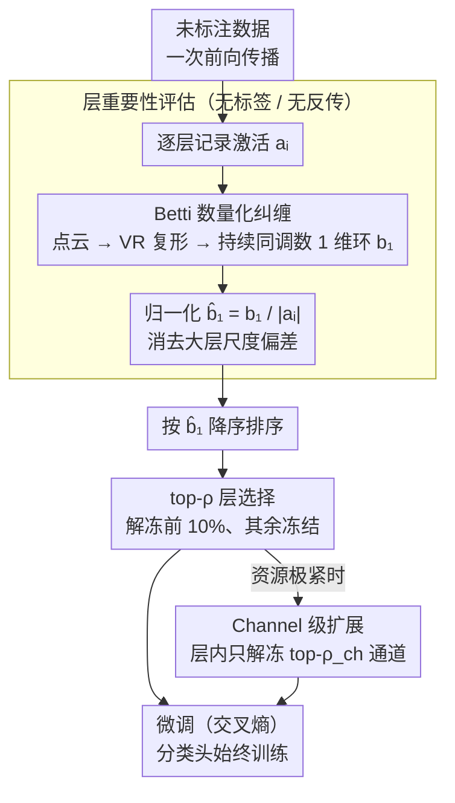

# AdaBet: Gradient-free Layer Selection for Efficient Training of Deep Neural Networks

**会议**: CVPR2026  
**arXiv**: [2510.03101](https://arxiv.org/abs/2510.03101)  
**代码**: [https://github.com/Nokia-Bell-Labs/efficient_layer_selection](https://github.com/Nokia-Bell-Labs/efficient_layer_selection)  
**领域**: 模型压缩  
**关键词**: 层选择, Betti数, 拓扑数据分析, 无梯度微调, 边缘设备, 迁移学习

## 一句话总结
提出 AdaBet，一种基于代数拓扑（第一 Betti 数 $b_1$）的无梯度层选择方法，仅通过前向传播计算每层激活空间的拓扑复杂度来决定哪些层需要微调，无需标签、梯度或反向传播，在 ResNet50/VGG16/MobileNetV2/ViT-B16 上以仅 10% 层微调达到优于全量训练的准确率，同时峰值内存降低约 40%。

## 研究背景与动机

**领域现状**：深度神经网络在边缘设备（手机、IoT、嵌入式系统）上的微调需求日益增长，但边缘设备内存和计算资源极度有限，全量微调不可行。

**现有痛点**：(1) 传统迁移学习冻结大部分层、只训练最后几层，但这种启发式选择忽略了中间层可能也需要适配新任务；(2) 基于 Fisher Information 的层选择方法需要反向传播和标签数据，在无标签或隐私敏感场景下不适用；(3) 结构化剪枝（PruneTrain）和弹性训练（ElasticTrainer）虽降低计算量，但仍依赖梯度信息。

**核心矛盾**：层选择需要衡量每层对新任务的"重要性"，但现有度量（Fisher、梯度范数）都需要反向传播，这本身就是计算瓶颈——用昂贵操作来决定如何省钱，逻辑上矛盾。

**本文目标**：如何在不需要标签、梯度、反向传播的情况下，仅用前向传播来判断哪些层最需要更新？

**切入角度**：从拓扑数据分析出发，用每层激活空间的拓扑结构（特别是 1 维环结构）衡量该层特征的复杂度/纠缠程度。

**核心 idea**：高 $b_1$（多 1 维环）= 激活空间流形纠缠 = 预训练特征与新任务不对齐 → 需要更新；低 $b_1$（少环）= 近似线性可分 = 可直接复用 → 冻结。

## 方法详解

### 整体框架

AdaBet 想回答一个很具体的问题：在内存只有几百 MB 的边缘设备上微调一个预训练网络，到底该解冻哪几层？它把这个决策拆成两个轻量阶段。第一阶段是层重要性评估——拿一批未标注数据做**一次前向传播**，逐层记下激活，再对每层激活算出一个归一化的第一 Betti 数 $\hat{b}_1$，当作"这层有多需要适配新任务"的打分。第二阶段是层选择与微调——把所有层按 $\hat{b}_1$ 从高到低排，解冻分数最高的 top-$\rho$ 比例（默认 10%）启用梯度，其余层全部冻结，分类头始终训练。整个评估阶段没有标签、没有反向传播、也不需要服务器端 meta-training，可以完全跑在设备本地。

### 关键设计

**1. 用第一 Betti 数 $b_1$ 量化每层的"纠缠程度"**

层选择的核心难点是：怎么不靠梯度就判断一层值不值得更新？AdaBet 的答案来自代数拓扑。对第 $i$ 层的激活张量 $a_i \in \mathbb{R}^{B \times C \times H \times W}$，先把每个样本展平成 $\mathbb{R}^{d}$（$d = C \times H \times W$）的点，得到 $B$ 个点构成的点云；在点云上构建 Vietoris-Rips 复形，做持续同调（persistent homology）分析，数出在不同尺度下持续存在的 1 维环（loop）数量，就是这层的 $b_1^{(i)}$。$b_1$ 的物理含义是激活空间流形的"纠缠程度"——环越多，说明不同类别的特征流形相互缠绕、线性分类器拆不开，这层越需要被更新去"解缠"；环越少，激活已接近线性可分，可以直接复用预训练权重。这一步只读前向激活，天然不需要标签或反传。

这正是它压过 Fisher Information 这类传统重要性度量的地方。Fisher 必须做反向传播、还要标签，本身就是边缘设备想省掉的那笔开销——用昂贵操作来决定如何省钱，逻辑上是矛盾的；而且它对 batch 大小和 backprop 次数极其敏感，换个 batch 给出的层排序就大幅抖动（论文 Fig.3）。相比之下 $b_1$ 排序跨 batch 高度一致（Kendall-$\tau$ > 0.95，而 Fisher < 0.7），在 batch 有限的设备上更可靠。

**2. 归一化 Betti 数 $\hat{b}_1$：一个除法同时摆平重要性和成本**

直接用 $b_1$ 选层会有偏差：参数越多的大层，激活点云维度越高，天然容易积累更多环，于是排序总偏向大层——可大层恰恰是微调代价最高的。AdaBet 用一个除法消掉这个尺度偏差：

$$\hat{b}_1^{(i)} = \frac{b_1^{(i)}}{|a_i|}, \qquad |a_i| = C \times H \times W$$

分母 $|a_i|$ 是该层激活的参数量。归一化后比的是"单位参数量的拓扑复杂度"，被选中的于是是那些**用最小代价换最大解缠收益**的层。消融里这一步很关键：不归一化时准确率掉 1.6–1.8%，正是因为预算被浪费在大而不关键的层上。

**3. top-$\rho$ 层选择：一个可调的资源旋钮**

有了 $\hat{b}_1$ 排序，选层就是取前 $\lceil \rho \times L \rceil$ 层解冻、其余冻结，分类头照常训练。$\rho$ 是暴露给用户的资源旋钮——极端受限时设 5%，资源宽裕时设 20%，默认 10% 在多个架构上最优。值得注意的是 10% 解冻往往还**反超 100% 全量训练**：冻住那些已经对齐良好的层，等于天然挡掉了灾难性遗忘和小数据上的过拟合。

**4. Channel 级扩展 $\rho_{ch}$：把粒度再切细一层**

整层解冻有时仍偏粗——一层里可能只有部分通道需要适配。于是 AdaBet 在被选中的层内对每个通道单独算 $b_1$，只解冻其中 top-$\rho_{ch}$ 比例的通道，把可训练参数进一步压下去。代价是实现更复杂、收益偏小（消融里额外只 ~0.3%），属于资源极紧时才值得开的细粒度选项。

### 损失函数 / 训练策略

微调阶段就是标准交叉熵，冻结层不回传梯度。层选择在训练前一次性完成、全程不再变动，所以除了开头那次前向 + 拓扑计算，后续流程和普通微调完全一样。

## 实验关键数据

### 主实验（准确率 %）

| 方法 | ResNet50 Flowers | ResNet50 CIFAR-100 | MobileNetV2 Cars | ViT-B16 CIFAR-100 |
|------|-----------------|-------------------|-----------------|-------------------|
| Full Training | 82.3 | 75.8 | 80.1 | 85.2 |
| Transfer Learning (last layers) | 79.5 | 72.1 | 76.8 | 82.7 |
| PruneTrain | 80.1 | 73.6 | 77.4 | 83.5 |
| ElasticTrainer | 81.2 | 74.3 | 78.9 | 84.1 |
| Fisher-based Selection | 81.8 | 74.9 | 79.2 | 84.6 |
| **AdaBet (ours, ρ=10%)** | **84.5** | **77.4** | **82.8** | **87.1** |

### 资源效率

| 方法 | 可训练参数 (%) | 峰值内存 (相对) | 训练时间 (相对) |
|------|--------------|----------------|----------------|
| Full Training | 100% | 1.00× | 1.00× |
| Transfer Learning | ~20% | 0.72× | 0.45× |
| Fisher Selection (10%) | 10% | 0.62× | 0.88× (含FI计算) |
| **AdaBet (ρ=10%)** | **10%** | **0.60×** | **0.52×** |

### 消融实验

| 配置 | ResNet50 Flowers | CIFAR-100 |
|------|-----------------|-----------|
| 随机层选择 (10%) | 80.8 | 73.2 |
| 按参数量选择 | 81.1 | 73.8 |
| $b_1$ 不归一化 | 82.9 | 75.6 |
| $b_1$ 归一化 (AdaBet) | **84.5** | **77.4** |
| AdaBet + Channel (ρ_ch=50%) | 84.2 | 77.1 |

### 关键发现
- **$b_1$ 归一化至关重要**：不归一化时准确率下降 1.6-1.8%，因为会偏向选择大层而忽略关键的小层
- **远优于 Fisher**：AdaBet 比 Fisher 高 2.5%+，且训练总时间更少（Fisher 需要额外反向传播来估计信息量）
- **10% 层微调 > 100% 全量训练**：这看似反直觉，但合理——冻结已良好对齐的层避免了灾难性遗忘和过拟合
- **$b_1$ 排序跨 batch 高度稳定**：Kendall-τ > 0.95，而 Fisher 在不同 batch 下 τ < 0.7
- **架构泛化性强**：在 CNN（ResNet50, VGG16, MobileNetV2）和 Transformer（ViT-B16）上均有效

## 亮点与洞察
- **拓扑视角解读层适配**：将"哪些层需要微调"问题转化为拓扑特征分析，这是一个全新视角。高 $b_1$ = 流形纠缠 = 需要解缠的直觉非常优雅
- **不需要标签和梯度**：这对隐私保护场景（联邦学习、边缘设备个性化）价值巨大——设备无需将数据/梯度发送到服务器
- **一次性前向传播决策**：层选择只需一次前向传播，后续训练过程与标准微调完全相同，实现简单
- **归一化设计精巧**：$\hat{b}_1 = b_1/|a_i|$ 同时平衡了重要性和计算成本，一个除法解决两个问题

## 局限与展望
- Betti 数的计算本身有开销（Vietoris-Rips 复形构建），对高维激活空间可能需要降维采样，论文未充分讨论大规模模型（如 LLaMA）的可行性
- $\rho$ 比例是手动设定的超参数，不同任务最优 $\rho$ 可能不同，缺少自适应选择策略
- 只在分类任务上验证，检测/分割/生成等任务的效果未知
- Channel 级选择 $\rho_{ch}$ 带来的额外提升有限（仅 ~0.3%），但实现复杂度显著增加
- 未与 LoRA/Adapter 等参数高效微调方法对比，这些方法也是边缘微调的候选方案

## 相关工作与启发
- **vs Fisher Information Selection**: FI 需要反向传播 + 标签，且对 batch 敏感，AdaBet 完全不依赖梯度且稳定性显著更强
- **vs ElasticTrainer**: ElasticTrainer 用弹性搜索策略选择层，仍需梯度信息，AdaBet 前向传播即可
- **vs PruneTrain**: PruneTrain 在训练过程中动态剪枝，AdaBet 在训练前一次性决策，更简单高效
- **vs LoRA/Adapter**: LoRA 在每层插入低秩矩阵，AdaBet 选择性冻结整层；两者可结合——对 AdaBet 选中的层用 LoRA 微调
- **拓扑数据分析在 DL 中的应用**：之前主要用于分析训练动态和数据复杂度，AdaBet 首次将 TDA 用于指导训练策略

## 评分
- 新颖性: ⭐⭐⭐⭐⭐ 首次将代数拓扑（Betti 数）用于层选择，视角全新且理论直觉优雅
- 实验充分度: ⭐⭐⭐⭐ 4 个架构 × 4 个数据集，消融完整，但缺少与 LoRA 等 PEFT 方法对比
- 写作质量: ⭐⭐⭐⭐ 动机阐述清晰，FI vs Betti 的对比可视化有说服力
- 价值: ⭐⭐⭐⭐ 对边缘设备微调场景有实际意义，且方法简单易用

<!-- RELATED:START -->

## 相关论文

- [\[ICML 2026\] SURGE: Surrogate Gradient Adaptation in Binary Neural Networks](../../ICML2026/model_compression/surge_surrogate_gradient_adaptation_in_binary_neural_networks.md)
- [\[NeurIPS 2025\] QuadEnhancer: Leveraging Quadratic Transformations to Enhance Deep Neural Networks](../../NeurIPS2025/model_compression/quadenhancer_leveraging_quadratic_transformations_to_enhance_deep_neural_network.md)
- [\[ICML 2025\] Efficient Logit-based Knowledge Distillation of Deep Spiking Neural Networks for Full-Range Timestep Deployment](../../ICML2025/model_compression/efficient_logit-based_knowledge_distillation_of_deep_spiking_neural_networks_for.md)
- [\[ICML 2025\] FGFP: A Fractional Gaussian Filter and Pruning for Deep Neural Networks Compression](../../ICML2025/model_compression/fgfp_a_fractional_gaussian_filter_and_pruning_for_deep_neural_networks_compressi.md)
- [\[ICLR 2026\] Adaptive Width Neural Networks](../../ICLR2026/model_compression/adaptive_width_neural_networks.md)

<!-- RELATED:END -->
