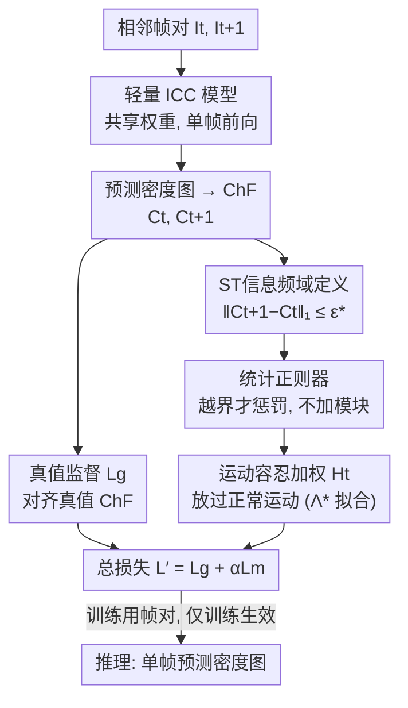

# Adapting Lightweight Image-based Counting Models for Video Crowd Counting

**会议**: CVPR 2026  
**论文**: [CVF Open Access](https://openaccess.thecvf.com/content/CVPR2026/html/Shu_Adapting_Lightweight_Image-based_Counting_Models_for_Video_Crowd_Counting_CVPR_2026_paper.html)  
**代码**: https://github.com/wbshu/SR （论文标注 “will be available”，⚠️ 以官方为准）  
**领域**: 模型压缩 / 高效推理  
**关键词**: 视频人群计数, 轻量化, 统计正则器, 特征函数, 时空一致性

## 一句话总结
这篇论文不给视频人群计数（VCC）加任何时序模块，而是把"相邻帧的人数变化应当有界"这一时空先验，解析地写成一个基于特征函数（ChF）频域的统计正则器，只在训练时约束一个轻量图像计数（ICC）模型，推理仍是单帧——在六个数据集上做到 SOTA 精度的同时把推理帧率拉到 99.5 fps。

## 研究背景与动机
**领域现状**：视频人群计数的主流套路是"从邻帧抽时空（ST）信息再融合进当前帧的预测"——用光流网络、Transformer、ConvLSTM 等额外模块去提取并融合相邻帧的特征，借时序线索提升计数精度。

**现有痛点**：这些 ST 模块带来三个现实问题：(1) 抽取+融合都是深网络，时空信息"怎么帮到计数"既不可解释也不可控；(2) 额外模块直接抬高存储与计算开销，难满足 VCC 的实时要求；(3) 用邻帧预测当前帧，推理时必须缓存多帧及其特征。结果就是这些模型在算力受限、实时性强的真实场景里很难部署。

**核心矛盾**：VCC 想要的是时序带来的精度增益，但增益的代价是把模型做重、做慢、做成多帧缓冲——精度与效率被时序模块绑死成 trade-off。而真正轻量、可实时部署的恰恰是图像计数（ICC）模型，它们天生没有时序能力。

**本文目标**：能不能让一个轻量 ICC 模型获得 VCC 能力，却**不引入任何额外模块、不增加推理开销、推理只看单帧**？这要回答两个子问题——理论上单帧推理离最优多帧估计有多远（ICC 何时足以胜任 VCC）；工程上怎么把时序先验注入训练而不改结构。

**切入角度**：作者注意到 ChF（特征函数，密度图的频域表示）此前只被当作单图的静态表示用；如果换个维度看它**随时间的演化**，会发现 ChF 的时序变化是高度结构化、数学可处理的。于是 ST 信息不必靠网络去"猜"，可以被解析地定义出来、并且只跟计数任务直接挂钩。

**核心 idea**：用"相邻帧 ChF 的 L1 变化有界"把时空一致性写成一条可从数据估出的不等式，再把它做成一个**统计正则器**去约束训练——以正则代替模块，让轻量 ICC 模型学到时序一致、复杂度受控的解。

## 方法详解

### 整体框架
训练时，一对相邻帧 $I_t, I_{t+1}$ 各自独立喂进**同一个轻量 ICC 模型**（共享权重），得到两张预测密度图 $D_t, D_{t+1}$，再转成各自的特征函数 $C_t, C_{t+1}$。损失由两块组成：一块是常规的真值监督 $L_g$（让每帧的 ChF 对齐真值 ChF）；另一块是本文的**统计正则器** $L_c$（约束两帧预测 ChF 的时序变化不超出数据驱动的上界 $\epsilon^*$），并进一步升级为**运动容忍版** $L_m$（用频域权重 $H_t$ 容忍由人正常运动引起的变化）。两个关键超参 $\epsilon^*$ 和 $\Lambda^*$ 都被重述成统计推断问题，从训练集一次性自动估出，无需手调。**推理阶段彻底回到单帧模式**：正则器只在训练生效，部署时就是一个普通的图像计数模型，没有任何缓冲、没有任何额外结构。

### 关键设计

**1. ST信息的频域解析定义：把"时空一致性"变成一条能从数据算出的不等式**

痛点是旧方法的 ST 信息只跟计数任务"间接"相关（如低层光流），必须靠网络去抽。作者要的是一条**直接对齐计数、且与模型无关**的定义。直觉上，视频是场景的时间演化，相邻帧的人群分布不该任意突变，应满足局部人数变化有界 $|f(t+1)-f(t)|\le\epsilon$。但在像素/密度图空间直接定义"一致"不可靠（点图卷积后即使缓慢运动也会出现不连续），且局部区域的尺寸/形状难选。作者绕开空间域，改用 ChF 这个频域载体，并证明两条定理把问题钉死：Theorem 1 表明虽然像素级密度图在平滑运动下也会跳变，但 **ChF 随时间是"时间-局部线性"演化的**，$C_{t+\Delta t}(w)-C_t(w)$ 随人的位移线性变化，幅度受 $\|A_{t,w}\|_2\le Q\|w\|_2$ 约束；Theorem 2 进一步证明，只要 $\|C_{t+1}-C_t\|_1\le\epsilon$，则**任意形状、任意大小**区域上的平均局部人数变化都满足 $\Delta_R(t,t+1)\le(2\pi)^{-2}\epsilon$，从而一次性解决"局部区域怎么选"的难题。于是时空一致性被统一写成频域形式：

$$\|C_{t+1}-C_t\|_1=\int|C_{t+1}(w)-C_t(w)|\,dw\le\epsilon^*.$$

上界 $\epsilon^*$ 不是手调的，而是从真值 ChF 统计出来：$\epsilon^*=\max_{k}\max_{i}\|C^{(k)}_{i+1}-C^{(k)}_{i}\|_1$（实际用了对离群帧更鲁棒的略改版本）。这条上界纯由真值密度图算得、不经任何网络，因此提取出的 ST 信息是**数据集自身的内在属性、与具体模型无关**，且**全程只算一次**（旧方法每个训练步都要抽 ST 特征），训练效率因此大幅提高。

**2. 统计正则器：用一项损失把 ST 约束注入训练，而不是加模块**

旧方法把 ST 信息当"额外特征"喂给模型拟合，这正是模块和推理开销的来源。作者反其道而行——把上面那条不等式做成**正则项**，约束的是模型复杂度而非增加输入。对一对相邻帧的训练损失为

$$L=\underbrace{\|C_t-C^{[g]}_t\|_2+\|C_{t+1}-C^{[g]}_{t+1}\|_2}_{L_g}+\alpha\underbrace{\mathbb{1}(\|C_{t+1}-C_t\|_1>\epsilon^*)\,\|C_{t+1}-C_t\|_2}_{L_c},$$

其中 $\mathbb{1}(\cdot)$ 是指示函数，$\alpha$ 是平衡因子，范数用 L2（训练更稳）。机制很直白：只有当两帧预测 ChF 的 L1 时序变化**越过**数据上界 $\epsilon^*$ 时，正则器才开火惩罚；落在统计边界内则不动。这等于在告诉模型"你预测出的相邻帧人数变化不许比真实数据分布里见过的还离谱"，从而把解约束到**复杂度受控、时序一致**的区域——既没引入任何模块，也不改变推理（正则器只在训练用，推理纯单帧）。

**3. 运动容忍加权与 Λ\* 的数据驱动估计：把"人在动"和"模型瞎抖"区分开**

基础正则器有个隐患：相邻预测的局部人数变化来自两个来源——(a) 预测之间的不一致（该罚），(b) 人在帧间的正常移动（不该罚）。一刀切惩罚会误伤正常运动。作者用频域权重函数 $H_t(w)$ 重加权正则项：$L_m=\mathbb{1}(\|C_{t+1}-C_t\|_1>\epsilon^*)\,\|H_t*(C_{t+1}-C_t)\|_2$（$*$ 为逐元素乘）。$H_t$ 的设计由 Theorem 3 给依据：在每个个体运动服从协方差 $\Lambda$ 的分布假设下，正常运动诱发的 $C_{t+1}(w)-C_t(w)$ 的标准差为 $\sqrt{Q(1-\exp(-w^T\Lambda w))}\exp(-w^T\Sigma w)$。$H_t$ 取该标准差的倒数形式（见式 7-8），于是**对"即使人动了也该稳定"的频率给高权重、对"正常运动本就会变"的频率给低权重**，让正则器只盯"无理由的不一致"。关键参数 $\Lambda$ 不靠手调或运动标注（多数 VCC 数据集没有点对应），而被当成**统计推断问题**：先算各频率上 ChF 差分的经验归一化方差 $S(w)$（式 11，分母除以最小人数去掉尺度效应），再把理论方差函数 $h_\Lambda(w)$ 拟合到 $S(w)$ 上求 $\Lambda^*=\arg\min_{\Lambda\succeq0}\int|h_\Lambda(w)-S(w)|^2dw$。这样 $\Lambda$ 在频域里被纯数据驱动地推断出来，既不用运动追踪，又保留了运动协方差的统计语义；最终训练损失 $L'=L_g+\alpha L_m$。

**4. ICC↔VCC 充分性的理论刻画：给"单帧到底够不够"一个可量化的判据**

这一条不是 pipeline 里的模块，而是支撑"为什么敢用单帧"的理论地基。作者比较两类最优均方估计器——只用单帧的 $\mathcal{F}_{img}$ 与用时序窗口的 $\mathcal{F}^{(l,r)}_{vid}$——定义理论差距 $\Delta_{l,r}=\mathbb{E}\big[(\mathbb{E}[C_t\mid I_{t-l},\dots,I_{t+r}]-\mathbb{E}[C_t\mid I_t])^2\big]$（Theorem 4）。$\Delta_{l,r}$ 衡量"VCC 比 ICC 理论上还能多挤出多少不确定性下降"；它在三种条件下归零：时序冗余（邻帧不提供新信息）、单帧完全可观测、目标确定（单帧已唯一决定 $C_t$）。一个反直觉的结论是：第三个条件并不要求无遮挡的完美场景，只有当遮挡/模糊"信息论意义上彻底"（人的所有可见证据全无）时才失效；现实里残留的轮廓、阴影通常已足以让单帧成为统计充分表示。实践启示也很清楚——在算力受限时，**提升单帧信息量（更高画质、更好视角、多相机）比堆时序模型复杂度更划算**，因为前者直接压低 $\Delta_{l,r}$。

### 损失函数 / 训练策略
ICC 主干沿用 [31, 37] 的 VGG19-based 模型，用运动容忍版 $L'$（式 13）训练，平衡因子 $\alpha=0.8$。真值密度图用 8 像素带宽的高斯核生成；数据增强为随机裁剪（概率 1）+ 随机水平翻转（概率 0.5）。优化器 Adam，学习率 1e-5、权重衰减 1e-4，batch size 8（即 4 对帧）。积分近似按 [37] 取频率范围 $[-0.3,0.3]^2$、黎曼和粒度 0.01。$\epsilon^*$、$\Lambda^*$ 均在训练前从数据一次性估出，不参与调参。

## 实验关键数据

六个基准（UCSD / MALL / FDST / VENICE / DRONECROWD / VSCROWD）覆盖监控、相机、航拍三类视角，其中航拍的 DRONECROWD 最难（人小、分辨率低、训练/测试场景差异大）。指标为 MAE / MSE。方法记为 SR。

### 主实验：与 SOTA VCC 方法对比（节选自 Table 5）
注："Tr/Inf" 表示训练/推理用的输入类型，I=单帧、V=多帧。SR 是唯一**训练用帧对、推理用单帧**（V/I）的方法。

| 数据集 | 指标 | SR (本文, V/I) | 代表性视频方法 | 说明 |
|--------|------|------|------|------|
| VENICE | MAE / MSE | **8.2 / 10.5** | DACM 11.1 / 14.3 | 训练数据少，优势显著 |
| FDST | MAE / MSE | **1.27 / 1.61** | DACM 1.31 / 1.75 | 监控视角，best |
| DRONECROWD | MAE / MSE | **14.1** / 19.9 | CLRNet 17.3 / 23.4 | 最难航拍，MAE best、MSE 第二 |
| VSCROWD | MAE / MSE | **5.4 / 9.5** | DACM 7.1 / 14.7 | 大数据集，MAE 大幅领先 |
| UCSD | MAE / MSE | 0.75 / 0.97 | CLRNet 0.72 / 0.94 | 第二 best |

SR 在 MALL / VENICE / FDST / VSCROWD 取得最优 MAE&MSE，UCSD 第二，DRONECROWD 取最优 MAE。值得注意的是它在最大的 DRONECROWD、VSCROWD 上 MAE 明显超过现有视频方法，而这些方法全都依赖多帧推理。

### 效率对比（Table 6，FDST，RTX3090 Ti，输入 640×360）
| 方法 | 每 epoch 训练 | 单图推理 | fps |
|------|------|------|------|
| EPF | 49 min | 0.043 s | 23.5 |
| STGN | 476.1 s | 0.017 s | 58.5 |
| DACM | 435.3 s | 0.016 s | 61.3 |
| **SR (本文)** | **85.5 s** | **0.010 s** | **99.5** |

单帧推理让帧率远超多帧方法，且训练加速随数据集变大、推理加速随输入分辨率变大而更明显。

### 消融实验
**正则器形式（Table 3，DRONECROWD）**

| 配置 | MAE | MSE | 说明 |
|------|-----|-----|------|
| baseline（$\alpha=0$，纯 ICC） | 18.1 | 26.5 | 无任何 ST 约束 |
| + 基础正则器（式 5） | 15.3 | 22.7 | 仅加 ST 一致性约束 |
| + 运动容忍正则器（式 13） | **14.1** | **19.9** | 完整 SR |

**平衡因子 $\alpha$（Table 2，DRONECROWD）**：$\alpha=0/0.6/0.8/1.0/3.0$ 的 MAE 为 18.1 / 15.1 / **14.1** / 15.2 / 16.5，$\alpha=0.8$ 最优——太小约束不够、太大压过监督信号。

**跨主干通用性（Table 4，DRONECROWD，MAE/MSE）**

| 主干 | w/o SR | w/ SR |
|------|--------|-------|
| MCNN | 34.7 / 42.5 | 30.6 / 38.5 |
| CSRNet | 19.8 / 25.6 | 17.1 / 24.5 |
| CAN | 22.1 / 33.4 | 16.9 / 22.3 |
| VGG19 (ChfL) | 18.1 / 26.5 | 14.1 / 19.9 |
| MAN | 18.7 / 23.4 | 14.9 / 21.7 |

### 关键发现
- **运动容忍是净增益**：从基础正则器（15.3）到运动容忍版（14.1）再降 1.2 MAE，说明"放过正常运动、只罚无理由抖动"这一步确实有效，而非可有可无。
- **正则器与主干解耦**：五种轻量主干（含老旧的 MCNN）加上 SR 后 MAE 全线下降，CAN 从 22.1→16.9 降幅最大，证明 SR 是一套可移植的训练方案而非绑死某个结构。
- **数据少时优势更大**：VENICE 训练数据相对少，SR 反而把 MAE 从 SOTA 的 11.1 压到 8.2——统计正则在小数据上抑制过拟合/复杂度的作用更突出。

## 亮点与洞察
- **"以正则代模块"的范式转换**：把时空信息从"额外输入特征"重构成"约束模型复杂度的正则项"，一举消掉额外模块、多帧缓冲与推理开销，却拿到 SOTA 精度——这是本文最"啊哈"的地方，思路可迁移到任何"想要时序/结构先验但又不想加重模型"的任务。
- **ChF 的时序维度被首次挖掘**：前人只把特征函数当单图静态表示，本文证明它随时间是局部线性演化的（Theorem 1），从而让"时空一致性"能在频域被严格、与模型无关地定义——这是把一个旧表示用出新意的漂亮例子。
- **超参当统计量而非旋钮**：$\epsilon^*$ 闭式可得、$\Lambda^*$ 由拟合数据方差求出，全程零手调，跨数据集自适应——对工程落地极友好，省掉昂贵的验证搜参。
- **给"单帧够不够"一个理论判据**：$\Delta_{l,r}$ 量化了 ICC 逼近 VCC 最优的差距，并指出"提升单帧画质/视角"在算力受限时比堆时序模型更划算，这个结论对实际部署很有指导性。

## 局限与展望
- 作者承认分析"不主张单帧推理在实践中总是足够"，只是划出时序信息失去价值的信息论边界；当遮挡/模糊在信息论意义上彻底时，单帧确实不够，这类极端场景 SR 并无额外手段补偿。
- ⚠️ Theorem 3 依赖"每个个体运动是从渐近整体运动分布中采样、协方差为 $\Lambda$"的假设；在运动高度非平稳或群体行为强相关（如突发踩踏、逆流）的场景，$\Lambda$ 的单一协方差刻画可能不够准，$H_t$ 的容忍可能失配（以原文为准）。
- 框架仍需成对相邻帧训练并依赖真值 ChF/密度图监督，对标注稀疏或帧率不一致的数据如何稳健，文中未充分展开。
- 改进方向：把单一 $\Lambda$ 推广为场景/时段自适应的多模态运动协方差；或把 $\epsilon^*$、$H_t$ 做成在线更新，以适应长视频中分布漂移。

## 相关工作与启发
- **vs 光流/Transformer 类 VCC（EPF / STGN / DACM 等）**：他们靠额外模块抽取并融合邻帧 ST 特征、推理多帧；本文把 ST 信息解析定义后做成单一正则器，推理单帧。区别在于"ST 信息是当特征喂还是当约束用"——本文换来的是 99.5 fps 与可移植性，代价是把先验形式化的数学门槛更高。
- **vs ChfL [37]（ChF 的静态用法）**：ChfL 把 ChF 当单图频域表示做图像计数；本文沿用其 ChF/VGG19 主干，但**首次分析 ChF 的时序动力学**，把静态表示扩展成时空一致性约束，从而把一个 ICC 方法升级为 VCC。
- **vs 多分支/重型 ICC 模型**：本文明确选择轻量 ICC 子集（CSRNet/CAN/MCNN 等）作为载体，主张在算力受限下"提升单帧信息量 + 统计正则"优于堆模型复杂度——这与"更大更重才更准"的主流叙事形成对照。

## 评分
- 新颖性: ⭐⭐⭐⭐⭐ 把 ST 信息从"加模块的特征"重构为"频域统计正则"，并首次挖掘 ChF 时序动力学，范式新颖。
- 实验充分度: ⭐⭐⭐⭐☆ 六基准 + 五主干 + 效率/消融齐全；但效率对比仅含部分有码方法，缺更大规模主干上的验证。
- 写作质量: ⭐⭐⭐⭐☆ 理论推导（4 个定理）与工程动机衔接清晰，图 1 一图说清框架；部分定理细节需查补充材料。
- 价值: ⭐⭐⭐⭐⭐ 实时单帧推理 + 即插即用正则器 + 零手调超参，落地价值高，且给出 ICC↔VCC 充分性的可量化判据。

<!-- RELATED:START -->

## 相关论文

- [\[CVPR 2026\] ProGIC: Progressive and Lightweight Generative Image Compression with Residual Vector Quantization](progic_progressive_and_lightweight_generative_image_compression_with_residual_ve.md)
- [\[ICML 2026\] Parameters as Experts: Adapting Vision Models with Dynamic Parameter Routing](../../ICML2026/model_compression/parameters_as_experts_adapting_vision_models_with_dynamic_parameter_routing.md)
- [\[CVPR 2026\] Accelerating Streaming Video Large Language Models via Hierarchical Token Compression](accelerating_streaming_video_large_language_models_via_hierarchical_token_compre.md)
- [\[CVPR 2026\] Adaptive Depth Lightweight RGB-T Tracking with Holistic Token Routing](adaptive_depth_lightweight_rgb-t_tracking_with_holistic_token_routing.md)
- [\[CVPR 2026\] LIFT and PLACE: A Simple, Stable, and Effective Knowledge Distillation Framework for Lightweight Diffusion Models](lift_and_place_a_simple_stable_and_effective_knowledge_distillation_framework_fo.md)

<!-- RELATED:END -->
