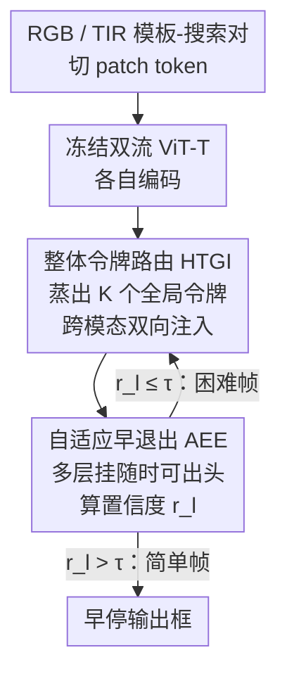

# Adaptive Depth Lightweight RGB-T Tracking with Holistic Token Routing

**会议**: CVPR 2026  
**论文**: [CVF Open Access](https://openaccess.thecvf.com/content/CVPR2026/html/Ding_Adaptive_Depth_Lightweight_RGB-T_Tracking_with_Holistic_Token_Routing_CVPR_2026_paper.html)  
**代码**: 待确认  
**领域**: 模型压缩  
**关键词**: RGB-T 跟踪, 自适应早退出, 轻量化, 跨模态融合, 动态推理

## 一句话总结
ADTrack 把网络深度当作可动态分配的算力预算——给冻结的双流 ViT-T 骨干装上多层"随时可出结果"的预测头和置信度校准的早退出策略，并用一个只有 37.3K 参数的整体令牌路由模块（HTGI）做廉价跨模态融合，在 LasHeR 上拿到 70.2% PR / 56.3% SR 的同时跑到 GPU 148.3 FPS、CPU 50.2 FPS、边缘端 28.7 FPS。

## 研究背景与动机
**领域现状**：RGB-T 跟踪用热红外（TIR）补 RGB 在夜间、强光、雾、遮挡下的短板，近年主流从"把 TIR 当弱先验/文本式条件提示"转向**双分支 Transformer + 显式跨模态交互**（TBSI、BAT、STTrack、XTrack 等），靠重型骨干和全局 cross-attention/adapter 堆叠换来更强表征和更高精度。

**现有痛点**：这种精度是用算力换的。即便不做任何跨模态交互，光是同时处理两路模态就已经让原始计算量相比纯 RGB 翻倍；再叠上重型融合/对齐块，FLOPs、显存、带宽进一步飙升，导致实时只能在高端 GPU 上勉强成立，UAV、移动机器人、便携监控这类资源受限边缘平台基本部署不了。

**核心矛盾**：精度与效率的 trade-off。压缩多模态跟踪器的主流做法是**收窄骨干宽度**，但深度通常仍沿用通用配置不动。作者观察到：在 RGB-T 这种先验明确的领域专用任务里，深度的边际收益递减——冗余层只是徒增延迟和能耗、甚至加剧过拟合，并不带来相称的精度提升。

**切入角度**：作者把 score map（响应图）逐层可视化，发现在深层它们高度相似、信息早早饱和（SSIM / Peak Alignment / Cosine 在较深的中间层都 >0.95），说明决策其实已经收敛。但"饱和"不等于"层可删"——逐个移除 12 层 ViT 里任意一层都会让 LasHeR 显著掉点，说明每一层在**构建判别表征**上结构性必要。结论是：深度该被当成**可优化的资源**而非固定超参，并且要在**保留完整模型容量**的前提下，按帧跳过冗余计算。

**核心 idea**：用"自适应早退出（按帧动态决定推理到第几层就停）" + "整体令牌路由（用极少量全局令牌跨模态互相引导）"，在不改网络结构、不做教师蒸馏的情况下，把深度变成一个可控的算力预算。

## 方法详解

### 整体框架
ADTrack 是一个双流跟踪器：RGB 与 TIR 各走一条**冻结**的轻量 ViT-T 骨干提特征。给定模板-搜索对 $(z, c)$，输入图像切成 patch token 序列 $z_{rgb}, c_{rgb}, z_{tir}, c_{tir} \in \mathbb{R}^{N\times D}$，两路独立编码。在此之上挂两个核心模块：**HTGI**（Holistic-Token-Guided Interaction）插在骨干的若干关键层（实测第 3/6/9 层）之间，从一路模态蒸出少量整体令牌注入另一路做轻量融合；**AEE**（Adaptive Early-Exit）在多个深度挂"随时可出结果"的预测头，推理时根据置信度按帧动态决定停在哪一层。整体管线是：双流编码 → 多层穿插 HTGI 跨模态引导 → 每个装备层由 AEE 算置信度判断是否早停 → 输出 score map 回归框。

推理时 AEE 的置信度定义为中间 score map 的**最大响应 / 全部响应之和**；一旦超过预校准阈值 $\tau$（默认 0.75），立即终止推理、输出当前预测——简单帧浅层就停，困难帧才往深里算。

### 关键设计

**1. 自适应早退出 AEE：把深度从固定超参变成按帧可控的算力预算**

痛点是固定深度对每一帧都付同样的算力，而 score map 在深层早已饱和、简单帧根本用不到那么深，但又不能直接删层（删任一层都掉点）。AEE 的做法是在骨干的多个深度挂上轻量预测头，每个头生成一张临时 score map $S_l$，这些中间头与主解码器**共享参数**、但被联合优化去逼近最终收敛行为。核心是一个**自监督校准方案**：对每个头定义归一化置信度
$$r_l = \frac{\max(S_l)}{\sum_i S_{l,i}}, \quad r^* = \frac{\max(S_L)}{\sum_i S_{L,i}},$$
其中 $S_L$ 是最深层的最终 score map。训练目标为
$$L_{AEE} = \sum_l \Big[ L_{pred}(S_l, y) + |r_l - r^*| + M(r_l, r^*, \tau) \Big],$$
margin 函数 $M(r_l, r^*, \tau) = (\tau - r_l)_+$ 当 $r^* > \tau$，否则 $(r_l - \tau)_+$。三项各司其职：第一项保证每个中间头能独立定位目标；第二项把置信度沿深度对齐，逼它随特征变判别而单调上升；margin 项在退出阈值 $\tau$ 周围画一条软边界——当最终状态已收敛却中间层欠自信、或最终状态还不确定却中间层过自信，都要罚。这样每一层都端到端地内化了"收敛"和"退出边界"的语义，早退出从启发式规则升级成可学习的过程：halting 自然地从表征饱和中涌现。推理时对每个装备层确定性地套用同一置信度度量，超 $\tau$ 就停，简单帧浅推、困难帧深算。训练时还配合**随机深度截断**与校准置信目标，鼓励模型在一段深度范围内都鲁棒，而非只依赖最深配置。

**2. 整体令牌路由 HTGI：用几个全局令牌做近乎零成本的跨模态引导**

痛点是显式跨模态交互（重型 cross-attention / adapter 堆叠）虽强但太贵，是延迟和参数的大头。HTGI 建立在一个观察上：跨模态依赖往往**低秩**，可以由少数几个信息量大的全局描述子承载，不必逐层对齐。于是它分两步走。**Holistic Token Generator（HTG）**：给定模板特征 $X_t \in \mathbb{R}^{B\times N_t\times C}$，学 $K$ 个整体令牌 $H = [h_1,\dots,h_K]$ 捕捉互补的全局线索；不同于简单求和，HTG 对每个令牌用一个轻量可学习加权机制——一个 **Token Router**（轻量 MLP $f_k$）先把输入特征变成逐 patch 权重，再逐元素乘回原特征并全局求和：
$$h_k = \sum_{i=1}^{N_t} \big( f_k(x_i) \odot x_i \big), \quad k=1,\dots,K,$$
于是每个令牌学着表示一种独立语义成分（目标结构、轮廓、热信号），形成紧凑可解释的全局表征。**Feature Interaction**：把一路模板的整体令牌 $H_n$ 和另一路搜索特征 $X_m$ 拼接，丢进一个 Transformer block 联合处理 $Z = \text{TransformerBlock}([H_n : X_m])$；传播后前 $K$ 个（注入的整体令牌）被丢弃，剩下 $N$ 个就是被引导精炼过的特征 $X_{m'}$。注入的整体令牌在这里充当**语义锚点**，把模态 $n$ 的全局先验经自注意力扩散到模态 $m$ 的各空间位置，且**双向**进行。关键省在哪：它复用已有的自注意力层、不引入额外 cross-attention 参数，整个模块仅 37.3K×3 参数（<0.2% 模型），同时保持各分支表征完整、防止一路模态压倒另一路。

### 损失函数 / 训练策略
训练用 VTUAV 与 LasHeR 联合训练，采样比 1:2；每个样本含两张 128×128 模板 + 一张 256×256 搜索图。8 卡 RTX 4090 训 15 epoch，每 epoch 60K 配对样本，batch size 32。AdamW，ViT 骨干初始学习率 $1\times10^{-5}$、其他参数 $1\times10^{-4}$，第 10 epoch 后降 10 倍，weight decay $1\times10^{-4}$。骨干**冻结**，不依赖教师蒸馏。推理用两张模板帧。

## 实验关键数据

### 主实验
在 LasHeR / RGBT234 上对比 SOTA（PyTorch FPS，不含预处理）：

| 方法 | 骨干 | LasHeR PR | LasHeR SR | RGBT234 MPR | GPU FPS | CPU FPS | 边缘 FPS |
|------|------|-----------|-----------|-------------|---------|---------|----------|
| **ADTrack（本文）** | ViT-T | 70.2 | 56.3 | 88.6 | 148.3 | 50.2 | 28.7 |
| CMDTrack-T12 | ViT-T | 67.5 | 55.3 | 84.5 | - | - | - |
| LightFC-T | ViT-T | 64.7 | 50.7 | 83.4 | 35.2 | 7.9 | 7.1 |
| SUTrack-Tiny | HIViT-T | 66.7 | 53.9 | 85.9 | 102.4 | 26.6 | 15.6 |
| TBSI-Tiny | ViT-T | 61.7 | 48.9 | - | 48.9 | 19.3 | 8.8 |
| CAFormer | ViT-B | 70.0 | 55.6 | 88.3 | 63.5 | 8.7 | 7.5 |
| BAT | ViT-B | 70.2 | 56.3 | 86.8 | 62.0 | 5.4 | 5.9 |
| TBSI | ViT-B | 69.2 | 55.6 | - | 47.3 | 4.6 | 5.0 |

ADTrack 用 ViT-T 在精度上追平甚至超过一众 ViT-B 重型方法（PR 70.2 与 BAT 持平、超 TBSI 1.0%），CPU 速度却比 TBSI 快 10 倍以上；是唯一能在 GPU/CPU/边缘三种平台**全部实时**的 RGB-T 跟踪器。另在 GTOT（PR 93.0 / SR 77.6）、RGBT210（PR 87.8 / SR 65.2，超 CAFormer 2.2/2.0）、VTUAV-ST（MPR 87.6 / MSR 75.4）等基准也领先。

### 消融实验

HTGI 组件与模板设计（LasHeR）：

| 配置 | PR | NPrec | SR | 说明 |
|------|------|------|------|------|
| Single template w/o HTGI | 66.3 | 62.2 | 52.7 | 单静态模板 + 无交互 |
| w/o HTGI | 66.9 | 63.0 | 53.2 | 仅后期拼接，无显式交互 |
| RGB→TIR | 68.2 | 64.5 | 54.3 | 单向路由 |
| TIR→RGB | 67.9 | 64.4 | 53.9 | 单向路由 |
| Full Model | 70.2 | 66.3 | 56.3 | 双向 HTGI + 双模板 |

早退出阈值 $\tau$ 的精度-速度权衡（LasHeR）：

| 阈值 τ | PR | SR | GPU FPS | CPU FPS | 说明 |
|--------|------|------|---------|---------|------|
| 0.65 | 68.6 | 54.7 | 192.0 | 63.5 | 太激进，掉精度 |
| 0.70 | 69.7 | 55.9 | 175.6 | 57.9 | |
| **0.75*** | 70.2 | 56.3 | 148.3 | 50.2 | 最优平衡点 |
| 0.80 | 70.1 | 56.3 | 123.2 | 42.8 | |
| 1.00 | 70.2 | 56.4 | 84.3 | 27.1 | 关闭早退出，仅微涨 SR 但慢 40%+ |

### 关键发现
- **双向 HTGI 是涨点主力**：从 w/o HTGI（66.9）到单向（~68）再到双向（70.2），SR 涨 3.1%；单向就已有明显增益，说明两个方向各捕捉互补强项，双向把它们组成主-辅角色。
- **HTGI 多层布置比单层好**：只在第 3 层放 PR 68.5、加到 3/6/9 三层 PR 70.2，分层跨模态融合能同时精炼低层空间线索和高层语义。
- **早退出几乎无损省一半算力**：$\tau$ 从 0.75 提到 1.0（完全关闭早退出）只换来 SR +0.1%，却让 GPU 速度掉 40%+；0.75 是甜点。
- **层不可删但可早停**：逐个删 12 层任意一层都显著掉点（PR 从 67.0 跌到 60~64），证明 AEE 的"保留完整容量、按帧跳过冗余"路线比静态剪层正确。

## 亮点与洞察
- **"深度即算力预算"的视角**：核心洞见是 RGB-T 这种先验明确的任务里 score map 深层早饱和，但层又不能删——于是不改结构、改推理路径，用置信度按帧停在最早可靠的层。这把早退出从启发式阈值升级成端到端学习的、收敛感知的过程。
- **归一化置信度做退出信号很巧**：用 score map 的"峰值/总和"比值当置信度，无需额外分类头或不确定性估计，天然刻画响应图收敛程度，可直接拿来做确定性 halting 判据。
- **HTGI 的极致轻量**：跨模态融合不堆 cross-attention，而是用 Token Router 学加权把每路模态压成 K 个可解释整体令牌、复用自注意力扩散——37.3K×3 参数（<0.2%）做到双向引导，思路可迁移到任意需要廉价跨模态/跨分支交互的多模态任务。
- **多头共享参数 + 自校准**：中间头与主解码器共享权重，靠自校准 loss（含 margin 项）逼置信度沿深度单调上升，避免给每层单独训退出分类器的开销。

## 局限与展望
- **退出阈值 τ 是全局静态超参**：0.75 是在 LasHeR/RGBT234 上调出的甜点，跨数据集/跨场景是否需要重新校准、能否做成自适应阈值，论文未深入。⚠️
- **骨干冻结 + ViT-T 限定**：方法建立在冻结轻量骨干上，没验证在更大骨干或可训练骨干上 AEE/HTGI 的收益是否还成立；精度上限受 ViT-T 容量约束。
- **置信度度量对响应图形态敏感**：峰值/总和比值在多峰、强干扰（多个相似目标）下是否仍是可靠的收敛信号，存疑——这正是跟踪最难的场景。⚠️
- **改进方向**：把 τ 做成依帧/依注意力熵动态调整；将整体令牌路由扩展到时序维度（结合 STTrack 式的时间动态）；探索 AEE 与硬件级早停（跳过未触发分支的内存搬运）的协同。

## 相关工作与启发
- **vs CMDTrack（双教师蒸馏）**：CMD 用双教师/单学生在输入-特征-响应三级蒸馏压缩重型跟踪器；ADTrack **完全不做蒸馏**，靠自监督多头校准让网络自己学会何时停，ViT-T 下 PR 70.2 vs CMDTrack-T12 的 67.5，且自带动态推理。
- **vs TBSI / BAT（显式跨模态交互）**：它们用重型 cross-attention 或 adapter 堆叠做对齐，参数/FLOPs 高、CPU 仅个位数 FPS；ADTrack 用 37.3K 参数的整体令牌路由换来相当精度（追平 BAT），CPU 快 10 倍。
- **vs CAFormer（跨调制注意力 + token 剪枝）**：CAFormer 通过 cross-modulated attention 和 token pruning 抑制低质模态干扰，但仍是 ViT-B 静态计算图；ADTrack 的差异在于把**深度**也当成可分配预算，按帧动态分配，而非只在 token 维度做静态剪枝。
- **vs 静态轻量化主流**：多数轻量方法收窄骨干宽度但保持固定深度、固定推理路径，每帧成本几乎一样；ADTrack 把深度变成可分配算力预算 + 参数高效跨模态交互，是对宽度压缩之外的互补方向。

## 评分
- 新颖性: ⭐⭐⭐⭐ "深度即算力预算 + 收敛感知早退出"在 RGB-T 跟踪里是新视角，HTGI 的整体令牌路由也轻巧。
- 实验充分度: ⭐⭐⭐⭐⭐ 五个 RGB-T 基准 + 三种硬件平台速度 + HTGI/布置/阈值多组消融，证据链完整。
- 写作质量: ⭐⭐⭐⭐ 动机（score map 饱和但层不可删）讲得清楚，公式与消融对得上。
- 价值: ⭐⭐⭐⭐⭐ 唯一三平台全实时的 RGB-T 跟踪器，边缘部署落地价值高。

<!-- RELATED:START -->

## 相关论文

- [\[AAAI 2026\] Group Orthogonal Low-Rank Adaptation for RGB-T Tracking](../../AAAI2026/model_compression/group_orthogonal_low-rank_adaptation_for_rgb-t_tracking.md)
- [\[CVPR 2026\] Vision-Oriented Lightweight Neural Architecture Search with Budget-Adaptive Evaluation](vision-oriented_lightweight_neural_architecture_search_with_budget-adaptive_eval.md)
- [\[CVPR 2026\] Adapting Lightweight Image-based Counting Models for Video Crowd Counting](adapting_lightweight_image-based_counting_models_for_video_crowd_counting.md)
- [\[CVPR 2026\] Dual-branch Distilled Transformer for Efficient Asymmetric UAV Tracking](dual-branch_distilled_transformer_for_efficient_asymmetric_uav_tracking.md)
- [\[CVPR 2026\] One Layer's Trash is Another Layer's Treasure: Adaptive Layer-wise Visual Token Selection in LVLMs](one_layers_trash_is_another_layers_treasure_adaptive_layer-wise_visual_token_sel.md)

<!-- RELATED:END -->
