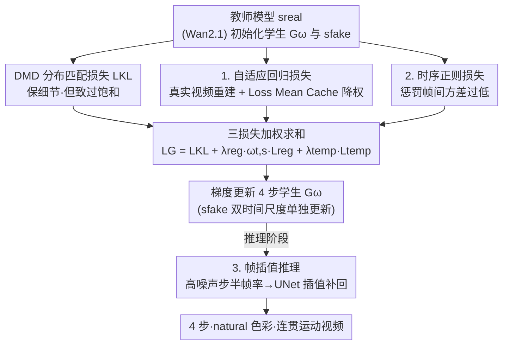

# Adaptive Video Distillation: Mitigating Oversaturation and Temporal Collapse in Few-Step Generation

**会议**: CVPR 2026  
**论文**: [CVF Open Access](https://openaccess.thecvf.com/content/CVPR2026/html/You_Adaptive_Video_Distillation_Mitigating_Oversaturation_and_Temporal_Collapse_in_Few-Step_CVPR_2026_paper.html)  
**代码**: https://github.com/yuyangyou/Adaptive-Video-Distillation  
**领域**: 模型压缩 / 视频扩散蒸馏  
**关键词**: 视频扩散、分布匹配蒸馏、过饱和、时序坍缩、少步生成

## 一句话总结
针对视频扩散模型做 DMD（分布匹配蒸馏）时普遍出现的「颜色过饱和 + 运动坍缩」两大顽疾，本文提出自适应回归损失（用 EMA 缓存动态降权那些偏差过大的真实样本）、时序正则损失（直接惩罚帧间方差过低），再配一个高噪声步降帧率、低噪声步插值补回的推理加速策略，在 Wan2.1-1.3B/14B 上做到 4 步生成，VBench/VBench2 总分超过所有蒸馏 baseline、用户偏好甚至超过 50 步教师。

## 研究背景与动机

**领域现状**：视频扩散模型质量很高，但每步要处理上万个 token、还得迭代几十步，推理极慢，落地必须做蒸馏把它压成 4 步甚至 1 步的学生模型。在图像蒸馏里，DMD（Distribution Matching Distillation，让学生的分布去匹配教师 score 场）因为能保留细节、工业落地多而被广泛采用。

**现有痛点**：视频蒸馏方法极少，大家基本是直接把图像蒸馏搬过来。但 DMD 在图像上就有过饱和和 mode collapse 的老毛病，搬到视频后这两个问题被时间维度放大得更严重：① **过饱和**——教师 score 过度强调局部细节，把学生推向一个颜色过度饱和的次优分布，在自回归视频里还会逐帧累积；② **时序坍缩**——图像里的 mode collapse 在视频里表现为运动幅度变小甚至画面近乎静止，而「不动」对感知质量的破坏远比「空间多样性下降」更致命。

**核心矛盾**：直觉上「加一个回归损失、用真实视频直接监督学生」就能纠偏，但学生同时拟合教师分布、又被偏离教师很远的真实样本拉扯，会收敛到一个不上不下的中间分布，反而产生撕裂、物体融合、复制/消失等更糟的伪影（论文 Fig.4：两只橙色狗在 t=2.5s 融成一团）。所以监督不能一刀切，得「该信的信、该降权的降权」。

**本文目标**：(1) 在引入真实数据监督的同时避免上述中间分布伪影，纠正过饱和；(2) 显式恢复运动动态、对抗时序坍缩；(3) 在不掉质量的前提下进一步压低推理成本。

**核心 idea**：在 DMD 基础上加两个针对性正则——**自适应回归损失**按样本可靠度动态加权地注入真实数据、**时序正则**直接最大化帧间方差防静止；推理时再用「高噪声步降帧率、低噪声步插值还原」省算力。

## 方法详解

### 整体框架

方法建立在 DMD2 的双时间尺度框架上：学生生成器 $G_\omega$ 和用于估计学生分布的在线模型 $s_{fake}$ 都用教师权重初始化，每次更新学生前先多步更新 $s_{fake}$ 让它跟上学生当前的输出分布。在此之上，一次学生更新会同时算三个损失再合起来回传：

1. **分布匹配损失 $L_{KL}$**（沿用 DMD）：从纯噪声+文本条件让学生生成视频，用教师 $s_{real}$ 与在线 $s_{fake}$ 的 score 差作为梯度，把学生拉向教师分布——这是「细节」的来源，也是过饱和的根源；
2. **自适应回归损失 $L_{reg}$**：从真实视频-文本对采样，加噪后让学生重建，与 ground-truth 算回归损失，再用一个按时间步维护的 **Loss Mean Cache** 动态加权——这是「纠正过饱和、注入真实分布」的主力；
3. **时序正则损失 $L_{temp}$**：直接在第 1 步生成的那批视频上算（不额外前向），惩罚帧间方差过低——专治时序坍缩。

整条训练管线每次学生更新只增加**一次额外前向**（回归损失那次重建）。推理阶段再叠加一个解耦的帧插值模块做加速。三损失加权求和后梯度下降更新 $G_\omega$，$s_{fake}$ 用去噪损失单独更新。

### 关键设计

**1. 自适应回归损失：用 EMA 缓存给不可靠真实样本降权，纠正过饱和又不引入撕裂伪影**

痛点是：单靠 DMD 分布匹配会过饱和，但直接加普通回归损失 $L = \|\hat y - y\|_2^2$ 又会因为「真实样本与学生当前分布偏差太大→梯度过猛」而产生撕裂、物体融合等伪影（Fig.4 第三行）。本文的关键在于把回归损失改成**逐样本自适应加权**：偏差越大的点权重越低，让学生只在「可靠、对得齐」的数据区域学，抑制乱拉扯的幻觉更新。

具体地，损失写成 $L = w_{t,s}\,\|\hat\varepsilon_\theta(x_t,t)-\varepsilon\|_2^2$，其中 $w_{t,s}$ 是按时间步 $t$、训练迭代 $s$ 变化的可学习权重。为了判断「当前样本的损失算不算大」，作者对学生少步推理调度里**每个去噪时间步单独维护一个 EMA 损失均值缓存**：

$$\bar L_{t,s} = \omega\, \bar L_{t,s-1} + (1-\omega)\, L_s$$

然后用当前样本损失 $L_s$ 与缓存均值的偏差过一个 Sigmoid 得到权重：

$$w_{t,s} = 1 - \sigma\!\big(k\cdot(L_s - \bar L_{t,s-1})\big),\quad \sigma(x)=\frac{1}{1+e^{-x}}$$

含义很直观：$L_s$ 远高于历史均值（偏差大、不可靠）时 $\sigma\to1$、权重 $w\to0$，这个点几乎不参与更新；$L_s$ 接近或低于均值时权重趋近 1，正常学。$k$ 是缩放因子（论文取 3.0），$\omega$ 是 EMA 系数（取 0.95）。这样学生能平滑地往真实分布靠、压住过曝，还顺带缓解了空间 mode collapse。额外好处：这个回归分支天然支持**蒸馏中同步做有监督微调**——直接在动画/广告等特定域真实数据上算回归损失，就能让学生学到教师都生成不出来的风格（Fig.6 动画风迁移），省掉「先微调教师再蒸馏」的两段式流程。

**2. 时序正则损失：直接最大化帧间方差，专治运动幅度坍缩成静止**

痛点是：自适应回归损失主要救的是空间维度，对时间维度监督很弱，而视频里 mode collapse 表现为运动变小甚至画面几乎不动，这种「静止」对感知质量的杀伤比空间多样性下降大得多。本文不绕弯，直接对生成视频沿时间维计算方差并惩罚其过低：

$$L_{temp} = -\log\!\big(\mathbb{E}_{x\sim p_\omega}[\mathrm{Var}(x)] + \vartheta\big)$$

$\mathrm{Var}(x)$ 沿时间维计算，$\vartheta$ 是数值稳定常数。方差越小（越接近静止）损失越大，从而逼着学生产生有意义的运动。这一项就在算分布匹配损失那批生成视频上计算，**不增加额外前向**。一个工程细节：为防止它在模型逃离坍缩区后反过来主导优化（一味追求大方差会带来抖动），损失在收敛到足够多样的时序分布后被**截断**（实测收敛到约 0.6 时停）。消融显示：去掉它，Dynamic Degree（按光流幅度估计有意义运动的视频占比）相比 DMD 暴跌十多个百分点；加上后几乎所有生成视频都有有意义的运动。

**3. 解耦帧插值推理：高噪声步只算半帧率，低噪声步再插值补回，省 30% 推理**

痛点是：4 步已经很少，但每步仍要处理整段视频的全部帧，算力大。作者观察到去噪过程有「分工」——高噪声步主要生成粗粒度语义、帧间特征方差极小（即此时相邻帧高度相似），低噪声步才精修细节。既然高噪声阶段帧间冗余高，那里就没必要按全帧率算。于是对 4 步调度，**前两步（高噪声）把帧率降一半**做去噪，在第三步之前用一个轻量、预训练好的 **UNet 插值模块**在 VAE 隐空间里把序列插回原帧率，后续低噪声步顺带把插值引入的瑕疵抹掉。这个 UNet 是在真实数据上用回归损失预训练的，任务是从相邻帧预测中间帧特征，插值本身只要几百毫秒。效果：1.3B 模型单步去噪 2.7s，半帧率降到 1.1s，整体推理加速约 30%、感知质量几乎不掉。

### 损失函数 / 训练策略
最终损失为三项加权和：
$$L_G = L_{KL} + \lambda_{reg}\, w_{t,s}\, L_{reg} + \lambda_{temp}\, L_{temp}$$
其中 $w_{t,s}$ 即设计 1 的自适应权重。超参：AdamW，$lr=2\times10^{-6}$，EMA 衰减 $\omega=0.95$，$k=3.0$，$\lambda_{reg}=2.0$，$\lambda_{temp}=0.05$，CFG scale=5.0，时序正则收敛到约 0.6 后截断。回归损失在自建清洗的 15 万条高质量视频子集上算；分布匹配损失只用文本条件、不直接用视频数据（沿用 DMD2）。$s_{fake}$ 按 DMD2 双时间尺度规则在每次学生更新前多步更新。全程 24 卡训练，教师为 Wan2.1-T2V-1.3B/14B，学生产出 5 秒、16fps、832×480 视频。

## 实验关键数据

### 主实验

VBench2 + VBench1 上对比各蒸馏方法（同一教师、各自训练配置对应的推理步数）。1.3B 教师 50×2 步要 270s，本文 4 步仅 7.8s：

| 模型(1.3B) | 步数 | 推理时间 | VBench2 Total | VBench1 Total |
|--------|------|---------|---------------|---------------|
| Teacher | 50×2 | 270s | 50.99 | 80.13 |
| DMD\*（baseline） | 4 | 10.8s | 53.63 | 80.66 |
| LCM | 6 | 16.2s | 40.12 | 72.12 |
| DCM | 6 | 16.2s | 51.80 | 73.92 |
| rCM | 4 | 10.8s | 54.03 | 80.15 |
| **Ours** | 4 | **7.8s** | **55.08** | **81.35** |

14B 上同样领先（本文 VBench2 Total 59.06 vs DMD\* 56.87、Teacher 52.14；VBench1 Total 82.57 vs Teacher 81.64），且本文 4 步 22.2s 远快于 DMD\* 的 28s 和教师的 730s。Human Fidelity 维度提升最显著（1.3B：88.26 vs DMD\* 86.75；14B：89.00），印证运动对齐与感知真实感更好。用户研究（12 名标注员、180 对比样本、多数票）显示本文不仅胜过所有 baseline，**偏好甚至超过 50 步教师**。

### 消融实验

基于 1.3B DMD baseline，逐项加组件（Instance Preservation 衡量物体时序一致性，越低说明融合/分裂/突现/消失越多；Dynamic Degree 衡量有意义运动的视频占比）：

| 配置 | 步数 | 时间 | Instance Preservation | Dynamic Degree |
|------|------|------|----------------------|----------------|
| Teacher | 50×2 | 270s | 92.39 | 85.56 |
| DMD | 4 | 10.8s | 88.88 | 72.22 |
| +TR（时序正则） | 4 | 10.8s | 85.38 | 100.00 |
| +TR+RegLoss（普通回归） | 4 | 10.8s | 83.04 | 78.61 |
| +TR+AdaLoss（自适应回归） | 4 | 10.8s | **92.39** | 99.72 |
| Full+VIF（再加帧插值） | 4 | **7.8s** | 91.81 | 97.77 |

### 关键发现
- **普通回归损失会帮倒忙**：+TR+RegLoss 的 Instance Preservation 从 85.38 进一步掉到 83.04，正是「真实样本偏差大→撕裂/物体畸变」的量化证据；换成自适应加权后猛涨到 92.39，与教师持平、还超过 DMD baseline——说明「按可靠度降权」才是关键，不是「加真实监督」本身。
- **时序正则对运动几乎是开关级影响**：DMD 的 Dynamic Degree 仅 72.22，加 TR 后冲到 100.00（几乎所有视频都有有意义运动），直接坐实了它对抗时序坍缩的作用。
- **帧插值是近乎免费的加速**：Full+VIF 把时间从 10.8s 压到 7.8s（约省 30%），Instance Preservation 仅从 92.39 微降到 91.81、Dynamic Degree 99.72→97.77，质量损失可忽略。

## 亮点与洞察
- **「降权而非加监督」的视角很巧**：大家都想加真实数据救过饱和，本文指出关键矛盾是「偏差大的真实样本会过度更新」，用 per-timestep EMA 缓存 + Sigmoid 把不可靠样本权重压到接近 0，这套自适应加权思路可迁移到任何「教师分布与真实数据并行监督」的蒸馏场景。
- **时序正则简单到「直接惩罚方差」却有效**：没有引入复杂的运动建模或光流监督，仅一行 $-\log(\mathbb{E}[\mathrm{Var}(x)]+\vartheta)$ 就把 Dynamic Degree 拉满，还配了「收敛后截断防过度抖动」的工程细节，是少有的「大道至简」型设计。
- **回归分支顺手支持域微调**：因为自适应回归损失本身就在真实数据上算，换成特定域数据就等于蒸馏中同步做 SFT，省掉「先微调教师再蒸馏」两段式，动画风迁移效果是教师都做不到的——一个损失干两件事。
- **「高噪声步帧间冗余高」的观察值钱**：把扩散去噪的语义/细节分工映射到帧率上，高噪声阶段降帧率几乎不损质量，这种「按去噪阶段差异化分配算力」的思路对其它视频加速也有启发。

## 局限与展望
- **超参较多且需调**：$k$、$\lambda_{reg}$、$\lambda_{temp}$、EMA $\omega$、时序正则截断阈值（约 0.6）都是经验设定，换教师/数据集后稳定性如何论文未充分讨论。⚠️ 截断到 0.6 这个值的鲁棒性以原文 appendix 为准。
- **依赖额外真实数据与预训练插值网络**：回归损失需要 15 万条清洗后的高质量视频，帧插值还要单独预训练一个 UNet，整体不是纯「无数据蒸馏」，复现成本不低。
- **时序正则可能偏好「运动多」而非「运动对」**：最大化帧间方差只保证「动起来」，不保证运动语义正确，理论上存在为刷 Dynamic Degree 而产生无意义抖动的风险（截断缓解但未根治）。
- **评测局限**：主要在 VBench/VBench2 自动指标 + 小规模用户研究（12 人、180 样本）上验证，长视频上的误差累积是否真被压住缺少专门的长程实验。

## 相关工作与启发
- **vs DMD / DMD2**: 本文直接构建在 DMD2 双时间尺度框架上，DMD 强在细节、弱在过饱和与 mode collapse；本文不改 DMD 主干，而是叠加自适应回归 + 时序正则两个正则项专门补这两个短板，属于「在强 baseline 上做针对性外科手术」。
- **vs rCM（consistency 系蒸馏）**: consistency 蒸馏 mode coverage 好、多样性高，但细节保真常打折；本文走 distribution-matching 路线保细节，再用正则补多样性/运动，主实验上 Total 全面略胜 rCM（1.3B VBench2 55.08 vs 54.03）。
- **vs 把 DMD 与对抗目标/consistency 损失结合的图像方法**: 那些工作在图像域缓解过饱和/mode collapse，本文指出视频的时序坍缩需要单独处理，提出的时序正则正是图像方法里没有的维度。

## 评分
- 新颖性: ⭐⭐⭐⭐ 首个专为视频扩散设计的 DMD 蒸馏，自适应加权 + 时序方差正则 + 解耦帧插值三件套针对性强，但每件单看都是已有思路的巧妙组合。
- 实验充分度: ⭐⭐⭐⭐ 双 benchmark、两个规模教师、消融清晰、含用户研究与效率分析；长视频误差累积与超参鲁棒性验证略欠。
- 写作质量: ⭐⭐⭐⭐ 问题定位（过饱和/时序坍缩成因）讲得透，图 3/4 把机制可视化清楚；部分公式符号在 OCR 下偏乱需对照原文。
- 价值: ⭐⭐⭐⭐ 4 步、超教师偏好、可省 30% 推理且支持域微调，工业落地价值高。

<!-- RELATED:START -->

## 相关论文

- [\[CVPR 2026\] Phased DMD: Few-step Distribution Matching Distillation via Score Matching within Subintervals](phased_dmd_few-step_distribution_matching_distillation_via_score_matching_within.md)
- [\[ICLR 2026\] π-Flow: Policy-Based Few-Step Generation via Imitation Distillation](../../ICLR2026/model_compression/pi-flow_policy-based_few-step_generation_via_imitation_distillation.md)
- [\[CVPR 2026\] Mitigating The Distribution Shift of Diffusion-based Dataset Distillation](mitigating_the_distribution_shift_of_diffusion-based_dataset_distillation.md)
- [\[NeurIPS 2025\] Mitigating Semantic Collapse in Partially Relevant Video Retrieval](../../NeurIPS2025/model_compression/mitigating_semantic_collapse_in_partially_relevant_video_retrieval.md)
- [\[CVPR 2026\] Content-Adaptive Hierarchical Hyperprior for Neural Video Coding](content-adaptive_hierarchical_hyperprior_for_neural_video_coding.md)

<!-- RELATED:END -->
