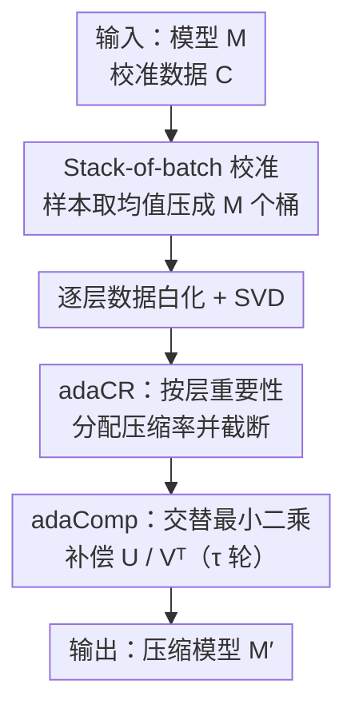

# AdaSVD: Singular Value Decomposition with Adaptive Mechanisms for Large Multimodal Models

**会议**: CVPR 2026  
**论文**: [CVF Open Access](https://openaccess.thecvf.com/content/CVPR2026/html/Li_AdaSVD_Singular_Value_Decomposition_with_Adaptive_Mechanisms_for_Large_Multimodal_CVPR_2026_paper.html)  
**代码**: 待开源（作者承诺公开 code 与 models）  
**领域**: 模型压缩  
**关键词**: SVD 压缩, 低秩分解, 截断误差补偿, 自适应压缩率, 大多模态模型  

## 一句话总结
AdaSVD 用「交替最小二乘补偿被截断的奇异矩阵」+「按层重要性自适应分配压缩率」两招，把基于 SVD 的大多模态模型压缩在高压缩率（60%+）下的精度损失大幅压下来，在 LLaMA2/OPT/Mistral/Vicuna 上全面超过 SVD-LLM。

## 研究背景与动机
**领域现状**：大多模态/大语言模型动辄数十 B 参数，部署到手机、IoT 这类内存受限设备非常吃力。在量化、剪枝、低秩分解等压缩路线里，基于 **SVD 的低秩分解** 很有吸引力——它把大权重矩阵 $W$ 拆成两个小矩阵相乘，**不需要专用硬件 / 自定义算子**（与量化不同），跨平台通用，而且和量化、剪枝正交可叠加。

**现有痛点**：现有 SVD 压缩方法（FWSVD 用 Fisher 信息加权、ASVD 考虑激活分布、SVD-LLM 用数据白化建立奇异值与压缩损失的关系）在低压缩率下尚可，但**一旦压到 60% 以上就崩**——困惑度从两位数飙到上千甚至上万，生成内容退化成乱码。

**核心矛盾**：作者复盘后指出两个被忽视的点。其一，**截断之后没人去补偿**：当你把 $U$ 和 $V^\top$ 里最小的奇异向量砍掉，剩下的部分本应跟着调整以最小化误差，但已有方法基本没认真做这件事。其二，**所有层用同一个压缩率**：Transformer 各层重要性差异巨大（实测 OPT-6.7B 最重要层 / 最不重要层的重要性比高达 386×），一刀切必然在重要层上损失过头。

**本文目标**：(1) 截断后有效补偿，把压缩误差稳定降下来；(2) 在总压缩率固定的前提下，按层自适应分配压缩率。

**切入角度**：把「补偿截断误差」重新表述成一个可解的最小二乘问题（而非简单求逆），并用伪逆保证数值稳定；把「层重要性」量化成输入输出的相似度，再线性映射到每层的保留率。

**核心 idea**：用「交替更新奇异矩阵做误差补偿（adaComp）+ 按层重要性自适应分配压缩率（adaCR）」替代「截断即止、均匀压缩」，闭合压缩模型与原模型之间的性能差距。

## 方法详解

### 整体框架
AdaSVD 是一个**后训练（post-training）、无需反向传播重训**的 SVD 压缩管线。输入是待压缩模型 $M$ 和一小批校准数据 $C$，输出是压缩后的模型 $M'$。整条流程（对应原文 Algorithm 1）是：先从校准集采样，用 **stack-of-batch** 把样本压成固定数量的「桶」以省显存；对每层做数据白化后逐层 SVD；由 **adaCR** 根据该层重要性决定保留多少奇异向量再截断；最后由 **adaComp** 用交替最小二乘对截断后的 $U,V^\top$ 做多轮补偿更新。三个贡献（stack-of-batch 校准、adaCR、adaComp）分别解决「校准数据不够」「该压多少」「截断误差怎么补」三件事。

### 关键设计

**1. adaComp：把截断后的奇异矩阵当最小二乘问题，用伪逆交替补偿**

痛点直说：SVD 把权重拆成 $W=U\Sigma V^\top$ 后，只保留前 $k$ 个最大奇异值得到 $\widehat{W}=U_k\Sigma_k V_k^\top$；问题是「只截断、不补偿」并没有真正最小化**实际推理时**的误差。作者把误差定义到激活上而非权重本身：

$$\mathcal{L}_{\text{SVD}}=\|\widehat{W}X-WX\|_F^2=\|U_k^\sigma (V_k^\sigma)^\top X - WX\|_F^2$$

其中 $\Sigma_k$ 被吸收进 $U_k^\sigma=U_k\Sigma_k^{1/2}$、$V_k^\sigma=V_k\Sigma_k^{1/2}$。最直接的做法是对 $U_k^\sigma$、$V_k^\sigma{}^\top$ 求偏导置零，但闭式解里含矩阵求逆 $\big((V_k^\sigma)^\top XX^\top V_k^\sigma\big)^{-1}$，在病态情况下数值不稳、反而把误差放大。

AdaSVD 的关键是**把更新改写成最小二乘估计（LSE）+ Moore-Penrose 伪逆**。以更新 $U_k^\sigma$ 为例，令 $A=X^\top V_k^\sigma$、$B=(WX)^\top$，问题变成 $\min_{U_k^\sigma}\|A (U_k^\sigma)^\top - B\|_F^2$；先对 $A=U_A\Sigma_A V_A^\top$ 做 SVD，再用伪逆给出闭式解：

$$U_k^\sigma=(A^+B)^\top=(V_A\Sigma_A^+ U_A^\top B)^\top$$

其中 $\Sigma_A^+$ 只对非零奇异值取倒数（$\sigma_i^{-1}\mathbb{1}_{\sigma_i\neq 0}$），天然规避了求逆爆炸。$V_k^\sigma{}^\top$ 同理用 $U_k^\sigma$ 的伪逆更新。两者**交替迭代** $(U_k^\sigma)_1\to(V_k^\sigma{}^\top)_1\to(U_k^\sigma)_2\to\dots$ 直到收敛。为什么有效：伪逆把「求逆的不稳定更新曲线」换成「平滑、单调下降」的更新（原文 Fig.3a），实测补偿后压缩与原模型输出分布的重叠度从 0.9504 升到 0.9980，几轮交替就显著缩小差距。

**2. Stack-of-batch 校准：在显存受限下塞进更多校准样本**

痛点：adaComp 的更新公式里带校准数据 $X$，样本越多补偿越准；但实测在 80GB GPU 上 $X$ 扩到 32 个样本就吃不消了。常规做法要么样本太少、要么 OOM。

做法是不增加显存的前提下「浓缩」更多样本。给定 $N$ 个校准样本和桶大小 $M$（显存能容纳的上限），先打乱，再把每 $\text{mini\_bsz}=\lceil N/M\rceil$ 个样本**取均值**塞进一个桶：

$$X'[k]=\frac{1}{\text{mini\_bsz}}\sum_{i=1}^{\text{mini\_bsz}} X_{\text{rand}}[(k-1)\cdot\text{mini\_bsz}+i]$$

得到 $|X'|=M$ 个桶。这样固定显存占用，却让补偿用上了远多于 $M$ 个原始样本的统计信息。为什么有效：截断误差的补偿本质依赖输入激活的二阶统计，对样本取均值近似保留了这些统计而成本恒定，原文 Fig.3b 显示叠加 stack-of-batch 后压缩误差进一步下降。

**3. adaCR：按层重要性自适应分配压缩率，而非一刀切**

痛点：均匀压缩率无视了各层重要性差异——而这个差异极大（OPT-6.7B 达 386×，且第一层几乎总是最重要）。重要层被压太狠就拖垮整体。

AdaSVD 用「权重对输入的影响」度量层重要性，即输入 $X$ 与输出 $Y=WX$ 的相似度（用余弦相似度）：

$$I(W)=\text{similarity}(X,\,WX),\qquad I_n(W)=I(W)/\text{mean}(I(W))$$

均值归一化后平均重要性为 1，$>1$ 表示更重要。再把相对重要性线性映射到该层的**保留率**：

$$\text{CR}(W)=\text{mrr}+I_n(W)\cdot(\text{trr}-\text{mrr})$$

$\text{trr}$、$\text{mrr}$ 分别是目标 / 最小保留率：$I_n=1$ 时 $\text{CR}=\text{trr}$，$I_n=0$ 时 $\text{CR}=\text{mrr}$。每层据此从 $U_k^\sigma$、$V_k^\sigma{}^\top$ 截掉最小奇异向量，使 $\text{CR}(W_i)=\frac{\#\text{params}(U_k^\sigma)+\#\text{params}(V_k^\sigma{}^\top)}{\#\text{params}(W_i)}$。为什么有效：在**总压缩率固定**下把预算多分给重要层、少分给冗余层，等于在同样内存预算里换来更高精度——LLaMA 系列重要性曲线呈「碗形」（首尾层都重要），adaCR 正好保护两端。

### 损失函数 / 训练策略
全程后训练、无梯度反传，只用 256 个 WikiText-2 样本做校准并先做数据白化（沿用 ASVD / SVD-LLM 设定）。adaComp 与 SVD-LLM 的数据白化正交可叠加。交替更新轮数 $\tau$ 是关键超参：低压缩率（40/50/60%）下 **1 轮就超过 SVD-LLM**，迭代过多会因校准数据有限而过拟合掉点；高压缩率（70/80%）下多迭代才进一步涨点。全部实验在单张 A100-80GB 上完成。

## 实验关键数据

### 主实验
LLaMA2-7B 在不同压缩率下（困惑度↓越低越好，常识推理平均准确率↑越高越好）：

| 压缩率 | 方法 | WikiText-2↓ | PTB↓ | C4↓ | 5 任务平均Acc↑ |
|--------|------|------------|------|-----|--------------|
| 0% | Original | 5.68 | 8.35 | 7.34 | 68.85 |
| 40% | SVD-LLM | 16.11 | 719.44 | 61.95 | 40.69 |
| 40% | **AdaSVD** | **14.76** (↓8%) | **304.62** (↓58%) | **56.98** | **42.63** |
| 50% | SVD-LLM | 27.19 | 1,772.91 | 129.66 | 37.83 |
| 50% | **AdaSVD** | **25.58** | **593.14** (↓67%) | **113.84** | **39.17** |
| 60% | SVD-LLM | 89.90 | 2,052.89 | 561.00 | 35.48 |
| 60% | **AdaSVD** | **50.33** (↓44%) | **1,216.95** | **239.18** (↓57%) | **36.87** |

压缩率越高优势越大：60% 时 WikiText-2 困惑度相对 SVD-LLM 降 44%、C4 降 57%。

跨模型（60% 压缩率，WikiText-2 困惑度↓）：

| 方法 | OPT-6.7B | LLaMA2-7B | Mistral-7B | Vicuna-7B |
|------|----------|-----------|------------|-----------|
| SVD | 18,607 | 65,187 | 30,378 | 78,705 |
| FWSVD | 8,570 | 27,213 | 5,481 | 8,186 |
| ASVD | 10,326 | 10,004 | 22,706 | 20,241 |
| SVD-LLM | 92.10 | 89.90 | 72.17 | 64.06 |
| **AdaSVD** | **86.64** (↓6%) | **50.33** (↓44%) | **67.22** (↓7%) | **56.97** (↓11%) |

FWSVD、ASVD 在 60% 压缩率下基本失效（困惑度上千上万），SVD-LLM 与 AdaSVD 能维持可用，AdaSVD 在四个家族上一致领先且更稳定。VLM 侧把 SVD 压缩施加到 LLaVA-7B 的语言部分（占模型大头），40% 压缩率下 COCO 图像描述质量明显优于 SVD / SVD-LLM。

### 消融实验
LLaMA2-7B，WikiText-2 困惑度↓：

| 配置 | 40% | 50% | 60% | 说明 |
|------|-----|-----|-----|------|
| AdaSVD (full) | 14.76 | 25.58 | 50.33 | 完整模型 |
| w/o adaComp | 15.47 | 30.00 | 78.82 | 去补偿，60% 时从 50.33 退到 78.82 |
| w/o adaCR (均匀压缩率) | 15.38 | 27.33 | 69.46 | 去自适应压缩率，60% 时退到 69.46 |
| SVD-LLM (baseline) | 16.11 | 27.19 | 89.90 | 即便去掉两组件仍多数优于它 |

adaComp 迭代轮数（WikiText-2↓）：40% 时 1 轮 14.76 最好、3/15 轮反而升到 15.47/15.84（过拟合）；60% 时 1 轮 50.33、3/15 轮升到 64.12/62.34——低压缩率宜少迭代，高压缩率才需更多。

### 关键发现
- **adaComp 是涨点主力**，且压缩率越高越关键：60% 下去掉 adaComp 困惑度从 50.33 恶化到 78.82，远大于去掉 adaCR（69.46）。
- 迭代轮数与校准数据量需平衡：校准样本有限时多迭代会过拟合，低压缩率下 1 轮即最优。
- 层重要性差异巨大（OPT-6.7B 达 386×），第一层几乎总是最重要，LLaMA 系列呈「碗形」首尾层都重要——这是 adaCR 有效的根因。

## 亮点与洞察
- **把「截断后补偿」从求逆改写成 LSE + Moore-Penrose 伪逆**，是全文最关键的工程洞见：同一个优化目标，换成伪逆求解就把不稳定的更新曲线变成平滑单调下降，这个 trick 可迁移到任何需要在病态矩阵上做闭式更新的低秩压缩。
- **stack-of-batch 用「取均值压成桶」绕开显存墙**，在恒定显存里塞进更多校准统计——朴素但实用，适用于一切依赖校准数据二阶统计的后训练压缩/量化。
- **用「输入输出余弦相似度」当层重要性代理**，免梯度、免 Hessian，计算极轻，却抓住了「重要层该少压」的核心；线性映射到保留率的写法简洁可控（trr/mrr 两个旋钮）。
- adaComp 与数据白化正交可叠加，说明它是补在白化之上的「最后一公里」补偿，而非替代既有路线。

## 局限与展望
- 校准数据规模仍是瓶颈：stack-of-batch 缓解了显存问题，但取均值是有损近似，迭代过多就过拟合，说明补偿质量受限于校准数据的覆盖度。
- ⚠️ 论文主表多以困惑度和 5 个常识 QA 评估，VLM（LLaVA）侧主要给定性图像描述对比，缺少 VLM 多模态基准（如 VQA/COCO caption 指标）的定量数字，多模态压缩效果的量化证据偏弱。
- adaCR 用余弦相似度做重要性代理较简单，是否对所有层类型（attention vs MLP、不同模态分支）都最优未充分探讨。
- 报告主要在 7B 级模型，更大规模（70B）与端侧实测推理加速 / 内存占用的真实收益未给出。

## 相关工作与启发
- **vs SVD-LLM**：SVD-LLM 用数据白化建立奇异值与压缩损失的关系、截断最小奇异值；AdaSVD 在其白化基础上**追加截断后补偿**并**自适应分层压缩率**，因此在高压缩率（60%+）下差距被拉开，且二者正交可叠加。
- **vs ASVD / FWSVD**：ASVD 用对角缩放考虑激活分布、FWSVD 用 Fisher 信息加权参数重要性，但都未做截断后补偿、且 60% 压缩率下基本失效；AdaSVD 把重心放在「补偿 + 分层」，稳健性显著更强。
- **vs 量化 / 剪枝（GPTQ/AWQ/SparseGPT/LLM-Pruner）**：那些路线常需自定义 CUDA 算子才能拿到实际加速且硬件兼容性受限；SVD 路线无需专用硬件、跨平台且与量化剪枝正交，AdaSVD 进一步把 SVD 路线的精度短板补上。

## 评分
- 新颖性: ⭐⭐⭐⭐ 把截断补偿改写成 LSE+伪逆、加上轻量层重要性自适应压缩率，组合清晰有效，但单点创新偏工程改良。
- 实验充分度: ⭐⭐⭐⭐ 覆盖 4 模型 3 数据集多压缩率、消融到位；VLM 侧定量评估偏少。
- 写作质量: ⭐⭐⭐⭐ 动机—观察—方法链条清楚，公式与图示对应良好。
- 价值: ⭐⭐⭐⭐ 高压缩率下精度大幅改善、免重训免专用硬件，对端侧部署实用价值高。

<!-- RELATED:START -->

## 相关论文

- [\[ICML 2026\] Quantifying the Uncertainty of Foundation Models with Singular Value Ensembles](../../ICML2026/model_compression/quantifying_the_uncertainty_of_foundation_models_with_singular_value_ensembles.md)
- [\[CVPR 2026\] CoIn: Coverage and Informativeness-Guided Token Reduction for Efficient Large Multimodal Models](coin_coverage_and_informativeness-guided_token_reduction_for_efficient_large_mul.md)
- [\[NeurIPS 2025\] Hankel Singular Value Regularization for Highly Compressible State Space Models](../../NeurIPS2025/model_compression/hankel_singular_value_regularization_for_highly_compressible_state_space_models.md)
- [\[CVPR 2026\] Attention-aware Inference Optimizations for Large Vision-Language Models with Memory-efficient Decoding](attention-aware_inference_optimizations_for_large_vision-language_models_with_me.md)
- [\[CVPR 2026\] Quant Experts: Token-aware Adaptive Error Reconstruction with Mixture of Experts for Large Vision-Language Models Quantization](quant_experts_token_aware_vlm_quantization.md)

<!-- RELATED:END -->
