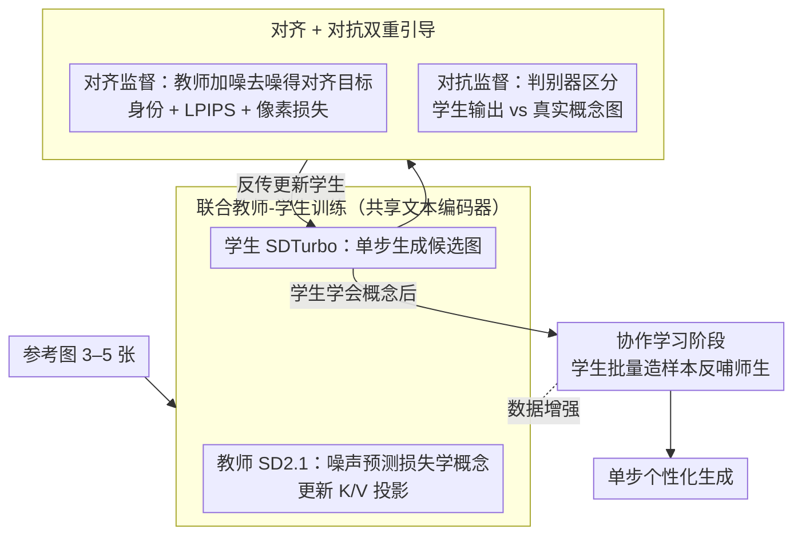

# Adversarial Concept Distillation for One-Step Diffusion Personalization

**会议**: CVPR 2026 Findings  
**arXiv**: [2510.20512](https://arxiv.org/abs/2510.20512)  
**代码**: [https://liulisixin.github.io/OPAD/](https://liulisixin.github.io/OPAD/)  
**领域**: 模型压缩  
**关键词**: 单步扩散模型, 概念学习, 对抗蒸馏, 个性化生成, 加速推理

## 一句话总结
OPAD 首次解决单步扩散模型的个性化问题（1-SDP），通过教师-学生联合训练 + 对齐损失 + 对抗监督实现单步高质量概念生成，并引入协作学习阶段利用学生生成样本反馈增强双方。

## 研究背景与动机
1. **领域现状**：大规模生成模型在T2I生成中占据主导地位，个性化生成（新概念学习）是重要应用。蒸馏加速技术已能将推理步数压缩到1步。
2. **现有痛点**：将传统个性化方法（如Textual Inversion、Custom Diffusion、IP-Adapter）应用到单步扩散模型时完全失效——文字反转无法学习token，权重优化反而降低质量，编码器方法也无法泛化。
3. **核心矛盾**：三大挑战——（i）学生不可适应性：单步模型无法独立有效学习文本token；（ii）教师不可靠性：教师本身可能无法准确捕获某些概念；（iii）低效性：多步生成和非端到端蒸馏显著降低学习速度。
4. **本文目标**：设计首个能在单步扩散模型上实现可靠、高质量个性化的框架。
5. **切入角度**：将个性化和加速视为联合优化问题，而非顺序执行的两步流程。
6. **核心idea**：教师-学生联合训练，学生通过对齐损失（匹配教师输出）和对抗损失（匹配真实图像分布）双重引导实现概念学习。

## 方法详解

### 整体框架
OPAD 要在一个**单步**扩散模型（SDTurbo）上学会用户给的新概念——而过去的个性化方法（Textual Inversion、Custom Diffusion、IP-Adapter）搬到单步模型上几乎全部失效。作者的破题思路是不让单步学生独自硬学，而是拉一个多步教师（SD2.1）来"扶着"它，把个性化和加速当成一个联合优化问题同时做，而不是先个性化、再蒸馏的两段流程。

具体怎么转：教师和学生**共享同一个文本编码器**一起训练，每次迭代走三步——教师先用几张参考图按噪声预测损失把新概念学进自己的权重；学生单步生成一张图，这张图被送回教师做对齐监督，同时被一组判别器拿去和真实概念图对比；最后判别器更新。等学生学会以后，再开一个协作学习阶段，让学生用它的单步生成能力批量造样本反哺双方。训练完，学生一步就能生成个性化内容。

### 关键设计

**1. 联合教师-学生训练：把"先学概念再蒸馏"压成一次端到端优化**

顺序流程（教师先慢慢学会概念，再蒸馏给学生）既慢又不可靠——教师本身可能没把某个概念学准，错误会原样传给学生。OPAD 让两者并行：教师按 Custom Diffusion 范式用参考图学新概念，学生每步的输出经教师前向加噪后再由教师去噪，得到 $x_0^{tc}$ 当作学生的对齐目标。关键是两个模型**共享文本编码器**，只更新各自注意力的 key/value 投影层——共享编码器把语言-视觉表示锁在同一个空间里，教师学到的概念语义能直接被学生读懂，知识转移因此更稳；联合训练也省掉了"等教师先收敛"的串行等待。

**2. 对齐 + 对抗双重引导：对齐保概念、对抗保画质**

只让学生去逼近教师的去噪输出（对齐）会有个问题：教师本身是多步模型，单步学生硬拟合它的中间目标容易得到偏糊的结果。所以 OPAD 在对齐之外再加一路对抗监督。对齐损失由三部分组成——身份特征损失 $\mathcal{L}_{id}$（用 CLIP 图像编码器算余弦相似度，盯概念身份）、LPIPS 感知损失 $\mathcal{L}_{lpips}$、像素级 $\mathcal{L}_{mse}$；对抗那一路则用一组判别器，逼学生的单步输出去骗过判别器，使其和真实概念图不可区分。对齐负责"长得像这个概念"，对抗负责"看起来是张真图"，两者合起来才同时拿住概念保真度和生成质量——消融里去掉对抗损失质量会显著掉，是整套方法成立的关键。

**3. 协作学习阶段：让学会的学生反过来造数据，喂回师生双方**

新概念学习天生数据稀缺，用户通常只给 3–5 张参考图，样本太少限制了双方能学到的上限。OPAD 利用学生一旦学会概念后**单步生成又快又准**这个特性，让它快速合成一批额外的概念样本，把这些样本当数据增强**同时**喂回教师和学生继续训练，形成一个互利循环。这一步不只提升学生——消融显示教师性能也跟着涨，因为更丰富的样本让教师对概念的刻画也更稳。换句话说，加速带来的副产品（高效生成）被回收成了解决数据稀缺的工具。

### 一个完整示例：从 5 张参考图到单步生成
以"某只特定的玩具狗"为例走一遍。用户给 5 张参考图，先进联合训练：每轮里教师用这 5 张图按噪声预测损失把"这只狗"学进 key/value 投影；学生针对同一概念单步生成一张候选图，这张图经教师加噪去噪得到对齐目标 $x_0^{tc}$，对齐损失逼学生在身份/感知/像素三个层面贴近它，同时一组判别器把学生输出和真实参考图比对、用对抗损失把它往"真图"推。迭代到学生能稳定单步画出这只狗后，进入协作学习阶段：学生快速生成一批新的"这只狗"样本（远多于原始 5 张），这些合成样本和原图一起再喂回师生继续训练。最终学生只需一步前向就能按新文本提示（如"这只狗在沙滩上"）生成保持概念身份的图像。

### 损失函数 / 训练策略
教师损失：标准噪声预测损失 $\mathcal{L}_{rec}$。学生损失：$\mathcal{L}_{id}$（身份特征）+ $\mathcal{L}_{lpips}$（感知）+ $\mathcal{L}_{mse}$（像素）+ $\mathcal{L}_{adv}$（对抗）。判别器用反向对抗损失训练。三方（教师、学生、判别器）按迭代轮流更新。

## 实验关键数据

### 主实验

| 方法 | 模型 | DINO-I↑ | CLIP-I↑ | CLIP-T↑ | 说明 |
|------|------|---------|---------|---------|------|
| Textual Inversion | SDTurbo | 失败 | 失败 | - | 完全无法学习 |
| Custom Diffusion | SDTurbo | 失败 | 失败 | - | 质量反而下降 |
| IP-Adapter | TCD+SDXL | 低 | 低 | - | 概念保真度差 |
| OPAD (ours) | SDTurbo | 最优 | 最优 | 最优 | 首次成功 |

### 消融实验

| 配置 | 关键指标 | 说明 |
|------|---------|------|
| Full OPAD | 最优 | 完整模型 |
| w/o 对抗损失 | 显著下降 | 对抗监督是成功的关键 |
| w/o 协作学习 | 下降 | 数据增强有效提升 |
| w/o 共享文本编码器 | 下降 | 统一语义空间很重要 |

### 关键发现
- 所有现有个性化方法在1-SDP设置下完全失败，OPAD是首个成功方案。
- 对抗损失是成功的关键——没有它，学生无法生成高质量的个性化图像。
- 协作学习阶段不仅提升了学生，也提升了教师的性能，形成了真正的互利。
- OPAD也支持2步、4步等少步个性化生成作为额外收益。

## 亮点与洞察
- **识别并定义了1-SDP这个新问题**，填补了加速推理×个性化的交叉空白。
- **协作学习的设计**非常巧妙：学生的高效生成能力天然适合做数据增强。
- 证明了单步扩散模型的内部表示与多步模型有本质差异，不能简单迁移技术。

## 局限与展望
- 依赖SD2.1作为教师和SDTurbo作为学生，对其他模型的泛化性未验证。
- 仍需3-5张参考图像，纯zero-shot场景不适用。
- 训练速度虽优于顺序蒸馏，但联合训练仍有一定计算开销。

## 相关工作与启发
- **vs DreamBooth**: DreamBooth对多步模型有效但无法迁移到单步模型，OPAD通过联合蒸馏解决了这一问题。
- **vs ADD/SDXL-Turbo**: 这些加速方法不涉及个性化，OPAD将加速和个性化统一。

## 评分
- 新颖性: ⭐⭐⭐⭐⭐ 首次定义并解决1-SDP问题，教师-学生协作学习新颖
- 实验充分度: ⭐⭐⭐⭐ DreamBench评估充分，但缺少更多概念类型测试
- 写作质量: ⭐⭐⭐⭐ 问题定义清晰，挑战分析透彻
- 价值: ⭐⭐⭐⭐⭐ 开辟了新的研究方向，实际应用价值高

<!-- RELATED:START -->

## 相关论文

- [\[NeurIPS 2025\] One-Step Diffusion-Based Image Compression with Semantic Distillation](../../NeurIPS2025/model_compression/one-step_diffusion-based_image_compression_with_semantic_distillation.md)
- [\[CVPR 2026\] BinaryAttention: One-Bit QK-Attention for Vision and Diffusion Transformers](binaryattention_one-bit_qk-attention_for_vision_and_diffusion_transformers.md)
- [\[ICML 2026\] Toward Understanding Adversarial Distillation: Why Robust Teachers Fail](../../ICML2026/model_compression/toward_understanding_adversarial_distillation_why_robust_teachers_fail.md)
- [\[CVPR 2026\] Mitigating The Distribution Shift of Diffusion-based Dataset Distillation](mitigating_the_distribution_shift_of_diffusion-based_dataset_distillation.md)
- [\[CVPR 2026\] Adaptive Video Distillation: Mitigating Oversaturation and Temporal Collapse in Few-Step Generation](adaptive_video_distillation_mitigating_oversaturation_and_temporal_collapse_in_f.md)

<!-- RELATED:END -->
