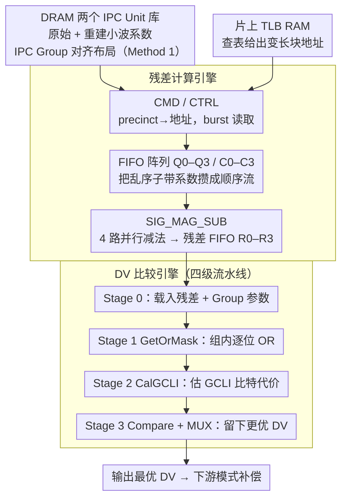

# An FPGA Implementation of Displacement Vector Search for Intra Pattern Copy in JPEG XS

**会议**: CVPR 2026  
**arXiv**: [2603.10671](https://arxiv.org/abs/2603.10671)  
**代码**: 无  
**领域**: 模型压缩  
**关键词**: FPGA, JPEG XS, Intra Pattern Copy, 位移向量搜索, 硬件加速

## 一句话总结

针对 JPEG XS 屏幕内容编码中 Intra Pattern Copy（IPC）模块的位移向量（DV）搜索计算瓶颈，首次提出四级流水线 FPGA 架构并设计基于 IPC Group 对齐的内存组织方式，在 Xilinx Artix-7 上实现 38.3 Mpixels/s 吞吐量和 277 mW 功耗，为 IPC 的实际硬件部署提供了可行方案。

## 研究背景与动机

JPEG XS 是 JPEG 委员会为远程桌面、KVM 和沉浸式视频等场景设计的低延迟、低复杂度图像压缩标准。为了提升其对屏幕内容的编码效率，研究者提出了 Intra Pattern Copy（IPC）技术，在小波域内进行帧内预测以消除空间冗余，取得了显著的 BD-PSNR 提升。

然而，IPC 流程中的 **位移向量搜索（DV Search）** 是计算最密集的模块：它需要遍历所有候选预测偏移量，计算残差并选择使编码代价最小的最优 DV。这一过程的高计算复杂度和不规则内存访问模式成为实时硬件部署的关键瓶颈。

已有的 H.264/HEVC 运动估计 FPGA 实现虽然成熟，但它们针对的是像素域的固定块分区，而非 JPEG XS 小波域中按 IPC Group 和 IPC Unit 组织的频域预测流。因此，**需要一种专门针对 JPEG XS IPC 框架的 FPGA 架构设计**。

核心 idea：设计四级流水线架构将残差计算与 DV 比较解耦并行化，同时通过按 IPC Group 对齐的内存组织方式消除散乱的小波系数访问开销。

## 方法详解

### 整体框架

这篇论文要解决的是：JPEG XS 的 IPC 编码里，位移向量搜索要遍历大量候选偏移、对每个候选都算一遍残差并估出编码代价，是整条流水线上最吃算力、也最难规整内存访问的一环，软件实现根本喂不动实时码流。作者把它整体拆成两个串起来的硬件引擎——前段的**残差计算引擎**（Residual Calculation Engine）负责把数据从内存搬进来、算出块级残差，后段的**DV 比较引擎**（DV Comparison Engine）则对每个残差估编码比特代价、在所有候选里挑出最优 DV。输入是经 RCT 和 DWT 之后的原始/重建小波系数，分别躺在 DRAM 的两个 IPC Unit 存储库里；两个引擎之间通过流水线衔接，残差一边算出来、DV 比较一边就开始评估，从而把"算残差"和"比代价"这两个本来串行的步骤重叠起来。而这条流水线能不能喂满，又取决于系数在 DRAM 里怎么摆、变长块地址怎么算——这正是后两个关键设计（IPC Group 对齐内存组织 + 片上 TLB）在背后支撑的事。

### 关键设计

**1. 残差计算引擎：用 FIFO 阵列把乱序的子带系数喂成顺序流**

IPC 的系数天然是散的——同一个 IPC Group 的数据来自不同子带、在内存里并不连续，直接按需读会变成大量乱序小访问，把带宽吃光。残差计算引擎的做法是先由 CMD 模块把 precinct 编号翻译成内存地址，再用一组 FIFO 阵列（Q0–Q3 缓存原始系数、C0–C3 缓存重建系数）把读进来的系数攒住，CTRL 模块负责读写两端的同步。攒满之后，SIG_MAG_SUB 模块把 32-bit 的符号-幅度值拆开，走 4 路并行减法路径同时算出有符号残差。关键在于 FIFO 阵列让同一个 IPC Group 的系数被排成顺序喂入流水线，把原本零散的访问聚成可预测的连续读，下游因此能满速消化。

**2. 四级流水线 DV 比较引擎：把代价估计切成四拍并行流过**

挑最优 DV 的代价是逐候选累加的，如果一个候选算完再算下一个就会卡住吞吐。比较引擎把这件事切成 4 级流水线让候选连续流过：Stage 0 载入当前残差系数和 Group 参数（BandIdx、GrpSize、UnitWidth）；Stage 1 的 GetOrMask 模块对 Group 内残差逐位做 bitwise OR，得到 OrIdx 和 OrAll；Stage 2 的 CalGCLI 模块根据 OR 结果算出该候选的 GCLI 编码代价 BitsTest；Stage 3 的 Compare 模块把 BitsTest 和历史最小代价 BitsBest 比较，用 MUX 留下更优的那个 DV。四级正好让残差计算和 DV 比较能在时间上重叠流动，既不至于拆得太碎增加面积，又把延迟和吞吐压到一个平衡点上。

**3. 基于 IPC Group 对齐的内存组织（Method 1）：让存储布局跟着遍历顺序走**

前面 FIFO 能不能喂满，根子在 DRAM 里系数怎么摆。基线 Method 0 按 precinct 线性存储，结果同一个 IPC Unit 的系数被打散在不同位置，取一个 Unit 要按 group/unit/band 三级索引一块块定位，控制复杂、吞吐上不去。Method 1 改成按 IPC Group 和 IPC Unit 来组织：同一 Group 里的 Unit 顺序排列、每个 Unit 内部含齐所有子带块，于是加载整个 IPC Unit 只需一个基地址加固定偏移，天然支持 burst 读取。这一步之所以有效，是因为 IPC 的访问模式本来就是"以 Group 为单位扫遍所有 Unit"，让存储顺序和这个遍历顺序对齐，访问就从随机跳变成连续读——这也是后续吞吐和资源同时改善的来源。

**4. 片上 TLB RAM：用查表代替运行时算变长块地址**

不同 Group 的块大小并不一致（取决于小波分解级数），如果每次都在运行时现算变长块的地址，会在关键路径上压上一笔额外开销。作者把这些变长长度信息放进片上 TLB RAM，CMD 模块直接查表就能生成正确的 entry 地址，等 DV 搜索切到下一个 precinct 时再更新 TLB。用一次查表换掉反复的地址计算，让 Method 1 的固定偏移寻址在变长块场景下也能保持简单。

### 损失函数 / 训练策略

本文为硬件设计工作，无训练过程。优化目标是保持与 IPC 参考软件一致的率失真性能，同时最小化延迟、资源占用和功耗。

## 实验关键数据

### 主实验

| 参数 | Method 0 (Baseline) | Method 1 (Proposed) |
|------|---------------------|---------------------|
| 平台 | Xilinx Artix-7, 100 MHz | 同左 |
| 吞吐量 (Mpixels/s) | 35.98 | **38.30** |
| 功耗 (mW) | 276 | 277 |
| 功耗效率 (Mpixels/s/W) | 130.36 | **138.27** |
| LUTs (K) | 13.93 | **12.89** |
| FFs (K) | 23.80 | **21.79** |
| DSPs | 17 | 17 |
| BRAM | 11 | 15 |

### 消融实验：模块资源占用

| 模块 | LUTs (K) | FFs (K) | DSPs | BRAM |
|------|----------|---------|------|------|
| 残差计算引擎 | 0.48 | 0.47 | 0 | 15 |
| GCLI_CAL（DV比较） | 11.63 | 19.98 | 17 | 0 |
| DV_UPDATE（DV比较） | 0.73 | 1.41 | 0 | 0 |

### 关键发现

- Method 1 相比 Method 0 吞吐量提升 6.4%，功耗效率提升 6.1%
- LUT 和 FF 资源分别减少 7.5% 和 8.4%，仅增加 4 个 BRAM
- DV 比较引擎中的 GCLI_CAL 模块贡献了绝大部分逻辑资源消耗（约 90% LUT），是优化重点
- 延迟为 73.01 ms，率失真性能与 IPC 参考软件一致

## 亮点与洞察

- **首次将 IPC DV 搜索搬上 FPGA**：填补了 JPEG XS IPC 硬件实现的空白
- **内存组织与访问模式协同设计**：Method 1 的核心洞察是让存储布局与计算的遍历顺序一致
- **四级流水线粒度恰当**：没有过度拆分流水线级数，在面积和吞吐之间找到平衡

## 局限与展望

- 仅在较小规模的 Artix-7 器件上验证，未在更高端 FPGA 或 ASIC 上评估
- 吞吐量 38.3 Mpixels/s 对于 4K 实时（约 500 Mpixels/s）仍有较大差距
- 未与完整 JPEG XS IPC 编码器集成测试，系统级瓶颈尚不明确
- 仅支持单一小波分解配置（5 水平 2 垂直），灵活性有限

## 相关工作与启发

- H.264/HEVC 运动估计 FPGA 实现提供了成熟的流水线和存储优化范式，但频域预测流需要全新存储组织
- JPEG XS 的 TDC（时域差分编码）与 IPC 互补，未来可能需要将两者硬件实现整合
- Group-aligned 内存组织思路可推广到其他需要按特定维度遍历的小波域处理任务

## 评分

- 新颖性: ⭐⭐⭐ 架构设计思路较为常规（流水线+内存优化），但在 JPEG XS IPC 领域是首创
- 实验充分度: ⭐⭐⭐ 仅一个 FPGA 平台，缺乏与同类硬件编码器的对比
- 写作质量: ⭐⭐⭐⭐ 架构描述清晰，内存组织对比直观
- 价值: ⭐⭐⭐ 对 JPEG XS 硬件化有实际推动作用，但论文影响范围较窄

<!-- RELATED:START -->

## 相关论文

- [\[CVPR 2026\] RDVQ: Differentiable Vector Quantization for Rate-Distortion Optimization of Generative Image Compression](rdvq_differentiable_vq_image_compression.md)
- [\[CVPR 2026\] BinaryAttention: One-Bit QK-Attention for Vision and Diffusion Transformers](binaryattention_one-bit_qk-attention_for_vision_and_diffusion_transformers.md)
- [\[CVPR 2026\] Distilling Balanced Knowledge from a Biased Teacher](distilling_balanced_knowledge_from_a_biased_teacher.md)
- [\[CVPR 2026\] Batch Loss Score for Dynamic Data Pruning](batch_loss_score_for_dynamic_data_pruning.md)
- [\[CVPR 2026\] Critical Patch-Aware Sparse Prompting with Decoupled Training for Continual Learning on the Edge](critical_patch-aware_sparse_prompting_with_decoupled_training_for_continual_lear.md)

<!-- RELATED:END -->
