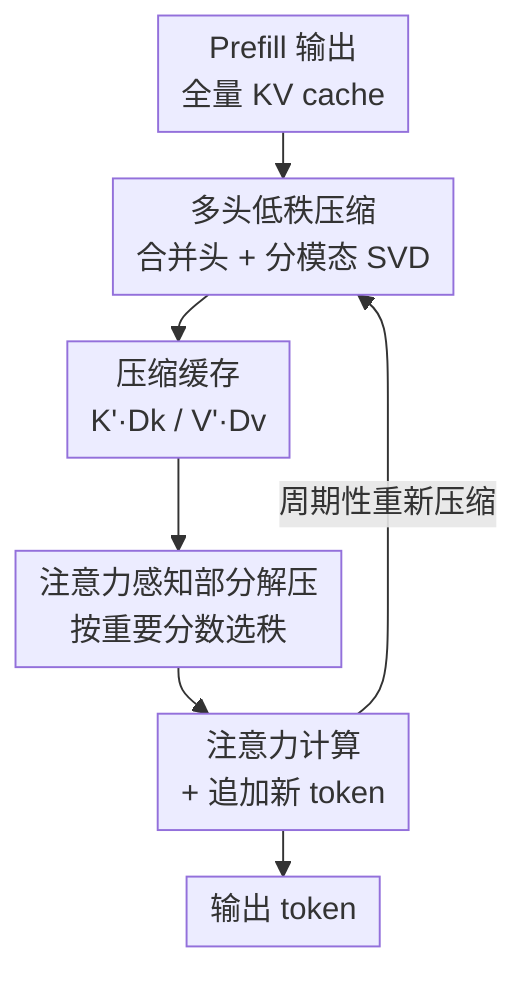

# Attention-aware Inference Optimizations for Large Vision-Language Models with Memory-efficient Decoding

**会议**: CVPR 2026  
**论文**: [CVF Open Access](https://openaccess.thecvf.com/content/CVPR2026/html/Ilhan_Attention-aware_Inference_Optimizations_for_Large_Vision-Language_Models_with_Memory-efficient_Decoding_CVPR_2026_paper.html)  
**代码**: 待确认  
**领域**: 模型压缩  
**关键词**: KV cache 压缩, 低秩分解, 视觉 token, 推理加速, 视觉语言模型  

## 一句话总结
AttentionPack 利用 LVLM 的 KV cache（尤其是视觉 token）天然低秩这一观察，先用 SVD 在「合并多头 + 区分视觉/文本」的方式下把 cache 沿隐藏维压缩，再用一套基于累积注意力分数的「注意力感知部分解压」按需选秩，在几乎不掉点的前提下把显存降到原来的 1/5～1/8，从而支持更大 batch / 更长上下文、解码吞吐提升最高 74%。

## 研究背景与动机
**领域现状**：大视觉语言模型（LVLM，如 LLaVA、QwenVL）把一张图编码成几百上千个视觉 token 喂给 LLM，解码时为避免重算会把过去所有 token 的 key/value 向量缓存起来，即 KV cache。

**现有痛点**：KV cache 的体积随「序列长度 × 隐藏维 × batch」线性膨胀，长上下文（多图、视频、文档）下尤其夸张——文中举例一个 13B LVLM 处理 16 张图（每张 256 token）、batch 64，半精度下推理要约 214 GB。解码每步真正的计算量很小（向量×矩阵），瓶颈反而是把这一大坨缓存从内存搬到 GPU 上，导致算力闲置、延迟高。

**核心矛盾**：现有两条减小 cache 的路线都没碰到根上的维度。**token eviction**（H2O、Scissorhands、FastV 按注意力分数丢 token）只删了序列轴上的 token，每个保留 token 的隐藏维不变，省不下多少且有信息损失；**quantization**（KVQuant、GEAR 降比特）受 outlier 和硬件兼容性掣肘。两者都把「隐藏维」这条轴当成不可压的常量。

**切入角度**：作者去分析缓存向量的内在结构，发现存下来的 key/value 矩阵——特别是视觉 token 的——具有明显的**低秩结构**（图 2：少量奇异值就能解释绝大部分方差）。既然秩低，就能用 SVD 沿隐藏维把它压成两个小矩阵，而不必丢 token、也不必降比特。

**核心 idea**：用「沿隐藏维的低秩 SVD 压缩 + 按 token 重要性的部分解压」替代「删 token / 降比特」，在不微调模型、不动权重的前提下榨干 KV cache 的低秩冗余。

## 方法详解

### 整体框架
AttentionPack 是一个**部署即用、无需微调**的推理期 KV cache 优化框架，挂在标准 LVLM 解码流程之外。Prefill 阶段照常算出全量 KV cache；进入解码后，它做两件事：(1) 在 prefill 结束后（以及解码中周期性地）对 cache 沿隐藏维做一次低秩压缩，把存储体积砍掉数倍；(2) 在每个解码步算注意力分数之前，对压缩后的向量做一次「注意力感知的部分解压」，只给重要 token 还原满秩、给不重要 token 还原低秩，从而把解压本身的额外 FLOPs 也压下去。压缩省下的显存让用户能开更大 batch 或更长上下文，并行化反过来抵消解压开销，净得吞吐提升。

记 LVLM 输入视觉特征经投影后与文本 embedding 同维 $H_v, H_t \in \mathbb{R}^{T\times HD}$（$H$ 头、$D$ 维），注意力块权重 $\{W_q,W_k,W_v,W_o\}$，prefill 后缓存 $C=\{K,V\in\mathbb{R}^{T\times HD}\}$，$T=T_v+T_t$ 为视觉+文本 token 数。

### 关键设计

**1. 多头低秩压缩：合并头、分模态地把 KV cache 沿隐藏维 SVD 压小**

这一步针对的痛点是「eviction/quant 都不动隐藏维，省不动」。作者对 LLaVA1.5-7B 第一层在 OCR-VQA 上的缓存做分析（$T_v=576$），发现 key/value 矩阵低秩，可用 SVD 沿隐藏维降维。具体把每个缓存矩阵分解成两块低秩成分：$K \approx K' D_k$、$V \approx V' D_v$，其中压缩缓存 $K'\in\mathbb{R}^{T\times R_k}$、解压矩阵 $D_k\in\mathbb{R}^{R_k\times HD}$（value 同理），$K'$ 每一列按 SVD 算出的奇异值缩放。对单层单样本的视觉 key，存储从 $T_v HD$ 降到 $T_v R_{kv}+R_{kv}HD$，压缩比为

$$c_{kv}=\frac{T_v HD}{T_v R_{kv}+R_{kv}HD}$$

当 $T_v=1000,H=40,D=128,R_{kv}=64$ 时，显存约降 13×。

两个让压缩更狠的细节是这个设计的精髓：**(i) 先沿头轴合并再压**——作者发现把多头缓存拼到一起做低秩分解，比每个头单独压更有效（图 2 中「combine along head」曲线在更低秩处就达到高方差解释率），因为头之间存在可共享的冗余信息；**(ii) 视觉/文本分开压**——两种模态来源不同、统计特性不同，不加区分地一起 SVD 会导致压缩次优，所以视觉 token（$\diamond=v$）和文本 token（$\diamond=t$）各走一套流程。各模态、各矩阵的秩 $R_{kv},R_{kt},R_{vv},R_{vt}$ 都是可调旋钮，按显存预算自由设定。

**2. 注意力感知部分解压：按 token 重要性选秩，把解压的额外开销也省掉**

压缩虽然只在 prefill 后做一次、解码中周期性做，但**解压发生在每个解码步**，会带来延迟——单实例推理下最高可加 30%（取决于上下文长度）。这个设计就是为了消化这部分开销：观察是「并非所有 token 在每一步都同等重要」，于是对影响小的 token 用更少的秩去解压，对重要 token 才满秩还原。

重要性怎么定？作者用滑动平均（参数 $\omega\in[0,1)$）跟踪每个 token 的**缩放累积注意力分数**。在解码步 $t$，对位置 $t_p$ 的重要分数为

$$I_{t_p}\leftarrow \omega^{T_q} I_{t_p} + (1-\omega^{T_q})\frac{\sum_{t'=t-T_q}^{t} A_{t'\,t_p}}{T_q}$$

其中 $T_q$ 是本步新 token 数（通常为 1，除非用户一次给多 token），$A_{t'\,t_p}$ 是 $t'$ 步对 $t_p$ 的注意力权重并在头间平均；$\omega=0$ 时只看最近一步的分数。然后把 token 按分数分成 $F$ 组，第 1 组（最高分）用压缩时的原始秩 $R^{(1)}_{kv}=R_{kv}$ 解压，低分组用更小的秩。视觉 key 的解压 FLOPs 从 $2T_v HD R_{kv}$ 降到 $2T_v HD \sum_{f=1}^{F} r_f R^{(f)}_{kv}$（第 $f$ 组占 $r_f T_v$ 个 token、解压秩 $R^{(f)}_{kv}$）。文中例子：$F=2,T=1000,r_1=0.1,r_2=0.9,R^{(1)}_{kv}=64,R^{(2)}_{kv}=16$，即 90% 低分 token 只用 25% 的秩解压，解压 FLOPs 直降 67.5%。作者也指出 key 比 value 对部分解压更敏感（会影响注意力权重计算、连带波及满秩 token），所以实践中主要在 value cache 上做部分解压。

### 损失函数 / 训练策略
**无训练、无微调**——AttentionPack 是纯推理期方法，全程不更新模型权重、不需要标定数据集，所有压缩/解压都是 SVD 与矩阵乘的代数操作。实验默认设置：value cache 上做部分解压，$F=2$、$r_1=0.25,r_2=0.75$、低分组秩为满秩的 1/4；重要性滑动平均 $\omega=0.25$（$\omega\in[0.05,0.75]$ 区间内都稳健）。

## 实验关键数据

数据集：图像 QA 用 A-OKVQA、OCR-VQA、MMMU；视频 QA 用 MSVD-QA、MSRVTT-QA。模型：LLaVA1.5-7B/13B、QwenVL-Chat-7B、VideoLLaVA-7B（另含 Qwen3VL-8B-instruct 测 GQA）。对比基线：全量 KV cache、FastV、Scissorhands、H2O（均 evict 50%）、Minicache。文本输出用 ROUGE-L，选择题用 accuracy。

### 主实验
图像/视频 QA 主结果（节选 $R_{kv}=R_{vv}=64$，精度近乎无损而 cache 缩到几分之一）：

| 模型 | 方法 | Cache 缩减 | 吞吐变化 | A-OKVQA | OCR-VQA | MMMU |
|------|------|-----------|---------|---------|---------|------|
| LLaVA1.5-7B | Full KV | — | — | 76.64 | 51.05 | 34.68 |
| LLaVA1.5-7B | Minicache | 4.51× | +44% | 76.54 | 51.93 | 33.75 |
| LLaVA1.5-7B | **AttentionPack (64)** | **5.09×** | **+54%** | 76.88 | 52.44 | 34.59 |
| LLaVA1.5-13B | **AttentionPack (64)** | 5.17× | +43% | 81.25 | 53.22 | 36.38 |
| QwenVL-Chat-7B | **AttentionPack (64)** | 2.77× | +61% | 75.33 | 68.45 | 35.72 |
| VideoLLaVA-7B | **AttentionPack (128)** | **8.11×** | +60% | MSVD 69.21 / MSRVTT 55.47 | | |

LLaVA1.5-7B 上单样本 cache 从 328.2 MB 降到 64.5 MB；视频任务因多帧高度相似，可压到 8.11× 仅掉 ~0.4% 以内。

### 消融实验
压缩秩扫描（LLaVA1.5-7B，batch 32，节选自 Table 3）：

| $R_{kv}$ / $R_{vv}$ | 总 cache 缩减 | A-OKVQA | OCR-VQA | 说明 |
|--------------------|--------------|---------|---------|------|
| 全量 | — | 76.64 | 51.05 | 基线 |
| 64 / 128 | 3.92× | 76.75 | 52.47 | 高秩近无损 |
| 64 / 64 | 5.09× | 76.88 | 52.44 | 甜点：略升点 |
| 32 / 64 | 5.98× | 76.46 | 52.00 | 开始微掉 |
| 32 / 32 | 7.24× | 75.91 | 51.69 | 仍可接受 |
| 16 / 16 | 9.18× | 72.13 | 48.44 | 过压明显掉点 |

与其他压缩技术叠加（Table 4，LLaVA1.5-7B）：

| 方法 | 平均 cache (MB) | 吞吐变化 | A-OKVQA | OCR-VQA |
|------|----------------|---------|---------|---------|
| Full KV - fp16 | 328.2 | — | 76.64 | 51.05 |
| KVQuant-4bit | 82.1 | +49% | 75.90 | 50.67 |
| AttentionPack | 64.5 | +54% | 76.88 | 52.44 |
| AttentionPack + eviction (E) | 62.1 | +70% | 76.88 | 51.63 |
| AttentionPack-4bit | 16.1 | +97% | 75.27 | 50.18 |
| AttentionPack-4bit (E) | 15.5 | +115% | 75.27 | 49.11 |

### 关键发现
- **秩 64 是甜点**：低于 64 两个数据集都开始掉点，64→128 提升微乎其微；OCR-VQA 在 64 时反而 +1.39%，说明压缩有时能滤掉视觉输入里的无关信息、反而涨点。
- **早层秩主导质量**：按层线性递增（首层秩 16、末层 128）比全层都 16 高 ~0.37%，但显存翻倍——早层向量的秩选择对最终质量影响最大。
- **正交可叠加**：与 eviction、4-bit 量化、kernel fusion 组合还能进一步压缩，4-bit + eviction 下 cache 仅 15.5 MB、吞吐 +115%，资源受限场景友好。
- **key 比 value 更怕部分解压**：因为它直接进注意力权重计算，所以部分解压主要放在 value cache 上。
- **延迟收益靠 batch**：单实例下解压会增延迟，但压缩省 ~80% 显存后能开 ~4× 大 batch，总延迟最多降 54%（RTX3060、4-bit 权重 + 半精度测量）。

## 亮点与洞察
- **把「隐藏维」当成可压轴**：eviction 删 token、quant 降比特，都默认隐藏维不可动；这篇直接对隐藏维做低秩分解，开了一条与前两者正交、可叠加的新轴，这是最关键的「啊哈」点。
- **合并头 + 分模态的组合拳**：先沿头轴合并再 SVD，等于让多头共享的冗余被一并压掉；同时严格区分视觉/文本模态，避免跨模态混压的次优——两个看似细节的选择是压缩比能到 5–8× 还不掉点的真正原因。
- **用注意力分数反哺解压预算**：把「哪些 token 重要」这一注意力天然产物，复用到「给谁满秩解压」的资源分配上，思路可迁移到任何需要按 token 分配计算预算的解压/重算场景。
- **部署即用**：无需微调、无需标定集，纯代数操作挂在解码外，落地门槛极低。

## 局限与展望
- **单实例延迟反增**：解压每步都做，单条推理下最高 +30% 延迟，收益完全依赖大 batch 并行摊薄；小 batch / 实时单请求场景未必划算。
- **过压悬崖**：秩降到 16 时掉点陡峭（A-OKVQA 76→72），低秩假设在高压缩率下失效，秩的选取需按数据集/层调，缺乏自动化策略（文中按方差比自动选秩反而掉 ~0.3%）。
- **周期性重压的代价未充分量化** ⚠️：方法提到解码中「周期性」重新压缩，但重压频率对延迟/质量的 trade-off 在正文展开有限，以原文及附录为准。
- **依赖低秩成立**：对视觉 token 低秩冗余强的任务（视频多帧）收益最大，对信息密集、低秩结构弱的输入压缩空间可能有限。

## 相关工作与启发
- **vs token eviction（H2O / Scissorhands / FastV）**：它们沿序列轴删 token，保留 token 的隐藏维不变，省显存有限且有信息损失；AttentionPack 不删 token、沿隐藏维压，两者正交可叠加（实验里 +eviction 进一步提速）。
- **vs 量化（KVQuant / GEAR）**：量化降比特受 outlier 和硬件兼容掣肘；本文走低秩路线，且能与 4-bit 量化叠加（AttentionPack-4bit cache 仅 16 MB）。GEAR 也用 SVD 但作用在量化残差上，本文直接对原始 KV 做模态分离的多头低秩分解。
- **vs 权重低秩/剪枝**：传统低秩近似压模型权重需部署前在代表性数据上大改、可能损质量；本文只压推理期缓存、不动权重、零微调。
- **vs GQA / FlashAttention / PageAttention**：GQA 跨头共享 KV、FlashAttention/PageAttention 优化访存调度，但 cache 体积本身没变；本文直接缩小 cache 体积，可与这些底层优化共存。

## 评分
- 新颖性: ⭐⭐⭐⭐ 把低秩压缩落到 LVLM 的 KV cache 隐藏维，合并头+分模态+注意力感知解压的组合是新的，但 SVD/低秩本身是成熟工具。
- 实验充分度: ⭐⭐⭐⭐⭐ 覆盖 4 个模型、5 个图像/视频数据集，秩扫描、解压消融、与量化/eviction 叠加、延迟分解都有。
- 写作质量: ⭐⭐⭐⭐ 机制和公式交代清晰，压缩/解压两步逻辑顺畅；部分符号（如重要性公式的缩放项）排版略糙。
- 价值: ⭐⭐⭐⭐ 即插即用、与现有压缩技术正交，长上下文 LVLM 部署的实用增益明显。

<!-- RELATED:START -->

## 相关论文

- [\[CVPR 2026\] Rethinking Token Reduction for Large Vision-Language Models](rethinking_token_reduction_for_large_vision-language_models.md)
- [\[CVPR 2026\] VLM-PTQ: Efficient Post-Training Quantization for Large Vision-Language Models](vlm-ptq_efficient_post-training_quantization_for_large_vision-language_models.md)
- [\[CVPR 2026\] Quant Experts: Token-aware Adaptive Error Reconstruction with Mixture of Experts for Large Vision-Language Models Quantization](quant_experts_token_aware_vlm_quantization.md)
- [\[CVPR 2026\] Masking Teacher and Reinforcing Student for Distilling Vision-Language Models](masking_teacher_and_reinforcing_student_for_distilling_vision-language_models.md)
- [\[CVPR 2026\] Hybrid Token Compression for Vision-Language Models](hybrid_token_compression_for_vision-language_models.md)

<!-- RELATED:END -->
