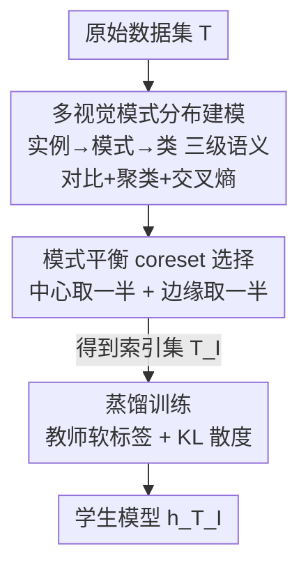

# Balanced Dataset Distillation via Modeling Multiple Visual Pattern Distribution

**会议**: CVPR 2026  
**论文**: [CVF Open Access](https://openaccess.thecvf.com/content/CVPR2026/html/Shi_Balanced_Dataset_Distillation_via_Modeling_Multiple_Visual_Pattern_Distribution_CVPR_2026_paper.html)  
**代码**: https://github.com/BeCarefulOfYournaoke/BPS  
**领域**: 模型压缩 / 数据集蒸馏  
**关键词**: 数据集蒸馏, coreset 选择, 模式平衡, 多视觉模式建模, 跨架构泛化

## 一句话总结
本文指出现有数据集蒸馏方法普遍存在「模式失衡」（要么偏重类内主流的 class-general patterns、要么偏重边缘的 marginal patterns），提出 BPS 框架：先用层次语义结构把每个类建模成多个视觉模式的分布，再从每个模式的「中心」和「边缘」各取一半 IPC 预算构成模式平衡的 coreset，最后用知识蒸馏训练学生模型——在四个 benchmark 上全面超过此前 SOTA，且天然具备跨架构泛化和「一次建模、所有 IPC 复用」的效率优势。

## 研究背景与动机
**领域现状**：数据集蒸馏（Dataset Distillation, DD）要把大规模数据集压缩成每类只有少量图像（IPC, Images Per Class）的小数据集，让模型在小数据集上训练就能逼近全量训练的效果。主流走两条路：① coreset 选择——从原数据集里挑代表性子集；② 合成式（synthetic-based）——在像素空间优化出信息高度浓缩的合成图像；近年还有 ③ 生成式（GAN/扩散）方法。

**现有痛点**：作者深入分析后发现这些方法共享同一个隐疾——**模式失衡（pattern imbalance）**。每个类的分布其实同时含两类关键信息：代表多数样本的 class-general patterns（模式中心）和对泛化至关重要、却数量稀少的 marginal patterns（模式边缘）。但 coreset 里的启发式方法（如 Herding 用矩匹配）过度强调全局统计约束，倾向保留高密度的类代表样本而忽略决策边界附近的「hard」样本；重要性方法（如 Forgetting）反过来只挑「hard」样本而丢掉保底性能的代表样本；合成式方法在用少量合成图编码整个数据集时，优化过程天然偏向高频的 class-general patterns，对稀缺的 marginal patterns 力不从心——后续有人靠往合成集里「打补丁」插入真实 hard 图来补救，但这是 patching 而非显式实现平衡。

**核心矛盾**：现有方法都默认「每个类是单一聚类（single cluster）」，在这个错误假设下根本无法同时、均衡地覆盖中心和边缘两类模式。此外合成式优化依赖特定网络架构，继承了模型特定的归纳偏置，导致跨架构泛化差。

**本文目标**：在不依赖合成图的前提下，构造一个**显式保证模式平衡**且**模型无关**的 coreset。

**切入角度**：既然合成优化天然偏向主流模式且绑死架构，那能不能退回到「优化样本选择」这条路，让选择过程本身就内蕴模式平衡？

**核心 idea**：放弃「一类=一簇」的假设，用层次语义结构把每个类建模成**多个视觉模式的混合分布**，再从每个模式的中心与边缘**各取一半预算**，得到模式平衡的 coreset。

## 方法详解

### 整体框架
BPS（Balanced Pattern Selection）要解决的是：在 coreset 选择范式下，构造一个同时均衡覆盖「模式中心」和「模式边缘」的索引集 $T_I=\{(x_i,y_i)\mid i\in I\}$（即蒸馏数据集 $\tilde{S}=T_I$）。整体分三个阶段串行：**Stage 1** 训练一个编码器，把每个类的多视觉模式分布显式建模出来，从而能定位每个模式的中心和边缘；**Stage 2** 在已发现的模式上，从中心和边缘各取一半 IPC 预算，拼成模式平衡的 coreset $T_I$；**Stage 3** 用全量数据训练好的教师 $h_T$ 给 coreset 打软标签，蒸馏训练学生 $h_{T_I}$，使其性能逼近 $h_T$。

整个 pipeline 由三条理论保证串起来：Axiom 1（真实数据是多模式结构）支撑 Stage 1 的 GMM 建模；Proposition 2 证明 BPS 选出的 coreset 在「信息覆盖」上对齐原数据流形（用 fill distance $d_{\text{fill}}$ 度量并给出上界）；Proposition 3 证明学生在原数据集上的风险能逼近教师（风险差 $R_{\text{diff}}$ 上界由 $d_{\text{fill}}$ 控制）。

### 关键设计

**1. 多视觉模式分布建模：用三级语义结构替代「一类=一簇」假设**

这一步针对的痛点是：现有方法默认每个类只有一个聚类，于是中心和边缘没法分开定位。BPS 立在 Axiom 1 之上——每个类的隐空间分布是一个高斯混合模型（GMM），$p(v)=\sum_{m=1}^{M} w_m \mathcal{N}(v;\mu_m,\Sigma_m)$，每个高斯分量对应一个视觉模式，所有分量合成一个多模式结构的数据流形 $\mathcal{M}=\bigcup_m \mathcal{M}_m$，其中 $\mathcal{M}_m=\{v\mid \|v-\mu_m\|\le R_m\}$。建模目标拆成两件事：**最小化模式内方差**（压小半径 $R_m$）和**最大化模式间可分性**（拉开质心 $\mu_m$）。

BPS 把它落地成「实例→模式→类」三级语义学习：① **实例级**用对比学习（MoCo v2）把同一张图的不同增广视图在表征空间里拉近，降低模式内方差、压小 $R_m$，损失为 InfoNCE $L_{con}=-\frac{1}{|T|}\sum_i \log\frac{\exp(\text{sim}(v_i,v_i^+)/\tau_1)}{\sum_k \exp(\text{sim}(v_i,v_k)/\tau_1)}$；② **模式级**做自适应聚类来发现模式——因为模式数 $M$ 既不已知也不均衡，作者把「发现模式」转化为「最小化样本分布的条件熵」：把每个样本表征当图节点，用 Random Walk 算转移概率 $p_{i\to j}=\frac{v_i^\top v_j}{\|v_i\|\|v_j\|}$ 得到稳态分布 $P_T$，再求最优模式划分 $O^*=\arg\min_O H(P_T\mid O)$（每个 epoch 开头用 Infomap 算法高效求 $O^*$），并配一个聚类损失 $L_{clu}$（把同模式样本的 $L_1$ 距离拉近、异模式推远）增强可分性；③ **类级**加标准交叉熵 $L_{CE}$ 保证类间可分。总目标 $L_{total}=L_{con}+L_{clu}+L_{CE}$。学完得到一个多模式结构的表征空间 $V$ 和最优模式划分 $O^*$。⚠️ 模式数靠熵最小化自适应确定，原文未给固定 $M$，以原文为准。

**2. 模式平衡 coreset 选择：中心样本与边缘样本各占一半 IPC**

这是 BPS 真正「治失衡」的一步：在已发现的模式上，从每个模式的中心和边缘**对半**取样。理论上由 Proposition 2 撑腰——用 Scattered Data Approximation 里的 fill distance $d_{\text{fill}}(V_I,\mathcal{M})=\sup_{v\in\mathcal{M}}\min_{\hat g\in V_I}\|v-\hat g\|$ 度量 coreset 对流形的覆盖，其上界

$$d_{\text{fill}}(V_I,\mathcal{M}) \le \max_m R_m + \min(\epsilon_{clu},\epsilon_{eps})$$

正好被 Stage 1 隐式压小（$L_{con}$ 压 $R_m$、熵最小化让发现的中心 $\hat c_m$ 逼近真中心 $\mu_m$、$L_{clu}$ 拉近边缘 $\hat b_m$ 与中心的关系），于是 coreset 能保住原流形信息。

具体两路选样：**中心样本**代表 class-general patterns，分得一半预算 $\text{IPC}\times C/2$，对第 $m$ 个模式按其规模 $|O_m|$ 成比例分配名额 $N_m=\text{round}(\text{IPC}\times C/2)\times(|O_m|/|T|)$，取离中心 $\hat c_m=\frac{1}{|O_m|}\sum_{i\in O_m} v_i$ 最近的 $N_m$ 个样本，索引集 $I_{cen}=\bigcup_m I_{cen}^m$。**边缘样本**代表 marginal patterns，用「教师 $h_T$ 给出的低置信度」作代理来定位：每个模式取置信度最低的 $K$ 个样本组成候选集 $I_{hard}^m$（$K>N_m$）。但作者强调并非所有低置信样本都有益（可能是噪声），于是再套一个**带噪标签学习**的方法从候选里过滤出 $N_m$ 个真正有价值的样本 $I_{hard}^{m,filter}$，构成另一半预算。最终 coreset $T_I=\{(x_i,y_i)\mid i\in I_{cen}\cup I_{hard}\}$。注意若 IPC 预算不够覆盖所有模式（$\text{IPC}\times C<M$），BPS 优先保中心样本、舍弃边缘样本。

**3. 蒸馏训练：教师软标签 + KL 散度让学生逼近教师**

Stage 3 要让在 coreset 上训练的学生 $h_{T_I}$ 逼近全量教师 $h_T$。Proposition 3 把风险差 $R_{\text{diff}}=\mathbb{E}_{v\sim V_T}[\|h_{T_I}(v)-h_T(v)\|]$ 的上界拆成 $R_{\text{diff}}\le \epsilon_{appr}+\epsilon_{inter}\cdot d_{\text{fill}}(V_I,\mathcal{M})$，其中 $d_{\text{fill}}$ 已被 Stage 1/2 压小，$\epsilon_{inter}$ 是由数据增广等正则决定的小常数，于是只需在 coreset 上最小化 $\epsilon_{appr}$。落地用知识蒸馏：教师 $h_T$ 给 coreset 打软标签 $y_i'=h_T(x_i)$，学生最小化输出与软标签的 KL 散度

$$L_{KD}=\frac{1}{|T_I|}\sum_{x_i\in T_I} \text{KL}\big(y_i'/\tau_2 \,\big\|\, h_{T_I}(x_i)/\tau_2\big),$$

其中 $\tau_2$ 是蒸馏温度。这一步把「样本选得好」转化为「学生学得好」，是三段理论链条的最后一环。

### 损失函数 / 训练策略
- Stage 1 总损失 $L_{total}=L_{con}+L_{clu}+L_{CE}$，对比学习用 MoCo v2，$\tau_1=0.5$、momentum 0.999、memory size 65536；每个 epoch 开头用 Infomap 交替更新模式划分 $O^*$。
- Stage 2 候选比例 $K$：ImageNet-1K 取 20%，其余取 10%。
- Stage 3 用 AdamW，训练 500 epoch，batch size 512，初始 lr 0.001 + cosine annealing，蒸馏温度 $\tau_2=20$；全程在 2×NVIDIA 3090 上跑。

## 实验关键数据

### 主实验
在 CIFAR10/100、Tiny-ImageNet、ImageNet-1K 四个 benchmark、不同 IPC 下对比 9 个 SOTA（coreset 类 Herding/Forgetting/Glister/RDED、生成类 DCS、合成类 SRe2L/SelMatch/DELT/CCFS），验证模型统一用 ResNet-18，结果取三次随机初始化均值。BPS 在**所有设置**下都拿第一（下表节选若干档，单位 %）：

| 数据集 (IPC) | Herding | RDED | DCS | CCFS(次优) | BPS(本文) | ∆SOTA |
|---|---|---|---|---|---|---|
| CIFAR10 (10) | 20.1 | 37.1 | 39.0 | 34.1 | **48.8** | +5.8 |
| CIFAR10 (50) | 31.9 | 62.1 | 63.2 | 67.2 | **77.1** | +9.9 |
| CIFAR100 (10) | 10.3 | 42.6 | 50.6 | 52.7 | **57.7** | +5.0 |
| Tiny-ImageNet (10) | 7.3 | 41.9 | 38.9 | 42.1 | **47.4** | +4.4 |
| ImageNet-1K (10) | 2.5 | 42.0 | 46.7 | 49.9 | **52.4** | +2.5 |

亮点：在 Tiny-ImageNet 上仅用 5% 数据，BPS 把与全量模型（60.5%）的差距缩到 **1.5%**（达 59.0%）；且 BPS 的标准差普遍更低（尤其低 IPC，如 CIFAR10 IPC=10），说明模式平衡的 coreset 比合成图或失衡真实图更稳定。

**跨架构泛化**（ImageNet-1K, IPC=10，ResNet-18 蒸馏后换 6 种架构验证）：

| 方法 | R18 | R50 | E-B0 | M-v2 | ViT-S | ViT-B |
|---|---|---|---|---|---|---|
| RDED | 42.3 | 49.7 | 40.4 | 31.0 | 14.9 | 18.5 |
| DCS | 46.7 | 55.2 | 51.1 | 41.5 | 20.4 | 24.2 |
| CCFS | 49.9 | 57.2 | 42.1 | 43.7 | 24.0 | 30.8 |
| **BPS** | **52.4** | **58.0** | **55.7** | **49.1** | **30.2** | **35.7** |
| ∆SOTA | +2.5 | +0.8 | +4.6 | +5.4 | +6.2 | +4.9 |

BPS 在所有架构上最优，在 data-hungry 的 ViT 上提升最大（+6.2 / +4.9），佐证 model-agnostic 选择的优势。

### 消融实验
| 配置 / 超参 | 关键指标 | 说明 |
|---|---|---|
| $K$=10% / 20% / 30% (CIFAR100, IPC=10) | 57.7 / 57.1 / 56.8 | 干净数据集 $K$=10% 最佳 |
| $K$=10% / 20% / 30% (ImageNet-1K, IPC=10) | 51.9 / **52.4** / 51.6 | 噪声多需更大 $K$=20% |
| $\tau_1$ 扫 {0.05~1.0} | $\tau_1$=0.5 最佳 | 太小模式内方差大、太大模式难分 |
| $\tau_2$ 扫 {2~30} | $\tau_2$=20 最佳 | 太小软标签退化成 one-hot、太大趋于均匀失去监督 |
| 模式失衡比例渐变 (Fig.4) | 越失衡精度越低 | 平衡 coreset 取得最小 MMD + 最高精度 |

### 关键发现
- **模式平衡是核心增益来源**：用 MMD（蒸馏空间 vs 平衡参考空间）度量失衡程度，所有方法都呈现 MMD 与精度的强负相关，BPS 的 MMD 最低且分布最集中（violin plot 最窄），直接验证「平衡」是性能提升的关键因子。
- **coreset 范式仍有潜力**：整体上合成/生成方法优于传统 coreset，但 RDED（裁信息块）已能比肩甚至超过部分合成法，说明只要选择策略够精细，coreset 路线远未触顶——BPS 正是把这条路线推到新高度。
- **效率「一次建模、全 IPC 复用」**：BPS 主要算力花在 Stage 1 的模式建模，不同 IPC 只需重新选样、无需重训模型；合成/生成法每个 IPC 都要重跑优化，累计成本线性增长，BPS 总成本显著更低。
- **$K$ 随数据噪声调**：ImageNet-1K 噪声多，需采更大比例低置信候选才能保住有价值的边缘样本；CIFAR-100 较干净，10% 即可。

## 亮点与洞察
- **把「失衡」诊断成一个可度量的问题**：用 MMD 把「模式平衡度」量化出来并证明其与精度强负相关，这让一个原本模糊的直觉变成可优化/可验证的目标，是这篇最「啊哈」的地方。
- **退回 coreset 反而解决两难**：当大家都在卷合成图像真实度时，作者反向论证「优化选择」天然 model-agnostic 又能显式平衡，一举解掉「失衡 + 跨架构差」双痛点，是很漂亮的问题重构。
- **熵最小化做自适应模式发现**：把「一个类有几个视觉模式」交给条件熵最小化（Random Walk + Infomap）自动决定，避免手工设簇数，这个把聚类转成熵优化的 trick 可迁移到任何需要类内自适应分簇的任务（如长尾识别、子类发现）。
- **三段理论链条闭环**：Axiom 1 → fill distance 上界（Prop.2）→ 风险差上界（Prop.3）把「选样好」一路推到「学生性能好」，每个 Stage 各压一项，理论与方法严丝合缝。

## 局限与展望
- **作者承认**：violin plot 显示各类的平衡度（MMD）并不一致，统一对半采样对所有类未必最优；未来想做 class-adaptive 的动态中心/边缘比例分配。
- **依赖教师 $h_T$**：边缘样本靠教师低置信度定位、Stage 3 靠教师软标签，整条管线建立在「有一个全量训练好的教师」之上，⚠️ 教师本身质量对结果的影响原文未充分讨论。
- **Stage 1 表征学习成本**：虽然「一次建模、全 IPC 复用」摊薄了成本，但对比学习 + 自适应聚类本身在超大数据集上的开销随数据规模增长，论文主要在 ImageNet-1K 规模验证，更大规模的可扩展性待考。
- **边缘样本过滤依赖带噪标签学习**：从低置信候选里筛「有价值」样本用了额外的 noisy-label 方法（细节在补充材料），这一步的鲁棒性是平衡质量的隐形瓶颈。

## 相关工作与启发
- **vs 启发式 coreset（Herding）**：Herding 用矩匹配满足全局统计约束，倾向高密度类代表样本、忽略边缘；BPS 显式建模多模式并对中心/边缘对半采样，补上了边缘这一块。
- **vs 重要性 coreset（Forgetting）**：Forgetting 只挑训练中频繁被遗忘的「hard」样本，丢掉保底性能的代表样本；BPS 两类都要，且用带噪标签学习过滤掉无益的 hard 样本。
- **vs 合成式 DD（SRe2L / CCFS / SelMatch）**：它们优化合成图，天然偏向主流模式、靠插真实 hard 图「打补丁」补救，且绑死架构；BPS 优化的是选择而非合成，模式平衡是结构性保证，且 model-agnostic 跨架构更强。
- **vs 生成式 DD（DCS / CAO² / GLaD）**：这些方法追求合成图的真实度/判别性，但不显式处理模式失衡；BPS 直接选出结构良好的平衡 coreset，而非生成。

## 评分
- 新颖性: ⭐⭐⭐⭐⭐ 把 DD 普遍存在的「模式失衡」诊断为可度量问题，并用「多模式建模 + 中心/边缘对半采样」从选择范式根治，视角新颖
- 实验充分度: ⭐⭐⭐⭐⭐ 四 benchmark 多 IPC 全面超 SOTA，含跨架构、效率、MMD 失衡分析与三组超参消融
- 写作质量: ⭐⭐⭐⭐ 方法-理论对应清晰，三段理论链条完整；但关键过滤步骤与模式数确定细节放在补充材料，正文略简
- 价值: ⭐⭐⭐⭐⭐ model-agnostic + 一次建模全 IPC 复用，兼顾性能、泛化与效率，对 NAS/持续学习等下游很实用

<!-- RELATED:START -->

## 相关论文

- [\[CVPR 2026\] Mitigating The Distribution Shift of Diffusion-based Dataset Distillation](mitigating_the_distribution_shift_of_diffusion-based_dataset_distillation.md)
- [\[AAAI 2026\] TGDD: Trajectory Guided Dataset Distillation with Balanced Distribution](../../AAAI2026/model_compression/tgdd_trajectory_guided_dataset_distillation_with_balanced_distribution.md)
- [\[CVPR 2026\] DMGD: Train-Free Dataset Distillation with Semantic-Distribution Matching in Diffusion Models](dmgd_train-free_dataset_distillation_with_semantic-distribution_matching_in_diff.md)
- [\[CVPR 2026\] Dataset Distillation by Influence Matching](dataset_distillation_by_influence_matching.md)
- [\[CVPR 2026\] Progressive Supernet Training for Efficient Visual Autoregressive Modeling](progressive_supernet_training_for_efficient_visual_autoregressive_modeling.md)

<!-- RELATED:END -->
