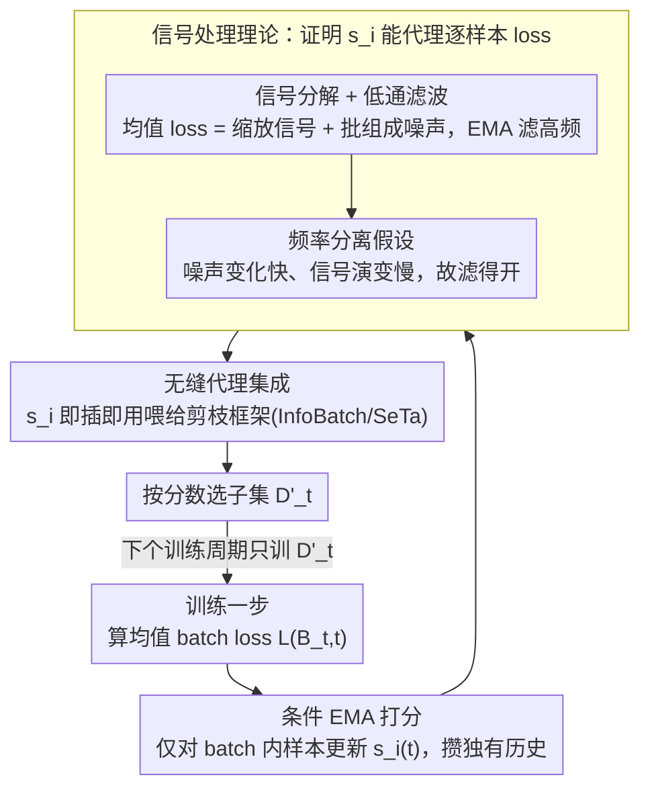

# Batch Loss Score for Dynamic Data Pruning

**会议**: CVPR 2026  
**arXiv**: [2604.04681](https://arxiv.org/abs/2604.04681)  
**代码**: [https://github.com/mrazhou/BLS](https://github.com/mrazhou/BLS)  
**领域**: 训练效率 / 数据剪枝  
**关键词**: dynamic data pruning, batch loss, EMA, training efficiency, sample importance

## 一句话总结

提出 Batch Loss Score (BLS)，一种仅用均值 batch loss（而非难以获取的逐样本 loss）来估计样本重要性的方法，通过 EMA 低通滤波的信号处理视角提供理论保证，仅需 3 行代码即可集成到现有动态剪枝框架中。

## 研究背景与动机

动态数据剪枝通过跳过不太信息化的样本来加速深度学习训练。逐样本 loss 是最直观的重要性度量，但在实践中获取它面临重大障碍：标准训练管线高度优化于计算均值 batch loss，从聚合后的损失恢复个体 loss 并非易事。对于复杂目标函数（如多组件检测 loss），定义和分离逐样本标量需要深度的任务特定知识和代码修改。

BLS 的核心洞察：虽然逐样本 loss 难以获取，但均值 batch loss 是无处不在的。通过为每个样本维护一个 EMA 分数（仅在该样本出现在当前 batch 时更新），可以间接推断样本重要性。

## 方法详解

### 整体框架

BLS 想绕开"逐样本 loss 难获取"这个老大难：标准训练管线只算均值 batch loss，要从聚合损失里抠出每个样本的标量 loss 往往得改一堆任务特定代码。它的办法是给每个样本维护一个 EMA 分数，只在该样本出现在当前 batch 时更新——$s_i(t) = \alpha\, s_i(t-1) + (1-\alpha)\, L(B_t, t)$，用这份分数当作逐样本重要性的透明代理，塞回任何基于 loss 的动态剪枝框架里。整个流程是一个**采样→打分→选样→再训练**的回环：每训练一步算出均值 batch loss，更新 batch 内样本的 EMA 分数，框架按分数选出下一轮要训的子集，循环往复。

### 关键设计

**1. 条件 EMA 打分：只在样本出现于当前 batch 时才更新，给每个样本攒出独有的 loss 历史**

这是 BLS 的核心算法。给每个样本 $i$ 维护一个分数 $s_i(t)$，初始化为第一个 batch 的均值 loss $s_i(0)=L(\mathcal{B}_0,0)$；之后**只有当样本出现在当前 batch 里**才用该 batch 的均值 loss 做一次 EMA 更新：$s_i(t)=\alpha\,s_i(t-1)+(1-\alpha)\,L(\mathcal{B}_t,t)$（仅当 $i\in\mathcal{B}_t$），否则原样保持。关键就在这个"条件更新"——每个样本只吸收它真正参与过的那些 batch 的 loss，于是不同样本攒出互不相同的时间历史，分数才有区分度。整个机制不碰逐样本 loss，只用人人都算得到的均值 batch loss。

**2. 信号分解 + 低通滤波：把均值 batch loss 看成"信号+噪声"，EMA 当一阶 IIR 滤波器**

为何这份分数能代理逐样本 loss？从单个样本 $i$ 的视角，它所在 batch 的均值 loss 可拆成两部分：缩放后的自身信号 $\frac{1}{B} l_i(t)$，加上其余 $B-1$ 个样本带来的批组成噪声 $\frac{1}{B}\sum_{j\neq i} l_j(t)$。BLS 把 EMA 更新视作一阶 IIR 低通滤波器 $H_\alpha$，脉冲响应 $h[n] = (1-\alpha)\alpha^n u[n]$、幅频响应 $|H(e^{j\omega})| = \frac{1-\alpha}{\sqrt{1-2\alpha\cos(\omega)+\alpha^2}}$ 在 $\omega=0$ 处最大、随频率单调衰减。于是它衰减高频的批组成噪声、保留低频的持久 loss 趋势，从聚合量里间接还原出样本的重要性走向。

**3. 频率分离假设：批组成噪声变得快、逐样本 loss 演变得慢，所以滤得开**

低通滤波要奏效，前提是信号和噪声在频谱上分得开。本文论证：批组成噪声源于每步随机抽样，逐步剧烈波动、频率高；而缩放逐样本 loss 由模型参数缓慢更新驱动，演变平滑、频率低。两者频带相隔够远，EMA 才能滤掉噪声而不抹掉信号——衰减因子 $\alpha$ 越大平滑越强（截止频率越低）、噪声压得越狠但对真实 loss 变化越迟钝，需按任务权衡。这条假设在实验里也得到验证。

**4. 无缝代理集成：3 行代码即插即用，下游剪枝算法完全无感**

逐样本 loss 之所以难用，一半难在工程改造。BLS 算出的 $s_i$ 作为透明代理直接喂进现有剪枝框架（InfoBatch、SeTa）的采样器，顶替原本要费力抽取的逐样本 loss；下游算法根本不感知分数来源，不必动核心调度逻辑或超参数，注入只需 3 行代码——对比 InfoBatch 那种 33+ 行的侵入式修改，迁移成本极低。

### 损失函数 / 训练策略

BLS 本身不改训练损失，只影响样本选择——它替换的是剪枝框架里"给样本打分"那一环，选样与梯度计算逻辑全部沿用原框架。

## 实验关键数据

### 主实验

| 数据集/任务 | 方法 | 剪枝率 | 性能 | 说明 |
|------------|------|--------|------|------|
| ToCa (3M, 零样本字幕) | BLS-SeTa | 32% | CIDEr 71.2 | ≈ SeTa 71.5 |
| MJ+ST (15M, 文字识别) | BLS-SeTa | 33% | IIIT5k 96.2% | ≈ Full 96.1% |
| CIFAR10 | BLS-InfoBatch | 30% | 95.5% | ≈ Full 95.6% |

BLS 作为 InfoBatch 和 SeTa 两种剩下框架的透明代理，仅需 3 行代码注入（vs InfoBatch 33+ 行侵入式修改）。
下游剪枝算法完全不感知分数来源，无需修改核心调度逻辑或超参数。

### 关键发现

- BLS 在 14 个数据集、11 个任务、18 个模型上验证，可无损剪枝 20%-50% 的样本
- 作为代理替换逐样本 loss 后，性能与原始方法相当甚至更优
- 特别适合复杂场景（多组件 loss、大规模数据）中逐样本 loss 难以获取的情况
- BLS 初始化为第一个 batch 的均值 loss，之后仅在样本出现在当前 batch 时更新

## 亮点与洞察

- 从信号处理角度（低通滤波）为 BLS 提供了严格的理论保证
- 3 行代码的极简实现降低了使用门槛
- 解耦了"样本评分"和"样本选择"，使其可与任何基于 loss 的剪枝策略组合
- 频率分离假设直觉清晰且有实验验证

## 局限与展望

- EMA α 需要根据任务调优
- 在训练极早期（分数未充分积累时）可能不够准确

## 评分

- 新颖性：⭐⭐⭐⭐ — 用 batch loss 代理逐样本 loss 思路新颖
- 技术深度：⭐⭐⭐⭐⭐ — 信号处理理论分析严谨
- 实验充分度：⭐⭐⭐⭐⭐ — 14 数据集 11 任务 18 模型
- 实用价值：⭐⭐⭐⭐⭐ — 3行代码，极高实用性

<!-- RELATED:START -->

## 相关论文

- [\[CVPR 2026\] Beyond Loss Values: Robust Dynamic Pruning via Loss Trajectory Alignment](beyond_loss_values_robust_dynamic_pruning_via_loss_trajectory_alignment.md)
- [\[CVPR 2026\] HeSS: Head Sensitivity Score for Sparsity Redistribution in VGGT](hess_head_sensitivity_score_for_sparsity_redistribution_in_vggt.md)
- [\[CVPR 2026\] PPCL: Pluggable Pruning with Contiguous Layer Distillation for Diffusion Transformers](ppcl_pluggable_pruning_dit_distillation.md)
- [\[CVPR 2026\] SODA: Sensitivity-Oriented Dynamic Acceleration for Diffusion Transformer](soda_sensitivity-oriented_dynamic_acceleration_for_diffusion_transformer.md)
- [\[CVPR 2026\] Fixed Anchors Are Not Enough: Dynamic Retrieval and Persistent Homology for Dataset Distillation](fixed_anchors_are_not_enough_dynamic_retrieval_and_persistent_homology_for_datas.md)

<!-- RELATED:END -->
