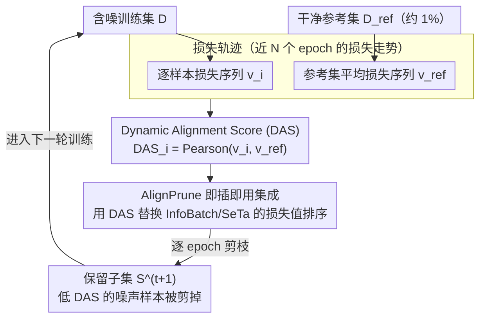

# Beyond Loss Values: Robust Dynamic Pruning via Loss Trajectory Alignment

**会议**: CVPR 2026  
**arXiv**: [2604.07306](https://arxiv.org/abs/2604.07306)  
**代码**: [GitHub](https://github.com/leonqin430/AlignPrune)  
**领域**: 模型压缩/数据剪枝  
**关键词**: 动态数据剪枝, 噪声标签, 损失轨迹, 即插即用模块, 训练效率

## 一句话总结
提出AlignPrune——一个基于损失轨迹对齐的即插即用模块，通过Dynamic Alignment Score（DAS）替代传统损失值排序，使动态数据剪枝在噪声标签场景下准确率提升最高6.3%。

## 研究背景与动机
**领域现状**：大规模数据集训练成本高昂，数据剪枝（data pruning）通过丢弃低效样本减少训练量。动态剪枝（每轮自适应选择子集）比静态剪枝（一次性选定）更灵活鲁棒。

**核心矛盾**：现有动态剪枝方法（InfoBatch、SeTa）依赖**单样本损失值**排序——损失高的样本被保留。但在噪声标签下，**噪声样本恰恰产生高损失**，导致它们被优先保留，污染训练过程。

**关键观察**：干净样本的损失轨迹呈**平滑单调下降**，而噪声样本的损失轨迹呈**非单调、不规则波动**。这种时序模式差异可以被利用。

**核心idea**：用损失轨迹与干净参考集的**相关性**（而非单点损失值）来评估样本质量，低相关性的样本更可能是噪声，应被剪枝。

## 方法详解

### 整体框架
这篇论文要解决的是：动态数据剪枝在有噪声标签时会把噪声样本当成"高价值难样本"留下来，越剪越脏。AlignPrune 的思路是不再看每个样本当前损失有多高，而是看它**这几个 epoch 损失是怎么变化的**——干净样本的损失会跟着模型一起平滑下降，噪声样本则忽上忽下。整体流程上，它给训练集 $\mathcal{D}$ 配一个很小的干净参考集 $\mathcal{D}_{ref}$，每一轮为每个样本算一个对齐分数 DAS，用它替换掉原有方法（InfoBatch、SeTa）里基于损失值的排序，再照常做子集选择和训练。因为只换了"打分"这一步，它能直接挂到现有动态剪枝框架上而不碰其余部分。

### 关键设计

**1. 损失轨迹：用时序行为而非单点损失刻画样本**

单点损失的根本问题在于，难样本和噪声样本都会表现出高损失，光看一个数字根本分不开。AlignPrune 转而为每个样本 $i$ 维护最近 $N$ 个 epoch 的损失序列 $\mathbf{v}_i^{(t)} = [\ell_i^{(t-N+1)}, \ldots, \ell_i^{(t)}]$，同时在干净参考集上算出一条平均损失轨迹 $\mathbf{v}_{ref}^{(t)}$ 作为"健康学习曲线"的参照。难样本虽然损失高，但会和参照一样持续往下走；噪声样本则因为标签和特征矛盾，损失轨迹呈非单调的不规则抖动——把"瞬时高低"换成"一段时间的走势"后，这两类样本就被区分开了。

**2. Dynamic Alignment Score (DAS)：用相关性而非数值量化对齐程度**

有了两条轨迹，需要一个标量来衡量样本到底跟干净模式有多像，AlignPrune 用 Pearson 相关系数：

$$DAS_i^{(t)} = \rho(\mathbf{v}_i^{(t)}, \mathbf{v}_{ref}^{(t)})$$

正的 DAS 说明该样本的学习动态和干净参照同步，大概率是干净样本；负的 DAS 说明二者相悖，大概率是噪声。选 Pearson 而不是直接比损失值，关键在于它**尺度不变**——只看曲线形状的同步性，不受样本绝对损失大小影响，于是高损失的难样本只要走势对就拿高分，不会被误剪；同时它是逐 batch 向量化即可算完的，开销可以忽略。

**3. AlignPrune 即插即用集成：只换排序信号，不动其余一切**

最后一步是把这套打分接进现成框架：直接令 $score_i^{(t)} := DAS_i^{(t)}$，替换掉 InfoBatch / SeTa 里原本基于损失值的样本排序，模型架构、训练流程、梯度更新规则一律不改。这样设计的好处是它继承了宿主方法原有的性质（比如梯度期望的无偏性），代价只是多算一个相关系数，因此能作为一个即插即用模块挂到不同的动态剪枝方法上。

### 损失函数 / 训练策略
- 训练目标不变，只改样本选择策略——剪谁不剪谁由 DAS 决定，被选中的样本仍走原方法的训练流程。
- 损失轨迹存在固定窗口 $N$ 的 memory bank 里，batch 级向量化计算，额外开销极小。
- 参考集 $\mathcal{D}_{ref}$ 假设为干净，但实验显示即使其中混入少量噪声，因为用的是平均轨迹，结果依然鲁棒。

## 实验关键数据

### 主实验（CIFAR-100N, ResNet-18, ~30%剪枝率）

| 方法 | Clean | Real | Sym-0.5 | Sym-0.8 | Asym-0.2 | 平均Δ |
|------|-------|------|---------|---------|----------|------|
| Full-training | 78.2 | 56.1 | 58.6 | 39.8 | 72.4 | -- |
| InfoBatch | 79.0 | 56.1 | 59.7 | 41.8 | 71.9 | +0.6 |
| **InfoBatch+Ours** | **79.3** | **59.4** | **66.0** | 41.8 | **72.6** | **+2.7** |
| SeTa | 79.0 | 55.6 | 59.0 | 41.6 | 71.4 | +0.0 |
| **SeTa+Ours** | **79.3** | **56.3** | **60.5** | 41.6 | **71.9** | **+0.7** |

### 消融实验

| 配置 | 关键指标 | 说明 |
|------|---------|------|
| 相关函数选择 | Pearson > Spearman > Cosine | Pearson兼具尺度不变和效率 |
| 窗口大小N | N=10最优 | 太小噪声敏感，太大响应迟钝 |
| 参考集大小 | 1%数据即足够 | 极少量干净参考即可有效 |
| 参考集含噪 | 10%噪声仍鲁棒 | 平均操作天然抗噪 |
| 大规模数据 | WebVision/Clothing-1M/ImageNet均有效 | 方法可扩展到真实场景 |

### 关键发现
- 在高噪声场景（Symmetric-0.5）下，AlignPrune在InfoBatch上提升**+6.3%**
- 干净标签场景下性能持平或略有提升，不损害原方法表现
- 训练效率也有提升：更高准确率的同时减少总训练时间

## 亮点与洞察
- **简洁有效**：仅替换一个排序准则就实现显著提升，体现了"正确的信号比复杂的方法更重要"
- 损失轨迹的时序模式是区分干净/噪声样本的强信号，之前被数据剪枝领域忽视
- 参考集需求极少（1%数据），实际中易获取

## 局限与展望
- 需要少量干净参考集（虽然量少但仍是额外假设）
- 轨迹窗口前N个epoch无法计算DAS，早期仍依赖损失排序
- 仅验证了分类任务，检测/分割等下游任务待探索
- 与其他噪声学习方法（DivideMix等）的组合潜力未充分挖掘

## 相关工作与启发
- 与静态鲁棒剪枝Prune4ReL形成对比：动态+DAS显著优于静态鲁棒方法
- 损失轨迹思想可推广到主动学习、课程学习等场景
- 对大规模预训练数据清洗有直接应用价值

## 评分
- 新颖性: ⭐⭐⭐⭐ 损失轨迹对齐思路新颖简洁，首次将动态剪枝引入噪声标签场景
- 实验充分度: ⭐⭐⭐⭐⭐ 5个数据集、多种噪声类型、多种剪枝率、详尽消融
- 写作质量: ⭐⭐⭐⭐ 动机清晰，图示直观，理论分析完整
- 价值: ⭐⭐⭐⭐ 即插即用特性使之具有很强的实际应用潜力

<!-- RELATED:START -->

## 相关论文

- [\[CVPR 2026\] Batch Loss Score for Dynamic Data Pruning](batch_loss_score_for_dynamic_data_pruning.md)
- [\[ICLR 2026\] Coupling Experts and Routers in Mixture-of-Experts via an Auxiliary Loss](../../ICLR2026/model_compression/coupling_experts_and_routers_in_mixture-of-experts_via_an_auxiliary_loss.md)
- [\[ICLR 2026\] Rejuvenating Cross-Entropy Loss in Knowledge Distillation for Recommender Systems](../../ICLR2026/model_compression/rejuvenating_cross-entropy_loss_in_knowledge_distillation_for_recommender_system.md)
- [\[ICML 2026\] Dispersion Loss Counteracts Embedding Condensation and Improves Generalization in Small Language Models](../../ICML2026/model_compression/dispersion_loss_counteracts_embedding_condensation_and_improves_generalization_i.md)
- [\[CVPR 2026\] Fixed Anchors Are Not Enough: Dynamic Retrieval and Persistent Homology for Dataset Distillation](fixed_anchors_are_not_enough_dynamic_retrieval_and_persistent_homology_for_datas.md)

<!-- RELATED:END -->
