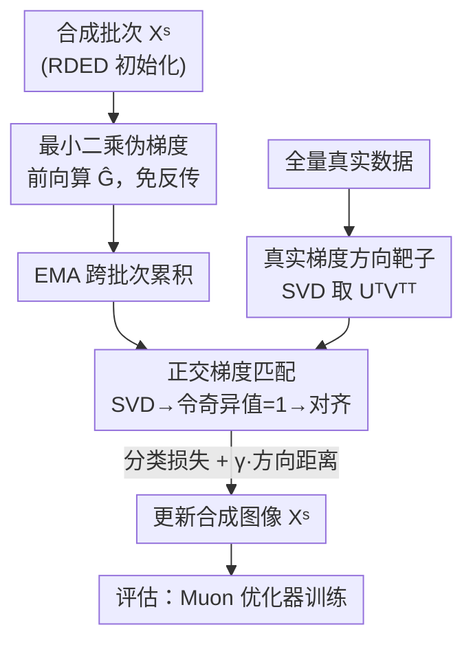

# Beyond Soft Label: Dataset Distillation via Orthogonal Gradient Matching

**会议**: CVPR 2026  
**论文**: [CVF Open Access](https://openaccess.thecvf.com/content/CVPR2026/html/Bo_Beyond_Soft_Label_Dataset_Distillation_via_Orthogonal_Gradient_Matching_CVPR_2026_paper.html)  
**代码**: 无（论文未公开）  
**领域**: 模型压缩 / 数据集蒸馏  
**关键词**: 数据集蒸馏, 梯度方向匹配, 奇异向量, 硬标签, ImageNet-1K  

## 一句话总结
针对现有 ImageNet-1K 数据集蒸馏方法过度依赖 BN 统计匹配、一旦丢掉软标签就崩盘的问题，本文从梯度视角指出 BN 匹配只对齐了梯度的"尺度"而忽略了真正决定训练的"方向"，进而提出 Orthogonal Gradient Matching（OGM）——把真实/合成梯度做 SVD 后强制所有奇异值为 1、只对齐奇异向量，并用最小二乘损失的闭式梯度在前向传播中完成匹配；在 IPC=10 上软标签 47.0%、硬标签 16.7%，显著超过 RDED 等基线。

## 研究背景与动机
**领域现状**：数据集蒸馏（Dataset Distillation, DD）想把大数据集压成几张/几十张每类的合成图，使得在合成集上训练的模型逼近在全量数据上训练的效果。在 ImageNet-1K 这种大尺度数据上，自 SRe2L 起的主流范式是**匹配 BatchNorm 层的统计量**（真实与合成数据的均值、方差），并配合教师模型生成的**软标签**做知识蒸馏来训练学生。

**现有痛点**：这类 BN 匹配方法有两个硬伤。其一，软标签本身占据了绝大部分存储空间——蒸馏的初衷是省存储，结果存储又被软标签吃掉，落地很尴尬。其二，一旦改用**硬标签**（只有 one-hot 类别、没有教师指导），它们的性能断崖式下跌，甚至打不过"随机抽一个子集"这种最朴素的 coreset 做法。论文 Figure 1a 直接显示：硬标签下 SRe2L、G-VBSM 这些"先进方法"全面落后于随机子集。

**核心矛盾**：为什么合成数据离开软标签就不行了？作者从梯度视角给出理论解释（Proposition 1）：带 BN 的线性层反向梯度为 $\nabla_W L = \frac{\gamma}{\sigma}\frac{\partial L}{\partial H}X^\top$，其中方差 $\sigma$ 只缩放梯度的**尺度**，而真正承载优化信息的方向项 $\frac{\partial L}{\partial H}X^\top$ 被 BN 匹配完全忽略。也就是说，BN 匹配根本没学到"怎么优化模型"的知识，只能靠教师软标签兜底。

**切入角度与核心 idea**：作者进一步做了一个关键实验（Section 3.2）：对比 SGD 和 Muon 两个优化器——Muon 会先把矩阵梯度做 SVD、扔掉奇异值、只用奇异向量 $UV^\top$ 更新参数。结果在 IPC=10 的稀疏数据上 Muon 比 SGD 高出 +7.1%。这说明**梯度的方向（奇异向量）而非尺度（奇异值）才是决定训练、尤其是小数据训练的关键**。顺着这个观察，核心 idea 一句话概括：**不去匹配 BN 统计、也不止用余弦距离，而是把真实/合成梯度正交化后直接对齐它们的奇异向量**，让合成数据真正承载模型优化的方向信息。

## 方法详解

### 整体框架
OGM 的目标是优化一批合成图像 $X^S$，使它在蒸馏网络上产生的高阶层梯度，**方向**上与全量真实数据的梯度方向一致。整条流程是"先离线算一次真实梯度方向作为靶子 → 再在线优化每个合成批次去对齐这个靶子"的 local-to-global 结构。

具体地，对一个卷积/全连接等高阶层，先把它的梯度张量 reshape 成二维矩阵 $G\in\mathbb{R}^{c_{out}\times c_{in}\cdot k\cdot k}$，做 SVD 得到 $G=USV^\top$，**令所有奇异值为 1** 得到正交梯度 $G_o=UV^\top$，它只保留方向、不含尺度。匹配损失就是真实方向与合成方向的 MSE。为了避免反向传播带来的两倍训练开销，OGM 不去真算梯度，而是用**最小二乘损失的闭式梯度**（一个伪梯度）来近似，使整个匹配可以在前向传播里完成。训练时再叠加分类损失，并辅以 EMA、RDED 初始化、patch 级增广、Muon 优化器等工程实现。

### 关键设计

**1. 正交梯度匹配 OGM：只对齐方向、扔掉尺度**

这是论文的核心，直接针对"BN 匹配只管尺度、忽略方向"的痛点。传统梯度匹配（GM）用余弦距离 $d(g^T,g^S)=1-\frac{g^T\cdot g^S}{\|g^T\|\|g^S\|}$ 来对齐，但余弦只适合向量，对**矩阵梯度**是逐行算余弦，并不能真正对齐矩阵的方向。OGM 改用"奇异向量"作为矩阵梯度方向的内在表征：把 reshape 后的梯度 $G=USV^\top$ 的奇异值全部置 1，得到正交梯度 $G_o=UV^\top$，这一步**显式消除了尺度信息**。匹配目标定义为真实与合成正交梯度的 Frobenius 范数平方：

$$d(G^T_o, G^S_o) = \big\| U^T V^{T\top} - U^S V^{S\top} \big\|_F^2$$

最终损失结合分类项与方向匹配项 $L=\sum_b L_{cls}(X^S_b,Y^S_b)+\gamma\cdot d(G^T_o,G^S_{o,b})$，其中 $\gamma=0.05$ 固定。消融（Table 3 的 "OGM w/o SVD"）验证了关键性：直接匹配原始梯度（不置奇异值为 1）会持续掉点，说明**尺度信息反而是噪声**，会损害合成数据质量——这正好印证了"方向比尺度重要"的核心假设。

**2. 最小二乘伪梯度：把匹配搬进前向传播、免去反传**

GM 类方法的效率瓶颈在于：要拿到梯度就得反向传播，蒸馏合成数据的时间直接翻倍。OGM 用**最小二乘损失（LSE）的闭式梯度**替代真实梯度来绕开反传。对线性层 $L_{LSE}=\|WX-Y\|_F^2$，其梯度有闭式解 $\nabla_W L_{LSE}=WXX^\top-YX^\top$：第一项 $WXX^\top$ 是输入输出特征图的通道相关，第二项 $YX^\top$ 是各类别的表征。借助 im2col 把卷积等价为矩阵乘法，可推广到 CNN：把输入/输出特征图 reshape 成 $\hat X_{in}\in\mathbb{R}^{c_{in}\times nhw}$、$\hat X_{out}\in\mathbb{R}^{c_{out}\times nhw}$，并把与类别数相关、shape 对不上的 $YX^\top$ 项替换成特征均值 $\mathrm{avg}(\hat X^\top_{in})$，得到最终伪梯度：

$$\hat G = \frac{1}{nhw}\hat X_{out}\hat X^\top_{in} - \mathrm{avg}(\hat X^\top_{in})$$

这个伪梯度**完全在前向传播里就能算出来**，再拿它替换式 (8) 里的真实梯度去做 SVD 和正交化，从而把蒸馏的计算复杂度大幅降低。⚠️ 伪梯度、EMA 与 SVD 的先后顺序以原文 Algorithm 2 为准。

**3. 工程实现组合：EMA + RDED 初始化 + patch 增广 + Muon 评估**

在 local-to-global 框架下，每个合成批次都去逼近全量真实数据，但批次之间互相独立会让合成集缺乏多样性。OGM 用 **EMA** 跨批次累积伪梯度 $\hat G^S_b=\frac{1}{b}\hat G^S_b+(1-\frac{1}{b})\hat G^S_{b-1}$，把历史批次信息融进来。**初始化**上沿用 EDC 的经验，用 RDED 合成的图像而非高斯噪声做初始化，保留语义与真实感。**增广**上发现对 RDED 图做全局 RandomResizedCrop 会混淆不同 patch，于是改用 **patch 级增广**：先随机选一个 patch 再增广，防止过拟合。**优化器**上，既然 Section 3.2 已验证 Muon 在稀疏数据上更强，评估阶段就用 Muon 来释放合成数据的上限（为公平对比，定性实验仍用 Adam 与他人对齐，Muon 只在消融里单独验证）。这四个组件叠加是 OGM 从"和 coreset 持平"一路涨到 SOTA 的关键，消融 Table 3 逐项验证了它们的累积增益。

### 损失函数 / 训练策略
总损失为分类损失 + 方向匹配损失：$L=\sum_{b=1}^{B}L_{cls}(X^S_b,Y^S_b)+\gamma\cdot d(G^T_o,G^S_{o,b})$，$\gamma=0.05$ 固定。蒸馏与评估骨干均为预训练 ResNet-18。流程见 Algorithm 2：对每个合成批次、每个卷积层，前向算特征图 → 伪梯度 → EMA → SVD 正交化 → 最小化总损失更新合成图像。

## 实验关键数据

实验全部在 ImageNet-1K 上进行，统一采用 CDA 的评估策略以保证公平对比，骨干为 ResNet-18。

### 主实验

软标签设置下，各方法差距不大（软标签把教师知识直接传给学生），但 OGM 仍稳居最佳：

| IPC | Random | RDED | SRe2L | G-VBSM | DWA | OGM |
|-----|--------|------|-------|--------|-----|-----|
| 10 | 35.8 | 38.4 | 33.5 | 35.8 | 37.9 | **39.4** |
| 50 | 57.2 | 56.2 | 52.6 | 54.8 | 55.2 | **57.5** |
| 100 | 61.2 | 60.2 | 57.4 | 59.2 | 59.2 | **61.5** |

硬标签设置下差距被彻底放大——训练型 BN 匹配方法（SRe2L/CDA/G-VBSM/LPLD/DWA）几乎全军覆没，连随机子集都打不过，而 OGM 是唯一能超过最强 training-free 基线 RDED 的训练型方法：

| IPC | Random | RDED | SRe2L | CDA | G-VBSM | DWA | OGM |
|-----|--------|------|-------|-----|--------|-----|-----|
| 10 | 4.6 | 11.5 | 1.5 | 1.6 | 1.6 | 1.9 | **11.8** |
| 50 | 20.6 | 30.8 | 3.8 | 5.8 | 9.0 | 5.3 | **31.2** |
| 100 | 31.7 | 39.2 | 4.9 | 8.0 | 16.6 | 7.5 | **39.5** |

一个有意思的点：OGM 在 IPC=50 的表现已接近随机图 IPC=100，相当于用一半存储达到同等效果，让 DD 更实用。

### 消融实验

Table 3（IPC=10）逐项拆解 OGM 的组件，并对比"是否做 SVD 正交化"：

| 配置 | 软标签(w/ SVD) | 硬标签(w/ SVD) | 软标签(w/o SVD) | 硬标签(w/o SVD) |
|------|---------------|---------------|----------------|----------------|
| Basic（原图初始化） | 35.4 | 5.3 | 35.0 | 3.9 |
| + RDED 初始化 | 37.8 | 10.2 | 37.5 | 9.5 |
| + Patch 增广 | 39.4 | 11.8 | 38.8 | 10.6 |
| + Muon 评估 | **47.0** | **16.7** | 45.4 | 14.8 |

### 关键发现
- **SVD 正交化是真增益而非噪声**：同一行对比 w/ SVD 与 w/o SVD，前者全面更高（如硬标签 16.7 vs 14.8），直接证明扔掉奇异值/尺度反而提升了合成数据质量，坐实"方向 > 尺度"的核心论点。
- **每个工程组件都在涨**：硬标签从 Basic 5.3 → RDED 初始化 10.2 → patch 增广 11.8 → Muon 16.7，逐级递增；其中 Muon 优化器贡献最大的跃升（软标签 39.4→47.0）。
- **跨架构泛化强**：在 ResNet-50/101、EfficientNet、MobileNetV2、ConvNext-Tiny 上（Table 4/5），OGM 在软/硬标签下都一致超过 RDED；但作者也观察到硬标签下 ResNet-18 反而击败大多数更大模型，提示现有 DD 仍远未最优。

## 亮点与洞察
- **把"梯度方向 vs 尺度"从优化器理论搬到数据集蒸馏**：借 Muon/Shampoo 的奇异向量更新视角，重新诠释了 BN 匹配为何离不开软标签——这个理论+实验双证的诊断本身就很漂亮，给 DD 指了一条新路。
- **用最小二乘闭式梯度规避反传**：把"算梯度"变成前向传播里的矩阵运算，是个可复用的工程 trick，对任何需要在内层反复算梯度的 bi-level 优化都有启发。
- **"正交化即去尺度"的简洁性**：令奇异值全为 1 这一步极简却命中要害，消融直接证明它有效，这种"做减法"的设计很有说服力。

## 局限与展望
- 方法**只针对高阶（矩阵）参数**做方向匹配，bias、normalization 等向量参数被排除在外，是否会丢信息论文未深究。
- 伪梯度用 $\mathrm{avg}(\hat X^\top_{in})$ 替换类别相关的 $YX^\top$ 项是一个近似，对类别信息的保留程度存疑（⚠️ 这是我的判断，原文未量化该近似的误差）。
- 评估阶段引入 Muon 才达到最佳，但作者也坦言为公平对比定性实验仍用 Adam——意味着报告的 47.0%/16.7% 上限依赖特定优化器，换评估协议时增益可能缩水。
- 硬标签下小模型反超大模型的反常现象，说明当前 DD（包括 OGM）离"真正学到可迁移优化信息"还有距离，是后续值得深挖的方向。

## 相关工作与启发
- **vs SRe2L / G-VBSM（BN 匹配）**：它们对齐 BN 统计、本质只匹配梯度尺度，依赖软标签兜底；OGM 直接对齐梯度方向（奇异向量），在硬标签下从个位数准确率跃升到与 RDED 同档，这是范式层面的区别。
- **vs 经典梯度匹配 GM**：GM 用余弦距离逐行匹配矩阵梯度，无法真正对齐矩阵方向；OGM 用 SVD 奇异向量刻画矩阵的内在方向，并配最小二乘伪梯度免反传，更准也更快。
- **vs RDED（training-free）**：RDED 是最强的免训练基线、也是 OGM 的初始化来源；OGM 在 RDED 之上继续优化并超过它，证明涨点来自真正学到了优化信息而非初始化红利。

## 评分
- 新颖性: ⭐⭐⭐⭐⭐ 把优化器里的"奇异向量方向"视角引入 DD，理论诊断 BN 匹配缺陷并给出正交梯度匹配，视角新颖。
- 实验充分度: ⭐⭐⭐⭐ ImageNet-1K 软/硬标签 + 跨架构 + 优化器影响 + 逐项消融，较完整；但仅 ResNet-18 蒸馏、未公开代码。
- 写作质量: ⭐⭐⭐⭐⭐ 从理论 Proposition 到实验观察再到方法，逻辑链清晰，动机扎实。
- 价值: ⭐⭐⭐⭐ 显著推进了硬标签 DD 的可用性，"方向比尺度重要"的洞察对后续工作有指导意义。

<!-- RELATED:START -->

## 相关论文

- [\[CVPR 2026\] Dataset Distillation by Influence Matching](dataset_distillation_by_influence_matching.md)
- [\[CVPR 2026\] DMGD: Train-Free Dataset Distillation with Semantic-Distribution Matching in Diffusion Models](dmgd_train-free_dataset_distillation_with_semantic-distribution_matching_in_diff.md)
- [\[NeurIPS 2025\] Rectifying Soft-Label Entangled Bias in Long-Tailed Dataset Distillation](../../NeurIPS2025/model_compression/rectifying_soft-label_entangled_bias_in_long-tailed_dataset_distillation.md)
- [\[CVPR 2026\] Rethinking Dataset Distillation: Hard Truths about Soft Labels](rethinking_dataset_distillation_hard_truths_about_soft_labels.md)
- [\[CVPR 2026\] Mitigating The Distribution Shift of Diffusion-based Dataset Distillation](mitigating_the_distribution_shift_of_diffusion-based_dataset_distillation.md)

<!-- RELATED:END -->
