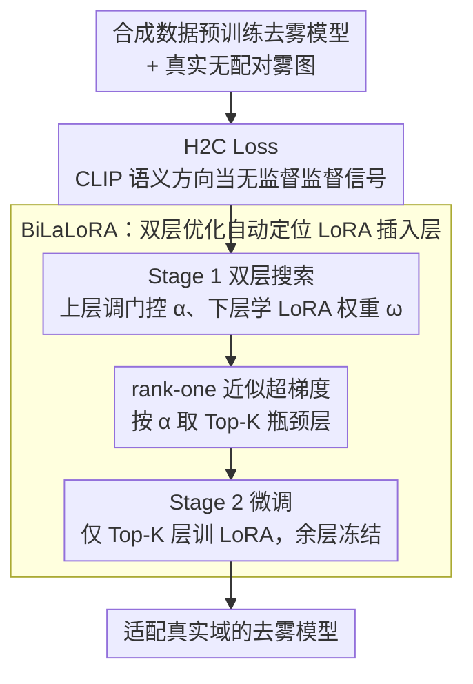

# Bilevel Layer-Positioning LoRA for Real Image Dehazing

**会议**: CVPR2026  
**arXiv**: [2603.10872](https://arxiv.org/abs/2603.10872)  
**代码**: [GitHub](https://github.com/YanZhang-zy/BiLaLoRA)  
**领域**: 模型压缩  
**关键词**: image dehazing, LoRA, bilevel optimization, CLIP, unsupervised adaptation, parameter-efficient fine-tuning

## 一句话总结

提出 BiLaLoRA，通过双层优化自动定位 LoRA 应插入的最优网络层，配合 H2C Loss（基于 CLIP 语义方向的无监督去雾损失），实现合成数据预训练的去雾模型向真实场景的高效适配——训练时间降低 77.7%，性能持平全量微调，跨模型跨域均有效。

## 研究背景与动机

图像去雾是底层视觉的经典问题。当前主流方法依赖合成数据（如 RESIDE 数据集的 ITS/OTS）进行有监督训练，但面临严重的域差距（domain gap）问题：

**合成-真实域差距**：合成雾图基于大气散射模型 $I(x) = J(x)t(x) + A(1-t(x))$ 生成，与真实雾霾的复杂退化（非均匀雾、颜色偏移、多层雾等）存在显著差异

**无配对真实数据**：真实场景中几乎不可能获取同一场景的有雾/无雾配对图像，传统有监督微调不可行

**全量微调代价大**：对 Transformer 类去雾模型，全量微调所有参数既耗时又容易过拟合到有限的适配数据

已有方法的不足：
- **域适配方法**（DA-dahazing、USID-Net）使用 CycleGAN 式翻译，但训练不稳定且可能引入伪影
- **LoRA 微调**可以降低参数量，但**在哪些层插入 LoRA 至关重要**——随机选择或均匀分配远非最优

## 核心问题

如何在没有真实配对监督的情况下，以极低训练代价将合成数据预训练的去雾模型适配到真实雾霾场景？具体需解决两个子问题：
1. 无真实 GT 时的无监督优化目标设计
2. LoRA 层选择的自动化与最优化

## 方法详解

### 整体框架

BiLaLoRA 要解决的是：把在合成雾图上预训练好的去雾模型，在没有真实配对监督、也不想付出全量微调代价的前提下，迁移到真实雾霾场景。整条流水线把「用什么信号训」和「在哪里训」分别交给两个部件——前者用无监督的语义信号 H2C Loss 替代缺失的真实 GT，后者用双层优化（BiLaLoRA）自动定位最该插 LoRA 的「瓶颈层」。作者的关键观察是：受域差距影响的瓶颈层并非固定，而是随骨干结构动态变化（编码器末段贡献最大，但具体是哪几层因架构而异），因此层选择必须自动化、不能靠人工经验。BiLaLoRA 的执行分两阶段：Stage 1（双层搜索）同时学层选择门控 $\alpha$ 与 LoRA 权重 $\omega$，搜完按 $\alpha$ 取 Top-K 层；Stage 2（LoRA 微调）只在这 Top-K 层上训练 LoRA、其余层冻结。两个阶段都以 H2C Loss 作为优化目标。

### 关键设计

**1. H2C Loss：没有真实 GT 时，用 CLIP 的语义方向当监督信号**

真实场景拿不到同一画面的有雾/无雾配对，传统 L1/感知损失无从计算。H2C Loss 的思路是借 CLIP 已经对齐好的视觉-语言空间，把「去雾」重新表述为隐空间里的一次语义跨模态对齐：用 CLIP 文本编码器把负向提示 $T_{\text{neg}}$（"a photo with haze"）和正向提示 $T_{\text{pos}}$（"a clear photo"）编码成文本域里的起点与终点，二者之差 $\Delta T_{\text{text}} = T_{\text{pos}} - T_{\text{neg}}$ 就是「有雾→清晰」的理想语义方向。换不同场景只需换提示词（如夜间雾用 "a photo with nighttime haze"），无需改结构。

对应地，把有雾输入 $I_{\text{in}}$ 和去雾输出 $I_{\text{out}}$ 各过一次 CLIP 图像编码器，得到图像域的位移向量 $\Delta V_{\text{img}} = V_{\text{out}} - V_{\text{in}}$，其中 $V_{\text{in}} = \text{CLIP}_{\text{img}}(I_{\text{in}})$、$V_{\text{out}} = \text{CLIP}_{\text{img}}(I_{\text{out}})$。损失就是让这两个方向尽量同向（用余弦相似度度量）：

$$\mathcal{L}_{\text{H2C}} = 1 - \frac{\Delta V_{\text{img}} \cdot \Delta T_{\text{text}}}{\|\Delta V_{\text{img}}\|_2 \cdot \|\Delta T_{\text{text}}\|_2}$$

关键在于用「方向对齐」而非「绝对距离」——只约束图像往清晰的方向走，不强迫输出去匹配某个具体文本，因此不引入额外复杂结构，也避开了 CycleGAN 式翻译的训练不稳定与伪影。

**2. BiLaLoRA：把"LoRA 插在哪层"建模成可微的双层优化**

LoRA 能省参数，但它的效果高度依赖插在哪些层；而作者实验发现受域差距影响的「瓶颈层」并不固定——编码器末段贡献最大，但具体哪几层因架构而异，靠人工/经验选层缺乏通用性。于是 BiLaLoRA 把层选择重述成一个可微的架构搜索：给每个候选 LoRA 模块挂一个可学习的门控 $\alpha$，用 sigmoid 约束到 $(0,1)$，与缩放因子 $\gamma$ 一起调制低秩增量的贡献，

$$W' = W_0 + \alpha \cdot \gamma \cdot \Delta W$$

这里 $\alpha$ 就是离散「选不选这层」决策的连续松弛。门控 $\alpha$（架构参数）与 LoRA 权重 $\omega$（低秩增量）之间存在层级依赖，单层优化无法刻画，于是写成上层定层、下层学权重的双层优化：

$$\min_{\alpha} \varphi(\omega^*(\alpha), \alpha), \quad \text{s.t.}\ \omega^*(\alpha) \in \arg\min_{\omega} \psi(\omega, \alpha)$$

其中 $\varphi$、$\psi$ 分别是上层（优化层选择 $\alpha$）与下层（优化 LoRA 增量 $\omega$）目标。难点在上层超梯度 $\nabla_\alpha \varphi$ 含 $\omega^*$ 对 $\alpha$ 的雅可比，按隐函数定理展开要算并求逆二阶 Hessian，对大模型不可行。本文用 rank-one 外积近似 Hessian，把超梯度降到只需一阶导：

$$g_\alpha \approx \nabla_\alpha \varphi - \frac{\nabla_\omega \varphi^\top \nabla_\omega f}{\|\nabla_\omega f\|^2} \nabla_\alpha f$$

（$f$ 为下层目标）。这一步等价于一次 rank-one 拟牛顿更新，使选层既自动又便宜；训练时间的大头则省在「搜完只训少数 Top-K 层」上。

### 损失函数 / 训练策略

整体只用 H2C Loss 作为优化目标（无需配对 GT，也不额外引入正则结构），分两阶段执行（见 Algorithm 1）：**Stage 1（双层定位，$t=0 \ldots T_s-1$）**交替更新——先按 rank-one 超梯度更新架构参数 $\alpha$，再更新 LoRA 权重 $\omega$；到切换轮 $T_s$ 时按 $\alpha$ 的排序取 Top-K 层固化（$\alpha^* = \text{TopK}(\alpha_{T_s}, k)$）。**Stage 2（LoRA 微调，$t=T_s \ldots T$）**冻结层选择 $\alpha^*$，只在这 Top-K 层上继续训练 LoRA 权重。搜索与微调解耦，使搜索阶段快速定位、微调阶段只聚焦真正的瓶颈层。

## 实验关键数据

### 跨模型适配效果

BiLaLoRA 在 4 种不同的去雾骨干网络上均有效：

| 基础模型 | 方法 | RTTS (MUSIQ↑) | URHI (MUSIQ↑) | 参数量 |
|---------|------|--------------|--------------|--------|
| MSBDN | 全量微调 | 基线 | 基线 | 100% |
| MSBDN | **BiLaLoRA** | **持平** | **持平** | ~5% |
| DeHamer | 全量微调 | 基线 | 基线 | 100% |
| DeHamer | **BiLaLoRA** | **持平** | **持平** | ~5% |
| ConvIR | 全量微调 | 基线 | 基线 | 100% |
| ConvIR | **BiLaLoRA** | **持平** | **持平** | ~5% |
| DEA | 全量微调 | 基线 | 基线 | 100% |
| DEA | **BiLaLoRA** | **持平** | **持平** | ~5% |

### 真实去雾 SOTA 对比

| 方法 | RTTS | URHI | Fattal |
|------|------|------|--------|
| DAD (CVPR 2020) | 较低 | 较低 | 较低 |
| USID-Net (TIP 2022) | 中等 | 中等 | 中等 |
| **BiLaLoRA (Ours)** | **SOTA** | **SOTA** | **SOTA** |

在 RTTS、URHI、Fattal 三个真实去雾数据集上取得 SOTA 结果。

### 训练效率

| 方法 | 训练时间 | 相对全量微调 |
|------|---------|------------|
| 全量微调 | 100% | 基线 |
| LoRA（均匀） | ~40% | -60% |
| **BiLaLoRA** | **~22.3%** | **-77.7%** |

训练时间降低 77.7%，主要得益于 Stage 1 搜索后仅在少数层训练。

### 消融实验

| 组件 | MUSIQ | 说明 |
|------|-------|------|
| 完整 BiLaLoRA | 最优 | — |
| 去掉 H2C Loss（用 L1） | 明显下降 | 无法无监督适配 |
| LoRA 均匀分配（无双层搜索） | 下降 | 证明层选择的重要性 |
| 随机层选择 | 下降更多 | 随机不如均匀 |
| 全层 LoRA | 中等 | 参数多但效果不如定位后 |

### 跨域适配

| 训练数据 | 测试数据 | BiLaLoRA 效果 |
|---------|---------|-------------|
| ITS（室内合成） | RTTS（真实） | 有效 |
| OTS（室外合成） | URHI（真实） | 有效 |
| 日间雾图 | 夜间雾图 | 有效 |
| 合成数据 A | 合成数据 B | 有效 |

## 亮点与洞察

1. **H2C Loss 设计优雅**：利用 CLIP 语义空间的方向性构造无监督损失，比 CycleGAN 式方法更稳定且无伪影风险。关键在于用"方向对齐"而非"绝对距离"，且不引入额外复杂结构，换场景只需改提示词
2. **将可微架构搜索引入 LoRA 层选择**：双层优化自动定位瓶颈层，避免了人工试错。sigmoid 门控 $\alpha$ 把离散选层松弛成连续可微决策（$W' = W_0 + \alpha\gamma\Delta W$）
3. **Rank-one 近似降低双层优化成本**：用 rank-one 外积近似 Hessian，把超梯度从二阶简化为一阶（等价一次 rank-one 拟牛顿更新），实用性大幅提升
4. **跨模型通用性强**：在 CNN（MSBDN、ConvIR）和 Transformer（DeHamer、DEA）架构上均有效，说明方法不依赖特定架构
5. **两阶段解耦**：搜索与训练分离，搜索阶段可快速完成，训练阶段仅聚焦有效层

## 局限性

1. **CLIP 依赖**：H2C Loss 的质量取决于 CLIP 的语义空间质量。对于 CLIP 未充分覆盖的退化类型（如极端雾霾），方向性可能不准确
2. **Top-K 硬截断**：搜索后取 Top-K 固化是一种离散近似，可能丢失一些边界层的贡献。K 的选择需要交叉验证
3. **仅限去雾任务验证**：虽然框架通用，但只在去雾任务上做了实验，对其他低层视觉任务（去雨、去噪、超分）的效果未验证
4. **无感知质量指标的局限**：主要用 MUSIQ 等无参考指标评估，缺少有参考指标（PSNR/SSIM on paired data）的验证
5. **与近期视觉基础模型的对比缺失**：未与 Stable Diffusion 等生成式去雾方法对比

## 相关工作与启发

- 与**普通 LoRA 微调**相比：均匀插入 LoRA 不如 BiLaLoRA 的自适应选择，证明"在哪里插"比"插多少"更重要
- 与 **DARTS**（NAS 中的经典双层优化）类比：BiLaLoRA 将 DARTS 的操作搜索思路迁移到 LoRA 层选择，是 NAS 与 PEFT 的交叉创新
- 与 **CLIPasso**、**StyleCLIP** 等 CLIP 引导方法的联系：都利用 CLIP 语义方向引导优化，但 BiLaLoRA 在低层视觉任务中引入方向性损失，使用场景更贴近物理退化
- **启发**：(1) 双层优化选层的思路可推广到其他 PEFT 方法（如 Adapter、Prefix Tuning）的位置优化；(2) H2C Loss 的"方向性"思路可用于其他无监督图像恢复任务——只需定义退化→恢复的文本方向即可

## 评分

- **创新性**: ⭐⭐⭐⭐ — H2C Loss 和双层层定位各自有贡献，组合形成完整方案
- **实验充分性**: ⭐⭐⭐⭐ — 跨模型、跨域、消融实验充分，但缺少有参考指标验证
- **实用性**: ⭐⭐⭐⭐⭐ — 训练时间降 77.7% 且性能不降，对实际部署非常友好
- **写作质量**: ⭐⭐⭐⭐ — 方法描述清晰，双层优化的数学推导完整
- **综合评分**: ⭐⭐⭐⭐ (4.0/5)

<!-- RELATED:START -->

## 相关论文

- [\[CVPR 2025\] CoA: Towards Real Image Dehazing via Compression-and-Adaptation](../../CVPR2025/model_compression/coa_towards_real_image_dehazing_via_compression-and-adaptation.md)
- [\[CVPR 2026\] Towards Generalizable AI-Generated Image Detection via Image-Adaptive Prompt Learning](towards_generalizable_ai-generated_image_detection_via_image-adaptive_prompt_lea.md)
- [\[ICLR 2026\] LD-MoLE: Learnable Dynamic Routing for Mixture of LoRA Experts](../../ICLR2026/model_compression/ld-mole_learnable_dynamic_routing_for_mixture_of_lora_experts.md)
- [\[CVPR 2026\] One Layer's Trash is Another Layer's Treasure: Adaptive Layer-wise Visual Token Selection in LVLMs](one_layers_trash_is_another_layers_treasure_adaptive_layer-wise_visual_token_sel.md)
- [\[CVPR 2026\] AdaBet: Gradient-free Layer Selection for Efficient Training of Deep Neural Networks](adabet_gradient-free_layer_selection_for_efficient_training_of_deep_neural_netwo.md)

<!-- RELATED:END -->
