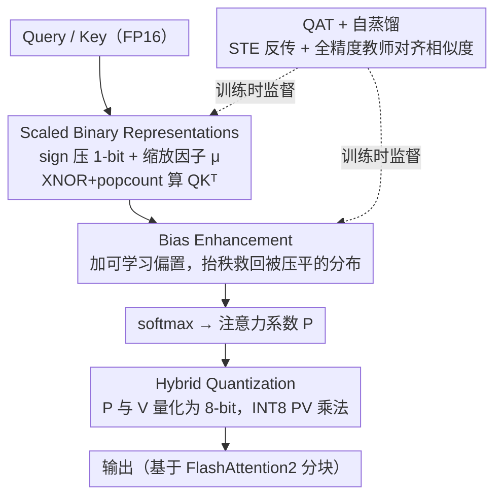

# BinaryAttention: One-Bit QK-Attention for Vision and Diffusion Transformers

**会议**: CVPR 2026  
**arXiv**: [2603.09582](https://arxiv.org/abs/2603.09582)  
**代码**: [EdwardChasel/BinaryAttention](https://github.com/EdwardChasel/BinaryAttention)  
**领域**: 模型压缩  
**关键词**: attention quantization, binary quantization, vision transformer, diffusion transformer, 1-bit attention, FlashAttention

## 一句话总结

提出 BinaryAttention，将 Transformer 注意力中的 Query 和 Key 量化为 1-bit 二值表示，通过 XNOR + popcount 位运算替代浮点点积，在 A100 上实现比 FlashAttention2 快 2 倍以上的加速，同时在视觉分类/检测/分割/扩散生成等任务上性能持平甚至超越全精度注意力。

## 研究背景与动机

**注意力计算是瓶颈**：标准 Transformer 注意力的计算复杂度与序列长度呈二次关系，在高分辨率视觉任务中成为推理效率的主要瓶颈。

**现有量化局限于 8-bit/4-bit**：SageAttention 系列将 QK 量化到 INT8/INT4/FP4，但进一步降至 sub-4-bit 特别是二值（1-bit）时，信息损失剧烈、优化不稳定，性能急剧下降。

**架构替代方案的代价**：Linear Attention、Sparse Attention、SSM（如 Mamba）等虽降低复杂度，但往往牺牲了标准注意力在多样化任务上的表达能力。

**硬件对二值运算的天然支持**：NVIDIA A100 Tensor Core 的二值运算理论吞吐量高达 4992 TOPs/s，是 FP16 的 16 倍，为极低比特注意力提供了硬件基础。

**理论可行性**：作者从距离度量（Hamming 距离 vs. 欧式距离）和方向相似度（余弦相似度保持）两个视角证明，二值化后注意力的核心"相似性关系"可被保留。

**实际加速需求**：与改变架构的方法正交，量化注意力计算是一种保持架构不变、即插即用的加速方式，具有更强的通用性和实用性。

## 方法详解

### 整体框架

BinaryAttention 想在不改注意力架构的前提下，把最耗算力的 $\mathbf{QK}^\top$ 点积换成位运算来加速。它的做法是一条链：先把 Query / Key 量化成带缩放因子的 1-bit 二值向量，用 XNOR + popcount 算相似度（Scaled Binary Representations）；再给二值得分加一个可学习偏置，补回被压平的注意力分布（Bias Enhancement）；softmax 之后的注意力系数和 Value 则统一走 8-bit 量化，让 PV 乘法这一半也提速（Hybrid Quantization）；整套量化最后靠 QAT + 自蒸馏训练落地。整个 kernel 直接长在 FlashAttention2 的 tiled attention 框架上，复用它的 IO 友好分块，所以加速是叠加在 FlashAttention2 之上而非另起炉灶。

### 关键设计

**1. Scaled Binary Representations：把 Q/K 压到 1-bit，让相似度退化成位运算**

注意力里最贵的就是 $\mathbf{QK}^\top$ 这步浮点点积，二值化的目标就是把它变成 GPU 最擅长的位运算。具体做法是每个 query $\mathbf{q}_i$ 和 key $\mathbf{k}_j$ 先过 sign 函数压成 $\{-1,+1\}^d$ 的二值向量，再各自乘回一个标量缩放因子，得到 $\mathbf{s}_i = \mu_q \cdot \text{sign}(\mathbf{q}_i)$、$\mathbf{t}_j = \mu_k \cdot \text{sign}(\mathbf{k}_j)$。这样相似度 $\mu_q \mu_k\, \mathbf{s}_i^\top \mathbf{t}_j$ 里真正的向量乘法只剩 $\pm1$ 相乘，一条 XNOR + popcount 指令就能算完，$\mathbf{QK}^\top$ 理论上拿到 16× 加速——这正好对应 A100 二值 Tensor Core 高达 4992 TOPs/s、是 FP16 十六倍的吞吐。它之所以没把精度算崩，靠的是 Theorem 1：二值 Q/K 的外积是原始协方差矩阵的一致估计，也就是说丢掉幅值、只留符号，统计意义上 token 之间的相似性结构仍然保得住；而额外留下的缩放因子 $\mu_q,\mu_k$ 又把被 sign 抹掉的幅值信息塞了回去，进一步压低量化误差。

**2. Bias Enhancement：加一个可学习偏置，救回被 1-bit 压平的注意力分布**

1-bit 把幅值彻底扔了，副作用是注意力得分矩阵的秩骤降，softmax 之后分布趋于均匀，论文称之为 "flattened effect"——模型分不清哪个 token 重要，判别力消失。修补的办法很直接，在二值点积上加一个偏置项：

$$S_{ij} = \mu_q \mu_k\, \mathbf{s}_i^\top \mathbf{t}_j / \sqrt{d} + b_{ij}$$

其中 $b_{ij}$ 可以是 dense 可学习矩阵、相对位置偏置或上下文感知偏置。偏置把上下文与空间结构信息重新注入得分矩阵，抬高它的秩，让 softmax 重新拉开差距、恢复区分显著特征的能力。消融里这一项对小模型尤其关键（DeiT-T +0.44%），因为小模型本身冗余少，被二值化压平后更难自己救回来。

**3. Hybrid Quantization：顺手把 PV 乘法也量化掉，才换得到端到端加速**

只把 QK 变成位运算其实只省了一半——softmax 后的系数矩阵 $P$ 与 Value 之间的 $\mathbf{PV}$ 乘法同样是瓶颈，不处理它整体延迟就下不来。这里对 softmax 输出系数 $P_{ij}$ 用无符号 8-bit 静态量化（scale 固定为 $1/255$，因为系数天然落在 $[0,1]$），对 Value $\mathbf{v}_j$ 用 channel-wise 8-bit 量化，$\mathbf{PV}$ 乘法走 INT8 Tensor Core 指令 `mma.s32.u8.s8.s32`，这部分拿到 2× 加速。之所以这里只用 8-bit 而不冒险压到 1-bit，是因为注意力系数和 V 的数值范围都很温和，8-bit 已足够保精度；QK 的 16× 再叠上 PV 的 2×，才拼出真正可观的端到端提速。

**4. QAT + 自蒸馏：用感知量化训练加全精度老师，扛住 1-bit 的分布漂移**

1-bit 引入的近似误差和分布偏移太大，纯 PTQ（训练后直接量化）救不回来，所以本文把量化搬进训练里。前向传播对 Q/K 走真实的 sign 量化，反向传播则用 STE（直通估计器）让不可导的 sign 绕过梯度阻断照常更新；同时拿全精度预训练模型当教师做自蒸馏，蒸馏 loss 逼着二值注意力的相似度去对齐全精度的 sign-aligned similarity。QAT 让模型训练时就"见过"量化噪声、提前适应，蒸馏则给二值表示一个明确的对齐目标。消融显示自蒸馏对大模型 DeiT-B 提升 +0.66%，说明它确实在对抗量化带来的分布漂移。

## 损失函数与训练策略

- **QAT 训练**：前向传播中对 Q/K 执行 sign 量化，反向传播通过 STE 近似梯度
- **自蒸馏**：全精度预训练模型作为教师，蒸馏 loss 鼓励二值注意力与全精度注意力的 sign-aligned similarity
- **硬件实现**：基于 FlashAttention2 框架，QK 乘法使用 `mma.s32.b1.b1.s32` PTX 指令，PV 乘法使用 `mma.s32.u8.s8.s32` 指令

## 实验关键数据

### 表1：ImageNet-1K 图像分类（Top-1 Accuracy）

| 方法 | 规模 | 分辨率 | OPs | Top-1 (%) |
|------|------|--------|-----|-----------|
| DeiT-T (FlashAttention2) | 6M | 224² | 1.2G | 72.2 |
| SageAttention-T | 6M | 224² | 1.2G | 72.11 |
| **BinaryAttention-T** | **6M** | **224²** | **1.1G** | **72.88** |
| DeiT-S | 22M | 224² | 4.6G | 79.8 |
| SageAttention-S | 22M | 224² | 4.5G | 79.82 |
| **BinaryAttention-S** | **22M** | **224²** | **4.3G** | **80.24** |
| DeiT-B | 87M | 384² | 55.4G | 83.1 |
| SageAttention-B | 87M | 384² | 53.2G | 82.89 |
| **BinaryAttention-B** | **87M** | **384²** | **50.2G** | **83.64** |

### 表2：ADE20K 语义分割（mIoU）

| Backbone | OPs | mIoU (SS) | mIoU (MS) |
|----------|-----|-----------|-----------|
| DeiT-B | 2654G | 46.86 | 47.74 |
| SageAttention-B | 2539G | 46.86 | 47.74 |
| **BinaryAttention-B** | **2384G** | **47.76** | **48.37** |

### 表3：DiT-XL/2 图像生成（ImageNet 256×256, cfg=1.50）

| 方法 | OPs | 训练步数 | FID↓ | IS↑ |
|------|-----|---------|------|-----|
| FlashAttention2 | 118.6G | 7000K | 2.27 | 278.24 |
| SageAttention | 117.1G | 7000K | 2.27 | 278.03 |
| **BinaryAttention** | **115.0G** | **4000K** | **2.19** | **278.03** |

### 表4：消融实验（ImageNet-1K Top-1）

| Scale | Bias | Distill | DeiT-T | DeiT-S | DeiT-B |
|-------|------|---------|--------|--------|--------|
| ✗ | ✗ | ✗ | 71.95 | 79.59 | 81.10 |
| ✓ | ✗ | ✗ | 72.42 | 79.81 | 81.33 |
| ✓ | ✗ | ✓ | 72.44 | 79.97 | 81.99 |
| ✓ | ✓ | ✓ | **72.88** | **80.24** | **82.04** |

## 亮点与洞察

1. **理论与实践结合**：Theorem 1 从高斯假设下给出二值注意力保留协方差结构的理论保证，不同于大多数量化工作的纯经验做法。
2. **超越全精度**：多个任务和模型规模上 BinaryAttention 性能超过全精度 FlashAttention2，说明 QAT + 蒸馏下二值化起到了正则化作用。
3. **实际加速显著**：Kernel 层面比 FlashAttention2 快 2×，端到端在 1024² 输入上快 1.5×，且与现有线性层量化方法（如 PTQ4ViT）可无缝组合。
4. **生成任务有效**：在 DiT/SiT 扩散模型上以更少训练步数取得可比甚至更优 FID，表明二值注意力在生成式模型中同样适用。
5. **偏置项的巧妙设计**：通过简单的相对位置偏置即可有效对抗二值化的分布塌缩，且对小模型效果更显著，洞察清晰。

## 局限性

1. **需要 QAT 微调**：不是 PTQ 方案，需要从全精度模型出发进行微调训练，增加了部署成本。
2. **硬件依赖**：二值 Tensor Core 指令（`mma.b1`）目前仅 NVIDIA GPU 支持，其他硬件平台的可移植性未探讨。
3. **理论假设限制**：Theorem 1 依赖零均值高斯假设，实际 Q/K 分布可能偏离，理论保证的严格性有限。
4. **大模型验证不足**：实验仅到 DeiT-B / DiT-XL 级别（~87M参数），对 ViT-L/H 或多模态大模型（如 LLaVA）的适用性未知。
5. **Value 未做极低比特量化**：V 仍保留 8-bit，PV 部分加速有限（仅 2×），若 V 也可进一步压缩将获得更大收益。

## 相关工作与启发

- **SageAttention 系列** [Zhang et al.]：INT8→INT4→FP4 渐进式注意力量化路线，BinaryAttention 将其推向 1-bit 极限。
- **FlashAttention** [Dao et al.]：IO-aware tiled attention 的硬件优化框架，BinaryAttention 直接基于其实现，属于互补关系。
- **Binary Neural Networks**（如 BiT [Liu et al.]、BiBERT [Qin et al.]）：此前二值化主要施加于线性层权重/激活，本文首次将其成功应用于注意力 QK 计算。
- **DiT / SiT**：扩散 Transformer 的代表架构，本文验证了二值注意力在生成式模型中的可行性，为高效扩散模型提供新方向。
- **启发**：二值化 + 偏置补偿的思路可迁移至其他需要高效注意力的场景，如视频理解（长序列）、点云处理（大规模点集）等；与 KV Cache 压缩结合可能进一步降低 LLM 推理延迟。

## 评分

- **新颖性**: ⭐⭐⭐⭐ — 首次成功将注意力 QK 量化推至 1-bit 且性能不降，理论分析有深度
- **实验充分度**: ⭐⭐⭐⭐⭐ — 覆盖分类/检测/分割/生成四大任务，消融详尽，kernel 和端到端效率均有评估
- **写作质量**: ⭐⭐⭐⭐ — 理论推导清晰，实验组织有条理，偏置项的动机解释直观
- **价值**: ⭐⭐⭐⭐ — 实际加速显著且即插即用，与现有量化/加速方法正交互补，实用性强

<!-- RELATED:START -->

## 相关论文

- [\[CVPR 2026\] Trainable Log-linear Sparse Attention for Efficient Diffusion Transformers](trainable_log-linear_sparse_attention_for_efficient_diffusion_transformers.md)
- [\[CVPR 2026\] ResCa: Residual Caching for Diffusion Transformers Acceleration](resca_residual_caching_for_diffusion_transformers_acceleration.md)
- [\[CVPR 2026\] LS-ViT: Least-Squares Hessian Based Block Reconstruction for Low-Bit Post-Training Quantization of Vision Transformers](ls-vit_least-squares_hessian_based_block_reconstruction_for_low-bit_post-trainin.md)
- [\[CVPR 2026\] Saliency-Driven Token Merging for Vision Transformers](saliency-driven_token_merging_for_vision_transformers.md)
- [\[CVPR 2026\] PPCL: Pluggable Pruning with Contiguous Layer Distillation for Diffusion Transformers](ppcl_pluggable_pruning_dit_distillation.md)

<!-- RELATED:END -->
