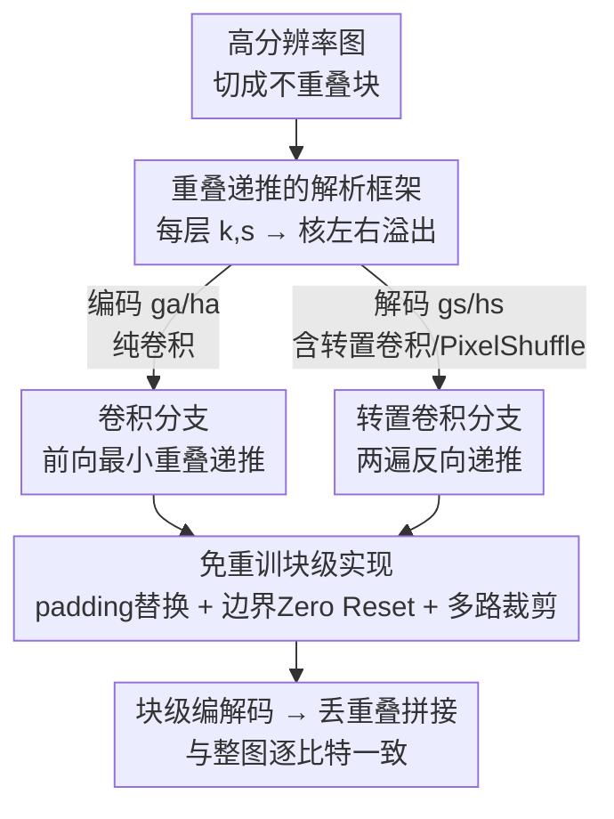

# Block-based Learned Image Compression without Blocking Artifacts

**会议**: CVPR 2026  
**论文**: [CVF Open Access](https://openaccess.thecvf.com/content/CVPR2026/html/Kim_Block-based_Learned_Image_Compression_without_Blocking_Artifacts_CVPR_2026_paper.html)  
**代码**: 无  
**领域**: 模型压缩 / 学习图像压缩  
**关键词**: 学习图像压缩, 块级编码, 重叠传播, 峰值内存, 免重训  

## 一句话总结
本文用一套解析递推公式，精确算出 CNN 图像压缩模型按块编解码时每层所需的**最小重叠**，从而让现成模型在不重训的前提下按块运行、峰值内存降到约 13%，且重建结果与整图推理逐比特一致、完全没有块边界伪影。

## 研究背景与动机
**领域现状**：学习图像压缩（Learned Image Compression, LIC）已经能匹配甚至超过 VVC 等传统编解码器，主流是 Ballé 的 VAE 架构——编码器 $g_a$ 把图像 $x$ 变成隐变量 $y$，超先验编码器 $h_a$ 提取统计量 $z$，解码端用熵模型重建。

**现有痛点**：这类模型解码高分辨率图时峰值内存爆炸。论文给出的例子是 ELIC 解码单张 4K 图就要约 3.95 GB 显存，移动/嵌入式设备根本扛不住。传统编解码器靠**按块处理**（JPEG 的 8×8 DCT、HEVC/VVC 的块架构）天然省内存，但 CNN-based LIC 依赖很宽的感受野，一旦切块、块外信息丢失，低码率下就会在块边界产生明显的 blocking artifacts。

**核心矛盾**：省内存（切块独立处理）和无伪影（需要跨块上下文）之间存在直接冲突。已有的混合方案要么额外接一个后处理网络去抑制伪影（带来不可忽略的算力开销，且只能压低数据集上的平均伪影、无法对任意图都消除），要么像 JPEG-AI 那样给每块加**重叠区**（overlap）来引入边界外的上下文。

**本文目标**：让现成 LIC 模型能按块跑，同时既无伪影、又保持率失真（RD）性能，且不需要重训。

**切入角度**：JPEG-AI 的 patch-based 方案思路对——给块加重叠就能拿到边界外上下文——但它靠**经验搜索**确定重叠大小：重叠太小会残留伪影，太大又浪费内存算力，而且架构一变就得重搜一遍，无法保证最优。作者观察到，重叠到底要多大其实**完全由网络结构（每层 kernel、stride）决定**，是可以解析推导的，不必试错。

**核心 idea**：把重叠在卷积/转置卷积层间的**传播**写成递推关系，一次性解析地算出"保证块级重建等价于整图推理"所需的每层最小重叠，再配一套免重训的实现规则，把任意 CNN-based LIC 改造成块级版本。

## 方法详解

### 整体框架
方法要解决的是一个看似工程、实则可严格推导的问题：把一张高分辨率图切成若干块，每块带上一圈"重叠边"独立送进现成的 LIC 模型，处理完丢弃重叠、拼回整图——只要这圈重叠**恰好够大**，拼出来的图就和整图推理一模一样。整条管线分两段：先**离线解析**算出每层最小重叠 $(l_n, r_n)$，再**在线按块**用一套 padding / 边界 / 多路规则跑现成模型。

关键洞察是：卷积的感受野会随层数累积膨胀，所以"为了让第 0 层（输出）某个像素正确，第 $N$ 层（输入）需要多大邻域"是可以一层层递推的。编码器 $g_a$、超编码器 $h_a$ 只含卷积，重叠**沿层号增大方向**增长；解码器 $g_s$、超解码器 $h_s$ 含转置卷积和 PixelShuffle，重叠**沿层号减小方向**增长——两类分支用各自的递推公式，最后合并得到整个模型的最小重叠。算出重叠后，实现端把"重叠"当作 padding 的替代，并针对图像边界块和残差/门控这种多路结构做特殊处理，保证逐比特等价。

### 关键设计

**1. 重叠递推的解析框架：把感受野膨胀写成可推导的层间关系**

这是全文的地基，针对"重叠该多大只能靠试"的痛点。作者先立两条假设把空间缩放变得可预测：**假设 1** 输入尺寸是 stride 的整数倍，于是卷积严格降采样 $s_n$ 倍、转置卷积严格升采样 $s_n$ 倍（$X_{n-1}=X_n/s_n$、块尺寸 $B_n$ 同理）；**假设 2** 卷积从"核中心对齐未填充输入的第一个元素"开始、每次移动 $s_n$。在这两条下，核中心索引 $c_n=\lfloor (k_n-1)/2\rfloor$，第一次卷积时核**伸出左边界**的元素数 $k^l_n=c_n$，最后一次伸出右边界的元素数为

$$k^r_n=\max\big(0,\,(k_n-1-k^l_n)-(s_n-1)\big)$$

这两个"核溢出量" $k^l_n, k^r_n$ 就是重叠在每层增长的"单层增量"。转置卷积等价于 stride=1、核空间翻转的标准卷积，于是左右溢出互换：$k'^r_n=k^l_n$、$k'^l_n=k_n-1-k'^r_n$。把网络的 kernel/stride 参数代进去，就能纯解析地推每层重叠，不依赖任何图像内容或经验调参——这正是它相对 JPEG-AI 经验搜索的本质区别。

**2. 卷积分支：沿层号增大方向的前向重叠递推**

针对编码器/超编码器（$g_a, h_a$，只含降采样卷积）。因为 stride>1 的卷积降分辨率，越往高层（输入侧）所需重叠越大，所以递推方向是层号递增：

$$l_n=s_n\cdot l_{n-1}+k^l_n,\qquad r_n=s_n\cdot r_{n-1}+k^r_n,\quad n\in N_L$$

直观理解就是"上一层的重叠先被 stride 放大，再叠加本层核溢出"。算法把初值设为 $l_0=r_0=0$（输出端不需要重叠），从低层往高层迭代一次，就得到每层最小整数重叠。这一步保证了编码侧每个块在最高层拿到的输入邻域，恰好覆盖整图推理时它依赖的全部像素，既不少（否则隐变量信息丢失、bpp 暴涨）也不多（否则浪费内存）。

**3. 转置卷积 / PixelShuffle 分支：两遍反向递推**

针对解码器/超解码器（$g_s, h_s$，含转置卷积和 PixelShuffle 升采样）。升采样让重叠**沿层号减小方向**增长，递推必须从高层往低层做，且形式上是"反解"——已知本层 $(l_n,r_n)$ 求前一层：

$$l_{n-1}=s_n\cdot l_n-k'^l_n,\qquad r_{n-1}=s_n\cdot r_n-k'^r_n-(s_n-1)$$

这里有个微妙处：递推里有减法，给定顶层重叠不一定能保证 $l_0,r_0\ge 0$。所以算法分**两遍**——第一遍从高到低传播、找出能让 $l_0\ge 0$ 且 $r_0\ge 0$ 成立的**最小非负顶层重叠** $(l^\star_N,r^\star_N)$；第二遍用这个初值再传播一次，把每层重叠落实下来。PixelShuffle 更简单，给定上采样因子 $u$，输出重叠按 $l_{n-1}=u\cdot l_n,\ r_{n-1}=u\cdot r_n$ 整数倍放大即可。把卷积、转置卷积、PixelShuffle 三类规则沿网络顺序串起来，就得到整个 LIC 模型的最小重叠（论文 Tab.1 给了 ELIC 等模型各组件的初始重叠值，如 ELIC 的 $g_a$ 为 (132,117)）。

**4. 免重训的块级实现：padding 替换、边界块 Zero Reset、多路裁剪**

光有重叠数还不够，要让块级运算和整图运算**逐比特相同**，实现上要把三件事对齐。① **padding 替换**：对中心块，重叠区直接顶替了原本的对称 padding，于是设标准卷积 $p_n=0$、转置卷积 $p_n=k_n-1, a_n=0$，让 patch 输出与整图输出一致。② **边界块 Zero Reset**：图像边缘的块在贴边一侧没有真实重叠，为了不为它单独写一套分支（增加复杂度），作者给边界块在贴边方向补 $l_n$（或 $r_n$）大小的零填充，使其输入形状与中心块一致、复用同一套卷积；但补零会让那段输出被 kernel bias 污染，于是**每层卷积后把被污染的 $l_{n-1}$（或 $r_{n-1}$）宽度的输出区重置为零**，只让有效特征往下传——这也正是 JPEG-AI baseline 没做、导致中心块都出现边界伪影的根因。③ **多路裁剪**：残差/门控这类多路网络在 element-wise 合并前要求两路空间对齐，而主路（层多）和支路重叠不同，故合并前按 $\Delta l=|l^{out}_P-l^{out}_S|$、$\Delta r=|r^{out}_P-r^{out}_S|$ 裁剪支路。三者合起来，使块级解码对任意 CNN 架构都严格等价于整图推理，且无需改动或重训原模型权重。

## 实验关键数据

四个全图 LIC 模型（Hyperprior w/o AR、Hyperprior+CKBD、Cheng+CKBD、ELIC）在 COCO2017 上训练，DIV2K/DIV8K 评测，块大小 256×256 / 512×512，全图与块级用**同一份权重**。

### 主实验：等价重建 + 大幅省资源（4K 图）

| 指标 | 全图推理 | 本文块级 | 说明 |
|------|---------|---------|------|
| 峰值内存（编码器） | 100% | **13.94%** | 平均，多模型 |
| 峰值内存（解码器） | 100% | **13.33%** | 平均 |
| 峰值 MACs（编码器） | 100% | **2.6%** | 平均 |
| 峰值 MACs（解码器） | 100% | **1.24%** | 平均 |
| BD-rate（充分重叠 vs 全图） | 0 | **≈0%**（如 +0.0013% / −0.004%） | 残差仅来自数值精度 |

充分重叠下 BD-rate 与全图差异在小数点后第三位量级，作者据此论证算出的重叠是"最小且充分"的——证据见下面的违例消融。

### 消融：把最小重叠减 1 像素会怎样（Hyperprior w/o AR，2K，256×256）

| 被削减重叠的网络 | BD-rate (%) | BD-PSNR (dB) | 现象 |
|------|------|------|------|
| $h_a$ | +76.34 | −2.99 | 超先验概率建模失准，bpp 抬升 |
| $h_s$ | +230.52 | −5.91 | 同上，更严重 |
| $g_a$ | —（PSNR 崩，无法算） | −14.36 | 隐变量信息丢失 |
| $g_s$ | —（PSNR 崩） | −20.31 | 重建结构信息丢失 |

哪怕只在某一个变换网络上把重叠减少 1 像素，RD 就严重劣化，说明该重叠确实是**必要条件**而非保守冗余。

### JPEG-AI 上的验证（块 192×192 / 448×448）

应用到 JPEG-AI 参考软件（BOP、官方预训练权重）的 $g_a,h_a,g_s,h_s$。本文方法相对全图 BD-rate ≤0.01%（Y/U/V 各通道），而原生 tiling 的 baseline 因中心块也叠加多余零填充、激活 kernel bias，沿块边界出现可见伪影（Fig.7 的 MSE 图）。本文还**减小了编码侧重叠**（如 JPEG-AI 的 $g_a$ 顶层 (29,14) vs baseline (32,32)）并抑制了解码侧重叠膨胀（$g_s$ 输出 (4,4) vs baseline (32,32)），峰值 MAC/pel 反而更低；代价是解码时间略增。

### 关键发现
- 重叠不足的影响在不同网络上量级悬殊：超先验侧（$h_a/h_s$）主要推高 bpp，变换侧（$g_a/g_s$）直接让 PSNR 崩到无法计算——说明编码主变换对边界上下文最敏感。
- 重叠"恰好"比"偏大"更好：JPEG-AI baseline 用了更大重叠反而有伪影且算力更高，问题出在它对中心块也额外补零，本文的 Zero Reset + padding 替换才是消除伪影的关键。
- 完全免重训、同权重复用，是这套方法落地最实在的一点：拿到任何 CNN-based LIC 直接套公式即可。

## 亮点与洞察
- **把工程试错变成闭式解**：JPEG-AI 靠迭代搜重叠，本文把它降成一组只依赖 $k_n,s_n$ 的递推，一次算清，架构改了重算公式即可——这种"用结构参数解析推导超参"的思路可迁移到任何需要 tiling 的密集预测网络（超分、去噪、分割）。
- **Zero Reset 这个小设计很巧**：它让边界块复用中心块的同一套卷积分支（避免 if/else 分叉），又用"事后清零被污染区"解决补零引入的 bias 污染，是"用统一算子 + 后校正"替代"特例分支"的典型工程美学。
- **两遍反向递推**处理转置卷积的负增量，干净地解决了"顶层重叠该设多少才能保证底层非负"的约束求解问题。

## 局限与展望
- 作者明确：方法目前只覆盖 **CNN-based** 架构，扩展到 Transformer-based LIC 还需进一步研究（注意力的"感受野"不是卷积式的局部膨胀，递推不直接适用）。
- ⚠️ 大量推导细节（Eq.7–11、算法示例、各模型完整重叠表）放在 supplementary，正文只给主干公式，复现时需结合补充材料。
- 解码时间略有增加（见 Tab.5 的 Dec. T.），虽被更低峰值算力补偿，但在延迟敏感场景仍需权衡。
- 假设 1（输入是 stride 整数倍）对绝大多数 CNN 成立，但若架构含非整数因子缩放或不规则下采样，需额外处理。

## 相关工作与启发
- **vs JPEG-AI patch-based [10]**：都给块加重叠引上下文，但 JPEG-AI 经验搜索重叠且对中心块也补零导致 bias 污染伪影；本文解析求最小重叠 + Zero Reset，逐比特等价、重叠更小、算力更低。
- **vs 混合 LIC + 后处理网络 [24,25,27]**：它们接一个去伪影网络压低平均伪影，带额外算力且无法对任意图消除；本文不加任何网络、不重训，从根上消除伪影。
- **vs Zhang et al. [26] 的连续性架构**：它需要专门设计的架构组件、且不支持下/上采样的奇数核，适用面窄；本文是后处理式的实现规则，适配大多数现成 CNN-based LIC。

## 评分
- 新颖性: ⭐⭐⭐⭐ 把经验搜重叠变成闭式递推，角度扎实但属"精确化已有思路"
- 实验充分度: ⭐⭐⭐⭐ 四模型 + JPEG-AI + 违例消融，逐比特等价证据充分，缺与后处理类方法的直接对比
- 写作质量: ⭐⭐⭐⭐ 推导清晰、图示到位，部分关键步骤压进 supplementary
- 价值: ⭐⭐⭐⭐⭐ 免重训、即插即用、峰值内存降到约 13%，对端侧部署很实用

<!-- RELATED:START -->

## 相关论文

- [\[ICML 2026\] Efficient Learned Image Compression without Entropy Coding](../../ICML2026/model_compression/efficient_learned_image_compression_without_entropy_coding.md)
- [\[AAAI 2026\] DynaQuant: Dynamic Mixed-Precision Quantization for Learned Image Compression](../../AAAI2026/model_compression/dynaquant_dynamic_mixed-precision_quantization_for_learned_i.md)
- [\[ICCV 2025\] Learned Image Compression with Hierarchical Progressive Context Modeling](../../ICCV2025/model_compression/learned_image_compression_with_hierarchical_progressive_context_modeling.md)
- [\[CVPR 2026\] On the Robustness of Diffusion-Based Image Compression to Bit-Flip Errors](on_the_robustness_of_diffusion-based_image_compression_to_bit-flip_errors.md)
- [\[CVPR 2026\] CADC: Content Adaptive Diffusion-Based Generative Image Compression](cadc_content_adaptive_diffusion-based_generative_image_compression.md)

<!-- RELATED:END -->
