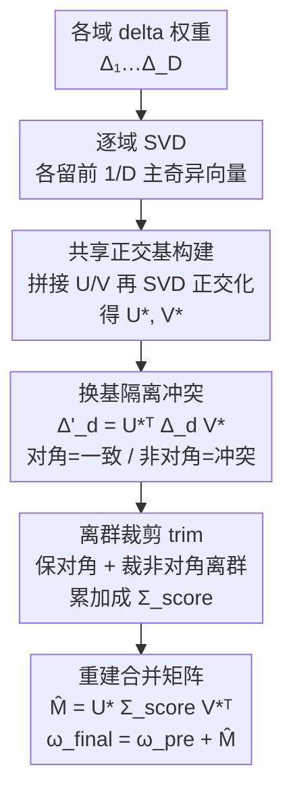

# Bridging Domains through Subspace-Aware Model Merging

**会议**: CVPR 2026  
**论文**: [CVF Open Access](https://openaccess.thecvf.com/content/CVPR2026/html/Chaves_Bridging_Domains_through_Subspace-Aware_Model_Merging_CVPR_2026_paper.html)  
**代码**: https://github.com/VirtualSpaceman/score_cvpr26 (有)  
**领域**: 模型压缩 / 模型合并  
**关键词**: 模型合并, 域泛化, 奇异值分解, 子空间冲突, CLIP  

## 一句话总结
本文发现"把不同域上微调的模型合并去泛化到未见域"会比常规多任务合并产生强得多的奇异子空间冲突，提出 SCORE：用所有模型主奇异向量拼接出的共享正交基做换基，把对角（一致方向）保留、非对角（冲突方向）裁掉离群项，从而在 8 个域泛化基准、3 个模型尺度上平均超过现有合并方法。

## 研究背景与动机
**领域现状**：模型合并（model merging）把多个从同一预训练 backbone 微调出来的模型，直接在参数空间相加成一个模型，不需共享数据、不需再训练，推理只走一次前向。主流做法围绕 task vector（微调权重减预训练权重的差 $\Delta w$）展开：TIES 裁掉小幅值、按符号一致性聚合；DARE 随机稀疏化；TSV 把 task matrix 做 SVD、在奇异子空间里测干扰并合并。

**现有痛点**：这些方法几乎都只在**同分布 / 多任务**场景里评测——被合并的任务本身就是评测任务，目标是"合完后每个任务都还能做"。而"用合并去做**域泛化**"（把若干域专家拼成一个、去泛化到没见过的域）几乎没人研究。

**核心矛盾**：本文用奇异值分解分析参数竞争后发现一个关键差异——多任务设定下各模型任务差异大（MNIST 数字分类 vs RESIC45 地物分类），奇异子空间彼此分散；但**域泛化设定下各模型共享同一标签空间、只是数据分布不同**，于是它们的 $\Delta w$ 倾向于沿相似的奇异方向排列，子空间高度重叠。重叠意味着合并时多个域的主奇异方向互相争夺，强奇异值的域会压制弱的，反而损害对未见域的泛化。作者用 Subspace Alignment Ratio（SAR）量化，证实域泛化下的子空间重叠显著高于多任务。

**本文目标**：在**不访问任何目标域数据、不做任何优化/梯度步**（仅有各源域微调 checkpoint）的前提下，缓解这种因子空间重叠带来的冲突，提升合并模型的域泛化。

**核心 idea**：先把所有域的主奇异方向拼起来正交化出一个"共享基"，再把每个域的 task matrix 换到这个基里——此时**对角元 = 该域与共享方向的一致程度，非对角元 = 跨方向的冲突**，于是冲突被显式分离；保留对角、只裁掉非对角里的统计离群项，就能去掉破坏性冲突又不丢有用的跨域共变信息。

## 方法详解

### 整体框架
SCORE（Subspace COnflict-Resolving mErging）逐层处理。输入是 $D$ 个域的 delta 权重 $\{\Delta_1,\dots,\Delta_D\}$（$\Delta_d=\omega_d-\omega_{\text{pre}}$），输出一个合并后的 task matrix $\hat M$，最终模型 $\omega_{\text{final}}=\omega_{\text{pre}}+\hat M$。整条流水线是纯权重/矩阵操作，不碰任何数据：对每个域做 SVD 并只留前 $\tfrac{1}{D}$ 的主奇异分量 → 把所有域的左/右奇异向量横向拼接 → 对拼接矩阵再做一次 SVD 得到**共享正交基** $U_*,V_*$ → 把每个域的 $\Delta_d$ 换基到 $U_*,V_*$ 下、得到一个能区分"一致/冲突"的矩阵 → 对每个换基矩阵做 trim（保对角、裁非对角离群）后累加成 $\Sigma_{\text{score}}$ → 用 $\hat M=U_*\Sigma_{\text{score}}V_*^\top$ 重建。

### 关键设计

**1. 共享正交基构建：把各域主方向拼起来，找一个最贴近所有域的公共坐标系**

痛点是各域的奇异子空间高度重叠又互不正交，直接在各自基里相加会让强奇异值的域压制别的域。SCORE 先对每个域 $\Delta_d=U_d\Sigma_d V_d^\top$ 做 SVD，只保留前 $\tfrac{1}{D}$ 个主奇异方向（$D$ 个域平摊总秩预算），再横向拼接成 $U_*\!\leftarrow[U_1|\cdots|U_D]$、$V_*\!\leftarrow[V_1|\cdots|V_D]$。但拼出来的列之间没有正交保证，会破坏 SVD 的重建性质，所以沿用 TSV 的做法对拼接矩阵再 SVD：$U_*=P_{U_*}\Sigma_{U_*}Q_{U_*}^\top$，取 $U_*\leftarrow P_{U_*}Q_{U_*}^\top$（丢掉奇异值、只留正交因子），$V_*$ 同理。这一步得到的 $U_*,V_*$ 是"离所有 $D$ 个域子空间都最近"的一组共享输入/输出正交基，是后面所有操作的公共坐标系。

**2. 换基隔离冲突：在共享基下，对角是一致、非对角是冲突**

有了共享基还不够——光把方向凑到一起并不知道哪些方向在打架。SCORE 把每个域的 $\Delta_d$ 换基到共享坐标系：

$$\Delta'_d = U_*^\top \Delta_d V_* = (U_*^\top U_d)\,\Sigma_d\,(V_d^\top V_*).$$

记 $R_U^{(d)}=U_*^\top U_d$、$R_V^{(d)}=V_d^\top V_*$，它们是共享基向量与域 $d$ 自身基向量的内积。换基把信息显式拆成两类：**对角元 $(\Delta'_d)_{ii}$** 度量域 $d$ 沿第 $i$ 个共享主方向的幅值（agreement，一致）；**非对角元 $(\Delta'_d)_{ij},\,i\neq j$** 度量域 $d$ 如何把第 $i$、$j$ 个共享方向耦合起来（conflict，跨方向 cross-talk），非对角越大说明共享坐标间的串扰越强。作者在 ViT-B/32 的注意力层上画出 $\Sigma_{\text{score}}=\sum_{d=1}^{6}U_*^\top\Delta_d V_*$ 的块结构，观察到三种情形：高一致/低冲突（能量集中在对角）、高一致/中冲突（对角占主但非对角明显）、低一致/中冲突（对角几乎消失、串扰主导，说明共享基没抓住该层的一致方向）。换基的价值就在于把"冲突"从隐式纠缠变成可定位、可量化的非对角项。

**3. 离群裁剪 trim：保留对角与有用的跨域共变，只裁掉破坏性的非对角离群**

直觉上只留对角（各域一致方向）最干净，但作者验证只留对角会丢掉非对角里承载的跨域共变信息（消融里 diagonal-only 比完整 SCORE 低约 2 p.p.）；而全保留非对角又会引入强干扰、几乎崩盘。于是 SCORE 取折中——保对角、对非对角做基于统计离群的裁剪：

$$\text{trim}(\Delta'_k)_{ij}=\begin{cases}(\Delta'_k)_{ii}, & i=j\ (\text{保对角})\\[2pt](\Delta'_k)_{ij}, & i\neq j,\ |(\Delta'_k)_{ij}-\mu_{\text{off}}|<\varsigma\cdot\sigma_{\text{off}}\\[2pt]0, & \text{否则（裁离群）}\end{cases}$$

其中 $\mu_{\text{off}},\sigma_{\text{off}}$ 是全部非对角元的均值与标准差，$\varsigma=1.96$ 对应标准正态 95% 置信区间——即把超出 95% 区间的非对角"异常串扰"清零、保留区间内的正常共变。各域 trim 后累加 $\Sigma_{\text{score}}=\sum_{d=1}^{D}\text{trim}(\Delta'_d)$，再 $\hat M=U_*\Sigma_{\text{score}}V_*^\top$ 重建。这一步是 SCORE 真正"解冲突"的落点：既不像 diagonal-only 那样过度保守丢信息，也不像 full matrix 那样被破坏性串扰拖垮。

### 损失函数 / 训练策略
SCORE 本身无任何训练/优化，缩放因子固定 $\varepsilon=1$（因为目标域数据不可访问，无法用验证集调 $\varepsilon$）。微调阶段：全量微调 CLIP 图像编码器，batch 128、学习率 1e-5 配 cosine annealing、AdamW（weight decay 0.1），文本编码器冻结当作分类头以保留开放词表特性。

## 实验关键数据

### 主实验
3 个 CLIP 变体（ViT-B/32、ViT-B/16、ViT-L/14）× 8 个域泛化分类基准（PACS、DomainNet、ImageNet-R、NICOpp、OfficeHome、TerraIncognita，加 2 个医学数据集 FedISIC、RetinaDomains，共 49 个域、4–365 类）。采用 leave-one-domain-out：留一个域当未见目标、其余域模型合并后在目标域评测，重复后取均值。自然图像报准确率、医学数据集因严重不均衡报 balanced accuracy。

| 模型 | 方法 | 平均准确率 | 相对次优 |
|------|------|-----------|----------|
| ViT-B/32 | TSV（次优） | 64.95 | — |
| ViT-B/32 | **SCORE** | **65.69** | **+0.74 p.p.** |
| ViT-L/14 | TIES（次优） | 72.46 | — |
| ViT-L/14 | **SCORE** | **73.04** | **+0.58 p.p.** |

单数据集上：ViT-B/32 在 DomainNet/NICOpp/OfficeHome 均第一（分别 +0.15/+0.40/+0.49 p.p.）；ViT-L/14 在 NICOpp +1.01、TerraIncognita +1.18 p.p.，PACS/DomainNet 并列第一。作为参照，Task Experts（各域专家上界）ViT-B/32 平均 78.63、Zero-shot 下界 55.63——合并方法整体处于两者之间。

合并 vs 集成（logit ensemble，输出空间集成）：

| 方法 | ViT-B/32 | ViT-B/16 | ViT-L/14 |
|------|----------|----------|----------|
| Model ensemble | 64.57 | 68.07 | 71.81 |
| **SCORE** | **65.69 (+1.12)** | **69.97 (+1.90)** | **73.04 (+1.24)** |

SCORE 不仅准确率超过集成 1.12–1.90 p.p.，且只保持单模型推理成本（集成要加载全部模型、每个都走一次前向）。

### 消融实验
对 $\Sigma_{\text{score}}$ 选哪部分元素做消融（以 Diagonal-only 为 baseline）：

| 配置 | ViT-B/32 | ViT-B/16 | ViT-L/14 | 说明 |
|------|----------|----------|----------|------|
| Diagonal | 63.62 | 67.38 | 71.50 | 只留对角（一致方向） |
| Off-diagonal | 58.41 (-5.21) | 62.41 (-4.97) | 67.46 (-4.04) | 只留非对角（域间冲突）→ 掉点 |
| Full matrix | 7.59 (-56.03) | 7.66 (-59.72) | 7.70 (-63.80) | 对角+非对角全保留 → 几乎崩盘 |
| **Trimmed (SCORE)** | **65.69 (+2.07)** | **69.97 (+2.59)** | **73.04 (+1.53)** | 保对角+裁非对角离群 |

### 关键发现
- **trim 是核心增益来源**：只留对角已是不错 baseline，但 trim 后非对角共变带来稳定 +1.5~2.6 p.p.；而完整保留非对角会因破坏性串扰直接崩到 7~8%（-56 到 -64 p.p.），说明冲突方向确实是"破坏性"的，必须裁掉离群。
- **只留非对角反而掉 4~5 p.p.**：非对角虽含有用的跨域共变信息，但单靠它丢掉对角一致方向不够，印证"对角主、非对角辅"的设计。
- **模型合并能超过 zero-shot 与集成**：除 Task Arithmetic（对 $\varepsilon$ 超参敏感、是唯一例外）外，主流合并方法都超过 zero-shot 下界；医学数据集上所有合并法相对 zero-shot 至少 +6 p.p.（FedISIC）、+8 p.p.（RetinaDomains），说明合并作为"组合机制"在分布偏移、数据受限场景里实用。

## 亮点与洞察
- **"域泛化合并比多任务合并更冲突"是反直觉但被量化坐实的观察**：同标签空间、只是分布不同 → 奇异方向更对齐 → 子空间重叠更大 → 冲突更强；这把"为什么现成合并法在 DG 上不灵"讲清了，是全文的 motivation 支点。
- **换基让冲突"可见"**：把 $\Delta_d$ 投到共享基后，对角/非对角天然对应一致/冲突，这个表示把原本隐式的方向竞争变成可裁剪的矩阵元素——比"在原始基里凭幅值/符号裁剪"（TIES/MagMax）更有结构。
- **$\varsigma=1.96$ 用统计置信区间界定"离群串扰"**：把"哪些非对角该裁"从拍脑袋阈值变成 95% CI 的统计判据，简单且无需调参，可迁移到其他需要区分"正常耦合 vs 异常耦合"的矩阵裁剪场景。
- **完全 data-free / optimization-free**：只要各域 checkpoint 共享同一预训练 backbone，无需任何目标域数据或梯度步，贴近"从模型仓库捞 checkpoint 拼起来用"的真实场景。

## 局限与展望
- **作者承认**：仅适用于共享同一架构、同一预训练 backbone 的逐参数合并；只假设拿到微调模型、拿不到源数据。
- **增益偏小且非全面碾压**：平均仅领先次优 0.58~0.74 p.p.，单数据集上常是"并列第一"或"接近最好"，medical 数据集（FedISIC/RetinaDomains）上多次是第二而非第一——SCORE 是"平均更稳"而非"处处最优"。⚠️ 不同列任务难度差异大，单列百分点不宜直接横比。
- **$\varepsilon=1$ 固定是被迫选择**：因目标域数据不可访问而无法调 $\varepsilon$，但这也意味着没探索 $\varepsilon$ 的潜在收益空间；前 $\tfrac{1}{D}$ 截断秩、$\varsigma=1.96$ 等也属固定超参，未给敏感性分析。
- **改进思路**：作者提出可结合"同源多域数据但用不同 DG loss 微调"的多模型合并；也可把合并当探索泛化/组合性的工具，验证组合性实验结论是否在合并权重上成立。

## 相关工作与启发
- **vs TSV**: 都用 SVD + 拼接奇异向量 + 正交化（SCORE 的正交化直接沿用 TSV 的 $PQ^\top$ 构造），但 TSV 面向多任务、目标是减干扰；SCORE 多了"换基隔离冲突 + 非对角离群裁剪"这一层，专门针对域泛化下更强的子空间重叠，区别在于它显式建模并裁剪非对角冲突而非仅正交化。
- **vs TIES / MagMax / PCB**: 它们在**原始参数/幅值/符号**空间裁剪（裁小幅值、按符号一致聚合、调参数尺度），SCORE 在**共享奇异基**里裁剪非对角离群——优势是冲突在换基后变得结构化可定位，劣势是要逐层多次 SVD、计算更重。
- **vs Wortsman et al. (Model Soups)**: 后者只做权重平均、只在 ImageNet 分布偏移上验证；SCORE 把评测扩到 8 个 DG 基准 + leave-one-domain-out 协议，且用结构化解冲突替代朴素平均。
- **vs 依赖目标数据的方法（test-time training / 验证集调超参）**: SCORE 不访问任何目标域数据、不做优化，保住了合并"零额外成本"的核心卖点。

## 评分
- 新颖性: ⭐⭐⭐⭐ 首次系统研究"合并做域泛化"，并量化出 DG 比多任务冲突更强、给出换基+裁剪的针对性解法。
- 实验充分度: ⭐⭐⭐⭐ 3 尺度 × 8 基准 × 49 域 + 合并 vs 集成 + trim 消融，覆盖广；但缺超参敏感性与逐域更细的分析。
- 写作质量: ⭐⭐⭐⭐ motivation→机制→消融逻辑顺，SAR/换基/trim 的公式给得清楚。
- 价值: ⭐⭐⭐⭐ data-free、单模型推理成本、贴近模型仓库复用场景，实用；但平均增益偏小、非处处最优。

<!-- RELATED:START -->

## 相关论文

- [\[CVPR 2026\] Preference-Aligned LoRA Merging: Preserving Subspace Coverage and Addressing Directional Anisotropy](preference-aligned_lora_merging_preserving_subspace_coverage_and_addressing_dire.md)
- [\[CVPR 2026\] Model Merging on Loss Landscape: A Geometry Perspective](model_merging_on_loss_landscape_a_geometry_perspective.md)
- [\[ICML 2026\] Saliency-Aware Model Merging](../../ICML2026/model_compression/saliency-aware_model_merging.md)
- [\[ICLR 2026\] RAIN-Merging: A Gradient-Free Method to Enhance Instruction Following Through Model Merging](../../ICLR2026/model_compression/rain-merging_a_gradient-free_method_to_enhance_instruction_following_through_mod.md)
- [\[CVPR 2026\] Continual Distillation of Teachers from Different Domains](continual_distillation_of_teachers_from_different_domains.md)

<!-- RELATED:END -->
