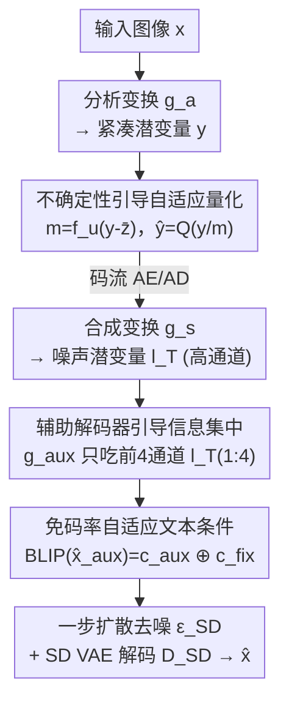

# CADC: Content Adaptive Diffusion-Based Generative Image Compression

**会议**: CVPR 2026  
**论文**: [CVF Open Access](https://openaccess.thecvf.com/content/CVPR2026/html/Sheng_CADC_Content_Adaptive_Diffusion-Based_Generative_Image_Compression_CVPR_2026_paper.html)  
**代码**: 未公开（论文未提供）  
**领域**: 模型压缩 / 扩散模型 / 生成式图像压缩  
**关键词**: 生成式图像压缩, 扩散编解码器, 自适应量化, 超低码率, 文本条件  

## 一句话总结
CADC 把扩散式图像压缩的"编码端表示"和"解码端生成先验"全程做成内容自适应：用不确定性图驱动空间变化的量化、用轻量辅助解码器把语义信息逼进扩散解码器真正用到的前 4 个通道、再从辅助重建图免码率地反推出内容相关的文本条件，在超低码率（约 0.005–0.01 bpp）下取得 SOTA 的感知质量。

## 研究背景与动机
**领域现状**：超低码率下，传统编解码器（JPEG/BPG）和以像素保真为目标的学习式编解码器（learned image compression）都会糊成一片、丢失纹理细节，因为它们优化的是 PSNR 这类信号保真度而非感知质量。生成式压缩转而借助强生成模型来"脑补"出逼真重建，其中扩散式编解码器（DiffEIC、ResULIC、StableCodec 等）凭借扩散模型的强生成能力，在极低码率下表现最突出——典型做法是把图像编码成一个噪声潜变量 $l_T$，再用预训练 Stable Diffusion 的 VAE 解码器去噪还原。

**现有痛点**：作者指出当前扩散式编解码器有三个阻碍"内容自适应"的硬伤。其一，**各向同性量化**——对整个紧凑潜变量用一个全局统一的量化步长，无视图像的空间异质性；扩散模型本身是"噪声水平依赖"的：高噪声处它倾向用生成先验幻化纹理、低噪声处它更像保守去噪器保结构，统一步长逼它在全图用一个折中噪声水平，结果纹理区生成介入不足（糊）、平滑区被过度正则（多余伪影）。其二，**信息集中瓶颈**——学习式编解码器产出的噪声潜变量通道数很高（如 320），但预训练 SD VAE 解码器固定只吃 4 通道，去噪也只作用在前 4 个通道 $l_T^{(1:4)}$ 上；没有显式监督时，模型不一定会把最关键的语义信息塞进这前 4 个通道，导致潜表示非自适应。其三，**文本条件低效**——要么传输文本描述（在 450 字节级的码率预算里挤占宝贵比特），要么用一句固定的通用 prompt（"A high-resolution, 8K…"，但它与具体内容无关）。

**核心矛盾**：扩散先验要发挥威力，前提是"编码端送什么"和"解码端怎么生成"能随图像的语义/结构动态对齐；而上述三处全是内容无关（content-agnostic）的固定策略，恰恰破坏了这种对齐。

**本文目标**：把量化、信息分配、文本条件这三个环节统统改造成内容自适应，且文本条件不能额外花码率。

**核心 idea**：用一张**学出来的空间不确定性图**调制量化（让纹理区得到更强生成介入）、用**辅助解码器**强制把语义压进前 4 通道、再拿**辅助重建图**当代理去 caption 出内容相关文本——三招都"免费"地恢复了内容自适应。

## 方法详解

### 整体框架
CADC 沿用学习式压缩常见的自编码器结构。编码端：分析变换 $g_a$ 把输入图像 $x$ 编成紧凑潜变量 $y$；同时一个轻量网络 $f_u$ 从残差里估计不确定性图 $m$，用它调制 $y$ 后再量化得 $\hat{y}$，经算术编码（AE）写成码流传输。解码端：合成变换 $g_s$ 把 $\hat{y}$ 上采样成噪声潜变量 $l_T$（通道数高，如 320），整体送进 U-Net $\epsilon_{SD}$ 去估计 4 通道噪声，只对前 4 通道 $l_T^{(1:4)}$ 做一步扩散去噪得到干净潜变量 $l_0$，交给冻结的 SD VAE 解码器 $\mathcal{D}_{SD}$ 还原成 $\hat{x}$。在这条主链上挂了两个"自适应外挂"：轻量辅助解码器 $g_{aux}$ 只吃前 4 通道、重建出辅助图 $\hat{x}_{aux}$（既给监督、又当文本代理）；$\hat{x}_{aux}$ 经冻结 BLIP 模型 $f_c$ caption 出内容文本 $c_{aux}$，再拼上固定描述 $c_{fix}$ 作为扩散去噪的条件。

### 关键设计

**1. 不确定性引导自适应量化（UGAQ）：让量化噪声随内容空间变化**

各向同性量化的根本问题是"全图一个噪声水平"，与扩散模型按区域调度生成强度的能力不匹配。UGAQ 的做法是：先把超先验潜变量 $\hat{z}$ 双线性上采样到主潜变量分辨率 $\bar{z} = \mathrm{UP}(\hat{z})$，再取残差 $r = y - \bar{z}$——这个残差衡量"$\bar{z}$ 对 $y$ 解释力多差"，残差大说明纹理复杂、不确定性高，天然是内容自适应的信号。一个轻量网络 $f_u$ 把残差映射成不确定性图 $m = f_u(r)$（每个元素 $m_{i,j} \ge 1$），然后用它逐元素调制再量化：

$$\bar{y} = y / m, \quad \hat{y} = Q(\bar{y}) = \lfloor \bar{y}/\Delta \rceil \cdot \Delta$$

量化误差可近似为均匀噪声 $\epsilon_{i,j} \sim U(-\Delta/2, \Delta/2)$，于是 $\hat{y} \approx y/m + \epsilon$。关键在于：解码端**不做逆缩放**，直接把 $\hat{y}$ 喂给扩散模型。虽然量化噪声方差固定为 $\sigma_\epsilon^2 = \Delta^2/12$，但量化前的 $1/m$ 调制让解码端输入处的局部信噪比随空间变化：

$$\mathrm{SNR}_{i,j} \propto \frac{E[\bar{y}_{i,j}^2]}{\sigma_\epsilon^2} = \frac{E[y_{i,j}^2]}{m_{i,j}^2 \cdot \sigma_\epsilon^2}$$

由此得到核心机制：高不确定性区（$m$ 大）信号功率被 $m^2$ 压低、局部 SNR 低，扩散模型更依赖生成先验去合成纹理；低不确定性区（$m$ 小）SNR 保持高，扩散模型偏向忠实保留传输来的结构信息。这就把"量化失真"主动塑形成与扩散模型去噪策略对齐的"内容感知噪声"。⚠️ 值得注意的是，作者强调这与已有的空间缩放量化方法相反——纹理复杂区被赋予**更大**的 $m$（更强生成介入），而非更小。

**2. 辅助解码器引导信息集中（ADGIC）：把语义逼进前 4 个通道**

信息集中瓶颈来自架构错配：噪声潜变量 $l_T$ 通道数远超 4，但 SD VAE 解码器只用前 4 通道 $l_T^{(1:4)}$，没有显式监督时模型不保证会把关键语义集中到这 4 个通道。ADGIC 的解法很直接：引入一个轻量辅助解码器 $g_{aux}$，**只**作用在前 4 通道上重建辅助图像

$$\hat{x}_{aux} = g_{aux}(l_T^{(1:4)}), \quad \mathcal{L}_{aux} = \| x - \hat{x}_{aux} \|_2^2$$

并把这个辅助重建损失并入总损失。因为 $g_{aux}$ 只能看到前 4 通道，要想 $\hat{x}_{aux}$ 像原图，模型就被迫把语义最关键的信息往前 4 通道里塞——等于给"信息往哪放"加了一个内容驱动的约束。消融里的能量分析（用通道方差度量能量）显示，加了 ADGIC 后前 4 通道的能量集中度明显提高，印证它确实在强制内容感知的信息分配。

**3. 免码率自适应文本条件（BFATC）：用辅助重建图反推内容文本**

文本条件要么花码率、要么用与内容无关的通用 prompt。BFATC 的巧思是：复用设计 2 已经"白送"出来的辅助重建图 $\hat{x}_{aux}$ 当代理——因为它完全从已传输的 $l_T^{(1:4)}$ 推出来，解码端可自行复现，无需额外传任何文本比特。把 $\hat{x}_{aux}$ 送进冻结的 BLIP 图像描述模型 $f_c$ 得到内容文本 $c_{aux} = f_c(\hat{x}_{aux})$，再与固定通用描述 $c_{fix}$（"A high-resolution, 8K, ultra-realistic image…"）简单字符串拼接 $c = c_{aux} + c_{fix}$，作为一步扩散去噪的条件。拼固定描述是为了鲁棒性与稳定性。实验显示，即便在极低码率、辅助重建噪声很大时，caption 出的文本在语义上仍与图像内容一致（如"a boat in the water"），因此能稳定提供内容相关的语义引导而零码率开销。

### 损失函数 / 训练策略
总目标是率失真损失 $\mathcal{L} = \lambda R + D$，$\lambda$ 为拉格朗日乘子、$R$ 为码率。失真项 $D$ 在本文新增的辅助重建损失 $\mathcal{L}_{aux}$ 之外，沿用了 StableCodec [66] 的多项组合：MSE、LPIPS（VGG 特征）、CLIP 距离与 GAN 损失。实现上用 Stable Diffusion 2.1 的蒸馏版做一步扩散以平衡生成能力与解码复杂度；caption 用 blip-image-captioning-base；熵模型同时用超先验 $c_h$ 和由 4 步四叉树自回归生成的空间先验 $c_s$。训练集为 DF2K 与 CLIC 2020 Professional。

## 实验关键数据

### 主实验
评测集为 Kodak（24 张 768×512）、DIV2K Val（100 张 2K）、CLIC 2020 Test（428 张 2K），均按原分辨率评测。感知指标用 DISTS、LPIPS、FID、KID（Kodak 因样本太少略去 FID/KID），码率用 bpp。对比对象覆盖 GAN 式（HiFiC）、VQ 式（DLF、GLC）与多种扩散式（DiffEIC、ResULIC、MKIC、OSCAR、StableCodec）。论文主结果以 RD 曲线（Fig. 3）呈现：在三个数据集、LPIPS/DISTS/FID/KID 全部指标上，CADC 在超低码率区间**一致优于**所有扩散式对手。下表为 Fig. 4 Kodak 定性对比中给出的同码率代表性数值（bpp / DISTS↓ / MS-SSIM↑）：

| 方法 | bpp | DISTS ↓ | MS-SSIM ↑ |
|------|-----|---------|-----------|
| **Ours** | 0.008 | **0.150** | 0.583 |
| StableCodec | 0.008 | 0.157 | 0.694 |
| DLF | 0.008 | 0.162 | 0.669 |
| **Ours** | 0.008 | **0.109** | 0.809 |
| MKIC | 0.009 | 0.283 | 0.714 |
| OSCAR | 0.010 | 0.175 | 0.612 |

> ⚠️ 上述数值取自论文 Fig. 4 图注中的散点标注（不同行对应不同测试图像），仅为示意；完整定量比较以 Fig. 3 的 RD 曲线为准。可以看到 CADC 在 DISTS 上普遍最低，但 MS-SSIM 不总是最高——这与"超低码率追求感知质量而非像素保真"的取向一致。

### 消融实验
在 Kodak 上以 BD-rate（负值越大越好，越省码率）逐项叠加三个模块：

| 模型 | UGAQ | ADGIC | BFATC | LPIPS BD-rate | DISTS BD-rate |
|------|:----:|:-----:|:-----:|:-------------:|:-------------:|
| M0（基线）| ✗ | ✗ | ✗ | 0.0% | 0.0% |
| M1 | ✓ | ✗ | ✗ | −3.7% | −2.7% |
| M2 | ✓ | ✓ | ✗ | −5.3% | −3.5% |
| M3（完整）| ✓ | ✓ | ✓ | −6.8% | −5.5% |

### 关键发现
- **三个模块逐项都正贡献，且可叠加**：UGAQ 单独带来 LPIPS −3.7% / DISTS −2.7%，是三者中单点收益最大的（量化对齐是主要瓶颈）；ADGIC 再追加约 LPIPS −1.6% / DISTS −0.8%；BFATC 再追加约 LPIPS −1.5% / DISTS −2.0%（其中 DISTS 增益甚至超过 ADGIC，说明内容相关文本对感知质量很有用）。
- **UGAQ 的不确定性图语义可解释**：可视化显示残差 $y-\bar{z}$ 在高纹理区值大，$m$ 也相应大，最终量化残差 $y-\hat{y}$ 与内容复杂度强相关——证明它确实在"按内容塑形量化误差"。
- **ADGIC 真的改变了能量分布**：加它之后前 4 通道方差（能量）集中度提升，说明监督有效地把语义"逼"进了关键通道。
- **BFATC 在低码率下仍鲁棒**：即使辅助重建很糊，BLIP 仍能给出语义一致的描述，保证零码率文本条件不"失真带偏"。

## 亮点与洞察
- **"量化前调制 + 解码端不逆缩放"是点睛之笔**：通过 $y/m$ 在固定方差的量化噪声上人为制造局部 SNR 差异，把"量化"这个一向被当作纯失真源的环节，变成了主动控制扩散生成强度的旋钮——这是把信号处理直觉和扩散先验机制接起来的漂亮一招。
- **辅助解码器一举两得**：$g_{aux}$ 既给前 4 通道提供了信息集中的监督（ADGIC），其副产物 $\hat{x}_{aux}$ 又被回收当文本条件的代理（BFATC），一个轻量模块同时解决两个限制，复用得很经济。
- **"免码率文本"思路可迁移**：凡是"想要内容相关 side information 又不想花码率"的场景，都可以借鉴"用解码端可自行复现的代理重建去推断 side info"这一范式（这里是 caption，也可推广到其他语义标签）。

## 局限与展望
- 三个模块都依赖预训练 SD VAE 的 4 通道架构假设，方法与"前 4 通道才被解码"这一具体实现强耦合，换扩散骨干可能要重新设计 ADGIC。
- BFATC 的文本质量受 BLIP 在严重退化图上的 caption 能力限制；论文展示的是语义大致一致，但⚠️ 未量化"caption 出错时对重建的负面影响"，鲁棒性边界不清。
- 主结果主要以 RD 曲线呈现、PSNR/MS-SSIM 放在补充材料，像素保真度相对感知质量的取舍代价没有在正文充分展开；MS-SSIM 在部分对比中并不领先。
- 仍是一步扩散 + 自回归熵模型，超低码率下的解码复杂度（尤其 4 步四叉树自回归熵解码）对实时应用仍是问题，作者未给出延迟数据。

## 相关工作与启发
- **vs StableCodec [66]**：本文的直接基线/对手，沿用了它的多项失真损失和"整体 $l_T$ 入 U-Net、只去噪前 4 通道"的架构，但 StableCodec 用各向同性量化 + 固定通用 prompt；CADC 把量化（UGAQ）、信息分配（ADGIC）、文本（BFATC）三处全改成内容自适应，在 Kodak 上相对它取得 BD-rate 提升。
- **vs Relic et al. [51]**：他们用 universal quantization 通过 SNR-matching 把量化误差对齐高斯扩散噪声，但仍是全局各向同性的量化参数；CADC 的 UGAQ 进一步让 SNR 随空间内容变化。
- **vs PerCo [10] / ResULIC [28] / MKIC [18]**：这类方法用多模态大模型生成文本并无损压缩传输，提供内容感知引导但要花文本码率；CADC 的 BFATC 用辅助重建图当代理免码率反推文本，目标相同但不占比特预算。
- **vs DiffEIC [38] / RDEIC [39]**：它们证明仅靠 VAE 压缩潜变量、不传文本也能有竞争力；CADC 则证明"零码率但内容相关"的文本仍能进一步提升感知质量。

## 评分
- 新颖性: ⭐⭐⭐⭐ 三个改进都针对扩散式压缩的具体机制错配，"量化调制 SNR""辅助解码器双用途"思路巧妙，但都属在既有框架上的精准改造。
- 实验充分度: ⭐⭐⭐⭐ 三数据集多指标 + 清晰的逐项消融 + 机制可视化（不确定性图/能量分布/caption 鲁棒性），但缺复杂度/延迟数据，PSNR 等放补充材料。
- 写作质量: ⭐⭐⭐⭐ "限制→对应方法"一一映射、动机和机制讲得很透，公式推导（局部 SNR）清晰。
- 价值: ⭐⭐⭐⭐ 超低码率生成式压缩取得 SOTA 感知质量，"免码率内容文本"等思路对该方向有实用借鉴价值。

<!-- RELATED:START -->

## 相关论文

- [\[CVPR 2026\] ProGIC: Progressive and Lightweight Generative Image Compression with Residual Vector Quantization](progic_progressive_and_lightweight_generative_image_compression_with_residual_ve.md)
- [\[CVPR 2026\] On the Robustness of Diffusion-Based Image Compression to Bit-Flip Errors](on_the_robustness_of_diffusion-based_image_compression_to_bit-flip_errors.md)
- [\[CVPR 2026\] Differentiable Vector Quantization for Rate-Distortion Optimization of Generative Image Compression](differentiable_vector_quantization_for_rate-distortion_optimization_of_generativ.md)
- [\[CVPR 2026\] Content-Adaptive Hierarchical Hyperprior for Neural Video Coding](content-adaptive_hierarchical_hyperprior_for_neural_video_coding.md)
- [\[CVPR 2026\] RDVQ: Differentiable Vector Quantization for Rate-Distortion Optimization of Generative Image Compression](rdvq_differentiable_vq_image_compression.md)

<!-- RELATED:END -->
