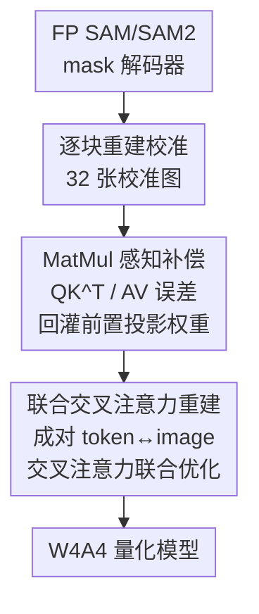

# CAR-SAM: Cross-Attention Reconstruction for Post-Training Quantization of the Segment Anything Model

**会议**: CVPR 2026  
**论文**: [CVF Open Access](https://openaccess.thecvf.com/content/CVPR2026/html/Wen_CAR-SAM_Cross-Attention_Reconstruction_for_Post-Training_Quantization_of_the_Segment_Anything_CVPR_2026_paper.html)  
**代码**: 待确认  
**领域**: 模型压缩  
**关键词**: 训练后量化, Segment Anything, 交叉注意力, 跨层误差补偿, 4-bit 量化  

## 一句话总结
针对 SAM 解码器里"交叉注意力被低比特量化打散"和"双向耦合导致重建振荡"两个独有难题，CAR-SAM 用 MatMul 感知补偿（把 MatMul 输入的激活量化误差回灌到前置线性层权重）和联合交叉注意力重建（把成对耦合的两个交叉注意力块绑在一起优化），把 SAM/SAM2 稳稳压到 W4A4，在 SAM-B/SAM-L 上分别比此前最优高出 14.6% 和 6.6% mAP。

## 研究背景与动机
**领域现状**：SAM / SAM2 是通用图像分割的里程碑，但 Large / Huge 变体超过 10 亿参数、1 T FLOPs，难以部署到边缘设备。训练后量化（PTQ）是最轻量的压缩手段——只需一个小的无标注校准集、不用重训，就能把模型压到低比特。ViT 上已有 PTQ4ViT、BRECQ、QDrop、APHQ-ViT 等成熟方案。

**现有痛点**：这些方法几乎都是为"编码器（encoder-only）"架构设计的，逐层/逐块做重建。而 PTQ4SAM、MIX-QSAM、PQ-SAM 等针对 SAM 的尝试，仍然没碰 SAM 真正的命门——**解码器里的双向交叉注意力结构**。结果就是 SAM 在 W4A4 下 mAP 暴跌（SAM-B 上 PTQ4SAM 只剩 24.7、QDrop 26.4，RTN/BRECQ 直接崩盘）。

**核心矛盾**：作者把退化的根因拆成两个 SAM 独有的难题。其一是**注意力耗散（attention dissipation）**：交叉注意力的分数由"提示 token 当 query、图像 embedding 当 key"做 MatMul 算出，但两种模态的统计分布天差地别——图像 embedding 窄窄地分布在 $[-14, 15]$，提示 token 却铺到 $[-40, 65]$。量化这个 MatMul 的输入会放大 scale 失配、把注意力分布拍扁，注意力图从聚焦的语义热点塌成弥散的一团，分割 mask 随之崩坏。而现有 PTQ 只补偿线性投影层，**没人去补偿 MatMul 本身**——可恰恰是 MatMul 这一步在做跨模态统计交互。其二是**重建振荡（reconstruction oscillation）**：解码器的两路交叉注意力不是严格串行而是部分并行，图像和提示通过双向交叉注意力持续交换信息，一路引入的误差会瞬间传到另一路，形成跨模态反馈回环，使重建 loss 沿解码深度剧烈震荡（图 2 显示交叉注意力层波动最大），模型收敛不到全局最优、只在局部点附近来回晃。

**本文目标**：做一个同时兼容 SAM 与 SAM2、专门针对它们解码器交叉注意力的统一 PTQ 框架，分别根治"耗散"和"振荡"。

**切入角度**：既然耗散来自 MatMul 没被补偿、振荡来自把耦合的两块当独立块去优化，那就**把补偿延伸到 MatMul**、把**耦合的交叉注意力块联合起来重建**。

**核心 idea**：用"MatMul 感知补偿（MAC）+ 联合交叉注意力重建（JCAR）"代替"只补线性层 + 逐块独立重建"，来稳住 SAM 解码器的低比特量化。

## 方法详解

### 整体框架
CAR-SAM 不改 SAM 的网络结构，只在 PTQ 校准阶段（32 张校准图、per-channel 权重 + per-tensor 激活非对称量化、首层 PatchEmbed 和末层 Mask Head 保 FP）插入两个针对解码器的模块。输入是一个全精度的 SAM/SAM2 mask 解码器，输出是 W4A4 量化版本。整条流水线先逐块做重建优化，遇到注意力块时：用 **MAC** 把 MatMul 输入（Q、K、V 的激活量化误差）反向回灌成前置投影层权重的补偿项，治住注意力耗散；再用 **JCAR** 把解码器里成对耦合的两个交叉注意力块（token→image 与 image→token）绑成一个复合模块联合优化它们的量化参数，治住重建振荡。

### 关键设计

**1. MatMul-Aware Compensation（MAC）：把 MatMul 输入的激活误差搬回前置线性层权重**

痛点直指注意力耗散：注意力里有两类线性运算——投影层（Q/K/V）和算注意力分数的 MatMul（$QK^\top$、$AV$）。以往方法（GPTAQ、ERQ、QDrop）顶多在优化投影层权重时顺手补偿激活误差，**MatMul 这一步始终没被建模**，而跨模态统计交互恰恰发生在这里，于是低比特下注意力被拍扁。MAC 的做法是给两个 MatMul 显式写出重建目标。以 $QK^\top$ 为例，目标是最小化全精度与量化 MatMul 输出之差 $L_{mse}=\mathbb{E}\big[\lVert QK^\top-\hat{Q}\hat{K}^\top\rVert_2^2\big]$。关键一步是把扰动显式参数化：令 $\hat{Q}=X_Q(W_Q+\delta W_Q)$、$\hat{K}=K+\delta K$，即把 $K$ 这一支的量化误差 $\delta K$ 当作"已发生的扰动"，转而求一个加到 query 投影权重上的补偿项 $\delta W_Q$ 去抵消它，再加 L2 正则防止补偿项盖过原权重：

$$L_{mse}=\big\lVert QK^\top-X_Q(W_Q+\delta W_Q)(K+\delta K)^\top\big\rVert_2^2+\lambda\lVert\delta W_Q\rVert_2^2$$

对 $W_Q$ 求导置零后，整理成一个 Sylvester 型矩阵方程 $AX+XB=C$（其中 $A=(X_Q^\top X_Q)^{-1}\lambda I$、$B=\hat{K}^\top\hat{K}$、$C=W_Q\delta K^\top\hat{K}$、$X=\delta W_Q$），可用闭式解或 Bartels–Stewart 算法高效求解，解出后直接合并 $W_Q\leftarrow W_Q+\delta W_Q$。这里最妙的洞察是：**K 的量化误差不必在 key 支路本地补偿，可以"改道"回灌到上游的 $Q_{proj}$**，让 MatMul 输出保持对齐而无需动量化后的 K。对称地，$\delta Q$ 的误差也能回灌到 $W_K$（得到同型 Sylvester 方程），V 支路则给出闭式补偿 $\delta W_V=(X_V^\top\hat{A}^\top\hat{A}X_V+\lambda I)^{-1}X_V^\top\hat{A}^\top(A-\hat{A})V$，三条支路（Q/K/V）由此构成统一的跨层补偿。因为它第一次把误差补偿从"线性层"延伸到"MatMul 这个跨模态交互点"，注意力分布得以保持聚焦，耗散被压下去。

**2. Joint Cross-Attention Reconstruction（JCAR）：把双向耦合的两个交叉注意力块联合重建**

痛点直指重建振荡：解码器的交叉注意力是部分并行的——第一个 token→image 块更新提示 token $T'=f(I,T)$，紧接着的 image→token 块用更新后的 $T'$ 去精修图像 embedding $I'=g(I,T')$。CNN/ViT 的逐块重建假设是"误差只前向累积"，但这里两块之间有双向反馈，把它们当独立块各自优化就会震荡。作者做一阶线性化推导，证明输出扰动满足

$$\Delta I'\approx J_g^{(T')}\big(J_f^{(T)}\Delta T+J_f^{(I)}\Delta I\big)+J_g^{(I)}\Delta I$$

即误差由两部分组成：一个沿深度累积的层级项，和一个由跨支反馈引入的**交叉项**（括号里那部分），后者正是振荡和误差放大的来源。进一步对控制 $f$ 的 scale 参数 $s_f$ 求 image→token 重建 loss 的梯度，得到推论 $\nabla_{s_f}L\propto\big(J_g^{(T')}\big)^\top\big(J_g^{(T')}\delta_f+\delta_g\big)$——梯度同时依赖**两个模块**的 Jacobian 敏感度，说明孤立优化单个交叉注意力块根本压不住整体误差，**必须把 $s_f$ 和 $s_g$ 联合优化**。于是 JCAR 把成对的 token→image 和 image→token 块当成一个复合模块 $F_{f,g}$，统一最小化重建 loss：

$$\min_{s_{f,g},\,\alpha_{f,g}}\big\lVert F_{f,g}(\hat{T}_{f,g},\hat{I}_{f,g},\hat{w}_{f,g})-F_{f,g}(T_{f,g},I_{f,g},w_{f,g})\big\rVert_2^2$$

这等价于把重建粒度从"单注意力模块"放粗到"成对交叉注意力块"。图 4 的对照实验直接印证：随着重建粒度逐步覆盖两个交叉注意力（不同 S-C-C 组合到联合），mAP 从 0.322 / 0.34 一路升到 0.421，**联合重建两个交叉注意力块拿到最高 mAP**，验证了耦合优化的必要性。

### 损失函数 / 训练策略
全程 PTQ，无监督：随机采 32 张训练图当校准集；权重做 per-channel 非对称量化、激活做 per-tensor 非对称量化；PatchEmbed 与 Mask Head 保持全精度。MAC 的补偿项通过解 Sylvester 方程/闭式解得到并合并进权重；JCAR 联合优化量化 scale $s$ 与 rounding offset $\alpha$；整个重建过程跑 140,000 步以保证量化参数收敛。

## 实验关键数据

评测覆盖 SAM（B/L/H）与 SAM2（T/S/B+/L），任务含实例分割、目标检测、视频目标分割（VOS）；为隔离分割质量、避免不同检测器干扰，用验证集 GT 框模拟"完美提示"。

### 主实验

SAM 实例分割（COCO，mAP）：

| 模型 | 方法 | W6A6 | W4A4 |
|------|------|------|------|
| SAM-B | QDrop | 50.7 | 26.4 |
| SAM-B | PTQ4SAM | 50.9 | 24.7 |
| SAM-B | **CAR-SAM** | **53.3** | **39.3** |
| SAM-L | QDrop | 58.4 | 38.0 |
| SAM-L | PTQ4SAM | 58.6 | 41.9 |
| SAM-L | **CAR-SAM** | 58.7 | **48.5** |

W4A4 下 SAM-B 比 PTQ4SAM 高 14.6 mAP、SAM-L 比 PTQ4SAM 高 6.6 mAP。SAM2 上同样领先或接近最优（如 SAM2-B+ 在 W4A4 达 46.5，超 PTQ4SAM 的 45.5）。目标检测（COCO，mAP）W4A4 下 SAM-B/L/H 分别达 60.6 / 65.2 / 66.3，全面超 BRECQ/QDrop/PTQ4SAM。VOS（DAVIS，J&F）多数尺寸最高或有竞争力。

### 消融实验

| 配置 | MAC | JCAR | W6A6 | W4A4 |
|------|-----|------|------|------|
| 1（baseline） | × | × | 50.7 | 28.0 |
| 2 | ✓ | × | 52.7 | 31.2 |
| 3 | × | ✓ | 53.0 | 35.4 |
| 4（Full） | ✓ | ✓ | **53.3** | **39.3** |

（SAM-B，COCO 实例分割 mAP）

### 关键发现
- **JCAR 在低比特下贡献更大**：单加 JCAR 把 W4A4 从 28.0 拉到 35.4（+7.4），单加 MAC 拉到 31.2（+3.2），两者叠加到 39.3——说明 4-bit 退化里"振荡"比"耗散"更致命，但两个模块互补、缺一不可。
- **重建粒度越粗越稳**：图 4 显示把两个交叉注意力联合重建（最粗粒度）给出最高 mAP 0.421，印证 Corollary 3.2 的"联合优化必要性"。
- **压缩收益**：W4A4 把存储砍掉约 60–67%（均值 ≈64%），算力降到 2.9×–5.0× 加速（中位 ≈4.1×），大模型因 transformer 块更重而获益更多。
- ⚠️ 表 4（VOS）里 SAM2-L 一列各方法 W4A4 都只剩 10 左右（CAR-SAM 10.38），数值异常偏低，疑似该设置下整体崩坏或表格口径问题，以原文为准。

## 亮点与洞察
- **把"误差改道"用成补偿手段**：MAC 最巧的地方是证明了 K 的量化误差不必在 key 支路本地修，而能通过 Sylvester 方程把补偿项灌回上游 $Q_{proj}$——这把"哪一层该补偿"从直觉变成了可解的矩阵方程，且首次覆盖了一直被忽略的 MatMul。
- **先证振荡、再设计联合优化**：JCAR 不是拍脑袋"把两块一起优化"，而是先做一阶 Jacobian 分析把交叉项显式写出来、证明孤立优化压不住误差，再顺理成章放粗重建粒度——理论驱动设计，很有说服力。
- **可迁移性**：MatMul 感知补偿这套思路不限于 SAM——任何带跨模态/异分布 MatMul 的注意力（如多模态 VLM 的 cross-attention）都可能复用"把 MatMul 输入激活误差回灌前置投影"的补偿范式。

## 局限与展望
- 用 GT 框模拟"完美提示"隔离了分割质量，但也回避了真实检测器带来的提示噪声，实际部署时端到端精度可能打折。
- 重建跑 140,000 步，校准开销不小（虽仍属 PTQ、远低于重训），论文未充分讨论校准时间成本。
- VOS 上大模型（SAM2-L）W4A4 仍接近崩坏（J&F≈10），说明该框架对"视频 + 大模型 + 4-bit"这种最极端组合仍未根治。
- 代码未公开，复现需自行实现 Sylvester 求解与联合重建逻辑。

## 相关工作与启发
- **vs PTQ4SAM**：PTQ4SAM 用 Bimodal Integration 建模双峰激活 + 对 softmax 输出做对数量化，但 SAM2 已不再呈现双峰分布、方法缺乏通用性；CAR-SAM 直击交叉注意力的跨模态 MatMul 与双向耦合，对 SAM/SAM2 统一适用。
- **vs PQ-SAM**：PQ-SAM 用 Grouped Activation Distribution Transformation 治编码器离群值，但本文实验表明退化主因在**解码器**而非编码器；CAR-SAM 把火力对准解码器。
- **vs QDrop / BRECQ**：它们是 encoder-only 的逐块重建，假设误差只前向传播；CAR-SAM 指出解码器双向反馈打破了这一假设，必须联合重建耦合的交叉注意力块。

## 评分
- 新颖性: ⭐⭐⭐⭐⭐ 首次把误差补偿延伸到 MatMul，并从理论上证明交叉注意力必须联合重建，两点都切中 SAM 量化的真问题
- 实验充分度: ⭐⭐⭐⭐ 覆盖 SAM/SAM2 全尺寸 + 三任务，消融清晰；但代码未放、VOS 大模型仍崩坏
- 写作质量: ⭐⭐⭐⭐ 难点拆解和推导脉络清楚，部分公式排版有瑕疵
- 价值: ⭐⭐⭐⭐⭐ 把 SAM 稳稳压到 4-bit 且大幅领先，对边缘部署很实用

<!-- RELATED:START -->

## 相关论文

- [\[ECCV 2024\] PQ-SAM: Post-training Quantization for Segment Anything Model](../../ECCV2024/model_compression/pq-sam_post-training_quantization_for_segment_anything_model.md)
- [\[CVPR 2026\] LS-ViT: Least-Squares Hessian Based Block Reconstruction for Low-Bit Post-Training Quantization of Vision Transformers](ls-vit_least-squares_hessian_based_block_reconstruction_for_low-bit_post-trainin.md)
- [\[CVPR 2026\] VLM-PTQ: Efficient Post-Training Quantization for Large Vision-Language Models](vlm-ptq_efficient_post-training_quantization_for_large_vision-language_models.md)
- [\[CVPR 2026\] Rethinking Asymmetric Quantization: Hidden Symmetry in Vision Model Weights](rethinking_asymmetric_quantization_hidden_symmetry_in_vision_model_weights.md)
- [\[CVPR 2026\] Gradient Knows Best: Mixed-Precision Quantization via Gradient-Guided Bit Allocation for Super-Resolution](gradient_knows_best_mixed-precision_quantization_via_gradient-guided_bit_allocat.md)

<!-- RELATED:END -->
