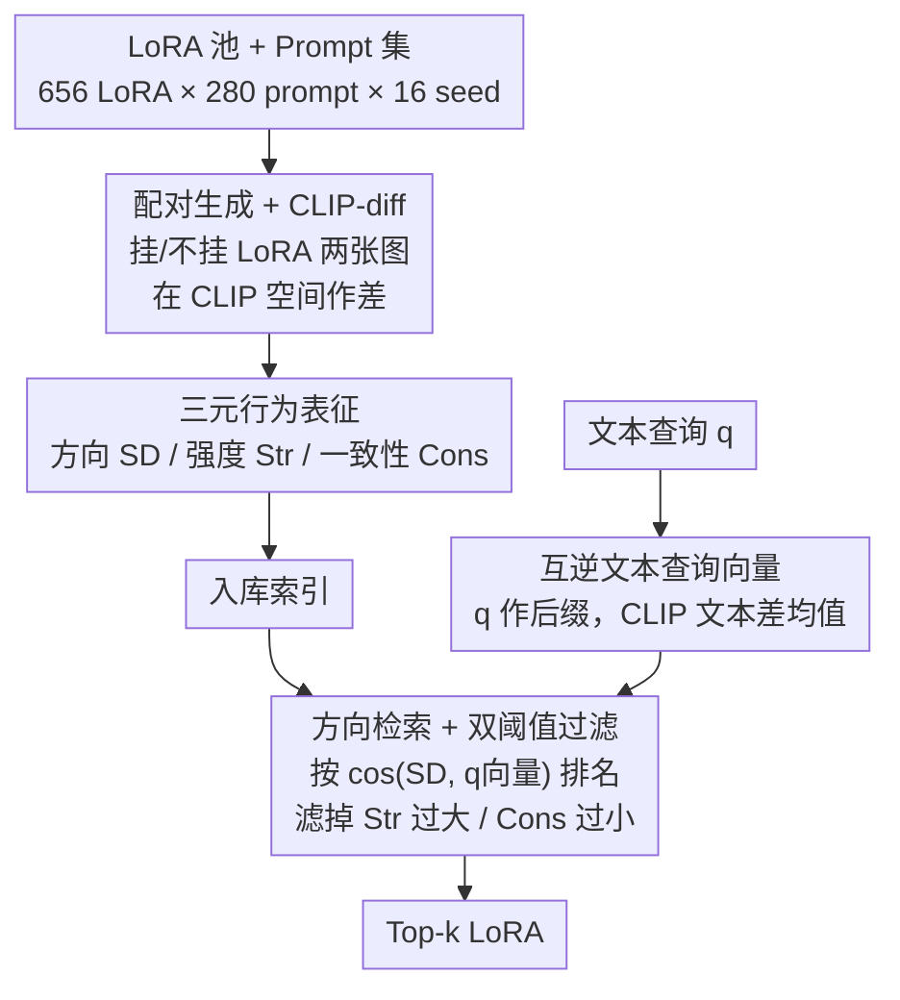

# CARLoS: Retrieval via Concise Assessment Representation of LoRAs at Scale

**会议**: CVPR 2026  
**论文**: [CVF Open Access](https://openaccess.thecvf.com/content/CVPR2026/html/Sarfaty_CARLoS_Retrieval_via_Concise_Assessment_Representation_of_LoRAs_at_Scale_CVPR_2026_paper.html)  
**代码**: 待确认（论文称数据集、prompts、生成图、CARLoS 表征、查询 benchmark 与代码将在录用后开源）  
**领域**: 模型压缩 / LoRA 检索  
**关键词**: LoRA 检索, 行为表征, CLIP-diff, 扩散模型, 版权归因

## 一句话总结
CARLoS 不靠 LoRA 作者填的名字/描述，而是把每个 LoRA 实际"用起来"——在大量 prompt × seed 上生成图、和无 LoRA 的原图做 CLIP 空间差，提炼成「方向 / 强度 / 一致性」三元表征，从而按生成效果而非文本元数据来检索 LoRA，在自动与人工评测中都超过四个强文本检索基线。

## 研究背景与动机
**领域现状**：以 ComfyUI 为代表的视觉生成已经是一整套组件流水线，其中除生成模型本身外最有影响力的就是 LoRA。开源社区已发布数十万个 LoRA，但它们是一个庞大却毫无组织的"动物园"——风格、氛围、特定内容（如猫耳）各式各样。

**现有痛点**：要找到"对的那个 LoRA"基本靠试错。作者往往不公开训练数据、几乎不写效果描述、更没有任何量化指标说明效果的强弱与稳定性。现有视觉域的 LoRA 选择/路由工作（Stylus、LoRAverse、AutoLoRA、DiffAgent 等）大多依赖 LoRA 的名字、描述、社区图等**元数据**，而这些元数据稀疏、主观、多语言混杂，是对 LoRA 真实行为的不可靠预测；语言域的检索方法（LoRARetriever、PHATGOOSE、Arrow、LoGo 等）又不直接适用于视觉生成。

**核心矛盾**：LoRA 的"身份"应当由它**对生成的影响**定义，但所有现成的描述符（文本元数据、流行度、社区图）都和这个影响脱节——文本说"上色书"未必真能上色，社区图又和别的组件纠缠在一起。

**本文目标**：给 LoRA 一个**无需任何额外元数据**、只用 adapter 自身就能算出来的、标准化的行为表征，并以此支撑高质量检索（顺带支撑版权归因等分析）。

**切入角度**：既然描述不可信，那就直接观察 LoRA 的行为——把它挂上去在多样 prompt 和 seed 上生成图，和不挂 LoRA 的原图对比，差异就是这个 LoRA 的"指纹"。用多样 prompt/seed 是为了去掉社区单张示例图里的偏置与组件纠缠。

**核心 idea**：用"生成效果的 CLIP 空间差"代替"作者写的文字"来刻画与检索 LoRA——把每个 LoRA 压缩成 Direction（语义往哪偏）+ Strength（偏多远）+ Consistency（偏得稳不稳）三件套。

## 方法详解

### 整体框架
CARLoS 分两段：一段是**离线索引**——对每个 LoRA 跑大规模配对生成、在 CLIP 空间提炼出三元行为表征并入库；一段是**在线检索**——把文本查询也转成同一个 CLIP 空间的"效果差向量"，按方向相似度排名候选 LoRA，再用强度/一致性两个阈值过滤掉"太猛"或"飘忽"的 LoRA。输入是一池 SDXL LoRA（656 个）+ 一个文本查询（如 "vibrant colors"），输出是按效果相关性排序、且经过质量过滤的 top-k LoRA。

索引阶段是一次性的重活：对 656 个 LoRA、280 个 prompt、16 个 seed 共生成约 300 万张图（每个 LoRA 约 7 个 A6000 GPU 小时）；一旦索引好，检索极快——算一个查询向量约 5 秒，对全部 656 个签名排名约 0.09 秒。

### 关键设计

**1. 配对生成 + CLIP-diff：用"行为"而不是"元数据"给 LoRA 拍指纹**

痛点很直接：作者写的名字/描述不可信，单张社区示例图又和别的组件纠缠。CARLoS 的做法是固定一组 prompt $P$（$N=280$，覆盖肖像/动物/奇幻等 10 个语义类别，由 LLM 在人工指导下生成以避免用户偏置）和一组随机 seed $S$（$M=16$），对每个 LoRA $l$、prompt $p$、seed $s$ 生成两张**同超参**的图：只用 SDXL 原模型的 $x^{(0)}_{p,s}$ 和挂上 LoRA 的 $x^{(l)}_{p,s}$。用预训练 CLIP 图像编码器 $v$ 把两张图投到联合视觉-文本空间，取差得到 CLIP-diff 向量集：

$$V = \{\, v(x^{(l)}_{p,s}) - v(x^{(0)}_{p,s}) \,\}_{p\in P,\, s\in S}$$

这一步的关键在于"成对作差 + 多 prompt/seed 平均"：成对消掉了与 LoRA 无关的 prompt 内容，多 prompt/seed 摊平了单图偏置，剩下的就是这个 LoRA**纯粹的语义/风格位移**。这是后面所有表征的原料，也是 CARLoS 不需要任何外部元数据的根本原因。

**2. 三元行为表征：方向 / 强度 / 一致性，把一坨向量压成"可检索 + 可过滤"的签名**

光有一堆 CLIP-diff 向量没法直接用，CARLoS 把每个 LoRA 的向量集 $V^l$ 概括成三个量。**Direction（语义方向）** 是平均 CLIP-diff，一个 $d$ 维向量（$d=512$，用 ViT-B/32），代表这个 LoRA 典型的语义偏移方向，是检索的核心签名：

$$\mathrm{SD}(l) = \frac{1}{|V^l|}\sum_{v\in V^l} v$$

**Strength（强度）** 是 CLIP-diff 向量模长的均值，一个标量，衡量 LoRA 把原图改了"多狠"，与方向无关：

$$\mathrm{Str}(l) = \frac{1}{|V^l|}\sum_{v\in V^l} \lVert v\rVert_2$$

**Consistency（一致性）** 是 $V^l$ 内部两两 CLIP-diff 向量的平均余弦相似度，衡量这个效果在不同 prompt/seed 下稳不稳：

$$\mathrm{Cons}(l) = \frac{1}{\binom{|V^l|}{2}}\sum_{v_i,v_j\in V^l,\, i<j} \frac{v_i\cdot v_j}{\lVert v_i\rVert_2\,\lVert v_j\rVert_2}$$

一致性接近 1 表示效果可预测、稳定（不管什么 prompt 都往同一方向偏）；很低则说明效果飘忽混乱，连带着让"平均方向"本身失去意义。这三件套的妙处是：方向负责"找得对"，强度和一致性负责"用得好"——后两个标量正好是检索时的过滤旋钮。作者也坦言强度受 LoRA factoring scale 超参影响，但固定 scale=1，并指出强度与 scale 的关系非线性、难以预测，留作 future work（⚠️ 细节以原文与补充材料为准）。

**3. 互逆文本查询向量 + 方向检索 + 双阈值过滤：把"文字 query"翻译成"效果差"再匹配**

检索时用户给的是文字 query $q$（如 "vibrant colors"），但 LoRA 签名活在"图像 CLIP-diff"空间，二者不在一处。CARLoS 的桥梁是把 query 的效果也建模成一个**文本 CLIP 差向量**：另建一个独立的大 prompt 集 $P'$（与 $P$ 同规模同范畴但独立构造，避免信息泄漏），对每个 $p'$ 计算"加了 query 后缀"与"没加"的文本嵌入之差，再取均值：

$$\bar{\Delta}_q = \frac{1}{|P'|}\sum_{p'\in P'} \big(u(p'\oplus q) - u(p')\big)$$

其中 $u$ 是 CLIP 文本编码器，$\oplus$ 表示拼接。这个"互逆"（reciprocal）设计——把 query 当后缀附到一批 prompt 上再作差——比直接编码 query、或把 query 当前缀效果都好（见消融），因为它捕捉的是 query 作为"修饰效果"叠加到内容上的语义增量，恰好和索引阶段"LoRA 叠加到生成上的语义增量"对齐。

检索分两步：先**排名**——对每个 LoRA 算查询向量 $\bar{\Delta}_q$ 与其 $\mathrm{SD}(l)$ 的余弦相似度，越大越靠前；再**过滤**——从排名表里剔除强度过大（$\mathrm{Str}(l) < \varepsilon_s$ 之外、即太猛会盖掉 prompt）或一致性过小（$\mathrm{Cons}(l) > \varepsilon_c$ 之外、即太飘）的 LoRA。最终候选集为

$$L' = \{\, l\in L \mid \mathrm{SD}(l)\cdot\bar{\Delta}_q \text{ 排名靠前},\ \mathrm{Str}(l) < \varepsilon_s,\ \mathrm{Cons}(l) > \varepsilon_c \,\}$$

实验里固定 $\varepsilon_s = 9.8$、$\varepsilon_c = 0.041$。正是这套"方向找相关 + 双阈值保质量"让 CARLoS 既能为抽象/冷门 query（如 "Surreal dreamlike"、"Kimono"）找到视觉上相关的 LoRA，又能避开文本检索常踩的两个坑：被名字里无关关键词带偏（如把 "Coloring Book" 当上色）、以及返回太猛/太乱的 LoRA。

### 一个例子：query = "Vibrant Colors"
拿 figure 1 的例子走一遍：用户想要"鲜艳配色"。纯文本检索（top-3）被名字/描述带偏，返回了 "Coloring Book"、"Watercolor"、"Aurora Style" 这种字面沾边但效果未必对的 LoRA。CARLoS 则先把 "Vibrant Colors" 后缀到一批 prompt 上算出文本效果差 $\bar{\Delta}_q$，再去和 656 个 LoRA 的 $\mathrm{SD}(l)$ 比方向，排名后用强度/一致性过滤掉太猛太乱的，最终返回 "Gorgeous Splash of Vibrant Paint"、"Neon Style"、"Vibrant Colors" 这类**实际生成出来就是鲜艳配色**的 LoRA——因为匹配的是行为而非文字。

## 实验关键数据

### 主实验
评测协议：用 GPT/Grok/Gemini 生成 700+ 文本 query，对每个 query 取 top-k LoRA 生成图，再用四个 SOTA VLM/美学模型（Qwen2.5-VL、SigLIP2、ImageReward、HPS v2）给"图-query 相关性"打分（归一化到 [0,1]）。基线是四个强文本嵌入检索器（Qwen3、E5、GTE、BGE），它们吃的是 LoRA 名字+描述的拼接元数据。下表为 top-3 平均分。

| 检索器 | SigLIP2 | Qwen2.5 | IR | HPS |
|--------|---------|---------|------|------|
| E5 | 0.289 | 0.480 | 0.449 | 0.565 |
| GTE | 0.258 | 0.461 | 0.439 | 0.556 |
| BGE | 0.199 | 0.429 | 0.387 | 0.543 |
| Qwen3 | 0.307 | 0.495 | 0.491 | 0.590 |
| **CARLoS** | **0.350** | **0.532** | **0.505** | **0.596** |

CARLoS 在全部四个评测器上都领先——尤其在 SigLIP2 上从最强基线 Qwen3 的 0.307 提到 0.350。另有 36 人的 A/B 用户研究（约 100 道题、每题至少 6 人答），从图像质量、与 query 相关性、总体偏好三个维度上，人类都一致更偏好 CARLoS 检索到的 LoRA，与 VLM 自动评测互相印证。

### 消融实验
| 配置 | SigLIP2 | Qwen2.5 | IR | HPS | 说明 |
|------|---------|---------|------|------|------|
| Full | 0.350 | 0.532 | 0.505 | 0.596 | 完整方法 |
| No Strength Filtering | 0.335 | 0.525 | 0.495 | 0.596 | 去掉强度过滤 |
| No Consistency Filtering | 0.342 | 0.529 | 0.501 | 0.599 | 去掉一致性过滤 |
| No Filtering | 0.335 | 0.525 | 0.495 | 0.596 | 两个过滤都去掉 |
| Query as Prefix | 0.338 | 0.523 | 0.488 | 0.589 | query 当前缀 |
| Query as Prefix & Suffix | 0.344 | 0.530 | 0.495 | 0.592 | query 前后缀都加 |
| Only Query | 0.328 | 0.511 | 0.426 | 0.538 | 只编码 query 本身 |

### 关键发现
- **过滤确实有用，但贡献温和**：去掉强度过滤掉得比去掉一致性过滤多（SigLIP2 0.350→0.335 vs 0.342），说明"太猛会盖掉 prompt"是更常见的失败模式；两个都去掉退化到和只去强度一样。
- **互逆后缀是查询建模的关键**：把 query 当后缀（Full）明显优于当前缀（0.350 vs 0.338）、前后缀都加（0.344）、以及只编码 query（0.328，IR 上从 0.505 暴跌到 0.426）——后缀方式最能捕捉 query 作为"修饰效果"的语义增量。
- **强度/一致性散点分析**：作者把 656 个 LoRA 画到"一致性排名 × 强度排名"二维图上，红色区（太强 / 太不一致）正是被过滤掉的；"太强"的 LoRA 会完全覆盖原 prompt（如无视"老人的脸"硬生成某个特定角色），印证强度过滤的必要性。

## 亮点与洞察
- **"用起来再描述"的范式很干净**：不去猜 LoRA 的权重含义，也不信作者的文字，直接让它生成、和 baseline 作差——这个"行为指纹"思路对任何缺乏可靠元数据的可插拔组件（personalization token、IP-adapter、ControlNet）都能迁移。
- **三元表征的分工很巧**：方向负责检索、强度和一致性负责质量过滤，把"找得对"和"用得好"解耦成一个向量 + 两个标量，检索时一个余弦 + 两个阈值就够，工程上极轻。
- **强度/一致性接上了法律语义**：作者指出 Strength 对应版权里的 substantiality（实质性占用）、Consistency 对应 volition（可预测的意图），让同一套表征还能帮平台/法院筛查可能侵权的 LoRA（论文提到杭州互联网法院因奥特曼 LoRA 判平台担责的案例）——一个技术指标顺手桥接到法律判断，是少见的"啊哈"。
- **互逆查询建模可复用**：把 query 当后缀附到一批 prompt 上取差均值，本质是"测量某个修饰词对生成的平均增量"，这套思路可迁移到任何"文本意图 ↔ 视觉效果"对齐的检索任务。

## 局限与展望
- **索引极重**：一次性要生成约 300 万张图、每个 LoRA 约 7 个 A6000 GPU 小时，新增 LoRA 入库成本不低；虽然检索本身很快，但全量重建/扩库代价大。
- **强度受 scale 超参影响且关系非线性**：作者固定 factoring scale=1，但承认强度与 scale 的连接非线性、对弱/强 LoRA 行为不同，因此 scale 不是强度的可靠预测因子——意味着不同 scale 下用同一阈值可能不公平，最优 per-LoRA scale 留作 future work。⚠️ 该非线性细节以补充材料为准。
- **仅限 SDXL 单一 backbone**：只在 SDXL LoRA 上验证（CIVITAI 最大子集），跨 backbone（SD1.5 等）泛化未充分检验；也正因 backbone 不同而未与 Stylus/DiffAgent 等做直接对比。
- **阈值需人工设定**：$\varepsilon_s=9.8$、$\varepsilon_c=0.041$ 是固定经验值，跨数据集/backbone 时如何自适应未讨论。
- **评测依赖 VLM 打分**：相关性主要由 VLM 评判（虽有用户研究佐证），VLM 自身偏好可能引入系统性偏差。

## 相关工作与启发
- **vs 文本元数据检索（Qwen3 / E5 / GTE / BGE 当基线）**：它们匹配的是 LoRA 名字+描述，简单 query（如 "pixel art"）能 work，但遇到抽象/复杂 query 就被字面关键词带偏（如把 "celestial being" 检成云朵卡通）；CARLoS 匹配的是实测生成效果，根本上规避了"描述≠行为"的问题。
- **vs 视觉域选择/路由（Stylus / LoRAverse / AutoLoRA / DiffAgent / SemLA）**：它们学的是 prompt 条件下的选择与融合策略，依赖元数据/权重嵌入/gating，且多为 SD1.5、未开源或需昂贵重训；CARLoS 给的是 **prompt 无关**的标准化行为描述符，是它们的补充而非替代——可作为上游的统一 LoRA 指纹喂给下游路由系统。
- **vs 语言域 adapter 检索（LoRARetriever / PHATGOOSE / Arrow / LoGo / Parametric-RAG）**：语言域多用任务嵌入或权重属性做检索；CARLoS 把"行为表征"思路落到视觉生成，用 CLIP-diff 捕捉生成效果，是对组件表征学习（Prompt-to-Prompt、StyleAligned、DiffusionCLIP 等 CLIP 空间语义方向研究）在 adapter 粒度上的延伸。

## 评分
- 新颖性: ⭐⭐⭐⭐⭐ 用"生成行为差"而非元数据刻画 LoRA，三元表征干净且顺手桥接法律语义，角度新颖
- 实验充分度: ⭐⭐⭐⭐ 四个 VLM + 36 人用户研究 + 消融 + 散点分析较全面，但仅限 SDXL 单 backbone、未与视觉域 SOTA 直接对比
- 写作质量: ⭐⭐⭐⭐ 动机清晰、图示到位、公式规范，部分细节（scale 非线性）推到补充材料
- 价值: ⭐⭐⭐⭐⭐ 给无序的 LoRA 生态提供了标准化、免元数据的行为描述符，对检索、质量评估和版权筛查都有实用价值

<!-- RELATED:START -->

## 相关论文

- [\[NeurIPS 2025\] BaRISTA: Brain-Scale Informed Spatiotemporal Representation of Human Intracranial EEG](../../NeurIPS2025/model_compression/barista_brain_scale_informed_spatiotemporal_representation_of_human_intracranial.md)
- [\[CVPR 2026\] Generative Video Compression with One-Dimensional Latent Representation](generative_video_compression_with_one-dimensional_latent_representation.md)
- [\[CVPR 2026\] DiT-Distill: Open-Set Fine-Grained Retrieval via Generative Curriculum Knowledge](dit-distill_open-set_fine-grained_retrieval_via_generative_curriculum_knowledge.md)
- [\[CVPR 2026\] Fixed Anchors Are Not Enough: Dynamic Retrieval and Persistent Homology for Dataset Distillation](fixed_anchors_are_not_enough_dynamic_retrieval_and_persistent_homology_for_datas.md)
- [\[CVPR 2026\] Discovering Adaptive Task Dependencies for Efficient Multi-Task Representation Compression](discovering_adaptive_task_dependencies_for_efficient_multi-task_representation_c.md)

<!-- RELATED:END -->
