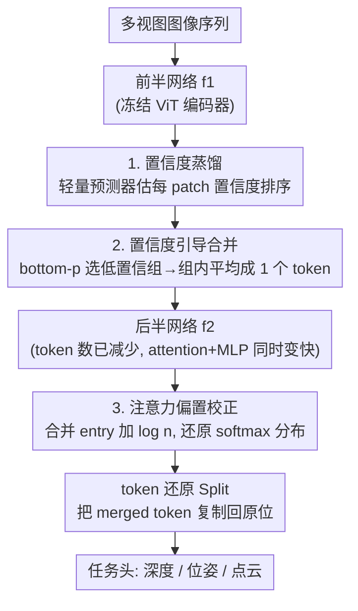

# Co-Me: Confidence Guided Token Merging for Visual Geometric Transformers

**会议**: CVPR 2026  
**论文**: [CVF Open Access](https://openaccess.thecvf.com/content/CVPR2026/html/Chen_Co-Me_Confidence_Guided_Token_Merging_for_Visual_Geometric_Transformers_CVPR_2026_paper.html)  
**代码**: https://co-me-tokens.github.io  
**领域**: 模型压缩  
**关键词**: token合并, 视觉几何Transformer, 推理加速, 置信度蒸馏, 3D重建  

## 一句话总结
Co-Me 给 VGGT、π3 这类视觉几何 Transformer 装上一个轻量的"置信度预测器"，把网络自己认为不重要（低置信度）的 patch token 合并成一个 token 再送进后半段网络，从而在不重训、不改主干结构的前提下，对 attention 和 MLP 同时提速，VGGT 上最高加速 21.5×、精度几乎不掉。

## 研究背景与动机
**领域现状**：VGGT、π3、MapAnything、DepthAnything 3 这类视觉几何 Transformer，能把一组多视图图像一次前向就回归出相机位姿、内参、深度和点云，把传统需要迭代优化的 3D 重建变成 feed-forward。但它们普遍是 1B 参数级的 ViT，attention 对 token 数 $n$ 是 $O(n^2 d)$ 的二次复杂度，序列一长（几十上百帧）就慢到无法实时部署。

**现有痛点**：现成的 token 提速方法在这类**稠密几何任务**上水土不服。① token 剪枝（DynamicViT、A-ViT）直接丢 token，丢掉的上下文恰恰是 3D 重建需要的，稠密任务上会持续掉点，而且要重训——对接近 10 亿参数的基座模型不现实；② token 合并里启发式的 ToMe 用特征相似度、FastVGGT 用特征范数+余弦相似度，且只在**全局 attention** 上合并，但在用了 FlashAttention 的中等长度序列里，全局 attention 只占一小部分运行时间，所以实际加速很有限，FastVGGT 要喂到 1000 帧才看得出明显提速。

**核心矛盾**：模型其实**自己就预测了置信度图**（高置信=纹理稳定、多视图一致的区域，低置信=天空、反光、遮挡这类下游本来就会丢弃的区域），但推理时对所有 token 一视同仁地分配算力，把同样多的计算花在了"可靠区"和"没用的背景区"上。

**切入角度**：作者借用人类**中央凹视觉（foveal vision）**的直觉——对关键区域高精细处理、对外围粗略感知。一个关键观察是：网络预测的高置信区域，强烈对应着 ViT 真正"重视"的区域；低置信区域只提供模糊的上下文线索，合并掉它们几乎不影响高置信区的几何预测。

**核心 idea**：用一个蒸馏出来的轻量置信度预测器，在推理早期就估出每个 patch 的置信度排序，**选择性地把低置信 token 合并**，对 attention 和 MLP 一起减算量，且全程不动基座模型。

## 方法详解

### 整体框架
Co-Me 把基座网络 $F$ 沿深度切成两半 $F = f_2 \circ f_1$（预测器插在编码器中段），整个流程分两个阶段。**阶段一（离线蒸馏）**：冻结基座，训练一个轻量预测器 $f'$，让它仅从 $f_1$ 的中间特征就能复现基座最终输出的置信度图 $C$ 的**token 级排序**。**阶段二（推理）**：输入图像序列先过 $f_1$，预测器给出每 patch 置信度；据此生成一张二值合并 mask，在进入 $f_2$ 前把低置信 token 组平均成一个 token（减少 token 数 → attention 和 MLP 都变快），$f_2$ 内部对合并后的 attention 做偏置校正，$f_2$ 算完后再把 token 还原（split）回原始形状交给任务头。

整条 pipeline 的提速来自"少算 token"，三个贡献节点对应下面三个关键设计；此外作者还配了一套工程实现（变长 FlashAttention kernel、用索引关系免去昂贵的 `Cat`、TensorRT 插件）把合并/还原的额外开销压到全网约 2%。

### 关键设计

**1. 置信度蒸馏：在推理早期拿到"哪些 token 不重要"的信号**

token 合并有个鸡生蛋的难题——要知道哪个 token 该合并得先有置信度，但置信度本来要等全网推理完才有。作者的解法是：既然编码器中间特征已经富含置信度线索，就蒸馏一个轻量网络 $f'$，仅从 $f_1$ 的中间特征估出 per-patch 置信度图 $C'$，让它在 token 级上逼近基座最终输出的 $C$。**全程冻结基座，不回传梯度，只训练 $f'$。** 预测器由三个轻量组件串成：先用 MLP 把编码器特征投到紧凑隐空间，再用单头 attention 做跨帧 patch 交互（低成本的全局推理），最后用 Conv2D 头把 token 压成置信度图并抑制空间噪声、让预测更平滑——整个模块只增加不到 2% 运行时间。

由于预测器容量有限，作者**只让它学相对排序而不是精确数值**——这正好够用，因为 Co-Me 只需要知道"谁比谁置信度低"。因此用 logistic ranking loss 取代直接 MSE：

$$\mathcal{L}(C', C) = \frac{1}{|P|}\sum_{(i,j)\in P} \log\!\big(1 + \exp(C'_j - C'_i)\big), \quad P \sim \text{UniformSubset}(\{(i,j)\mid C_i > C_j\})$$

即对所有"真实置信度 $C_i > C_j$"的 patch 对采样，惩罚预测里把它们排反的情况；patch 置信度由组内像素平均池化得到。训练是**完全自监督**的（标签就是基座自己的置信度，不需要任何 GT），在 TartanAir（50 万+合成序列图）上约 2000 步、单卡 H100 不到一小时就收敛，且能直接泛化到没见过的数据无需微调。

**2. 置信度引导的 token 合并与还原：对低置信组取平均、再复制还原**

有了置信度，就要把它变成"合并谁"的决策。给定合并比例 $p$，作者先按空间顺序把 token 切成固定大小的组（默认 $3\times3=9$ 个 token 一组）；对每组算平均置信度，若它低于整段序列里所有组的 **$p$ 百分位**，就标记为待合并。注意百分位是在**整段图像序列**上算的，于是不同帧的合并比例可以不同——信息量大的帧少合并、空旷的帧多合并，贴合真实场景。

合并算子很直接：对一组 $n$ 个 token $G_i$，若合并标志 $m_i$ 为真就用组内平均替换、否则原样保留，再拼成连续张量：

$$\text{MergeGrp}(G_i, m_i) = \begin{cases} \frac{1}{n}\sum_{x\in G_i} x & \text{若 } m_i \\ G_i & \text{否则}\end{cases}$$

这样 $f_2$ 看到的 token 数变少，attention 和 MLP 一起加速。$f_2$ 算完后做对称的**还原（Split）**：没合并的组原样放回；合并过的组则把那一个 merged token 复制 $n$ 份放回各自原始位置。这种"复制式还原"（借鉴 ToMeSD）保证输出形状和原网络一致，从而对下游深度/位姿/点云预测头**即插即用**。相比剪枝直接丢 token 丢掉空间信息，合并保留了空间覆盖；H3 消融也证实"取平均"比"随机挑一个（Pick-one）"或"全丢（Drop-all）"鲁棒得多，性能退化小 10× 以上——说明低置信 token 虽不精确，但提供的模糊上下文确实有用。

**3. 注意力偏置校正：把合并扭曲的 softmax 分布拉回来**

合并带来一个隐患：把 $n$ 个 token 并成一个后，原本分散在 $n$ 个 entry 上的 attention 权重被挤进**单个 entry**，经过 softmax 归一化后这个 entry 的权重被压低，整个注意力分布发生畸变。作者用一个优雅的修正：对合并组（含 $n$ 个原 token、原始 logit 为 $a_i$）的 attention logit 加一个偏置 $\log n$，得到 $\tilde{a}_i = a_i + \log n$。因为 softmax 是指数的，加 $\log n$ 相当于把该 entry 的权重放大 $n$ 倍，恰好补回 $n$ 个原 logit 贡献的质量：

$$\text{softmax}(\tilde{a}_i) = \frac{e^{a_i + \log n}}{\sum_j e^{a_j}} \approx \sum_{k\in G_i}\frac{e^{a_k}}{\sum_j e^{a_j}}$$

这样合并后的注意力分布就与原始分布重新对齐。代价是要做额外的逐 key 访存和加法、略微拖慢 attention，但 H4 消融显示去掉它会带来显著掉点（DTU 多视图深度上 $\Delta$L1 误差被它降到 1/4），是一个"小开销换大精度"的关键设计。为把这点开销也压下去，作者实现了支持**逐 key 偏置校正的变长 FlashAttention** kernel，并配 TensorRT 插件部署到边缘设备。

## 实验关键数据

评测覆盖 VGGT、π3、MapAnything(MA)、DepthAnything 3(DA3) 四个基座，三类任务（深度/位姿/点云），五个数据集（NYUd-v2、ETH3D、DTU-MVS、KITTI、RealEstate-10K）。基线含强化版 VGGT⋆（换 FlashAttention + FastVGGT 显存优化）、ToMeSD、FastVGGT；Co-Me 与 ToMeSD 合并比 0.5、FastVGGT 用 0.9（更激进、对其有利），组大小固定 $3\times3$。

### 主实验：深度估计（节选 Tab. 1，延迟单位 ms）

| 基座/方法 | 数据集(帧数) | 加速比 | L1↓ | δ1.25↑ |
|------|------|------|------|------|
| VGGT | NYUd-v2 (1帧) | 1.00× | 0.186 | 0.940 |
| ToMeSD0.5 | NYUd-v2 (1帧) | 0.48×(更慢) | 0.221 | 0.925 |
| **Co-Me** | NYUd-v2 (1帧) | **1.09×** | 0.225 | 0.918 |
| VGGT | KITTI (48帧) | 1.00× | 4.647 | 0.562 |
| FastVGGT | KITTI (48帧) | 3.82× | 4.611 | 0.562 |
| **Co-Me** | KITTI (48帧) | **9.94×** | 4.727 | 0.558 |
| MA | DTU-MVS (32帧) | 1.00× | 4.59 | 0.965 |
| **Co-Me** | DTU-MVS (32帧) | **13.3×** | 6.80 | 0.884 |

单帧场景下 ToMeSD/FastVGGT 要么比原模型还慢、要么直接不支持，Co-Me 仍有 ~1.1× 提速；多视图下 Co-Me 在所有基线里加速最高且精度可比。

### 位姿与点云（节选 Tab. 2/Tab. 3）

| 任务 | 基座 | 数据集(帧数) | 加速比 | 关键指标 |
|------|------|------|------|------|
| 位姿 | VGGT | RE10K (128帧) | **16.2×** | AUCt10 0.903→0.869 |
| 位姿 | π3 | RE10K (128帧) | **14.8×** | AUCt10 0.944→0.892 |
| 点云 | VGGT | DTU (32帧) | **7.71×** | Comp. 0.31→0.40, Acc. 0.30→0.31 |
| 点云 | π3 | ETH3D (16帧) | **4.12×** | 比原 π3 还更好且快 4× |

### 消融与分析（六个假设 H1–H6）

| 假设 | 结论 |
|------|------|
| H1 加速随序列长度增长 | 512 帧时 VGGT 上达 21.5×，且单帧也有提速（FastVGGT 单帧无收益） |
| H2 vs 相似度合并 | 同等加速下 Co-Me 误差增量更低，trade-off 曲线全面占优于 Merge-by-Sim |
| H3 合并 vs 丢弃/挑一个 | 取平均合并比 Pick-one/Drop-all 退化小 10× 以上 |
| H4 注意力偏置校正 | 去掉后 DTU 深度 $\Delta$L1 误差变 4×，校正显著提精度 |
| H5 边缘部署 | Jetson Thor 上 MA 加速 1.5×、3.5 FPS，近实时 |
| H6 MLP 成新瓶颈 | 高效 attention 下 SDPA 占比骤降，MLP 占大头；Co-Me 同时加速二者，自身开销仅 ~2% |

### 关键发现
- **加速比随序列变长而放大**：因为省下的是 $O(n^2)$ 的 attention，序列越长收益越大，512 帧 VGGT 上达 21.5×、π3 上 20.4×。
- **数据集差异源于视野冗余度**：NYUd-v2/DTU 视野重叠多、冗余 token 多，合并几乎不掉点；KITTI 帧间空间重叠少，合并的信息损失更大；ETH3D 上 Co-Me 甚至**提升**了精度，因为它删掉了宽基线重建里会引入噪声的低置信 token。
- **MLP 才是真瓶颈**：当 attention 被 FlashAttention 充分优化后，线性层占了相当比例的运行时间；Co-Me 同时对 attention 和 MLP 减 token，这是它比"只在全局 attention 上合并"的 FastVGGT 提速大得多的根本原因。

## 亮点与洞察
- **把模型自带的置信度"废物利用"成加速信号**：网络本来就预测置信度图、低置信区下游本就丢弃，Co-Me 把这个免费信号蒸馏前移，比 ToMe 的特征相似度更贴合"几何上谁重要"。
- **$\log n$ 偏置校正是点睛之笔**：合并破坏 softmax 质量守恒，加 $\log n$ 用指数性质精确补回，一行公式换来 4× 的误差下降，思路干净且可迁移到任何"把多个 entry 并成一个"的注意力压缩场景。
- **训练-免费且即插即用**：蒸馏只动一个 <2% 开销的小模块、不到 1 GPU 小时，基座完全冻结、输出形状不变，对四个 SOTA 基座直接套用——这种"零侵入加速"对动辄 1B 参数的几何基座格外实用。
- **指出 MLP 成新瓶颈**：在 FlashAttention 时代重新审视"加速谁"，提示后续 ViT 提速工作不能只盯 attention。

## 局限与展望
- **冗余度依赖**：加速与精度强依赖输入视野的冗余度，KITTI 这种帧间重叠少的场景合并损失明显（作者已坦承）。
- **DA3 收益有限**：对架构较浅的 DepthAnything 3，加速只有 2.2–2.7×，说明方法对"深网络 + 长序列"才最划算。
- **置信度可能有偏**：⚠️ 蒸馏的是基座自己的置信度，若基座在某些区域置信度本身就估错（如反光面误判为高置信），合并决策会一并继承这个偏差，论文未深入讨论这种失效模式。
- **展望**：作者提出把引导信号从"几何置信度"推广到"任务相关性"以服务 VLM/VLA、在时间维度上对流式输入合并、以及把 Co-Me 用进训练阶段提效。

## 相关工作与启发
- **vs ToMe / ToMeSD**：它们靠特征余弦相似度合并、面向图像分类，Co-Me 改用蒸馏置信度，更贴合 3D 重建里"哪些区域几何上关键"；H2 显示同等加速下 Co-Me 误差更低。还原机制（复制式 Split）借鉴自 ToMeSD。
- **vs FastVGGT**：FastVGGT 只在全局 attention 上用范数+相似度合并，需 1000 帧才有明显提速；Co-Me 对 attention 和 MLP 同时合并，中等长度序列就有大幅加速，且 H6 解释了为何提速更大（MLP 占比高）。
- **vs DynamicViT 等剪枝**：剪枝丢 token、稠密任务掉点且需重训；Co-Me 合并保留空间覆盖、不重训不改结构，H3 证实合并比丢弃鲁棒 10×+。

## 评分
- 新颖性: ⭐⭐⭐⭐ 把模型自带置信度蒸馏成加速信号、配 $\log n$ 偏置校正，角度新颖但仍属 token 合并范式内的改进
- 实验充分度: ⭐⭐⭐⭐⭐ 四基座×三任务×五数据集 + 六个假设消融 + 边缘设备实测，非常扎实
- 写作质量: ⭐⭐⭐⭐ 结构清晰、图示到位（尤其偏置校正示意），公式与动机讲得明白
- 价值: ⭐⭐⭐⭐⭐ 让 1B 级几何 Transformer 接近实时、零侵入即插即用，对具身/SLAM 落地价值高

<!-- RELATED:START -->

## 相关论文

- [\[CVPR 2026\] Saliency-Driven Token Merging for Vision Transformers](saliency-driven_token_merging_for_vision_transformers.md)
- [\[CVPR 2026\] MeToM: Metadata-Guided Token Merging for Efficient Video LLMs](metom_metadata-guided_token_merging_for_efficient_video_llms.md)
- [\[CVPR 2026\] Merge3D: Efficient 3D Multimodal LLMs via Joint 2D-3D Token Merging](merge3d_efficient_3d_multimodal_llms_via_joint_2d-3d_token_merging.md)
- [\[CVPR 2026\] CORE: Compact Object-centric REpresentations as a New Paradigm for Token Merging in LVLMs](core_compact_object-centric_representations_as_a_new_paradigm_for_token_merging_.md)
- [\[CVPR 2026\] BinaryAttention: One-Bit QK-Attention for Vision and Diffusion Transformers](binaryattention_one-bit_qk-attention_for_vision_and_diffusion_transformers.md)

<!-- RELATED:END -->
