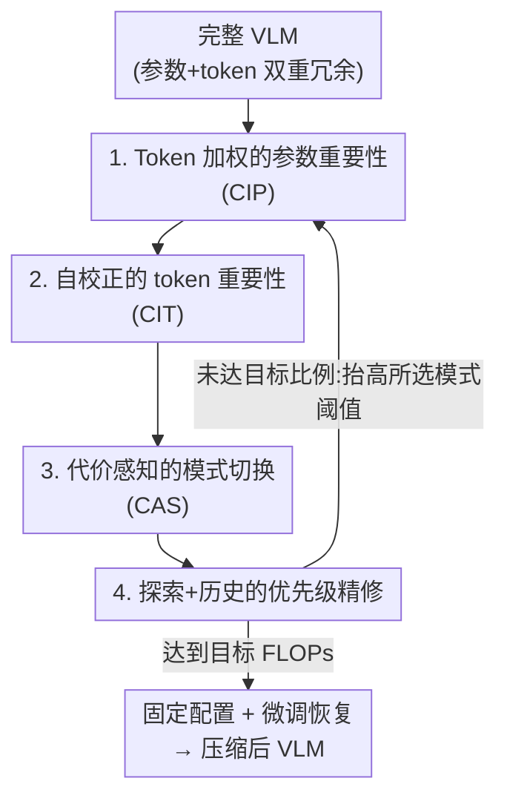

# Collaborative Multi-Mode Pruning for Vision-Language Models

**会议**: CVPR 2026  
**论文**: [CVF Open Access](https://openaccess.thecvf.com/content/CVPR2026/html/Wu_Collaborative_Multi-Mode_Pruning_for_Vision-Language_Models_CVPR_2026_paper.html)  
**代码**: https://github.com/Wuzimeng/CoMP.git  
**领域**: 模型压缩  
**关键词**: VLM剪枝, 参数剪枝, token剪枝, 联合剪枝, 渐进式压缩  

## 一句话总结
针对 VLM 同时存在的"参数冗余"和"token 冗余"，CoMP 设计了一套协同重要性度量（CIM，消除参数剪枝和 token 剪枝互相干扰）和一套多模式剪枝策略（MPS，每一步自适应挑当前最划算的剪枝模式），在高剪枝率下显著优于只剪参数或只剪 token 的单模式方法（NLVR2 在 0.85 剪枝率下测试精度领先 3.51%）。

## 研究背景与动机

**领域现状**：VLM（BLIP、CLIP、LLaVA 这类）部署到端侧受限于 Transformer 的高算力开销，剪枝是主流压缩手段之一。剪枝又分两条路线：**参数剪枝**（裁掉不重要的 channel/结构，降低特征维度 $D$，把单 block 的 $O(N^2D+ND^2)$ 复杂度里的 $D$ 压小）和 **token 剪枝**（丢掉不重要的图像/文本 token，缩短序列长度 $N$）。

**现有痛点**：绝大多数方法只做单一模式——要么只剪参数（UPop、MoPE-CLIP），要么只剪 token（MADTP、CrossGET、FastV）。参数和 token 的冗余本质上是互补的（一个在模型结构里，一个在输入数据里），但单模式剪枝只挖了一半冗余，在高剪枝率下会因为"某一模式被过度裁剪"而精度崩塌。

**核心矛盾**：那直接把两种剪枝拼在一起（简单联合剪枝，SJP）行不行？作者做了预实验，发现简单拼接（顺序做或同时做）效果只和单模式持平，潜力完全没被释放。原因是两个**深层冲突**：

1. **参数重要性与 token 重要性的度量互相打架**。论文给了证据（Fig. 2）：在 BLIP 视觉编码器第 10 层，对"参数重要性"贡献最大的 token，和"token 重要性"打分最高的 token 重叠率不到 30%——意味着一批本该被丢的冗余 token 反而主导了参数重要性的估计；反过来在第 2 层，75% 最不重要、即将被剪掉的参数，却仍然强烈影响 token 重要性的打分。两套度量各算各的，自然彼此误导。
2. **剪枝模式的施加方式太僵硬**。现有渐进式剪枝把整个过程切成多个 stage，但每个 stage 用**固定模式、固定顺序**同时剪所有模态。可模型在剪枝过程中一直在变，最优的剪枝模式（剪视觉参数？语言 token？跨模态参数？）会随 stage 漂移，固定顺序必然次优。

**核心 idea**：用**协同**取代**拼接**——既要让两套重要性度量互相"校准"而非互相干扰（CIM），又要在每个渐进 stage 动态挑出当下最划算的那个剪枝模式（MPS），从而把联合剪枝的潜力真正榨出来。

## 方法详解

### 整体框架

CoMP 面向标准 Transformer-based VLM（堆叠的 MHA + FFN block，单 block 写作 $Z=f(X)=\phi(XW_{in})W_{out}+X$）。结构化参数剪枝和 token 剪枝分别要找二值 mask $M^p\in\{0,1\}^D$ 和 $M^t\in\{0,1\}^N$，通过广播 Hadamard 积 $\hat{W}=W\odot M^p$、$\hat{X}=X\odot M^t$ 永久丢弃对应分量；mask 由重要性分数过阈值得到 $M^p=\mathbb{I}(S^p>\theta^p),\ M^t=\mathbb{I}(S^t>\theta^t)$，渐进剪枝就是逐步抬高阈值 $\theta$。

CoMP 把整个压缩组织成**双重嵌套循环**：**内循环**用 CIM 模块算重要性——一边把 token 重要性注入参数重要性的计算（抑制冗余 token 的误导），一边把参数 mask 注入 token 重要性的计算（抑制冗余参数的误导）；**外循环**用 MPS 模块周期性地从 5 种剪枝模式里挑出当前最优的那个，抬高它对应的阈值来提升剪枝率，然后训练更新参数。整个过程先把模型渐进剪到目标 FLOPs，再固定配置微调恢复精度。

其中 B、C 同属 CIM（内循环，消除两套度量的互相干扰），D、E 同属 MPS（外循环，挑选并稳定剪枝模式）。

### 关键设计

**1. Token 加权的参数重要性（CIP）：让真正重要的 token 主导参数打分**

痛点直指上面的冲突①——由于 Transformer 里 LayerNorm 的存在，常规参数重要性度量分不清不同 token 的贡献，冗余 token 会误导参数剪枝决策。CoMP 从高效的 Wanda 度量出发，把它扩展到结构化剪枝：参数矩阵 $W\in\mathbb{R}^{D\times d}$ 第 $i$ 行的基础重要性为 $S^p_{i,:}=\frac{1}{d}\sum_{j=1}^{d}|W_{i,j}|\cdot\|X_{:,i}\|_2$（权重幅值 × 输入激活范数）。关键改造是把范数里的输入用 **token 重要性加权**：

$$S'^p_{i,:}=\frac{1}{d}\sum_{j=1}^{d}|W_{i,j}|\cdot\Big(\sum_{n=0}^{N}\omega_n\cdot X_{n,i}^2\Big)^{\frac{1}{2}},\quad \omega_0=1,\ \omega_n=\frac{S^t_n}{\sum_{n=1}^{N}S^t_n}\ (n>1)$$

这里 $n=0$ 是 \[CLS\] token、权重固定为 1，普通 token 的权重由其 token 重要性分数 $S^t_n$ 归一化得到——归一化让所有普通 token 的总贡献等于 \[CLS\]，既凸显全局 \[CLS\] 又抵消 token 剪枝带来的层间 token 数差异造成的范数尺度偏差（对 LLaVA 这类无 \[CLS\] 的模型则省去 $\omega_0$）。这样一来，被判定为冗余的 token 不再对参数重要性"灌票"，参数剪枝看的是真正重要 token 上的激活。论文还指出 token 只通过注意力交互、相邻 MHA 之间近似独立，所以第 $l$ 层的 token 重要性主要由当层 MHA 和上一层 FFN 决定，于是按 block 类型区分加权来源：FFN 用下一层的 $S^{t,l+1}$、MHA 用本层的 $S^{t,l}$。

**2. 自校正的 token 重要性（CIT）：把参数 mask 灌进注意力，别让冗余 head 拉平打分**

这一设计对应冲突①的另一半——token 重要性靠注意力算，但即将被剪掉的冗余参数（尤其冗余 attention head）会干扰它。基础 token 重要性用注意力聚合：$S^t_i=\mathrm{Norm}\big(\sum_{n=1}^{N}\max_{h=1,\dots,H}A_{h,n,i}\big)$，其中 $A\in\mathbb{R}^{H\times N\times N}$ 是 $H$ 个 head 的注意力矩阵 $\mathrm{Softmax}(QK^T/\sqrt{d_k})$。问题在于：常规剪枝（Eq.2）虽然能压制冗余 head 的影响，但 Softmax 的归一化会让被压制 head 输出近乎均匀的注意力分布，反而**扭曲** token 重要性的排序（论文 Fig. 5：本来 token1 比 token2 重要，按 Eq.2 屏蔽冗余 head 后排序被打乱）。CoMP 的修法是直接把参数剪枝 mask 作用到注意力矩阵上：$\hat{A}=A\odot\hat{M}^p$，其中 $\hat{M}^p\in\mathbb{R}^H$ 是从 $M^p$ 里每隔 $\frac{D}{H}$ 取一个值、对齐到 head 维度得到的；用 $\hat{A}$ 再去算 Eq.6。这样冗余 head 是被**渐进抑制**而不是被 Softmax 拉平，token 重要性的正确排序得以保留。CIP 和 CIT 一对，正好把两套度量的双向干扰都堵上。

**3. 代价感知的模式切换（CAS）：每步只剪当前最划算的那一种**

对应冲突②——固定顺序剪所有模态会次优。CoMP 先按"模态 × 冗余类型"定义 **5 种剪枝模式** $B=\{B^p_v,B^p_l,B^p_c,B^t_v,B^t_l\}$（视觉参数、语言参数、跨模态参数、视觉 token、语言 token），每种模式配一个可优化阈值 $\Theta=\{\theta^p_v,\theta^p_l,\theta^p_c,\theta^t_v,\theta^t_l\}$。每个 stage 只**选一种模式**、抬高它的阈值、再训练更新。怎么选？由于无法解析地预测每种模式未来的影响，CoMP 维护一组**代价估计** $\mathcal{R}=\{r^p_v,\dots,r^t_l\}$，每执行完一种模式就更新它的代价：

$$r=\frac{\Delta\mathit{val\_acc}}{\Delta\mathit{FLOPs}},\quad \mathcal{R}^{\text{cur}}_m\leftarrow r,\quad m\leftarrow\arg\min(\mathcal{R})$$

$r$ 衡量"每单位 FLOPs 下降换来多少验证精度变化"，即模型对该剪枝模式的敏感度；下一个 stage 就贪心地选**代价最低**（最不伤精度、最划算）的模式。这样模式选择随模型动态变化自适应漂移，而不是死守固定顺序。

**4. 探索 + 历史信息的优先级精修：避免贪心一条道走到黑**

纯贪心（设计 3）有个隐患——会长时间盯着同一个模式剪，导致某模态被过度剪枝、陷入局部最优。CoMP 用一个混合策略来兜底。其一是**随机探索**：每个 stage 以概率 $\rho$ 随机选模式而非严格选代价最低的。其二是**历史信息引导随机选择**：维护时间戳 $\mathcal{T}$ 记录每种模式最近一次被执行的 stage，用距上次执行的间隔 $I_m=T-\mathcal{T}_m$ 做间隔加权 Softmax $\rho_m=\mathrm{Softmax}(I_m/\tau)$，**偏向久未被执行的模式**以保持多样性。其三是把这个时间间隔也融进代价估计、用 EMA 平滑单步代价：

$$\mathcal{R}^{\text{cur}}_m\leftarrow\lambda\mathcal{R}^{\text{pre}}_m+(1-\lambda)r,\quad \lambda=\max\!\Big(\lambda_0-\frac{\lambda_0}{I_{\max}}(I_m-1),\,0\Big)$$

衰减因子 $\lambda$ 从 $\lambda_0$ 线性降到 0，保证只有最近 $I_{\max}$ 个 stage 的代价才参与当前决策（太久远的代价已不反映当前模型状态）。三者合力让剪枝过程更稳、更不容易掉进单一模式的局部最优。

### 损失函数 / 训练策略
CoMP 复用 UPop 框架做参数剪枝、MADTP（BLIP/CLIP）和 PDrop（LLaVA）做 token 剪枝，作为各自的单模式 baseline，CoMP 在其上补充多模式协同。阈值 $\theta^p$、$\theta^t$ 沿用 baseline 设置并扩展以支持多模式细粒度协同优化。MPS 超参：随机探索 $\rho=0.2$、$\tau=5$、$\lambda_0=0.4$、$I_{\max}=5$。训练流程是"先渐进剪到目标 FLOPs，再固定配置微调恢复"，实验在 2×A800 上完成；对 LLaVA 是在官方 665K 指令数据上训练时完成压缩（一个 epoch 的监督微调内）。

## 实验关键数据

### 主实验

BLIP 在 NLVR2 视觉推理任务上，不同剪枝率对比（'P/T/J/C'=参数/token/联合/协同剪枝，SJP=简单联合剪枝 baseline）：

| 剪枝率 | 方法 | 模式 | Test Acc.(%) | GFLOPs |
|--------|------|------|------|--------|
| — | Uncompressed | / | 83.08 | 132.54 |
| 0.7 | UPop | P | 68.76 | 39.93 |
| 0.7 | MADTP | T | 80.78 | 39.63 |
| 0.7 | **CoMP** | C | **81.37** | 39.72 |
| 0.8 | MADTP | T | 77.61 | 26.46 |
| 0.8 | SJP(M→U) | J | 77.44 | 26.61 |
| 0.8 | **CoMP** | C | **79.62** | 25.97 |
| 0.85 | MADTP | T | 72.57 | 20.57 |
| 0.85 | **CoMP** | C | **76.08** | 20.26 |

中等剪枝率（≤0.6）下 CoMP 与最好的单模式持平；高剪枝率（≥0.7）下持续领先，0.85 时测试精度领先 MADTP **3.51%**。跨任务（基于 BLIP/CLIP）：

| 任务/模型 | 方法 | 剪枝率 | 关键指标 | GFLOPs |
|------|------|------|------|--------|
| Flickr30K I→T (BLIP) | MADTP | 0.7 | R@1 92.6 | 30.96 |
| Flickr30K I→T (BLIP) | **CoMP** | 0.7 | **R@1 94.4** | 30.47 |
| COCO retrieval (CLIP) | MADTP | 0.75 | I→T R@1 66.2 | 49.7 |
| COCO retrieval (CLIP) | **CoMP** | 0.75 | **I→T R@1 68.7** | 44.7 |
| Image Caption COCO (BLIP) | MADTP | 0.7 | CIDEr 120.1 | 22.1 |
| Image Caption COCO (BLIP) | **CoMP** | 0.7 | **CIDEr 126.8** | 21.2 |
| VQAv2 (BLIP) | MADTP | 0.7 | Test-dev 76.3 | 61.6 |
| VQAv2 (BLIP) | **CoMP** | 0.7 | **Test-dev 76.5** | 59.7 |

在 LLaVA-v1.5-7B 上协同剪"视觉 token + 文本 token + LLM 参数"，0.46 剪枝率下平均分 69.23（接近未压缩的 69.28、TFLOPs 从 5.63 降到 2.94），优于 DART† 的 68.80；0.62 剪枝率下平均分 66.98 vs DART† 65.92，且分别比 PDrop†/VisionZip†/DART† 高 4.03%/1.59%/1.06%。

### 消融实验

NLVR2、BLIP、剪枝率 0.8（baseline = MADTP+UPop 简单联合）：

| 配置 | Test Acc.(%) | GFLOPs | 说明 |
|------|------|--------|------|
| SJP baseline | 77.88 | 26.39 | 简单联合剪枝 |
| + CIM | 78.60 | 26.04 | 消除两套度量干扰，+0.72% |
| + CIM + MPS | **79.62** | 25.97 | 完整 CoMP，再 +1.02% |

CIM/MPS 内部子模块（剪枝率 0.8）：

| 模块 | 子组件 | Test Acc.(%) | 说明 |
|------|------|------|------|
| CIM | 仅 CIP | 78.27 | token 加权参数重要性，+0.39% |
| CIM | 仅 CIT | 78.29 | 自校正 token 重要性，+0.41% |
| CIM | CIP+CIT | 78.60 | 两者协同 |
| MPS | 仅 CAS | 78.24 | 纯代价贪心切换 |
| MPS | +RE | 79.02 | 加随机探索，+0.78% |
| MPS | +RE+HI | **79.62** | 再加历史信息，+0.60% |

### 关键发现
- **早期冗余主要在 token、后期两模式趋同**：低剪枝率时 CoMP 自适应地切到 token 剪枝模式、行为接近 MADTP；随剪枝率升高两类冗余趋于相当、互相干扰加剧，此时协同的优势才真正放大——这解释了为什么 CoMP 只在高剪枝率下显著领先。
- **CIP 与 CIT 贡献相当**（+0.39% vs +0.41%），说明"参数误导 token"和"token 误导参数"两个方向的干扰都需要堵，缺一不可。
- **纯贪心反而略降，探索 + 历史才是关键**：CAS 单独用甚至比某些组合差，加上随机探索（+0.78%）和历史信息（+0.60%）后才稳定提升，印证了贪心易陷局部最优的判断。

## 亮点与洞察
- **把"参数剪枝"和"token 剪枝"的互相干扰显式建模并双向校准**：用 Fig. 2 的重叠率/影响度实证两套度量打架，再用 CIP（token 权重进参数打分）+ CIT（参数 mask 进注意力）对称地堵两个方向——这种"先量化干扰再对称消除"的思路很干净，可迁移到任何"两套重要性度量耦合"的压缩场景。
- **把模式选择当成在线决策问题**：用"精度变化/FLOPs 变化"定义剪枝代价，再借鉴 multi-armed bandit 式的"贪心 + 随机探索 + 时间间隔衰减"做模式调度，比固定顺序优雅得多，是把强化学习/在线学习直觉引入剪枝的好例子。
- **CIT 抓的 Softmax 归一化陷阱很微妙**：直接 mask 冗余 head 会让其注意力被 Softmax 拉成均匀分布、反而污染 token 排序，改成 mask 注意力矩阵本身才对——这是只有真正画出注意力分布才能发现的坑。

## 局限与展望
- 论文承认（隐含在结果里）CoMP 的优势**集中在高剪枝率**，中低剪枝率下相对单模式几乎无增益，性价比要看部署目标的压缩档位。
- ⚠️ MPS 引入了 $\rho,\tau,\lambda_0,I_{\max}$ 等多个超参，论文固定了一组值但敏感性分析放在 Appendix，正文未展开，跨任务/跨模型的鲁棒性需谨慎。
- 每个 stage 选模式都要测一次验证精度变化来算代价 $r$，这部分的**剪枝期开销**论文未在正文量化（只报推理 FLOPs），对超大模型的可扩展性存疑。
- 5 种剪枝模式是按"模态 × 冗余类型"人工划定的，对更多模态或更复杂结构（如 MoE）能否直接扩展未讨论。

## 相关工作与启发
- **vs UPop / MADTP（单模式 baseline）**：UPop 只剪参数、MADTP 只剪 token，各挖一半冗余；CoMP 在二者框架之上做多模式协同，高剪枝率下显著超越两者，且本身复用它们做底座（可插拔）。
- **vs 简单联合剪枝 SJP**：SJP 直接顺序/同时拼参数+token 剪枝，因两套度量打架 + 固定模式顺序，效果只和单模式持平；CoMP 用 CIM 消干扰、MPS 动态调度，证明"联合剪枝失效不是方向错而是没处理好耦合"。
- **vs Turbo / CrossGET 等联合尝试**：少数已有联合剪枝工作采用刚性方案，CoMP 的"协同"强调度量校准 + 自适应模式选择，在 0.6 剪枝率下比 Turbo 的 SJP 变体高 2.19%。

## 评分
- 新颖性: ⭐⭐⭐⭐ 首次系统性地把参数/token 剪枝的互相干扰建模并双向校准，再用在线代价调度选模式，思路新颖
- 实验充分度: ⭐⭐⭐⭐ 覆盖 BLIP/CLIP/LLaVA 三类模型、推理/检索/caption/VQA 多任务、多剪枝率，消融拆到子模块
- 写作质量: ⭐⭐⭐⭐ 痛点用实证图量化、方法公式清晰，逻辑链完整
- 价值: ⭐⭐⭐⭐ 高剪枝率下的 VLM 压缩有实际部署价值，CIM/MPS 可插拔到现有剪枝框架

<!-- RELATED:START -->

## 相关论文

- [\[CVPR 2026\] SCoRe: Salience-Coverage Reduction for Vision Token Pruning in Vision-Language Models](score_salience-coverage_reduction_for_vision_token_pruning_in_vision-language_mo.md)
- [\[CVPR 2026\] IF-Prune: Information-Flow Guided Token Pruning for Efficient Vision-Language Models](if-prune_information-flow_guided_token_pruning_for_efficient_vision-language_mod.md)
- [\[CVPR 2026\] Hybrid Token Compression for Vision-Language Models](hybrid_token_compression_for_vision-language_models.md)
- [\[CVPR 2026\] Rethinking Token Reduction for Large Vision-Language Models](rethinking_token_reduction_for_large_vision-language_models.md)
- [\[CVPR 2026\] Masking Teacher and Reinforcing Student for Distilling Vision-Language Models](masking_teacher_and_reinforcing_student_for_distilling_vision-language_models.md)

<!-- RELATED:END -->
