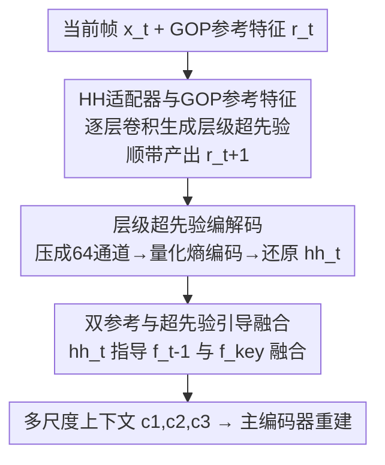

# Content-Adaptive Hierarchical Hyperprior for Neural Video Coding

**会议**: CVPR 2026  
**论文**: [CVF Open Access](https://openaccess.thecvf.com/content/CVPR2026/html/Liao_Content-Adaptive_Hierarchical_Hyperprior_for_Neural_Video_Coding_CVPR_2026_paper.html)  
**代码**: 无（论文未公开）  
**领域**: 模型压缩 / 神经视频编码  
**关键词**: 神经视频编码, 层级结构, 超先验, 内容自适应, 率失真优化  

## 一句话总结
针对神经视频编码（NVC）长期被忽视的"层级结构"（质量结构 + 参考结构）优化问题，本文从当前帧提取一个**层级超先验（hierarchical hyperprior）**，用它统一引导质量分配和双参考融合的内容自适应联合优化，在 IP -1 / IP 32 两种设置下比前一代 SOTA 的 DCVC-FM 分别多省 15.51% / 12.20% 码率。

## 研究背景与动机

**领域现状**：现代神经视频编码主流走"条件编码（conditional coding）"范式（DCVC 家族），在特征域做运动补偿、用隐式上下文特征累积时序信息，最新的 DCVC-FM 已在 IP -1 设置下超过 H.266/VVC 的参考软件 VTM。但这些工作几乎都把精力放在**网络架构和编码模块**的改进上。

**现有痛点**：传统编码器（如 VTM）一直是"算法 + 层级结构"协同优化——它有显式的层级结构，给不同层配不同的量化参数（QP）偏移和参考帧列表，还能靠多 QP 优化、RDOQ、参考帧 RDO 等做内容自适应调整。而 NVC 里的层级结构是**隐式**的：质量结构靠端到端训练学到的逐帧质量分配，参考结构则藏在上下文生成（context generation）的帧间传播里，几乎没人专门去优化。

**核心矛盾**：已有的少数 NVC 层级结构工作（DCVC-DC 用层级 Lagrange 权重、DCVC-FM 周期性刷新上下文、EHVC 用双参考方案）有两个共同短板——**(1) 层级结构优化缺乏内容自适应**，对不同视频内容用同一套固定结构，泛化性差；**(2) 质量结构和参考结构被各自独立优化**，没有联合考虑。本质上 NVC 缺一个能"看懂当前帧内容、同时调节质量和参考"的统一抓手。

**本文目标**：让 NVC 的层级结构既能随内容自适应，又能把质量结构和参考结构放在一起联合优化。

**切入角度**：作者观察到 NVC 里已有"超先验（hyperprior）"这个从隐变量里提取边信息辅助熵建模的成熟组件——那是否能再造一个**从当前原始帧直接提取的"层级超先验"**，专门承载层级结构信息？因为它来自当前帧，天然带内容信息；因为它是单一来源，又能同时去引导质量和参考两套结构。

**核心 idea**：引入一条全新的"层级超先验编解码器（hierarchical hyperprior codec）"，从当前帧提取层级超先验 $hh_t$，用它**同时**驱动质量结构（逐层自适应质量分配）和参考结构（前一帧 + 关键帧的双参考融合）的内容自适应联合优化。

## 方法详解

### 整体框架
本文 NVC 建立在主流条件编码 NVC（主编码器 main codec + 超先验编码器 hyperprior codec）之上，新增第三条**层级超先验编码器**（图 1(b) 中红色箭头）。一帧的编码流程是：当前帧 $x_t$ 和 GOP 参考特征 $r_t$ 先进入 **HH Adaptor（层级超先验适配器）**，生成承载层级信息的层级感知特征 $\check{h}_t$ 以及下一帧的 GOP 参考特征 $r_{t+1}$；$\check{h}_t$ 经 **HH Encoder** 压成 64 通道隐变量 $h_t$，量化 + 熵编码进比特流；解码端熵解码后过 **HH Decoder** 上采样还原出原分辨率的层级超先验 $hh_t$；最后 $hh_t$ 进入**上下文生成（context generation）**模块，引导前一帧参考特征 $f_{t-1}$ 与关键帧参考特征 $f_{key}$ 的融合，输出多尺度时序上下文 $c_{1,t}, c_{2,t}, c_{3,t}$ 交给主编码器完成重建。

层级结构本身是固定的骨架：沿用 DCVC-DC 的 4 帧 GOP，层级权重为 $[0.5, 1.2, 0.5, 0.9]$，三种不同权重对应三个"层"，权重 1.2 的帧质量最高、作为 GOP 内的关键帧。本文的所有创新都是在这个固定骨架之上、用层级超先验做**内容自适应**的微调。

### 关键设计

**1. 层级超先验 + HH 适配器：把质量结构变成内容自适应的逐层调制**

针对"NVC 质量结构靠固定训练学到、对变长预测链泛化差"的痛点，本文设计了 **HH 适配器**：它由一组 $3\times3$ 卷积 + LeakyReLU 构成，输入是当前帧 $x_t$ 和 GOP 参考特征 $r_t$，输出层级感知特征 $\check{h}_t$。关键在于**不同层的帧走不同的卷积参数**（图 5 中灰色部分），从而给不同层的帧生成不同质量的上下文——这就把过去藏在网络权重里的"模型参数引导的质量分配"显式地搬进了一个内容自适应模块。它有两点价值：(1) 把当前帧信息当输入，逐层参数因此能随内容调质量；(2) 适配器的输出嵌入了质量信息，经后续模块处理后，让层级超先验有能力去引导上下文生成，为质量与参考的联合优化打底。

配套的 **GOP 参考特征 $r_t$** 是适配器的另一个输入，用来把 GOP 内其它帧的信息带进来。对非关键帧，前一帧适配器的输出直接当作本帧的 $r_t$；首个帧间编码帧的 $r_t$ 初始化为全零张量。为避免误差累积，关键帧（除首个帧间帧外）会触发**刷新**：仍用 $x_t$ 和继承来的 $r_t$ 过适配器生成层级超先验，但传给下一帧的 GOP 参考特征改用"$x_t$ + 全零张量"重新算（图 5(b)），等于在关键帧处切断了前序误差的传播链。

**2. 层级超先验编解码器：轻量地把 $hh_t$ 压进码流**

层级超先验需要传到解码端才能在两边都引导上下文生成，因此要单独编码。为平衡计算开销和特征提取能力，作者精心设计了通道数和层数：编码端把适配器输出经一串卷积压成 **64 通道、空间下采样 64 倍**的紧凑表示，再量化 + 熵编码生成比特流；解码端熵解码后，经一串子像素卷积（SubConv）**上采样 64 倍**，还原出与原分辨率一致的 12 通道层级超先验 $hh_t$（图 4）。这条编解码器刻意做得轻——它的角色是传递层级"边信息"而非主体内容，所以用很少的码率换来对整个层级结构的内容自适应控制。

**3. 双参考 + 超先验引导的上下文融合：让参考结构也内容自适应**

参考结构的优化集中体现在上下文生成模块（图 3），分**初始上下文生成**和**上下文融合**两步。初始上下文生成走双分支：$f_{t-1}$ 分支（高相似度、近邻帧）依次过特征提取、warp、对齐，得到三个尺度的初始上下文 $\tilde{c}_{1,t}, \tilde{c}_{2,t}, \tilde{c}_{3,t}$，结构沿用 DCVC-DC；$f_{key}$ 分支（高质量、关键帧）过相似结构的特征提取后，经 $n$ 次 warp（$n$ 为当前帧到关键帧的距离）和 key align，得到关键帧初始上下文 $\tilde{c}_{k,t}$。两分支参数完全不共享。值得注意的是，作者**移除了以往 NVC 在此处的特征适配器**，目的是把"模型参数引导的质量结构优化"统统集中到 HH 适配器里，避免两处各管一摊。

上下文融合是联合优化真正发生的地方：当前帧的层级超先验 $hh_t$、前一帧最高尺度初始上下文 $\tilde{c}_{1,t}$、关键帧初始上下文 $\tilde{c}_{k,t}$ 一起送进 context merge 模块，由 $hh_t$ **引导**前一帧与关键帧两路参考信息的融合，输出单尺度融合上下文 $\check{c}_{1,t}$；再与前一帧剩下两个尺度 $\tilde{c}_{2,t}, \tilde{c}_{3,t}$ 融合，得到三尺度上下文 $c_{1,t}, c_{2,t}, c_{3,t}$。可视化（图 9）证实了这种融合的意义：$\tilde{c}_{1,t}$ 因时序邻近保留了运动物体的高纹理细节，$\tilde{c}_{k,t}$ 因帧距把运动物体模糊掉、但保留了高质量静态背景，融合后的 $c_{1,t}$ 同时拿到了运动部分的丰富特征和背景的高质量特征。因为质量结构（HH 适配器）和参考结构（这里的融合）都由同一个来自当前帧的层级超先验驱动，端到端训练就把两者**联合**优化了起来。

## 实验关键数据

训练用 Vimeo-90k（先在现成 7 帧视频上训，再在 32 帧原始视频上微调）；测试用 UVG、MCL-JCV、HEVC Class B/C/D/E 六个数据集。指标为 BD-Rate（以 VTM-23.4 LDB 为锚点，越负越好），辅以 bpp 和 PSNR。

### 主实验

IP -1（仅首帧 intra，全帧）下的 BD-Rate（%）平均对比：

| 编码器 | 平均 BD-Rate (%) | 说明 |
|--------|------------------|------|
| VTM-23.4 (锚点) | 0.00 | H.266/VVC 参考软件 |
| DCVC-DC | 25.16 | 比 VTM 还差 |
| DCVC-FM | -7.07 | 前一代 SOTA NVC |
| DCVC-RT | 25.66 | 主打低复杂度，率失真退化明显 |
| **本文 NVC** | **-22.58** | 全数据集最优，比 DCVC-FM 多省 15.51% |

IP 32（96 帧，短预测链）下的 BD-Rate（%）平均对比：

| 编码器 | 平均 BD-Rate (%) | 说明 |
|--------|------------------|------|
| VTM-23.4 (锚点) | 0.00 | — |
| DCVC-DC | -12.47 | — |
| DCVC-FM | -8.82 | — |
| **本文 NVC** | **-21.02** | 全数据集最优，比 DCVC-FM 多省 12.20% |

两种设置下本文 NVC 都在所有数据集上取得最佳，说明改进对长/短预测链都成立。

### 消融实验

在 HEVC B/C/D/E（IP -1、全帧）上的逐组件消融（BD-Rate %，基线 Ma = 带上下文刷新的 DCVC-DC）：

| 配置 | HH 引导上下文融合 | HH 适配器 | GOP 参考特征 | 适配器内刷新 | BD-Rate (%) |
|------|:--:|:--:|:--:|:--:|:--:|
| Ma（基线） | | | | | 0.0 |
| Mb | ✓ | | | | -17.3 |
| Mc | ✓ | ✓ | | | -18.5 |
| Md | ✓ | ✓ | ✓ | | -19.4 |
| Me（完整） | ✓ | ✓ | ✓ | ✓ | -20.0 |

### 关键发现
- **贡献最大的是"HH 引导的上下文融合"（参考结构优化）**：单这一项就带来 -17.3% 的码率节省，是全部 -20.0% 收益里的绝对主力；HH 适配器、GOP 参考特征、适配器刷新各自再叠加约 1% 左右，属于锦上添花。
- **质量结构更稳定**：在 KristenAndSara 前 300 帧上对齐 0.01 bpp 比较逐帧 PSNR（图 8），DCVC-DC 误差传播严重，DCVC-FM 靠周期刷新有所缓解但刷新周期（32 帧）内仍有明显波动，而本文 NVC 的质量波动已逼近 VTM。
- **复杂度可接受**：本文 NVC 为 1530 kMACs/pixel、编/解码 1.04s/0.88s（V100、1080p），略高于 DCVC-DC（1344 kMACs/pixel），但率失真大幅领先，作者认为这点额外开销值得。⚠️ 表 3 中 DCVC-FM 的复杂度（1125 kMACs/pixel）反而低于本文，说明本文是用一定复杂度换性能。

## 亮点与洞察
- **把"超先验"这个熟面孔用到了新地方**：传统超先验是为隐变量熵建模提供边信息，本文造了个"层级超先验"专门承载层级结构、并从原始帧提取以带内容信息——这是一个很巧的概念迁移，几乎不改主干就插进一条新支路。
- **用单一来源统一两套结构**：质量结构和参考结构以往被当成两件事，本文用同一个 $hh_t$ 同时驱动它们，端到端训练自然就联合优化了，这个"统一抓手"的思路可迁移到其它需要多结构协同的任务。
- **可视化讲清了双参考为何有效**：近邻帧给运动细节、关键帧给高质量背景，融合后两者兼得——这个"高相似 + 高质量"互补的直觉很清晰，也解释了为什么 HH 引导融合是消融里的最大功臣。

## 局限性 / 可改进方向
- **未开源**：论文未给代码，复现门槛较高。
- **层级骨架仍是固定的**：4 帧 GOP 和 $[0.5, 1.2, 0.5, 0.9]$ 权重直接沿用 DCVC-DC，内容自适应只发生在骨架之上的调制层面；GOP 长度/权重本身是否也该随内容变，文中未探索。
- **只覆盖低延迟（LD）配置**：作者也指出随机访问（RA）在传统编码里通常优于 LD，但至今没有 RA 的 NVC 能超过 SOTA 的 LD NVC；本文同样停留在 LD，RA 下层级超先验是否依旧奏效是个开放问题。
- **复杂度高于 DCVC-FM**：多引入一条编解码支路带来额外计算/时延，对实时场景不友好。

## 相关工作与启发
- **vs DCVC-DC**：DCVC-DC 用层级 Lagrange 权重在 RD loss 上形成 4 帧 GOP 质量结构，但权重固定、不随内容变；本文沿用它的骨架，却用 HH 适配器把质量分配变成内容自适应，IP -1 下从 +25.16% 直接拉到 -22.58%。
- **vs DCVC-FM**：DCVC-FM 靠周期性刷新上下文缓解长链误差传播；本文不仅在关键帧做 GOP 参考特征刷新，还多了内容自适应的质量+参考联合优化，比它多省 15.51%（IP -1）/12.20%（IP 32），且质量结构更稳。
- **vs EHVC**：EHVC 提出"t-1 帧 + 关键帧"双参考方案，但忽略了内容自适应和质量-参考联合优化；本文继承双参考思路，再用层级超先验引导融合、并把它和质量结构绑在一起联合训练，补上了 EHVC 缺的两块。

## 评分
- 新颖性: ⭐⭐⭐⭐ 把"超先验"概念迁移到层级结构、用单一来源联合优化质量与参考，角度新但骨架仍沿用 DCVC-DC
- 实验充分度: ⭐⭐⭐⭐ 六数据集、两种 IP 设置、逐组件消融 + 质量结构/可视化分析，较完整；缺 RA 配置和更大规模消融
- 写作质量: ⭐⭐⭐⭐ 动机和层级结构背景交代清晰，图文对应好；部分符号（$\check{h}_t$ / $\check{c}$ / $\tilde{c}$）密集需对照图读
- 价值: ⭐⭐⭐⭐ 在被忽视的层级结构方向取得明确 SOTA，思路对后续 NVC 有启发；未开源、复杂度偏高略减实用分

<!-- RELATED:START -->

## 相关论文

- [\[CVPR 2026\] CADC: Content Adaptive Diffusion-Based Generative Image Compression](cadc_content_adaptive_diffusion-based_generative_image_compression.md)
- [\[CVPR 2026\] Ultra-Fast Neural Video Compression](ultra-fast_neural_video_compression.md)
- [\[CVPR 2026\] Accelerating Streaming Video Large Language Models via Hierarchical Token Compression](accelerating_streaming_video_large_language_models_via_hierarchical_token_compre.md)
- [\[CVPR 2026\] Vision-Oriented Lightweight Neural Architecture Search with Budget-Adaptive Evaluation](vision-oriented_lightweight_neural_architecture_search_with_budget-adaptive_eval.md)
- [\[CVPR 2026\] Adaptive Video Distillation: Mitigating Oversaturation and Temporal Collapse in Few-Step Generation](adaptive_video_distillation_mitigating_oversaturation_and_temporal_collapse_in_f.md)

<!-- RELATED:END -->
