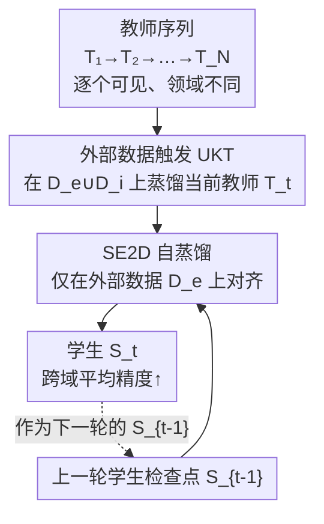

# Continual Distillation of Teachers from Different Domains

**会议**: CVPR 2026  
**arXiv**: [2605.04059](https://arxiv.org/abs/2605.04059)  
**代码**: https://github.com/Nicolas1203/continual_distillation (有)  
**领域**: 模型压缩 / 知识蒸馏 / 持续学习  
**关键词**: 持续蒸馏, 知识蒸馏, 外部数据, 未见知识遗忘, 基础模型

## 一句话总结
论文提出"持续蒸馏 (Continual Distillation, CD)"新范式——一个学生从**一串先后到来、彼此领域不同且互相不可见**的教师里顺序蒸馏，并发现用教师没训过的"外部数据"蒸馏能搬来未见域知识 (UKT)、但序列推进会把这些知识忘掉 (UKF)，进而用 SE2D（把自蒸馏限制在外部数据上）来缓解遗忘，在多个基准上提升跨域平均精度。

## 研究背景与动机
**领域现状**：知识蒸馏 (KD) 让小学生模仿大教师，是模型压缩与迁移的基石；持续学习 (CL) 则研究模型在"数据不断到来、旧数据不可访问"下如何不遗忘。两者都默认**变的是数据**。

**现有痛点**：基础模型 (FM) 时代，真正不断更新、且难以长期保存的是**模型本身**。10B 参数约需 38GB，FM 常超 100B；旧版本经 API 更新后往往不再可访问；而教师的原始训练数据通常不公开、保密或大到无法复用。于是"拿历史教师再蒸馏"这件事在现实中根本做不到。

**核心矛盾**：当教师像数据流一样源源不断到来、且彼此擅长的领域不同（一个擅长动物、一个擅长昆虫），又互不可见时，学生既要从当前教师学到新本事，又要保住之前教师传过来的本事——这是一个被忽视的"模型流"版持续学习问题，标准 KD 与标准 CL 都没覆盖。

**本文目标**：把问题拆成两步——(1) 在没有教师训练数据、没有标签、教师又只能一个个看的约束下，怎么把每个教师**各自独有领域**的知识尽量搬到学生身上；(2) 怎么在后续教师覆盖时，不让先前搬来的知识被冲掉。

**切入角度**：作者观察到蒸馏数据可拆成两类——所有教师都见过的**内部数据 (Internal Data, ID, $\mathcal{D}_i$)**，和所有教师都没见过的**外部数据 (External Data, ED, $\mathcal{D}_e$)**。反直觉地，正是"教师没见过的数据"在蒸馏时能逼出教师对其他域的泛化知识。

**核心 idea**：把持续学习的"自蒸馏正则"搬过来，但**只在外部数据上**让学生向自己上一轮的检查点对齐，从而专门保住那些靠外部数据才搬过来、又最易丢失的未见域知识。

## 方法详解

### 整体框架
持续蒸馏的设定是：给定一串教师 $\{\mathcal{T}_0,\mathcal{T}_1,\dots,\mathcal{T}_N\}$，每个 $\mathcal{T}_t$ 训练于数据集 $\mathcal{D}_t^{\mathcal{T}}$，且任意两个教师只在一个共享领域 $\mathcal{D}_i$ 上重叠（$\mathcal{D}_t^{\mathcal{T}}\cap\mathcal{D}_{t'}^{\mathcal{T}}=\mathcal{D}_i$），其余各有独有领域。学生 $\mathcal{S}$ 在**一个固定的、无标签的蒸馏集** $\mathcal{D}^{\mathcal{S}}=\mathcal{D}_e\cup\mathcal{D}_i$ 上，逐个向当前教师做 logits 蒸馏；蒸馏第 $t$ 个教师时，其余教师都不可见。目标是让学生在**至少被某个教师掌握过的所有领域**上都表现好，哪怕学生自己从没"见过"那个领域的标注数据。

整条管线先用"外部数据触发 UKT"把当前教师的未见域知识搬进来，再用"SE2D 自蒸馏"对上一轮学生检查点做约束、把已搬来的未见知识保住，最后输出能跨域泛化的学生。

### 关键设计

**1. 持续蒸馏范式：从"数据流"转向"模型流"的持续学习**

现实里真正不断更新、又难存难访的是基础模型而非数据，可没有任何工作把"一串先后到来、互不可见的教师"当作持续学习对象。作者据此定义持续蒸馏：固定一份蒸馏数据，让单个学生顺序地从教师序列中蒸馏，蒸馏某教师时其余教师不可访问——这与领域增量学习 (DIL) 同构，只不过把"每个任务是一批新数据"换成了"每个任务是一个新教师"。形式上记 $\mathbb{D}_{\mathcal{S}}(\mathcal{T}_t,\mathcal{D}^{\mathcal{S}})$ 为"用蒸馏集 $\mathcal{D}^{\mathcal{S}}$ 把教师 $\mathcal{T}_t$ 蒸进学生"。它有效是因为它精确刻画了 FM 时代的真实约束（教师数据不可得、旧教师 API 失效、模型大到难存），把一个被忽视但普遍存在的工程难题变成了可研究、可度量的学习问题

**2. 外部数据触发 UKT：用教师"没训过"的数据反而搬来未见域知识**

标准 KD 默认拿教师的训练域数据来蒸馏，可这里教师训练数据根本拿不到。作者把蒸馏集拆成内部数据 $\mathcal{D}_i$（所有教师都见过）和外部数据 $\mathcal{D}_e$（对任意教师 $t$ 有 $\mathcal{D}_e\cap\mathcal{D}_t=\varnothing$），并发现：只在 $\mathcal{D}_i$ 上蒸馏时学生只会做那一个共享域；而把 $\mathcal{D}_e$ 也喂进去，学生竟能在自己从没"见过"、但教师掌握的其他域上取得高分——作者称此为**未见知识转移 (Unseen Knowledge Transfer, UKT)**。直觉是：面对外部数据，教师不确定时会吐出"通用"软标签、确定时会吐出"特定"软标签，这些软标签把教师跨域的判别结构泄露给了学生。实验进一步显示外部占比 $|\mathcal{D}_e|/|\mathcal{D}^{\mathcal{S}}|$ 越大、未见域分数越高，说明 UKT 强度可被外部数据比例直接调节

**3. UKF：序列蒸馏会把已搬来的未见知识冲掉**

UKT 搬来的知识很脆弱：学生顺序学到后续教师时，会把先前教师靠外部数据传过来的未见域知识丢失，作者称为**未见知识遗忘 (Unseen Knowledge Forgetting, UKF)**。它和 DIL 里经典的灾难性遗忘有本质区别——被忘掉的知识**不是来自学生自己的训练数据**，而是来自教师、学生从未直接接触过，所以遗忘发生在"看不见的维度"上更难察觉。实验证实主流蒸馏方法（KL、DKD、LS、MDS）都只顾最大化当前转移、几乎不管 UKF：例如 Digits 上 DKD 的 MNIST-M 精度从 $54.50\%$ 掉到 $33.84\%$。把 UKF 识别出来并作为 CD 的核心矛盾，是后续方法设计的靶子——CD 的本质就变成求 **UKT 与 UKF 的最优权衡**（类似 CL 里的稳定性—可塑性权衡）

**4. SE2D：把自蒸馏限制在外部数据上，专保最易丢的未见知识**

针对 UKF，作者提出 **Self External Data Distillation (SE2D)**：在每个蒸馏步 $t$，学生 $\mathcal{S}_t$ 不只向当前教师 $\mathcal{T}_t$ 学，也向自己上一轮的检查点 $\mathcal{S}_{t-1}$ 学；关键是**向检查点的自蒸馏只在外部数据 $\mathcal{D}_e$ 上做**：

$$\mathcal{L}_{\text{SE2D}}=\mathcal{L}_{\text{KD}}(\mathcal{S}_t,\mathcal{T}_t;\mathcal{D}^{\mathcal{S}})+\mathcal{L}_{\text{KD}}(\mathcal{S}_t,\mathcal{S}_{t-1};\mathcal{D}_e).$$

为什么偏偏锁定 $\mathcal{D}_e$？因为先前观察表明"未见域表现"几乎全靠外部样本撑着；若把自蒸馏也放到 $\mathcal{D}_i$ 上，只会强化本就稳固的共享域知识，对真正脆弱的未见知识毫无帮助。换言之，SE2D 把"保旧"的正则精准投放到知识最易流失的地方，从而在不牺牲 UKT 的前提下压住 UKF——这是它相比"内外数据都自蒸馏"的标准 Self-Distillation 的核心区别

### 损失函数 / 训练策略
蒸馏项 $\mathcal{L}_{\text{KD}}$ 为温度缩放的 KL 散度：

$$\mathcal{L}_{\text{KD}}(\mathcal{S},\mathcal{T};\mathcal{D}^{\mathcal{S}})=T^2\,\mathbb{E}_{x\sim\mathcal{D}^{\mathcal{S}}}\Big[\text{KL}\big(\sigma(\tfrac{z_{\mathcal{T}}(x)}{T})\,\big\|\,\sigma(\tfrac{z_{\mathcal{S}}(x)}{T})\big)\Big],$$

其中 $T$ 为蒸馏温度、$\sigma(\cdot)$ 为 softmax、$z(\cdot)$ 为 logits。全程**只用蒸馏、无任何依赖标签的损失**，且只用 logits（不蒸中间表征，因为表征依赖架构、计算重、还需访问整个教师）。SE2D 仅在 $\mathcal{L}_{\text{KD}}$ 基础上加一项"对上一轮自检查点、仅在 $\mathcal{D}_e$ 上"的自蒸馏，实现简单、无需回放缓冲、不存历史教师。

## 实验关键数据

设置：用领域增量数据集模拟 CD——CIFAR20（CIFAR-100 的 20 超类，每超类下不同子类构成不同域）、Digits（MNIST/MNIST-M/USPS/SVHN 混合，KMNIST 作相关外部域）、DomainNet（6 个风格域，345 类共享）。教师两两共享域 0、各自独有一个域；学生只在固定无标签蒸馏集上蒸馏。报告**学生在所有教师掌握域上的精度**（3 次运行）。

### 主实验
CIFAR20 + 相关外部数据 (D4)，序列末学生精度（%）：

| 方法 | D0(ID) | D1 | Avg(0-3) | Gain↑ |
|------|--------|------|----------|-------|
| KL-divergence | 97.05 | 48.55 | 71.36 | +9.42 |
| DKD [CVPR'22] | 96.05 | 44.13 | 65.10 | +10.68 |
| LS [CVPR'24] | 96.85 | 47.25 | 70.39 | +11.64 |
| MDS [ICLR'25] | 96.55 | 45.26 | 67.56 | +14.01 |
| Self-Distillation | 97.71 | 61.23 | 74.93 | +17.11 |
| **SE2D (ours)** | 97.46 | **70.71** | **76.17** | n/a |

关键看 D1（最早被覆盖、最易遗忘的域）：SE2D 拿 $70.71\%$，比 Self-Distillation 的 $61.23\%$ 高出 $9$ 个点以上，比纯 KL 的 $48.55\%$ 高 $22$ 点；同时 Avg(0-3) 也最高，说明保旧没有牺牲整体。Digits + KMNIST 上 SE2D 平均 $87.00\%$ > Self-Distillation $85.58\%$（SVHN 上 $61.84\%$ vs $55.86\%$）。

### 消融 / 分析实验
外部数据"来源/相关性"对 KL-divergence 在 CIFAR20 上 Avg(0-3) 的影响：

| 外部数据 | KL-div Avg(0-3) | 说明 |
|----------|-----------------|------|
| 仅内部数据 (D0) | 61.94 | 不用 ED，UKT 几乎为零 |
| + D4（相关） | 71.36 | 相关 ED 触发强 UKT，+9.4 |
| + CUB（鸟类，较相关） | 67.02 | 域差变大，增益缩水 |
| + MNIST（无关） | 59.78 | 域差过大，反而**低于**不用 ED |

跨数据集 SE2D vs Self-Distillation（相关 ED，Avg）：

| 数据集 | Self-Dist | SE2D | 结论 |
|--------|-----------|------|------|
| CIFAR20 + D4 | 74.93 | **76.17** | SE2D 胜 |
| Digits + KMNIST | 85.58 | **87.00** | SE2D 胜 |
| DomainNet + Sketch | **48.76** | 48.01 | SE2D 反落后 |

### 关键发现
- **外部数据是 UKT 的开关，且比例越大转移越强**：Table 1 中外部占比从 0% 提到 33%/50%/66%，未见域分数单调上升；只在内部域蒸馏的学生几乎只会那一个域。
- **外部数据来源决定成败**：与内部域足够相关时（D4、CUB）一致涨点，域差过大（MNIST）时 ED 反而拖累，甚至不如不用——UKT 不是免费午餐。
- **SE2D 的边界很诚实**：当教师质量低、或外部域与教师域差距大时（DomainNet），ED 上的监督信号太差，SE2D 退化到不如 Self-Distillation；作者把这归因于"教师在 ED 上给的监督太弱"。

## 亮点与洞察
- **把"模型流"正式当作持续学习对象**：从"数据不断变"切到"教师不断变"，精准命中 FM 时代"模型难存、旧版失效、训练数据不公开"的真实痛点，这个范式切换本身就很有启发。
- **反直觉的 UKT**：用教师**没训过**的数据蒸馏，反而能搬来教师对**其他域**的判别知识——这把"数据无关蒸馏里意外混入的外部数据"从 bug 变成了 feature。
- **正则的"精准投放"思路可迁移**：SE2D 的核心不是"加自蒸馏"，而是"只在知识最易流失的子集（外部数据）上加自蒸馏"。这种"先定位脆弱知识、再把正则只打在那里"的做法，可推广到其他存在异质教师/异质数据的蒸馏与持续学习场景。
- **UKF 这个新现象有独立价值**：它指出遗忘可以发生在"学生从未直接见过"的维度上，是被传统遗忘度量漏掉的一类风险。

## 局限与展望
- **依赖外部数据与教师质量**：SE2D 的收益强烈依赖 (1) 教师域与外部数据的域差要够小、(2) 教师在学生未见域上本身够强；两者不满足时（如 DomainNet）SE2D 反不如简单自蒸馏。
- **需要"数据来源先验"**：SE2D 要求能区分哪些样本属于教师已知/未知域，但当数据是生成出来模仿训练集时，判断样本是否落在教师域外非常困难——作者承认这点在实践中不平凡。
- **规模与模态受限**：实验都是中小图像分类骨干，论文也坦承未来应扩到语言/多模态大模型，CD 在真·FM 上是否成立仍待验证。
- **安全风险**：UKT 既是机会也是隐患——蒸馏数据若被恶意选取，可能把不期望/有偏的知识悄悄注入学生，作者把这列为待研究的攻击面。

## 相关工作与启发
- **vs 标准知识蒸馏 (KD)**：标准 KD 假设师生同数据、教师常驻可访问；本文是无标签、教师序列化只可见一个、且蒸馏数据故意含教师未见域，目标从"复现教师域"变成"跨多个异质教师的知识累积与保持"。
- **vs 多教师蒸馏**：传统多教师方法假设所有教师**同时可访问**；本文是**顺序**访问、一次只见一个，且不存历史教师。
- **vs 持续学习 (CL/DIL)**：CL 研究数据流下的遗忘，本文把"流"换成教师、把"数据固定"作为前提，遗忘对象从"自己学过的数据"变成"教师传过来但自己没直接见过的未见知识 (UKF)"。
- **vs Self-Distillation（CL 常用基线）**：标准自蒸馏在内外数据上都向旧检查点对齐；SE2D 只在外部数据上对齐，从而把正则集中到最易流失的未见知识上，在 CIFAR20/Digits 上稳定超过它。

## 评分
- 新颖性: ⭐⭐⭐⭐⭐ 提出"模型流持续学习"新范式，并识别 UKT/UKF 两个未被研究的现象
- 实验充分度: ⭐⭐⭐⭐ 覆盖 3 类数据集、5 个基线、相关/无关 ED 与外部比例消融；但仅限中小图像骨干，未及大模型
- 写作质量: ⭐⭐⭐⭐ 概念定义清晰、问题动机层层递进，对自身方法失效场景诚实交代
- 价值: ⭐⭐⭐⭐ 切中 FM 时代"教师难存难访"的真实需求，SE2D 实现简单可复现，范式有延展空间

<!-- RELATED:START -->

## 相关论文

- [\[CVPR 2026\] Bridging Domains through Subspace-Aware Model Merging](bridging_domains_through_subspace-aware_model_merging.md)
- [\[ICML 2026\] Toward Understanding Adversarial Distillation: Why Robust Teachers Fail](../../ICML2026/model_compression/toward_understanding_adversarial_distillation_why_robust_teachers_fail.md)
- [\[ACL 2025\] Who Taught You That? Tracing Teachers in Model Distillation](../../ACL2025/model_compression/who_taught_you_that_tracing_teachers_in_model_distillation.md)
- [\[CVPR 2026\] Cross-Architecture Adaptation: Cloud-Edge Continual Test-Time Adaptation with Dynamic Sampling and Heterogeneous Distillation](cross-architecture_adaptation_cloud-edge_continual_test-time_adaptation_with_dyn.md)
- [\[CVPR 2026\] Elastic Weight Consolidation Done Right for Continual Learning](elastic_weight_consolidation_done_right_for_continual_learning.md)

<!-- RELATED:END -->
