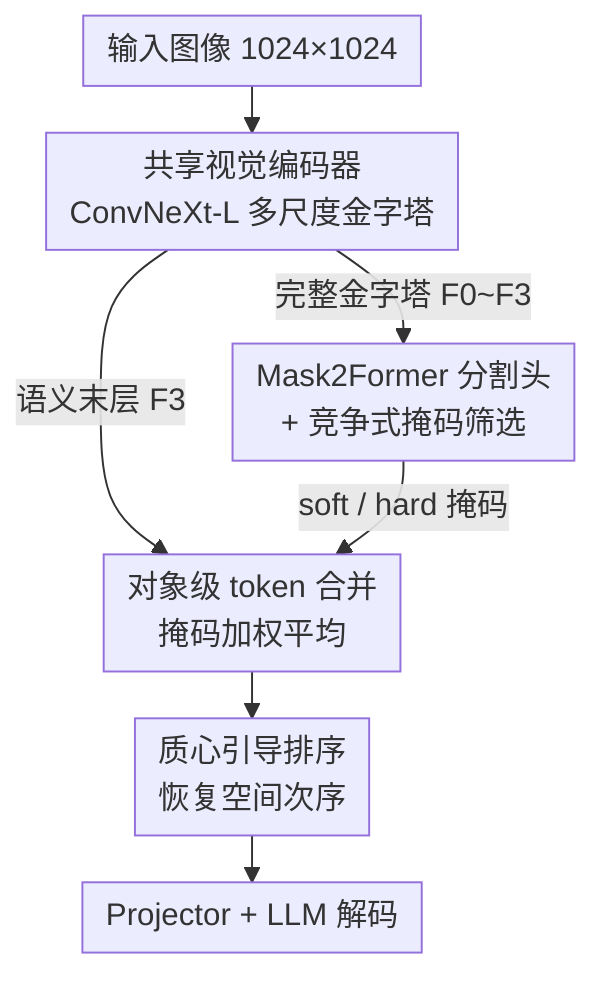

# CORE: Compact Object-centric REpresentations as a New Paradigm for Token Merging in LVLMs

**会议**: CVPR 2026  
**论文**: [CVF Open Access](https://openaccess.thecvf.com/content/CVPR2026/html/Lei_CORE_Compact_Object-centric_REpresentations_as_a_New_Paradigm_for_Token_CVPR_2026_paper.html)  
**代码**: https://github.com/jingyulei/CORE  
**领域**: 模型压缩  
**关键词**: 视觉token压缩, 对象中心表示, LVLM加速, token合并, 质心排序  

## 一句话总结
CORE 把 LVLM 的视觉 token 压缩从"按特征相似度逐个合并"换成"按物体合并"——用一个内置分割头给每个物体生成掩码，再把同一物体内的 token 加权平均成一个紧凑 token，配合质心排序保留空间次序；在六个基准上拿到固定率压缩 SOTA，极端压缩下仅保留 2.2% token 仍能维持基线 97.4% 性能。

## 研究背景与动机
**领域现状**：大视觉语言模型（LVLM）把图像切成 patch 送进 ViT，token 数随分辨率平方增长（1024×1024 图配 16×16 patch 就是 4096 个 token）。由于自注意力是 $O(N^2)$ 复杂度，下游 LLM 的算力和显存开销变得难以承受，于是出现了大量视觉 token 压缩方法。

**现有痛点**：作者把已有方法统称为 **token-centric（以单个 token 为中心）**，并指出它们都缺一个"高层语义视角"：① 相似度类（如 ToMe）按特征亲和度合并，会把纹理相近但语义不同的区域错误合并，还会引发"边界溢出"（物体边缘和背景混到一起）；② 注意力类靠注意力分数保留 token，但保留下来的 token 之间仍可能彼此冗余，而且 decoder 侧剪枝需要访问 FlashAttention 根本不显式计算的注意力分数；③ query 类用文本 query 过滤 token，虽相关却会丢掉完整场景上下文，遇到模糊 query 就失灵。

**核心矛盾**：压缩决策发生在"像素/patch 级别"，而真正承载语义的单位是"物体"。在错误的粒度上做合并，要么误并不同物体，要么在同一物体内留下一堆冗余 token，精度与压缩率难以兼顾。

**本文目标**：找到一个既能大幅减 token、又不破坏语义和空间结构的压缩粒度。

**切入角度**：模仿人类感知——人看图是"以物体为单位"理解场景的。如果能让每个物体坍缩成一个紧凑 token，既消除了物体内冗余，又天然避免了跨物体误并。

**核心 idea**：用一个内置分割先验把图像分解成物体掩码，**以物体为单位**做 token 合并（object-centric token merging），再用质心排序恢复空间顺序——用"语义身份"代替"特征相似度"作为合并准则。

## 方法详解

### 整体框架
CORE 是一个端到端架构，整体沿用 LLaVA-NeXT 的范式，但把视觉侧改造成"一个共享编码器 + 一个分割头 + 一个语言头"。一张图进来后：共享的 ConvNeXt-L 编码器抽出多尺度特征金字塔；完整金字塔喂给 Mask2Former 分割头生成物体掩码，而语义最丰富的最末层特征 $F_3$ 留作语言侧的视觉输入；掩码经过竞争式筛选后，引导对 $F_3$ 做逐物体合并，得到一组对象中心 token；这些 token 按质心做空间排序，过 projector 后送进 LLM 自回归生成回答。关键巧思是**视觉编码器被两条路径共享**，分割带来的额外开销因此被压到很低。

### 关键设计

**1. 共享视觉编码器的端到端架构：让分割几乎不额外花钱**

如果按朴素思路，"先分割再压缩"需要一个独立的分割主干，等于在 LVLM 上再挂一个重模型，得不偿失。CORE 的做法是用**一个 ConvNeXt-L 同时服务分割和语言两条异构任务**。这里有个被忽视的工程冲突：原版 LLaVA-NeXT 用 CLIP ViT-L/14，它输出的是单尺度特征图，而 Mask2Former 需要多尺度金字塔。CORE 把 ViT 换成 OpenCLIP 的 ConvNeXt-L——作为层级化 CNN，它天生输出 $F_0,\dots,F_3$（1/4 到 1/32 分辨率，通道数 192/384/768/1536）的金字塔，且是在 CLIP 对比目标下预训练的，输出特征本就和文本嵌入空间对齐，能无缝接进 LLaVA-NeXT。完整金字塔走分割头，$F_3$ 走语言侧。效率分析印证了这一点：CORE 整个视觉模块（ConvNeXt 主干 1.44T + Mask2Former 头 0.30T = 1.74T FLOPs）反而比 LLaVA-NeXT 原来的 CLIP ViT-L/14（1.91T）更省，参数也从 303M 降到 237M——多了个分割头却没变贵。

**2. 对象级 token 合并 + 竞争式掩码筛选：把"一个物体"坍缩成"一个 token"**

这是 CORE 的核心。Mask2Former 用 $N$ 个可学习 object query 在 $L=9$ 层 Transformer decoder 里各自锁定一个物体，sigmoid 后输出概率掩码。这里 CORE 不用常规的置信度阈值 + NMS，而是用一种**逐像素竞争策略**：对每个像素位置，找出概率最高的那个掩码；只有"至少在一个像素上取得最高概率"的 query 才被保留为有效掩码。这样过滤出两种输出——① 一组有重叠的 soft 掩码（保留原始概率），② 一组互斥的 hard 掩码（每个像素硬分配给最高概率的那个 query）。

拿到有效掩码集 $\mathcal{P}_{\text{valid}}=\{P_1,\dots,P_N\}$ 后，把语义末层 $F_3$ 展平成 $F\in\mathbb{R}^{HW\times C}$，每个 token 为 $f_i\in\mathbb{R}^C$。对每个掩码 $P_n$，把它展平成权重向量 $\omega_n\in\mathbb{R}^{HW}$，然后在整张特征图上做**加权平均**得到该物体的单一 token：

$$t_n=\frac{\sum_{i=1}^{HW}\omega_{n,i}\cdot f_i}{\sum_{i=1}^{HW}\omega_{n,i}}$$

soft 掩码下 $\omega_{n,i}\in[0,1]$ 是概率，能温和处理模糊边界和物体重叠；hard 掩码下 $\omega_{n,i}\in\{0,1\}$，合并退化为被选特征的算术平均，得到边界清晰、互斥的"一物一 token"映射。为什么有效：合并准则从"脆弱的特征亲和度"换成了"鲁棒的语义身份"，既杜绝了纹理相近物体被误并（ToMe 的边界溢出），又消除了注意力类方法里物体内部的冗余。实验里 hard 掩码稳定优于 soft——因为 soft 掩码可能让同一只猫头鹰同时落在第 14、18 号掩码里造成重复，而 hard 掩码的互斥性强制了"一物一 token"，避免计数和空间关系任务上的混淆。

**3. 质心引导排序：合并后别把空间次序弄丢**

把物体合并成离散 token 后，token 序列里的"先后"不再对应图像里的空间位置——可 LLM 是按序列处理的，丢掉位置信息会损害空间推理。CORE 的解法是给每个掩码算一个**质心位置**，再按质心升序排列 token：

$$c_n=\frac{\sum_{i=1}^{HW}\omega_{n,i}\cdot i}{\sum_{i=1}^{HW}\omega_{n,i}}$$

其中 $i$ 是按光栅扫描顺序（从上到下、从左到右）编号的 token 下标，所以 $c_n$ 本质是该物体所有像素位置的加权平均，即"物体在扫描序里的重心"。把合并后的 token 集 $T'$ 按 $\{c_1,\dots,c_N\}$ 升序排，就得到一个空间次序连贯的最终表示 $T$ 再送进 projector。一句话：合并破坏了顺序，质心排序把它补回来。

**4. 固定率合并策略：按物体面积排序实现定长输出**

前面三步产出的 token 数随图像内物体数变化（自适应率）。但某些场景需要**固定 token 数**——便于批处理、也便于和其他方法公平对比。CORE 基于 hard 掩码设计了固定率策略：假设 token 多（面积大）的物体信息冗余更高，于是**按物体面积降序**（面积由掩码内 token 数衡量）优先合并大物体，每个物体内部再按光栅扫描顺序合并，直到达到目标 token 数。这让 CORE 能在 160/320/640 等固定预算下和 ToMe、VisionZip、DivPrune 等同台竞技。

### 损失函数 / 训练策略
训练沿用 LLaVA 的两阶段范式，且**视觉感知模块（ConvNeXt-L + Mask2Former）全程冻结**，用 OMG-Seg 预训练权重初始化。阶段一（特征对齐预训练）：主干、分割头、LLM 全冻结，只训 projector，用 LLaVA 558K 图文对、标准自回归损失 $\mathcal{L}_{\text{text}}$。阶段二（视觉指令微调）：在 projector 之外用 LoRA（$r=512$、$\alpha=256$、dropout 0.05）微调 LLM，损失仍是 $\mathcal{L}_{\text{text}}$，数据换成 LLaVA-NeXT 高质量指令对话。语言解码器用 InternLM2-7B，projector 是两层 GELU MLP（1536→4096）。视觉模块训练用 FP32、推理切 FP16。

## 实验关键数据

### 主实验
固定率压缩，六个基准（POPE / MME / MMBench-CN / ScienceQA-IMG / SEED-IMG / MMMU），基线为全 token CORE（ConvNeXt-L 主干，1024 token，作为 100%）。下表节选 640、160 两档与代表性方法对比：

| 方法 | tokens | POPE | MME | MMB-CN | SQA-I | SEED-I | MMMU |
|------|--------|------|-----|--------|-------|--------|------|
| LLaVA-NeXT-7B | 2880 | 86.8 | 1511.8 | 57.3 | 67.5 | 70.2 | 35.1 |
| CORE (vanilla) | 1024 | 86.4 | 1626.7 | 61.0 | 68.3 | 69.6 | 36.8 |
| VisionZip | 640 | 86.0 | 1493.4 | 58.1 | 68.1 | 66.7 | 34.7 |
| DivPrune | 640 | 86.9 | 1469.7 | 57.3 | 67.8 | 67.6 | 36.9 |
| **CORE** | 640 | **86.9** | **1521.6** | **60.0** | **69.2** | 67.6 | **38.3** |
| VisionZip | 160 | 74.9 | 1327.8 | 50.4 | 67.9 | 58.3 | 36.1 |
| DivPrune | 160 | 80.0 | 1356.6 | 53.7 | 67.1 | 62.5 | 36.4 |
| **CORE** | 160 | **86.0** | **1405.3** | **56.7** | **69.8** | **64.7** | **36.6** |

token 越少，CORE 的优势越夸张：在 160 token 档，POPE 上 CORE 86.0 而 VisionZip 仅 74.9。值得注意的是 ScienceQA-IMG 上 640/320/160 各档 CORE 都超过了全 token 基线（69.2/69.4/69.8 vs 68.3），作者归因于对象中心合并的"正则化效应"——强迫模型聚焦语义连贯的物体表示，抑制了对训练噪声的过拟合。

### 加速 / 效率
固定率任务上，跑完整个 POPE 数据集的总推理时间（单张 A800）：

| 方法 | tokens | 总时间 ↓ | 加速 ↑ | POPE 分数 ↑ |
|------|--------|---------|--------|------------|
| LLaVA-NeXT-7B | 2880 | 2293s | – | 86.8 |
| FastV | 160 | 1792s | 1.28× | 66.5 |
| SparseVLM | 160 | 1895s | 1.21× | 76.6 |
| **CORE** | 160 | **1122s** | **2.04×** | **86.0** |

自适应压缩下（POPE 上平均 token 从 2880 降到 63.1）效率收益更剧烈：

| 配置 | tokens | FLOPs ↓ | KV Cache ↓ | GPU 显存 ↓ | POPE ↑ |
|------|--------|---------|-----------|-----------|--------|
| LLaVA-NeXT-7B | 2880 | 41.7T | 1440.0MB | 16.7GB | 86.8 |
| CORE-FP16 | 63.1 | 2.6T | 7.9MB | 15.1GB | 85.9 |
| CORE-4bit | 63.1 | 2.6T | 7.9MB | **5.5GB** | 85.6 |

FLOPs 降到 1/16（41.7T→2.6T）、KV Cache 降到约 1/182（1440MB→7.9MB）。由于 7B 权重本身占约 14GB 固定开销，FP16 下总显存降幅有限，所以再叠 4-bit 量化把显存砍掉三分之一以上（15.1→5.5GB），性能仅微跌（85.9→85.6）。

### 消融 / 分析
**soft vs hard 掩码**（动态自适应任务，对比其他对象中心 VLM 如 Slot-MLLM）：

| 方法 | POPE | MME | MMB-CN | SQA-I | SEED-I | MMMU |
|------|------|-----|--------|-------|--------|------|
| Slot-MLLM | 79.8 | 1202.6 | – | – | 47.4 | 28.0 |
| CORE (soft mask) | 83.6 | 1339.1 | 53.6 | 69.0 | 60.3 | 37.0 |
| **CORE (hard mask)** | **85.6** | **1396.7** | **55.3** | **69.9** | **63.1** | **38.7** |

### 关键发现
- **hard 掩码全面优于 soft 掩码**：根因是 soft 掩码的重叠会让同一物体被多个掩码重复表示（如同一只猫头鹰落在第 14 和 18 号掩码），给 LLM 引入歧义，伤害计数和空间关系任务；hard 掩码互斥，强制"一物一 token"。
- **对象中心合并自带正则化**：多个数据集上压缩后的 CORE 反超全 token 基线（尤其 ScienceQA-IMG），说明聚焦语义连贯物体能抑制过拟合。
- **极端压缩下鲁棒**：自适应模式在 30000+ 图的所有基准上最大 token 数都 <180；保留约 2.2% token 仍维持基线 97.4% 性能。
- **OOD / 遮挡的保守退化**：分割头只认 133 类，遇到未知物体（如神话生物）或遮挡时，CORE 倾向于"分成几部分、多保留 token"而非错误合并，以牺牲少量效率换取信息完整性。

## 亮点与洞察
- **把压缩粒度从 patch 提到 object**，是这篇论文最"啊哈"的地方：它不是又一个相似度/注意力打分技巧，而是换了合并的基本单位，直接绕开了"语义盲"这个 token-centric 方法的通病。
- **共享编码器是省钱的关键工程决策**：用同一个 ConvNeXt-L 喂分割和语言两条路，让"先分割再压缩"这件本来很贵的事变得几乎免费（视觉模块 FLOPs 反而比原 ViT 低）。这个"一主干两异构头"的思路可迁移到任何需要辅助先验（深度、法线、关键点）来指导 token 选择的场景。
- **质心排序**是个小而美的设计：合并破坏空间次序、再用加权重心补回顺序，几乎零成本就保住了空间推理能力，可直接复用到其他无序 token 集的序列化。
- **竞争式掩码筛选**用"每像素取最高概率 query"替代阈值+NMS，天然产出 soft/hard 两套掩码，比手调阈值更省心。

## 局限与展望
- **作者承认**：CORE 虽大幅降低理论 FLOPs，但视觉模块内复杂的计算流和数据调度造成了**内存带宽瓶颈**，导致实际推理速度没能完全兑现理论优势；未来打算用算子融合、定制 CUDA kernel、I/O 感知调度等系统级优化来释放性能。
- **分割头是天花板也是软肋**：Mask2Former 只认 133 个预定义类别，超出范围的物体只能"拆成已知部件"近似处理（⚠️ 这种 OOD 退化在开放世界场景下的可靠性，论文只给了定性例子，缺乏定量评估）。换更强的开放词表分割器可能进一步提升上限。
- **依赖冻结的预训练分割权重**（OMG-Seg），分割质量直接决定合并质量；分割错误会级联进 LLM，论文未充分分析这类误差传播。
- 自适应模式 token 数随场景波动，对需要严格定长输入的批处理流水线不友好——固定率策略虽能补位，但"大物体优先合并"假设（大物体冗余更高）在密集小物体场景下是否成立，值得进一步验证。

## 相关工作与启发
- **vs ToMe（相似度类）**：ToMe 用二部软匹配按特征相似度逐层合并 token，语义盲、易把纹理相近的不同物体误并并引发边界溢出；CORE 用分割掩码作语义先验，按物体身份合并，可视化对比里能在昏暗/同类多物体场景下稳定区分。
- **vs VisionZip / FastV（注意力类）**：它们靠注意力分数留 token，保留的 token 之间仍可能冗余，且 decoder 侧剪枝依赖 FlashAttention 不显式算的注意力；CORE 的物体级合并天然消除物体内冗余，且不碰注意力分数。
- **vs CDPruner / MMTok（query 类）**：用文本 query 过滤 token 会丢完整场景上下文、遇模糊 query 失灵；CORE 不绑定 query，保留全场景的紧凑对象表示，对多轮对话更鲁棒。
- **vs Slot-MLLM（对象中心同类）**：同样走对象中心路线但用 Slot Attention，CORE 的 hard 掩码变体在 POPE/MME/SEED 等基准上全面领先（如 POPE 85.6 vs 79.8）。

## 评分
- 新颖性: ⭐⭐⭐⭐⭐ 把视觉 token 压缩的粒度从 patch 提升到 object，是范式级的视角转换而非增量技巧
- 实验充分度: ⭐⭐⭐⭐⭐ 六基准 × 多压缩率 + 固定/自适应两套 + 效率/显存/KV Cache + soft/hard 消融 + OOD 分析，覆盖全面
- 写作质量: ⭐⭐⭐⭐ 动机和方法叙述清晰，公式与可视化到位；部分关键算法（固定率伪码）放在补充材料略影响自洽
- 价值: ⭐⭐⭐⭐⭐ 极端压缩下 2.2% token 保 97.4% 性能、KV Cache 降 182×，对 LVLM 落地部署价值很高

<!-- RELATED:START -->

## 相关论文

- [\[CVPR 2026\] Co-Me: Confidence Guided Token Merging for Visual Geometric Transformers](co-me_confidence_guided_token_merging_for_visual_geometric_transformers.md)
- [\[CVPR 2026\] Saliency-Driven Token Merging for Vision Transformers](saliency-driven_token_merging_for_vision_transformers.md)
- [\[CVPR 2026\] One Layer's Trash is Another Layer's Treasure: Adaptive Layer-wise Visual Token Selection in LVLMs](one_layers_trash_is_another_layers_treasure_adaptive_layer-wise_visual_token_sel.md)
- [\[ACL 2025\] Compact and Compressible Representations for LLMs Using Structured Sparse Decomposition](../../ACL2025/model_compression/compact_and_compressible_representations_for_llms_using_structured_sparse_decom.md)
- [\[CVPR 2026\] MeToM: Metadata-Guided Token Merging for Efficient Video LLMs](metom_metadata-guided_token_merging_for_efficient_video_llms.md)

<!-- RELATED:END -->
