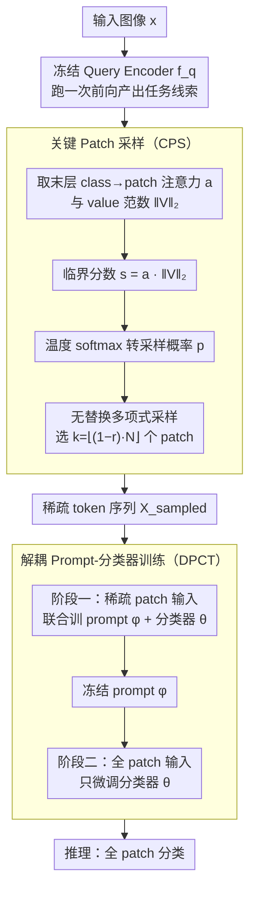

# Critical Patch-Aware Sparse Prompting with Decoupled Training for Continual Learning on the Edge

**会议**: CVPR 2026  
**arXiv**: [2604.07399](https://arxiv.org/abs/2604.07399)  
**代码**: [https://github.com/laymond1/cps-prompt](https://github.com/laymond1/cps-prompt)  
**领域**: 模型压缩 / 持续学习  
**关键词**: 持续学习, 边缘设备, Prompt-based CL, Token Reduction, 训练效率

## 一句话总结
提出 CPS-Prompt 框架，通过任务感知的关键 patch 采样（CPS）和解耦 prompt-分类器训练（DPCT）两个模块，在边缘设备上实现 Prompt-based 持续学习的训练时内存和计算效率提升约 1.6 倍，同时准确率仅下降约 2%。

## 研究背景与动机

**领域现状**：持续学习（CL）在边缘设备（家用机器人、无人机、手机）上需要在有限内存和算力下不断适应新任务。Prompt-based 持续学习（PCL）通过冻结 ViT 骨干+轻量可学习 prompt 实现参数高效学习，但既有工作主要关注精度和推理效率。

**现有痛点**：PCL 方法如 C-Prompt 虽然精度高，但训练时内存开销巨大（4.3× 于本文方法），不适合部署在内存受限的边缘设备上。OS-Prompt 虽然简化了两阶段流水线，但反向传播时峰值内存仍然很高。

**核心矛盾**：现有 token reduction 方法（ToMe、PatchDropout）在与 PCL 结合时会丢弃任务关键 patch，导致精度严重下降——因为它们是"任务无关"的。

**本文要解决**：如何在 PCL 的两阶段架构中实现训练时内存和计算的显著节省，同时保持竞争力的精度？

**切入角度**：利用冻结 query encoder 最后一层的注意力和 value 信号来估计 patch 重要性，做任务感知的稀疏化；再通过解耦训练消除稀疏训练与全 patch 推理之间的表征错位。

**核心 idea**：任务感知的 patch 采样 + 解耦的 prompt/分类器训练 = 训练高效 + 精度保持。

## 方法详解

### 整体框架
CPS-Prompt 要解决的核心问题，是让 Prompt-based 持续学习能跑在内存和算力都吃紧的边缘设备上，而不是只在数据中心刷精度。它沿用了 PCL 标准的两阶段架构：先用冻结的 query encoder $f_q$ 跑一次前向，从图像里提取出"任务线索"，再把这条线索注入到 prompt-injected backbone $f_p$ 里做分类。CPS-Prompt 的两个改动正好卡在这条流水线的两个关口上——在两阶段之间插入关键 patch 采样（CPS）模块，借第一次前向已经算好的注意力信号挑出真正关键的 patch，把进入第二阶段 backbone 的 token 砍掉一大半；再用解耦 prompt-分类器训练（DPCT）策略把 prompt 和分类器拆成两段训练，专门补偿"训练时只看稀疏 patch、推理时却看全 patch"带来的表征错位。前者省内存省算力，后者把省下来的精度找回来。

### 关键设计

**1. Critical Patch Sampling：用冻结 backbone 已有的注意力信号免训练地挑关键 patch**

直接把通用 token reduction（ToMe、PatchDropout）套到 PCL 上会出事——它们是"任务无关"的，砍 patch 时不知道哪些对当前任务的类别判别最关键，容易把任务相关区域误删，精度直线下降。CPS 的切入点是：PCL 本来就要让 query encoder 跑一次前向，那一层的注意力其实已经隐含了"哪些 patch 重要"的判断，白白浪费太可惜。具体地，从 query encoder 最后一层取出 class token 对每个 patch token 的注意力权重 $A^L_{\text{cls},j}$，再取该 patch 的 value 向量 L2 范数 $\|V^L_j\|_2$，两者相乘得到临界分数 $s_j = A^L_{\text{cls},j} \cdot \|V^L_j\|_2$——注意力反映这个 patch 对类别表征贡献多大，value 范数反映它的特征本身有多显著，乘起来才是"既被关注、信息又足"的综合重要性。分数不是直接 Top-k 截断，而是经温度缩放 softmax 转成采样概率

$$p_j = \frac{\exp(s_j/\tau)}{\sum_i \exp(s_i/\tau)}$$

再以无替换多项式采样选出 $k = \lfloor(1-r) \cdot N\rfloor$ 个 patch（$r$ 是削减率），每个 mini-batch 重新采一次。这里特意用带温度的多项式采样而不是直接取分数最高的 Top-k，是被消融验证过的选择：固定 Top-k 每轮只喂同一批"最高分" patch，相当于把模型锁死在一小撮区域上；带温度的随机采样让每轮见到的 patch 略有不同，这种受控随机性在训练中起到类似数据增强的探索作用，尤其在削减比例较大时对泛化到持续到来的新任务帮助明显。温度 $\tau$ 越小分布越尖锐越接近确定性，越大越偏向随机探索（实验中 $\tau=0.1$ 最佳）。整个打分过程都基于冻结 backbone，零额外训练、可无缝插进现有 PCL 流水线。

**2. Decoupled Prompt and Classifier Training：把 prompt 和分类器拆两段训，消除稀疏训练与全 patch 推理的错位**

CPS 省了内存，但留下一个隐患：训练时 prompt 只见过稀疏 patch，推理时却要面对全 patch，prompt 学到的表征和实际推理分布对不上，精度会被拖下来。DPCT 的办法是把总共 $E$ 个 epoch 切成两段：前 $\lfloor \lambda \cdot E \rfloor$ 个 epoch 用稀疏 patch 输入，联合优化 prompt $\phi$ 和分类器 $\theta$，目标是

$$\mathcal{L}_p = \mathcal{L}(f_p(\mathbf{X}_{\text{sampled}}; \theta, \phi), y)$$

剩下的 epoch 把 prompt 冻住，只用全 patch 输入单独微调分类器，目标是

$$\mathcal{L}_{\text{cls}} = \mathcal{L}(f_p(\mathbf{X}_{\text{full}}; \theta, \phi), y), \quad (\phi \text{ 已冻结})$$

第一段在稀疏输入下学高效的 prompt，第二段让分类器在真实的全 patch 分布上把表征重新对齐，正好把 CPS 引入的错位补回来。而且冻结 prompt 之后梯度不再回传到 prompt，第二段的反向传播也更省算力——精度和效率两头都照顾到。

### 损失函数 / 训练策略
- 使用标准交叉熵损失
- Prompt 阶段和分类器阶段各用 Adam 优化器
- 学习率 cosine decay，起始 0.001
- 最优超参：patch 削减率 $r=0.4$，温度 $\tau=0.1$

## 实验关键数据

### 主实验

| 数据集 | 指标 | CPS-Prompt | C-Prompt (SOTA) | CODA-Prompt | 差异说明 |
|--------|------|-----------|-----------------|-------------|---------|
| CIFAR-100 | ACC↑ | 66.89 | **68.34** | 67.06 | 仅差 1.45% |
| ImageNet-R | ACC↑ | 49.96 | **53.32** | 50.24 | 差 3.36% |
| CUB-200 | ACC↑ | 52.85 | 52.64 | **53.96** | 与 CODA 持平 |

效率比较（Jetson Orin Nano 上测量）：

| 方法 | 峰值内存倍率 | 训练时间倍率 | 能耗倍率 |
|------|------------|------------|---------|
| CPS-Prompt | **1×** | **1×** | **1×** |
| CODA-Prompt | ~1.6× | ~1.5× | ~1.6× |
| C-Prompt | ~4.3× | ~3.1× | ~3.3× |

### 消融实验

| 配置 | ACC↑(ImageNet-R) | 内存 | 训练时间 | 说明 |
|------|-----------------|------|---------|------|
| CODA-Prompt 基线 | 50.24 | 440MB | 1788s | 基线 |
| + PD (随机丢 patch) | 45.32 | 253MB | 1388s | 精度大幅下降 |
| + CPS (任务感知) | 47.16 | 253MB | 1389s | 比 PD 好 1.8% |
| + PD + DPCT | 47.96 | 253MB | 1126s | DPCT 恢复精度 |
| + CPS + DPCT (完整) | **49.28** | **253MB** | **1126s** | 最优配置 |

### 关键发现
- CPS 和 DPCT 提供互补收益：CPS 提升 patch 质量，DPCT 消除表征错位
- 即使内存削减超过 60%，CPS-Prompt 仍保持基线 90% 以上精度
- 随机采样在低 phase ratio 下表现尤其优于确定性 Top-k
- 温度 $\tau=0.1$（较尖锐分布）在所有数据集上表现最佳

## 亮点与洞察
- **真正的边缘部署视角**：在 Jetson Orin Nano 上做了完整的实测（内存、时间、能耗），而非仅仅报告理论 FLOPs
- **任务感知 token reduction**：巧妙利用 PCL 两阶段架构中本已存在的 query forward pass 信号，零额外训练开销
- **解耦训练的简洁性**：分两阶段分别用稀疏/全 patch 训练 prompt/分类器，设计简单但有效

## 局限与展望
- 仅在 ViT-Tiny/16 上验证，更大模型（ViT-Base/Large）上的表现未知
- 固定的 patch 削减比 $r=0.4$，未探索动态自适应策略
- 仅考虑 class-incremental 设定，未涉及 task-incremental 或 domain-incremental
- 未与更新的 VLM-based CL 方法对比

## 相关工作与启发
- 与 ToMe（token merge）和 PatchDropout 的对比表明，任务无关的 token reduction 在 PCL 中表现糟糕
- DPCT 的思路与知识蒸馏中的"训练-推理不一致"问题异曲同工
- 可以启发将 CPS 思路推广到其他需要 token reduction 的 ViT 下游任务

## 评分
- 新颖性: ⭐⭐⭐⭐ 任务感知 patch 采样+解耦训练的组合新颖，但单独看每个模块技术贡献有限
- 实验充分度: ⭐⭐⭐⭐⭐ 三个数据集+真实边缘硬件+完整消融+效率分析
- 写作质量: ⭐⭐⭐⭐ 结构清晰，算法流程图和伪代码完备
- 价值: ⭐⭐⭐⭐ 对边缘持续学习有实际意义，但整体 scope 偏小众

<!-- RELATED:START -->

## 相关论文

- [\[NeurIPS 2025\] REP: Resource-Efficient Prompting for Rehearsal-Free Continual Learning](../../NeurIPS2025/model_compression/rep_resource-efficient_prompting_for_rehearsal-free_continual_learning.md)
- [\[CVPR 2026\] Elastic Weight Consolidation Done Right for Continual Learning](elastic_weight_consolidation_done_right_for_continual_learning.md)
- [\[CVPR 2026\] MEMO: Human-like Crisp Edge Detection Using Masked Edge Prediction](memo_human-like_crisp_edge_detection_using_masked_edge_prediction.md)
- [\[ICLR 2026\] FASA: Frequency-Aware Sparse Attention](../../ICLR2026/model_compression/fasa_frequency-aware_sparse_attention.md)
- [\[ICLR 2026\] IDER: IDempotent Experience Replay for Reliable Continual Learning](../../ICLR2026/model_compression/ider_idempotent_experience_replay_for_reliable_continual_learning.md)

<!-- RELATED:END -->
